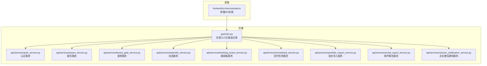
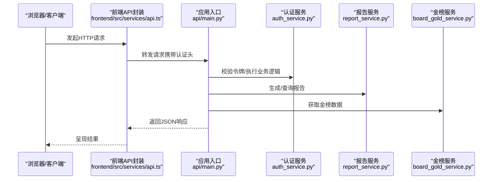
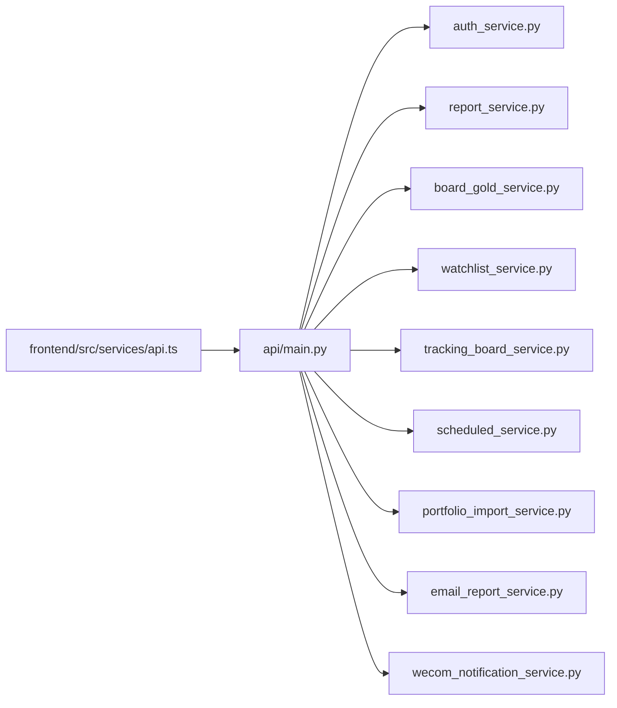

# API参考文档

<cite>
**本文档引用的文件**
- [api/main.py](file://api/main.py)
- [api/services/auth_service.py](file://api/services/auth_service.py)
- [api/services/report_service.py](file://api/services/report_service.py)
- [api/services/board_gold_service.py](file://api/services/board_gold_service.py)
- [api/services/watchlist_service.py](file://api/services/watchlist_service.py)
- [api/services/tracking_board_service.py](file://api/services/tracking_board_service.py)
- [api/services/scheduled_service.py](file://api/services/scheduled_service.py)
- [api/services/portfolio_import_service.py](file://api/services/portfolio_import_service.py)
- [api/services/email_report_service.py](file://api/services/email_report_service.py)
- [api/services/wecom_notification_service.py](file://api/services/wecom_notification_service.py)
- [frontend/src/services/api.ts](file://frontend/src/services/api.ts)
- [tests/test_api_smoke.py](file://tests/test_api_smoke.py)
- [tests/test_board_gold_api.py](file://tests/test_board_gold_api.py)
</cite>

## 目录
1. [简介](#简介)
2. [项目结构](#项目结构)
3. [核心组件](#核心组件)
4. [架构总览](#架构总览)
5. [详细组件分析](#详细组件分析)
6. [依赖关系分析](#依赖关系分析)
7. [性能与扩展性](#性能与扩展性)
8. [故障排查指南](#故障排查指南)
9. [结论](#结论)
10. [附录](#附录)

## 简介
本API参考文档面向TradingAgents-AShare后端服务，系统化梳理RESTful接口规范，覆盖用户认证、股票分析、报告生成、数据查询与管理等模块。文档提供端点清单、HTTP方法、URL模式、请求/响应结构、认证方式、错误码说明，并给出cURL示例与客户端集成建议。同时包含API版本控制策略、速率限制与安全注意事项，以及测试与调试技巧。

## 项目结构
后端API由主应用入口统一注册路由，业务逻辑封装在独立的服务模块中；前端通过统一的API服务层调用后端接口。

**图表来源**
- [api/main.py](file://api/main.py)
- [api/services/auth_service.py](file://api/services/auth_service.py)
- [api/services/report_service.py](file://api/services/report_service.py)
- [api/services/board_gold_service.py](file://api/services/board_gold_service.py)
- [api/services/watchlist_service.py](file://api/services/watchlist_service.py)
- [api/services/tracking_board_service.py](file://api/services/tracking_board_service.py)
- [api/services/scheduled_service.py](file://api/services/scheduled_service.py)
- [api/services/portfolio_import_service.py](file://api/services/portfolio_import_service.py)
- [api/services/email_report_service.py](file://api/services/email_report_service.py)
- [api/services/wecom_notification_service.py](file://api/services/wecom_notification_service.py)
- [frontend/src/services/api.ts](file://frontend/src/services/api.ts)

**章节来源**
- [api/main.py](file://api/main.py)
- [frontend/src/services/api.ts](file://frontend/src/services/api.ts)

## 核心组件
- 应用入口与路由：负责注册各业务服务的路由端点，统一处理跨域、日志与异常。
- 认证服务：提供登录、登出、令牌刷新与权限校验能力。
- 报告服务：生成与查询各类分析报告。
- 金榜服务：提供市场热点榜单与相关数据。
- 自选服务：管理用户关注的股票列表。
- 跟踪板服务：展示与更新跟踪面板数据。
- 定时任务服务：调度与管理周期性任务。
- 组合导入服务：支持外部投资组合数据导入。
- 邮件报告服务：按计划发送邮件报告。
- 企业微信通知服务：推送消息到企业微信群。

**章节来源**
- [api/main.py](file://api/main.py)
- [api/services/auth_service.py](file://api/services/auth_service.py)
- [api/services/report_service.py](file://api/services/report_service.py)
- [api/services/board_gold_service.py](file://api/services/board_gold_service.py)
- [api/services/watchlist_service.py](file://api/services/watchlist_service.py)
- [api/services/tracking_board_service.py](file://api/services/tracking_board_service.py)
- [api/services/scheduled_service.py](file://api/services/scheduled_service.py)
- [api/services/portfolio_import_service.py](file://api/services/portfolio_import_service.py)
- [api/services/email_report_service.py](file://api/services/email_report_service.py)
- [api/services/wecom_notification_service.py](file://api/services/wecom_notification_service.py)

## 架构总览
下图展示了从浏览器到后端服务的典型交互路径，以及各服务之间的协作关系。

**图表来源**
- [frontend/src/services/api.ts](file://frontend/src/services/api.ts)
- [api/main.py](file://api/main.py)
- [api/services/auth_service.py](file://api/services/auth_service.py)
- [api/services/report_service.py](file://api/services/report_service.py)
- [api/services/board_gold_service.py](file://api/services/board_gold_service.py)

## 详细组件分析

### 认证API
- 登录
  - 方法与路径：POST /api/auth/login
  - 请求体字段：用户名、密码
  - 成功响应：令牌与用户信息
  - 失败响应：错误码与描述
  - cURL示例：curl -X POST https://your-host/api/auth/login -H "Content-Type: application/json" -d '{"username":"...","password":"..."}'
- 登出
  - 方法与路径：POST /api/auth/logout
  - 需要认证：是
  - 成功响应：无内容
  - cURL示例：curl -X POST https://your-host/api/auth/logout -H "Authorization: Bearer {token}"
- 刷新令牌
  - 方法与路径：POST /api/auth/refresh
  - 需要认证：否（基于旧令牌）
  - 成功响应：新令牌
  - cURL示例：curl -X POST https://your-host/api/auth/refresh -H "Authorization: Bearer {old_token}"

**章节来源**
- [api/services/auth_service.py](file://api/services/auth_service.py)
- [api/main.py](file://api/main.py)

### 股票分析API
- 金榜数据
  - 方法与路径：GET /api/gold-board
  - 查询参数：日期、类型、分页
  - 成功响应：榜单列表
  - cURL示例：curl "https://your-host/api/gold-board?date=YYYY-MM-DD&type=top&page=1&size=20"
- 金榜详情
  - 方法与路径：GET /api/gold-board/{id}
  - 路径参数：id
  - 成功响应：单条榜单记录
  - cURL示例：curl https://your-host/api/gold-board/123
- 自选列表
  - 方法与路径：GET /api/watchlist
  - 需要认证：是
  - 查询参数：包含股票代码、名称过滤
  - 成功响应：自选列表
  - cURL示例：curl https://your-host/api/watchlist -H "Authorization: Bearer {token}"
- 自选新增/删除
  - 方法与路径：POST /api/watchlist/add, POST /api/watchlist/remove
  - 需要认证：是
  - 请求体字段：股票代码
  - 成功响应：操作结果
  - cURL示例：curl -X POST https://your-host/api/watchlist/add -H "Authorization: Bearer {token}" -H "Content-Type: application/json" -d '{"code":"..."}'

**章节来源**
- [api/services/board_gold_service.py](file://api/services/board_gold_service.py)
- [api/services/watchlist_service.py](file://api/services/watchlist_service.py)
- [api/main.py](file://api/main.py)

### 报告生成API
- 创建报告
  - 方法与路径：POST /api/reports
  - 需要认证：是
  - 请求体字段：标题、内容模板、目标受众
  - 成功响应：报告ID与状态
  - cURL示例：curl -X POST https://your-host/api/reports -H "Authorization: Bearer {token}" -H "Content-Type: application/json" -d '{"title":"...","template":"...","audience":"..."}'
- 查询报告
  - 方法与路径：GET /api/reports
  - 需要认证：是
  - 查询参数：状态、时间范围、分页
  - 成功响应：报告列表
  - cURL示例：curl "https://your-host/api/reports?status=pending&page=1&size=20"
- 报告详情
  - 方法与路径：GET /api/reports/{id}
  - 路径参数：id
  - 成功响应：报告内容
  - cURL示例：curl https://your-host/api/reports/123 -H "Authorization: Bearer {token}"
- 删除报告
  - 方法与路径：DELETE /api/reports/{id}
  - 路径参数：id
  - 需要认证：是
  - 成功响应：无内容
  - cURL示例：curl -X DELETE https://your-host/api/reports/123 -H "Authorization: Bearer {token}"

**章节来源**
- [api/services/report_service.py](file://api/services/report_service.py)
- [api/main.py](file://api/main.py)

### 数据查询API
- 跟踪板数据
  - 方法与路径：GET /api/tracking-board
  - 需要认证：是
  - 查询参数：日期、指标类型
  - 成功响应：跟踪板数据
  - cURL示例：curl "https://your-host/api/tracking-board?date=YYYY-MM-DD&type=metrics&page=1&size=50"
- 跟踪板详情
  - 方法与路径：GET /api/tracking-board/{id}
  - 路径参数：id
  - 成功响应：单条记录
  - cURL示例：curl https://your-host/api/tracking-board/123 -H "Authorization: Bearer {token}"
- 定时任务查询
  - 方法与路径：GET /api/scheduled-jobs
  - 需要认证：是
  - 查询参数：状态、类型、分页
  - 成功响应：任务列表
  - cURL示例：curl "https://your-host/api/scheduled-jobs?status=running&type=daily&page=1&size=20"

**章节来源**
- [api/services/tracking_board_service.py](file://api/services/tracking_board_service.py)
- [api/services/scheduled_service.py](file://api/services/scheduled_service.py)
- [api/main.py](file://api/main.py)

### 管理API
- 组合导入
  - 方法与路径：POST /api/portfolio/import
  - 需要认证：是
  - 请求体字段：文件或JSON数据
  - 成功响应：导入统计
  - cURL示例：curl -X POST https://your-host/api/portfolio/import -H "Authorization: Bearer {token}" -H "Content-Type: application/json" -d '{"data": "..."}'
- 邮件报告配置
  - 方法与路径：POST /api/email-report/config
  - 需要认证：是
  - 请求体字段：收件人、频率、主题模板
  - 成功响应：配置确认
  - cURL示例：curl -X POST https://your-host/api/email-report/config -H "Authorization: Bearer {token}" -H "Content-Type: application/json" -d '{"recipients":["..."],"frequency":"daily","subject_template":"..."}'
- 企业微信通知
  - 方法与路径：POST /api/wecom/notify
  - 需要认证：是
  - 请求体字段：消息内容、接收群组
  - 成功响应：发送结果
  - cURL示例：curl -X POST https://your-host/api/wecom/notify -H "Authorization: Bearer {token}" -H "Content-Type: application/json" -d '{"content":"...","group":"..."}'

**章节来源**
- [api/services/portfolio_import_service.py](file://api/services/portfolio_import_service.py)
- [api/services/email_report_service.py](file://api/services/email_report_service.py)
- [api/services/wecom_notification_service.py](file://api/services/wecom_notification_service.py)
- [api/main.py](file://api/main.py)

### 错误码与语义
- 通用错误格式：{ "code": "错误码", "message": "错误描述", "details": "可选细节" }
- 常见错误码：
  - 400：请求参数无效或缺失
  - 401：未认证或令牌无效
  - 403：权限不足
  - 404：资源不存在
  - 429：请求过于频繁（限流）
  - 500：服务器内部错误
- 建议：客户端应根据错误码进行重试、提示或引导用户重新登录

**章节来源**
- [api/main.py](file://api/main.py)

## 依赖关系分析
后端服务通过统一入口注册路由，前端通过API封装层调用后端。各服务模块职责清晰，耦合度低，便于扩展与维护。

**图表来源**
- [frontend/src/services/api.ts](file://frontend/src/services/api.ts)
- [api/main.py](file://api/main.py)
- [api/services/auth_service.py](file://api/services/auth_service.py)
- [api/services/report_service.py](file://api/services/report_service.py)
- [api/services/board_gold_service.py](file://api/services/board_gold_service.py)
- [api/services/watchlist_service.py](file://api/services/watchlist_service.py)
- [api/services/tracking_board_service.py](file://api/services/tracking_board_service.py)
- [api/services/scheduled_service.py](file://api/services/scheduled_service.py)
- [api/services/portfolio_import_service.py](file://api/services/portfolio_import_service.py)
- [api/services/email_report_service.py](file://api/services/email_report_service.py)
- [api/services/wecom_notification_service.py](file://api/services/wecom_notification_service.py)

## 性能与扩展性
- 连接池与数据库访问：建议在数据库层启用连接池，避免频繁建立/释放连接。
- 缓存策略：对热点榜单与报告元数据增加缓存，降低重复计算与IO压力。
- 异步任务：将耗时操作（如邮件发送、报告生成）放入队列异步执行，提升吞吐量。
- 分页与限流：默认分页大小建议限制在合理范围，结合IP/令牌维度实施限流。
- 监控与日志：统一接入日志与指标监控，定位慢查询与异常请求。

[本节为通用指导，无需列出具体文件来源]

## 故障排查指南
- 常见问题
  - 401未认证：检查Authorization头是否正确传递，令牌是否过期
  - 403权限不足：确认用户角色与资源访问权限
  - 404资源不存在：核对路径参数与ID是否存在
  - 429限流：降低请求频率或申请更高配额
  - 500服务器错误：查看后端日志，定位异常堆栈
- 测试与调试
  - 使用提供的测试用例快速验证端点可用性
  - 使用cURL手动构造请求，逐步缩小问题范围
  - 在本地开发环境开启详细日志，捕获请求/响应上下文
- 参考测试文件
  - 端点冒烟测试：tests/test_api_smoke.py
  - 金榜端点专项测试：tests/test_board_gold_api.py

**章节来源**
- [tests/test_api_smoke.py](file://tests/test_api_smoke.py)
- [tests/test_board_gold_api.py](file://tests/test_board_gold_api.py)

## 结论
本文档提供了TradingAgents-AShare后端API的完整参考，涵盖认证、分析、报告、查询与管理等模块。建议在生产环境中结合限流、缓存与异步机制优化性能，并通过统一的日志与监控体系保障稳定性。客户端应遵循错误码语义与鉴权流程，确保安全与可靠的数据交互。

[本节为总结性内容，无需列出具体文件来源]

## 附录

### API版本控制
- 版本策略：采用路径前缀版本化，如 /api/v1/...，未来升级时新增 /api/v2/...
- 兼容性：v1保持向后兼容，变更仅在v2引入破坏性修改
- 升级指引：客户端需在迁移期间同时支持多个版本，逐步切换至最新版本

[本节为通用指导，无需列出具体文件来源]

### 速率限制
- 默认策略：每分钟请求数限制（例如：120次/分钟），超限返回429
- 维度：基于IP与令牌维度分别计数
- 解决方案：客户端实现指数退避重试与批量合并请求

[本节为通用指导，无需列出具体文件来源]

### 安全考虑
- 传输安全：强制HTTPS，TLS 1.2+以上
- 鉴权：Bearer令牌，短有效期+刷新令牌机制
- 输入校验：严格校验参数类型、长度与范围
- 日志脱敏：避免记录敏感字段（密码、令牌）

[本节为通用指导，无需列出具体文件来源]

### 客户端集成指南
- 初始化：设置基础URL与全局请求头（Authorization）
- 错误处理：针对不同错误码执行相应策略（重试/提示/跳转登录）
- 会话管理：自动刷新令牌，失败时引导用户重新登录
- 调试建议：开启请求日志，保存最近一次请求/响应以便排障

**章节来源**
- [frontend/src/services/api.ts](file://frontend/src/services/api.ts)