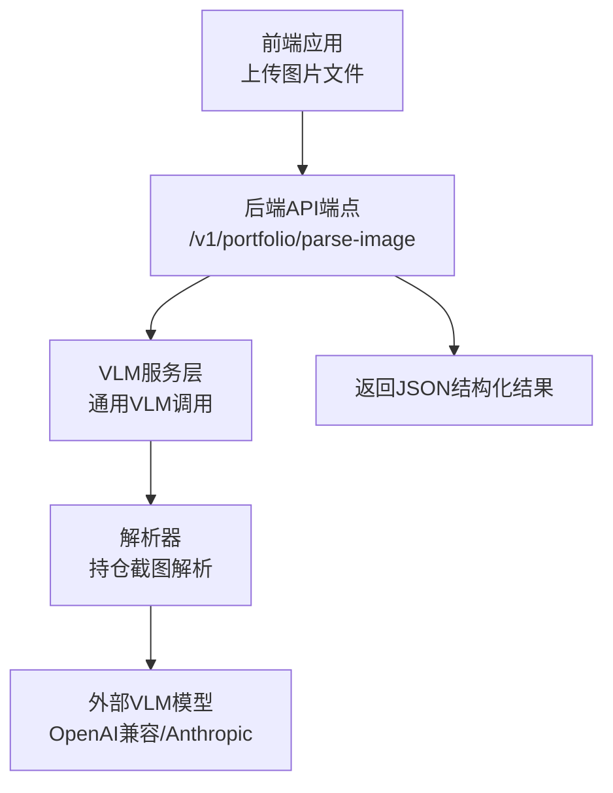
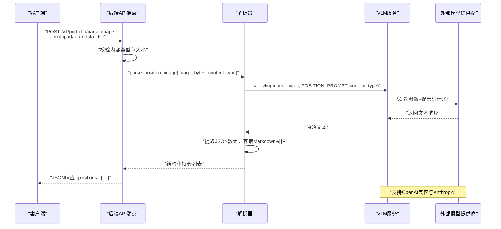
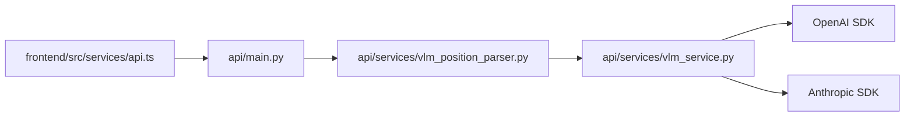

# VLM分析API

<cite>
**本文档引用的文件**
- [api/services/vlm_service.py](file://api/services/vlm_service.py)
- [api/services/vlm_position_parser.py](file://api/services/vlm_position_parser.py)
- [api/main.py](file://api/main.py)
- [frontend/src/services/api.ts](file://frontend/src/services/api.ts)
- [tests/test_vlm_position_parser.py](file://tests/test_vlm_position_parser.py)
</cite>

## 目录
1. [简介](#简介)
2. [项目结构](#项目结构)
3. [核心组件](#核心组件)
4. [架构总览](#架构总览)
5. [详细组件分析](#详细组件分析)
6. [依赖分析](#依赖分析)
7. [性能考虑](#性能考虑)
8. [故障排查指南](#故障排查指南)
9. [结论](#结论)
10. [附录](#附录)

## 简介
本文件面向TradingAgents-AShare项目的VLM（Vision-Language Model）分析能力，系统性说明基于视觉与语言模型的图像解析API的设计与实现。重点覆盖以下方面：
- 请求处理流程：从客户端上传图片到服务端调用VLM模型，再到结果解析与输出。
- 输入要求：图像数据格式、内容类型、提示词（prompt）与分析指令。
- 输出格式：解析后的结构化数据结构，包括股票代码、名称、持仓数量、成本价与市值等字段。
- 配置选项：通过环境变量进行的模型提供商、基础URL、模型名、是否发送原始Base64等参数设置。
- 性能参数与质量控制：最大token数、日志记录、错误处理与降级策略。
- 图像预处理建议、参数调优与结果验证方法。

## 项目结构
VLM分析功能由三层组成：
- 前端层：负责文件选择与表单提交，调用后端解析接口。
- 后端API层：接收图片文件，校验类型与大小，触发解析流程。
- 服务层：封装通用VLM调用与特定任务（如持仓截图解析）的结果解析逻辑。

图表来源
- [api/main.py:4165-4188](file://api/main.py#L4165-L4188)
- [api/services/vlm_service.py:33-46](file://api/services/vlm_service.py#L33-L46)
- [api/services/vlm_position_parser.py:29-35](file://api/services/vlm_position_parser.py#L29-L35)

章节来源
- [api/main.py:4165-4188](file://api/main.py#L4165-L4188)
- [frontend/src/services/api.ts:279-296](file://frontend/src/services/api.ts#L279-L296)

## 核心组件
- 通用VLM服务：封装配置加载、图像编码、消息构造与模型调用，支持OpenAI兼容与Anthropic两种提供商。
- 持仓截图解析器：基于通用VLM服务，注入针对A股持仓截图的提示词，解析出结构化持仓数据，并对异常响应进行容错处理。
- 后端API端点：提供HTTP接口，接收图片文件，执行类型与大小校验，异步调用解析器并返回结果。
- 前端API服务：封装fetch请求，支持上传文件并获取解析结果。

章节来源
- [api/services/vlm_service.py:20-46](file://api/services/vlm_service.py#L20-L46)
- [api/services/vlm_position_parser.py:15-35](file://api/services/vlm_position_parser.py#L15-L35)
- [api/main.py:4165-4188](file://api/main.py#L4165-L4188)
- [frontend/src/services/api.ts:279-296](file://frontend/src/services/api.ts#L279-L296)

## 架构总览
下图展示从用户上传图片到返回结构化持仓数据的完整链路：

图表来源
- [api/main.py:4165-4188](file://api/main.py#L4165-L4188)
- [api/services/vlm_position_parser.py:29-35](file://api/services/vlm_position_parser.py#L29-L35)
- [api/services/vlm_service.py:33-46](file://api/services/vlm_service.py#L33-L46)

## 详细组件分析

### 通用VLM服务（vlm_service.py）
- 功能职责
  - 加载环境变量配置（提供商、API密钥、基础URL、模型名）。
  - 将二进制图像编码为Base64，按配置决定发送原始Base64或带data URI前缀的格式。
  - 统一构造消息体，分别适配OpenAI兼容与Anthropic两种调用方式。
  - 返回模型原始文本响应，并记录首段日志便于调试。

- 关键配置项（环境变量）
  - TA_VLM_API_KEY：必需，用于鉴权。
  - TA_VLM_BASE_URL：可选，默认指向特定PaaS接口。
  - TA_VLM_MODEL：可选，默认模型名。
  - TA_VLM_PROVIDER：可选，"openai"或"anthropic"。
  - TA_VLM_RAW_BASE64：可选，"1"表示发送原始Base64，"0"表示带data URI前缀。

- 调用流程
  - 选择提供商分支，构造消息内容，调用对应SDK接口。
  - 设置最大token数上限，避免过长输出。
  - 记录响应片段日志，便于问题定位。

章节来源
- [api/services/vlm_service.py:3-9](file://api/services/vlm_service.py#L3-L9)
- [api/services/vlm_service.py:20-30](file://api/services/vlm_service.py#L20-L30)
- [api/services/vlm_service.py:33-46](file://api/services/vlm_service.py#L33-L46)
- [api/services/vlm_service.py:49-70](file://api/services/vlm_service.py#L49-L70)
- [api/services/vlm_service.py:73-88](file://api/services/vlm_service.py#L73-L88)

### 持仓截图解析器（vlm_position_parser.py）
- 功能职责
  - 定义针对A股持仓截图的提示词，要求返回JSON数组，包含股票代码、名称、当前持仓、成本价与市值等字段。
  - 调用通用VLM服务获取原始文本响应。
  - 解析响应文本，容忍Markdown围栏标记，过滤非JSON与无效条目，统一输出结构化列表。

- 输出数据结构
  - symbol：股票代码（字符串，6位数字）。
  - name：股票名称（字符串）。
  - current_position：当前持仓（整数或null）。
  - average_cost：平均成本（浮点数或null）。
  - market_value：持仓市值（浮点数或null）。

- 错误处理与质量控制
  - 忽略无符号或非列表的响应。
  - 对无法解析为JSON的文本进行告警并返回空列表。
  - 对数值字段进行安全转换，非数值转为null。

章节来源
- [api/services/vlm_position_parser.py:15-26](file://api/services/vlm_position_parser.py#L15-L26)
- [api/services/vlm_position_parser.py:29-35](file://api/services/vlm_position_parser.py#L29-L35)
- [api/services/vlm_position_parser.py:38-68](file://api/services/vlm_position_parser.py#L38-L68)
- [api/services/vlm_position_parser.py:71-78](file://api/services/vlm_position_parser.py#L71-L78)

### 后端API端点（main.py）
- 接口定义
  - 方法与路径：POST /v1/portfolio/parse-image
  - 请求体：multipart/form-data，字段名为file；仅允许image/*类型。
  - 限制：单张图片不超过10MB。
  - 响应：JSON对象，包含positions字段，值为解析得到的持仓列表。

- 处理流程
  - 校验文件类型与大小。
  - 异步执行解析（使用线程池以避免阻塞IO）。
  - 捕获配置缺失、运行时异常与通用错误，返回相应HTTP状态码与错误信息。

章节来源
- [api/main.py:4165-4188](file://api/main.py#L4165-L4188)

### 前端API服务（api.ts）
- 接口定义
  - 方法与路径：POST /v1/portfolio/parse-image
  - 请求体：FormData，包含file字段。
  - 响应：JSON对象，包含positions字段。

- 行为说明
  - 自动添加认证头（若存在）。
  - 对非JSON响应进行文本回退处理。
  - 对错误状态抛出可读异常。

章节来源
- [frontend/src/services/api.ts:279-296](file://frontend/src/services/api.ts#L279-L296)

## 依赖分析
- 组件耦合
  - vlm_position_parser依赖vlm_service进行模型调用。
  - main端点依赖vlm_position_parser进行业务解析。
  - 前端通过api.ts间接依赖后端端点。
- 外部依赖
  - OpenAI SDK（OpenAI兼容提供商）。
  - Anthropic SDK（Anthropic提供商）。
- 可能的循环依赖
  - 当前模块间为单向依赖，无循环导入风险。

图表来源
- [api/main.py:4165-4188](file://api/main.py#L4165-L4188)
- [api/services/vlm_position_parser.py](file://api/services/vlm_position_parser.py#L11)
- [api/services/vlm_service.py](file://api/services/vlm_service.py#L50)
- [api/services/vlm_service.py](file://api/services/vlm_service.py#L74)

## 性能考虑
- 最大token数：默认上限为2000，避免超长响应导致延迟与成本上升。
- 图像大小限制：后端限制单图不超过10MB，有助于控制网络传输与模型处理时间。
- 异步执行：解析在独立线程中执行，避免阻塞主事件循环。
- 日志采样：仅记录响应前300字符，降低日志体积与I/O开销。
- Base64发送策略：可通过环境变量选择原始Base64或带data URI前缀，影响网络负载与兼容性。

章节来源
- [api/services/vlm_service.py](file://api/services/vlm_service.py#L66)
- [api/main.py:4177-4178](file://api/main.py#L4177-L4178)
- [api/services/vlm_service.py:55-56](file://api/services/vlm_service.py#L55-L56)

## 故障排查指南
- 常见错误与原因
  - 未配置API Key：环境变量TA_VLM_API_KEY为空，将抛出配置错误。
  - 文件类型不支持：content_type非image/*，返回400。
  - 文件过大：超过10MB，返回400。
  - VLM调用失败：通用异常捕获为500，前端显示“图片解析失败，请稍后重试”。
  - JSON解析失败：解析器对非JSON或Markdown围栏响应进行容错，返回空列表并记录警告日志。
- 调试步骤
  - 检查环境变量配置是否正确。
  - 查看后端日志中VLM响应片段（前300字符）。
  - 使用测试用例验证解析逻辑（含Markdown围栏、空数组、无效JSON等场景）。
- 参数调优建议
  - 若网络不稳定，尝试将TA_VLM_RAW_BASE64设为"0"以使用data URI前缀，提升兼容性。
  - 如需更高精度，可调整模型名（TA_VLM_MODEL），但需确保提供商支持。
  - 控制提示词长度与复杂度，减少token消耗与响应时间。

章节来源
- [api/services/vlm_service.py:22-24](file://api/services/vlm_service.py#L22-L24)
- [api/main.py:4173-4178](file://api/main.py#L4173-L4178)
- [api/main.py:4182-4186](file://api/main.py#L4182-L4186)
- [api/services/vlm_position_parser.py:47-49](file://api/services/vlm_position_parser.py#L47-L49)
- [tests/test_vlm_position_parser.py:6-64](file://tests/test_vlm_position_parser.py#L6-L64)

## 结论
VLM分析API通过清晰的分层设计实现了从图像到结构化数据的自动化处理。通用VLM服务提供了灵活的配置与多提供商支持，解析器专注于A股持仓截图的结构化解析，并具备良好的容错能力。结合前端上传与后端异步处理，整体具备较好的可用性与扩展性。后续可在提示词工程、模型选择与网络优化等方面持续迭代。

## 附录

### 输入要求
- 图像数据
  - 类型：仅支持image/*。
  - 大小：不超过10MB。
  - 编码：服务端自动进行Base64编码；发送格式由TA_VLM_RAW_BASE64控制。
- 文本描述与分析指令
  - 通过提示词（prompt）传递给VLM服务；解析器已内置针对A股持仓截图的提示词。
- 内容类型
  - content_type参数需与实际图像类型一致（如image/png、image/jpeg）。

章节来源
- [api/main.py:4173-4178](file://api/main.py#L4173-L4178)
- [api/services/vlm_position_parser.py:15-26](file://api/services/vlm_position_parser.py#L15-L26)
- [api/services/vlm_service.py:55-56](file://api/services/vlm_service.py#L55-L56)

### 输出格式
- 结构化数据字段
  - symbol：股票代码（字符串）。
  - name：股票名称（字符串）。
  - current_position：当前持仓（整数或null）。
  - average_cost：平均成本（浮点数或null）。
  - market_value：持仓市值（浮点数或null）。
- 返回示例
  - 成功：{"positions": [{"symbol": "...", "name": "...", "current_position": ..., "average_cost": ..., "market_value": ...}, ...]}
  - 无识别结果：{"positions": []}

章节来源
- [api/services/vlm_position_parser.py:15-26](file://api/services/vlm_position_parser.py#L15-L26)
- [api/services/vlm_position_parser.py:38-68](file://api/services/vlm_position_parser.py#L38-L68)
- [api/main.py](file://api/main.py#L4188)

### 模型配置选项与性能参数
- 环境变量
  - TA_VLM_API_KEY：必需，模型提供商API密钥。
  - TA_VLM_BASE_URL：可选，基础URL，默认指向特定PaaS接口。
  - TA_VLM_MODEL：可选，模型名，默认模型名。
  - TA_VLM_PROVIDER：可选，"openai"或"anthropic"。
  - TA_VLM_RAW_BASE64：可选，"1"发送原始Base64，"0"发送带data URI前缀。
- 性能参数
  - 最大token数：2000。
  - 图像大小限制：10MB。
  - 日志采样：响应前300字符。

章节来源
- [api/services/vlm_service.py:3-9](file://api/services/vlm_service.py#L3-L9)
- [api/services/vlm_service.py:20-30](file://api/services/vlm_service.py#L20-L30)
- [api/services/vlm_service.py:55-66](file://api/services/vlm_service.py#L55-L66)
- [api/main.py:4177-4178](file://api/main.py#L4177-L4178)

### 图像预处理指南
- 建议
  - 确保截图清晰、完整，避免模糊、遮挡或旋转。
  - 优先截取包含表格或列表的完整页面，便于模型识别关键字段。
  - 控制图像尺寸与分辨率，尽量在满足识别需求的前提下减小文件体积。
  - 保持背景简洁，避免过多干扰元素。

### 分析参数调优
- 提示词优化：根据具体截图样式微调提示词，明确字段边界与格式约束。
- 模型选择：根据准确率与速度需求选择合适模型名。
- 发送格式：在网络兼容性与性能之间平衡，合理设置TA_VLM_RAW_BASE64。

### 结果验证方法
- 单元测试参考
  - 验证正常JSON数组、空数组、Markdown围栏、无效JSON与缺失symbol条目的处理。
- 端到端验证
  - 使用真实截图样本，检查输出字段完整性与数值类型一致性。
- 日志与监控
  - 关注VLM响应日志与解析器警告日志，及时发现异常模式。

章节来源
- [tests/test_vlm_position_parser.py:6-64](file://tests/test_vlm_position_parser.py#L6-L64)