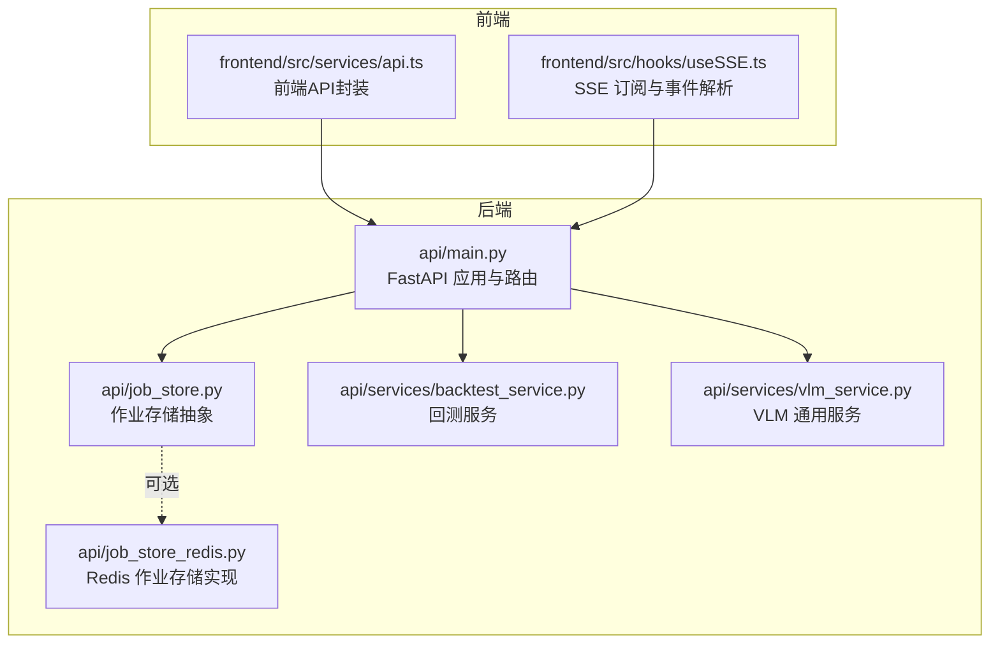
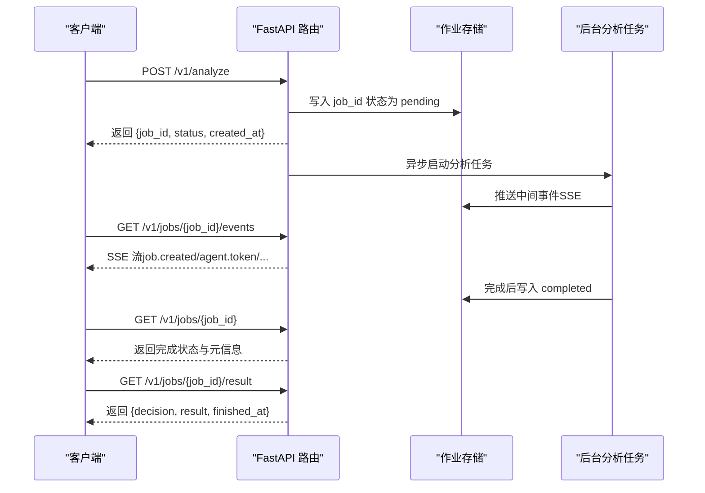
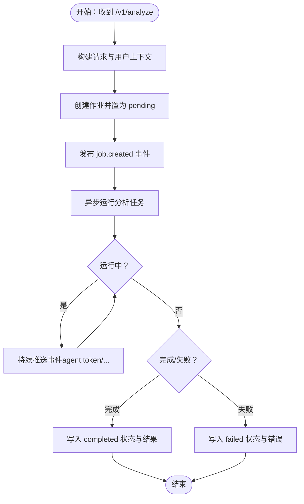
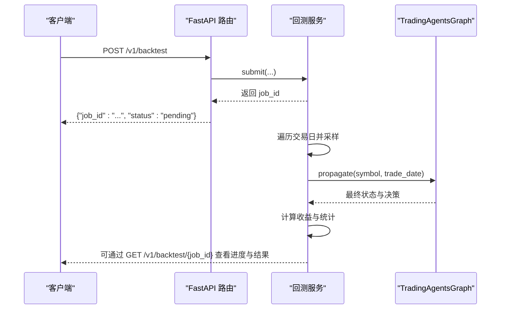
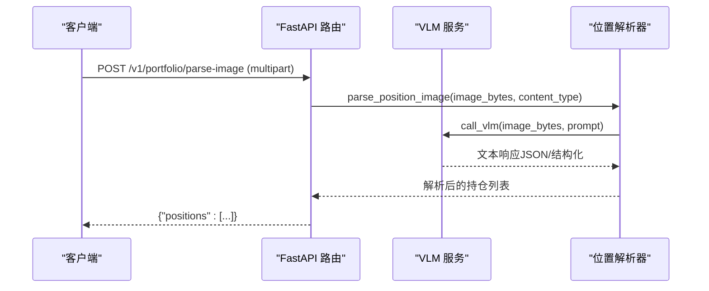
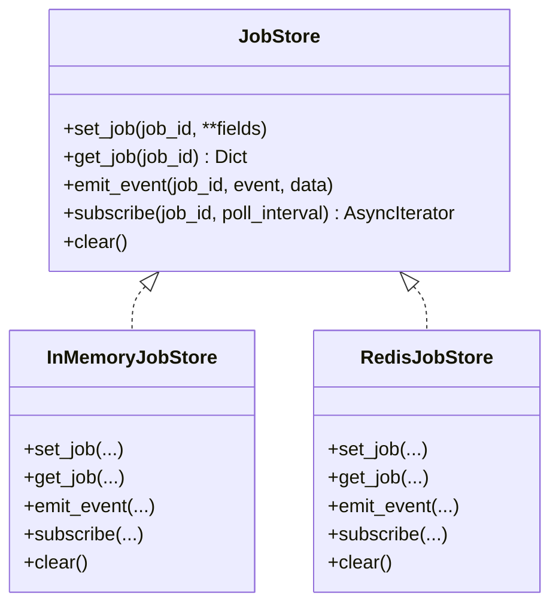
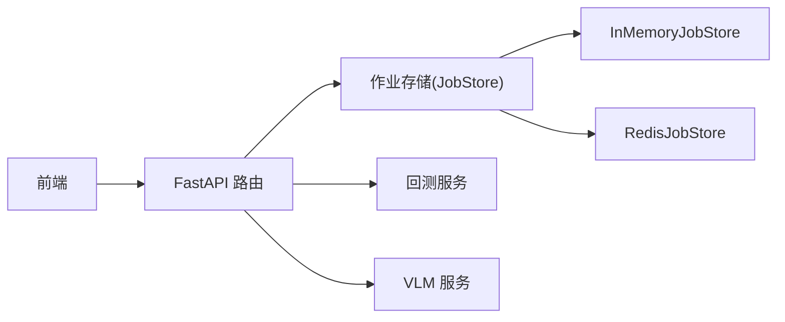

# 分析API

<cite>
**本文引用的文件**
- [api/main.py](file://api/main.py)
- [api/job_store.py](file://api/job_store.py)
- [api/job_store_redis.py](file://api/job_store_redis.py)
- [api/services/backtest_service.py](file://api/services/backtest_service.py)
- [api/services/vlm_service.py](file://api/services/vlm_service.py)
- [frontend/src/services/api.ts](file://frontend/src/services/api.ts)
- [frontend/src/hooks/useSSE.ts](file://frontend/src/hooks/useSSE.ts)
- [tests/test_api_smoke.py](file://tests/test_api_smoke.py)
</cite>

## 目录
1. [简介](#简介)
2. [项目结构](#项目结构)
3. [核心组件](#核心组件)
4. [架构总览](#架构总览)
5. [详细组件分析](#详细组件分析)
6. [依赖分析](#依赖分析)
7. [性能考虑](#性能考虑)
8. [故障排查指南](#故障排查指南)
9. [结论](#结论)
10. [附录](#附录)

## 简介
本文件为 TradingAgents-AShare 的“股票分析API”参考文档，覆盖以下能力：
- 股票分析触发与进度查询（同步/异步）
- 回测执行与状态查询
- VLM 图像解析（持仓截图识别）
- 任务创建、状态跟踪、事件流与结果获取流程
- 请求参数、响应格式、进度回调与错误处理
- 分析配置选项、时间范围设置与输出格式说明
- 实际请求示例与结果解析指引

## 项目结构
围绕分析API的关键模块与文件如下：
- 后端主入口与路由：api/main.py
- 作业存储抽象与实现：api/job_store.py、api/job_store_redis.py
- 回测服务：api/services/backtest_service.py
- VLM 通用服务与前端集成：api/services/vlm_service.py、frontend/src/services/api.ts、frontend/src/hooks/useSSE.ts
- 单元测试与OpenAPI校验：tests/test_api_smoke.py

图表来源
- [api/main.py](file://api/main.py)
- [api/job_store.py](file://api/job_store.py)
- [api/job_store_redis.py](file://api/job_store_redis.py)
- [api/services/backtest_service.py](file://api/services/backtest_service.py)
- [api/services/vlm_service.py](file://api/services/vlm_service.py)
- [frontend/src/services/api.ts](file://frontend/src/services/api.ts)
- [frontend/src/hooks/useSSE.ts](file://frontend/src/hooks/useSSE.ts)

章节来源
- [api/main.py](file://api/main.py)
- [api/job_store.py](file://api/job_store.py)
- [api/job_store_redis.py](file://api/job_store_redis.py)
- [api/services/backtest_service.py](file://api/services/backtest_service.py)
- [api/services/vlm_service.py](file://api/services/vlm_service.py)
- [frontend/src/services/api.ts](file://frontend/src/services/api.ts)
- [frontend/src/hooks/useSSE.ts](file://frontend/src/hooks/useSSE.ts)

## 核心组件
- 分析任务生命周期
  - 创建：POST /v1/analyze
  - 进度查询：GET /v1/jobs/{job_id}
  - 结果获取：GET /v1/jobs/{job_id}/result
  - 事件流：GET /v1/jobs/{job_id}/events（SSE）
- 回测任务生命周期
  - 提交：POST /v1/backtest
  - 列表：GET /v1/backtest
  - 查询：GET /v1/backtest/{job_id}
  - 删除：DELETE /v1/backtest/{job_id}
- VLM 图像解析
  - 持仓截图解析：POST /v1/portfolio/parse-image
- 作业存储
  - 内存实现：InMemoryJobStore
  - Redis 实现：RedisJobStore（可选）

章节来源
- [api/main.py](file://api/main.py)
- [api/job_store.py](file://api/job_store.py)
- [api/job_store_redis.py](file://api/job_store_redis.py)
- [api/services/backtest_service.py](file://api/services/backtest_service.py)
- [api/services/vlm_service.py](file://api/services/vlm_service.py)

## 架构总览
分析API采用“异步作业 + SSE 事件流”的模式：
- 客户端提交分析请求后立即返回 job_id
- 后台任务运行分析，通过事件通道推送阶段性状态
- 客户端通过 SSE 订阅实时更新，完成后通过 /v1/jobs/{job_id}/result 获取最终结果

图表来源
- [api/main.py](file://api/main.py)
- [api/job_store.py](file://api/job_store.py)

## 详细组件分析

### 分析触发与进度查询
- 触发分析
  - 方法与路径：POST /v1/analyze
  - 请求体：AnalyzeRequest（见下节“请求参数”）
  - 响应体：AnalyzeResponse
  - 行为：创建 job、发布 job.created 事件、异步运行分析
- 进度查询
  - 方法与路径：GET /v1/jobs/{job_id}
  - 响应体：JobStatusResponse
  - 字段包含：状态、时间戳、标的、日期、错误、代理列表、当前周期、并发统计等
- 结果获取
  - 方法与路径：GET /v1/jobs/{job_id}/result
  - 响应体：字典，包含 job_id、status、decision、result、finished_at
  - 注意：非 completed 状态会返回 409
- 事件流（SSE）
  - 方法与路径：GET /v1/jobs/{job_id}/events
  - 支持事件类型：job.created、agent.token、ping 等
  - 前端订阅与解析参见 useSSE.ts

请求参数（AnalyzeRequest）
- symbol：股票代码（如 600519.SH），可省略（由 query 解析）
- trade_date：交易日期 YYYY-MM-DD，默认今日
- query：自然语言查询（如“分析贵州茅台短线机会”）
- horizons：分析周期列表（如 ["short"] 或 ["short","medium"]）
- selected_analysts：分析师集合（默认全量）
- config_overrides：运行时配置覆盖（允许键见“运行时配置”）
- dry_run：是否仅预演（不持久化结果）
- user_intent：预解析的用户意图（由聊天接口注入）
- 用户上下文字段：objective、risk_profile、investment_horizon、cash_available、current_position、current_position_pct、average_cost、max_loss_pct、constraints、user_notes

响应格式
- AnalyzeResponse：{job_id, status, created_at}
- JobStatusResponse：{job_id, status, created_at, started_at, finished_at, symbol, trade_date, error, agents, current_horizon, waiting_ahead_count, scheduled_running_count, scheduled_concurrency_limit}
- 事件流：SSE，事件名与数据结构由后端事件生成器定义

进度回调与错误处理
- SSE ping：当长时间无事件时，后端发送 ping 保持连接
- 终止事件：job.completed、job.failed
- 错误：404（job不存在）、409（未完成即取结果）

图表来源
- [api/main.py](file://api/main.py)

章节来源
- [api/main.py](file://api/main.py)
- [tests/test_api_smoke.py](file://tests/test_api_smoke.py)
- [frontend/src/hooks/useSSE.ts](file://frontend/src/hooks/useSSE.ts)

### 回测执行
- 提交流程
  - 方法与路径：POST /v1/backtest
  - 请求体：BacktestRequest
    - symbol：标的
    - start_date/end_date：回测起止日期
    - selected_analysts：分析师集合
    - hold_days：持有天数
    - sample_interval：采样间隔（交易日）
    - config_overrides：运行时配置覆盖
  - 响应：{"job_id": "...", "status": "pending"}
- 查询与管理
  - 列表：GET /v1/backtest
  - 查询：GET /v1/backtest/{job_id}
  - 删除：DELETE /v1/backtest/{job_id}

回测内部机制
- 使用 TradingAgentsGraph.propagate 执行单次分析
- 逐个交易日采样，计算买卖信号与区间收益
- 统计胜率、平均回报、最佳/最差回报

图表来源
- [api/main.py](file://api/main.py)
- [api/services/backtest_service.py](file://api/services/backtest_service.py)

章节来源
- [api/main.py](file://api/main.py)
- [api/services/backtest_service.py](file://api/services/backtest_service.py)

### VLM 分析（图像解析）
- 端点
  - POST /v1/portfolio/parse-image
  - 上传图片文件，返回解析出的持仓列表
- VLM 服务
  - 通过环境变量配置：TA_VLM_API_KEY、TA_VLM_BASE_URL、TA_VLM_MODEL、TA_VLM_PROVIDER、TA_VLM_RAW_BASE64
  - 支持 OpenAI 兼容与 Anthropic 两种 Provider
- 前端集成
  - 前端使用 multipart/form-data 上传图片
  - 成功返回 {"positions": [...]}
  - 失败返回错误详情

图表来源
- [api/main.py](file://api/main.py)
- [api/services/vlm_service.py](file://api/services/vlm_service.py)

章节来源
- [api/main.py](file://api/main.py)
- [api/services/vlm_service.py](file://api/services/vlm_service.py)
- [frontend/src/services/api.ts](file://frontend/src/services/api.ts)

### 作业存储与事件分发
- 抽象接口：JobStore（set_job/get_job/emit_event/subscribe/clear）
- 内存实现：InMemoryJobStore（队列容量、TTL清理、溢出丢弃）
- Redis 实现：RedisJobStore（Hash 存状态，Pub/Sub 发布事件）
- SSE 订阅：支持超时 ping、终端事件终止

图表来源
- [api/job_store.py](file://api/job_store.py)
- [api/job_store_redis.py](file://api/job_store_redis.py)

章节来源
- [api/job_store.py](file://api/job_store.py)
- [api/job_store_redis.py](file://api/job_store_redis.py)

## 依赖分析
- 路由到服务
  - /v1/analyze → 后台任务调度与作业存储
  - /v1/jobs/* → 作业状态查询与事件流
  - /v1/backtest/* → 回测服务
  - /v1/portfolio/parse-image → VLM 服务与解析器
- 作业存储耦合
  - 作业状态与事件统一由 JobStore 抽象管理
  - 可按需切换 InMemory 或 Redis 实现
- 前后端交互
  - 前端通过 useSSE.ts 订阅 /v1/jobs/{job_id}/events
  - 前端通过 api.ts 调用分析、回测与图像解析端点

图表来源
- [api/main.py](file://api/main.py)
- [api/job_store.py](file://api/job_store.py)
- [api/job_store_redis.py](file://api/job_store_redis.py)
- [api/services/backtest_service.py](file://api/services/backtest_service.py)
- [api/services/vlm_service.py](file://api/services/vlm_service.py)
- [frontend/src/services/api.ts](file://frontend/src/services/api.ts)
- [frontend/src/hooks/useSSE.ts](file://frontend/src/hooks/useSSE.ts)

章节来源
- [api/main.py](file://api/main.py)
- [api/job_store.py](file://api/job_store.py)
- [api/job_store_redis.py](file://api/job_store_redis.py)
- [api/services/backtest_service.py](file://api/services/backtest_service.py)
- [api/services/vlm_service.py](file://api/services/vlm_service.py)
- [frontend/src/services/api.ts](file://frontend/src/services/api.ts)
- [frontend/src/hooks/useSSE.ts](file://frontend/src/hooks/useSSE.ts)

## 性能考虑
- 线程池与并发
  - 默认 asyncio 默认执行器工作线程数可通过环境变量配置
  - AnyIO 线程限制可根据高并发场景提升
- 作业存储
  - InMemoryJobStore 对 SSE 队列进行容量控制，避免内存膨胀
  - RedisJobStore 使用 Hash 存储状态并设置 TTL，适合多实例部署
- 数据加载
  - 股票映射缓存带 TTL，减少外部依赖访问频率
- 回测
  - 采样间隔与持有天数影响性能与精度，建议根据需求权衡

[本节为通用指导，无需特定文件引用]

## 故障排查指南
- 404 作业不存在
  - 确认 job_id 是否正确，以及是否属于当前用户
- 409 任务未完成
  - 在任务未完成前调用 /v1/jobs/{job_id}/result 会返回 409
- VLM 图像解析失败
  - 检查图片格式与大小限制（前端限制为 ≤10MB）
  - 确认 TA_VLM_* 环境变量配置正确
- SSE 连接中断
  - 后端会定期发送 ping 事件维持连接
  - 若长时间无事件，检查任务是否仍在运行或是否已进入终端状态
- 回测异常
  - 检查回测时间窗与采样间隔设置
  - 关注回测作业返回的 error 字段

章节来源
- [api/main.py](file://api/main.py)
- [api/services/vlm_service.py](file://api/services/vlm_service.py)
- [frontend/src/hooks/useSSE.ts](file://frontend/src/hooks/useSSE.ts)

## 结论
本文档梳理了 TradingAgents-AShare 的分析API：从分析触发、进度查询、事件流到结果获取，再到回测与VLM图像解析的完整链路。通过统一的作业存储与SSE事件机制，系统实现了高并发下的可靠状态跟踪与实时反馈。建议在生产环境中结合 Redis 作业存储与合理的线程池配置，并对回测参数与VLM配置进行审慎设置。

[本节为总结性内容，无需特定文件引用]

## 附录

### 请求与响应规范摘要

- 分析触发（POST /v1/analyze）
  - 请求体：AnalyzeRequest
    - 必填：无（symbol 可由 query 推断）
    - 可选：trade_date、query、horizons、selected_analysts、config_overrides、dry_run、user_intent、用户上下文字段
  - 响应体：AnalyzeResponse
    - 字段：job_id、status、created_at

- 进度查询（GET /v1/jobs/{job_id}）
  - 响应体：JobStatusResponse
  - 字段：job_id、status、created_at、started_at、finished_at、symbol、trade_date、error、agents、current_horizon、等待与并发统计

- 结果获取（GET /v1/jobs/{job_id}/result）
  - 响应体：字典
    - 字段：job_id、status、decision、result、finished_at
  - 非 completed 状态返回 409

- 事件流（GET /v1/jobs/{job_id}/events）
  - 媒体类型：text/event-stream
  - 事件类型：job.created、agent.token、ping、job.completed、job.failed

- 回测（POST /v1/backtest）
  - 请求体：BacktestRequest
    - 字段：symbol、start_date、end_date、selected_analysts、hold_days、sample_interval、config_overrides
  - 响应：{"job_id": "...", "status": "pending"}

- 回测查询与管理
  - 列表：GET /v1/backtest
  - 查询：GET /v1/backtest/{job_id}
  - 删除：DELETE /v1/backtest/{job_id}

- VLM 图像解析（POST /v1/portfolio/parse-image）
  - 请求：multipart/form-data，字段 file
  - 响应：{"positions": [...]}
  - 限制：仅图片、≤10MB

章节来源
- [api/main.py](file://api/main.py)
- [api/services/backtest_service.py](file://api/services/backtest_service.py)
- [api/services/vlm_service.py](file://api/services/vlm_service.py)
- [frontend/src/services/api.ts](file://frontend/src/services/api.ts)
- [frontend/src/hooks/useSSE.ts](file://frontend/src/hooks/useSSE.ts)
- [tests/test_api_smoke.py](file://tests/test_api_smoke.py)