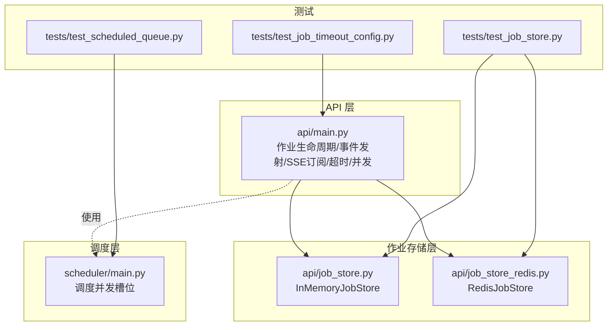
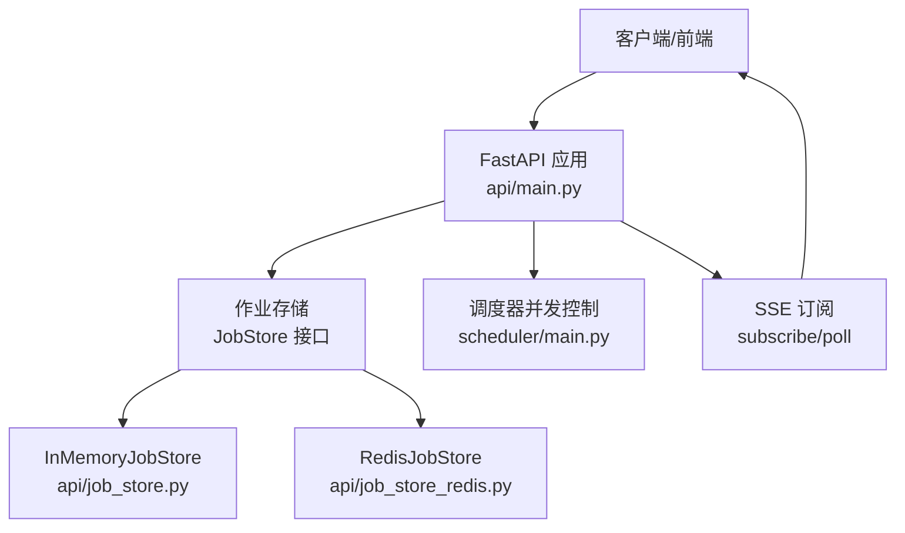
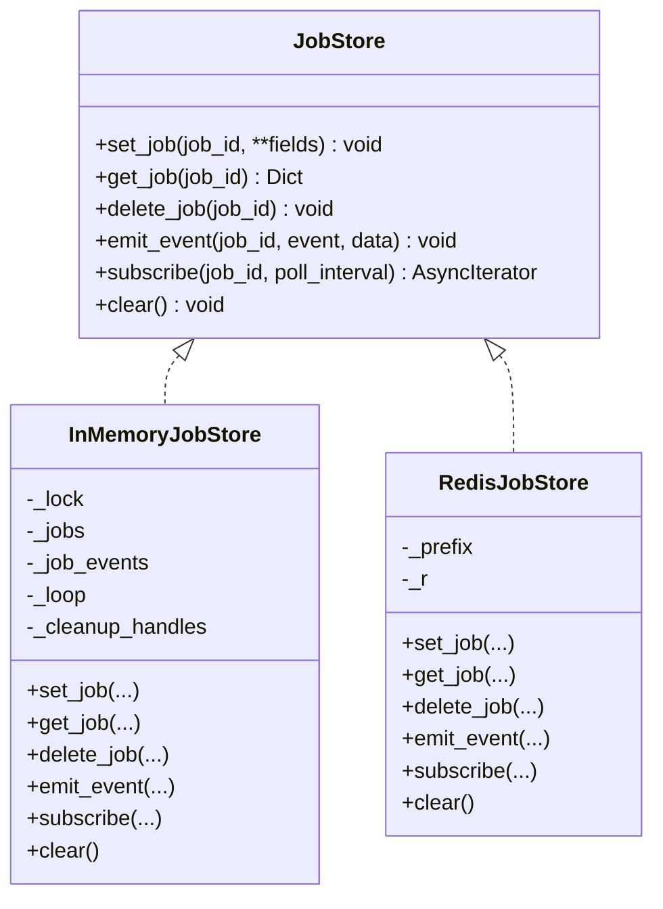
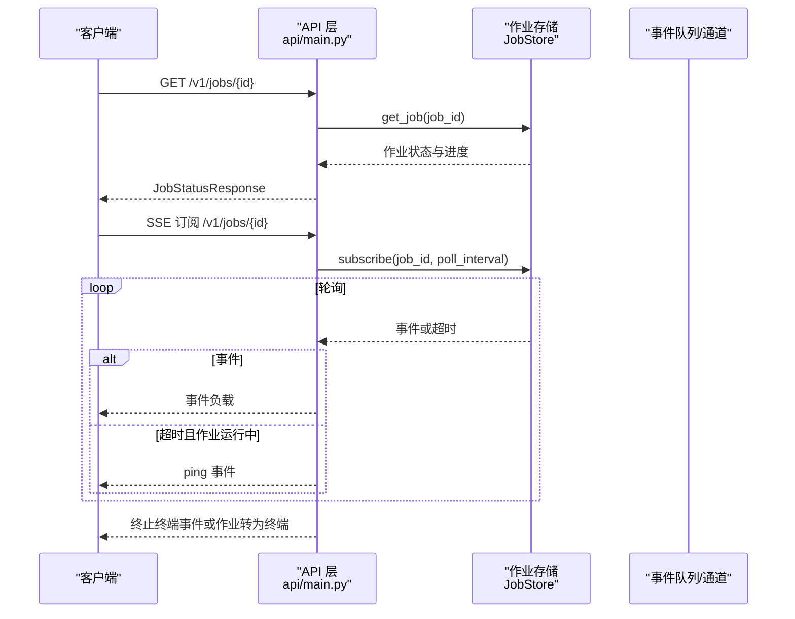
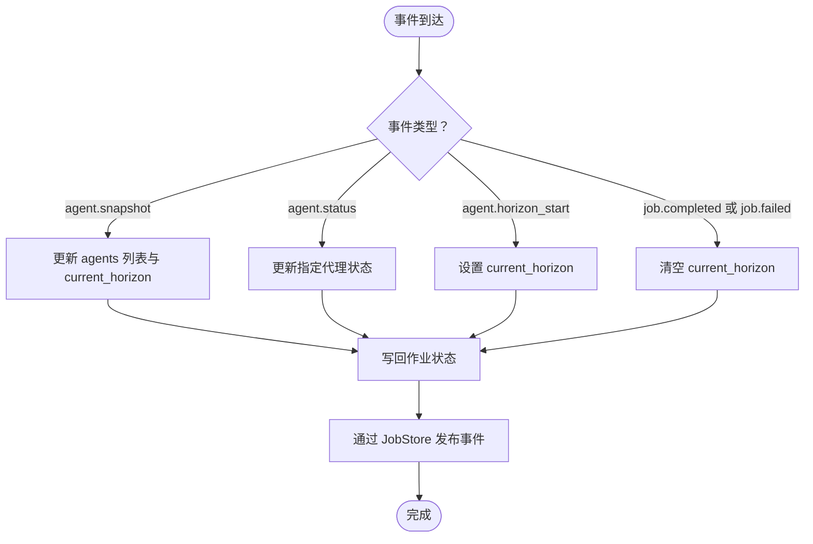
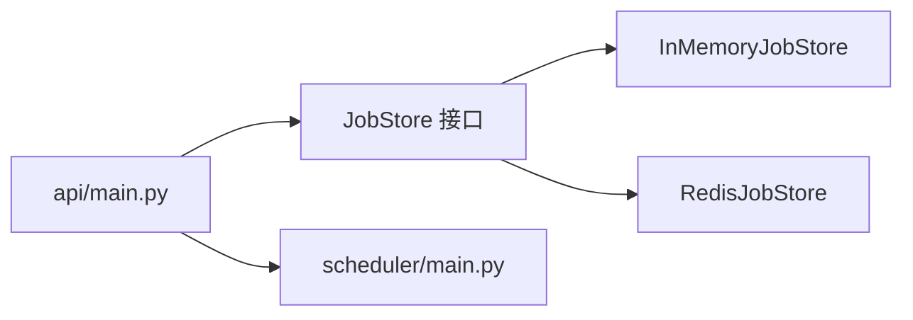

# 分析作业管理

<cite>
**本文引用的文件**
- [api/job_store.py](file://api/job_store.py)
- [api/job_store_redis.py](file://api/job_store_redis.py)
- [api/main.py](file://api/main.py)
- [tests/test_job_store.py](file://tests/test_job_store.py)
- [tests/test_scheduled_queue.py](file://tests/test_scheduled_queue.py)
- [tests/test_job_timeout_config.py](file://tests/test_job_timeout_config.py)
- [scheduler/main.py](file://scheduler/main.py)
</cite>

## 目录
1. [简介](#简介)
2. [项目结构](#项目结构)
3. [核心组件](#核心组件)
4. [架构总览](#架构总览)
5. [详细组件分析](#详细组件分析)
6. [依赖分析](#依赖分析)
7. [性能考虑](#性能考虑)
8. [故障排除指南](#故障排除指南)
9. [结论](#结论)
10. [附录](#附录)

## 简介
本文件面向 TradingAgents-AShare 的“分析作业管理”子系统，聚焦于作业状态查询、进度跟踪与作业生命周期管理。重点说明 /v1/jobs/{id} 端点的状态轮询机制，涵盖 pending、running、completed、failed 四种状态的转换条件；文档化作业存储机制（内存与 Redis 双实现）、Redis 缓存策略与内存作业管理；包含作业超时配置、并发控制与错误恢复机制；并提供作业状态监控示例、性能优化建议与故障排除指南。

## 项目结构
围绕作业管理的关键模块与文件如下：
- 作业存储抽象与实现：api/job_store.py（内存实现）、api/job_store_redis.py（Redis 实现）
- API 主入口与作业生命周期：api/main.py（作业状态字段、事件发射、SSE 订阅、超时与并发控制）
- 调度器并发控制：scheduler/main.py（调度任务的并发槽位）
- 单元测试与集成测试：tests/test_job_store.py、tests/test_scheduled_queue.py、tests/test_job_timeout_config.py

图表来源
- [api/main.py](file://api/main.py)
- [api/job_store.py](file://api/job_store.py)
- [api/job_store_redis.py](file://api/job_store_redis.py)
- [scheduler/main.py](file://scheduler/main.py)
- [tests/test_job_store.py](file://tests/test_job_store.py)
- [tests/test_scheduled_queue.py](file://tests/test_scheduled_queue.py)
- [tests/test_job_timeout_config.py](file://tests/test_job_timeout_config.py)

章节来源
- [api/main.py](file://api/main.py)
- [api/job_store.py](file://api/job_store.py)
- [api/job_store_redis.py](file://api/job_store_redis.py)
- [scheduler/main.py](file://scheduler/main.py)
- [tests/test_job_store.py](file://tests/test_job_store.py)
- [tests/test_scheduled_queue.py](file://tests/test_scheduled_queue.py)
- [tests/test_job_timeout_config.py](file://tests/test_job_timeout_config.py)

## 核心组件
- 作业存储接口与实现
  - JobStore 抽象与 InMemoryJobStore：提供 set_job/get_job/delete_job/emit_event/subscribe/clear 等能力，支持事件队列上限与 TTL 清理。
  - RedisJobStore：基于 Redis Hash 存储作业状态，Pub/Sub 发布事件，支持多工作进程共享。
- 作业生命周期与状态
  - 作业状态字段：status、created_at、started_at、finished_at、symbol、trade_date、error、agents、current_horizon、等待/运行中的并发统计等。
  - 事件类型：agent.snapshot、agent.status、agent.horizon_start、job.completed、job.failed 等。
- /v1/jobs/{id} 端点
  - 返回作业状态详情，包含进度与并发信息，供前端轮询与 SSE 订阅使用。
- 超时与并发
  - 作业默认超时（秒级环境变量），手动触发与调度触发均受超时控制；调度器通过信号量限制并发槽位。
- 错误恢复
  - 事件队列上限避免内存膨胀；终端状态后按 TTL 清理；SSE 订阅在超时或终端事件时终止并释放资源。

章节来源
- [api/job_store.py](file://api/job_store.py)
- [api/job_store_redis.py](file://api/job_store_redis.py)
- [api/main.py](file://api/main.py)
- [tests/test_job_store.py](file://tests/test_job_store.py)
- [tests/test_scheduled_queue.py](file://tests/test_scheduled_queue.py)
- [tests/test_job_timeout_config.py](file://tests/test_job_timeout_config.py)

## 架构总览
作业管理采用“API 层 + 存储层 + 调度层”的分层设计，API 层负责作业生命周期与事件发射，存储层提供内存或 Redis 的统一抽象，调度层负责并发控制与排队。

图表来源
- [api/main.py](file://api/main.py)
- [api/job_store.py](file://api/job_store.py)
- [api/job_store_redis.py](file://api/job_store_redis.py)
- [scheduler/main.py](file://scheduler/main.py)

## 详细组件分析

### 作业存储与事件机制（JobStore 抽象）
- 设计要点
  - 统一接口：set_job/get_job/delete_job/emit_event/subscribe/clear。
  - 内存实现 InMemoryJobStore：线程安全字典 + asyncio.Queue；支持事件队列上限与 TTL 清理；事件循环捕获与跨线程安全写入。
  - Redis 实现 RedisJobStore：Hash 存状态，Pub/Sub 发布事件；后台线程监听 Pub/Sub 并桥接至 asyncio.Queue；支持前缀隔离与 SCAN 清理。
- 关键行为
  - 事件队列上限：防止 SSE 订阅断开导致内存泄漏。
  - TTL 清理：终端状态后延时清理作业与事件队列。
  - 订阅超时：超时且作业仍在运行时返回 ping 事件，终端则终止。

图表来源
- [api/job_store.py](file://api/job_store.py)
- [api/job_store_redis.py](file://api/job_store_redis.py)

章节来源
- [api/job_store.py](file://api/job_store.py)
- [api/job_store_redis.py](file://api/job_store_redis.py)

### /v1/jobs/{id} 端点与状态轮询机制
- 端点行为
  - 返回作业状态详情，包含状态、时间戳、符号、日期、错误、代理进度、当前周期以及调度并发统计。
- 轮询与 SSE
  - 客户端可通过 HTTP GET 或 SSE 订阅获取状态更新。
  - 订阅逻辑：超时且作业仍运行时返回 ping；收到终端事件（job.completed/job.failed）或作业转为终端状态即终止。
- 状态转换条件
  - pending → running：作业开始执行，设置 started_at。
  - running → completed：作业成功完成，设置 finished_at 与结果。
  - running → failed：作业异常失败，设置 finished_at 与 error。
  - completed/failed → 清理：按 TTL 清理作业与事件队列。

图表来源
- [api/main.py](file://api/main.py)
- [api/job_store.py](file://api/job_store.py)
- [api/job_store_redis.py](file://api/job_store_redis.py)

章节来源
- [api/main.py](file://api/main.py)
- [api/job_store.py](file://api/job_store.py)
- [api/job_store_redis.py](file://api/job_store_redis.py)

### 作业事件与进度跟踪
- 进度事件
  - agent.snapshot：记录代理快照与当前周期。
  - agent.status：更新单个代理状态。
  - agent.horizon_start：切换分析周期。
  - job.completed/job.failed：作业完成/失败，清空 current_horizon。
- 事件持久化
  - 通过 _remember_job_progress_event 将最新代理进度写回作业状态，便于轮询客户端在刷新后恢复进度。

图表来源
- [api/main.py](file://api/main.py)
- [api/job_store.py](file://api/job_store.py)
- [api/job_store_redis.py](file://api/job_store_redis.py)

章节来源
- [api/main.py](file://api/main.py)
- [api/job_store.py](file://api/job_store.py)
- [api/job_store_redis.py](file://api/job_store_redis.py)

### 作业超时配置与错误恢复
- 超时配置
  - 默认超时：较长的 30 分钟，适配多代理长流程分析。
  - 环境变量覆盖：TA_JOB_TIMEOUT。
  - 执行路径：作业执行内部使用超时控制，超时后标记失败但不取消内部协程，确保线程自然结束。
- 错误恢复
  - 事件队列上限：避免 SSE 订阅断开导致内存增长。
  - 终端状态清理：按 TTL 自动清理作业与事件队列。
  - 订阅终止：收到终端事件或作业转为终端状态时终止订阅并释放队列。

章节来源
- [tests/test_job_timeout_config.py](file://tests/test_job_timeout_config.py)
- [api/main.py](file://api/main.py)
- [api/job_store.py](file://api/job_store.py)
- [api/job_store_redis.py](file://api/job_store_redis.py)

### 并发控制与调度队列
- 调度并发
  - 调度器使用 asyncio.Semaphore 控制并发槽位，避免同时过多作业占用资源。
  - 测试验证：当并发上限为 1 时，第二项作业进入等待队列；上限为 2 时，最多同时运行两项。
- 作业排队统计
  - API 层在作业状态中注入 waiting_ahead_count、scheduled_running_count、scheduled_concurrency_limit，便于前端展示排队与并发情况。

章节来源
- [tests/test_scheduled_queue.py](file://tests/test_scheduled_queue.py)
- [scheduler/main.py](file://scheduler/main.py)
- [api/main.py](file://api/main.py)

## 依赖分析
- 组件耦合
  - API 层依赖 JobStore 抽象，可无缝切换内存或 Redis 实现。
  - 调度器与 API 层通过并发信号量协作，避免资源争用。
- 外部依赖
  - RedisJobStore 依赖 Redis 客户端；InMemoryJobStore 仅依赖标准库。
- 循环依赖
  - 未发现直接循环依赖；存储实现与 API 通过接口解耦。

图表来源
- [api/main.py](file://api/main.py)
- [api/job_store.py](file://api/job_store.py)
- [api/job_store_redis.py](file://api/job_store_redis.py)
- [scheduler/main.py](file://scheduler/main.py)

章节来源
- [api/main.py](file://api/main.py)
- [api/job_store.py](file://api/job_store.py)
- [api/job_store_redis.py](file://api/job_store_redis.py)
- [scheduler/main.py](file://scheduler/main.py)

## 性能考虑
- 事件队列上限
  - 通过队列容量与溢出丢弃策略，避免内存无界增长，保障服务稳定性。
- TTL 清理
  - 终端状态后延时清理，减少长期驻留内存与 Redis 键数量。
- 线程池与事件循环
  - 合理配置默认线程池大小与 AnyIO 线程限制，避免长耗时操作阻塞事件循环。
- Redis 模式
  - 多工作进程部署时使用 RedisJobStore，避免状态与事件丢失；注意网络延迟与 Pub/Sub 带宽。
- 前缀隔离
  - RedisJobStore 使用前缀隔离，支持多实例共存与清理。

章节来源
- [api/job_store.py](file://api/job_store.py)
- [api/job_store_redis.py](file://api/job_store_redis.py)
- [api/main.py](file://api/main.py)

## 故障排除指南
- 症状：SSE 订阅长时间无响应
  - 检查 poll_interval 是否过短；确认作业状态是否仍在 running；必要时查看 ping 事件。
- 症状：作业长时间停留在 pending
  - 检查调度并发限制与等待队列长度；关注 waiting_ahead_count 与 scheduled_concurrency_limit。
- 症状：内存或 Redis 占用持续上升
  - 确认终端状态后 TTL 清理是否生效；检查事件队列上限是否触发丢弃策略。
- 症状：超时后作业仍占用资源
  - 确认超时控制逻辑已标记失败；检查是否需要强制清理或重启服务。
- 症状：Redis 连接失败
  - 检查 REDIS_URL 与网络连通性；确认 RedisJobStore 初始化日志输出。

章节来源
- [api/job_store.py](file://api/job_store.py)
- [api/job_store_redis.py](file://api/job_store_redis.py)
- [api/main.py](file://api/main.py)

## 结论
本系统通过统一的 JobStore 抽象实现了内存与 Redis 的双模式作业存储，结合 SSE 订阅与事件驱动的进度跟踪，提供了稳定可靠的分析作业生命周期管理。配合调度并发控制与超时配置，能够在高并发场景下保持良好的吞吐与稳定性。建议在生产环境中启用 RedisJobStore 以支持多工作进程，并根据业务峰值调优线程池与并发限制。

## 附录
- 端点定义（摘要）
  - GET /v1/jobs/{job_id}：返回作业状态详情（含 agents、current_horizon、并发统计）。
  - GET /v1/jobs/{job_id}/result：仅在 completed 时返回结果。
- 环境变量（摘要）
  - TA_JOB_TIMEOUT：作业超时秒数（默认 1800）。
  - INMEMORY_JOB_TTL：内存作业终端后保留秒数（默认 600）。
  - JOB_EVENT_QUEUE_MAXSIZE：事件队列最大容量（默认 2000）。
  - JOB_STATE_TTL：Redis 作业状态哈希 TTL（默认 86400）。
  - REDIS_URL：Redis 连接地址（设置后启用 RedisJobStore）。
  - TA_MAX_WORKERS：线程池工作线程数（默认 2）。
  - ANYIO_THREAD_LIMIT：AnyIO 线程限制（默认 120）。

章节来源
- [api/main.py](file://api/main.py)
- [api/job_store.py](file://api/job_store.py)
- [api/job_store_redis.py](file://api/job_store_redis.py)