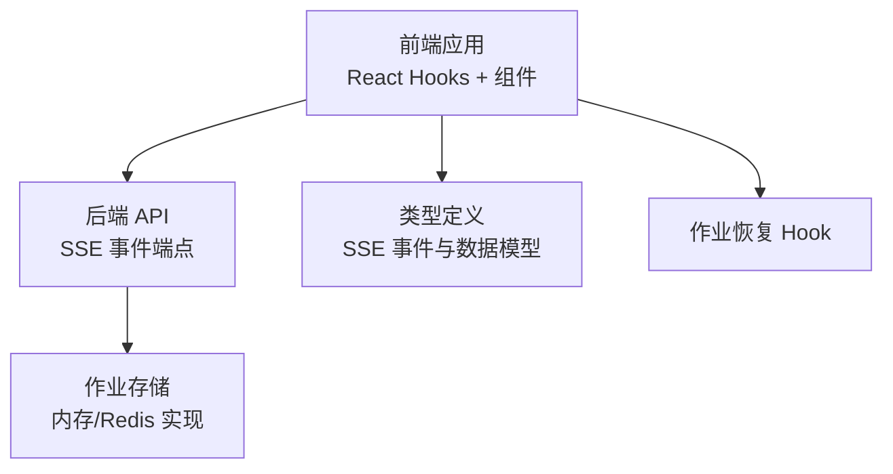
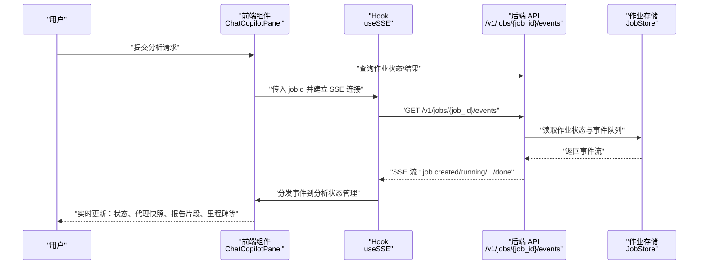
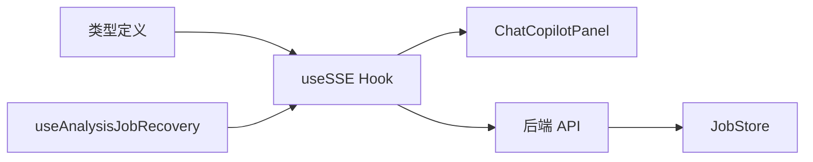

# 分析进度流式传输

<cite>
**本文引用的文件**
- [api/main.py](file://api/main.py)
- [api/job_store.py](file://api/job_store.py)
- [frontend/src/hooks/useSSE.ts](file://frontend/src/hooks/useSSE.ts)
- [frontend/src/hooks/useAnalysisJobRecovery.ts](file://frontend/src/hooks/useAnalysisJobRecovery.ts)
- [frontend/src/components/ChatCopilotPanel.tsx](file://frontend/src/components/ChatCopilotPanel.tsx)
- [frontend/src/types/index.ts](file://frontend/src/types/index.ts)
</cite>

## 目录
1. [简介](#简介)
2. [项目结构](#项目结构)
3. [核心组件](#核心组件)
4. [架构总览](#架构总览)
5. [详细组件分析](#详细组件分析)
6. [依赖关系分析](#依赖关系分析)
7. [性能考虑](#性能考虑)
8. [故障排查指南](#故障排查指南)
9. [结论](#结论)
10. [附录](#附录)

## 简介
本文件针对 TradingAgents-AShare 的“分析进度流式传输”机制进行系统化技术文档化，重点覆盖以下方面：
- Server-Sent Events (SSE) 连接建立、事件推送与断线重连流程
- 分析过程中各分析师工作状态、中间结果与最终报告生成的实时更新
- 事件格式、消息类型与数据序列化方式
- 前端 SSE 连接示例、错误处理策略与性能优化建议
- 调试工具使用指南与常见问题解决方案

## 项目结构
围绕分析进度流式传输的关键文件分布如下：
- 后端 API：提供 SSE 事件流端点与作业状态存储
- 前端 Hook：封装 SSE 连接、事件解析与状态更新
- 类型定义：统一前后端事件与数据结构契约
- 组件：负责在 UI 中展示分析进度与交互



图表来源
- [api/main.py:2961-2962](file://api/main.py#L2961-L2962)
- [api/job_store.py:36-120](file://api/job_store.py#L36-L120)
- [frontend/src/hooks/useSSE.ts:1-44](file://frontend/src/hooks/useSSE.ts#L1-L44)
- [frontend/src/types/index.ts:123-163](file://frontend/src/types/index.ts#L123-L163)
- [frontend/src/hooks/useAnalysisJobRecovery.ts:1-44](file://frontend/src/hooks/useAnalysisJobRecovery.ts#L1-L44)

章节来源
- [api/main.py:2961-2962](file://api/main.py#L2961-L2962)
- [api/job_store.py:1-120](file://api/job_store.py#L1-L120)
- [frontend/src/hooks/useSSE.ts:1-44](file://frontend/src/hooks/useSSE.ts#L1-L44)
- [frontend/src/types/index.ts:123-163](file://frontend/src/types/index.ts#L123-L163)
- [frontend/src/hooks/useAnalysisJobRecovery.ts:1-44](file://frontend/src/hooks/useAnalysisJobRecovery.ts#L1-L44)

## 核心组件
- 后端 SSE 端点：提供 /v1/jobs/{job_id}/events 以流式推送分析事件
- 作业存储：抽象 JobStore 接口及内存实现，支持事件队列容量控制与 TTL 清理
- 前端 useSSE Hook：封装 fetch + ReadableStream 的 SSE 连接、事件分发与断线重连
- 事件类型与数据模型：统一定义 SSE 事件类型、数据载荷与解析规则
- 作业恢复 Hook：在页面挂载或状态异常时自动触发 SSE 连接与结果补取

章节来源
- [api/main.py:2550-2560](file://api/main.py#L2550-L2560)
- [api/main.py:2961-2962](file://api/main.py#L2961-L2962)
- [api/job_store.py:36-120](file://api/job_store.py#L36-L120)
- [frontend/src/hooks/useSSE.ts:1-44](file://frontend/src/hooks/useSSE.ts#L1-L44)
- [frontend/src/hooks/useSSE.ts:110-152](file://frontend/src/hooks/useSSE.ts#L110-L152)
- [frontend/src/hooks/useSSE.ts:278-415](file://frontend/src/hooks/useSSE.ts#L278-L415)
- [frontend/src/hooks/useAnalysisJobRecovery.ts:1-44](file://frontend/src/hooks/useAnalysisJobRecovery.ts#L1-L44)
- [frontend/src/types/index.ts:123-163](file://frontend/src/types/index.ts#L123-L163)

## 架构总览
下图展示了从用户发起分析到前端实时接收事件的整体流程。



图表来源
- [frontend/src/components/ChatCopilotPanel.tsx:297-327](file://frontend/src/components/ChatCopilotPanel.tsx#L297-L327)
- [frontend/src/hooks/useSSE.ts:39-415](file://frontend/src/hooks/useSSE.ts#L39-L415)
- [api/main.py:2961-2962](file://api/main.py#L2961-L2962)
- [api/job_store.py:36-120](file://api/job_store.py#L36-L120)

## 详细组件分析

### 后端 SSE 端点与事件流
- 端点路径：/v1/jobs/{job_id}/events
- 功能：基于 jobId 返回 Server-Sent Events，推送作业生命周期与代理活动事件
- 关键实现位置：
  - 事件流函数：用于异步生成事件序列
  - 路由装饰器：鉴权与参数校验
- 事件队列与 TTL：
  - 事件队列最大容量受环境变量控制，避免无界增长
  - 完成/失败作业状态保留时间受环境变量控制，便于客户端轮询与 SSE 订阅收尾

章节来源
- [api/main.py:2550-2560](file://api/main.py#L2550-L2560)
- [api/main.py:2961-2962](file://api/main.py#L2961-L2962)
- [api/job_store.py:20-28](file://api/job_store.py#L20-L28)
- [api/job_store.py:36-120](file://api/job_store.py#L36-L120)

### 作业存储抽象与实现
- 抽象接口：定义作业状态与事件的存取协议
- 内存实现要点：
  - 事件队列容量上限，超过则丢弃最旧事件
  - 完成/失败作业的 TTL 控制，避免内存泄漏
- Redis 实现（测试覆盖）：验证复杂值 JSON 序列化往返正确性

章节来源
- [api/job_store.py:36-120](file://api/job_store.py#L36-L120)
- [tests/test_job_store_redis.py:53-93](file://tests/test_job_store_redis.py#L53-L93)

### 前端 SSE 连接与事件分发
- 连接建立：
  - 使用 AbortController 管理连接生命周期
  - 通过 fetch 获取 ReadableStream，并用 TextDecoder 逐块解析
- 事件解析：
  - 支持多行块（以 \n\n 分隔），逐块解析事件类型与数据
  - 特殊事件：done 与 [DONE] 表示流结束；ping 用于保活
- 事件分发：
  - 将事件映射到分析状态管理，更新当前作业状态、代理快照、报告片段、里程碑、聊天消息等
- 断线重连：
  - 连接异常或读取中断后延迟重试，指数退避策略未显式实现，采用固定间隔重试
  - 重试计数器用于触发重新连接逻辑

```mermaid
flowchart TD
Start(["开始"]) --> Connect["建立 SSE 连接<br/>fetch + ReadableStream"]
Connect --> ReadLoop["读取数据块<br/>TextDecoder 解码"]
ReadLoop --> Parse["解析事件块<br/>event + data"]
Parse --> Dispatch{"事件类型？"}
Dispatch --> |job.*| UpdateJob["更新作业状态/指标"]
Dispatch --> |agent.snapshot| UpdateSnapshot["更新代理快照"]
Dispatch --> |agent.report.chunk| AppendReport["追加报告片段"]
Dispatch --> |agent.milestone| AddMilestone["添加里程碑"]
Dispatch --> |done 或 [DONE]| Finish["结束流并断开"]
Dispatch --> |ping| KeepAlive["保持连接"]
Dispatch --> |其他| Other["其他事件处理"]
UpdateJob --> ReadLoop
UpdateSnapshot --> ReadLoop
AppendReport --> ReadLoop
AddMilestone --> ReadLoop
KeepAlive --> ReadLoop
Other --> ReadLoop
Finish --> End(["结束"])
```

图表来源
- [frontend/src/hooks/useSSE.ts:278-415](file://frontend/src/hooks/useSSE.ts#L278-L415)
- [frontend/src/hooks/useSSE.ts:110-152](file://frontend/src/hooks/useSSE.ts#L110-L152)

章节来源
- [frontend/src/hooks/useSSE.ts:1-44](file://frontend/src/hooks/useSSE.ts#L1-L44)
- [frontend/src/hooks/useSSE.ts:110-152](file://frontend/src/hooks/useSSE.ts#L110-L152)
- [frontend/src/hooks/useSSE.ts:278-415](file://frontend/src/hooks/useSSE.ts#L278-L415)

### 事件类型与数据模型
- 事件类型（SSEEventType）：
  - 作业级：job.created、job.running、job.completed、job.failed、done、ping
  - 代理级：agent.status、agent.message、agent.tool_call、agent.report、agent.report.chunk、agent.snapshot、agent.horizon_start、agent.horizon_done、agent.milestone、agent.writing、agent.activity、agent.activity_complete、agent.token、agent.debate、agent.debate.token
- 数据载荷：
  - 统一包装为 { event, data, timestamp }
  - 具体事件的数据字段在类型定义中明确，如 JobStatus、AgentStatusEvent、AgentMessageEvent 等

章节来源
- [frontend/src/types/index.ts:123-163](file://frontend/src/types/index.ts#L123-L163)
- [frontend/src/types/index.ts:101-163](file://frontend/src/types/index.ts#L101-L163)

### 作业恢复与断线重连
- 自动恢复：
  - 当检测到当前作业处于运行态且未连接时，自动触发 SSE 连接
  - 在作业完成后尝试拉取最终结果，确保即使 SSE 订阅中断也能获得完整报告
- 断线重连：
  - 连接失败或读取异常时，延迟 3 秒后重试
  - 通过重试计数器驱动重新连接逻辑，避免频繁抖动

章节来源
- [frontend/src/hooks/useAnalysisJobRecovery.ts:1-44](file://frontend/src/hooks/useAnalysisJobRecovery.ts#L1-L44)
- [frontend/src/hooks/useSSE.ts:387-415](file://frontend/src/hooks/useSSE.ts#L387-L415)

### 前端组件中的事件消费
- ChatCopilotPanel：
  - 在收到 job.running 时切换分析指示器状态
  - 在 agent.horizon_start 时更新当前时间范围显示
  - 在 job.completed 时标记所有代理消息为完成并持久化
  - 在 job.failed 时向聊天面板注入系统消息提示失败原因

章节来源
- [frontend/src/components/ChatCopilotPanel.tsx:297-327](file://frontend/src/components/ChatCopilotPanel.tsx#L297-L327)
- [frontend/src/components/ChatCopilotPanel.tsx:596-607](file://frontend/src/components/ChatCopilotPanel.tsx#L596-L607)

## 依赖关系分析
- 前端对后端的依赖：
  - 通过 /v1/jobs/{job_id}/events 获取事件流
  - 通过 API 查询作业状态与最终结果（用于恢复）
- 前端内部依赖：
  - useSSE 依赖分析状态管理（analysisStore）以更新 UI
  - ChatCopilotPanel 依赖 useSSE 与 analysisStore 展示进度
- 后端依赖：
  - JobStore 提供作业状态与事件队列的统一访问
  - 事件队列容量与 TTL 通过环境变量配置，避免资源泄露



图表来源
- [frontend/src/types/index.ts:123-163](file://frontend/src/types/index.ts#L123-L163)
- [frontend/src/hooks/useSSE.ts:1-44](file://frontend/src/hooks/useSSE.ts#L1-L44)
- [frontend/src/components/ChatCopilotPanel.tsx:297-327](file://frontend/src/components/ChatCopilotPanel.tsx#L297-L327)
- [frontend/src/hooks/useAnalysisJobRecovery.ts:1-44](file://frontend/src/hooks/useAnalysisJobRecovery.ts#L1-L44)
- [api/main.py:2961-2962](file://api/main.py#L2961-L2962)
- [api/job_store.py:36-120](file://api/job_store.py#L36-L120)

章节来源
- [frontend/src/types/index.ts:123-163](file://frontend/src/types/index.ts#L123-L163)
- [frontend/src/hooks/useSSE.ts:1-44](file://frontend/src/hooks/useSSE.ts#L1-L44)
- [frontend/src/components/ChatCopilotPanel.tsx:297-327](file://frontend/src/components/ChatCopilotPanel.tsx#L297-L327)
- [frontend/src/hooks/useAnalysisJobRecovery.ts:1-44](file://frontend/src/hooks/useAnalysisJobRecovery.ts#L1-L44)
- [api/main.py:2961-2962](file://api/main.py#L2961-L2962)
- [api/job_store.py:36-120](file://api/job_store.py#L36-L120)

## 性能考虑
- 事件队列容量控制：通过环境变量限制每作业事件队列大小，防止内存膨胀
- 作业状态保留 TTL：完成/失败作业状态保留一段时间，便于客户端轮询与 SSE 订阅收尾
- 断线重连策略：固定间隔重试，避免过于频繁的重建连接
- 建议优化：
  - 引入指数退避与随机抖动，降低网络拥塞风险
  - 对高频事件（如 agent.token）进行节流或合并，减少前端渲染压力
  - 在前端增加事件去重与幂等处理，避免重复更新

章节来源
- [api/job_store.py:20-28](file://api/job_store.py#L20-L28)
- [api/job_store.py:25-28](file://api/job_store.py#L25-L28)
- [frontend/src/hooks/useSSE.ts:329-340](file://frontend/src/hooks/useSSE.ts#L329-L340)

## 故障排查指南
- 常见症状与定位：
  - 无法建立 SSE 连接：检查后端端点可用性与鉴权头是否正确传递
  - 事件解析失败：确认事件块格式与 JSON 结构，关注 ping 与 done 特殊事件
  - 断线后不重连：确认重试计数器与定时器是否被清理或覆盖
  - 作业完成后未显示最终报告：检查作业恢复逻辑是否成功拉取最终结果
- 建议步骤：
  - 打开浏览器开发者工具 Network 面板，观察 /v1/jobs/{job_id}/events 的 SSE 请求与响应
  - 在 Console 查看 SSE 错误日志与事件分发情况
  - 检查后端日志与作业存储状态，确认事件队列与 TTL 设置是否合理
  - 使用作业恢复 Hook 的逻辑验证断线后的自动恢复行为

章节来源
- [frontend/src/hooks/useSSE.ts:335-340](file://frontend/src/hooks/useSSE.ts#L335-L340)
- [frontend/src/hooks/useSSE.ts:387-415](file://frontend/src/hooks/useSSE.ts#L387-L415)
- [frontend/src/hooks/useAnalysisJobRecovery.ts:32-44](file://frontend/src/hooks/useAnalysisJobRecovery.ts#L32-L44)

## 结论
本项目通过后端 SSE 端点与前端 Hook 的协同，实现了分析进度的实时流式传输。后端以 JobStore 抽象统一作业状态与事件，前端以 useSSE 封装连接、解析与恢复逻辑，配合 ChatCopilotPanel 实时更新 UI。建议在现有基础上引入断线重连的指数退避与事件节流策略，进一步提升稳定性与用户体验。

## 附录

### 事件格式与消息类型速查
- 事件类型（节选）：job.created、job.running、job.completed、job.failed、agent.snapshot、agent.report.chunk、agent.milestone、agent.horizon_start、agent.horizon_done、done、ping
- 数据载荷：统一包装为 { event, data, timestamp }，具体字段依据事件类型在类型定义中声明

章节来源
- [frontend/src/types/index.ts:123-163](file://frontend/src/types/index.ts#L123-L163)

### 前端 SSE 连接示例（步骤说明）
- 步骤 1：调用 useSSE(jobId)，传入当前作业 ID
- 步骤 2：在组件中监听分析状态变化，根据事件类型更新 UI
- 步骤 3：在卸载或需要断开时调用返回的 disconnect 方法

章节来源
- [frontend/src/hooks/useSSE.ts:39-415](file://frontend/src/hooks/useSSE.ts#L39-L415)