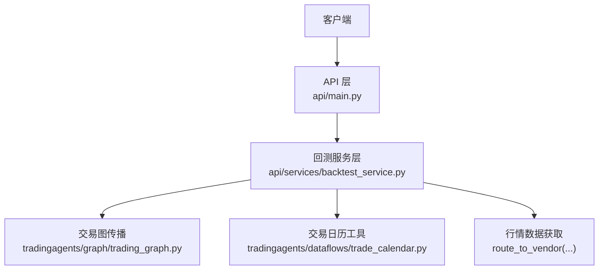
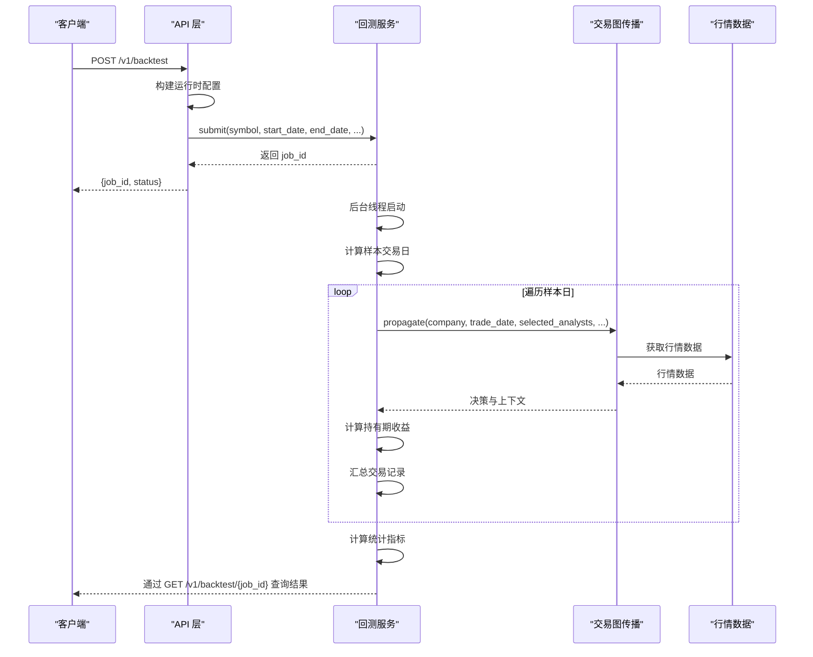
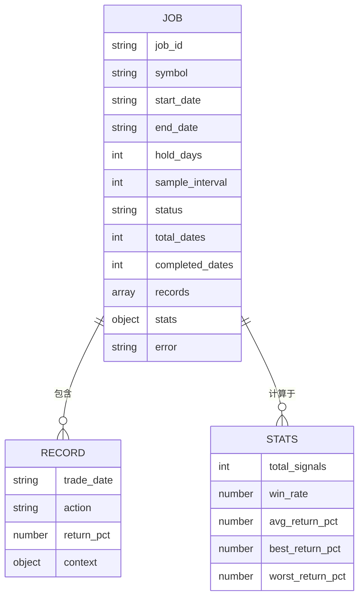
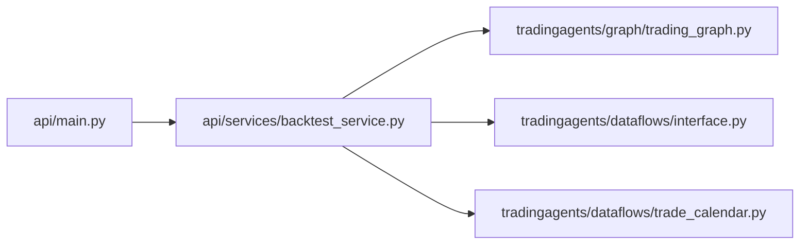

# 回测API

<cite>
**本文引用的文件**
- [api/main.py](file://api/main.py)
- [api/services/backtest_service.py](file://api/services/backtest_service.py)
- [tradingagents/graph/trading_graph.py](file://tradingagents/graph/trading_graph.py)
- [tradingagents/graph/propagation.py](file://tradingagents/graph/propagation.py)
- [tradingagents/dataflows/trade_calendar.py](file://tradingagents/dataflows/trade_calendar.py)
</cite>

## 目录
1. [简介](#简介)
2. [项目结构](#项目结构)
3. [核心组件](#核心组件)
4. [架构总览](#架构总览)
5. [详细组件分析](#详细组件分析)
6. [依赖关系分析](#依赖关系分析)
7. [性能考量](#性能考量)
8. [故障排查指南](#故障排查指南)
9. [结论](#结论)
10. [附录](#附录)

## 简介
本文件为 TradingAgents-AShare 的回测分析 API 参考文档，覆盖以下内容：
- 回测任务提交、查询与删除的完整接口规范
- 回测请求参数说明（策略配置、时间范围、样本间隔等）
- 回测结果数据结构（交易记录、统计指标、任务状态）
- 回测策略编写与参数优化建议
- 实际请求示例、结果分析模板与最佳实践

## 项目结构
回测能力由后端 API 层与回测服务层协作完成：
- API 层负责接收请求、构建运行时配置、调用回测服务并返回任务 ID
- 回测服务层在后台线程执行回测，维护任务状态与结果
- 图推理与传播模块用于在指定日期上运行交易图以生成决策与上下文

图表来源
- [api/main.py:3547-3598](file://api/main.py#L3547-L3598)
- [api/services/backtest_service.py:1-259](file://api/services/backtest_service.py#L1-L259)
- [tradingagents/graph/trading_graph.py:243-281](file://tradingagents/graph/trading_graph.py#L243-L281)
- [tradingagents/dataflows/trade_calendar.py:1-106](file://tradingagents/dataflows/trade_calendar.py#L1-L106)

章节来源
- [api/main.py:3547-3598](file://api/main.py#L3547-L3598)
- [api/services/backtest_service.py:1-259](file://api/services/backtest_service.py#L1-L259)
- [tradingagents/graph/trading_graph.py:243-281](file://tradingagents/graph/trading_graph.py#L243-L281)
- [tradingagents/dataflows/trade_calendar.py:1-106](file://tradingagents/dataflows/trade_calendar.py#L1-L106)

## 核心组件
- 回测请求模型 BacktestRequest：定义回测输入参数
- 回测服务 backtest_service：提交任务、后台执行、维护任务状态与结果
- API 端点：提交回测、查询任务列表、查询单个任务、删除任务

章节来源
- [api/main.py:3547-3598](file://api/main.py#L3547-L3598)
- [api/services/backtest_service.py:226-259](file://api/services/backtest_service.py#L226-L259)

## 架构总览
回测流程概览：
- 客户端提交回测请求，API 层构建运行时配置并调用回测服务
- 回测服务在后台线程启动，按样本间隔遍历交易日，对每个日期运行交易图传播
- 传播完成后计算持有期收益并汇总交易记录与统计指标
- 客户端通过任务 ID 查询状态与结果

图表来源
- [api/main.py:3557-3598](file://api/main.py#L3557-L3598)
- [api/services/backtest_service.py:184-259](file://api/services/backtest_service.py#L184-L259)
- [tradingagents/graph/trading_graph.py:243-281](file://tradingagents/graph/trading_graph.py#L243-L281)

## 详细组件分析

### API 端点与请求模型
- 提交回测
  - 方法与路径：POST /v1/backtest
  - 请求体：BacktestRequest
  - 响应：返回 job_id 与状态 pending
- 列出回测任务
  - 方法与路径：GET /v1/backtest
  - 响应：返回任务列表与总数
- 查询回测任务
  - 方法与路径：GET /v1/backtest/{job_id}
  - 响应：返回任务详情（含状态、进度、记录、统计、错误等）
- 删除回测任务
  - 方法与路径：DELETE /v1/backtest/{job_id}
  - 响应：删除成功消息

BacktestRequest 字段说明
- symbol：标的代码（字符串）
- start_date：开始日期（YYYY-MM-DD）
- end_date：结束日期（YYYY-MM-DD）
- selected_analysts：选中的分析器集合，默认包含市场、新闻、基本面、情绪等
- hold_days：持有天数（整数）
- sample_interval：样本间隔（交易日），用于降低回测频率
- config_overrides：运行时配置覆盖（字典）

章节来源
- [api/main.py:3547-3598](file://api/main.py#L3547-L3598)

### 回测服务实现
- 任务存储：使用内存字典保存任务状态与结果，键为 job_id
- 并发控制：使用锁保护任务状态更新
- 任务生命周期：
  - submit：创建任务并启动后台线程
  - _run_backtest：后台执行回测，更新进度与记录
  - get_job/list_jobs/delete_job：查询、列举与删除任务
- 交易日采样：按 sample_interval 过滤工作日
- 收益计算：基于 akshare 获取持有期后的收盘价，计算回报率
- 统计指标：总信号数、胜率、平均回报、最大/最小回报

章节来源
- [api/services/backtest_service.py:1-259](file://api/services/backtest_service.py#L1-L259)

### 交易图传播与上下文
- 传播入口：TradingAgentsGraph.propagate 接收公司代码与交易日，初始化状态并运行图
- 分析器选择：通过 selected_analysts 控制参与分析的模块
- 结果封装：传播结果包含多类报告与最终投资决策，供回测统计使用

章节来源
- [tradingagents/graph/trading_graph.py:243-281](file://tradingagents/graph/trading_graph.py#L243-L281)
- [tradingagents/graph/propagation.py:1-28](file://tradingagents/graph/propagation.py#L1-L28)

### 交易日历与数据获取
- 交易日历：提供 A 股交易日判断、前一交易日推导与市场阶段判断
- 行情数据：通过 route_to_vendor 获取 CSV 数据，解析日期与收盘价列，按持有期取目标价格

章节来源
- [tradingagents/dataflows/trade_calendar.py:1-106](file://tradingagents/dataflows/trade_calendar.py#L1-L106)
- [api/services/backtest_service.py:68-99](file://api/services/backtest_service.py#L68-L99)

### 回测结果数据结构
- 任务状态字段
  - status：任务状态（如 pending/running/done/error）
  - created_at/started_at：创建与开始时间
  - total_dates/completed_dates：样本日总数与已完成数量
  - records：交易记录数组
  - stats：统计指标
  - error：错误信息
- 交易记录字段
  - 包含决策与上下文信息（由传播结果生成），以及持有期收益计算所需的时间与价格信息
- 统计指标字段
  - total_signals：总信号数
  - win_rate：胜率（百分比）
  - avg_return_pct：平均回报率（百分比）
  - best_return_pct/worst_return_pct：最佳/最差回报率（百分比）

图表来源
- [api/services/backtest_service.py:184-259](file://api/services/backtest_service.py#L184-L259)
- [api/services/backtest_service.py:175-181](file://api/services/backtest_service.py#L175-L181)

## 依赖关系分析
- API 层依赖回测服务层进行任务调度与状态管理
- 回测服务层依赖交易图传播模块生成决策与上下文
- 回测服务层依赖数据流接口获取行情数据
- 回测服务层依赖交易日历工具过滤有效交易日

图表来源
- [api/main.py:3547-3598](file://api/main.py#L3547-L3598)
- [api/services/backtest_service.py:1-259](file://api/services/backtest_service.py#L1-L259)
- [tradingagents/graph/trading_graph.py:243-281](file://tradingagents/graph/trading_graph.py#L243-L281)
- [tradingagents/dataflows/trade_calendar.py:1-106](file://tradingagents/dataflows/trade_calendar.py#L1-L106)

## 性能考量
- 样本间隔：通过 sample_interval 降低回测频率，减少计算压力
- 并发与锁：使用线程与锁保证任务状态一致性，避免竞态
- I/O 优化：尽量复用数据获取与解析逻辑，避免重复请求
- 统计聚合：在后台线程完成统计计算，避免阻塞 API 响应

## 故障排查指南
- 任务不存在：查询任务或删除任务时若 job_id 无效会返回 404
- 错误信息：回测服务会在任务对象中记录 error 字段，可据此定位问题
- 行情数据异常：若数据获取失败或列名不匹配，可能导致收益计算为空
- 交易日历：确保 start_date 与 end_date 之间存在有效交易日，否则可能无样本

章节来源
- [api/main.py:3584-3598](file://api/main.py#L3584-L3598)
- [api/services/backtest_service.py:184-259](file://api/services/backtest_service.py#L184-L259)
- [api/services/backtest_service.py:68-99](file://api/services/backtest_service.py#L68-L99)

## 结论
回测 API 通过“非侵入式”的设计，在现有交易图传播能力基础上实现了历史回测。其核心优势在于：
- 易于扩展：通过 selected_analysts 与 config_overrides 灵活组合策略
- 可观测性：完整的任务状态、进度与统计指标便于评估策略表现
- 可靠性：后台线程执行与锁保护确保并发安全

## 附录

### API 规范摘要
- 提交回测
  - 方法：POST /v1/backtest
  - 请求体字段：symbol, start_date, end_date, selected_analysts, hold_days, sample_interval, config_overrides
  - 响应：job_id, status
- 查询回测
  - 方法：GET /v1/backtest/{job_id}
  - 响应：任务详情（状态、进度、记录、统计、错误）
- 删除回测
  - 方法：DELETE /v1/backtest/{job_id}
  - 响应：成功消息

章节来源
- [api/main.py:3557-3598](file://api/main.py#L3557-L3598)

### 回测请求参数详解
- symbol：股票代码（例如 600036）
- start_date/end_date：回测起止日期（YYYY-MM-DD）
- selected_analysts：分析器集合（默认包含市场、新闻、基本面、情绪等）
- hold_days：持有天数（整数）
- sample_interval：样本间隔（交易日）
- config_overrides：运行时配置覆盖（字典）

章节来源
- [api/main.py:3547-3556](file://api/main.py#L3547-L3556)

### 回测结果字段说明
- 任务级
  - status：任务状态
  - created_at/started_at：创建与开始时间
  - total_dates/completed_dates：样本日总数与已完成数量
  - records：交易记录数组
  - stats：统计指标
  - error：错误信息
- 统计指标
  - total_signals：总信号数
  - win_rate：胜率（百分比）
  - avg_return_pct：平均回报率（百分比）
  - best_return_pct/worst_return_pct：最佳/最差回报率（百分比）

章节来源
- [api/services/backtest_service.py:175-181](file://api/services/backtest_service.py#L175-L181)
- [api/services/backtest_service.py:184-259](file://api/services/backtest_service.py#L184-L259)

### 回测策略编写与参数优化指南
- 策略编写
  - 通过 selected_analysts 选择不同分析器组合，观察对收益的影响
  - 使用 config_overrides 注入策略参数，无需修改核心代码
- 参数优化
  - sweep：固定其他参数，扫描 hold_days 与 sample_interval，绘制胜率/收益随参数变化的曲线
  - cross-validation：按年份分层划分训练/测试集，评估策略稳定性
- 结果解读
  - 关注胜率与平均回报率的平衡，避免仅追求高胜率导致平均回报过低
  - 对最大/最小回报进行归因分析，识别极端行情下的风险暴露

### 实际回测请求示例
- 提交回测
  - POST /v1/backtest
  - 请求体示例（字段与类型见“回测请求参数详解”）
- 查询回测
  - GET /v1/backtest/{job_id}
  - 响应示例（字段与含义见“回测结果字段说明”）

### 结果分析模板
- 基础统计
  - 总信号数、胜率、平均回报率、最大/最小回报率
- 时间序列
  - 收益曲线（按样本日累计净值）
- 风险指标
  - 回撤、波动率、夏普比率（可基于日度回报计算）
- 归因分析
  - 不同分析器对收益的贡献拆解