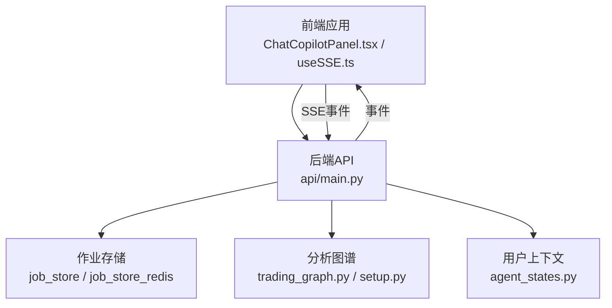
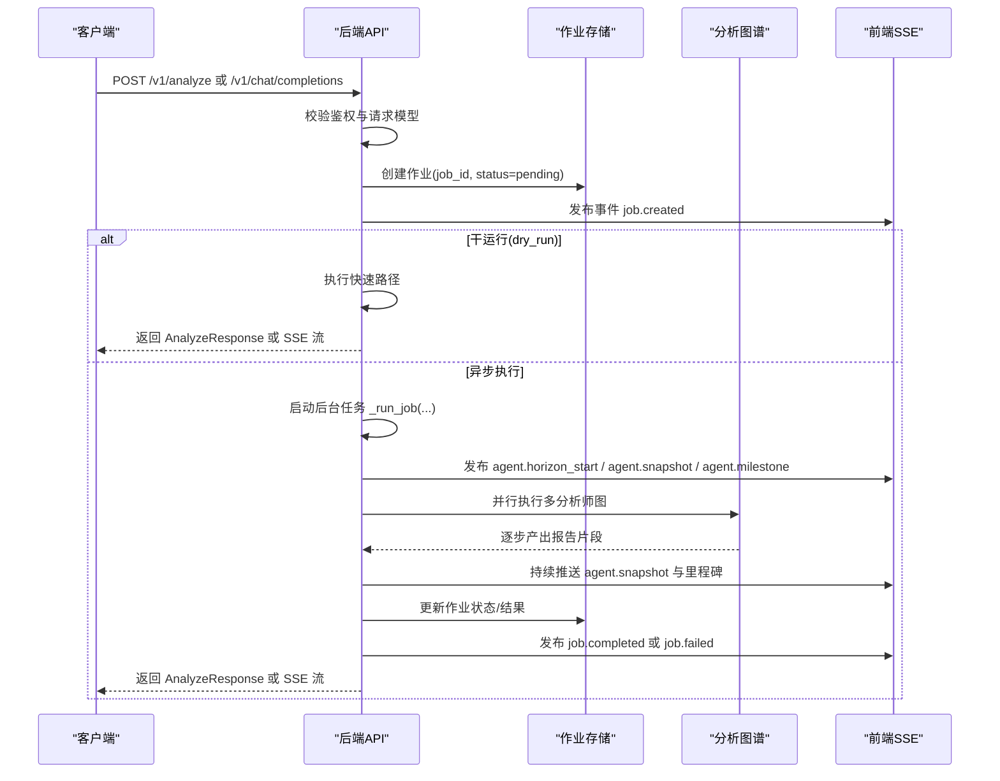
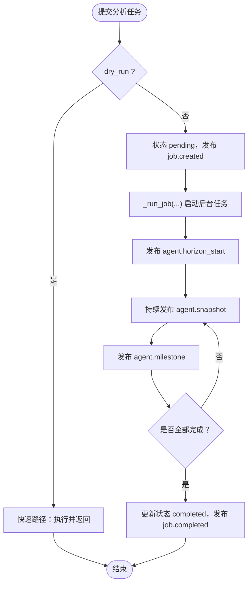
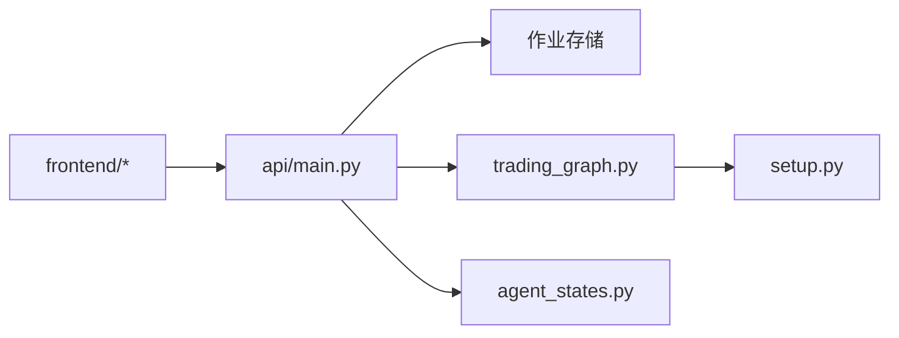

# 股票分析端点

<cite>
**本文引用的文件**
- [api/main.py](file://api/main.py)
- [tests/test_api_smoke.py](file://tests/test_api_smoke.py)
- [frontend/src/components/ChatCopilotPanel.tsx](file://frontend/src/components/ChatCopilotPanel.tsx)
- [frontend/src/hooks/useSSE.ts](file://frontend/src/hooks/useSSE.ts)
- [tradingagents/graph/trading_graph.py](file://tradingagents/graph/trading_graph.py)
- [tradingagents/graph/setup.py](file://tradingagents/graph/setup.py)
- [tradingagents/agents/utils/agent_states.py](file://tradingagents/agents/utils/agent_states.py)
- [tests/test_trading_graph_multi_horizon.py](file://tests/test_trading_graph_multi_horizon.py)
</cite>

## 目录
1. [简介](#简介)
2. [项目结构](#项目结构)
3. [核心组件](#核心组件)
4. [架构总览](#架构总览)
5. [详细组件分析](#详细组件分析)
6. [依赖分析](#依赖分析)
7. [性能考虑](#性能考虑)
8. [故障排查指南](#故障排查指南)
9. [结论](#结论)
10. [附录](#附录)

## 简介
本文件为 TradingAgents-AShare 的股票分析 API 端点参考文档，覆盖以下两个核心端点：
- POST /v1/analyze：提交分析任务，支持干运行与异步执行，返回作业 ID 以便后续轮询或订阅事件流。
- POST /v1/chat/completions：以流式事件（SSE）形式返回多分析师协作生成的分析过程与结果，支持实时进度反馈。

文档将详细说明请求参数结构、请求体格式、响应结构、状态码、分析配置选项、时间窗口与分析师选择机制，并提供请求示例、响应格式说明与错误处理指南。同时解释分析任务的异步执行流程与进度跟踪机制。

## 项目结构
围绕分析端点的关键模块与职责如下：
- 后端 API：定义端点、请求模型、作业存储与事件发布、后台任务调度与超时控制。
- 前端交互：通过 SSE 接收事件流，渲染进度与报告卡片，支持断线恢复与错误提示。
- 分析图谱：基于多分析师协作的图执行引擎，按短/中线周期并行产出报告与决策。
- 用户上下文：将用户目标、风险偏好、持仓与约束等注入分析请求，影响最终策略与报告。

图表来源
- [api/main.py](file://api/main.py)
- [frontend/src/components/ChatCopilotPanel.tsx](file://frontend/src/components/ChatCopilotPanel.tsx)
- [frontend/src/hooks/useSSE.ts](file://frontend/src/hooks/useSSE.ts)
- [tradingagents/graph/trading_graph.py](file://tradingagents/graph/trading_graph.py)
- [tradingagents/graph/setup.py](file://tradingagents/graph/setup.py)
- [tradingagents/agents/utils/agent_states.py](file://tradingagents/agents/utils/agent_states.py)

章节来源
- [api/main.py](file://api/main.py)
- [frontend/src/components/ChatCopilotPanel.tsx](file://frontend/src/components/ChatCopilotPanel.tsx)
- [frontend/src/hooks/useSSE.ts](file://frontend/src/hooks/useSSE.ts)
- [tradingagents/graph/trading_graph.py](file://tradingagents/graph/trading_graph.py)
- [tradingagents/graph/setup.py](file://tradingagents/graph/setup.py)
- [tradingagents/agents/utils/agent_states.py](file://tradingagents/agents/utils/agent_states.py)

## 核心组件
- 请求模型与响应模型
  - AnalyzeRequest：用于 /v1/analyze 的请求体模型，包含 symbol、trade_date、query、horizons、selected_analysts、config_overrides、dry_run、user_intent 等字段。
  - AnalyzeResponse：用于 /v1/analyze 的响应体模型，包含 job_id、status、created_at。
  - ChatCompletionsRequest：用于 /v1/chat/completions 的请求体模型，包含 messages、stream、selected_analysts、dry_run 等字段。
  - ChatCompletionsResponse：用于 /v1/chat/completions 的响应体模型，采用 SSE 流式事件，事件类型包括 message、done、job.created、agent.snapshot、agent.horizon_start、agent.milestone 等。
- 作业存储与事件
  - 作业状态：pending、running、completed、failed。
  - 事件发布：job.created、agent.horizon_start、agent.snapshot、agent.milestone、job.completed、job.failed。
- 异步执行与超时
  - 任务超时控制：内部使用竞速等待与超时标记失败，避免取消卡住线程池。
  - 后台任务跟踪：防止 GC 回收任务并记录未捕获异常。

章节来源
- [api/main.py](file://api/main.py)
- [tests/test_api_smoke.py](file://tests/test_api_smoke.py)

## 架构总览
下图展示了从客户端到后端、再到分析图谱与事件系统的整体调用链路与数据流。

图表来源
- [api/main.py](file://api/main.py)
- [frontend/src/components/ChatCopilotPanel.tsx](file://frontend/src/components/ChatCopilotPanel.tsx)
- [frontend/src/hooks/useSSE.ts](file://frontend/src/hooks/useSSE.ts)
- [tradingagents/graph/trading_graph.py](file://tradingagents/graph/trading_graph.py)

## 详细组件分析

### /v1/analyze 端点
- 功能概述
  - 提交一次分析任务，支持干运行（dry_run）立即返回；否则异步执行并在后台持续推送进度事件。
  - 返回作业 ID，可通过轮询或订阅事件流获取最终结果。
- 请求方法与路径
  - POST /v1/analyze
- 鉴权
  - 需要 Bearer Token，未认证返回 401/403。
- 请求体字段（AnalyzeRequest）
  - symbol：股票代码，如 600519.SH；当 query 中包含股票代码时可省略。
  - trade_date：交易日期，YYYY-MM-DD，默认为当前日期。
  - query：自然语言查询，如“分析贵州茅台短线机会”。
  - horizons：分析周期列表，如 ["short"] 或 ["short","medium"]。
  - selected_analysts：分析师名单，如 ["market","news","fundamentals","macro","smart_money","volume_price"]。
  - config_overrides：分析配置覆盖项。
  - dry_run：布尔值，开启后立即返回，不触发真实分析。
  - user_intent：预解析的用户意图，由 chat_completions 传入。
  - 其他用户上下文字段：objective、risk_profile、investment_horizon、cash_available、current_position、current_position_pct、average_cost、max_loss_pct、constraints、user_notes。
- 响应体（AnalyzeResponse）
  - job_id：作业标识符。
  - status：作业状态，pending/running/completed/failed。
  - created_at：ISO 时间戳。
- 状态码
  - 200：提交成功（返回 AnalyzeResponse）。
  - 401/403：未认证或权限不足。
  - 5xx：服务器内部错误。
- 示例
  - 成功提交（异步）：返回 job_id 与 pending 状态。
  - 干运行：立即返回 completed，包含决策与结果摘要。
- 错误处理
  - 未认证：401/403。
  - 任务超时：标记 failed 并发布 job.failed 事件。
  - 数据库写入失败：记录失败信息并继续发布事件。
- 进度跟踪
  - 通过作业存储轮询或订阅事件流获取 agent.snapshot 与 agent.milestone，实现前端进度条与报告卡片更新。

章节来源
- [api/main.py](file://api/main.py)
- [tests/test_api_smoke.py](file://tests/test_api_smoke.py)

### /v1/chat/completions 端点
- 功能概述
  - 以流式事件（SSE）返回多分析师协作的分析过程与结果，支持实时进度反馈与断线重连。
- 请求方法与路径
  - POST /v1/chat/completions
- 鉴权
  - 需要 Bearer Token，未认证返回 401/403。
- 请求体字段（ChatCompletionsRequest）
  - messages：消息数组，如 [{role:"user", content:"..."}]。
  - stream：布尔值，开启后返回 SSE 流。
  - selected_analysts：分析师名单。
  - dry_run：布尔值，开启后立即返回。
  - 其他字段：config_overrides、user_context 等。
- 响应体（SSE 事件）
  - 事件类型：
    - message：包含增量内容的 JSON 数据。
    - done：流结束信号。
    - job.created：作业创建事件，包含 job_id、symbol、trade_date。
    - agent.horizon_start：某周期开始事件，包含 horizon 与 label。
    - agent.snapshot：进度快照，包含各分析师状态与报告片段。
    - agent.milestone：里程碑事件，包含阶段标题与摘要。
    - job.completed/job.failed：作业完成或失败事件。
- 前端消费
  - 使用 useSSE.ts 解析事件，渲染聊天消息、报告卡片与进度指示器。
  - 支持断线重连与错误恢复，若网络异常尝试恢复中断任务。
- 示例
  - 成功提交：返回 SSE 流，前端逐步渲染各分析师报告与决策。
  - 干运行：立即返回 message 事件，包含简要结果。
- 错误处理
  - 未认证：401/403。
  - 流异常：前端检测网络/流错误，尝试恢复中断任务并提示用户。
  - 任务超时：发布 job.failed 事件并记录失败原因。

章节来源
- [api/main.py](file://api/main.py)
- [frontend/src/components/ChatCopilotPanel.tsx](file://frontend/src/components/ChatCopilotPanel.tsx)
- [frontend/src/hooks/useSSE.ts](file://frontend/src/hooks/useSSE.ts)

### 分析配置选项、时间窗口与分析师选择
- 配置选项
  - config_overrides：允许对默认分析配置进行覆盖，影响数据采集、工具调用与报告生成。
- 时间窗口
  - horizons：支持 ["short"] 或 ["short","medium"]，分别对应短线与中线分析。
  - 图执行引擎按周期并行运行，共享数据缓存，缩短总耗时。
- 分析师选择
  - selected_analysts：可选 ["market","social","news","fundamentals","macro","smart_money","volume_price"]。
  - setup.py 中根据所选分析师动态构建图节点与工具节点，未选中的分析师标记为 skipped。
  - trading_graph.py 将最终状态抽取为短/中线结果，包含决策、投资计划与各报告字段。

章节来源
- [api/main.py](file://api/main.py)
- [tradingagents/graph/setup.py](file://tradingagents/graph/setup.py)
- [tradingagents/graph/trading_graph.py](file://tradingagents/graph/trading_graph.py)
- [tests/test_trading_graph_multi_horizon.py](file://tests/test_trading_graph_multi_horizon.py)

### 异步执行流程与进度跟踪机制
- 任务生命周期
  - 提交：创建作业，状态 pending，发布 job.created。
  - 执行：后台任务 _run_job(...) 启动，内部竞速等待与超时控制。
  - 进度：每轮周期开始发布 agent.horizon_start，持续发布 agent.snapshot 与 agent.milestone。
  - 完成：生成最终结果，更新作业状态为 completed 或 failed，发布相应事件。
- 进度可视化
  - 前端使用 AgentProgressTracker 维护各分析师状态与报告片段，渲染“正在撰写”、“已完成”等状态。
  - 里程碑事件用于阶段性总结，便于前端展示关键结论。
- 断线恢复
  - 前端 useSSE.ts 支持断线重连与错误恢复，若网络异常尝试恢复中断任务。

图表来源
- [api/main.py](file://api/main.py)
- [frontend/src/hooks/useSSE.ts](file://frontend/src/hooks/useSSE.ts)

章节来源
- [api/main.py](file://api/main.py)
- [frontend/src/hooks/useSSE.ts](file://frontend/src/hooks/useSSE.ts)

## 依赖分析
- 组件耦合
  - API 层依赖作业存储与事件发布，负责任务调度与状态管理。
  - 分析图谱层依赖多分析师节点与工具节点，按所选分析师动态装配。
  - 前端依赖 SSE 事件流与本地存储，实现进度与报告渲染。
- 外部依赖
  - 数据提供方：AkShare、Baostock、Alpha Vantage、Yahoo Finance 等（通过数据采集器抽象）。
  - LLM 客户端：OpenAI、Anthropic、Google 等（通过工厂模式统一接入）。
- 循环依赖
  - 当前结构以 API 为中心向外分发，未见明显循环依赖。

图表来源
- [api/main.py](file://api/main.py)
- [tradingagents/graph/trading_graph.py](file://tradingagents/graph/trading_graph.py)
- [tradingagents/graph/setup.py](file://tradingagents/graph/setup.py)
- [tradingagents/agents/utils/agent_states.py](file://tradingagents/agents/utils/agent_states.py)
- [frontend/src/components/ChatCopilotPanel.tsx](file://frontend/src/components/ChatCopilotPanel.tsx)
- [frontend/src/hooks/useSSE.ts](file://frontend/src/hooks/useSSE.ts)

章节来源
- [api/main.py](file://api/main.py)
- [tradingagents/graph/trading_graph.py](file://tradingagents/graph/trading_graph.py)
- [tradingagents/graph/setup.py](file://tradingagents/graph/setup.py)
- [tradingagents/agents/utils/agent_states.py](file://tradingagents/agents/utils/agent_states.py)
- [frontend/src/components/ChatCopilotPanel.tsx](file://frontend/src/components/ChatCopilotPanel.tsx)
- [frontend/src/hooks/useSSE.ts](file://frontend/src/hooks/useSSE.ts)

## 性能考虑
- 并行执行：按周期并行运行多分析师，共享数据缓存，减少重复拉取。
- 超时控制：后台任务使用竞速等待与超时标记失败，避免取消卡住线程池。
- 事件驱动：通过 agent.snapshot 与 agent.milestone 实时反馈进度，降低轮询成本。
- 前端优化：断线重连与错误恢复，提升用户体验与任务成功率。

## 故障排查指南
- 常见问题
  - 未认证：检查 Authorization 头是否包含有效 Bearer Token。
  - 任务超时：观察 job.failed 事件，确认后端日志与数据库记录。
  - 流异常：前端检测网络/流错误，尝试恢复中断任务并提示用户。
- 排查步骤
  - 获取作业详情：通过作业 ID 查询作业状态与错误信息。
  - 查看事件流：确认是否收到 job.created、agent.horizon_start、agent.snapshot、agent.milestone、job.completed/job.failed。
  - 检查配置：核对 selected_analysts、horizons、config_overrides 是否合理。
  - 日志定位：查看后端日志与数据库失败记录，定位具体异常。

章节来源
- [api/main.py](file://api/main.py)
- [frontend/src/hooks/useSSE.ts](file://frontend/src/hooks/useSSE.ts)

## 结论
本文档系统性地梳理了 TradingAgents-AShare 的股票分析 API 端点，明确了 /v1/analyze 与 /v1/chat/completions 的请求与响应规范、参数结构、状态码与错误处理策略，并深入解析了异步执行流程、进度跟踪机制与配置选项。结合前端 SSE 事件流与断线恢复能力，用户可在浏览器中获得流畅、可视化的多分析师协作分析体验。

## 附录
- 请求与响应示例（路径）
  - /v1/analyze 提交流程与干运行示例：参见测试用例路径 [tests/test_api_smoke.py](file://tests/test_api_smoke.py)
  - /v1/chat/completions 流式事件解析与断线恢复：参见前端 hook 路径 [frontend/src/hooks/useSSE.ts](file://frontend/src/hooks/useSSE.ts)
- 关键实现参考
  - 请求模型与响应模型：参见 [api/main.py](file://api/main.py)
  - 分析图谱与周期结果抽取：参见 [tradingagents/graph/trading_graph.py](file://tradingagents/graph/trading_graph.py)
  - 分析师装配与工具节点：参见 [tradingagents/graph/setup.py](file://tradingagents/graph/setup.py)
  - 用户上下文结构：参见 [tradingagents/agents/utils/agent_states.py](file://tradingagents/agents/utils/agent_states.py)