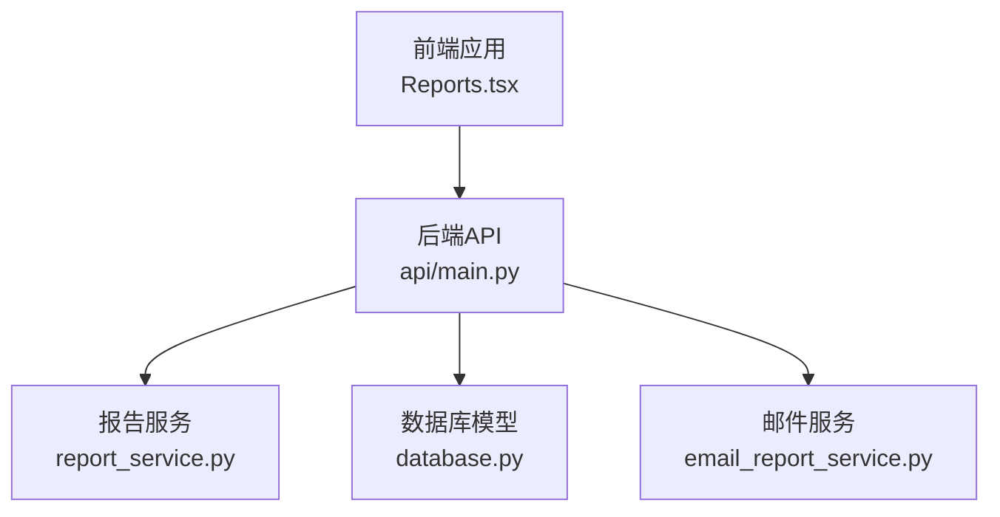
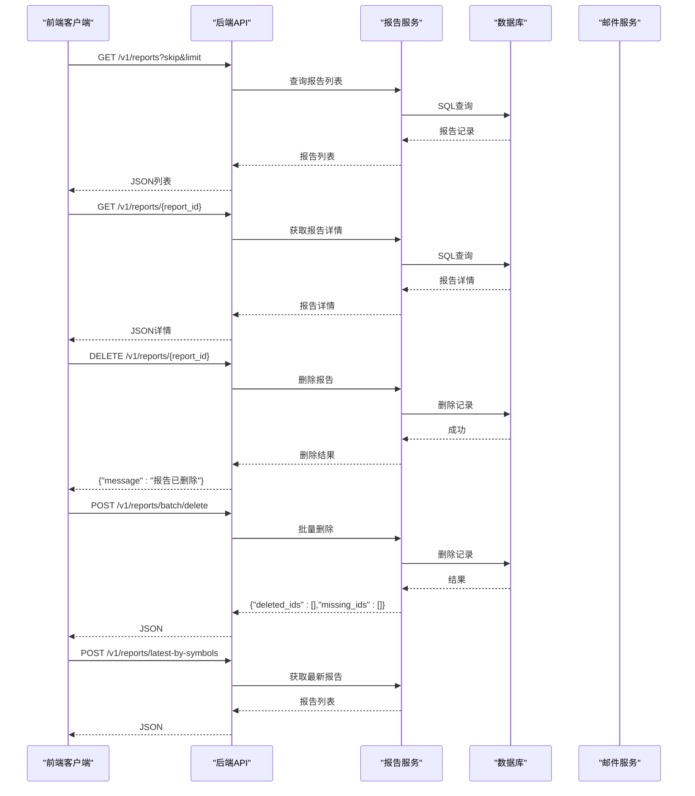
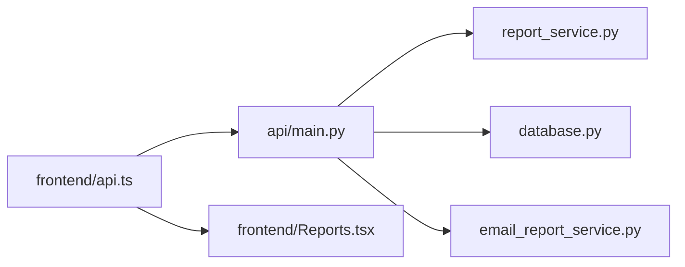

# 报告API

<cite>
**本文引用的文件**
- [api/main.py](file://api/main.py)
- [api/services/report_service.py](file://api/services/report_service.py)
- [api/services/email_report_service.py](file://api/services/email_report_service.py)
- [api/database.py](file://api/database.py)
- [frontend/src/services/api.ts](file://frontend/src/services/api.ts)
- [frontend/src/pages/Reports.tsx](file://frontend/src/pages/Reports.tsx)
- [tests/test_api_smoke.py](file://tests/test_api_smoke.py)
- [tests/test_email_report_service.py](file://tests/test_email_report_service.py)
</cite>

## 目录
1. [简介](#简介)
2. [项目结构](#项目结构)
3. [核心组件](#核心组件)
4. [架构总览](#架构总览)
5. [详细组件分析](#详细组件分析)
6. [依赖分析](#依赖分析)
7. [性能考虑](#性能考虑)
8. [故障排查指南](#故障排查指南)
9. [结论](#结论)
10. [附录](#附录)

## 简介
本文件为 TradingAgents-AShare 的“报告API”参考文档，覆盖报告的生成、查询、删除与批量删除、导出Markdown、以及邮件发送等能力。文档面向前后端开发者与运维人员，提供端点定义、请求/响应模型、数据结构、状态流转、错误处理策略、重试机制与性能优化建议。

## 项目结构
- 后端服务位于 api/，暴露 REST API 并通过 SQLAlchemy 访问数据库。
- 报告业务逻辑集中在 report_service.py；邮件渲染与发送在 email_report_service.py。
- 前端位于 frontend/src，通过 api.ts 封装调用后端 /v1/reports 相关端点；Reports 页面负责展示与交互。

图表来源
- [api/main.py](file://api/main.py)
- [api/services/report_service.py](file://api/services/report_service.py)
- [api/services/email_report_service.py](file://api/services/email_report_service.py)
- [api/database.py](file://api/database.py)
- [frontend/src/pages/Reports.tsx](file://frontend/src/pages/Reports.tsx)

章节来源
- [api/main.py](file://api/main.py)
- [api/services/report_service.py](file://api/services/report_service.py)
- [api/services/email_report_service.py](file://api/services/email_report_service.py)
- [api/database.py](file://api/database.py)
- [frontend/src/pages/Reports.tsx](file://frontend/src/pages/Reports.tsx)

## 核心组件
- 报告数据库模型：定义字段、索引与JSON存储结构，支撑报告生命周期与结构化数据。
- 报告服务：提供初始化、部分更新、完成归档、查询、计数、删除与批量删除等CRUD能力。
- 邮件服务：渲染HTML邮件、注入前端链接、通过SMTP发送，并提供异步重试。
- 前端API封装：统一请求/响应、分页、错误处理与导出Markdown。
- 前端页面：列表、详情、进度反馈、删除、导出、历史时间线等。

章节来源
- [api/database.py](file://api/database.py)
- [api/services/report_service.py](file://api/services/report_service.py)
- [api/services/email_report_service.py](file://api/services/email_report_service.py)
- [frontend/src/services/api.ts](file://frontend/src/services/api.ts)
- [frontend/src/pages/Reports.tsx](file://frontend/src/pages/Reports.tsx)

## 架构总览
后端REST API 通过 FastAPI 暴露 /v1/reports 相关端点，调用 report_service 完成数据库操作；当需要邮件推送时，调用 email_report_service 渲染并发送邮件。前端通过 api.ts 统一访问这些端点，并在 Reports 页面进行展示与交互。

图表来源
- [api/main.py](file://api/main.py)
- [api/services/report_service.py](file://api/services/report_service.py)
- [frontend/src/services/api.ts](file://frontend/src/services/api.ts)

## 详细组件分析

### 数据模型与字段
- 报告模型包含：标识、用户归属、股票代码、交易日、状态、错误信息、决策、方向、置信度、目标价、止损价、原始结果JSON、结构化风险与指标、分析师轨迹等。
- 字段设计支持结构化抽取与历史追踪，便于前端渲染与邮件模板复用。

章节来源
- [api/database.py](file://api/database.py)

### 报告服务（CRUD与状态）
- 初始化：提交任务时创建“pending”记录。
- 部分更新：可增量写入各分析模块报告片段。
- 完成归档：合并结构化数据，标记为“completed”，写入最终字段。
- 查询：按用户、股票过滤，支持分页与最新报告聚合。
- 删除：单条删除与批量删除，返回缺失ID集合。
- 孤儿报告修复：对存在但无作业的任务标记失败，避免悬挂。

章节来源
- [api/services/report_service.py](file://api/services/report_service.py)

### 邮件服务（HTML渲染与发送）
- 渲染：将报告转换为HTML邮件，内联样式适配邮件客户端；包含决策、置信度、方向、关键指标、风险提示、最终决策等区块。
- 发送：通过环境变量配置SMTP，支持STARTTLS与SSL；失败时记录日志。
- 异步重试：首次失败后延时重试一次，提升送达率。

章节来源
- [api/services/email_report_service.py](file://api/services/email_report_service.py)

### 前端API封装与页面交互
- 列表：GET /v1/reports 支持 symbol、skip、limit 参数；分页加载与错误提示。
- 详情：GET /v1/reports/{report_id}；若报告处于活跃状态且无对应作业，触发孤儿修复。
- 删除：DELETE /v1/reports/{report_id}；批量删除 POST /v1/reports/batch/delete。
- 最新报告：POST /v1/reports/latest-by-symbols。
- 导出：前端将报告分节拼接为Markdown并触发下载。
- 进度：前端定时轮询活跃报告，展示排队/运行进度。

章节来源
- [frontend/src/services/api.ts](file://frontend/src/services/api.ts)
- [frontend/src/pages/Reports.tsx](file://frontend/src/pages/Reports.tsx)

### 端点定义与行为

- GET /v1/reports
  - 功能：分页查询当前用户的报告列表
  - 查询参数：
    - symbol: 股票代码（可选）
    - skip: 偏移量（>=0）
    - limit: 数量限制（1..1000）
  - 响应：包含 total 与 reports 列表
  - 行为：附加作业运行态；股票代码映射为名称

- GET /v1/reports/{report_id}
  - 功能：获取报告详情
  - 行为：若状态为活跃且无对应作业，标记为失败；附加作业运行态；股票代码映射为名称

- DELETE /v1/reports/{report_id}
  - 功能：删除报告
  - 行为：不存在时报404

- POST /v1/reports/batch/delete
  - 功能：批量删除
  - 请求体：report_ids 数组
  - 响应：deleted_ids 与 missing_ids

- POST /v1/reports/latest-by-symbols
  - 功能：按符号返回每个符号的最新报告
  - 请求体：symbols 数组
  - 响应：reports 列表

章节来源
- [api/main.py](file://api/main.py)
- [tests/test_api_smoke.py](file://tests/test_api_smoke.py)

### 报告模板与内容格式
- HTML邮件模板包含：
  - 头部：标题、股票名称/代码、交易日、方向徽章
  - 决策卡片：决策、置信度进度条、方向
  - 目标价/止损价
  - 各方观点（从报告注释中抽取）
  - 关键指标表格
  - 风险提示列表
  - 查看完整报告按钮（指向前端URL）
  - 底部声明与退订提示
- Markdown导出：将多个报告分节拼接为Markdown文本，用于下载。

章节来源
- [api/services/email_report_service.py](file://api/services/email_report_service.py)
- [frontend/src/pages/Reports.tsx](file://frontend/src/pages/Reports.tsx)

### 输出选项与文件下载
- 邮件：HTML + 纯文本双格式，自动内联样式
- 下载：前端导出Markdown，文件名形如 analysis-{symbol}-{trade_date}.md

章节来源
- [api/services/email_report_service.py](file://api/services/email_report_service.py)
- [frontend/src/pages/Reports.tsx](file://frontend/src/pages/Reports.tsx)

### 报告状态跟踪与重试机制
- 状态：pending、running、completed、failed
- 孤儿修复：若报告处于活跃状态但无对应作业，自动标记失败
- 重试：邮件发送失败后延迟重试一次
- 前端轮询：活跃报告（pending/running）每4秒刷新一次

章节来源
- [api/services/report_service.py](file://api/services/report_service.py)
- [api/services/email_report_service.py](file://api/services/email_report_service.py)
- [frontend/src/pages/Reports.tsx](file://frontend/src/pages/Reports.tsx)

### 错误处理策略
- 404：报告不存在
- 400：批量删除参数校验失败
- 日志：邮件发送异常记录错误日志
- 前端：统一捕获HTTP错误并提示

章节来源
- [api/main.py](file://api/main.py)
- [tests/test_api_smoke.py](file://tests/test_api_smoke.py)
- [tests/test_email_report_service.py](file://tests/test_email_report_service.py)

## 依赖分析
- 后端API依赖报告服务与数据库模型；邮件服务独立于API，通过环境变量配置SMTP。
- 前端通过 api.ts 统一访问后端端点，Reports 页面负责状态管理与UI反馈。

图表来源
- [api/main.py](file://api/main.py)
- [api/services/report_service.py](file://api/services/report_service.py)
- [api/services/email_report_service.py](file://api/services/email_report_service.py)
- [api/database.py](file://api/database.py)
- [frontend/src/services/api.ts](file://frontend/src/services/api.ts)
- [frontend/src/pages/Reports.tsx](file://frontend/src/pages/Reports.tsx)

## 性能考虑
- 查询优化
  - 使用分页参数 skip/limit 控制单次返回量
  - 列表查询默认只加载摘要字段，减少网络与序列化开销
- 数据库
  - 为 user_id、symbol、status 等常用过滤字段建立索引
  - 使用 load_only 仅加载必要列
- 前端
  - 活跃报告采用定时轮询（4秒间隔），避免频繁请求
  - 列表与详情加载时显示进度与占位符，改善体验
- 邮件
  - 异步发送与重试，避免阻塞主流程
  - SMTP超时控制，失败快速降级

## 故障排查指南
- 报告状态异常
  - 若报告处于 pending/running 但无对应作业，会被标记为失败；检查作业调度与存活状态
- 邮件未送达
  - 检查 MAIL_HOST/PORT/USER/PASS/SSL/TLS 等环境变量是否正确
  - 查看日志中发送失败原因
- 前端无法加载报告
  - 确认鉴权头与基础URL配置
  - 检查分页参数与symbol过滤条件
- 批量删除无效
  - 确认 report_ids 是否为空或重复；查看返回的 missing_ids

章节来源
- [api/services/report_service.py](file://api/services/report_service.py)
- [api/services/email_report_service.py](file://api/services/email_report_service.py)
- [tests/test_api_smoke.py](file://tests/test_api_smoke.py)
- [tests/test_email_report_service.py](file://tests/test_email_report_service.py)

## 结论
报告API围绕“结构化数据 + 多源分析 + 邮件推送 + 前端可视化”的闭环设计，具备良好的扩展性与可用性。通过状态机与孤儿修复机制保障一致性；通过分页、索引与前端轮询提升性能；通过异步重试与日志完善可观测性。

## 附录

### 端点一览与示例

- 列表
  - 方法：GET
  - 路径：/v1/reports
  - 查询参数：symbol（可选）、skip（>=0）、limit（1..1000）
  - 示例：GET /v1/reports?symbol=600519.SH&skip=0&limit=20

- 详情
  - 方法：GET
  - 路径：/v1/reports/{report_id}

- 删除
  - 方法：DELETE
  - 路径：/v1/reports/{report_id}

- 批量删除
  - 方法：POST
  - 路径：/v1/reports/batch/delete
  - 请求体：{"report_ids": ["id1","id2",...]}

- 最新报告（按符号）
  - 方法：POST
  - 路径：/v1/reports/latest-by-symbols
  - 请求体：{"symbols": ["600519.SH","300750.SZ"]}

章节来源
- [api/main.py](file://api/main.py)
- [tests/test_api_smoke.py](file://tests/test_api_smoke.py)