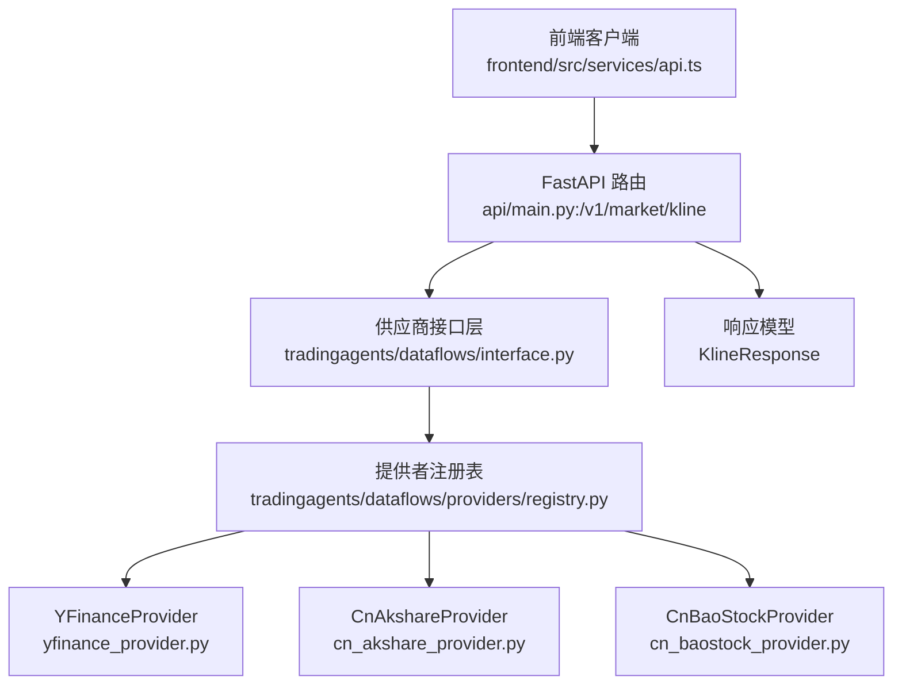
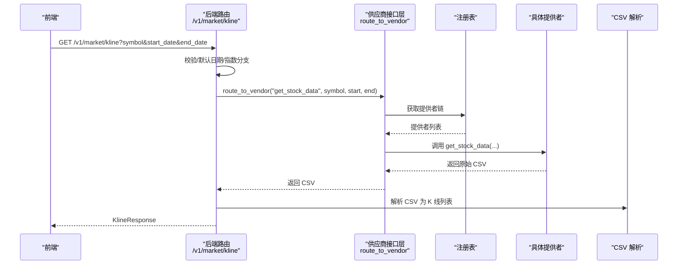
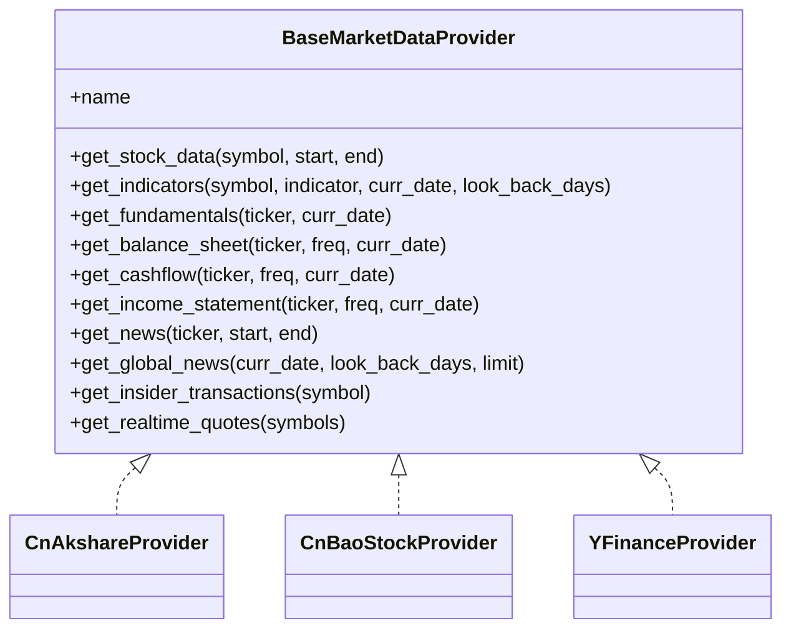

# K线数据API

<cite>
**本文档引用的文件**
- [api/main.py](file://api/main.py)
- [frontend/src/services/api.ts](file://frontend/src/services/api.ts)
- [tradingagents/dataflows/interface.py](file://tradingagents/dataflows/interface.py)
- [tradingagents/dataflows/providers/base.py](file://tradingagents/dataflows/providers/base.py)
- [tradingagents/dataflows/providers/registry.py](file://tradingagents/dataflows/providers/registry.py)
- [tradingagents/dataflows/providers/cn_akshare_provider.py](file://tradingagents/dataflows/providers/cn_akshare_provider.py)
- [tradingagents/dataflows/providers/cn_baostock_provider.py](file://tradingagents/dataflows/providers/cn_baostock_provider.py)
- [tradingagents/dataflows/providers/yfinance_provider.py](file://tradingagents/dataflows/providers/yfinance_provider.py)
- [tests/test_job_timeout_config.py](file://tests/test_job_timeout_config.py)
</cite>

## 目录
1. [简介](#简介)
2. [项目结构](#项目结构)
3. [核心组件](#核心组件)
4. [架构总览](#架构总览)
5. [详细组件分析](#详细组件分析)
6. [依赖分析](#依赖分析)
7. [性能考虑](#性能考虑)
8. [故障排查指南](#故障排查指南)
9. [结论](#结论)
10. [附录](#附录)

## 简介
本文件为 TradingAgents-AShare 项目的 K 线数据 API 参考文档，覆盖以下要点：
- K 线查询端点定义与参数使用方法（股票代码、时间范围）
- A 股与美股数据源差异及支持的周期类型
- 请求参数校验、数据格式标准化与缓存策略
- 实时数据获取、历史数据批量查询与数据质量保障最佳实践
- 错误处理、超时配置与性能优化建议

## 项目结构
K 线数据 API 的调用链由前端发起，经后端 FastAPI 路由处理，路由到统一的供应商接口层，再分派到具体的数据提供者实现（A 股多源、美股 yfinance），最后解析为统一的响应模型。

图表来源
- [frontend/src/services/api.ts:121-126](file://frontend/src/services/api.ts#L121-L126)
- [api/main.py:2604-2641](file://api/main.py#L2604-L2641)
- [tradingagents/dataflows/interface.py:125-181](file://tradingagents/dataflows/interface.py#L125-L181)
- [tradingagents/dataflows/providers/registry.py:27-34](file://tradingagents/dataflows/providers/registry.py#L27-L34)
- [tradingagents/dataflows/providers/yfinance_provider.py:14-64](file://tradingagents/dataflows/providers/yfinance_provider.py#L14-L64)
- [tradingagents/dataflows/providers/cn_akshare_provider.py:127-127](file://tradingagents/dataflows/providers/cn_akshare_provider.py#L127-L127)
- [tradingagents/dataflows/providers/cn_baostock_provider.py:14-14](file://tradingagents/dataflows/providers/cn_baostock_provider.py#L14-L14)

章节来源
- [frontend/src/services/api.ts:121-126](file://frontend/src/services/api.ts#L121-L126)
- [api/main.py:2604-2641](file://api/main.py#L2604-L2641)
- [tradingagents/dataflows/interface.py:125-181](file://tradingagents/dataflows/interface.py#L125-L181)
- [tradingagents/dataflows/providers/registry.py:27-34](file://tradingagents/dataflows/providers/registry.py#L27-L34)

## 核心组件
- 端点与参数
  - 端点：GET /v1/market/kline
  - 参数：
    - symbol：必填，股票代码或名称（A 股支持 6 位数字、交易所后缀；美股支持通用大写 Ticker；港股支持 4-5 位数字 + .HK）
    - start_date：可选，起始日期（YYYY-MM-DD）
    - end_date：可选，结束日期（YYYY-MM-DD，默认当天）
  - 行情类型：若为 A 股指数符号，则走指数专用路径；否则走个股路径，统一解析 CSV 为 K 线列表
- 数据模型
  - KlineResponse：包含 symbol、start_date、end_date、candles（数组，元素为字典，字段包含日期与 OHLCV 等）

章节来源
- [api/main.py:2604-2641](file://api/main.py#L2604-L2641)
- [api/main.py:671-676](file://api/main.py#L671-L676)

## 架构总览
K 线查询从前端发起，后端解析参数并进行符号规范化与校验，随后通过供应商接口层选择合适的提供者（A 股多源或美股 yfinance），拉取原始 CSV，解析为统一结构，最终返回给前端。

图表来源
- [api/main.py:2604-2641](file://api/main.py#L2604-L2641)
- [tradingagents/dataflows/interface.py:125-181](file://tradingagents/dataflows/interface.py#L125-L181)

## 详细组件分析

### 端点与参数
- 端点：GET /v1/market/kline
- 参数：
  - symbol：支持 A 股（如 300394.SZ、00700.HK）、美股（如 AAPL）、港股（如 00700.HK）
  - start_date：可选，未提供时默认回溯约 120 天
  - end_date：可选，默认当天
- 符号规范化与校验：
  - 对非指数符号执行符号规范化（如中文名称转 6 位代码+交易所后缀）
  - 使用正则校验符号格式，不符合预期将返回 400
- 指数分支：
  - 若为 A 股指数符号，走专用指数获取流程
- 结果：
  - 若无数据，返回 404
  - 成功返回 KlineResponse，candles 为标准化后的 K 线数组

章节来源
- [api/main.py:2604-2641](file://api/main.py#L2604-L2641)
- [api/main.py:2595-2601](file://api/main.py#L2595-L2601)
- [api/main.py:2616-2617](file://api/main.py#L2616-L2617)

### 数据提供者与数据源差异
- 提供者注册表默认包含：
  - cn_akshare（A 股历史与实时行情）
  - cn_baostock（A 股历史行情）
  - yfinance（美股历史与实时行情）
  - alpha_vantage（备用/扩展）
  - cn_stub（占位符，需显式配置）
- A 股与美股差异：
  - A 股：支持多源历史数据（akshare、baostock），并具备实时行情缓存与去抖策略
  - 美股：通过 yfinance 提供历史与实时数据，符号规范化处理（如 .SH/.SZ → .SS）
- 周期与频率：
  - 当前实现以日线为主，未在 K 线接口中暴露周/月线参数
  - 周/月线可通过上游提供者能力或另行扩展

章节来源
- [tradingagents/dataflows/providers/registry.py:27-34](file://tradingagents/dataflows/providers/registry.py#L27-L34)
- [tradingagents/dataflows/providers/cn_akshare_provider.py:127-127](file://tradingagents/dataflows/providers/cn_akshare_provider.py#L127-L127)
- [tradingagents/dataflows/providers/cn_baostock_provider.py:14-14](file://tradingagents/dataflows/providers/cn_baostock_provider.py#L14-L14)
- [tradingagents/dataflows/providers/yfinance_provider.py:14-64](file://tradingagents/dataflows/providers/yfinance_provider.py#L14-L64)

### 供应商接口层与路由
- 供应商接口层负责：
  - 根据工具方法确定类别
  - 读取配置选择首选提供者，并构建回退链
  - 逐个尝试提供者实现，遇到限流/不可用/解析异常时自动回退
  - 记录 trace 日志便于排障
- 路由到提供者：
  - 对于 K 线，调用 get_stock_data(symbol, start, end)，返回原始 CSV
  - 对于实时行情，调用 get_realtime_quotes([...])

章节来源
- [tradingagents/dataflows/interface.py:88-106](file://tradingagents/dataflows/interface.py#L88-L106)
- [tradingagents/dataflows/interface.py:125-181](file://tradingagents/dataflows/interface.py#L125-L181)

### 数据格式标准化与解析
- 统一 CSV 规范：
  - A 股多源与美股提供者均输出包含日期、开盘、最高、最低、收盘、成交量等列的 CSV
  - 输出包含头部注释行（含符号、日期范围、记录总数、抓取时间）
- 后端解析：
  - 将 CSV 解析为标准 K 线列表，确保字段齐全与数值类型正确
  - 指数与个股路径分别处理，最终统一返回 KlineResponse

章节来源
- [tradingagents/dataflows/providers/cn_akshare_provider.py:241-253](file://tradingagents/dataflows/providers/cn_akshare_provider.py#L241-L253)
- [tradingagents/dataflows/providers/cn_baostock_provider.py:109-120](file://tradingagents/dataflows/providers/cn_baostock_provider.py#L109-L120)
- [api/main.py:2437-2480](file://api/main.py#L2437-L2480)

### 缓存机制
- A 股实时行情缓存：
  - cn_akshare 提供者对实时行情进行 TTL 缓存（默认 8 秒），降低对上游的并发压力
  - 并发访问通过锁与“僵尸线程回收”机制保护，避免锁耗尽
- 历史数据缓存：
  - 后端未对历史 CSV 结果做全局缓存；若需缓存可在上游或应用层扩展

章节来源
- [tradingagents/dataflows/providers/cn_akshare_provider.py:704-763](file://tradingagents/dataflows/providers/cn_akshare_provider.py#L704-L763)
- [tradingagents/dataflows/providers/cn_akshare_provider.py:42-124](file://tradingagents/dataflows/providers/cn_akshare_provider.py#L42-L124)

### 请求参数验证与错误处理
- 参数验证：
  - 符号格式校验（A 股 6 位、港股 4-5 位+ .HK、美股通用大写）
  - 日期范围默认策略：未提供起始日期时默认回溯约 120 天
- 错误处理：
  - 400：符号不合法或格式不符
  - 404：无数据
  - 503/运行时错误：供应商链全部失败
- 前端错误处理：
  - 对非 JSON 响应与空响应进行容错处理

章节来源
- [api/main.py:2622-2635](file://api/main.py#L2622-L2635)
- [frontend/src/services/api.ts:77-86](file://frontend/src/services/api.ts#L77-L86)

### 实时数据获取与历史批量查询
- 实时数据：
  - 通过 get_realtime_quotes 接口获取 A 股实时报价，内部采用缓存与回退策略
- 历史批量查询：
  - K 线接口支持单次批量历史查询（start_date ~ end_date）
  - 如需更大范围，建议分批多次调用，避免单次请求超时

章节来源
- [tradingagents/dataflows/providers/cn_akshare_provider.py:709-791](file://tradingagents/dataflows/providers/cn_akshare_provider.py#L709-L791)
- [api/main.py:2604-2614](file://api/main.py#L2604-L2614)

### 数据质量保证最佳实践
- 符号规范化：优先使用标准化后的 symbol（如 300394.SZ），减少歧义
- 时间范围：明确 start_date 与 end_date，避免过长跨度导致超时
- 供应商选择：根据地区与数据质量偏好配置 tool_vendors，必要时启用回退链
- 并发与重试：利用提供者内置的并发控制与回退逻辑，避免触发上游限流

章节来源
- [tradingagents/dataflows/interface.py:108-122](file://tradingagents/dataflows/interface.py#L108-L122)
- [tradingagents/dataflows/providers/cn_akshare_provider.py:42-124](file://tradingagents/dataflows/providers/cn_akshare_provider.py#L42-L124)

## 依赖分析
- 组件耦合：
  - 后端路由仅依赖接口层与解析器，不直接依赖具体提供者，保持高内聚低耦合
  - 提供者实现遵循统一抽象接口，便于替换与扩展
- 外部依赖：
  - A 股：akshare、baostock
  - 美股：yfinance
  - 注册表集中管理提供者，支持动态扩展

图表来源
- [tradingagents/dataflows/providers/base.py:4-67](file://tradingagents/dataflows/providers/base.py#L4-L67)
- [tradingagents/dataflows/providers/cn_akshare_provider.py:127-127](file://tradingagents/dataflows/providers/cn_akshare_provider.py#L127-L127)
- [tradingagents/dataflows/providers/cn_baostock_provider.py:14-14](file://tradingagents/dataflows/providers/cn_baostock_provider.py#L14-L14)
- [tradingagents/dataflows/providers/yfinance_provider.py:14-64](file://tradingagents/dataflows/providers/yfinance_provider.py#L14-L64)

## 性能考虑
- 并发与限流：
  - A 股 akshare 提供者内置并发锁与“僵尸线程回收”，总并发上限与定时任务配额受控
- 缓存：
  - 实时行情 TTL 缓存（8 秒）降低上游压力
- 超时配置：
  - 作业默认超时较长（30 分钟），可结合环境变量调整
- 建议：
  - 控制单次查询时间窗口，避免长时间跨度导致超时
  - 合理设置并发与重试策略，避免触发上游限流

章节来源
- [tests/test_job_timeout_config.py:19-42](file://tests/test_job_timeout_config.py#L19-L42)
- [tradingagents/dataflows/providers/cn_akshare_provider.py:42-124](file://tradingagents/dataflows/providers/cn_akshare_provider.py#L42-L124)
- [tradingagents/dataflows/providers/cn_akshare_provider.py:704-763](file://tradingagents/dataflows/providers/cn_akshare_provider.py#L704-L763)

## 故障排查指南
- 常见错误与定位：
  - 400：符号不合法或格式不符，检查 symbol 是否符合 A/港/美规范
  - 404：无数据，检查日期范围是否合理，或上游提供者是否可用
  - 503/运行时错误：供应商链全部失败，查看 trace 日志与回退链
- 排障步骤：
  - 在接口层开启 trace，观察方法名、参数与回退链
  - 检查配置中的 tool_vendors，确认首选与回退提供者
  - 对 A 股实时行情问题，检查 TTL 缓存与并发锁状态
- 前端容错：
  - 非 JSON 响应与空响应会抛出错误，需在调用侧捕获并提示

章节来源
- [tradingagents/dataflows/interface.py:64-86](file://tradingagents/dataflows/interface.py#L64-L86)
- [tradingagents/dataflows/interface.py:125-181](file://tradingagents/dataflows/interface.py#L125-L181)
- [frontend/src/services/api.ts:77-86](file://frontend/src/services/api.ts#L77-L86)

## 结论
本 K 线数据 API 通过统一的供应商接口层与多源提供者实现，为 A 股与美股提供了稳定的日线历史与实时行情能力。通过严格的参数校验、数据格式标准化与缓存策略，能够在保证数据质量的同时提升性能与稳定性。建议在实际使用中结合地区偏好与数据需求，合理配置供应商链与查询窗口，并关注并发与超时配置以获得最佳体验。

## 附录

### API 定义概览
- 端点：GET /v1/market/kline
- 查询参数：
  - symbol：股票代码或名称（A 股/港股/美股）
  - start_date：YYYY-MM-DD（可选）
  - end_date：YYYY-MM-DD（可选，默认当天）
- 响应模型：KlineResponse（包含 symbol、start_date、end_date、candles）

章节来源
- [api/main.py:2604-2641](file://api/main.py#L2604-L2641)
- [api/main.py:671-676](file://api/main.py#L671-L676)