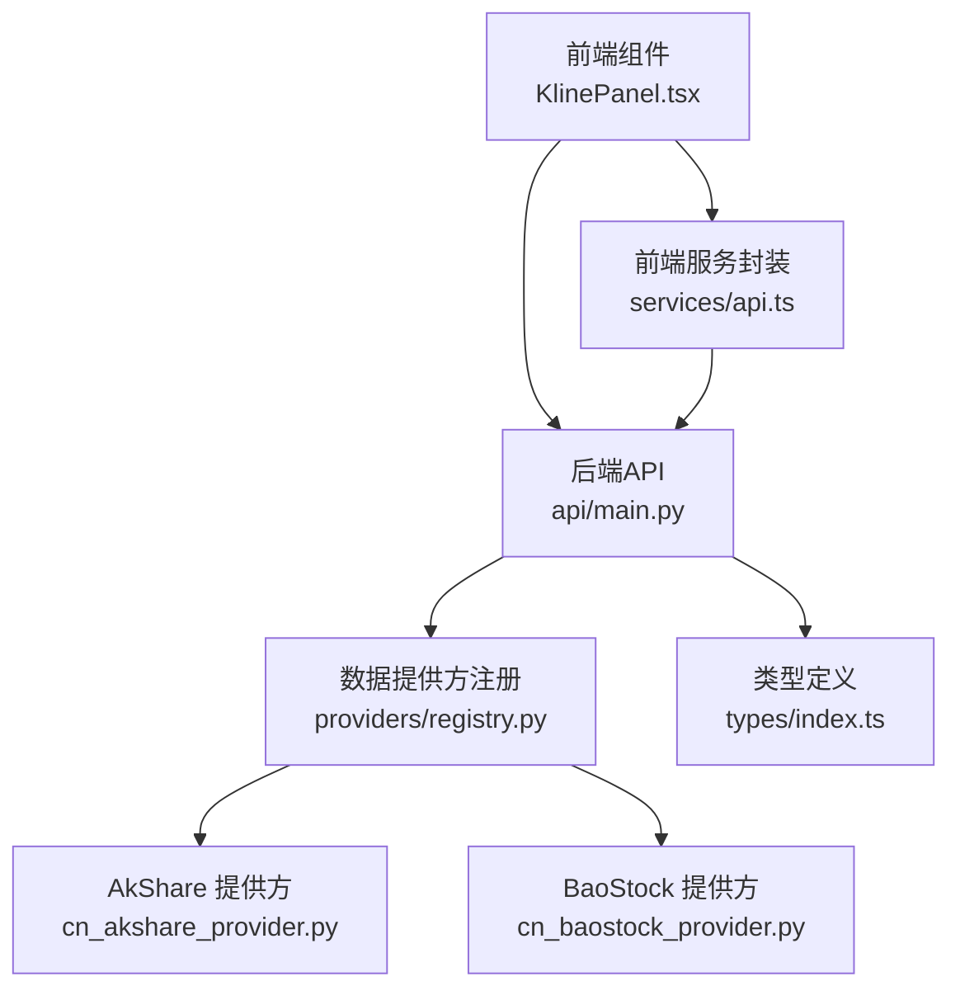
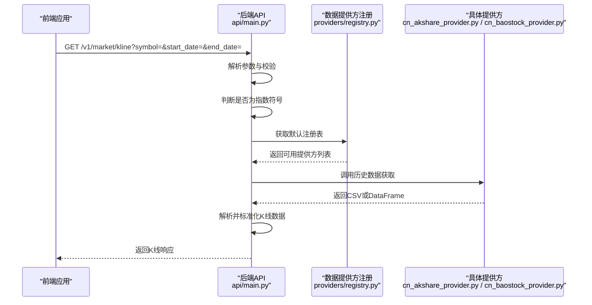
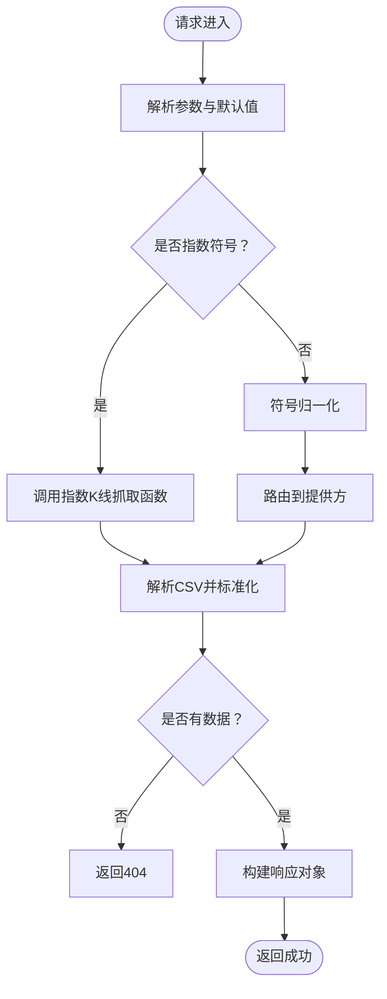
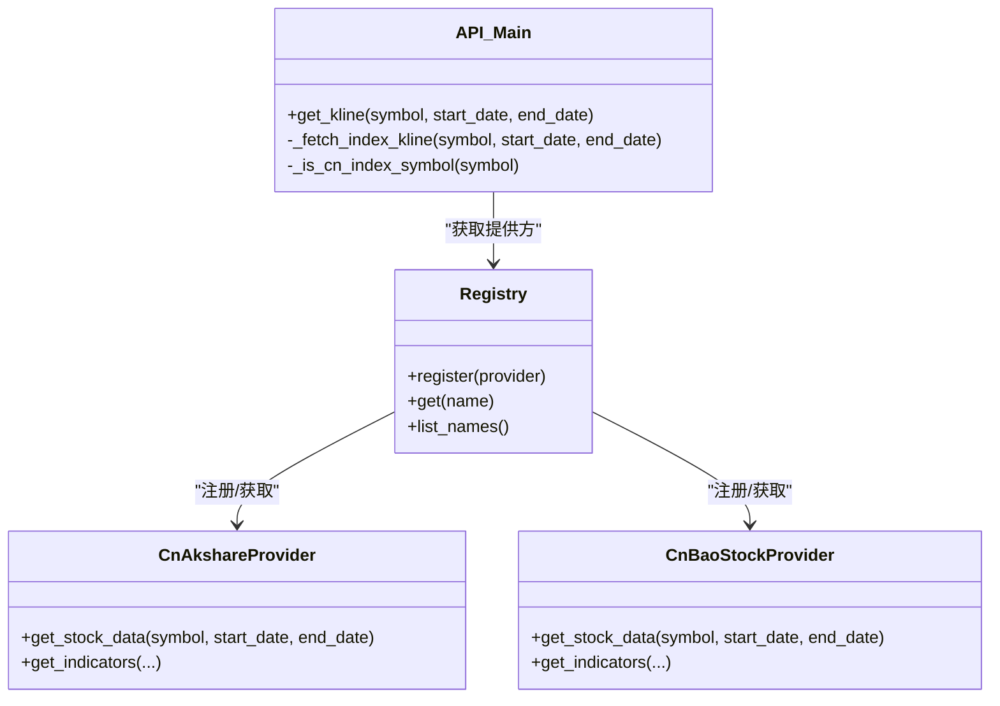

# 市场指数API

<cite>
**本文档引用的文件**
- [api/main.py](file://api/main.py)
- [frontend/src/components/KlinePanel.tsx](file://frontend/src/components/KlinePanel.tsx)
- [frontend/src/services/api.ts](file://frontend/src/services/api.ts)
- [frontend/src/types/index.ts](file://frontend/src/types/index.ts)
- [tradingagents/dataflows/providers/cn_akshare_provider.py](file://tradingagents/dataflows/providers/cn_akshare_provider.py)
- [tradingagents/dataflows/providers/cn_baostock_provider.py](file://tradingagents/dataflows/providers/cn_baostock_provider.py)
- [tradingagents/dataflows/providers/registry.py](file://tradingagents/dataflows/providers/registry.py)
- [tradingagents/graph/data_collector.py](file://tradingagents/graph/data_collector.py)
- [tradingagents/agents/analysts/market_analyst.py](file://tradingagents/agents/analysts/market_analyst.py)
</cite>

## 目录
1. [简介](#简介)
2. [项目结构](#项目结构)
3. [核心组件](#核心组件)
4. [架构总览](#架构总览)
5. [详细组件分析](#详细组件分析)
6. [依赖关系分析](#依赖关系分析)
7. [性能考虑](#性能考虑)
8. [故障排查指南](#故障排查指南)
9. [结论](#结论)
10. [附录](#附录)

## 简介
本文件为 TradingAgents-AShare 的市场指数API参考文档，聚焦于中国A股主要指数的历史行情查询、成分股与权重调整、除权除息处理、跨市场指数对比、行业板块轮动分析与宏观指标监测的接口使用方案，并提供高频采样、技术分析指标计算与可视化展示的实现思路，以及数据完整性检查、异常波动识别与基准数据校验的关键技术要点。

## 项目结构
围绕指数API的关键模块分布如下：
- 后端API层：提供指数K线查询端点与数据解析
- 前端组件层：指数K线面板、指标展示与交互
- 数据提供方层：基于 AkShare、BaoStock 等多源数据的标准化
- 分析与指标层：技术指标计算与分析流程
- 类型与服务层：统一的数据类型定义与前端API封装

图表来源
- [api/main.py](file://api/main.py)
- [frontend/src/components/KlinePanel.tsx](file://frontend/src/components/KlinePanel.tsx)
- [frontend/src/services/api.ts](file://frontend/src/services/api.ts)
- [frontend/src/types/index.ts](file://frontend/src/types/index.ts)
- [tradingagents/dataflows/providers/registry.py](file://tradingagents/dataflows/providers/registry.py)
- [tradingagents/dataflows/providers/cn_akshare_provider.py](file://tradingagents/dataflows/providers/cn_akshare_provider.py)
- [tradingagents/dataflows/providers/cn_baostock_provider.py](file://tradingagents/dataflows/providers/cn_baostock_provider.py)

章节来源
- [api/main.py](file://api/main.py)
- [frontend/src/components/KlinePanel.tsx](file://frontend/src/components/KlinePanel.tsx)
- [frontend/src/services/api.ts](file://frontend/src/services/api.ts)
- [frontend/src/types/index.ts](file://frontend/src/types/index.ts)
- [tradingagents/dataflows/providers/registry.py](file://tradingagents/dataflows/providers/registry.py)
- [tradingagents/dataflows/providers/cn_akshare_provider.py](file://tradingagents/dataflows/providers/cn_akshare_provider.py)
- [tradingagents/dataflows/providers/cn_baostock_provider.py](file://tradingagents/dataflows/providers/cn_baostock_provider.py)

## 核心组件
- 指数K线查询端点：支持上证指数、深证成指、创业板指、科创50、北证50等主要A股指数的历史K线查询
- 指数数据解析与标准化：统一时间序列格式、涨跌额与涨跌幅字段
- 多数据源适配：AkShare、BaoStock等，支持降级与合并策略
- 技术指标计算：SMA/EMA、MACD、RSI、布林带、ATR、VWMA、MFI等
- 前端可视化：指数K线面板、关键指标展示与交互式参数配置

章节来源
- [api/main.py](file://api/main.py)
- [tradingagents/dataflows/providers/cn_akshare_provider.py](file://tradingagents/dataflows/providers/cn_akshare_provider.py)
- [tradingagents/dataflows/providers/cn_baostock_provider.py](file://tradingagents/dataflows/providers/cn_baostock_provider.py)
- [frontend/src/components/KlinePanel.tsx](file://frontend/src/components/KlinePanel.tsx)

## 架构总览
指数API从请求到返回的关键路径如下：

图表来源
- [api/main.py](file://api/main.py)
- [tradingagents/dataflows/providers/registry.py](file://tradingagents/dataflows/providers/registry.py)
- [tradingagents/dataflows/providers/cn_akshare_provider.py](file://tradingagents/dataflows/providers/cn_akshare_provider.py)
- [tradingagents/dataflows/providers/cn_baostock_provider.py](file://tradingagents/dataflows/providers/cn_baostock_provider.py)

## 详细组件分析

### 指数K线查询端点
- 端点：GET /v1/market/kline
- 参数：
  - symbol：指数代码（如 000001.SH、399001.SZ、399006.SZ、000688.SH、899050.BJ）
  - start_date：开始日期（YYYY-MM-DD，默认约120个交易日）
  - end_date：结束日期（YYYY-MM-DD，默认当前日期）
- 行为：
  - 若为指数符号，调用内部指数K线抓取函数
  - 否则进行符号归一化与路由至对应提供方
  - 解析CSV为K线条目，缺失数据返回404
- 响应：
  - 包含 symbol、start_date、end_date 与 candles（K线数组）

图表来源
- [api/main.py](file://api/main.py)

章节来源
- [api/main.py](file://api/main.py)

### 指数符号映射与识别
- 指数符号映射表：维护A股主要指数代码到供应商标准代码的映射
- 符号识别：通过正则匹配判断是否为指数符号，避免误判个股

章节来源
- [api/main.py](file://api/main.py)

### 指数K线抓取与标准化
- 抓取策略：优先使用东方财富指数日线接口，其次尝试 ak.index_zh_a_hist 等备选
- 时间过滤：仅保留指定日期范围内的K线
- 字段处理：计算涨跌额与涨跌幅，确保字段一致性
- 异常处理：任一来源失败时回退到下一个来源；最终失败抛出异常

章节来源
- [api/main.py](file://api/main.py)

### 多数据源提供方
- 注册表：集中管理各提供方实例，便于扩展与切换
- AkShare提供方：
  - 支持多源历史数据抓取（东方财富、新浪、腾讯等）
  - 支持前复权（qfq）处理
  - 提供实时追加行能力
- BaoStock提供方：
  - 提供常用技术指标描述与计算入口
  - 支持SMA/EMA、MACD、RSI、布林带、ATR、VWMA、MFI等

章节来源
- [tradingagents/dataflows/providers/registry.py](file://tradingagents/dataflows/providers/registry.py)
- [tradingagents/dataflows/providers/cn_akshare_provider.py](file://tradingagents/dataflows/providers/cn_akshare_provider.py)
- [tradingagents/dataflows/providers/cn_baostock_provider.py](file://tradingagents/dataflows/providers/cn_baostock_provider.py)

### 技术指标计算与分析
- 指标集合：SMA/EMA、MACD、RSI、布林带、ATR、VWMA、MFI等
- 计算时机：在市场分析流程中并行拉取股票数据与指标数据
- 结果整合：将指标结果与近期量价数据合并，形成分析所需字段

章节来源
- [tradingagents/dataflows/providers/cn_baostock_provider.py](file://tradingagents/dataflows/providers/cn_baostock_provider.py)
- [tradingagents/graph/data_collector.py](file://tradingagents/graph/data_collector.py)
- [tradingagents/agents/analysts/market_analyst.py](file://tradingagents/agents/analysts/market_analyst.py)

### 前端可视化与交互
- 指数预设：内置上证指数、深证成指、创业板指、科创50、北证50等常用指数
- 关键指标展示：以卡片形式展示关键指标及其状态
- 交互参数：支持K线窗口大小、目标日期等参数配置

章节来源
- [frontend/src/components/KlinePanel.tsx](file://frontend/src/components/KlinePanel.tsx)
- [frontend/src/components/KeyMetrics.tsx](file://frontend/src/components/KeyMetrics.tsx)
- [frontend/src/pages/GoldBoard.tsx](file://frontend/src/pages/GoldBoard.tsx)
- [frontend/src/types/index.ts](file://frontend/src/types/index.ts)

### 接口使用示例与最佳实践
- 查询上证指数近120个交易日K线
  - 请求：GET /v1/market/kline?symbol=000001.SH
  - 响应：candles 中包含日期、开盘、最高、最低、收盘、成交量等字段
- 查询深证成指指定日期范围K线
  - 请求：GET /v1/market/kline?symbol=399001.SZ&start_date=2024-01-01&end_date=2024-06-30
- 查询创业板指并计算技术指标
  - 步骤：先调用K线接口获取历史数据，再调用指标计算接口（若提供）或本地计算

章节来源
- [api/main.py](file://api/main.py)
- [frontend/src/services/api.ts](file://frontend/src/services/api.ts)

## 依赖关系分析
- 后端API对数据提供方的依赖通过注册表解耦，便于替换与扩展
- 指数K线端点对符号识别与标准化有强依赖，需保证映射表与正则规则准确
- 前端组件依赖统一类型定义与API封装，确保数据结构一致

图表来源
- [api/main.py](file://api/main.py)
- [tradingagents/dataflows/providers/registry.py](file://tradingagents/dataflows/providers/registry.py)
- [tradingagents/dataflows/providers/cn_akshare_provider.py](file://tradingagents/dataflows/providers/cn_akshare_provider.py)
- [tradingagents/dataflows/providers/cn_baostock_provider.py](file://tradingagents/dataflows/providers/cn_baostock_provider.py)

章节来源
- [api/main.py](file://api/main.py)
- [tradingagents/dataflows/providers/registry.py](file://tradingagents/dataflows/providers/registry.py)
- [tradingagents/dataflows/providers/cn_akshare_provider.py](file://tradingagents/dataflows/providers/cn_akshare_provider.py)
- [tradingagents/dataflows/providers/cn_baostock_provider.py](file://tradingagents/dataflows/providers/cn_baostock_provider.py)

## 性能考虑
- 并行抓取：在分析流程中并行获取股票数据与指标，缩短整体等待时间
- 数据缓存：前端与后端均可引入缓存策略，减少重复请求
- 限流与降级：多数据源抓取时设置超时与重试，避免单点故障影响整体
- 批量处理：对大量指数或长时间序列，采用分批请求与增量更新策略

## 故障排查指南
- 符号不识别
  - 确认 symbol 是否符合“6位数字.市场”格式或预设指数代码
  - 检查符号映射表与正则识别逻辑
- 无数据返回
  - 检查日期范围是否正确、节假日与休市日
  - 查看多数据源抓取链路是否全部失败
- 指标计算异常
  - 确认时间窗口足够覆盖指标周期
  - 检查数据缺失与异常值处理逻辑
- 前端显示异常
  - 对齐类型定义与字段命名
  - 校验API封装与错误处理

章节来源
- [api/main.py](file://api/main.py)
- [tradingagents/graph/data_collector.py](file://tradingagents/graph/data_collector.py)

## 结论
本指数API通过统一端点与多数据源适配，实现了A股主要指数的历史K线查询与标准化输出；结合技术指标计算与前端可视化组件，能够支撑跨市场指数对比、行业轮动分析与宏观监测场景。建议在生产环境中完善缓存、限流与降级策略，并持续优化数据质量与异常处理机制。

## 附录

### 指数代码与名称对照（前端预设）
- 上证指数：000001.SH
- 深证成指：399001.SZ
- 创业板指：399006.SZ
- 科创50：000688.SH
- 北证50：899050.BJ

章节来源
- [frontend/src/components/KlinePanel.tsx](file://frontend/src/components/KlinePanel.tsx)