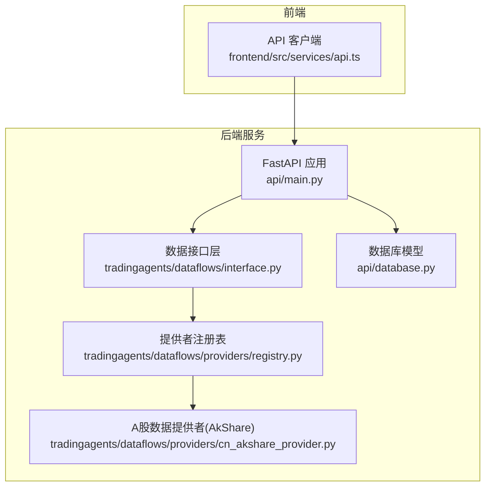
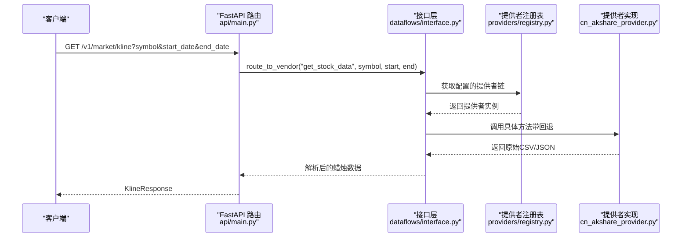
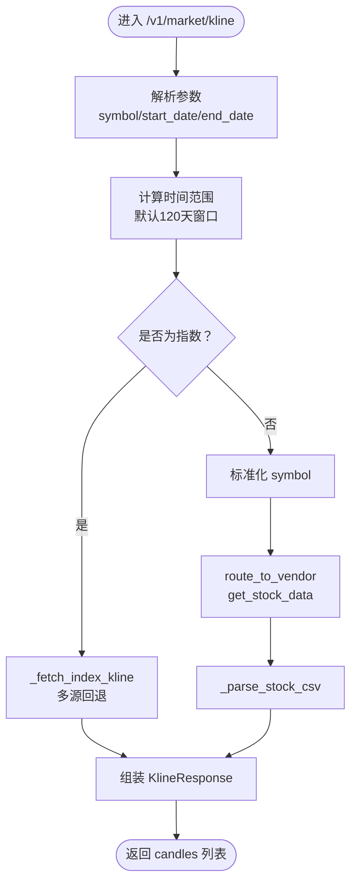
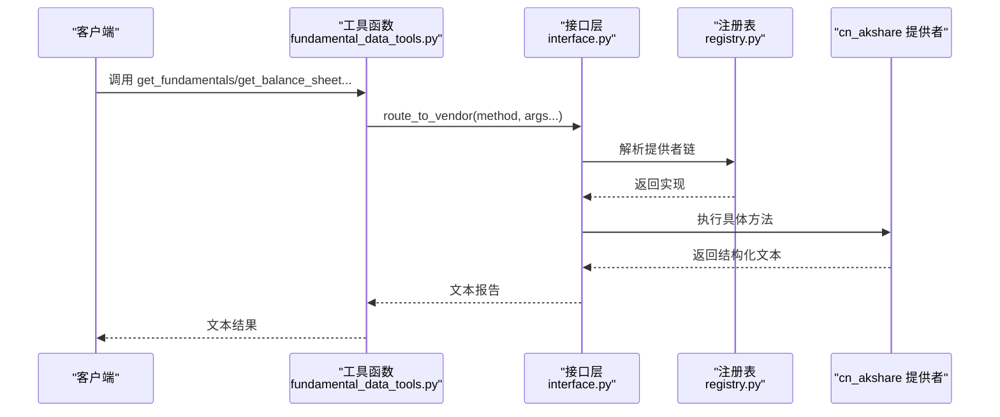
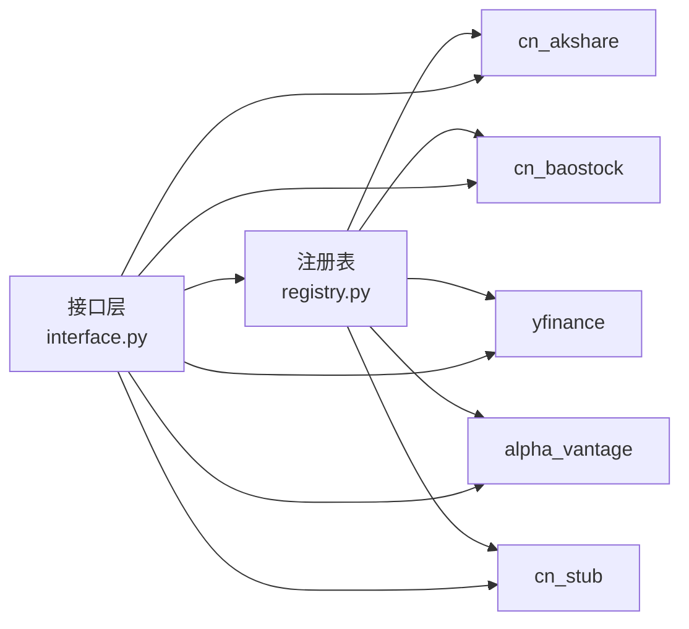

# 数据API

<cite>
**本文引用的文件**
- [api/main.py](file://api/main.py)
- [api/database.py](file://api/database.py)
- [tradingagents/dataflows/interface.py](file://tradingagents/dataflows/interface.py)
- [tradingagents/dataflows/providers/registry.py](file://tradingagents/dataflows/providers/registry.py)
- [tradingagents/dataflows/providers/cn_akshare_provider.py](file://tradingagents/dataflows/providers/cn_akshare_provider.py)
- [tradingagents/agents/utils/fundamental_data_tools.py](file://tradingagents/agents/utils/fundamental_data_tools.py)
- [frontend/src/services/api.ts](file://frontend/src/services/api.ts)
</cite>

## 目录
1. [简介](#简介)
2. [项目结构](#项目结构)
3. [核心组件](#核心组件)
4. [架构总览](#架构总览)
5. [详细组件分析](#详细组件分析)
6. [依赖分析](#依赖分析)
7. [性能考虑](#性能考虑)
8. [故障排查指南](#故障排查指南)
9. [结论](#结论)
10. [附录](#附录)

## 简介
本文件为 TradingAgents-AShare 的数据API参考文档，聚焦以下四类数据的查询与使用：
- K线数据：支持A股日线与市场指数日线
- 财务数据：公司概况、资产负债表、利润表、现金流量表等
- 新闻数据：个股新闻与时间窗口内的资讯
- 市场指数：通过统一入口按指数代码返回日线蜡烛图

文档覆盖端点定义、请求参数、响应结构、时间范围过滤、数据格式选项、分页机制、数据精度、缓存策略、实时数据与历史数据的最佳实践，以及数据质量检查与异常处理建议。

## 项目结构
围绕数据API的关键模块与职责如下：
- 后端服务入口与路由：FastAPI 应用在 api/main.py 中定义
- 数据提供者注册与路由：tradingagents/dataflows/providers 提供多数据源实现，通过接口层统一调度
- 数据库模型：api/database.py 定义报告与用户相关表结构
- 前端调用示例：frontend/src/services/api.ts 展示如何调用 K线 接口

图表来源
- [api/main.py:298-305](file://api/main.py#L298-L305)
- [tradingagents/dataflows/interface.py:125-146](file://tradingagents/dataflows/interface.py#L125-L146)
- [tradingagents/dataflows/providers/registry.py:27-34](file://tradingagents/dataflows/providers/registry.py#L27-L34)
- [tradingagents/dataflows/providers/cn_akshare_provider.py:155-196](file://tradingagents/dataflows/providers/cn_akshare_provider.py#L155-L196)
- [api/database.py:242-320](file://api/database.py#L242-L320)
- [frontend/src/services/api.ts:121-126](file://frontend/src/services/api.ts#L121-L126)

章节来源
- [api/main.py:298-305](file://api/main.py#L298-L305)
- [api/database.py:242-320](file://api/database.py#L242-L320)
- [frontend/src/services/api.ts:121-126](file://frontend/src/services/api.ts#L121-L126)

## 核心组件
- K线查询端点：/v1/market/kline
  - 支持股票与指数两种路径
  - 参数：symbol、start_date、end_date
  - 响应：KlineResponse，包含 symbol、start_date、end_date、candles 列表
- 财务数据工具：fundamentals、balance_sheet、income_statement、cashflow
  - 通过统一接口路由到具体提供者
  - 参数：ticker、freq（quarterly/annual）、curr_date
  - 返回：结构化文本报告
- 新闻数据：get_news
  - 参数：ticker、start_date、end_date
  - 返回：指定时间窗内新闻摘要与链接
- 数据提供者注册与回退：DataProviderRegistry + route_to_vendor
  - 默认注册 cn_akshare、cn_baostock、yfinance、alpha_vantage、cn_stub
  - 路由失败自动回退至下一个可用提供者

章节来源
- [api/main.py:2604-2641](file://api/main.py#L2604-L2641)
- [tradingagents/agents/utils/fundamental_data_tools.py:6-39](file://tradingagents/agents/utils/fundamental_data_tools.py#L6-L39)
- [tradingagents/dataflows/providers/cn_akshare_provider.py:566-624](file://tradingagents/dataflows/providers/cn_akshare_provider.py#L566-L624)
- [tradingagents/dataflows/providers/registry.py:27-34](file://tradingagents/dataflows/providers/registry.py#L27-L34)
- [tradingagents/dataflows/interface.py:125-146](file://tradingagents/dataflows/interface.py#L125-L146)

## 架构总览
下图展示从客户端到数据提供者的调用链路与回退策略：

图表来源
- [api/main.py:2604-2641](file://api/main.py#L2604-L2641)
- [tradingagents/dataflows/interface.py:125-146](file://tradingagents/dataflows/interface.py#L125-L146)
- [tradingagents/dataflows/providers/registry.py:27-34](file://tradingagents/dataflows/providers/registry.py#L27-L34)
- [tradingagents/dataflows/providers/cn_akshare_provider.py:330-358](file://tradingagents/dataflows/providers/cn_akshare_provider.py#L330-L358)

## 详细组件分析

### K线数据查询（/v1/market/kline）
- 请求参数
  - symbol：股票代码或指数代码
  - start_date：开始日期（YYYY-MM-DD），默认为结束日期前120天
  - end_date：结束日期（YYYY-MM-DD），默认为当日
- 时间范围过滤
  - 若未提供 start_date，则默认取 end_date 前120个自然日
  - 对于指数，内部映射到对应供应商指数代码
- 数据源选择
  - 指数：走 _fetch_index_kline，内部对多个 akshare 指数函数进行回退尝试
  - 股票：先标准化 symbol，再通过 route_to_vendor 路由到提供者
- 数据格式与精度
  - 返回 KlineResponse，candles 为数组，每项包含 OHLCV 及衍生字段
  - 实时/复权：cn_akshare 提供 qfq 复权参数，确保历史价格连续性
- 错误处理
  - 无法识别 symbol：返回 400
  - 无数据：返回 404
- 分页机制
  - 该端点不支持分页；若需更长周期，请调整 start_date/end_date

图表来源
- [api/main.py:2604-2641](file://api/main.py#L2604-L2641)
- [api/main.py:2482-2714](file://api/main.py#L2482-L2714)
- [tradingagents/dataflows/interface.py:125-146](file://tradingagents/dataflows/interface.py#L125-L146)
- [tradingagents/dataflows/providers/cn_akshare_provider.py:330-358](file://tradingagents/dataflows/providers/cn_akshare_provider.py#L330-L358)

章节来源
- [api/main.py:2604-2641](file://api/main.py#L2604-L2641)
- [api/main.py:2482-2714](file://api/main.py#L2482-L2714)
- [tradingagents/dataflows/providers/cn_akshare_provider.py:330-358](file://tradingagents/dataflows/providers/cn_akshare_provider.py#L330-L358)

### 财务数据查询（fundamentals/balance_sheet/income_statement/cashflow）
- 工具入口
  - get_fundamentals：公司概况与财务摘要
  - get_balance_sheet：资产负债表
  - get_income_statement：利润表
  - get_cashflow：现金流量表
- 参数
  - ticker：股票代码
  - freq：季度/年度（默认 quarterly）
  - curr_date：交易日期（YYYY-MM-DD）
- 数据源与回退
  - 通过 route_to_vendor 统一路由，优先使用已配置提供者，失败自动回退
- 输出格式
  - 文本化表格与说明，便于后续大模型解析

图表来源
- [tradingagents/agents/utils/fundamental_data_tools.py:6-39](file://tradingagents/agents/utils/fundamental_data_tools.py#L6-L39)
- [tradingagents/dataflows/interface.py:125-146](file://tradingagents/dataflows/interface.py#L125-L146)
- [tradingagents/dataflows/providers/registry.py:27-34](file://tradingagents/dataflows/providers/registry.py#L27-L34)
- [tradingagents/dataflows/providers/cn_akshare_provider.py:495-540](file://tradingagents/dataflows/providers/cn_akshare_provider.py#L495-L540)

章节来源
- [tradingagents/agents/utils/fundamental_data_tools.py:6-39](file://tradingagents/agents/utils/fundamental_data_tools.py#L6-L39)
- [tradingagents/dataflows/providers/cn_akshare_provider.py:566-624](file://tradingagents/dataflows/providers/cn_akshare_provider.py#L566-L624)
- [tradingagents/dataflows/providers/cn_akshare_provider.py:495-540](file://tradingagents/dataflows/providers/cn_akshare_provider.py#L495-L540)

### 新闻数据查询（get_news）
- 参数
  - ticker：股票代码
  - start_date：开始日期（YYYY-MM-DD）
  - end_date：结束日期（YYYY-MM-DD）
- 行为
  - 从 akshare 获取新闻列表，按发布日期过滤，截取前若干条
  - 返回标题、来源、摘要与链接
- 异常
  - 无数据或接口不可用时返回提示文本

章节来源
- [tradingagents/dataflows/providers/cn_akshare_provider.py:588-624](file://tradingagents/dataflows/providers/cn_akshare_provider.py#L588-L624)

### 市场指数数据（内部实现）
- 指数映射与回退
  - 内部维护 CN_INDEX_SYMBOL_MAP，将指数代码映射到 akshare 指数函数
  - 多源回退：尝试主源与其他备选源，失败自动切换
- 返回
  - 与股票 K线一致的 candles 数组

章节来源
- [api/main.py:2482-2714](file://api/main.py#L2482-L2714)

## 依赖分析
- 提供者注册与回退
  - 注册表默认包含 cn_akshare、cn_baostock、yfinance、alpha_vantage、cn_stub
  - 回退链依据配置动态生成，提升可用性
- 接口层路由
  - route_to_vendor 统一调度，记录调用轨迹，便于问题定位

图表来源
- [tradingagents/dataflows/providers/registry.py:27-34](file://tradingagents/dataflows/providers/registry.py#L27-L34)
- [tradingagents/dataflows/interface.py:125-146](file://tradingagents/dataflows/interface.py#L125-L146)

章节来源
- [tradingagents/dataflows/providers/registry.py:27-34](file://tradingagents/dataflows/providers/registry.py#L27-L34)
- [tradingagents/dataflows/interface.py:125-146](file://tradingagents/dataflows/interface.py#L125-L146)

## 性能考虑
- 缓存策略
  - 股票/ETF 名称到代码映射：7天TTL，避免频繁调用 akshare
  - 个股资金流等高频接口：提供者内部实现缓存与失败回退
- 并发与线程池
  - FastAPI 生命周期内提升 AnyIO 线程限制与默认 asyncio 线程池大小，缓解高并发阻塞
- 数据精度
  - 复权处理：cn_akshare 使用 qfq 复权，保证历史价格连续性
- 分页与批量
  - K线端点不支持分页；建议前端按时间窗口切分请求
- 最佳实践
  - 历史数据：尽量使用 end_date 前推固定天数，减少跨节假日影响
  - 实时数据：结合复权与回退策略，确保稳定性

章节来源
- [api/main.py:383-440](file://api/main.py#L383-L440)
- [api/main.py:216-279](file://api/main.py#L216-L279)
- [tradingagents/dataflows/providers/cn_akshare_provider.py:330-358](file://tradingagents/dataflows/providers/cn_akshare_provider.py#L330-L358)

## 故障排查指南
- 常见错误与处理
  - 400：symbol 不可识别或格式不符，检查 symbol 是否符合预期格式
  - 404：无数据，确认时间范围与 symbol 正确性
  - 5xx：提供者接口临时不可用，触发回退链；重试或扩大时间范围
- 日志与追踪
  - 接口层会输出方法、参数类别与回退链信息，便于定位问题
- 数据质量检查
  - 复核复权参数与时间边界
  - 对比多源返回的一致性
- 异常处理建议
  - 前端重试与退避
  - 后端记录错误并上报

章节来源
- [api/main.py:2604-2641](file://api/main.py#L2604-L2641)
- [tradingagents/dataflows/interface.py:125-146](file://tradingagents/dataflows/interface.py#L125-L146)

## 结论
本数据API通过统一接口层与多提供者回退机制，为K线、财务、新闻与指数数据提供了稳定、可扩展的访问方式。建议在生产环境中结合缓存、复权与回退策略，合理设置时间范围与重试逻辑，以获得最佳的数据质量与性能表现。

## 附录

### 端点一览与参数
- GET /v1/market/kline
  - 查询参数：symbol、start_date、end_date
  - 响应：KlineResponse（包含 candles 数组）
- 财务工具（通过工具调用）
  - get_fundamentals：ticker、curr_date
  - get_balance_sheet：ticker、freq、curr_date
  - get_income_statement：ticker、freq、curr_date
  - get_cashflow：ticker、freq、curr_date
- 新闻工具
  - get_news：ticker、start_date、end_date

章节来源
- [api/main.py:2604-2641](file://api/main.py#L2604-L2641)
- [tradingagents/agents/utils/fundamental_data_tools.py:6-39](file://tradingagents/agents/utils/fundamental_data_tools.py#L6-L39)
- [tradingagents/dataflows/providers/cn_akshare_provider.py:588-624](file://tradingagents/dataflows/providers/cn_akshare_provider.py#L588-L624)