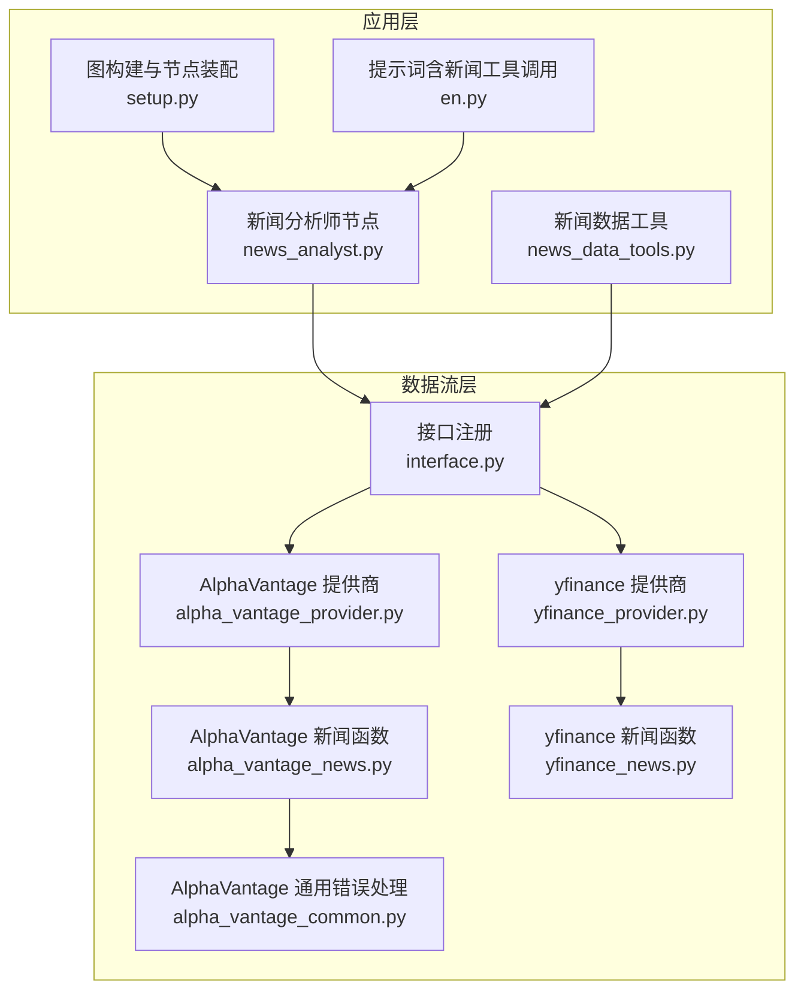
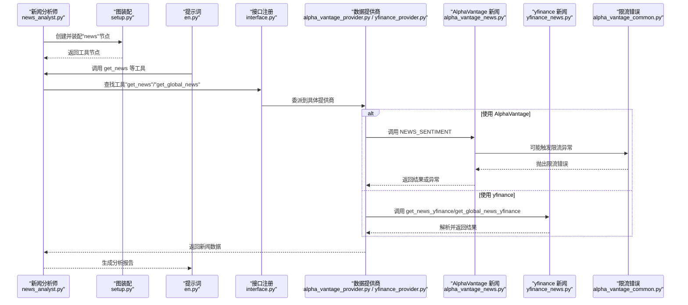
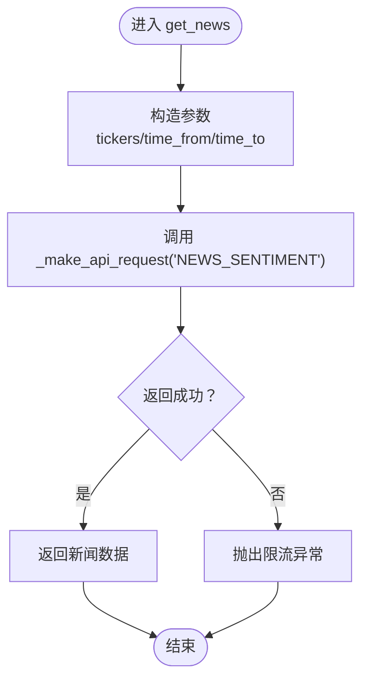
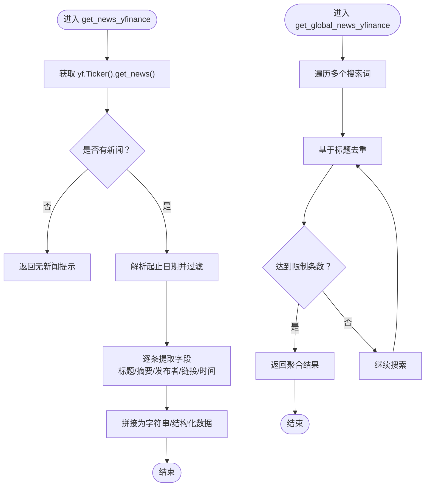
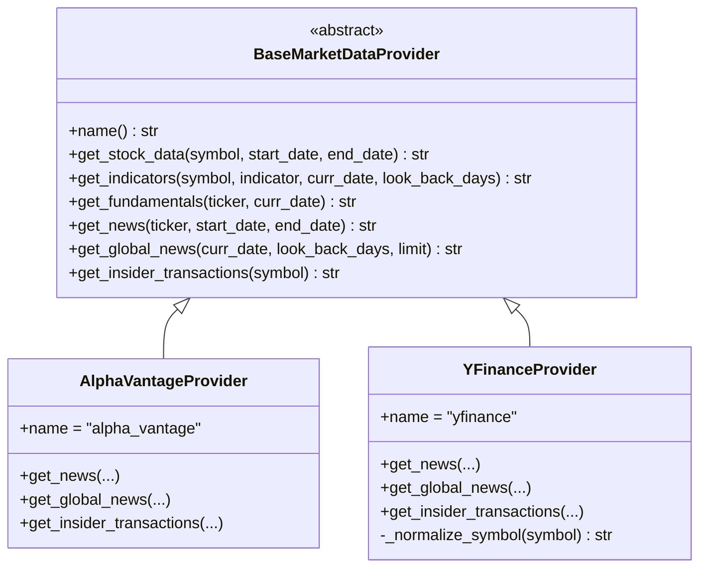
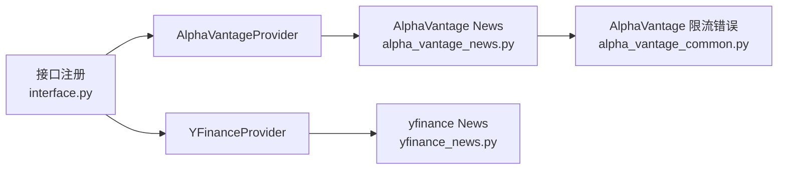

# 新闻数据API

<cite>
**本文引用的文件**
- [alpha_vantage_news.py](file://tradingagents/dataflows/alpha_vantage_news.py)
- [yfinance_news.py](file://tradingagents/dataflows/yfinance_news.py)
- [alpha_vantage_provider.py](file://tradingagents/dataflows/providers/alpha_vantage_provider.py)
- [yfinance_provider.py](file://tradingagents/dataflows/providers/yfinance_provider.py)
- [interface.py](file://tradingagents/dataflows/interface.py)
- [alpha_vantage_common.py](file://tradingagents/dataflows/alpha_vantage_common.py)
- [news_analyst.py](file://tradingagents/agents/analysts/news_analyst.py)
- [news_data_tools.py](file://tradingagents/agents/utils/news_data_tools.py)
- [setup.py](file://tradingagents/graph/setup.py)
- [en.py](file://tradingagents/prompts/en.py)
</cite>

## 目录
1. [简介](#简介)
2. [项目结构](#项目结构)
3. [核心组件](#核心组件)
4. [架构总览](#架构总览)
5. [详细组件分析](#详细组件分析)
6. [依赖关系分析](#依赖关系分析)
7. [性能考量](#性能考量)
8. [故障排查指南](#故障排查指南)
9. [结论](#结论)
10. [附录](#附录)

## 简介
本文件为 TradingAgents-AShare 的新闻数据API参考文档，聚焦于财经新闻、公告信息与研报数据的查询能力。内容覆盖以下方面：
- 查询端点与调用方式：按股票代码、全球主题、时间范围等维度检索新闻与公告
- 搜索与过滤：新闻分类、关键词搜索、时间范围过滤的使用方法
- 数据增强：情感分析、重要性评级、相关性匹配的接口参数说明
- 实时与历史：新闻数据的实时推送、历史数据批量获取与增量更新的实现思路
- 数据质量：去重、格式标准化、多语言支持的技术细节

## 项目结构
新闻数据API在项目中通过“数据流层”抽象出统一接口，并由不同供应商（AlphaVantage、yfinance）提供具体实现；上层分析节点与工具模块可直接调用。

**图表来源**
- [interface.py:1-52](file://tradingagents/dataflows/interface.py#L1-L52)
- [alpha_vantage_news.py:1-71](file://tradingagents/dataflows/alpha_vantage_news.py#L1-L71)
- [yfinance_news.py:1-163](file://tradingagents/dataflows/yfinance_news.py#L1-L163)
- [alpha_vantage_provider.py:1-55](file://tradingagents/dataflows/providers/alpha_vantage_provider.py#L1-L55)
- [yfinance_provider.py:1-63](file://tradingagents/dataflows/providers/yfinance_provider.py#L1-L63)
- [alpha_vantage_common.py:37-77](file://tradingagents/dataflows/alpha_vantage_common.py#L37-L77)
- [news_analyst.py](file://tradingagents/agents/analysts/news_analyst.py)
- [news_data_tools.py](file://tradingagents/agents/utils/news_data_tools.py)
- [setup.py:98-155](file://tradingagents/graph/setup.py#L98-L155)
- [en.py:18-22](file://tradingagents/prompts/en.py#L18-L22)

**章节来源**
- [interface.py:1-52](file://tradingagents/dataflows/interface.py#L1-L52)
- [alpha_vantage_news.py:1-71](file://tradingagents/dataflows/alpha_vantage_news.py#L1-L71)
- [yfinance_news.py:1-163](file://tradingagents/dataflows/yfinance_news.py#L1-L163)
- [alpha_vantage_provider.py:1-55](file://tradingagents/dataflows/providers/alpha_vantage_provider.py#L1-L55)
- [yfinance_provider.py:1-63](file://tradingagents/dataflows/providers/yfinance_provider.py#L1-L63)
- [alpha_vantage_common.py:37-77](file://tradingagents/dataflows/alpha_vantage_common.py#L37-L77)
- [news_analyst.py](file://tradingagents/agents/analysts/news_analyst.py)
- [news_data_tools.py](file://tradingagents/agents/utils/news_data_tools.py)
- [setup.py:98-155](file://tradingagents/graph/setup.py#L98-L155)
- [en.py:18-22](file://tradingagents/prompts/en.py#L18-L22)

## 核心组件
- 接口注册与分类
  - 在接口层定义了“新闻数据”类别，包含工具：获取个股新闻、获取全球新闻、获取内幕交易。
  - 工具名称与描述集中于接口注册处，便于统一管理与扩展。
- AlphaVantage 实现
  - 提供个股新闻与全球新闻的请求封装，支持时间范围参数；同时提供内幕交易数据。
- yfinance 实现
  - 提供个股新闻与全球新闻的抓取与解析，内置标题去重与日期范围过滤。
- 错误处理
  - 对 AlphaVantage 的限流错误进行专门捕获与抛出，保障上层稳定。

**章节来源**
- [interface.py:26-33](file://tradingagents/dataflows/interface.py#L26-L33)
- [alpha_vantage_news.py:3-23](file://tradingagents/dataflows/alpha_vantage_news.py#L3-L23)
- [alpha_vantage_news.py:25-52](file://tradingagents/dataflows/alpha_vantage_news.py#L25-L52)
- [alpha_vantage_news.py:55-71](file://tradingagents/dataflows/alpha_vantage_news.py#L55-L71)
- [yfinance_news.py:49-110](file://tradingagents/dataflows/yfinance_news.py#L49-L110)
- [yfinance_news.py:112-163](file://tradingagents/dataflows/yfinance_news.py#L112-L163)
- [alpha_vantage_common.py:37-77](file://tradingagents/dataflows/alpha_vantage_common.py#L37-L77)

## 架构总览
下图展示从“新闻分析师”到“数据源”的完整调用链路，包括工具注册、提供商适配与数据解析。

**图表来源**
- [news_analyst.py](file://tradingagents/agents/analysts/news_analyst.py)
- [setup.py:122-127](file://tradingagents/graph/setup.py#L122-L127)
- [en.py:18-22](file://tradingagents/prompts/en.py#L18-L22)
- [interface.py:26-33](file://tradingagents/dataflows/interface.py#L26-L33)
- [alpha_vantage_provider.py:46-52](file://tradingagents/dataflows/providers/alpha_vantage_provider.py#L46-L52)
- [yfinance_provider.py:54-60](file://tradingagents/dataflows/providers/yfinance_provider.py#L54-L60)
- [alpha_vantage_news.py:3-23](file://tradingagents/dataflows/alpha_vantage_news.py#L3-L23)
- [yfinance_news.py:49-110](file://tradingagents/dataflows/yfinance_news.py#L49-L110)
- [alpha_vantage_common.py:37-77](file://tradingagents/dataflows/alpha_vantage_common.py#L37-L77)

## 详细组件分析

### AlphaVantage 新闻API
- 功能概述
  - 获取个股新闻与情感分析数据
  - 获取全球市场主题新闻（无需个股筛选）
  - 获取内幕交易数据
- 关键参数
  - 个股新闻：股票代码、起始日期、结束日期
  - 全球新闻：当前日期、回溯天数、限制条数
  - 内幕交易：股票代码
- 时间范围与格式
  - 使用统一的时间格式化函数，确保请求参数符合API要求
- 错误处理
  - 当触发限流时抛出专用异常，便于上层重试或降级

**图表来源**
- [alpha_vantage_news.py:3-23](file://tradingagents/dataflows/alpha_vantage_news.py#L3-L23)
- [alpha_vantage_news.py:25-52](file://tradingagents/dataflows/alpha_vantage_news.py#L25-L52)
- [alpha_vantage_news.py:55-71](file://tradingagents/dataflows/alpha_vantage_news.py#L55-L71)
- [alpha_vantage_common.py:37-77](file://tradingagents/dataflows/alpha_vantage_common.py#L37-L77)

**章节来源**
- [alpha_vantage_news.py:3-23](file://tradingagents/dataflows/alpha_vantage_news.py#L3-L23)
- [alpha_vantage_news.py:25-52](file://tradingagents/dataflows/alpha_vantage_news.py#L25-L52)
- [alpha_vantage_news.py:55-71](file://tradingagents/dataflows/alpha_vantage_news.py#L55-L71)
- [alpha_vantage_common.py:37-77](file://tradingagents/dataflows/alpha_vantage_common.py#L37-L77)

### yfinance 新闻API
- 功能概述
  - 获取个股新闻与全球主题新闻
  - 内置标题去重与日期范围过滤
- 关键参数
  - 个股新闻：股票代码、起始日期、结束日期
  - 全球新闻：当前日期、回溯天数、限制条数
- 数据解析与标准化
  - 统一提取标题、摘要、发布者、链接与发布时间
  - 支持嵌套与扁平两种新闻结构
- 去重策略
  - 基于标题集合去重，避免重复文章
- 多语言支持
  - 由底层库决定，项目未做额外翻译处理

**图表来源**
- [yfinance_news.py:49-110](file://tradingagents/dataflows/yfinance_news.py#L49-L110)
- [yfinance_news.py:112-163](file://tradingagents/dataflows/yfinance_news.py#L112-L163)

**章节来源**
- [yfinance_news.py:49-110](file://tradingagents/dataflows/yfinance_news.py#L49-L110)
- [yfinance_news.py:112-163](file://tradingagents/dataflows/yfinance_news.py#L112-L163)

### 数据提供商适配器
- AlphaVantageProvider
  - 暴露统一方法：get_news、get_global_news、get_insider_transactions
- YFinanceProvider
  - 同样暴露上述方法，并对符号进行规范化处理（如上海/深圳后缀转换）

**图表来源**
- [alpha_vantage_provider.py:15-55](file://tradingagents/dataflows/providers/alpha_vantage_provider.py#L15-L55)
- [yfinance_provider.py:14-63](file://tradingagents/dataflows/providers/yfinance_provider.py#L14-L63)

**章节来源**
- [alpha_vantage_provider.py:15-55](file://tradingagents/dataflows/providers/alpha_vantage_provider.py#L15-L55)
- [yfinance_provider.py:14-63](file://tradingagents/dataflows/providers/yfinance_provider.py#L14-L63)

### 上层集成与调用
- 图装配
  - “news”分析师节点被创建并加入工具节点集合，供后续流程使用
- 提示词与工具
  - 提示词中明确包含“get_news”等工具调用，指导模型在分析时使用新闻数据
- 新闻数据工具
  - 提供统一的数据清洗、格式化与增强能力，支撑下游分析

**章节来源**
- [setup.py:122-127](file://tradingagents/graph/setup.py#L122-L127)
- [en.py:18-22](file://tradingagents/prompts/en.py#L18-L22)
- [news_data_tools.py](file://tradingagents/agents/utils/news_data_tools.py)

## 依赖关系分析
- 组件耦合
  - 接口层与提供商层解耦，通过统一工具名与参数约定实现替换
  - AlphaVantage 与 yfinance 的实现相互独立，便于扩展其他数据源
- 外部依赖
  - AlphaVantage 需要网络访问与密钥配置（未在本文展开）
  - yfinance 基于第三方库抓取，稳定性受其影响
- 错误传播
  - AlphaVantage 限流错误在接口层被捕获并向上抛出，避免吞没异常

**图表来源**
- [interface.py:26-33](file://tradingagents/dataflows/interface.py#L26-L33)
- [alpha_vantage_provider.py:46-52](file://tradingagents/dataflows/providers/alpha_vantage_provider.py#L46-L52)
- [yfinance_provider.py:54-60](file://tradingagents/dataflows/providers/yfinance_provider.py#L54-L60)
- [alpha_vantage_news.py:3-23](file://tradingagents/dataflows/alpha_vantage_news.py#L3-L23)
- [yfinance_news.py:49-110](file://tradingagents/dataflows/yfinance_news.py#L49-L110)
- [alpha_vantage_common.py:37-77](file://tradingagents/dataflows/alpha_vantage_common.py#L37-L77)

**章节来源**
- [interface.py:26-33](file://tradingagents/dataflows/interface.py#L26-L33)
- [alpha_vantage_provider.py:46-52](file://tradingagents/dataflows/providers/alpha_vantage_provider.py#L46-L52)
- [yfinance_provider.py:54-60](file://tradingagents/dataflows/providers/yfinance_provider.py#L54-L60)
- [alpha_vantage_news.py:3-23](file://tradingagents/dataflows/alpha_vantage_news.py#L3-L23)
- [yfinance_news.py:49-110](file://tradingagents/dataflows/yfinance_news.py#L49-L110)
- [alpha_vantage_common.py:37-77](file://tradingagents/dataflows/alpha_vantage_common.py#L37-L77)

## 性能考量
- 请求频率控制
  - AlphaVantage 存在限流机制，建议在调用前进行速率控制与指数退避重试
- 数据量与分页
  - 全球新闻支持 limit 参数，建议根据场景设置合理上限以平衡时效与成本
- 解析与过滤
  - yfinance 实现内置日期过滤与标题去重，减少下游处理开销
- 缓存策略
  - 对于相同时间窗口的历史查询，可考虑本地缓存以降低重复请求

## 故障排查指南
- AlphaVantage 限流
  - 现象：抛出限流异常
  - 处理：降低请求频率、增加重试间隔、切换备用数据源
- 无新闻返回
  - 现象：返回“未找到新闻”提示
  - 处理：检查时间范围是否过短、股票代码是否正确、网络连通性
- 字段缺失
  - 现象：部分文章缺少摘要或发布时间
  - 处理：解析逻辑已兼容嵌套与扁平结构，若仍缺失，建议扩大抓取范围或更换数据源
- 符号不匹配（yfinance）
  - 现象：查询不到数据
  - 处理：确认是否需要进行市场后缀规范化（如 .SS/.SZ）

**章节来源**
- [alpha_vantage_common.py:37-77](file://tradingagents/dataflows/alpha_vantage_common.py#L37-L77)
- [yfinance_news.py:69-71](file://tradingagents/dataflows/yfinance_news.py#L69-L71)
- [yfinance_provider.py:19-24](file://tradingagents/dataflows/providers/yfinance_provider.py#L19-L24)

## 结论
本项目通过统一接口与提供商适配器，实现了对多家数据源的新闻数据获取能力。AlphaVantage 提供情感与宏观主题新闻，yfinance 提供更灵活的个股与全球新闻抓取，并内置去重与日期过滤。结合图装配与提示词，新闻数据可无缝融入分析流程。建议在生产环境中配合限流控制、缓存与多源备份策略，以提升稳定性与性能。

## 附录

### API 参数与使用要点
- 个股新闻
  - 参数：股票代码、起始日期、结束日期
  - 用途：个股相关新闻与情感分析
- 全球新闻
  - 参数：当前日期、回溯天数、限制条数
  - 用途：宏观主题与市场概览
- 内幕交易
  - 参数：股票代码
  - 用途：关键人员交易动向

**章节来源**
- [alpha_vantage_news.py:3-23](file://tradingagents/dataflows/alpha_vantage_news.py#L3-L23)
- [alpha_vantage_news.py:25-52](file://tradingagents/dataflows/alpha_vantage_news.py#L25-L52)
- [alpha_vantage_news.py:55-71](file://tradingagents/dataflows/alpha_vantage_news.py#L55-L71)
- [yfinance_news.py:49-110](file://tradingagents/dataflows/yfinance_news.py#L49-L110)
- [yfinance_news.py:112-163](file://tradingagents/dataflows/yfinance_news.py#L112-L163)

### 实时推送、历史批量与增量更新
- 实时推送
  - 项目未提供专用的实时推送通道；可通过定时轮询或事件驱动方式拉取最新数据
- 历史批量
  - 通过设置较长的回溯天数与合适的限制条数，一次性获取历史区间内的新闻
- 增量更新
  - 建议以“最近一次抓取时间”为起点，按天推进增量抓取，结合去重策略避免重复

### 数据去重、格式标准化与多语言
- 去重
  - yfinance 基于标题集合去重；AlphaVantage 返回结构未显式去重，建议在上层统一去重
- 格式标准化
  - 统一输出字段：标题、摘要、发布者、链接、发布时间；对嵌套结构进行兼容解析
- 多语言
  - 由底层数据源决定；项目未做翻译处理

**章节来源**
- [yfinance_news.py:130-152](file://tradingagents/dataflows/yfinance_news.py#L130-L152)
- [yfinance_news.py:8-46](file://tradingagents/dataflows/yfinance_news.py#L8-L46)