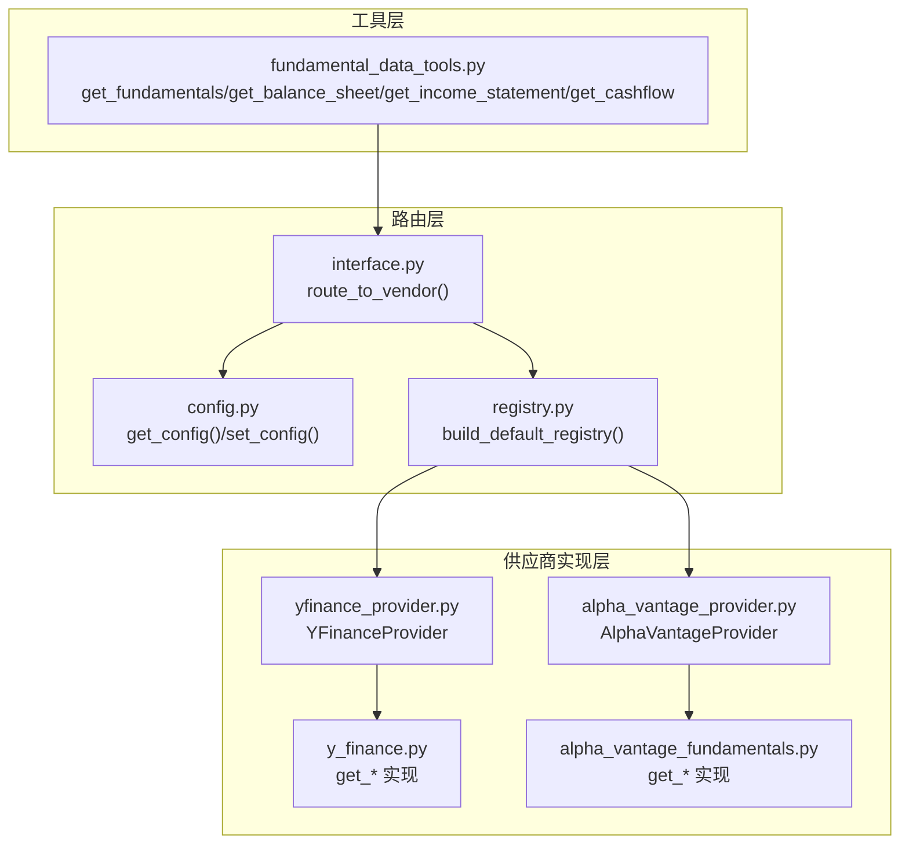
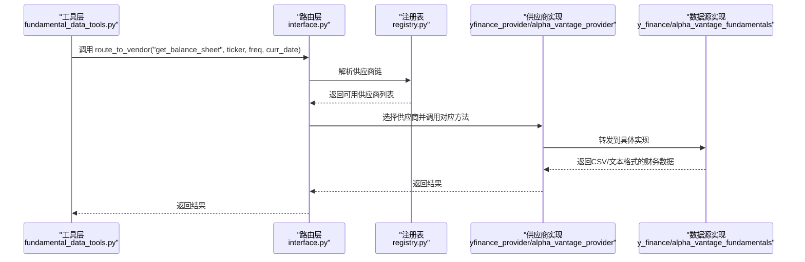
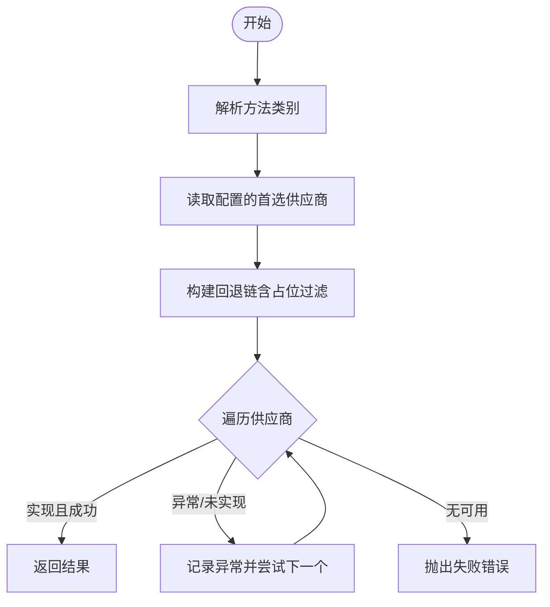
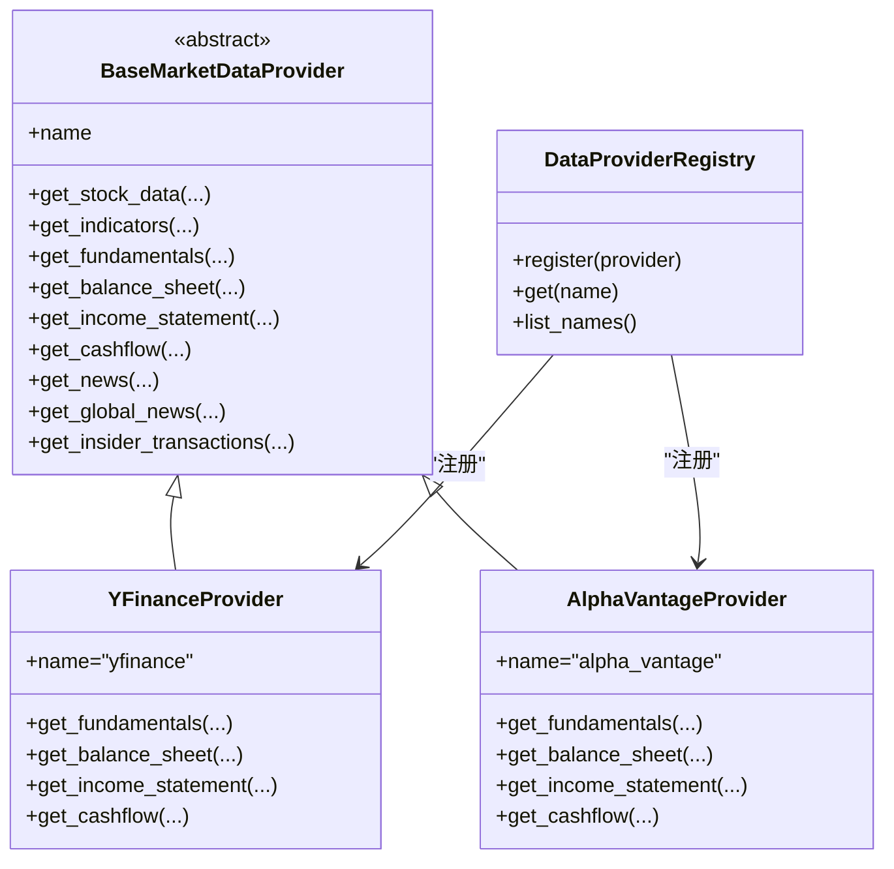

# 财务数据API

<cite>
**本文引用的文件**
- [interface.py](file://tradingagents/dataflows/interface.py)
- [fundamental_data_tools.py](file://tradingagents/agents/utils/fundamental_data_tools.py)
- [yfinance_provider.py](file://tradingagents/dataflows/providers/yfinance_provider.py)
- [alpha_vantage_provider.py](file://tradingagents/dataflows/providers/alpha_vantage_provider.py)
- [y_finance.py](file://tradingagents/dataflows/y_finance.py)
- [alpha_vantage_fundamentals.py](file://tradingagents/dataflows/alpha_vantage_fundamentals.py)
- [registry.py](file://tradingagents/dataflows/providers/registry.py)
- [config.py](file://tradingagents/dataflows/config.py)
- [report_service.py](file://api/services/report_service.py)
- [zh.py](file://tradingagents/prompts/zh.py)
- [trade_calendar.py](file://tradingagents/dataflows/trade_calendar.py)
</cite>

## 目录
1. [简介](#简介)
2. [项目结构](#项目结构)
3. [核心组件](#核心组件)
4. [架构总览](#架构总览)
5. [详细组件分析](#详细组件分析)
6. [依赖关系分析](#依赖关系分析)
7. [性能考量](#性能考量)
8. [故障排查指南](#故障排查指南)
9. [结论](#结论)
10. [附录](#附录)

## 简介
本文件为 TradingAgents-AShare 的财务数据 API 参考文档，聚焦于公司财务报表与估值指标的查询能力，覆盖资产负债表、利润表、现金流量表的数据结构与字段含义，并说明财务比率计算、趋势分析与同比/环比比较的使用方法。同时提供时间序列查询、季度与年度数据获取的参数配置说明，以及数据准确性验证、缺失值处理与数据更新频率的注意事项。

## 项目结构
财务数据能力由“工具层”“路由层”“供应商实现层”三部分组成：
- 工具层：对外暴露统一的财务查询工具函数，屏蔽底层供应商差异。
- 路由层：根据配置选择供应商并支持失败回退链。
- 供应商实现层：具体对接 yfinance、Alpha Vantage 等数据源，负责实际拉取与格式化。

图表来源
- [interface.py:125-181](file://tradingagents/dataflows/interface.py#L125-L181)
- [registry.py:27-35](file://tradingagents/dataflows/providers/registry.py#L27-L35)
- [yfinance_provider.py:14-64](file://tradingagents/dataflows/providers/yfinance_provider.py#L14-L64)
- [alpha_vantage_provider.py:15-57](file://tradingagents/dataflows/providers/alpha_vantage_provider.py#L15-L57)
- [y_finance.py:367-424](file://tradingagents/dataflows/y_finance.py#L367-L424)
- [alpha_vantage_fundamentals.py:1-76](file://tradingagents/dataflows/alpha_vantage_fundamentals.py#L1-L76)

章节来源
- [interface.py:1-181](file://tradingagents/dataflows/interface.py#L1-L181)
- [registry.py:1-35](file://tradingagents/dataflows/providers/registry.py#L1-L35)

## 核心组件
- 工具函数
  - get_fundamentals：综合财务概览与关键指标
  - get_balance_sheet：资产负债表（季度/年度）
  - get_income_statement：利润表（季度/年度）
  - get_cashflow：现金流量表（季度/年度）
- 路由与回退
  - route_to_vendor：按类别与方法名解析供应商，支持配置链与自动回退
- 供应商实现
  - yfinance_provider：封装 yfinance 数据源
  - alpha_vantage_provider：封装 Alpha Vantage 数据源
- 配置与注册
  - config：全局配置读取与覆盖
  - registry：默认供应商注册表

章节来源
- [fundamental_data_tools.py:6-77](file://tradingagents/agents/utils/fundamental_data_tools.py#L6-L77)
- [interface.py:88-181](file://tradingagents/dataflows/interface.py#L88-L181)
- [yfinance_provider.py:14-64](file://tradingagents/dataflows/providers/yfinance_provider.py#L14-L64)
- [alpha_vantage_provider.py:15-57](file://tradingagents/dataflows/providers/alpha_vantage_provider.py#L15-L57)
- [config.py:8-32](file://tradingagents/dataflows/config.py#L8-L32)
- [registry.py:27-35](file://tradingagents/dataflows/providers/registry.py#L27-L35)

## 架构总览
财务查询从工具层开始，经路由层选择供应商，最终落到具体实现层的数据源。路由层支持配置化的供应商链与自动回退，确保在单一数据源异常时仍可获取数据。

图表来源
- [fundamental_data_tools.py:23-39](file://tradingagents/agents/utils/fundamental_data_tools.py#L23-L39)
- [interface.py:125-181](file://tradingagents/dataflows/interface.py#L125-L181)
- [registry.py:27-35](file://tradingagents/dataflows/providers/registry.py#L27-L35)
- [yfinance_provider.py:39-42](file://tradingagents/dataflows/providers/yfinance_provider.py#L39-L42)
- [alpha_vantage_provider.py:31-34](file://tradingagents/dataflows/providers/alpha_vantage_provider.py#L31-L34)
- [y_finance.py:367-394](file://tradingagents/dataflows/y_finance.py#L367-L394)
- [alpha_vantage_fundamentals.py:22-38](file://tradingagents/dataflows/alpha_vantage_fundamentals.py#L22-L38)

## 详细组件分析

### 工具层：统一财务查询入口
- get_fundamentals
  - 参数：ticker（股票代码）、curr_date（交易日期，yyyy-mm-dd）
  - 返回：综合财务概览与关键指标（文本/CSV）
- get_balance_sheet
  - 参数：ticker、freq（annual/quarterly，默认quarterly）、curr_date
  - 返回：资产负债表（文本/CSV）
- get_income_statement
  - 参数：ticker、freq、curr_date
  - 返回：利润表（文本/CSV）
- get_cashflow
  - 参数：ticker、freq、curr_date
  - 返回：现金流量表（文本/CSV）

章节来源
- [fundamental_data_tools.py:6-77](file://tradingagents/agents/utils/fundamental_data_tools.py#L6-L77)

### 路由层：供应商选择与回退
- get_category_for_method：根据方法名确定所属类别（fundamental_data）
- get_vendor：读取配置决定首选供应商（默认 yfinance），支持按工具覆盖
- route_to_vendor：构建供应商链（配置链 + 其他可用供应商），逐个尝试，遇到限流/未实现/解析错误自动回退
- _resolve_vendor_chain：将配置中的逗号分隔供应商展开为完整回退链，排除占位供应商

图表来源
- [interface.py:88-181](file://tradingagents/dataflows/interface.py#L88-L181)

章节来源
- [interface.py:88-181](file://tradingagents/dataflows/interface.py#L88-L181)

### 供应商实现层

#### yfinance_provider
- 提供 get_fundamentals、get_balance_sheet、get_income_statement、get_cashflow
- 将 ticker 符号标准化（如 SH/SZ 后缀处理）
- 调用 y_finance.py 中对应实现，返回 CSV 文本并附加头部信息

章节来源
- [yfinance_provider.py:14-64](file://tradingagents/dataflows/providers/yfinance_provider.py#L14-L64)
- [y_finance.py:367-424](file://tradingagents/dataflows/y_finance.py#L367-L424)

#### alpha_vantage_provider
- 提供 get_fundamentals、get_balance_sheet、get_income_statement、get_cashflow
- 调用 alpha_vantage_fundamentals.py 中对应实现，返回标准化字段的文本

章节来源
- [alpha_vantage_provider.py:15-57](file://tradingagents/dataflows/providers/alpha_vantage_provider.py#L15-L57)
- [alpha_vantage_fundamentals.py:1-76](file://tradingagents/dataflows/alpha_vantage_fundamentals.py#L1-L76)

### 数据结构与字段说明

#### 综合财务概览（get_fundamentals）
- 字段示例（来源于 yfinance 实现）：公司名称、板块、行业、市值、市盈率（TTM/Forward）、PEG、市净率、EPS（TTM/Forward）、股息率、Beta、52周高低、50/200日均线、收入（TTM）、毛利、EBITDA、净利润、利润率、运营利润率、ROE、ROA、资产负债率、流动比率、账面价值、自由现金流等
- 输出格式：带标题与时间戳的文本块，便于后续解析或直接展示

章节来源
- [y_finance.py:322-351](file://tradingagents/dataflows/y_finance.py#L322-L351)
- [y_finance.py:353-365](file://tradingagents/dataflows/y_finance.py#L353-L365)

#### 资产负债表（get_balance_sheet）
- 频率：annual/quarterly
- 输出格式：CSV 文本，包含各会计科目列与报告期行，带标题与时间戳
- 异常：当数据为空时返回提示信息

章节来源
- [yfinance_provider.py:39-42](file://tradingagents/dataflows/providers/yfinance_provider.py#L39-L42)
- [y_finance.py:367-394](file://tradingagents/dataflows/y_finance.py#L367-L394)
- [alpha_vantage_fundamentals.py:22-38](file://tradingagents/dataflows/alpha_vantage_fundamentals.py#L22-L38)

#### 利润表（get_income_statement）
- 频率：annual/quarterly
- 输出格式：CSV 文本，包含各会计科目列与报告期行，带标题与时间戳
- 异常：当数据为空时返回提示信息

章节来源
- [yfinance_provider.py:49-52](file://tradingagents/dataflows/providers/yfinance_provider.py#L49-L52)
- [y_finance.py:397-424](file://tradingagents/dataflows/y_finance.py#L397-L424)
- [alpha_vantage_fundamentals.py:60-76](file://tradingagents/dataflows/alpha_vantage_fundamentals.py#L60-L76)

#### 现金流量表（get_cashflow）
- 频率：annual/quarterly
- 输出格式：CSV 文本，包含各会计科目列与报告期行，带标题与时间戳
- 异常：当数据为空时返回提示信息

章节来源
- [yfinance_provider.py:44-47](file://tradingagents/dataflows/providers/yfinance_provider.py#L44-L47)
- [y_finance.py:397-424](file://tradingagents/dataflows/y_finance.py#L397-L424)
- [alpha_vantage_fundamentals.py:41-57](file://tradingagents/dataflows/alpha_vantage_fundamentals.py#L41-L57)

### 财务比率计算与趋势分析
- 关键指标（示例字段来自 yfinance 实现）：PE（TTM/Forward）、PEG、PB、EPS（TTM/Forward）、股息率、Beta、利润率、运营利润率、ROE、ROA、债务权益比、流动比率、自由现金流
- 趋势与同比/环比：工具层与提示词强调需明确指出缺失报表/字段，并解释驱动因素（销量、价格、成本、费用、资本开支等），关注现金流质量、杠杆与偿债、利润可持续性
- 报告输出：建议输出包含商业模式与竞争力、收入与盈利质量、资产与现金流健康度、核心风险、中期持仓结论与触发条件，并附带机读摘要键名固定的结论

章节来源
- [y_finance.py:322-351](file://tradingagents/dataflows/y_finance.py#L322-L351)
- [zh.py:65-88](file://tradingagents/prompts/zh.py#L65-L88)

### 时间序列查询、季度与年度数据
- 参数
  - ticker：股票代码
  - freq：annual 或 quarterly（默认 quarterly）
  - curr_date：当前交易日期（yyyy-mm-dd），部分实现会忽略该参数
- 结果
  - 所有财务报表接口返回 CSV 文本，可直接解析为表格或时间序列
  - 年度与季度数据在同一接口内通过 freq 参数切换

章节来源
- [fundamental_data_tools.py:23-77](file://tradingagents/agents/utils/fundamental_data_tools.py#L23-L77)
- [yfinance_provider.py:39-52](file://tradingagents/dataflows/providers/yfinance_provider.py#L39-L52)
- [alpha_vantage_fundamentals.py:22-76](file://tradingagents/dataflows/alpha_vantage_fundamentals.py#L22-L76)

### 数据准确性验证、缺失值处理与更新频率
- 缺失值与空数据
  - 当数据源返回空数据时，yfinance 实现会返回“未找到数据”的提示文本
  - 路由层对异常进行回退，避免单点失败导致整体失败
- 更新频率
  - 交易日与数据更新状态：A股交易日、盘前/盘中/盘后阶段、当日收盘后的数据更新状态会影响可获取性
- 建议
  - 在提示词中明确标注缺失报表/字段及对结论的影响
  - 使用回退链提升数据可用性

章节来源
- [y_finance.py:381-383](file://tradingagents/dataflows/y_finance.py#L381-L383)
- [interface.py:148-168](file://tradingagents/dataflows/interface.py#L148-L168)
- [trade_calendar.py:104-118](file://tradingagents/dataflows/trade_calendar.py#L104-L118)

## 依赖关系分析

图表来源
- [yfinance_provider.py:14-64](file://tradingagents/dataflows/providers/yfinance_provider.py#L14-L64)
- [alpha_vantage_provider.py:15-57](file://tradingagents/dataflows/providers/alpha_vantage_provider.py#L15-L57)
- [registry.py:11-35](file://tradingagents/dataflows/providers/registry.py#L11-L35)

章节来源
- [registry.py:11-35](file://tradingagents/dataflows/providers/registry.py#L11-L35)

## 性能考量
- 路由层具备自动回退机制，可在单一供应商失败时快速切换，减少整体等待时间
- 供应商实现层返回 CSV 文本，便于前端/下游直接解析，减少额外转换开销
- 建议：在高频查询场景下合理设置轮询间隔，避免触发限流

## 故障排查指南
- 无可用供应商
  - 现象：抛出“无可用供应商”的错误
  - 排查：检查配置项 data_vendors 与 tool_vendors，确认供应商名称正确且已注册
- 供应商未实现某方法
  - 现象：路由层记录“未实现”并尝试下一个供应商
  - 排查：确认所用供应商是否支持对应方法
- 数据为空
  - 现象：yfinance 实现返回“未找到数据”
  - 排查：确认 ticker 是否正确、交易日是否正常、是否为停牌或数据延迟
- 限流或解析异常
  - 现象：路由层记录异常并回退
  - 排查：降低请求频率、检查网络与第三方服务状态

章节来源
- [interface.py:148-181](file://tradingagents/dataflows/interface.py#L148-L181)
- [y_finance.py:381-394](file://tradingagents/dataflows/y_finance.py#L381-L394)

## 结论
本财务数据 API 通过统一工具层与灵活的路由回退机制，实现了对资产负债表、利润表、现金流量表与综合财务概览的稳定访问。结合提示词中的趋势与比率分析建议，可支撑更深入的财务分析与投资决策。在使用中应关注数据可用性、缺失值处理与更新频率，并通过配置化供应商链提升鲁棒性。

## 附录

### API 定义与参数
- get_fundamentals
  - 请求参数：ticker（字符串）、curr_date（字符串，yyyy-mm-dd）
  - 返回：综合财务概览文本
- get_balance_sheet
  - 请求参数：ticker（字符串）、freq（字符串，annual/quarterly，默认 quarterly）、curr_date（字符串，yyyy-mm-dd）
  - 返回：资产负债表 CSV 文本
- get_income_statement
  - 请求参数：ticker（字符串）、freq（字符串，annual/quarterly，默认 quarterly）、curr_date（字符串，yyyy-mm-dd）
  - 返回：利润表 CSV 文本
- get_cashflow
  - 请求参数：ticker（字符串）、freq（字符串，annual/quarterly，默认 quarterly）、curr_date（字符串，yyyy-mm-dd）
  - 返回：现金流量表 CSV 文本

章节来源
- [fundamental_data_tools.py:6-77](file://tradingagents/agents/utils/fundamental_data_tools.py#L6-L77)
- [yfinance_provider.py:36-52](file://tradingagents/dataflows/providers/yfinance_provider.py#L36-L52)
- [alpha_vantage_provider.py:28-44](file://tradingagents/dataflows/providers/alpha_vantage_provider.py#L28-L44)

### 配置要点
- 供应商类别映射：fundamental_data 类别默认使用 yfinance，可通过配置覆盖
- 工具级供应商覆盖：可针对具体工具（如 get_balance_sheet）单独指定供应商
- 回退链：除显式配置外，自动追加其他已注册且非占位的供应商

章节来源
- [interface.py:96-122](file://tradingagents/dataflows/interface.py#L96-L122)
- [config.py:23-27](file://tradingagents/dataflows/config.py#L23-L27)