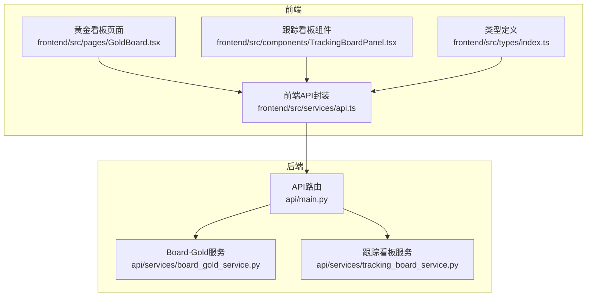
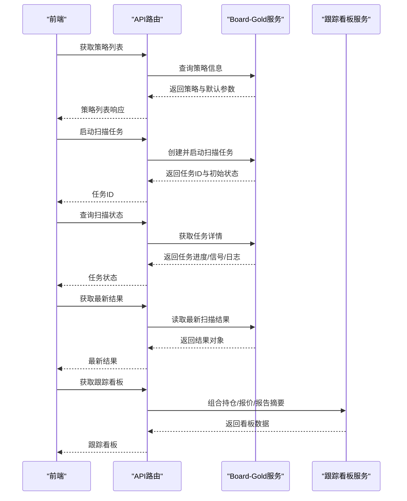
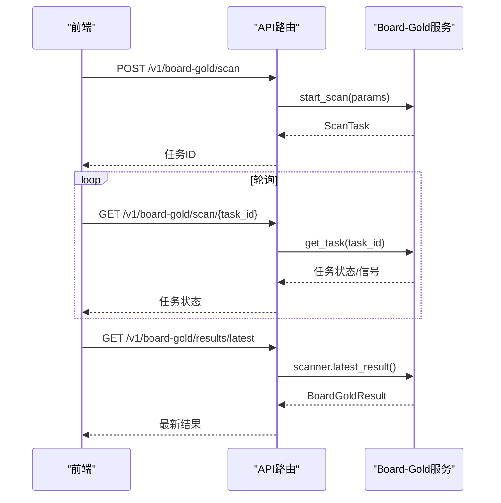
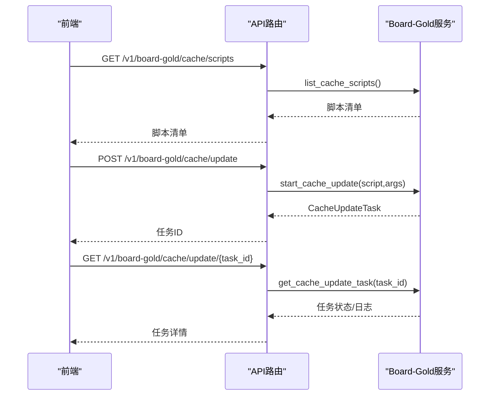
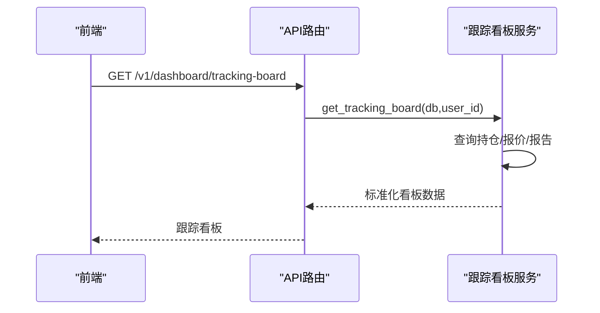
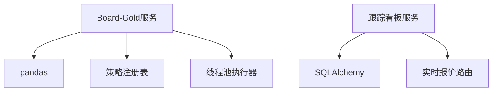

# 看板管理API

<cite>
**本文档引用的文件**
- [api/main.py](file://api/main.py)
- [api/services/board_gold_service.py](file://api/services/board_gold_service.py)
- [api/services/tracking_board_service.py](file://api/services/tracking_board_service.py)
- [frontend/src/services/api.ts](file://frontend/src/services/api.ts)
- [frontend/src/types/index.ts](file://frontend/src/types/index.ts)
- [frontend/src/pages/GoldBoard.tsx](file://frontend/src/pages/GoldBoard.tsx)
- [frontend/src/components/TrackingBoardPanel.tsx](file://frontend/src/components/TrackingBoardPanel.tsx)
- [tests/test_board_gold_api.py](file://tests/test_board_gold_api.py)
- [tests/test_board_gold_service.py](file://tests/test_board_gold_service.py)
</cite>

## 目录
1. [简介](#简介)
2. [项目结构](#项目结构)
3. [核心组件](#核心组件)
4. [架构总览](#架构总览)
5. [详细组件分析](#详细组件分析)
6. [依赖关系分析](#依赖关系分析)
7. [性能考虑](#性能考虑)
8. [故障排查指南](#故障排查指南)
9. [结论](#结论)
10. [附录](#附录)

## 简介
本文件为 TradingAgents-AShare 的看板管理API参考文档，覆盖以下能力：
- 看板信号扫描：支持多策略入场信号扫描与结果聚合，含任务状态查询、最新结果获取、退出信号扫描。
- 策略配置：内置入场策略与出场策略的默认参数与启用开关，支持按需调整。
- 结果管理：扫描任务的分页/进度/日志管理，缓存更新任务的生命周期管理。
- 看板数据：跟踪看板（Dashboard Tracking Board）整合用户持仓、实时行情与报告摘要，支持定时刷新。

## 项目结构
围绕看板管理API的关键模块分布如下：
- 后端API路由与控制器：位于 api/main.py，提供看板扫描、缓存更新、退出扫描等REST接口。
- 策略服务：位于 api/services/board_gold_service.py，包含策略注册、扫描执行、缓存更新、任务管理等。
- 跟踪看板服务：位于 api/services/tracking_board_service.py，负责组合用户持仓、实时报价与报告摘要。
- 前端API封装与类型定义：位于 frontend/src/services/api.ts 与 frontend/src/types/index.ts，提供统一的HTTP客户端与数据模型。
- 前端页面与组件：位于 frontend/src/pages/GoldBoard.tsx 与 frontend/src/components/TrackingBoardPanel.tsx，承载看板UI与交互逻辑。

**图表来源**
- [api/main.py](file://api/main.py)
- [api/services/board_gold_service.py](file://api/services/board_gold_service.py)
- [api/services/tracking_board_service.py](file://api/services/tracking_board_service.py)
- [frontend/src/services/api.ts](file://frontend/src/services/api.ts)
- [frontend/src/types/index.ts](file://frontend/src/types/index.ts)
- [frontend/src/pages/GoldBoard.tsx](file://frontend/src/pages/GoldBoard.tsx)
- [frontend/src/components/TrackingBoardPanel.tsx](file://frontend/src/components/TrackingBoardPanel.tsx)

**章节来源**
- [api/main.py](file://api/main.py)
- [api/services/board_gold_service.py](file://api/services/board_gold_service.py)
- [api/services/tracking_board_service.py](file://api/services/tracking_board_service.py)
- [frontend/src/services/api.ts](file://frontend/src/services/api.ts)
- [frontend/src/types/index.ts](file://frontend/src/types/index.ts)
- [frontend/src/pages/GoldBoard.tsx](file://frontend/src/pages/GoldBoard.tsx)
- [frontend/src/components/TrackingBoardPanel.tsx](file://frontend/src/components/TrackingBoardPanel.tsx)

## 核心组件
- Board-Gold策略扫描器：负责加载本地缓存数据、执行入场策略扫描、生成信号并汇总统计。
- 策略注册表：集中管理入场策略与出场策略的实现与默认参数。
- 扫描任务与缓存任务：异步执行扫描与缓存更新，支持状态查询、日志追踪与错误上报。
- 跟踪看板服务：聚合用户持仓、实时报价与报告摘要，输出标准化响应结构。

**章节来源**
- [api/services/board_gold_service.py](file://api/services/board_gold_service.py)
- [api/services/tracking_board_service.py](file://api/services/tracking_board_service.py)

## 架构总览
看板管理API采用前后端分离架构：
- 前端通过HTTP客户端封装调用后端REST接口，获取策略列表、启动扫描任务、查询任务状态、获取最新结果、发起缓存更新等。
- 后端根据请求参数构建扫描任务，异步执行策略扫描与缓存更新，并返回任务ID与进度信息。
- 跟踪看板服务基于用户持仓与实时报价，结合历史报告摘要，生成看板数据。

**图表来源**
- [api/main.py](file://api/main.py)
- [api/services/board_gold_service.py](file://api/services/board_gold_service.py)
- [api/services/tracking_board_service.py](file://api/services/tracking_board_service.py)
- [frontend/src/services/api.ts](file://frontend/src/services/api.ts)

## 详细组件分析

### Board-Gold 策略扫描API
- 入场策略扫描
  - 接口：POST /v1/board-gold/scan
  - 请求体：BoardGoldScanRequest（可选字段：strategies、symbols、days、target_date、max_stocks）
  - 行为：根据请求参数构建扫描任务，若未指定策略/股票则扫描全量。
  - 响应：ScanTask（包含任务ID、状态、进度、信号列表、日志等）。
- 扫描任务状态查询
  - 接口：GET /v1/board-gold/scan/{task_id}
  - 行为：返回指定任务的当前状态与进度。
- 最新结果获取
  - 接口：GET /v1/board-gold/results/latest
  - 行为：返回最近一次扫描的聚合结果（包含扫描时间、策略集合、天数、信号总数、信号列表与按策略的汇总统计）。
- 退出信号扫描
  - 接口：POST /v1/board-gold/exit-scan
  - 请求体：BoardGoldExitScanRequest（entries、exit_strategy、days）
  - 行为：对已入场信号应用指定出场策略进行回测式扫描，返回出场信号与统计。

**图表来源**
- [api/main.py](file://api/main.py)
- [api/services/board_gold_service.py](file://api/services/board_gold_service.py)

**章节来源**
- [api/main.py](file://api/main.py)
- [api/services/board_gold_service.py](file://api/services/board_gold_service.py)
- [frontend/src/services/api.ts](file://frontend/src/services/api.ts)
- [frontend/src/types/index.ts](file://frontend/src/types/index.ts)

### Board-Gold 策略配置与参数
- 入场策略（默认启用）：
  - three_yin：三阴不破阳（最小/最大阴线天数、是否要求缩量）
  - overnight_hold：一夜持股（T+1放量高开比值、T+2下影线占比）
  - shrink_yang：涨停缩量阳（缩量比例、最小涨幅）
  - phoenix：涨停金凤凰（整理天数范围、上市天数、波动率、收盘贴近度、整理底部支撑、平均成交额门槛、是否允许熊K）
  - triple_volume：三倍量突破（放量倍数、最小涨幅、整理天数、信号量比）
  - shrink_yin：涨停缩量阴（缩量比例）
- 出场策略（默认启用）：
  - fixed_exit：固定止盈止损（止盈、止损、最大持有天数）
  - trailing_exit：移动止盈（止盈、止损、移动止盈比例、最大持有天数）
  - phoenix_exit：金凤凰离场（止损、移动止盈、最大持有天数，额外支持放量阴线跌破支撑）

参数校验与过滤：
- 参数类型安全转换与缺省值处理，避免空值导致异常。
- 策略扫描过程包含成交量趋势、价格形态、时间窗口等过滤条件，确保信号质量。

**章节来源**
- [api/services/board_gold_service.py](file://api/services/board_gold_service.py)
- [tests/test_board_gold_service.py](file://tests/test_board_gold_service.py)

### Board-Gold 缓存管理API
- 缓存脚本列表
  - 接口：GET /v1/board-gold/cache/scripts
  - 行为：返回可用的缓存更新脚本清单与描述。
- 缓存统计
  - 接口：GET /v1/board-gold/cache/stats
  - 行为：返回数据目录、基础信息文件、日线缓存数量、最新文件时间等统计。
- 启动缓存更新
  - 接口：POST /v1/board-gold/cache/update
  - 请求体：BoardGoldCacheUpdateRequest（script、args）
  - 行为：启动缓存更新任务，支持内部脚本与外部脚本两种模式。
- 查询缓存更新任务
  - 接口：GET /v1/board-gold/cache/update/{task_id}
  - 行为：返回任务状态、进度、命令、日志等。
- 获取活动缓存任务
  - 接口：GET /v1/board-gold/cache/update/active
  - 行为：返回当前运行中的缓存任务。

**图表来源**
- [api/main.py](file://api/main.py)
- [api/services/board_gold_service.py](file://api/services/board_gold_service.py)

**章节来源**
- [api/main.py](file://api/main.py)
- [api/services/board_gold_service.py](file://api/services/board_gold_service.py)
- [frontend/src/services/api.ts](file://frontend/src/services/api.ts)
- [frontend/src/types/index.ts](file://frontend/src/types/index.ts)

### 跟踪看板API
- 接口：GET /v1/dashboard/tracking-board
- 行为：根据用户持仓与实时报价，结合历史报告摘要，返回标准化看板数据（包含刷新间隔、上一交易日、资产项列表等）。
- 数据项包含：股票代码/名称、持仓数量/可用数量、成本均价、市值、浮动盈亏与百分比、实时报价与涨跌幅、成交量/成交额、报价时间与来源、最近导入时间、分析摘要等。

**图表来源**
- [api/main.py](file://api/main.py)
- [api/services/tracking_board_service.py](file://api/services/tracking_board_service.py)

**章节来源**
- [api/main.py](file://api/main.py)
- [api/services/tracking_board_service.py](file://api/services/tracking_board_service.py)
- [frontend/src/services/api.ts](file://frontend/src/services/api.ts)
- [frontend/src/types/index.ts](file://frontend/src/types/index.ts)
- [frontend/src/components/TrackingBoardPanel.tsx](file://frontend/src/components/TrackingBoardPanel.tsx)

## 依赖关系分析
- Board-Gold服务依赖：
  - pandas：用于加载与处理本地parquet日线数据。
  - 策略注册表：集中管理策略实现与默认参数。
  - 任务执行器：ThreadPoolExecutor用于并发扫描。
- 跟踪看板服务依赖：
  - SQLAlchemy：查询用户持仓与报告。
  - 实时报价路由：调用供应商接口获取实时报价。
  - 交易日历：计算上一交易日与日期格式化。

**图表来源**
- [api/services/board_gold_service.py](file://api/services/board_gold_service.py)
- [api/services/tracking_board_service.py](file://api/services/tracking_board_service.py)

**章节来源**
- [api/services/board_gold_service.py](file://api/services/board_gold_service.py)
- [api/services/tracking_board_service.py](file://api/services/tracking_board_service.py)

## 性能考虑
- 并发扫描：使用线程池并发执行策略扫描，提升多股票/多策略场景下的吞吐。
- 本地缓存优先：策略扫描基于本地parquet缓存，减少网络IO与第三方接口依赖。
- 分页与进度：扫描任务与缓存任务均提供进度与日志，便于前端展示与用户感知。
- 定时刷新：跟踪看板默认刷新间隔为20秒，平衡实时性与系统负载。
- 参数裁剪：可通过 days、symbols、max_stocks 等参数限制扫描范围，降低资源消耗。

[本节为通用性能建议，无需特定文件引用]

## 故障排查指南
- 扫描任务未找到
  - 现象：查询扫描任务返回404。
  - 排查：确认任务ID正确且未过期；检查任务状态是否为“已完成”后被清理。
- 缓存更新冲突
  - 现象：启动缓存更新时报错提示已有任务运行。
  - 排查：先查询活动任务，等待当前任务完成后重试。
- 参数错误
  - 现象：退出扫描返回400错误。
  - 排查：检查请求参数（如策略名、天数、入场信号集合）是否合法。
- 实时报价失败
  - 现象：跟踪看板报价为空或延迟。
  - 排查：检查实时报价路由可用性与网络连接；查看服务日志中的警告信息。

**章节来源**
- [api/main.py](file://api/main.py)
- [api/services/board_gold_service.py](file://api/services/board_gold_service.py)
- [api/services/tracking_board_service.py](file://api/services/tracking_board_service.py)

## 结论
看板管理API提供了完整的策略扫描、结果管理与缓存更新能力，并通过标准化的数据模型与任务状态管理，实现了高效、可观测的看板体验。配合跟踪看板服务，用户可以实时掌握持仓与市场动态，辅助决策。

[本节为总结性内容，无需特定文件引用]

## 附录

### 端点一览与参数说明
- Board-Gold扫描
  - POST /v1/board-gold/scan
    - 请求体：strategies（字符串数组，可选）、symbols（字符串数组，可选）、days（整数，可选）、target_date（日期字符串，可选）、max_stocks（整数，可选）
    - 响应：ScanTask
  - GET /v1/board-gold/scan/{task_id}
    - 响应：ScanTask
  - GET /v1/board-gold/results/latest
    - 响应：BoardGoldLatestResultResponse
  - POST /v1/board-gold/exit-scan
    - 请求体：entries（入场信号数组）、exit_strategy（字符串）、days（整数）
    - 响应：BoardGoldExitScanResponse
- Board-Gold缓存
  - GET /v1/board-gold/cache/scripts
    - 响应：BoardGoldCacheScriptsResponse
  - GET /v1/board-gold/cache/stats
    - 响应：BoardGoldCacheStats
  - POST /v1/board-gold/cache/update
    - 请求体：script（字符串）、args（字符串数组）
    - 响应：BoardGoldCacheUpdateTask
  - GET /v1/board-gold/cache/update/{task_id}
    - 响应：BoardGoldCacheUpdateTask
  - GET /v1/board-gold/cache/update/active
    - 响应：BoardGoldCacheUpdateTask 或 null
- 跟踪看板
  - GET /v1/dashboard/tracking-board
    - 响应：TrackingBoardResponse

**章节来源**
- [api/main.py](file://api/main.py)
- [frontend/src/services/api.ts](file://frontend/src/services/api.ts)
- [frontend/src/types/index.ts](file://frontend/src/types/index.ts)

### 策略参数与验证要点
- 入场策略参数
  - three_yin：min_yin_days、max_yin_days、volume_decrease
  - overnight_hold：t1_volume_ratio、t2_shadow_ratio
  - shrink_yang：shrink_ratio、min_rise
  - phoenix：min_days、max_days、min_listing_days、min_amplitude、close_near_high_ratio、consolidation_low_ratio、min_avg_amount_20、require_bearish_candle
  - triple_volume：volume_ratio、min_rise、consolidation_days、signal_volume_ratio
  - shrink_yin：shrink_ratio
- 出场策略参数
  - fixed_exit：profit_target、stop_loss、max_hold_days
  - trailing_exit：profit_target、stop_loss、trailing_stop、max_hold_days
  - phoenix_exit：stop_loss、trailing_stop、max_hold_days
- 验证与过滤
  - 参数类型安全转换与缺省值处理
  - 成交量趋势、价格形态、时间窗口等条件过滤
  - 限量与范围控制（如 max_stocks、days）

**章节来源**
- [api/services/board_gold_service.py](file://api/services/board_gold_service.py)
- [tests/test_board_gold_service.py](file://tests/test_board_gold_service.py)

### 前端集成要点
- 使用 api.ts 中的封装方法调用后端接口。
- 类型定义位于 frontend/src/types/index.ts，确保请求/响应结构一致。
- 页面组件（GoldBoard.tsx、TrackingBoardPanel.tsx）展示了如何轮询任务状态、展示最新结果与跟踪看板。

**章节来源**
- [frontend/src/services/api.ts](file://frontend/src/services/api.ts)
- [frontend/src/types/index.ts](file://frontend/src/types/index.ts)
- [frontend/src/pages/GoldBoard.tsx](file://frontend/src/pages/GoldBoard.tsx)
- [frontend/src/components/TrackingBoardPanel.tsx](file://frontend/src/components/TrackingBoardPanel.tsx)