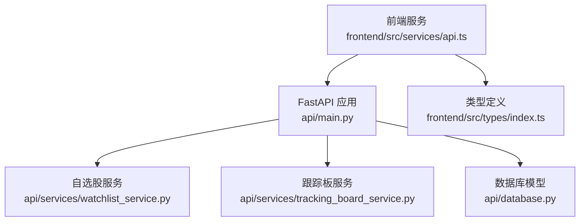
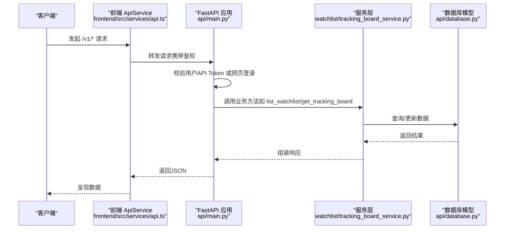
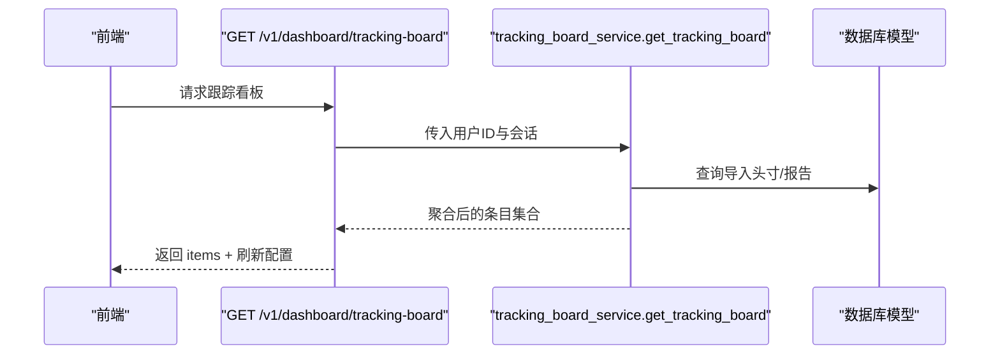
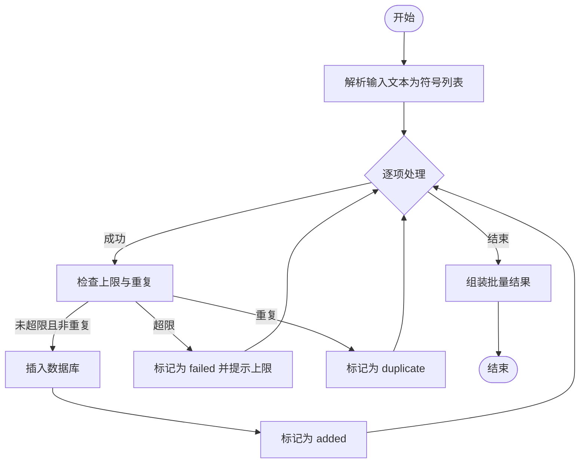
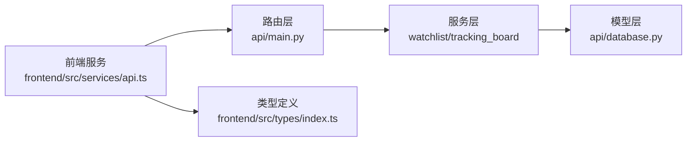

# 管理API

<cite>
**本文引用的文件**
- [api/main.py](file://api/main.py)
- [api/services/watchlist_service.py](file://api/services/watchlist_service.py)
- [api/services/tracking_board_service.py](file://api/services/tracking_board_service.py)
- [api/database.py](file://api/database.py)
- [frontend/src/services/api.ts](file://frontend/src/services/api.ts)
- [frontend/src/types/index.ts](file://frontend/src/types/index.ts)
- [tests/test_watchlist_scheduled.py](file://tests/test_watchlist_scheduled.py)
- [tests/test_board_gold_api.py](file://tests/test_board_gold_api.py)
</cite>

## 目录
1. [简介](#简介)
2. [项目结构](#项目结构)
3. [核心组件](#核心组件)
4. [架构总览](#架构总览)
5. [详细组件分析](#详细组件分析)
6. [依赖关系分析](#依赖关系分析)
7. [性能考量](#性能考量)
8. [故障排查指南](#故障排查指南)
9. [结论](#结论)
10. [附录](#附录)

## 简介
本文件为 TradingAgents-AShare 的管理API参考文档，聚焦于以下管理能力：
- 看板管理：跟踪板（Dashboard Tracking Board）聚合展示用户持仓与分析结果，并提供刷新策略。
- 自选股管理：列出、批量添加、删除用户自选股；支持符号/名称解析与重复/上限校验。
- 跟踪板管理：基于导入的组合头寸、实时行情与报告生成跟踪看板。
- 用户管理：令牌管理（创建/删除）、反馈管理（提交、分页、标记已读）。

文档覆盖端点、请求参数、响应格式、分页与排序、批量操作、权限控制、安全与审计建议、以及常见管理任务的自动化脚本思路。

## 项目结构
后端采用 FastAPI 应用入口集中注册路由，服务层封装业务逻辑，数据库模型定义数据结构。前端通过统一的服务类封装 API 请求，类型定义用于强约束响应结构。

图表来源
- [api/main.py](file://api/main.py)
- [api/services/watchlist_service.py](file://api/services/watchlist_service.py)
- [api/services/tracking_board_service.py](file://api/services/tracking_board_service.py)
- [api/database.py](file://api/database.py)
- [frontend/src/services/api.ts](file://frontend/src/services/api.ts)
- [frontend/src/types/index.ts](file://frontend/src/types/index.ts)

章节来源
- [api/main.py](file://api/main.py)
- [api/services/watchlist_service.py](file://api/services/watchlist_service.py)
- [api/services/tracking_board_service.py](file://api/services/tracking_board_service.py)
- [api/database.py](file://api/database.py)
- [frontend/src/services/api.ts](file://frontend/src/services/api.ts)
- [frontend/src/types/index.ts](file://frontend/src/types/index.ts)

## 核心组件
- 权限与认证
  - 接口默认要求 API Token 或网页登录态，具体取决于端点依赖的用户角色。
  - 提供可选用户解析函数以支持匿名场景。
- 数据模型
  - WatchlistItemDB：用户自选股条目，含唯一性约束与排序字段。
  - ImportedPortfolioPositionDB：导入组合头寸快照与最近交易点。
  - ReportDB：分析报告关联。
- 服务层
  - watchlist_service：自选股列表、单条/批量新增、删除与重复/上限校验。
  - tracking_board_service：根据导入头寸、实时行情与报告生成跟踪看板。
- 前端集成
  - 统一的 ApiService 类封装 /v1/* 路由调用。
  - 类型定义确保响应结构一致性。

章节来源
- [api/main.py](file://api/main.py)
- [api/services/watchlist_service.py](file://api/services/watchlist_service.py)
- [api/services/tracking_board_service.py](file://api/services/tracking_board_service.py)
- [api/database.py](file://api/database.py)
- [frontend/src/services/api.ts](file://frontend/src/services/api.ts)
- [frontend/src/types/index.ts](file://frontend/src/types/index.ts)

## 架构总览
下图展示管理API的关键交互路径：前端通过 ApiService 调用后端路由，路由依赖当前用户并调用对应服务层，服务层访问数据库模型完成数据操作。

图表来源
- [api/main.py](file://api/main.py)
- [api/services/watchlist_service.py](file://api/services/watchlist_service.py)
- [api/services/tracking_board_service.py](file://api/services/tracking_board_service.py)
- [api/database.py](file://api/database.py)
- [frontend/src/services/api.ts](file://frontend/src/services/api.ts)

## 详细组件分析

### 看板管理：跟踪板（Dashboard Tracking Board）
- 端点
  - GET /v1/dashboard/tracking-board
- 功能
  - 汇总用户导入的组合头寸、实时行情与报告，计算浮动盈亏与涨跌幅等指标。
  - 返回上一个交易日日期、刷新间隔与条目列表。
- 权限
  - 需要有效用户上下文（API Token 或网页登录）。
- 响应结构
  - previous_trade_date: 上一个交易日字符串
  - refresh_interval_seconds: 刷新间隔秒数
  - items: 条目数组，包含 symbol、name、current_position、average_cost、market_value、live_*、analysis 等字段
- 性能与刷新
  - 服务层内置固定刷新间隔常量，前端按此周期轮询以降低压力。

图表来源
- [api/main.py](file://api/main.py)
- [api/services/tracking_board_service.py](file://api/services/tracking_board_service.py)
- [frontend/src/types/index.ts](file://frontend/src/types/index.ts)

章节来源
- [api/main.py](file://api/main.py)
- [api/services/tracking_board_service.py](file://api/services/tracking_board_service.py)
- [frontend/src/types/index.ts](file://frontend/src/types/index.ts)

### 自选股管理
- 端点
  - GET /v1/watchlist：列出当前用户的自选股
  - POST /v1/watchlist：批量添加自选股（支持文本解析为符号）
  - DELETE /v1/watchlist/{id}：删除指定自选股
- 权限
  - 需要有效用户上下文（API Token 或网页登录）。
- 请求与响应
  - GET /v1/watchlist
    - 响应：包含 items 数组，每项含 id、symbol、sort_order、created_at、has_scheduled
  - POST /v1/watchlist
    - 请求体：text 或 symbol 字段（二选一），支持多条输入解析
    - 响应：批量结果数组，每项含 symbol、status（added/duplicate/failed）、message、可选 item
  - DELETE /v1/watchlist/{id}
    - 成功返回空内容
- 批量与解析
  - 支持从文本解析多个符号/名称，逐个处理并返回每项结果。
  - 重复添加与达到上限会返回相应状态与提示。
- 数据模型
  - WatchlistItemDB：唯一约束 user_id + symbol，支持排序与创建时间。
- 安全与限制
  - 单用户上限为 50；重复添加会失败；非法输入会被标记为 invalid。

图表来源
- [api/main.py](file://api/main.py)
- [api/services/watchlist_service.py](file://api/services/watchlist_service.py)
- [api/database.py](file://api/database.py)

章节来源
- [api/main.py](file://api/main.py)
- [api/services/watchlist_service.py](file://api/services/watchlist_service.py)
- [api/database.py](file://api/database.py)
- [frontend/src/services/api.ts](file://frontend/src/services/api.ts)
- [tests/test_watchlist_scheduled.py](file://tests/test_watchlist_scheduled.py)

### 跟踪板管理
- 端点
  - GET /v1/dashboard/tracking-board（见“看板管理”）
- 功能
  - 基于导入头寸、实时行情与报告生成跟踪看板，包含浮动盈亏、涨跌幅、报价等指标。
- 数据来源
  - 导入头寸表、报告表、实时行情接口（由服务层调用）。
- 响应结构
  - previous_trade_date、refresh_interval_seconds、items（条目数组）

章节来源
- [api/main.py](file://api/main.py)
- [api/services/tracking_board_service.py](file://api/services/tracking_board_service.py)
- [api/database.py](file://api/database.py)
- [frontend/src/types/index.ts](file://frontend/src/types/index.ts)

### 用户管理
- 令牌管理
  - GET /v1/tokens：列出当前用户令牌
  - POST /v1/tokens：创建新令牌
  - DELETE /v1/tokens/{tokenId}：删除指定令牌
- 反馈管理
  - POST /v1/feedbacks：提交反馈（subject、content）
  - GET /v1/feedbacks：分页列出反馈（page、page_size）
  - GET /v1/feedbacks/{id}：获取反馈详情
  - POST /v1/feedbacks/{id}/read：标记已读
  - GET /v1/feedbacks/unread-count：未读计数
- 权限
  - 令牌与反馈相关端点均需有效用户上下文。
- 分页与排序
  - 反馈列表支持 page/page_size 参数；排序由服务层按创建时间倒序。
- 响应格式
  - 令牌：UserToken 对象数组
  - 反馈：FeedbackItem 对象及分页包装对象

章节来源
- [frontend/src/services/api.ts](file://frontend/src/services/api.ts)
- [frontend/src/types/index.ts](file://frontend/src/types/index.ts)

## 依赖关系分析
- 组件耦合
  - 路由层仅负责参数解析与权限校验，业务逻辑集中在服务层。
  - 服务层依赖数据库模型进行数据持久化与查询。
  - 前端通过统一服务类封装请求，类型定义保证响应一致性。
- 外部依赖
  - 实时行情与报告选择器由服务层调用外部数据流接口（由 tradingagents.dataflows.* 提供）。
- 潜在循环依赖
  - 当前结构清晰，无明显循环导入。

图表来源
- [api/main.py](file://api/main.py)
- [api/services/watchlist_service.py](file://api/services/watchlist_service.py)
- [api/services/tracking_board_service.py](file://api/services/tracking_board_service.py)
- [api/database.py](file://api/database.py)
- [frontend/src/services/api.ts](file://frontend/src/services/api.ts)
- [frontend/src/types/index.ts](file://frontend/src/types/index.ts)

章节来源
- [api/main.py](file://api/main.py)
- [api/services/watchlist_service.py](file://api/services/watchlist_service.py)
- [api/services/tracking_board_service.py](file://api/services/tracking_board_service.py)
- [api/database.py](file://api/database.py)
- [frontend/src/services/api.ts](file://frontend/src/services/api.ts)
- [frontend/src/types/index.ts](file://frontend/src/types/index.ts)

## 性能考量
- 刷新策略
  - 跟踪板服务内置固定刷新间隔常量，前端按该间隔轮询，避免频繁拉取造成压力。
- 批量操作
  - 自选股批量添加逐项处理并返回明细，便于前端快速反馈与重试。
- 数据库索引
  - WatchlistItemDB 在 user_id 上建立索引，提升用户隔离查询效率。
- 异步与并发
  - 建议对高并发场景下的外部行情/报告接口使用异步调用与连接池优化。

章节来源
- [api/services/tracking_board_service.py](file://api/services/tracking_board_service.py)
- [api/services/watchlist_service.py](file://api/services/watchlist_service.py)
- [api/database.py](file://api/database.py)

## 故障排查指南
- 权限错误
  - 若出现 401 且提示“身份验证失败”，请确认是否使用了有效的 API Token 或网页登录态。
- 自选股批量失败
  - 查看每项 status：duplicate 表示重复，failed 可能因已达上限或输入无效。
  - 建议先 GET /v1/watchlist 清点现有条目，再进行增量添加。
- 跟踪板为空
  - 确认已导入组合头寸，且存在上一个交易日的报告；检查刷新间隔与前端轮询设置。
- 反馈列表异常
  - 使用 page/page_size 调整分页参数；若 unread-count 不更新，检查标记已读流程。

章节来源
- [api/main.py](file://api/main.py)
- [api/services/watchlist_service.py](file://api/services/watchlist_service.py)
- [api/services/tracking_board_service.py](file://api/services/tracking_board_service.py)
- [frontend/src/services/api.ts](file://frontend/src/services/api.ts)

## 结论
本管理API围绕“看板管理、自选股管理、跟踪板管理、用户管理”四大维度提供了清晰的端点与数据模型。通过服务层解耦与前端类型约束，系统具备良好的可维护性与扩展性。建议在生产环境中结合令牌管理、审计日志与批量处理策略，进一步完善安全与可观测性。

## 附录

### 端点一览与规范
- 看板管理
  - GET /v1/dashboard/tracking-board
    - 权限：需要有效用户
    - 响应：previous_trade_date、refresh_interval_seconds、items[]
- 自选股管理
  - GET /v1/watchlist
    - 权限：需要有效用户
    - 响应：items[]（含 has_scheduled）
  - POST /v1/watchlist
    - 权限：需要有效用户
    - 请求：text 或 symbol（二选一）
    - 响应：批量结果数组（每项含 status、message、可选 item）
  - DELETE /v1/watchlist/{id}
    - 权限：需要有效用户
    - 响应：空内容
- 用户管理
  - GET /v1/tokens
  - POST /v1/tokens
  - DELETE /v1/tokens/{tokenId}
  - POST /v1/feedbacks
  - GET /v1/feedbacks
  - GET /v1/feedbacks/{id}
  - POST /v1/feedbacks/{id}/read
  - GET /v1/feedbacks/unread-count

章节来源
- [api/main.py](file://api/main.py)
- [frontend/src/services/api.ts](file://frontend/src/services/api.ts)

### 权限与安全
- 认证方式
  - 支持 API Token 与网页登录态；部分端点仅限网页登录。
- 安全建议
  - 令牌最小权限原则；定期轮换与清理。
  - 对敏感端点增加速率限制与审计日志。
  - 输入校验与长度限制，防止注入与滥用。

章节来源
- [api/main.py](file://api/main.py)

### 审计日志与批量处理指南
- 审计日志
  - 建议记录：用户ID、端点、时间戳、IP、请求摘要、响应状态码、耗时。
- 批量处理
  - 自选股批量添加：前端逐批提交，服务端逐项返回结果，前端汇总展示。
  - 反馈分页：后端按创建时间倒序，前端按页加载。

章节来源
- [api/services/watchlist_service.py](file://api/services/watchlist_service.py)
- [frontend/src/services/api.ts](file://frontend/src/services/api.ts)

### 常见管理任务的自动化脚本示例（思路）
- 批量导入自选股
  - 读取本地文本/CSV，按行解析为符号列表，调用 POST /v1/watchlist，逐项处理并记录结果。
- 定时刷新跟踪板
  - 前端按 refresh_interval_seconds 轮询 GET /v1/dashboard/tracking-board，或后端定时任务触发更新。
- 令牌生命周期管理
  - 创建新令牌后，立即轮换旧令牌并清理过期令牌；记录创建/删除事件。
- 反馈批量处理
  - 定期导出未读反馈，按主题分类处理并回复；标记已读。

章节来源
- [frontend/src/services/api.ts](file://frontend/src/services/api.ts)
- [api/main.py](file://api/main.py)