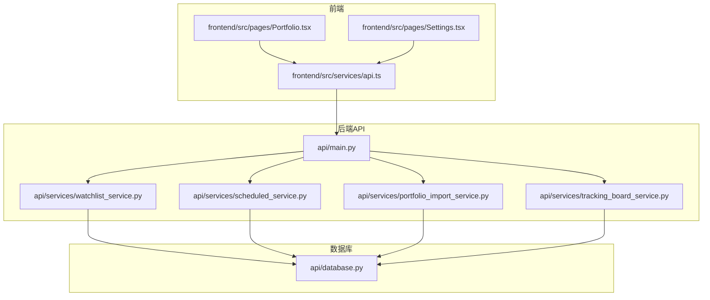
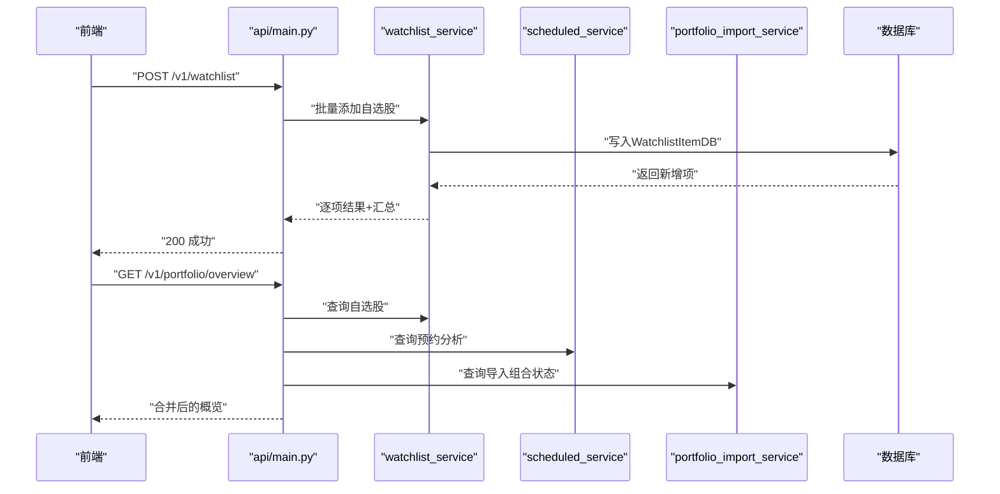
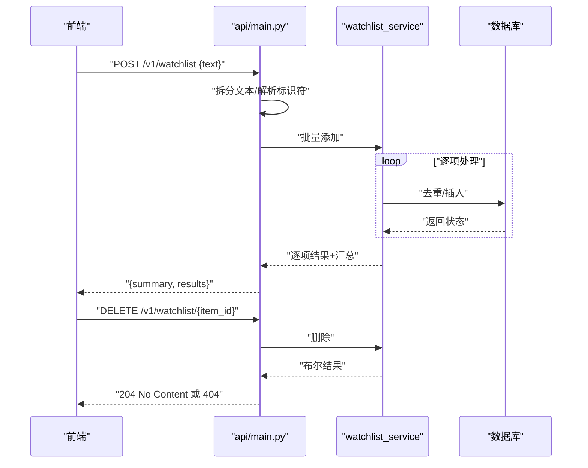
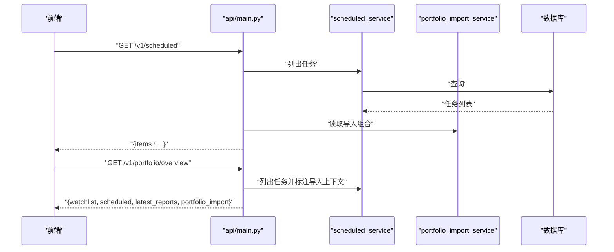
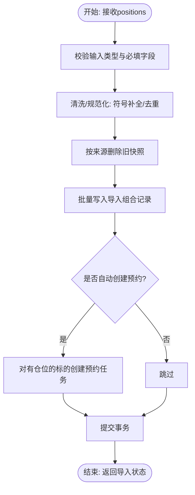
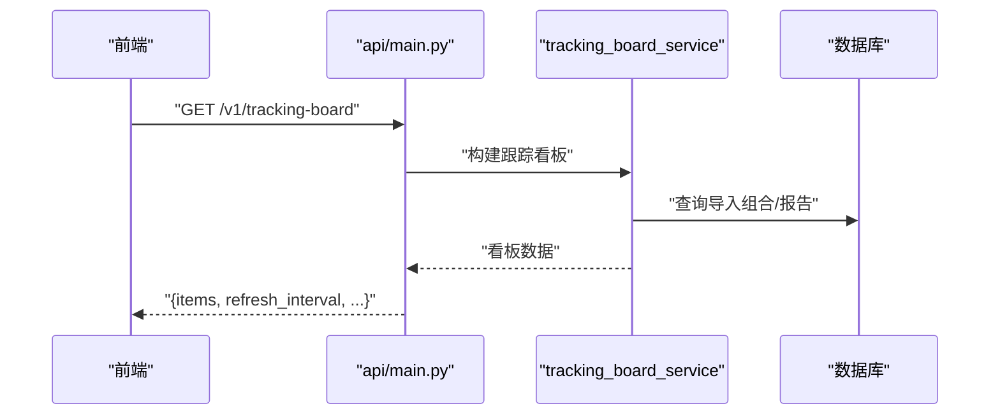
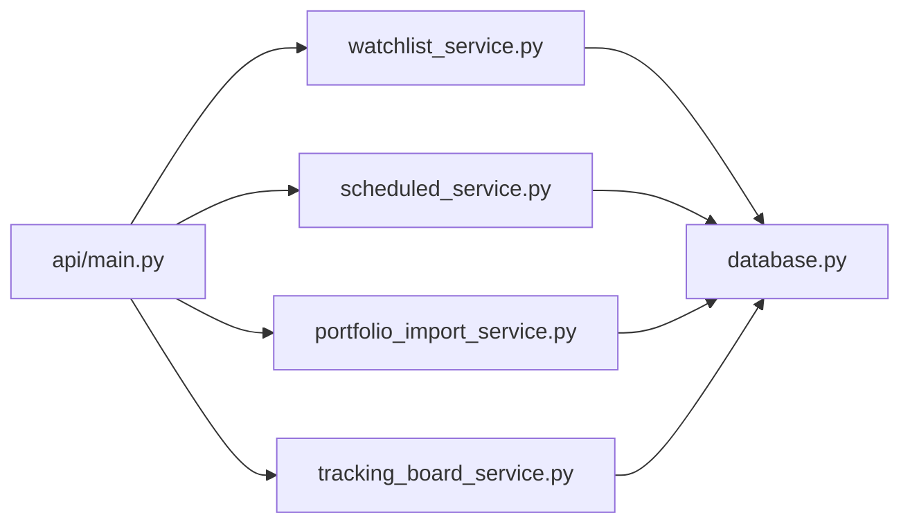

# 自选股管理API

<cite>
**本文引用的文件**
- [api/main.py](file://api/main.py)
- [api/services/watchlist_service.py](file://api/services/watchlist_service.py)
- [api/services/scheduled_service.py](file://api/services/scheduled_service.py)
- [api/services/portfolio_import_service.py](file://api/services/portfolio_import_service.py)
- [api/services/tracking_board_service.py](file://api/services/tracking_board_service.py)
- [api/database.py](file://api/database.py)
- [frontend/src/services/api.ts](file://frontend/src/services/api.ts)
- [frontend/src/pages/Portfolio.tsx](file://frontend/src/pages/Portfolio.tsx)
- [frontend/src/pages/Settings.tsx](file://frontend/src/pages/Settings.tsx)
- [tests/test_watchlist_scheduled.py](file://tests/test_watchlist_scheduled.py)
- [tests/test_api_smoke.py](file://tests/test_api_smoke.py)
- [tests/test_portfolio_import.py](file://tests/test_portfolio_import.py)
</cite>

## 目录
1. [简介](#简介)
2. [项目结构](#项目结构)
3. [核心组件](#核心组件)
4. [架构总览](#架构总览)
5. [详细组件分析](#详细组件分析)
6. [依赖关系分析](#依赖关系分析)
7. [性能考量](#性能考量)
8. [故障排查指南](#故障排查指南)
9. [结论](#结论)
10. [附录](#附录)

## 简介
本文件为 TradingAgents-AShare 的“自选股管理API”提供权威参考，覆盖以下主题：
- 自选股的增删改查、批量操作与权限控制
- 自选股分组、标签与优先级的现状与扩展建议
- 自选股数据同步、实时提醒与通知配置
- 自选股导入导出、批量操作与数据迁移指南
- 维护与性能监控最佳实践

说明：仓库中未发现“自选股分组/标签/优先级”的直接实现；本文在“概念性概述”部分给出可扩展设计建议，便于后续落地。

## 项目结构
围绕自选股管理的关键模块与文件如下：
- 后端API入口与路由：api/main.py
- 服务层：
  - 自选股服务：api/services/watchlist_service.py
  - 预约分析服务：api/services/scheduled_service.py
  - 组合导入服务：api/services/portfolio_import_service.py
  - 跟踪看板服务：api/services/tracking_board_service.py
- 数据库模型：api/database.py
- 前端调用与页面：
  - 前端API封装：frontend/src/services/api.ts
  - 自选股页面：frontend/src/pages/Portfolio.tsx
  - 设置页面（通知等）：frontend/src/pages/Settings.tsx
- 测试用例：
  - 自选股与预约分析：tests/test_watchlist_scheduled.py
  - API冒烟测试（含概览接口）：tests/test_api_smoke.py
  - 组合导入测试：tests/test_portfolio_import.py

图表来源
- [api/main.py](file://api/main.py)
- [api/services/watchlist_service.py](file://api/services/watchlist_service.py)
- [api/services/scheduled_service.py](file://api/services/scheduled_service.py)
- [api/services/portfolio_import_service.py](file://api/services/portfolio_import_service.py)
- [api/services/tracking_board_service.py](file://api/services/tracking_board_service.py)
- [api/database.py](file://api/database.py)
- [frontend/src/services/api.ts](file://frontend/src/services/api.ts)
- [frontend/src/pages/Portfolio.tsx](file://frontend/src/pages/Portfolio.tsx)
- [frontend/src/pages/Settings.tsx](file://frontend/src/pages/Settings.tsx)

章节来源
- [api/main.py](file://api/main.py)
- [api/services/watchlist_service.py](file://api/services/watchlist_service.py)
- [api/services/scheduled_service.py](file://api/services/scheduled_service.py)
- [api/services/portfolio_import_service.py](file://api/services/portfolio_import_service.py)
- [api/services/tracking_board_service.py](file://api/services/tracking_board_service.py)
- [api/database.py](file://api/database.py)
- [frontend/src/services/api.ts](file://frontend/src/services/api.ts)
- [frontend/src/pages/Portfolio.tsx](file://frontend/src/pages/Portfolio.tsx)
- [frontend/src/pages/Settings.tsx](file://frontend/src/pages/Settings.tsx)

## 核心组件
- 自选股服务（watchlist_service）：负责自选股的增删改查与批量导入结果聚合
- 预约分析服务（scheduled_service）：负责为自选股设置定时分析任务
- 组合导入服务（portfolio_import_service）：负责外部组合导入、去重、规范化与自动创建预约任务
- 跟踪看板服务（tracking_board_service）：基于导入的组合生成跟踪看板，支持刷新与浮动盈亏计算
- 数据库模型：WatchlistItemDB（自选股）、ImportedPortfolioPositionDB（导入组合）

章节来源
- [api/services/watchlist_service.py](file://api/services/watchlist_service.py)
- [api/services/scheduled_service.py](file://api/services/scheduled_service.py)
- [api/services/portfolio_import_service.py](file://api/services/portfolio_import_service.py)
- [api/services/tracking_board_service.py](file://api/services/tracking_board_service.py)
- [api/database.py](file://api/database.py)

## 架构总览
自选股管理API通过统一鉴权中间件保护，所有请求均绑定当前用户上下文，确保数据隔离。核心流程包括：
- 自选股增删改查与批量导入
- 导入组合与预约分析联动（可选）
- 组合概览接口整合自选股、预约分析与最新报告
- 跟踪看板基于导入组合进行实时展示

图表来源
- [api/main.py](file://api/main.py)
- [api/services/watchlist_service.py](file://api/services/watchlist_service.py)
- [api/services/scheduled_service.py](file://api/services/scheduled_service.py)
- [api/services/portfolio_import_service.py](file://api/services/portfolio_import_service.py)

## 详细组件分析

### 自选股API（增删改查与批量）
- 权限控制：所有端点使用鉴权依赖，仅允许当前用户访问
- 批量添加：支持以文本形式一次性提交多个标的，内部解析为符号与名称，逐项返回结果与汇总统计
- 删除：按item_id删除，不存在时返回404
- 查询：列表接口返回自选股列表，名称映射由反向映射表完成

图表来源
- [api/main.py](file://api/main.py)
- [api/services/watchlist_service.py](file://api/services/watchlist_service.py)

章节来源
- [api/main.py](file://api/main.py)
- [tests/test_watchlist_scheduled.py](file://tests/test_watchlist_scheduled.py)
- [tests/test_api_smoke.py](file://tests/test_api_smoke.py)

### 预约分析API（与自选股关联）
- 列表：返回当前用户的所有预约分析任务，并附加“是否与导入组合关联”的标记
- 创建：可按短/中/长周期与触发时间创建任务
- 关联标注：在概览接口中，会为每个预约任务标注是否关联了导入组合上下文

图表来源
- [api/main.py](file://api/main.py)
- [api/services/scheduled_service.py](file://api/services/scheduled_service.py)
- [api/services/portfolio_import_service.py](file://api/services/portfolio_import_service.py)

章节来源
- [api/main.py](file://api/main.py)
- [tests/test_watchlist_scheduled.py](file://tests/test_watchlist_scheduled.py)
- [tests/test_api_smoke.py](file://tests/test_api_smoke.py)

### 组合导入API（同步、清理与自动预约）
- 同步：替换指定来源的持仓快照，支持去重、规范化（如6位代码补全）、自动创建预约任务
- 清理：清空某来源的导入组合
- 解析：支持上传图片解析持仓（前端提供接口），后端解析后返回标准化的持仓列表

图表来源
- [api/services/portfolio_import_service.py](file://api/services/portfolio_import_service.py)
- [frontend/src/services/api.ts](file://frontend/src/services/api.ts)

章节来源
- [api/services/portfolio_import_service.py](file://api/services/portfolio_import_service.py)
- [tests/test_portfolio_import.py](file://tests/test_portfolio_import.py)
- [frontend/src/services/api.ts](file://frontend/src/services/api.ts)

### 跟踪看板API（基于导入组合）
- 实时刷新：固定刷新间隔，拉取行情与报告，计算浮动盈亏与百分比
- 数据来源：导入组合、实时报价、历史报告
- 展示：按市值/数量/代码排序，支持上一交易日对比

图表来源
- [api/main.py](file://api/main.py)
- [api/services/tracking_board_service.py](file://api/services/tracking_board_service.py)

章节来源
- [api/services/tracking_board_service.py](file://api/services/tracking_board_service.py)
- [tests/test_dashboard_tracking.py](file://tests/test_dashboard_tracking.py)

### 权限控制与用户隔离
- 所有自选股与预约分析操作均绑定当前用户ID，确保用户间数据隔离
- 删除接口若找不到对应item_id，返回404，避免越权误删

章节来源
- [api/main.py](file://api/main.py)
- [tests/test_watchlist_scheduled.py](file://tests/test_watchlist_scheduled.py)

### 分组、标签与优先级（现状与扩展建议）
- 现状：代码库未发现自选股分组、标签与优先级的实现
- 建议（概念性）：
  - 新增分组表与自选股到分组的多对多关系
  - 引入标签字段（字符串数组或独立标签表）
  - 引入优先级字段（数值或枚举），用于排序与筛选
  - 在批量导入时支持为每只股票指定分组/标签/优先级
  - 在概览与列表接口中返回上述元信息

[本节为概念性内容，不直接分析具体文件，故无章节来源]

## 依赖关系分析
- API层依赖服务层；服务层依赖数据库模型与第三方数据流接口
- 自选股与预约分析存在弱耦合：概览接口会标注“是否关联导入组合”
- 组合导入与预约分析强耦合：导入成功后可自动创建对应标的的预约任务

图表来源
- [api/main.py](file://api/main.py)
- [api/services/watchlist_service.py](file://api/services/watchlist_service.py)
- [api/services/scheduled_service.py](file://api/services/scheduled_service.py)
- [api/services/portfolio_import_service.py](file://api/services/portfolio_import_service.py)
- [api/services/tracking_board_service.py](file://api/services/tracking_board_service.py)
- [api/database.py](file://api/database.py)

章节来源
- [api/main.py](file://api/main.py)
- [api/services/watchlist_service.py](file://api/services/watchlist_service.py)
- [api/services/scheduled_service.py](file://api/services/scheduled_service.py)
- [api/services/portfolio_import_service.py](file://api/services/portfolio_import_service.py)
- [api/services/tracking_board_service.py](file://api/services/tracking_board_service.py)
- [api/database.py](file://api/database.py)

## 性能考量
- 批量导入：建议分批处理，避免单次事务过大；对重复符号进行预去重
- 名称解析：使用缓存的反向映射表减少数据库/外部查询
- 概览接口：合并查询与映射，避免N+1查询；对大用户量建议分页与索引优化
- 跟踪看板：固定刷新间隔，避免频繁拉取行情；对空闲用户可延长刷新周期
- 导入组合：批量写入前先删除同源旧快照，降低碎片化

[本节为通用性能建议，不直接分析具体文件，故无章节来源]

## 故障排查指南
- 自选股批量添加失败
  - 检查输入文本是否包含至少一个有效标的
  - 查看逐项结果中的“invalid”项，定位错误原因
- 删除自选股返回404
  - 确认item_id归属当前用户；检查是否存在已被删除或拼写错误
- 导入组合后未创建预约任务
  - 确认导入时设置了自动创建预约；检查导入的标的是否具有正仓位
- 跟踪看板数据异常
  - 检查导入组合是否正确；确认实时行情可用；核对上一交易日日期逻辑
- 通知配置问题（企业微信）
  - 使用设置页面的“测试连接”按钮验证Webhook地址有效性；确保URL指向企业微信域名

章节来源
- [tests/test_watchlist_scheduled.py](file://tests/test_watchlist_scheduled.py)
- [tests/test_portfolio_import.py](file://tests/test_portfolio_import.py)
- [frontend/src/pages/Settings.tsx](file://frontend/src/pages/Settings.tsx)

## 结论
- 本项目已提供完善的自选股增删改查与批量导入能力，并与预约分析、组合导入、概览接口形成闭环
- 当前未实现分组、标签与优先级功能，可在现有模型基础上扩展
- 建议在生产环境中结合批量处理、缓存与索引优化提升性能，并完善告警与日志监控

[本节为总结性内容，不直接分析具体文件，故无章节来源]

## 附录

### API清单与行为摘要
- 自选股
  - POST /v1/watchlist：批量添加，返回逐项结果与汇总
  - DELETE /v1/watchlist/{item_id}：按ID删除，不存在返回404
  - GET /v1/scheduled：列出预约分析，附加导入上下文标记
  - GET /v1/portfolio/overview：返回自选股、预约分析、最新报告与导入状态
- 组合导入
  - POST /v1/portfolio/imports：同步导入组合，支持自动创建预约
  - DELETE /v1/portfolio/imports：清空某来源导入
  - POST /v1/portfolio/parse-image：解析图片为持仓列表（前端提供）
- 跟踪看板
  - GET /v1/tracking-board：基于导入组合生成跟踪看板

章节来源
- [api/main.py](file://api/main.py)
- [frontend/src/services/api.ts](file://frontend/src/services/api.ts)

### 数据模型要点（与自选股相关）
- WatchlistItemDB：存储用户自选股（符号、名称、用户ID等）
- ImportedPortfolioPositionDB：存储导入组合快照（来源、符号、名称、仓位、成本、市值等）

章节来源
- [api/database.py](file://api/database.py)