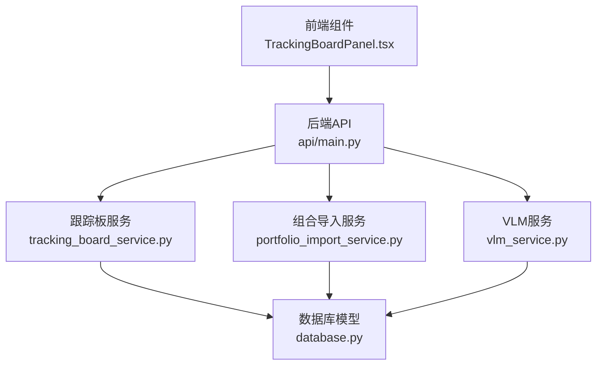
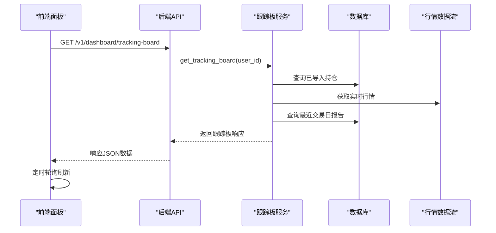
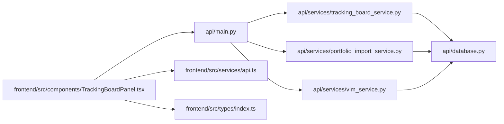

# 跟踪板管理API

<cite>
**本文档引用的文件**
- [api/main.py](file://api/main.py)
- [api/services/tracking_board_service.py](file://api/services/tracking_board_service.py)
- [api/services/portfolio_import_service.py](file://api/services/portfolio_import_service.py)
- [api/services/vlm_service.py](file://api/services/vlm_service.py)
- [frontend/src/components/TrackingBoardPanel.tsx](file://frontend/src/components/TrackingBoardPanel.tsx)
- [frontend/src/pages/TrackingBoard.tsx](file://frontend/src/pages/TrackingBoard.tsx)
- [frontend/src/services/api.ts](file://frontend/src/services/api.ts)
- [frontend/src/types/index.ts](file://frontend/src/types/index.ts)
- [tests/test_dashboard_tracking.py](file://tests/test_dashboard_tracking.py)
- [tests/test_vlm_position_parser.py](file://tests/test_vlm_position_parser.py)
- [api/database.py](file://api/database.py)
</cite>

## 目录
1. [简介](#简介)
2. [项目结构](#项目结构)
3. [核心组件](#核心组件)
4. [架构总览](#架构总览)
5. [详细组件分析](#详细组件分析)
6. [依赖关系分析](#依赖关系分析)
7. [性能考虑](#性能考虑)
8. [故障排除指南](#故障排除指南)
9. [结论](#结论)
10. [附录](#附录)

## 简介
本文件为 TradingAgents-AShare 的跟踪板管理API提供权威参考文档。内容覆盖跟踪板的创建、配置与监控端点，跟踪条件与阈值配置、触发机制，状态管理、历史记录与统计分析，以及批量配置、模板管理与共享能力的实现路径。同时给出性能优化与异常处理的最佳实践。

## 项目结构
- 后端API入口位于 api/main.py，定义了跟踪板相关端点与业务服务集成。
- 跟踪板核心逻辑位于 api/services/tracking_board_service.py，负责聚合持仓、行情与报告信息。
- 前端组件位于 frontend/src/components/TrackingBoardPanel.tsx，负责轮询、渲染与交互。
- 数据库模型位于 api/database.py，包括 ImportedPortfolioPositionDB 与 ReportDB。
- 测试用例位于 tests/test_dashboard_tracking.py 与 tests/test_vlm_position_parser.py，验证行为与边界条件。

**图表来源**
- [api/main.py](file://api/main.py)
- [api/services/tracking_board_service.py](file://api/services/tracking_board_service.py)
- [api/services/portfolio_import_service.py](file://api/services/portfolio_import_service.py)
- [api/services/vlm_service.py](file://api/services/vlm_service.py)
- [api/database.py](file://api/database.py)

**章节来源**
- [api/main.py](file://api/main.py)
- [api/services/tracking_board_service.py](file://api/services/tracking_board_service.py)
- [frontend/src/components/TrackingBoardPanel.tsx](file://frontend/src/components/TrackingBoardPanel.tsx)

## 核心组件
- 跟踪板服务：聚合用户已导入的持仓、实时行情与报告摘要，计算浮动盈亏与区间对比，输出统一响应结构。
- 组合导入服务：支持文本/图片导入、去重、标准化与定时任务联动。
- VLM服务：基于视觉语言模型解析持仓截图，提取结构化数据。
- 前端面板：定时轮询、视图切换、导入与清空操作、错误反馈与统计汇总。

**章节来源**
- [api/services/tracking_board_service.py](file://api/services/tracking_board_service.py)
- [api/services/portfolio_import_service.py](file://api/services/portfolio_import_service.py)
- [api/services/vlm_service.py](file://api/services/vlm_service.py)
- [frontend/src/components/TrackingBoardPanel.tsx](file://frontend/src/components/TrackingBoardPanel.tsx)

## 架构总览
跟踪板工作流从用户导入持仓开始，后端通过数据流接口获取实时行情，并关联最近交易日的分析报告，最终返回给前端进行可视化展示与交互。

**图表来源**
- [api/main.py](file://api/main.py)
- [api/services/tracking_board_service.py](file://api/services/tracking_board_service.py)
- [frontend/src/components/TrackingBoardPanel.tsx](file://frontend/src/components/TrackingBoardPanel.tsx)

## 详细组件分析

### 跟踪板API端点
- GET /v1/dashboard/tracking-board
  - 功能：获取当前用户的跟踪板摘要与明细，包含实时行情、浮动盈亏、区间对比与分析摘要。
  - 认证：需要 Bearer Token。
  - 响应字段：
    - previous_trade_date：上一个交易日
    - refresh_interval_seconds：刷新间隔（固定20秒）
    - items：每项包含标的、价格、涨跌幅、区间、持仓表现、报价时间与来源、分析摘要等
  - 错误处理：网络异常或数据流不可用时，返回空行情与空分析，不中断整体响应。

**章节来源**
- [api/main.py](file://api/main.py)
- [tests/test_dashboard_tracking.py](file://tests/test_dashboard_tracking.py)
- [frontend/src/services/api.ts](file://frontend/src/services/api.ts)

### 组合导入与管理
- GET /v1/portfolio/imports
  - 功能：获取当前用户已导入的持仓状态与概要。
- POST /v1/portfolio/imports
  - 功能：同步/保存持仓，支持自动应用定时任务。
  - 请求体：positions（数组，包含 symbol/name/current_position/average_cost/market_value）、source、auto_apply_scheduled。
  - 响应：导入后的状态与概要。
- DELETE /v1/portfolio/imports
  - 功能：清空已导入的持仓。
- POST /v1/portfolio/parse-image
  - 功能：上传持仓截图，使用VLM解析为结构化数据。
  - 请求：multipart/form-data，file 字段。
  - 响应：positions 数组。

**章节来源**
- [api/main.py](file://api/main.py)
- [api/services/portfolio_import_service.py](file://api/services/portfolio_import_service.py)
- [api/services/vlm_service.py](file://api/services/vlm_service.py)
- [tests/test_vlm_position_parser.py](file://tests/test_vlm_position_parser.py)

### 前端交互与轮询
- 前端组件 TrackingBoardPanel.tsx
  - 定时轮询：根据后端返回的 refresh_interval_seconds 设置定时器，静默刷新。
  - 视图模式：simple/detailed 切换，本地持久化。
  - 导入方式：文本解析与图片解析（VLM），支持清空。
  - 错误处理：捕获请求异常并显示提示，避免中断UI。
  - 统计展示：动态市值、浮动盈亏、报价时间与来源统计。

**章节来源**
- [frontend/src/components/TrackingBoardPanel.tsx](file://frontend/src/components/TrackingBoardPanel.tsx)
- [frontend/src/services/api.ts](file://frontend/src/services/api.ts)
- [frontend/src/types/index.ts](file://frontend/src/types/index.ts)

### 数据模型与序列化
- 跟踪板响应模型（前端类型定义）
  - TrackingBoardResponse：previous_trade_date、refresh_interval_seconds、items[]
  - TrackingBoardItem：标的字段、价格字段、涨跌幅、区间、持仓表现、报价时间与来源、分析摘要
  - TrackingBoardAnalysis：报告ID、交易日、是否上一交易日、决策/方向、高低价、摘要等
- 数据库模型
  - ImportedPortfolioPositionDB：用户导入的持仓记录
  - ReportDB：分析报告记录

**章节来源**
- [frontend/src/types/index.ts](file://frontend/src/types/index.ts)
- [api/database.py](file://api/database.py)

### 跟踪条件、阈值与触发机制
- 实时监控
  - 刷新间隔固定为20秒，前端按此频率轮询。
  - 行情缺失时，保留历史数据与估值，不阻断展示。
- 区间告警
  - 前端根据模型高低位与当日区间生成告警提示，辅助判断支撑/阻力与超买超卖。
- 报告关联
  - 自动选择最近交易日或之前最近的报告作为分析摘要，若无报告则不显示分析字段。
- 触发机制
  - 定时任务与组合导入联动：导入成功且开启 auto_apply_scheduled 时，自动为每只持仓创建定时分析任务。

**章节来源**
- [api/services/tracking_board_service.py](file://api/services/tracking_board_service.py)
- [tests/test_dashboard_tracking.py](file://tests/test_dashboard_tracking.py)
- [api/services/portfolio_import_service.py](file://api/services/portfolio_import_service.py)

### 状态管理、历史记录与统计分析
- 状态管理
  - 前端本地存储视图模式；后端返回 refresh_interval_seconds 控制刷新节奏。
  - 导入状态：positions 数量、最后导入时间、定时任务同步概要。
- 历史记录
  - 报告按 trade_date 降序排列，优先匹配 exact_previous，其次 latest_before_previous，最后 latest_any。
- 统计分析
  - 前端计算动态市值与浮动盈亏总和，展示于详细视图顶部卡片。
  - 报价时间取自第一条有值记录，用于显示“更新时间”。

**章节来源**
- [api/services/tracking_board_service.py](file://api/services/tracking_board_service.py)
- [frontend/src/components/TrackingBoardPanel.tsx](file://frontend/src/components/TrackingBoardPanel.tsx)

### 批量配置、模板管理与共享
- 批量配置
  - 文本导入：一行一只股票，支持符号、名称与数值字段，自动标准化与去重。
  - 图片导入：VLM 解析截图，返回 positions 数组，供用户复核后保存。
- 模板管理
  - 通过导入服务的去重与标准化逻辑，实现“模板式”批量导入体验。
- 共享能力
  - 通过组合导入与定时任务机制，可将当前持仓与策略共享给后续分析流程。

**章节来源**
- [api/main.py](file://api/main.py)
- [api/services/portfolio_import_service.py](file://api/services/portfolio_import_service.py)
- [api/services/vlm_service.py](file://api/services/vlm_service.py)

## 依赖关系分析

**图表来源**
- [api/main.py](file://api/main.py)
- [api/services/tracking_board_service.py](file://api/services/tracking_board_service.py)
- [api/services/portfolio_import_service.py](file://api/services/portfolio_import_service.py)
- [api/services/vlm_service.py](file://api/services/vlm_service.py)
- [frontend/src/components/TrackingBoardPanel.tsx](file://frontend/src/components/TrackingBoardPanel.tsx)
- [frontend/src/services/api.ts](file://frontend/src/services/api.ts)
- [frontend/src/types/index.ts](file://frontend/src/types/index.ts)

**章节来源**
- [api/main.py](file://api/main.py)
- [api/services/tracking_board_service.py](file://api/services/tracking_board_service.py)
- [api/services/portfolio_import_service.py](file://api/services/portfolio_import_service.py)
- [api/services/vlm_service.py](file://api/services/vlm_service.py)
- [frontend/src/components/TrackingBoardPanel.tsx](file://frontend/src/components/TrackingBoardPanel.tsx)

## 性能考虑
- 刷新节流
  - 后端固定刷新间隔为20秒，前端按此节流轮询，避免频繁请求。
- 异步执行
  - 后端使用线程池与事件循环优化，提升并发处理能力。
- 缓存与预热
  - 交易日历与股票映射在启动时预加载，减少运行期延迟。
- 数据聚合
  - 一次性获取所有标的行情，避免多次往返；对缺失行情采用容错处理。
- 前端渲染
  - 使用虚拟滚动与懒加载策略，减少DOM压力（建议在大列表场景下采用）。

[本节为通用性能指导，无需特定文件引用]

## 故障排除指南
- 行情获取失败
  - 现象：items 中部分标的缺少 live_price、volume、amount、quote_source。
  - 处理：检查数据流供应商可用性；前端显示“实时监控中/最近刷新异常”提示。
- 报告缺失
  - 现象：analysis 字段为空。
  - 处理：确认用户在最近交易日是否有已完成的分析报告。
- 导入失败
  - 现象：保存/清空/图片解析报错。
  - 处理：检查请求体格式、Token有效性与VLM服务配置；查看后端日志。
- 前端轮询异常
  - 现象：定时器未生效或重复请求。
  - 处理：确认 refresh_interval_seconds 返回值与组件生命周期清理。

**章节来源**
- [api/services/tracking_board_service.py](file://api/services/tracking_board_service.py)
- [tests/test_dashboard_tracking.py](file://tests/test_dashboard_tracking.py)
- [frontend/src/components/TrackingBoardPanel.tsx](file://frontend/src/components/TrackingBoardPanel.tsx)

## 结论
跟踪板管理API通过清晰的端点设计与前后端协同，实现了从持仓导入、实时监控到报告关联与可视化的完整闭环。其模块化架构便于扩展批量配置、模板与共享能力；性能与异常处理策略确保在高并发与不稳定环境下仍能稳定运行。

[本节为总结性内容，无需特定文件引用]

## 附录

### API端点一览
- GET /v1/dashboard/tracking-board
  - 返回跟踪板摘要与明细
- GET /v1/portfolio/imports
  - 返回导入状态与概要
- POST /v1/portfolio/imports
  - 同步/保存持仓，支持自动应用定时任务
- DELETE /v1/portfolio/imports
  - 清空已导入的持仓
- POST /v1/portfolio/parse-image
  - 上传截图并解析为结构化持仓

**章节来源**
- [api/main.py](file://api/main.py)
- [frontend/src/services/api.ts](file://frontend/src/services/api.ts)