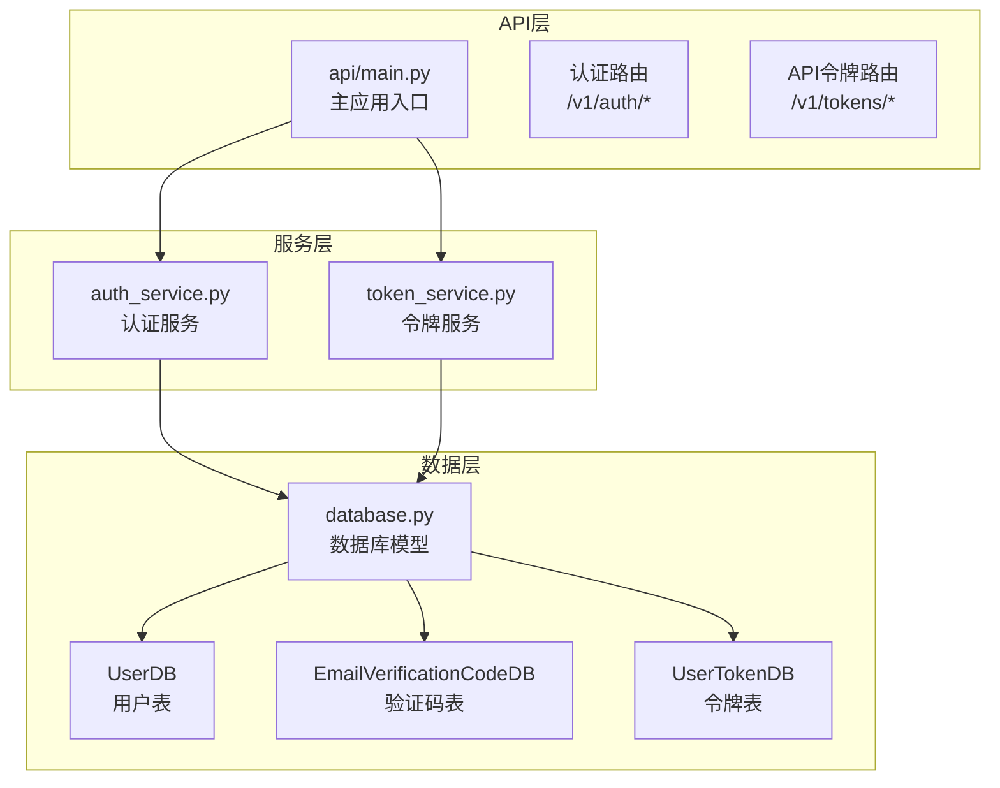
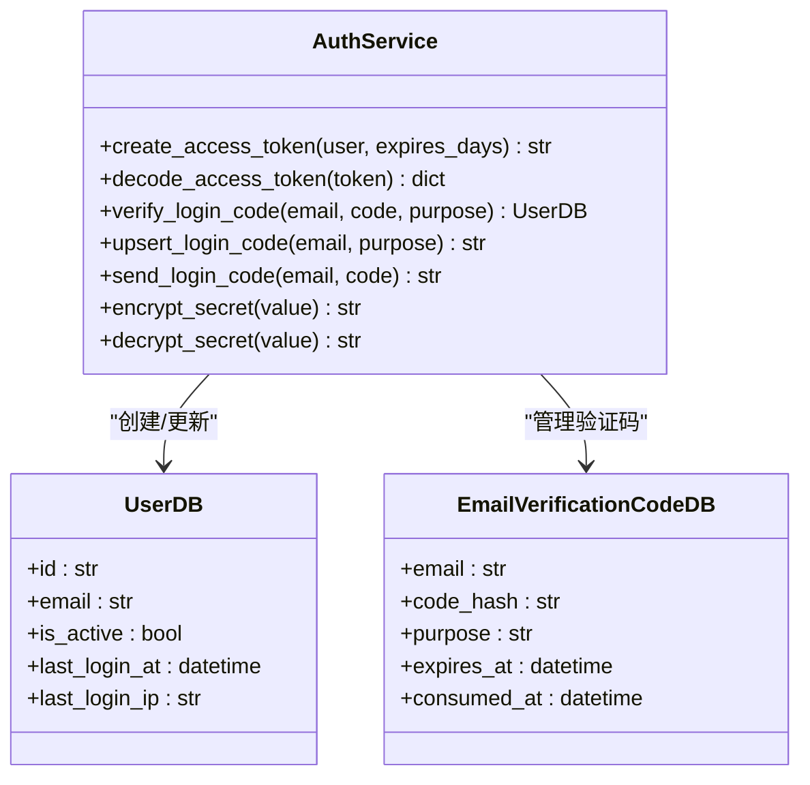
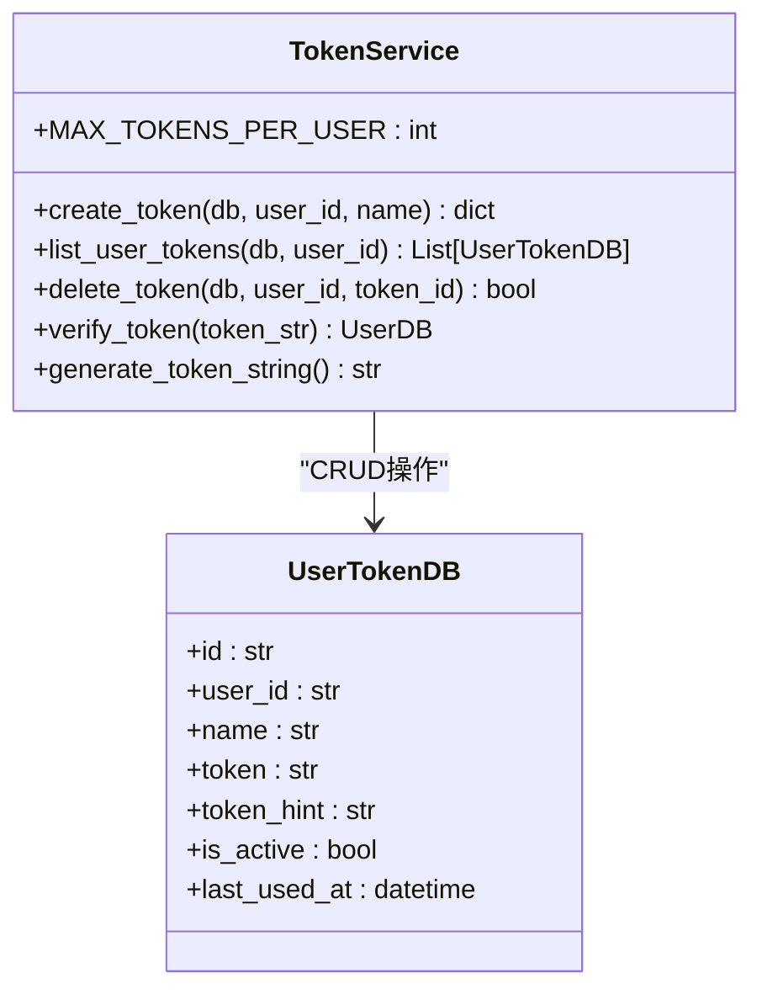
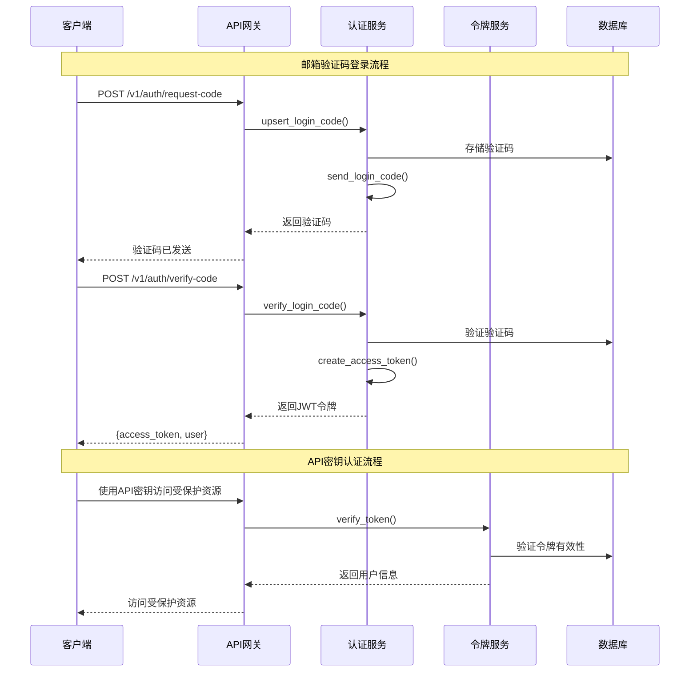
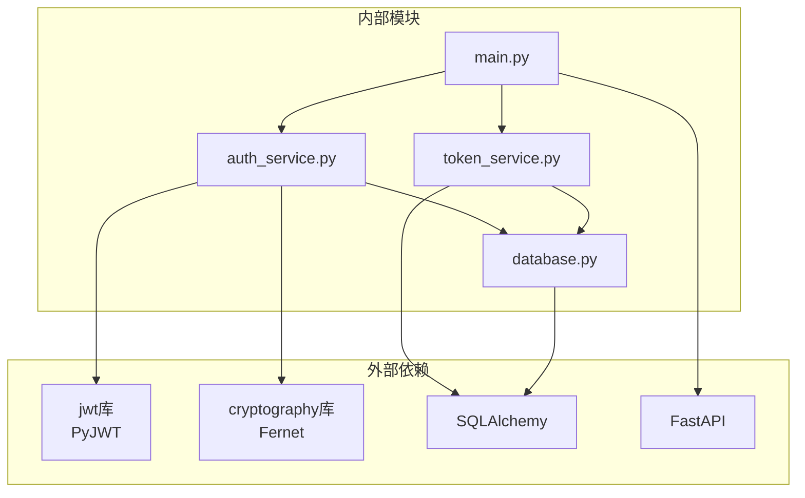

# 认证API

<cite>
**本文档引用的文件**
- [api/main.py](file://api/main.py)
- [api/services/auth_service.py](file://api/services/auth_service.py)
- [api/services/token_service.py](file://api/services/token_service.py)
- [api/database.py](file://api/database.py)
</cite>

## 目录
1. [简介](#简介)
2. [项目结构](#项目结构)
3. [核心组件](#核心组件)
4. [架构概览](#架构概览)
5. [详细组件分析](#详细组件分析)
6. [依赖关系分析](#依赖关系分析)
7. [性能考虑](#性能考虑)
8. [故障排除指南](#故障排除指南)
9. [结论](#结论)

## 简介

TradingAgents-AShare是一个基于FastAPI的量化交易分析平台，提供了完整的认证API体系。该系统采用邮箱验证码登录机制，结合JWT令牌和API密钥两种认证方式，为用户提供安全可靠的访问控制。

系统主要特性包括：
- 基于邮箱验证码的无密码登录
- JWT令牌认证（用于网页端登录）
- API密钥认证（用于程序化访问）
- 安全的令牌存储和验证机制
- 完整的用户会话管理

## 项目结构

认证系统主要分布在以下文件中：



**图表来源**
- [api/main.py:3862-3889](file://api/main.py#L3862-L3889)
- [api/services/auth_service.py:1-296](file://api/services/auth_service.py#L1-L296)
- [api/services/token_service.py:1-106](file://api/services/token_service.py#L1-L106)
- [api/database.py:321-375](file://api/database.py#L321-L375)

**章节来源**
- [api/main.py:3862-3889](file://api/main.py#L3862-L3889)
- [api/services/auth_service.py:1-296](file://api/services/auth_service.py#L1-L296)
- [api/services/token_service.py:1-106](file://api/services/token_service.py#L1-L106)
- [api/database.py:321-375](file://api/database.py#L321-L375)

## 核心组件

### 认证服务 (Auth Service)

认证服务负责处理用户登录、令牌生成和验证等核心功能：



**图表来源**
- [api/services/auth_service.py:99-184](file://api/services/auth_service.py#L99-L184)
- [api/database.py:321-345](file://api/database.py#L321-L345)

### 令牌服务 (Token Service)

令牌服务专门处理API密钥的创建、验证和管理：



**图表来源**
- [api/services/token_service.py:34-106](file://api/services/token_service.py#L34-L106)
- [api/database.py:364-375](file://api/database.py#L364-L375)

**章节来源**
- [api/services/auth_service.py:99-184](file://api/services/auth_service.py#L99-L184)
- [api/services/token_service.py:34-106](file://api/services/token_service.py#L34-L106)
- [api/database.py:321-375](file://api/database.py#L321-L375)

## 架构概览

系统采用双层认证架构，支持多种认证方式：



**图表来源**
- [api/main.py:3862-3889](file://api/main.py#L3862-L3889)
- [api/services/auth_service.py:146-184](file://api/services/auth_service.py#L146-L184)
- [api/services/token_service.py:86-106](file://api/services/token_service.py#L86-L106)

## 详细组件分析

### 认证端点

#### 请求验证码端点
- **路径**: `/v1/auth/request-code`
- **方法**: `POST`
- **功能**: 向指定邮箱发送6位数字验证码
- **请求体**:
  ```json
  {
    "email": "string"
  }
  ```
- **响应**:
  ```json
  {
    "message": "验证码已发送",
    "dev_code": "string"  // 开发环境下的验证码
  }
  ```

#### 验证码登录端点
- **路径**: `/v1/auth/verify-code`
- **方法**: `POST`
- **功能**: 验证验证码并返回JWT访问令牌
- **请求体**:
  ```json
  {
    "email": "string",
    "code": "string"
  }
  ```
- **响应**:
  ```json
  {
    "access_token": "string",
    "token_type": "bearer",
    "user": {
      "id": "string",
      "email": "string",
      "created_at": "string",
      "last_login_at": "string",
      "email_report_enabled": true
    }
  }
  ```

#### 当前用户端点
- **路径**: `/v1/auth/me`
- **方法**: `GET`
- **功能**: 获取当前登录用户信息
- **响应**:
  ```json
  {
    "id": "string",
    "email": "string",
    "created_at": "string",
    "last_login_at": "string",
    "email_report_enabled": true
  }
  ```

**章节来源**
- [api/main.py:3862-3889](file://api/main.py#L3862-L3889)

### API令牌管理端点

#### 创建API令牌
- **路径**: `/v1/tokens`
- **方法**: `POST`
- **功能**: 创建新的API令牌
- **请求体**:
  ```json
  {
    "name": "string"
  }
  ```
- **响应**:
  ```json
  {
    "id": "string",
    "name": "string",
    "token": "string",           // 仅在此接口返回一次
    "token_hint": "string",      // 令牌后四位
    "last_used_at": "string",
    "created_at": "string"
  }
  ```

#### 列出API令牌
- **路径**: `/v1/tokens`
- **方法**: `GET`
- **功能**: 获取当前用户的所有API令牌（不包含完整令牌）
- **响应**:
  ```json
  [
    {
      "id": "string",
      "name": "string",
      "token_hint": "string",
      "last_used_at": "string",
      "created_at": "string"
    }
  ]
  ```

#### 删除API令牌
- **路径**: `/v1/tokens/{token_id}`
- **方法**: `DELETE`
- **功能**: 吊销并删除指定API令牌
- **响应**:
  ```json
  {
    "message": "Token 已吊销"
  }
  ```

**章节来源**
- [api/main.py:3507-3540](file://api/main.py#L3507-L3540)

### JWT令牌机制

#### 令牌生成
系统使用HS256算法生成JWT令牌，包含以下声明：
- `sub`: 用户ID
- `email`: 用户邮箱
- `exp`: 过期时间（默认30天）
- `iat`: 签发时间

#### 令牌验证
- 支持JWT令牌和API密钥两种认证方式
- JWT令牌优先级高于API密钥
- 令牌过期后自动失效

#### 令牌刷新
系统采用一次性令牌设计，不支持传统意义上的"刷新"机制。用户需要重新进行邮箱验证码登录获取新令牌。

**章节来源**
- [api/services/auth_service.py:99-112](file://api/services/auth_service.py#L99-L112)
- [api/main.py:1032-1068](file://api/main.py#L1032-L1068)

### 数据模型

#### 用户表 (UserDB)
```sql
CREATE TABLE users (
    id VARCHAR(36) PRIMARY KEY,
    email VARCHAR(255) UNIQUE,
    is_active BOOLEAN DEFAULT TRUE,
    created_at TIMESTAMP,
    updated_at TIMESTAMP,
    last_login_at TIMESTAMP,
    last_login_ip VARCHAR(45),
    email_report_enabled BOOLEAN DEFAULT TRUE,
    wecom_report_enabled BOOLEAN DEFAULT TRUE
);
```

#### 验证码表 (EmailVerificationCodeDB)
```sql
CREATE TABLE email_verification_codes (
    id VARCHAR(36) PRIMARY KEY,
    email VARCHAR(255),
    code_hash VARCHAR(255),
    purpose VARCHAR(50) DEFAULT 'login',
    expires_at TIMESTAMP,
    consumed_at TIMESTAMP,
    created_at TIMESTAMP
);
```

#### 令牌表 (UserTokenDB)
```sql
CREATE TABLE user_tokens (
    id VARCHAR(36) PRIMARY KEY,
    user_id VARCHAR(36),
    name VARCHAR(50),
    token VARCHAR(128) UNIQUE,
    token_hint VARCHAR(8),
    is_active BOOLEAN DEFAULT TRUE,
    last_used_at TIMESTAMP,
    created_at TIMESTAMP
);
```

**章节来源**
- [api/database.py:321-375](file://api/database.py#L321-L375)

## 依赖关系分析



**图表来源**
- [api/main.py:1-50](file://api/main.py#L1-L50)
- [api/services/auth_service.py:1-20](file://api/services/auth_service.py#L1-L20)
- [api/services/token_service.py:1-15](file://api/services/token_service.py#L1-L15)

### 安全依赖

系统依赖以下安全组件：
- **JWT**: 用于生成和验证访问令牌
- **Fernet**: 用于加密敏感数据（API密钥、Webhook URL）
- **HMAC-SHA256**: 用于存储API令牌的哈希值
- **SQLAlchemy**: 用于数据库操作和ORM映射

**章节来源**
- [api/services/auth_service.py:13-50](file://api/services/auth_service.py#L13-L50)
- [api/services/token_service.py:18-26](file://api/services/token_service.py#L18-L26)

## 性能考虑

### 认证性能优化

1. **验证码缓存**: 验证码在内存中缓存10分钟，避免频繁数据库查询
2. **令牌哈希存储**: API令牌以HMAC-SHA256哈希形式存储，支持快速验证
3. **数据库连接池**: 使用SQLAlchemy连接池管理数据库连接
4. **异步处理**: SMTP邮件发送采用异步方式，不阻塞主线程

### 安全性能平衡

- **令牌长度**: JWT令牌长度适中，平衡安全性与性能
- **加密算法**: 使用标准加密算法确保安全性
- **内存安全**: 敏感数据（完整API令牌）仅在创建时返回一次

## 故障排除指南

### 常见认证问题

#### 验证码相关问题
- **验证码无效**: 检查验证码是否在10分钟内且未被使用
- **邮箱格式错误**: 确保邮箱地址符合标准格式
- **邮件发送失败**: 检查SMTP配置（MAIL_HOST、MAIL_PORT、MAIL_USER等）

#### 令牌相关问题
- **401未授权**: 检查Authorization头格式是否正确（Bearer token）
- **令牌过期**: 需要重新进行邮箱验证码登录
- **API密钥无效**: 确认API密钥格式正确且未被吊销

#### 数据库相关问题
- **用户不存在**: 确保用户已在系统中注册
- **令牌过多**: 每个用户最多只能创建10个API令牌

### 调试建议

1. **启用调试模式**: 设置`APP_ENV=development`查看开发验证码
2. **检查日志**: 查看服务器日志中的认证相关信息
3. **验证环境变量**: 确保所有必要的环境变量已正确设置

**章节来源**
- [api/services/auth_service.py:195-237](file://api/services/auth_service.py#L195-L237)
- [api/services/token_service.py:40-42](file://api/services/token_service.py#L40-L42)

## 结论

TradingAgents-AShare的认证API提供了完整、安全的用户认证解决方案。系统采用邮箱验证码登录配合JWT令牌和API密钥双重认证机制，既保证了用户体验，又确保了安全性。

主要优势：
- **多层认证**: 支持网页端JWT和程序化API密钥两种认证方式
- **安全存储**: 敏感数据采用加密存储，令牌以哈希形式保存
- **灵活配置**: 支持多种SMTP配置选项，适应不同部署环境
- **易于集成**: 提供清晰的API接口和完整的错误处理机制

建议的最佳实践：
- 在生产环境中设置`TA_APP_SECRET_KEY`环境变量
- 定期清理过期的验证码和不使用的API令牌
- 实施适当的速率限制和监控机制
- 定期审查和更新安全配置