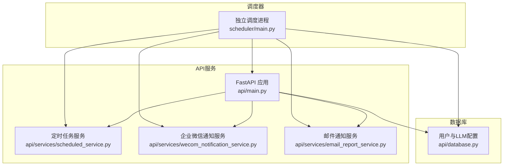
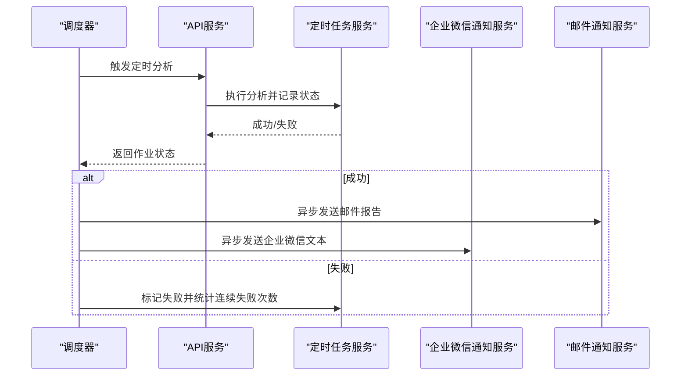
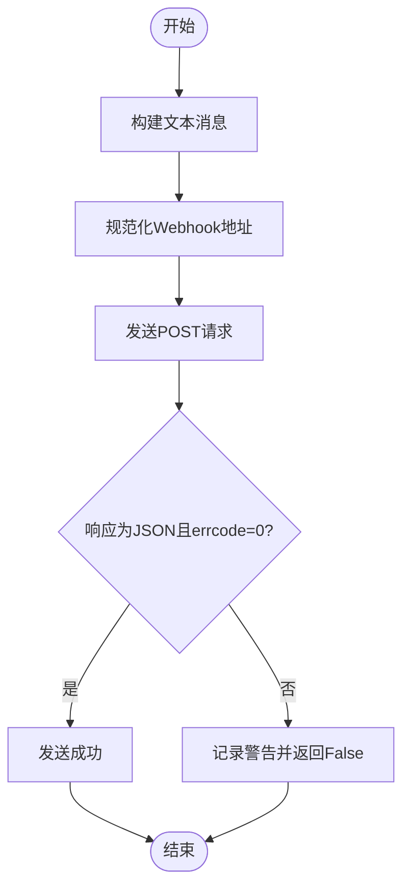
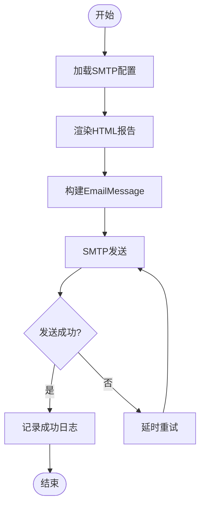
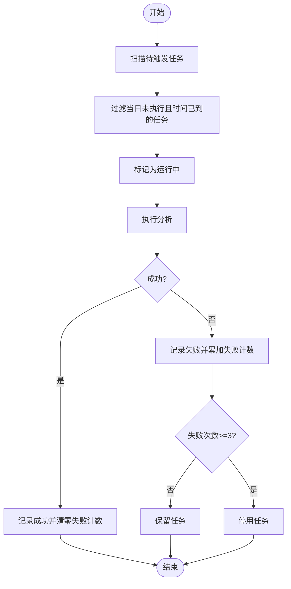
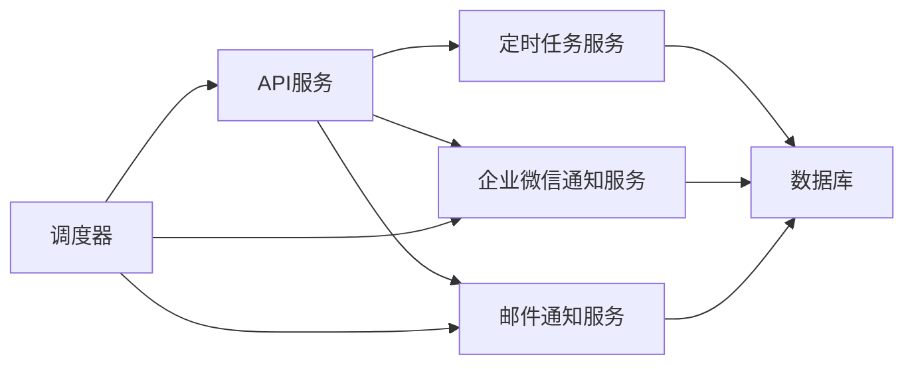

# 通知API

<cite>
**本文引用的文件**
- [api/main.py](file://api/main.py)
- [api/services/wecom_notification_service.py](file://api/services/wecom_notification_service.py)
- [api/services/email_report_service.py](file://api/services/email_report_service.py)
- [api/services/scheduled_service.py](file://api/services/scheduled_service.py)
- [scheduler/main.py](file://scheduler/main.py)
- [api/database.py](file://api/database.py)
</cite>

## 目录
1. [简介](#简介)
2. [项目结构](#项目结构)
3. [核心组件](#核心组件)
4. [架构总览](#架构总览)
5. [详细组件分析](#详细组件分析)
6. [依赖分析](#依赖分析)
7. [性能考虑](#性能考虑)
8. [故障排查指南](#故障排查指南)
9. [结论](#结论)
10. [附录](#附录)

## 简介
本文件为 TradingAgents-AShare 通知API的权威参考文档，覆盖企业微信通知、邮件通知与定时任务通知的端点、参数、响应、模板、触发条件、接收人配置、重试与失败处理策略，并提供通知渠道配置、消息格式与个性化定制指南，以及监控、日志与性能优化建议。

## 项目结构
通知能力由三部分协同实现：
- API服务层：提供运行时配置、手动触发与批量触发等端点，负责调度与通知派发。
- 通知服务层：封装企业微信与邮件通知的具体实现，包括消息构建、发送与重试。
- 定时任务调度器：独立进程，按交易日与非交易时段检查并触发定时分析，完成后派发通知。



图表来源
- [api/main.py](file://api/main.py)
- [api/services/scheduled_service.py](file://api/services/scheduled_service.py)
- [api/services/wecom_notification_service.py](file://api/services/wecom_notification_service.py)
- [api/services/email_report_service.py](file://api/services/email_report_service.py)
- [scheduler/main.py](file://scheduler/main.py)
- [api/database.py](file://api/database.py)

章节来源
- [api/main.py](file://api/main.py)
- [scheduler/main.py](file://scheduler/main.py)

## 核心组件
- 企业微信通知服务：负责构建文本消息、校验Webhook地址、发送并带重试。
- 邮件通知服务：负责渲染HTML报告、构造SMTP邮件、发送并带重试。
- 定时任务服务：负责定时任务的增删改查、触发条件判断、执行状态记录与并发控制。
- 调度器：独立进程，按分钟扫描待触发任务，执行分析并派发通知。
- API服务：对外暴露端点，承载运行时配置、手动/批量触发、报告查询等。

章节来源
- [api/services/wecom_notification_service.py](file://api/services/wecom_notification_service.py)
- [api/services/email_report_service.py](file://api/services/email_report_service.py)
- [api/services/scheduled_service.py](file://api/services/scheduled_service.py)
- [scheduler/main.py](file://scheduler/main.py)

## 架构总览
通知系统在“定时分析完成”后，由调度器统一派发通知。API侧同时支持手动触发与批量触发，二者均会记录执行结果并在成功后派发通知。



图表来源
- [scheduler/main.py](file://scheduler/main.py)
- [api/services/scheduled_service.py](file://api/services/scheduled_service.py)
- [api/services/email_report_service.py](file://api/services/email_report_service.py)
- [api/services/wecom_notification_service.py](file://api/services/wecom_notification_service.py)

## 详细组件分析

### 企业微信通知服务
- 功能要点
  - 文本消息构建：基于报告对象动态拼装标题、标的、交易日、决策、方向、置信度与摘要。
  - 测试消息：支持自定义内容或默认测试文案。
  - Webhook地址规范化：支持key参数或完整URL两种形式，严格校验HTTPS与域名。
  - 发送与重试：首次失败后延时重试一次，均失败则记录告警日志。
- 消息模板
  - 标题：固定“TradingAgents 定时分析完成”
  - 内容：标的、交易日、决策、方向、置信度、摘要（优先final_trade_decision，其次trader_investment_plan，再次investment_plan）
  - 字符限制：整体不超过1800字符，摘要部分限制约900字符
- 错误处理
  - URL非法或非HTTPS、key格式错误、参数缺失时抛出异常
  - 发送失败或返回非JSON时记录警告
  - 重试失败记录错误日志



图表来源
- [api/services/wecom_notification_service.py](file://api/services/wecom_notification_service.py)

章节来源
- [api/services/wecom_notification_service.py](file://api/services/wecom_notification_service.py)

### 邮件通知服务
- 功能要点
  - HTML渲染：将报告内容转换为带内联样式的HTML，包含方向徽章、关键指标表、风险提示、最终交易决策等模块。
  - Markdown转HTML：表格、标题、列表、引用等元素添加内联样式以兼容邮件客户端。
  - 前端链接推断：从环境变量推断前端URL，用于“查看完整报告”按钮。
  - SMTP发送：支持STARTTLS与SSL/TLS，凭据来自环境变量，失败记录错误日志。
  - 重试：首次失败后延时重试一次，均失败记录错误日志。
- 模板与样式
  - 使用内联CSS保证邮件客户端兼容性
  - 关键指标与风险提示采用颜色编码与图标
- 配置项
  - MAIL_HOST/MAIL_SERVER/SMTP_HOST
  - MAIL_PORT/SMTP_PORT
  - MAIL_USER/MAIL_USERNAME/SMTP_USER
  - MAIL_PASS/MAIL_PASSWORD/SMTP_PASSWORD
  - MAIL_FROM/SMTP_FROM
  - MAIL_STARTTLS/SMTP_TLS
  - MAIL_SSL/MAIL_SSL_TLS
  - FRONTEND_URL/CORS_ALLOW_ORIGINS



图表来源
- [api/services/email_report_service.py](file://api/services/email_report_service.py)

章节来源
- [api/services/email_report_service.py](file://api/services/email_report_service.py)

### 定时任务服务
- 功能要点
  - 任务管理：创建、查询、批量查询、更新、批量更新、删除、批量删除
  - 触发条件：仅在交易日、非交易时段（20:00~次日08:00）且当日未执行过、当前时间到达设定触发时间时触发
  - 并发控制：通过数据库标记“运行中”，避免重复执行
  - 连续失败处理：连续失败达到阈值自动停用任务
- 关键参数
  - horizon：short/medium
  - trigger_time：HH:MM，限定在允许窗口
  - is_active：启用/停用
- 数据模型字段
  - last_run_date、last_run_status、last_report_id、consecutive_failures



图表来源
- [api/services/scheduled_service.py](file://api/services/scheduled_service.py)

章节来源
- [api/services/scheduled_service.py](file://api/services/scheduled_service.py)

### 调度器（独立进程）
- 功能要点
  - 每分钟检查一次：仅在交易日、非交易时段触发
  - 并发控制：使用信号量限制同时运行的定时任务数量
  - 通知派发：分析成功后异步发送邮件与企业微信通知
  - 崩溃恢复：启动时重置“运行中”但无对应完成报告的任务状态
- 并发与资源
  - 默认并发：可通过环境变量配置
  - 默认线程池大小：按并发动态调整

```mermaid
sequenceDiagram
participant Loop as "调度循环"
participant DB as "数据库"
participant Exec as "执行器"
participant Noti as "通知服务"
Loop->>DB : 查询待触发任务
DB-->>Loop : 返回任务快照
Loop->>Exec : 创建后台任务执行分析
Exec-->>DB : 更新成功/失败状态
alt 成功
Exec->>Noti : 异步发送邮件与企业微信
else 失败
Exec->>DB : 统计连续失败次数
end
```

图表来源
- [scheduler/main.py](file://scheduler/main.py)

章节来源
- [scheduler/main.py](file://scheduler/main.py)

### API端点与运行时配置
- 运行时配置端点
  - 获取运行时配置：返回邮箱与企业微信开关、显示的Webhook掩码等
  - 更新运行时配置：支持开启/关闭邮件与企业微信通知、设置Webhook URL（支持加密存储）
  - 企业微信暖身测试：对指定Webhook发送测试消息
- 定时任务端点
  - 列表/创建/更新/删除/批量更新/批量删除
  - 单个触发/批量触发：手动触发分析并记录结果
- 报告端点
  - 创建/查询/批量查询/详情/删除

章节来源
- [api/main.py](file://api/main.py)

## 依赖分析
- 组件耦合
  - 调度器依赖API服务的作业执行与数据库模型，同时依赖通知服务进行派发
  - API服务依赖定时任务服务与通知服务，用于手动/批量触发与运行时配置
  - 通知服务依赖数据库中的用户与LLM配置，以决定是否发送及如何解密Webhook
- 外部依赖
  - 企业微信：官方Webhook域名与路径
  - SMTP：标准协议，支持STARTTLS与SSL/TLS
  - 数据库：用户、LLM配置、定时任务、报告等



图表来源
- [api/main.py](file://api/main.py)
- [scheduler/main.py](file://scheduler/main.py)
- [api/services/scheduled_service.py](file://api/services/scheduled_service.py)
- [api/services/wecom_notification_service.py](file://api/services/wecom_notification_service.py)
- [api/services/email_report_service.py](file://api/services/email_report_service.py)
- [api/database.py](file://api/database.py)

章节来源
- [api/main.py](file://api/main.py)
- [scheduler/main.py](file://scheduler/main.py)
- [api/database.py](file://api/database.py)

## 性能考虑
- 并发与线程池
  - 调度器默认并发可通过环境变量配置；线程池大小按并发动态提升，避免阻塞
  - API服务默认线程池较小，建议在高频场景下适当增大
- I/O与超时
  - 企业微信发送超时短、重试间隔适中；邮件SMTP超时适中，建议结合网络状况调整
- 缓存与预热
  - 调度器启动时预加载交易日历与股票映射，减少后续I/O
- 日志与可观测性
  - 关键路径均有日志，建议结合日志级别与采样策略进行生产级配置

## 故障排查指南
- 企业微信
  - Webhook地址不合法：检查是否为HTTPS、域名与路径是否正确、key参数是否符合要求
  - 发送失败：查看非JSON响应或errcode非0的情况；确认网络连通性与企业微信机器人权限
  - 重试失败：关注重试后的错误日志，定位网络或权限问题
- 邮件
  - SMTP配置缺失：确认环境变量齐全；STARTTLS与SSL/TLS不可同时开启
  - 发送失败：查看SMTP异常日志；检查收件人邮箱有效性与邮件客户端兼容性
  - 重试失败：关注延时重试后的错误日志
- 定时任务
  - 未触发：确认是否为交易日、是否处于允许窗口、是否已当天执行过
  - 连续失败：超过阈值会自动停用，需手动启用或检查上游分析是否稳定
  - 并发冲突：查看“运行中”状态是否被正确清理，必要时重启调度器进行恢复

章节来源
- [api/services/wecom_notification_service.py](file://api/services/wecom_notification_service.py)
- [api/services/email_report_service.py](file://api/services/email_report_service.py)
- [api/services/scheduled_service.py](file://api/services/scheduled_service.py)
- [scheduler/main.py](file://scheduler/main.py)

## 结论
通知API通过清晰的服务边界与独立调度器实现了高可靠的通知派发：企业微信与邮件分别针对即时消息与长文报告场景，定时任务服务确保在合适的时间窗口内稳定执行与记录。配合完善的重试与失败处理策略，可在生产环境中提供可靠的投研报告通知能力。

## 附录

### 通知渠道配置与个性化
- 企业微信
  - 支持设置Webhook URL或仅提供key；支持测试暖身
  - 消息模板包含标的、交易日、决策、方向、置信度与摘要
- 邮件
  - HTML内联样式，包含方向徽章、关键指标、风险提示、最终交易决策
  - 支持前端链接，便于直达报告详情
- 运行时配置
  - 可开启/关闭邮件与企业微信通知
  - Webhook URL支持加密存储与掩码显示

章节来源
- [api/main.py](file://api/main.py)
- [api/services/wecom_notification_service.py](file://api/services/wecom_notification_service.py)
- [api/services/email_report_service.py](file://api/services/email_report_service.py)