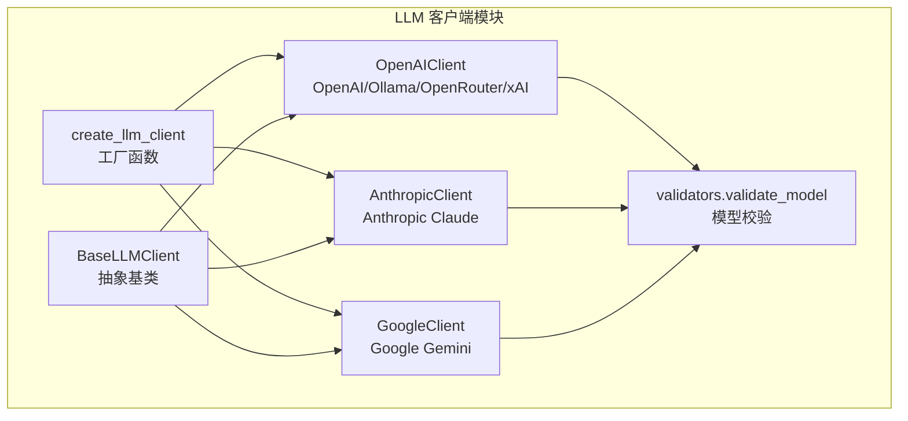
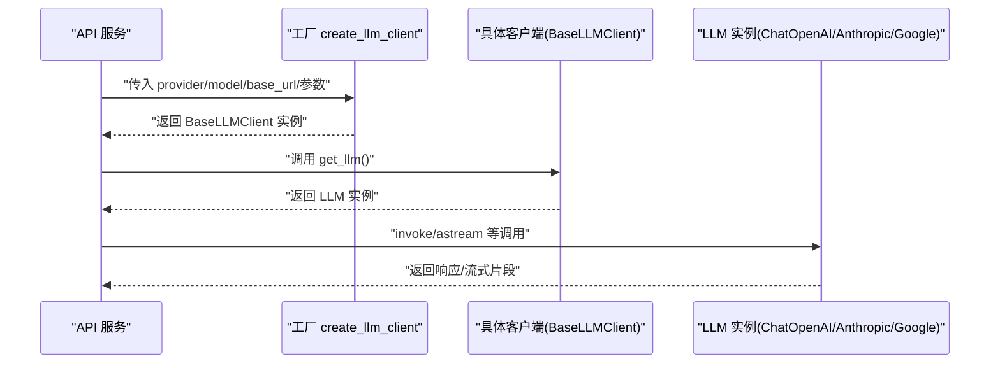
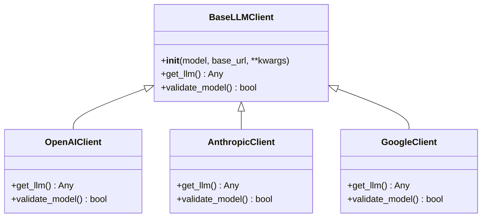
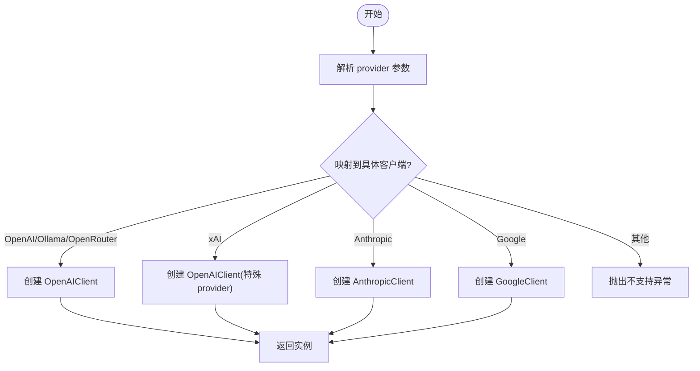
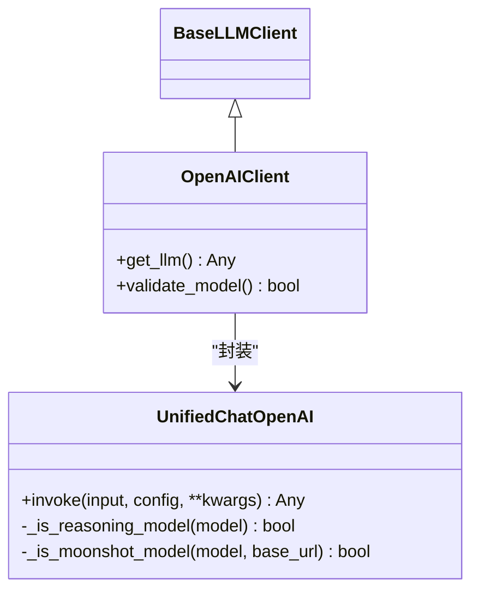
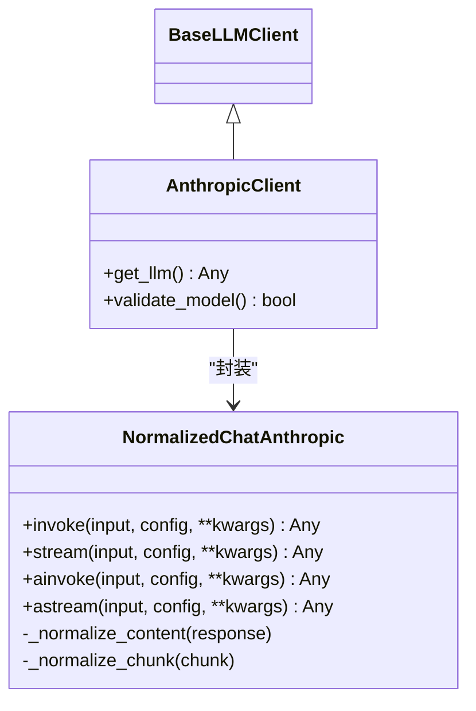
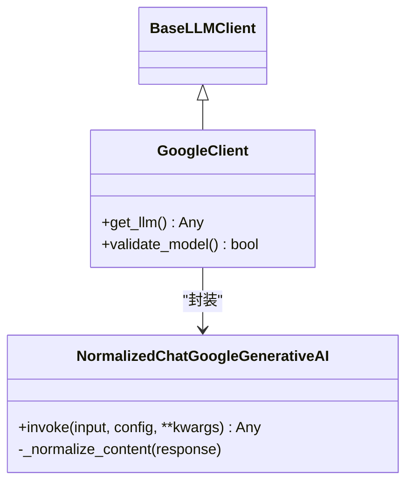
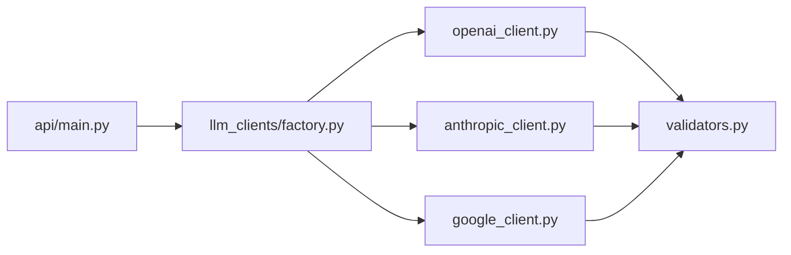

# LLM客户端架构

<cite>
**本文引用的文件**
- [base_client.py](file://tradingagents/llm_clients/base_client.py)
- [factory.py](file://tradingagents/llm_clients/factory.py)
- [openai_client.py](file://tradingagents/llm_clients/openai_client.py)
- [anthropic_client.py](file://tradingagents/llm_clients/anthropic_client.py)
- [google_client.py](file://tradingagents/llm_clients/google_client.py)
- [validators.py](file://tradingagents/llm_clients/validators.py)
- [__init__.py](file://tradingagents/llm_clients/__init__.py)
- [TODO.md](file://tradingagents/llm_clients/TODO.md)
- [main.py](file://api/main.py)
</cite>

## 目录
1. [引言](#引言)
2. [项目结构](#项目结构)
3. [核心组件](#核心组件)
4. [架构总览](#架构总览)
5. [详细组件分析](#详细组件分析)
6. [依赖分析](#依赖分析)
7. [性能考虑](#性能考虑)
8. [故障排查指南](#故障排查指南)
9. [结论](#结论)
10. [附录](#附录)

## 引言
本文件系统性梳理 TradingAgents 项目中的 LLM 客户端架构，重点覆盖：
- BaseClient 抽象基类的设计原则、接口规范与继承模式
- 客户端工厂模式的实现机制、动态加载策略与实例管理
- 生命周期管理、连接池与资源清理现状与改进建议
- 异常处理策略、重试机制与降级方案
- 客户端配置验证、参数校验与安全防护
- 扩展开发指南与最佳实践

## 项目结构
LLM 客户端位于 tradingagents/llm_clients 目录，采用“抽象基类 + 多提供商具体实现 + 工厂 + 校验器”的分层设计，便于在不修改上层调用逻辑的前提下替换或新增提供商。

图表来源
- [base_client.py:5-22](file://tradingagents/llm_clients/base_client.py#L5-L22)
- [factory.py:9-44](file://tradingagents/llm_clients/factory.py#L9-L44)
- [openai_client.py:69-126](file://tradingagents/llm_clients/openai_client.py#L69-L126)
- [anthropic_client.py:65-91](file://tradingagents/llm_clients/anthropic_client.py#L65-L91)
- [google_client.py:31-68](file://tradingagents/llm_clients/google_client.py#L31-L68)
- [validators.py:69-83](file://tradingagents/llm_clients/validators.py#L69-L83)

章节来源
- [base_client.py:5-22](file://tradingagents/llm_clients/base_client.py#L5-L22)
- [factory.py:9-44](file://tradingagents/llm_clients/factory.py#L9-L44)
- [openai_client.py:69-126](file://tradingagents/llm_clients/openai_client.py#L69-L126)
- [anthropic_client.py:65-91](file://tradingagents/llm_clients/anthropic_client.py#L65-L91)
- [google_client.py:31-68](file://tradingagents/llm_clients/google_client.py#L31-L68)
- [validators.py:69-83](file://tradingagents/llm_clients/validators.py#L69-L83)

## 核心组件
- 抽象基类 BaseLLMClient：定义统一的客户端接口，要求子类实现 get_llm 与 validate_model，确保不同提供商的客户端具备一致的对外能力。
- 工厂函数 create_llm_client：根据 provider 参数动态选择具体客户端实现，屏蔽上层对具体提供商的耦合。
- 具体客户端：
  - OpenAIClient：封装 ChatOpenAI，支持 OpenAI、xAI、OpenRouter、Ollama，并内置针对推理模型的参数兼容处理。
  - AnthropicClient：封装 ChatAnthropic，提供内容标准化以统一下游处理。
  - GoogleClient：封装 ChatGoogleGenerativeAI，提供内容标准化与思维级别映射。
- 校验器 validators：维护各提供商可用模型清单，提供模型名合法性检查。

章节来源
- [base_client.py:5-22](file://tradingagents/llm_clients/base_client.py#L5-L22)
- [factory.py:9-44](file://tradingagents/llm_clients/factory.py#L9-L44)
- [openai_client.py:69-126](file://tradingagents/llm_clients/openai_client.py#L69-L126)
- [anthropic_client.py:65-91](file://tradingagents/llm_clients/anthropic_client.py#L65-L91)
- [google_client.py:31-68](file://tradingagents/llm_clients/google_client.py#L31-L68)
- [validators.py:69-83](file://tradingagents/llm_clients/validators.py#L69-L83)

## 架构总览
下图展示从 API 层到 LLM 客户端的调用链路与职责分工：

图表来源
- [factory.py:9-44](file://tradingagents/llm_clients/factory.py#L9-L44)
- [openai_client.py:82-126](file://tradingagents/llm_clients/openai_client.py#L82-L126)
- [anthropic_client.py:71-91](file://tradingagents/llm_clients/anthropic_client.py#L71-L91)
- [google_client.py:37-68](file://tradingagents/llm_clients/google_client.py#L37-L68)
- [main.py:2990-3022](file://api/main.py#L2990-L3022)
- [main.py:3087-3126](file://api/main.py#L3087-L3126)

## 详细组件分析

### 抽象基类 BaseLLMClient
- 设计要点
  - 统一构造签名：model、base_url 及透传 kwargs，便于后续客户端实现复用。
  - 必须实现方法：
    - get_llm：返回已配置的 LLM 实例，供上层直接调用。
    - validate_model：校验模型名是否受当前提供商支持。
- 继承模式
  - 各具体客户端均继承自 BaseLLMClient，遵循同一接口契约，保证上层调用一致性。

图表来源
- [base_client.py:5-22](file://tradingagents/llm_clients/base_client.py#L5-L22)
- [openai_client.py:69-126](file://tradingagents/llm_clients/openai_client.py#L69-L126)
- [anthropic_client.py:65-91](file://tradingagents/llm_clients/anthropic_client.py#L65-L91)
- [google_client.py:31-68](file://tradingagents/llm_clients/google_client.py#L31-L68)

章节来源
- [base_client.py:5-22](file://tradingagents/llm_clients/base_client.py#L5-L22)

### 工厂模式 create_llm_client
- 动态加载策略
  - 基于 provider 字符串进行大小写无关匹配，映射到具体客户端类型。
  - 支持 openai、ollama、openrouter、xai、anthropic、google。
- 实例管理
  - 工厂返回 BaseLLMClient 子类实例，上层无需感知具体提供商差异。
- 错误处理
  - 不支持的 provider 将抛出异常，提示错误信息。

图表来源
- [factory.py:9-44](file://tradingagents/llm_clients/factory.py#L9-L44)

章节来源
- [factory.py:9-44](file://tradingagents/llm_clients/factory.py#L9-L44)

### OpenAI/Ollama/OpenRouter/xAI 客户端（OpenAIClient）
- 关键特性
  - 统一的 ChatOpenAI 子类化封装，屏蔽提供商差异。
  - 推理模型识别与参数兼容：
    - 对推理模型自动剔除 temperature/top_p。
    - Moonshot/Kimi 场景强制 temperature=1。
  - 重试与超时：
    - 显式禁用重试，设置较长超时，适配推理类模型。
  - 基础地址与密钥：
    - 根据 provider 设置 base_url，默认 OpenAI、xAI、OpenRouter、Ollama 的默认端点。
    - 通过环境变量注入 API Key。
  - 参数透传：
    - 支持 callbacks、reasoning_effort 等参数透传。
- 生命周期与资源
  - 通过 LangChain ChatOpenAI 生命周期管理底层连接；当前未见显式的连接池或手动释放逻辑。

图表来源
- [openai_client.py:15-126](file://tradingagents/llm_clients/openai_client.py#L15-L126)
- [base_client.py:5-22](file://tradingagents/llm_clients/base_client.py#L5-L22)

章节来源
- [openai_client.py:69-126](file://tradingagents/llm_clients/openai_client.py#L69-L126)

### Anthropic 客户端（AnthropicClient）
- 关键特性
  - 内容标准化：将 Claude 思维模式返回的复合内容块统一为字符串，便于下游处理。
  - 基础地址处理：自动去除末尾的 /v1，避免重复路径。
  - 参数透传：timeout、max_retries、api_key、max_tokens、callbacks 等。
- 生命周期与资源
  - 通过 LangChain ChatAnthropic 管理连接；未见显式连接池或资源回收逻辑。

图表来源
- [anthropic_client.py:34-91](file://tradingagents/llm_clients/anthropic_client.py#L34-L91)
- [base_client.py:5-22](file://tradingagents/llm_clients/base_client.py#L5-L22)

章节来源
- [anthropic_client.py:65-91](file://tradingagents/llm_clients/anthropic_client.py#L65-L91)

### Google 客户端（GoogleClient）
- 关键特性
  - 内容标准化：将 Gemini 返回的列表内容合并为字符串。
  - 思维级别映射：
    - Gemini 3 系列：映射为 thinking_level（注意 Pro 版本不支持 minimal）。
    - Gemini 2.5 系列：映射为 thinking_budget（-1 动态，0 禁用）。
  - 参数透传：timeout、max_retries、google_api_key、callbacks 等；支持 api_key 别名映射。
- 生命周期与资源
  - 通过 LangChain ChatGoogleGenerativeAI 管理连接；未见显式连接池或资源回收逻辑。

图表来源
- [google_client.py:9-68](file://tradingagents/llm_clients/google_client.py#L9-L68)
- [base_client.py:5-22](file://tradingagents/llm_clients/base_client.py#L5-L22)

章节来源
- [google_client.py:31-68](file://tradingagents/llm_clients/google_client.py#L31-L68)

### 模型校验器 validators
- 设计目标
  - 维护各提供商可用模型清单，提供 validate_model 校验入口。
  - 对特定提供商（如 ollama、openrouter）不做严格限制，允许任意模型名。
- 使用现状
  - OpenAI/Ollama/OpenRouter 客户端已调用 validate_model。
  - Anthropic/Google 客户端已调用 validate_model。
  - TODO 指出 validate_model 在 get_llm 中未被调用，存在一致性改进空间。

章节来源
- [validators.py:69-83](file://tradingagents/llm_clients/validators.py#L69-L83)
- [openai_client.py:124-126](file://tradingagents/llm_clients/openai_client.py#L124-L126)
- [anthropic_client.py:88-91](file://tradingagents/llm_clients/anthropic_client.py#L88-L91)
- [google_client.py:65-68](file://tradingagents/llm_clients/google_client.py#L65-L68)
- [TODO.md:5-6](file://tradingagents/llm_clients/TODO.md#L5-L6)

### 上层集成示例（API 层）
- 调用流程
  - 从配置读取 provider/model/base_url/api_key 等参数。
  - 通过工厂创建客户端，调用 get_llm 获取 LLM 实例。
  - 使用 invoke 或流式 astream 发送请求，解析响应。
- 日志与调试
  - 记录模型名、基础地址、提示词与响应摘要，便于定位问题。

章节来源
- [main.py:2990-3022](file://api/main.py#L2990-L3022)
- [main.py:3087-3126](file://api/main.py#L3087-L3126)

## 依赖分析
- 模块内聚与耦合
  - BaseLLMClient 提供统一接口，降低上层对具体提供商的耦合。
  - 工厂函数集中映射，便于扩展新提供商。
  - 各客户端内部依赖 LangChain 提供的 Chat* 类，负责实际网络交互。
- 外部依赖
  - LangChain 生态（ChatOpenAI、ChatAnthropic、ChatGoogleGenerativeAI）。
  - 环境变量（如 XAI_API_KEY、OPENROUTER_API_KEY）用于密钥注入。
- 循环依赖
  - 当前文件间无循环导入迹象。

图表来源
- [main.py:2990-3022](file://api/main.py#L2990-L3022)
- [factory.py:9-44](file://tradingagents/llm_clients/factory.py#L9-L44)
- [openai_client.py:69-126](file://tradingagents/llm_clients/openai_client.py#L69-L126)
- [anthropic_client.py:65-91](file://tradingagents/llm_clients/anthropic_client.py#L65-L91)
- [google_client.py:31-68](file://tradingagents/llm_clients/google_client.py#L31-L68)
- [validators.py:69-83](file://tradingagents/llm_clients/validators.py#L69-L83)

章节来源
- [main.py:2990-3022](file://api/main.py#L2990-L3022)
- [factory.py:9-44](file://tradingagents/llm_clients/factory.py#L9-L44)
- [openai_client.py:69-126](file://tradingagents/llm_clients/openai_client.py#L69-L126)
- [anthropic_client.py:65-91](file://tradingagents/llm_clients/anthropic_client.py#L65-L91)
- [google_client.py:31-68](file://tradingagents/llm_clients/google_client.py#L31-L68)
- [validators.py:69-83](file://tradingagents/llm_clients/validators.py#L69-L83)

## 性能考虑
- 超时与重试
  - OpenAI 客户端显式禁用重试并设置较长超时，避免推理模型重复扣费或状态丢失。
- 流式处理
  - Anthropic/Google 客户端提供同步与异步流式接口，API 层可按需选择。
- 日志开销
  - 在 DEBUG 级别下启用 LangChain verbose，便于调试但会增加日志输出成本。

章节来源
- [openai_client.py:82-126](file://tradingagents/llm_clients/openai_client.py#L82-L126)
- [anthropic_client.py:56-62](file://tradingagents/llm_clients/anthropic_client.py#L56-L62)
- [google_client.py:27-30](file://tradingagents/llm_clients/google_client.py#L27-L30)

## 故障排查指南
- 常见问题与定位
  - 不支持的提供商：工厂函数会抛出异常，检查 provider 是否拼写正确或是否在支持列表中。
  - 模型名不合法：validate_model 返回 False 时，确认模型名是否在 validators 中维护。
  - 基础地址与端点：Anthropic/Google 对 base_url 的处理不同，需确保传入格式正确。
  - 密钥缺失：OpenAI 客户端通过环境变量注入 API Key，确认对应环境变量已设置。
- 日志与调试
  - API 层记录模型名、基础地址、提示词与响应摘要，有助于快速定位问题。
- 降级与回退
  - 当前未见显式的降级策略；可在上层捕获异常后切换至备用提供商或回退到本地模型（如 Ollama）。

章节来源
- [factory.py:43-44](file://tradingagents/llm_clients/factory.py#L43-L44)
- [validators.py:69-83](file://tradingagents/llm_clients/validators.py#L69-L83)
- [openai_client.py:103-116](file://tradingagents/llm_clients/openai_client.py#L103-L116)
- [anthropic_client.py:75-80](file://tradingagents/llm_clients/anthropic_client.py#L75-L80)
- [main.py:3022-3023](file://api/main.py#L3022-L3023)
- [main.py:3122-3123](file://api/main.py#L3122-L3123)

## 结论
该 LLM 客户端架构以抽象基类为核心，通过工厂模式屏蔽提供商差异，结合 LangChain 客户端实现稳定高效的推理能力。OpenAI/Ollama/OpenRouter/xAI 客户端在参数兼容与稳定性方面做了针对性优化；Anthropic/Google 客户端提供了内容标准化与思维级别映射。未来可在模型校验一致性、base_url 处理规范化、连接池与资源回收等方面进一步完善。

## 附录

### 客户端生命周期与资源管理现状
- 当前实现
  - 各客户端通过 LangChain 客户端管理底层连接；未发现显式的连接池或资源释放逻辑。
- 建议
  - 在需要高并发或长时间运行的服务中，评估引入连接池与超时重试策略。
  - 在进程退出或异常场景下，确保关闭或释放底层连接资源。

章节来源
- [openai_client.py:82-126](file://tradingagents/llm_clients/openai_client.py#L82-L126)
- [anthropic_client.py:71-91](file://tradingagents/llm_clients/anthropic_client.py#L71-L91)
- [google_client.py:37-68](file://tradingagents/llm_clients/google_client.py#L37-L68)

### 异常处理、重试与降级
- 异常处理
  - 工厂函数对不支持的 provider 抛出异常；客户端内部异常由 LangChain 或上层捕获。
- 重试机制
  - OpenAI 客户端显式禁用重试；其他客户端未见显式重试配置。
- 降级方案
  - 建议在上层捕获异常后，按优先级回退到备用提供商或本地模型。

章节来源
- [factory.py:43-44](file://tradingagents/llm_clients/factory.py#L43-L44)
- [openai_client.py:91-91](file://tradingagents/llm_clients/openai_client.py#L91-L91)

### 配置验证、参数校验与安全防护
- 配置验证
  - 工厂函数对 provider 进行大小写无关匹配；建议在上层增加必填参数校验。
- 参数校验
  - validate_model 对模型名进行白名单校验；建议在 get_llm 中统一调用并记录警告。
- 安全防护
  - API Key 通过环境变量注入；建议在生产环境使用密钥管理服务并限制权限范围。

章节来源
- [factory.py:29-29](file://tradingagents/llm_clients/factory.py#L29-L29)
- [validators.py:69-83](file://tradingagents/llm_clients/validators.py#L69-L83)
- [openai_client.py:103-116](file://tradingagents/llm_clients/openai_client.py#L103-L116)

### 扩展开发指南与最佳实践
- 新增提供商步骤
  - 实现 BaseLLMClient 子类，完成 get_llm 与 validate_model。
  - 在工厂函数中添加映射分支。
  - 如需模型校验，更新 validators。
- 最佳实践
  - 统一参数命名与别名映射，减少客户端间差异。
  - 在 DEBUG 级别下启用详细日志，生产环境关闭 verbose。
  - 对推理类模型禁用重试，设置合理超时。
  - 在上层实现异常捕获与降级回退逻辑。

章节来源
- [base_client.py:5-22](file://tradingagents/llm_clients/base_client.py#L5-L22)
- [factory.py:9-44](file://tradingagents/llm_clients/factory.py#L9-L44)
- [validators.py:69-83](file://tradingagents/llm_clients/validators.py#L69-L83)
- [TODO.md:5-25](file://tradingagents/llm_clients/TODO.md#L5-L25)