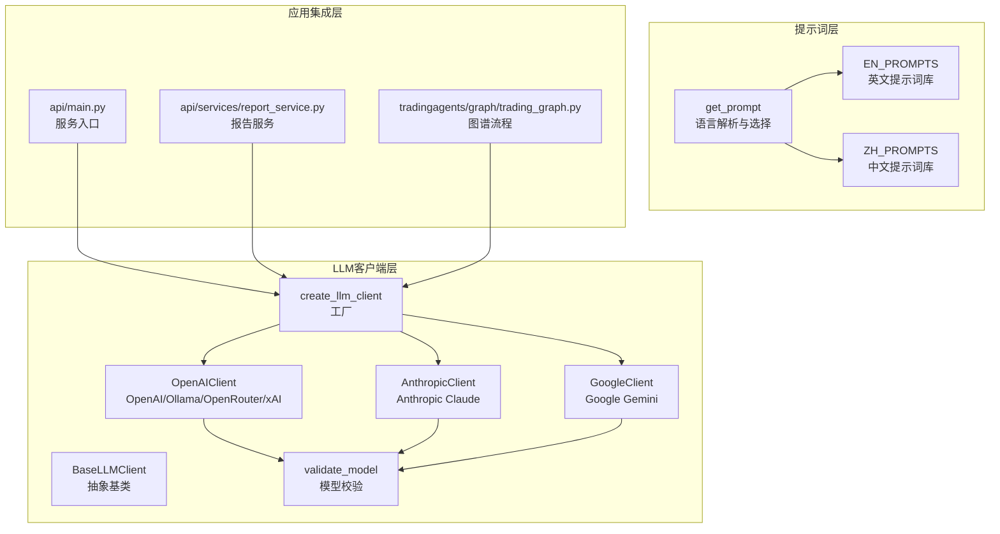
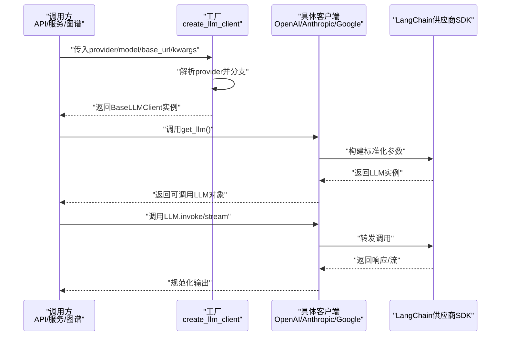
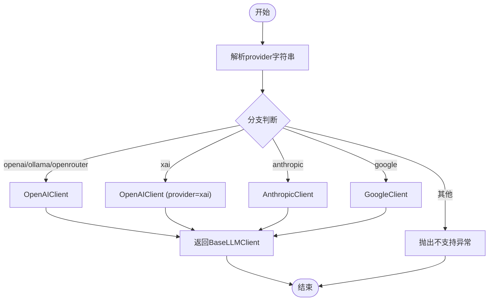
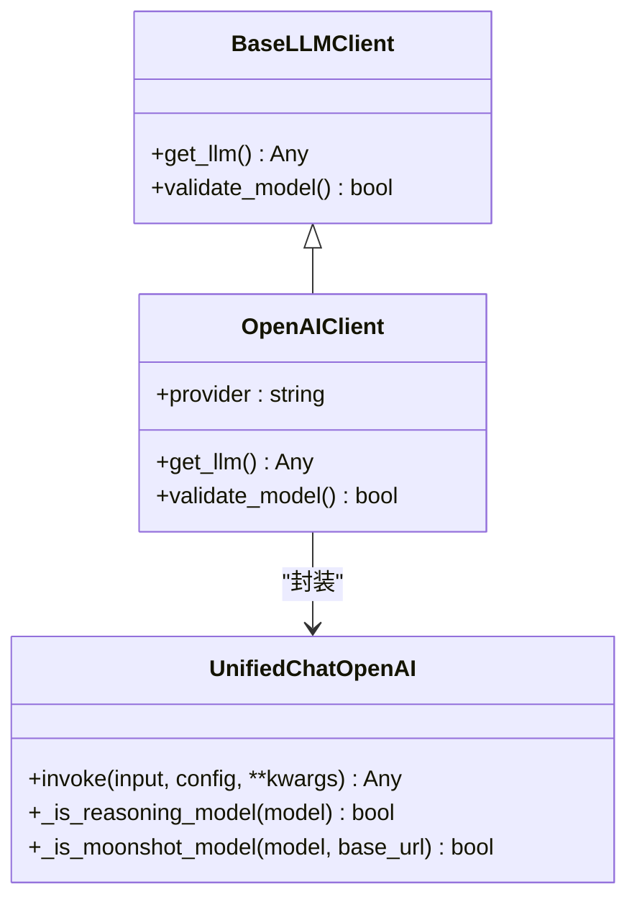
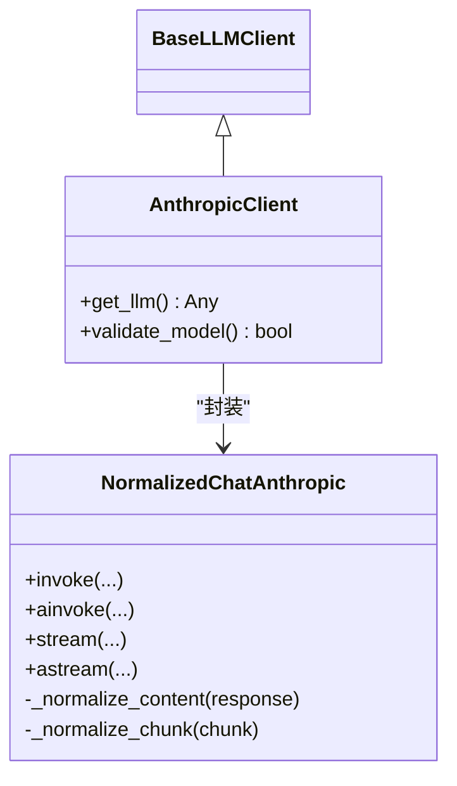
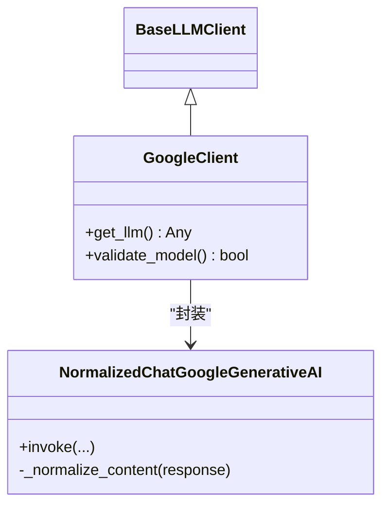
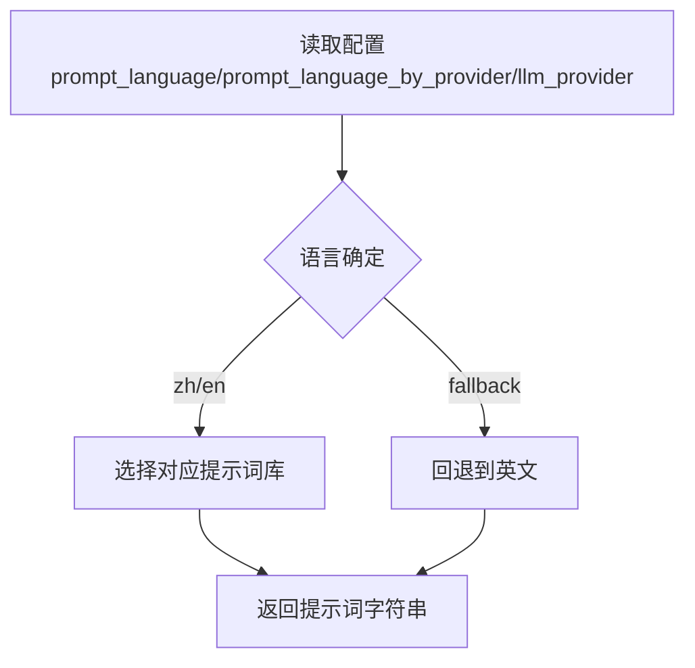
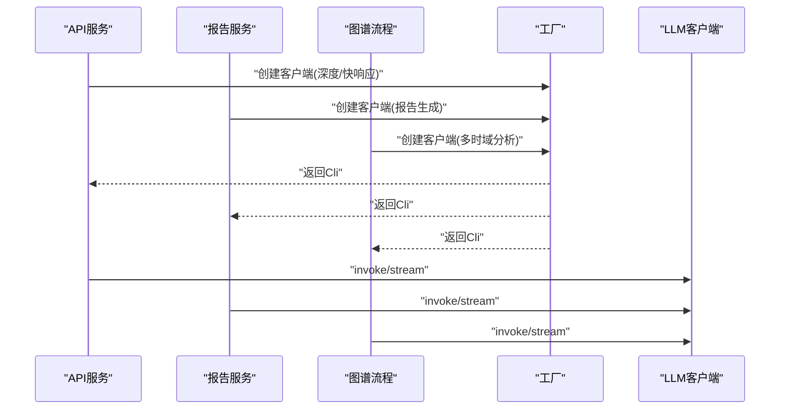
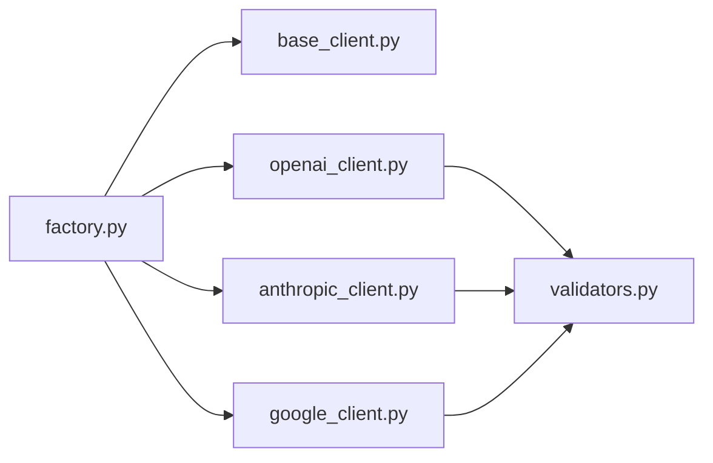

# LLM集成

<cite>
**本文引用的文件**
- [tradingagents/llm_clients/__init__.py](file://tradingagents/llm_clients/__init__.py)
- [tradingagents/llm_clients/base_client.py](file://tradingagents/llm_clients/base_client.py)
- [tradingagents/llm_clients/factory.py](file://tradingagents/llm_clients/factory.py)
- [tradingagents/llm_clients/openai_client.py](file://tradingagents/llm_clients/openai_client.py)
- [tradingagents/llm_clients/anthropic_client.py](file://tradingagents/llm_clients/anthropic_client.py)
- [tradingagents/llm_clients/google_client.py](file://tradingagents/llm_clients/google_client.py)
- [tradingagents/llm_clients/validators.py](file://tradingagents/llm_clients/validators.py)
- [tradingagents/prompts/__init__.py](file://tradingagents/prompts/__init__.py)
- [tradingagents/prompts/catalog.py](file://tradingagents/prompts/catalog.py)
- [tradingagents/prompts/en.py](file://tradingagents/prompts/en.py)
- [tradingagents/prompts/zh.py](file://tradingagents/prompts/zh.py)
- [api/main.py](file://api/main.py)
- [api/services/report_service.py](file://api/services/report_service.py)
- [tradingagents/graph/trading_graph.py](file://tradingagents/graph/trading_graph.py)
</cite>

## 目录
1. [引言](#引言)
2. [项目结构](#项目结构)
3. [核心组件](#核心组件)
4. [架构总览](#架构总览)
5. [详细组件分析](#详细组件分析)
6. [依赖分析](#依赖分析)
7. [性能考虑](#性能考虑)
8. [故障排查指南](#故障排查指南)
9. [结论](#结论)
10. [附录](#附录)

## 引言
本文件面向TradingAgents-AShare的LLM集成系统，系统性阐述多供应商LLM客户端架构、参数标准化与错误处理机制，详解OpenAI、Anthropic、Google Gemini等供应商的集成方式与配置选项，解释工厂模式、动态加载与版本管理策略，梳理提示词工程、上下文管理与输出解析策略，并提供调用优化、成本控制与性能监控建议，最后给出自定义LLM客户端开发指南与最佳实践。

## 项目结构
LLM集成位于tradingagents/llm_clients目录，采用“抽象基类 + 工厂 + 多供应商适配器”的分层设计，配合tradingagents/prompts目录的提示词工程与catalog语言解析，贯穿API服务与图谱流程。

**图表来源**
- [tradingagents/llm_clients/base_client.py:1-22](file://tradingagents/llm_clients/base_client.py#L1-L22)
- [tradingagents/llm_clients/factory.py:1-44](file://tradingagents/llm_clients/factory.py#L1-L44)
- [tradingagents/llm_clients/openai_client.py:1-126](file://tradingagents/llm_clients/openai_client.py#L1-L126)
- [tradingagents/llm_clients/anthropic_client.py:1-91](file://tradingagents/llm_clients/anthropic_client.py#L1-L91)
- [tradingagents/llm_clients/google_client.py:1-68](file://tradingagents/llm_clients/google_client.py#L1-L68)
- [tradingagents/llm_clients/validators.py:1-83](file://tradingagents/llm_clients/validators.py#L1-L83)
- [tradingagents/prompts/catalog.py:1-32](file://tradingagents/prompts/catalog.py#L1-L32)
- [tradingagents/prompts/en.py:1-418](file://tradingagents/prompts/en.py#L1-L418)
- [tradingagents/prompts/zh.py:1-560](file://tradingagents/prompts/zh.py#L1-L560)
- [api/main.py:2978-2990](file://api/main.py#L2978-L2990)
- [api/services/report_service.py:110-112](file://api/services/report_service.py#L110-L112)
- [tradingagents/graph/trading_graph.py:14-14](file://tradingagents/graph/trading_graph.py#L14-L14)

**章节来源**
- [tradingagents/llm_clients/__init__.py:1-5](file://tradingagents/llm_clients/__init__.py#L1-L5)
- [tradingagents/llm_clients/base_client.py:1-22](file://tradingagents/llm_clients/base_client.py#L1-L22)
- [tradingagents/llm_clients/factory.py:1-44](file://tradingagents/llm_clients/factory.py#L1-L44)
- [tradingagents/llm_clients/openai_client.py:1-126](file://tradingagents/llm_clients/openai_client.py#L1-L126)
- [tradingagents/llm_clients/anthropic_client.py:1-91](file://tradingagents/llm_clients/anthropic_client.py#L1-L91)
- [tradingagents/llm_clients/google_client.py:1-68](file://tradingagents/llm_clients/google_client.py#L1-L68)
- [tradingagents/llm_clients/validators.py:1-83](file://tradingagents/llm_clients/validators.py#L1-L83)
- [tradingagents/prompts/__init__.py:1-6](file://tradingagents/prompts/__init__.py#L1-L6)
- [tradingagents/prompts/catalog.py:1-32](file://tradingagents/prompts/catalog.py#L1-L32)
- [tradingagents/prompts/en.py:1-418](file://tradingagents/prompts/en.py#L1-L418)
- [tradingagents/prompts/zh.py:1-560](file://tradingagents/prompts/zh.py#L1-L560)
- [api/main.py:2978-2990](file://api/main.py#L2978-L2990)
- [api/services/report_service.py:110-112](file://api/services/report_service.py#L110-L112)
- [tradingagents/graph/trading_graph.py:14-14](file://tradingagents/graph/trading_graph.py#L14-L14)

## 核心组件
- 抽象基类BaseLLMClient：定义统一接口get_llm与validate_model，确保所有供应商客户端具备一致能力契约。
- 工厂create_llm_client：根据provider字符串动态创建具体客户端实例，支持openai、ollama、openrouter、xai、anthropic、google等。
- OpenAIClient：封装UnifiedChatOpenAI，屏蔽不同模型的参数差异，统一超时与重试策略，支持多供应商端点映射。
- AnthropicClient：封装NormalizedChatAnthropic，统一Claude扩展思维输出的文本化处理。
- GoogleClient：封装NormalizedChatGoogleGenerativeAI，统一Gemini多模态输出为字符串，支持thinking_level映射。
- 模型校验validate_model：维护各供应商白名单，支持ollama/openrouter通配，其余严格校验。
- 提示词catalog：按语言与供应商映射选择提示词，支持自动语言检测与回退策略。

**章节来源**
- [tradingagents/llm_clients/base_client.py:1-22](file://tradingagents/llm_clients/base_client.py#L1-L22)
- [tradingagents/llm_clients/factory.py:1-44](file://tradingagents/llm_clients/factory.py#L1-L44)
- [tradingagents/llm_clients/openai_client.py:1-126](file://tradingagents/llm_clients/openai_client.py#L1-L126)
- [tradingagents/llm_clients/anthropic_client.py:1-91](file://tradingagents/llm_clients/anthropic_client.py#L1-L91)
- [tradingagents/llm_clients/google_client.py:1-68](file://tradingagents/llm_clients/google_client.py#L1-L68)
- [tradingagents/llm_clients/validators.py:1-83](file://tradingagents/llm_clients/validators.py#L1-L83)
- [tradingagents/prompts/catalog.py:1-32](file://tradingagents/prompts/catalog.py#L1-L32)

## 架构总览
多供应商LLM客户端通过工厂模式实现动态加载与版本管理，客户端内部对供应商SDK进行“参数标准化 + 输出规范化”处理，确保上层调用一致性。提示词层提供语言与供应商维度的提示词选择，贯穿API与图谱流程。

**图表来源**
- [tradingagents/llm_clients/factory.py:9-43](file://tradingagents/llm_clients/factory.py#L9-L43)
- [tradingagents/llm_clients/openai_client.py:82-122](file://tradingagents/llm_clients/openai_client.py#L82-L122)
- [tradingagents/llm_clients/anthropic_client.py:71-86](file://tradingagents/llm_clients/anthropic_client.py#L71-L86)
- [tradingagents/llm_clients/google_client.py:37-63](file://tradingagents/llm_clients/google_client.py#L37-L63)

## 详细组件分析

### 工厂模式与动态加载
- 支持的provider：openai、ollama、openrouter、xai、anthropic、google。
- 动态分支：根据provider字符串选择对应客户端构造器，统一返回BaseLLMClient实例。
- 错误处理：未知provider直接抛出异常，便于早期发现配置错误。

**图表来源**
- [tradingagents/llm_clients/factory.py:9-43](file://tradingagents/llm_clients/factory.py#L9-L43)

**章节来源**
- [tradingagents/llm_clients/factory.py:1-44](file://tradingagents/llm_clients/factory.py#L1-L44)

### OpenAI/Ollama/OpenRouter/xAI 客户端
- 参数标准化
  - 温度与采样参数：非推理模型默认温度，推理模型自动剔除温度与top_p。
  - 超时与重试：禁用重试，设置较长超时，避免推理模型重复扣费与状态丢失。
  - 端点映射：支持OpenAI、xAI、OpenRouter、Ollama等端点，默认OpenAI。
  - 认证：从环境变量注入API Key，支持显式kwargs覆盖。
- 输出与调试
  - DEBUG日志级别下启用LangChain verbose，记录完整请求/响应。
  - 统一日志输出长度与内容摘要，便于监控与排障。

**图表来源**
- [tradingagents/llm_clients/base_client.py:5-21](file://tradingagents/llm_clients/base_client.py#L5-L21)
- [tradingagents/llm_clients/openai_client.py:69-125](file://tradingagents/llm_clients/openai_client.py#L69-L125)

**章节来源**
- [tradingagents/llm_clients/openai_client.py:1-126](file://tradingagents/llm_clients/openai_client.py#L1-L126)
- [tradingagents/llm_clients/validators.py:69-83](file://tradingagents/llm_clients/validators.py#L69-L83)

### Anthropic Claude 客户端
- 输出规范化
  - 扩展思维模式下，Claude返回内容为块列表，客户端统一抽取text并拼接为字符串，保证下游处理一致性。
  - 支持同步与异步invoke、stream与astream，均进行内容规范化。
- 端点与参数
  - 自动剥离base_url末尾的/v1，兼容供应商SDK约定。
  - 支持timeout、max_retries、api_key、max_tokens、callbacks等参数透传。

**图表来源**
- [tradingagents/llm_clients/anthropic_client.py:65-90](file://tradingagents/llm_clients/anthropic_client.py#L65-L90)

**章节来源**
- [tradingagents/llm_clients/anthropic_client.py:1-91](file://tradingagents/llm_clients/anthropic_client.py#L1-L91)

### Google Gemini 客户端
- 输出规范化
  - Gemini 3系列返回内容为文本块列表，客户端统一拼接为字符串，保证下游一致性。
- 思维参数映射
  - 根据模型系列映射thinking_level到thinking_level或thinking_budget，兼容不同版本API。
- 参数透传
  - 支持timeout、max_retries、google_api_key/callbacks等参数；当仅提供api_key时自动映射为google_api_key。

**图表来源**
- [tradingagents/llm_clients/google_client.py:31-67](file://tradingagents/llm_clients/google_client.py#L31-L67)

**章节来源**
- [tradingagents/llm_clients/google_client.py:1-68](file://tradingagents/llm_clients/google_client.py#L1-L68)

### 提示词工程与上下文管理
- 语言解析
  - 优先使用配置中的prompt_language；若为auto，则按llm_provider映射到语言；否则回退至英文。
- 提示词选择
  - catalog根据键名返回英文或中文提示词，中文提示词库覆盖市场、新闻、社交、基本面、量价、风控等场景。
- 上下文注入
  - 图谱流程与API服务在调用LLM前，会将系统消息、工具名称、时间戳、股票代码等上下文注入提示词模板。

**图表来源**
- [tradingagents/prompts/catalog.py:9-31](file://tradingagents/prompts/catalog.py#L9-L31)
- [tradingagents/prompts/en.py:1-418](file://tradingagents/prompts/en.py#L1-L418)
- [tradingagents/prompts/zh.py:1-560](file://tradingagents/prompts/zh.py#L1-L560)

**章节来源**
- [tradingagents/prompts/catalog.py:1-32](file://tradingagents/prompts/catalog.py#L1-L32)
- [tradingagents/prompts/en.py:1-418](file://tradingagents/prompts/en.py#L1-L418)
- [tradingagents/prompts/zh.py:1-560](file://tradingagents/prompts/zh.py#L1-L560)

### 应用集成点
- API服务入口：在多个业务路径中通过工厂创建LLM客户端，统一调用与参数传递。
- 报告服务：在生成报告流程中使用工厂创建客户端，结合提示词与上下文生成分析内容。
- 图谱流程：在多时域分析中，按深度与速度需求分别创建深思考与快响应客户端，提升整体吞吐与质量。

**图表来源**
- [api/main.py:2978-2990](file://api/main.py#L2978-L2990)
- [api/main.py:3075-3087](file://api/main.py#L3075-L3087)
- [api/main.py:3721-3732](file://api/main.py#L3721-L3732)
- [api/main.py:3765-3784](file://api/main.py#L3765-L3784)
- [api/services/report_service.py:110-112](file://api/services/report_service.py#L110-L112)
- [tradingagents/graph/trading_graph.py:91-97](file://tradingagents/graph/trading_graph.py#L91-L97)
- [tradingagents/graph/trading_graph.py:158-158](file://tradingagents/graph/trading_graph.py#L158-L158)

**章节来源**
- [api/main.py:2978-2990](file://api/main.py#L2978-L2990)
- [api/main.py:3075-3087](file://api/main.py#L3075-L3087)
- [api/main.py:3721-3732](file://api/main.py#L3721-L3732)
- [api/main.py:3765-3784](file://api/main.py#L3765-L3784)
- [api/services/report_service.py:110-112](file://api/services/report_service.py#L110-L112)
- [tradingagents/graph/trading_graph.py:14-14](file://tradingagents/graph/trading_graph.py#L14-L14)
- [tradingagents/graph/trading_graph.py:91-97](file://tradingagents/graph/trading_graph.py#L91-L97)
- [tradingagents/graph/trading_graph.py:158-158](file://tradingagents/graph/trading_graph.py#L158-L158)

## 依赖分析
- 组件耦合
  - 工厂仅依赖抽象基类与具体客户端，不依赖具体SDK细节，降低耦合。
  - 具体客户端依赖LangChain供应商SDK，但通过子类化与参数封装隐藏SDK差异。
- 外部依赖
  - LangChain OpenAI/Anthropic/Google Generative AI适配器。
  - 环境变量注入API Key（xAI、OpenRouter、Ollama）。
- 循环依赖
  - 无循环导入，模块间单向依赖清晰。

**图表来源**
- [tradingagents/llm_clients/factory.py:1-6](file://tradingagents/llm_clients/factory.py#L1-L6)
- [tradingagents/llm_clients/openai_client.py:1-12](file://tradingagents/llm_clients/openai_client.py#L1-L12)
- [tradingagents/llm_clients/anthropic_client.py:1-7](file://tradingagents/llm_clients/anthropic_client.py#L1-L7)
- [tradingagents/llm_clients/google_client.py:1-6](file://tradingagents/llm_clients/google_client.py#L1-L6)
- [tradingagents/llm_clients/validators.py:1-5](file://tradingagents/llm_clients/validators.py#L1-L5)

**章节来源**
- [tradingagents/llm_clients/factory.py:1-44](file://tradingagents/llm_clients/factory.py#L1-L44)
- [tradingagents/llm_clients/openai_client.py:1-12](file://tradingagents/llm_clients/openai_client.py#L1-L12)
- [tradingagents/llm_clients/anthropic_client.py:1-7](file://tradingagents/llm_clients/anthropic_client.py#L1-L7)
- [tradingagents/llm_clients/google_client.py:1-6](file://tradingagents/llm_clients/google_client.py#L1-L6)
- [tradingagents/llm_clients/validators.py:1-83](file://tradingagents/llm_clients/validators.py#L1-L83)

## 性能考虑
- 超时与重试
  - 推理模型禁用重试，设置较长超时，避免重复计费与状态漂移。
- 流式输出
  - Anthropic与Google客户端均支持stream/astream，建议在前端或长耗时任务中使用，提升交互体验。
- 日志与可观测性
  - DEBUG级别下打印完整请求/响应，便于定位慢请求与异常；生产环境建议关闭verbose以降低成本。
- 模型选择
  - validate_model对非openrouter/ollama进行白名单校验，减少无效调用与错误成本。

[本节为通用性能建议，无需特定文件引用]

## 故障排查指南
- 供应商不支持
  - 现象：创建客户端时报错“不支持的LLM供应商”。
  - 排查：检查provider字符串是否在工厂支持列表中，大小写是否正确。
- 模型不合法
  - 现象：调用validate_model返回false或SDK报错。
  - 排查：确认模型名称是否在validators白名单中；openrouter/ollama可跳过校验。
- 认证失败
  - 现象：xAI/OpenRouter/Ollama等认证失败。
  - 排查：确认环境变量或kwargs中API Key是否正确；核对base_url端点。
- 输出异常
  - 现象：Anthropic/Gemini输出为列表或包含思维块。
  - 排查：确认使用Normalized封装类；检查供应商版本与参数映射。

**章节来源**
- [tradingagents/llm_clients/factory.py:43-43](file://tradingagents/llm_clients/factory.py#L43-L43)
- [tradingagents/llm_clients/validators.py:76-77](file://tradingagents/llm_clients/validators.py#L76-L77)
- [tradingagents/llm_clients/openai_client.py:103-111](file://tradingagents/llm_clients/openai_client.py#L103-L111)
- [tradingagents/llm_clients/anthropic_client.py:41-49](file://tradingagents/llm_clients/anthropic_client.py#L41-L49)
- [tradingagents/llm_clients/google_client.py:16-25](file://tradingagents/llm_clients/google_client.py#L16-L25)

## 结论
本LLM集成系统通过抽象基类与工厂模式实现多供应商统一接入，借助参数标准化与输出规范化保障跨供应商一致性，结合严格的模型校验与提示词语言解析，满足多场景分析需求。在性能方面，通过禁用重试与合理超时、流式输出与日志控制，兼顾稳定性与成本控制。建议在新增供应商时遵循现有封装模式与参数映射策略，确保新客户端与既有生态无缝衔接。

[本节为总结性内容，无需特定文件引用]

## 附录

### 自定义LLM客户端开发指南
- 继承BaseLLMClient并实现：
  - get_llm：返回LangChain适配器实例，完成参数标准化与端点映射。
  - validate_model：实现模型白名单或通配逻辑。
- 输出规范化
  - 若供应商返回复杂结构（如列表、块），应在子类中统一抽取与拼接为字符串。
- 参数映射
  - 对齐常见参数：timeout、max_retries、api_key、max_tokens、callbacks等。
  - 针对供应商特性（如thinking_level、思维预算）进行语义映射。
- 注册与测试
  - 在工厂中添加分支，注册新客户端。
  - 编写单元测试覆盖参数映射、输出规范化与异常路径。

**章节来源**
- [tradingagents/llm_clients/base_client.py:5-21](file://tradingagents/llm_clients/base_client.py#L5-L21)
- [tradingagents/llm_clients/factory.py:9-43](file://tradingagents/llm_clients/factory.py#L9-L43)
- [tradingagents/llm_clients/validators.py:69-83](file://tradingagents/llm_clients/validators.py#L69-L83)
- [tradingagents/llm_clients/anthropic_client.py:41-62](file://tradingagents/llm_clients/anthropic_client.py#L41-L62)
- [tradingagents/llm_clients/google_client.py:47-61](file://tradingagents/llm_clients/google_client.py#L47-L61)