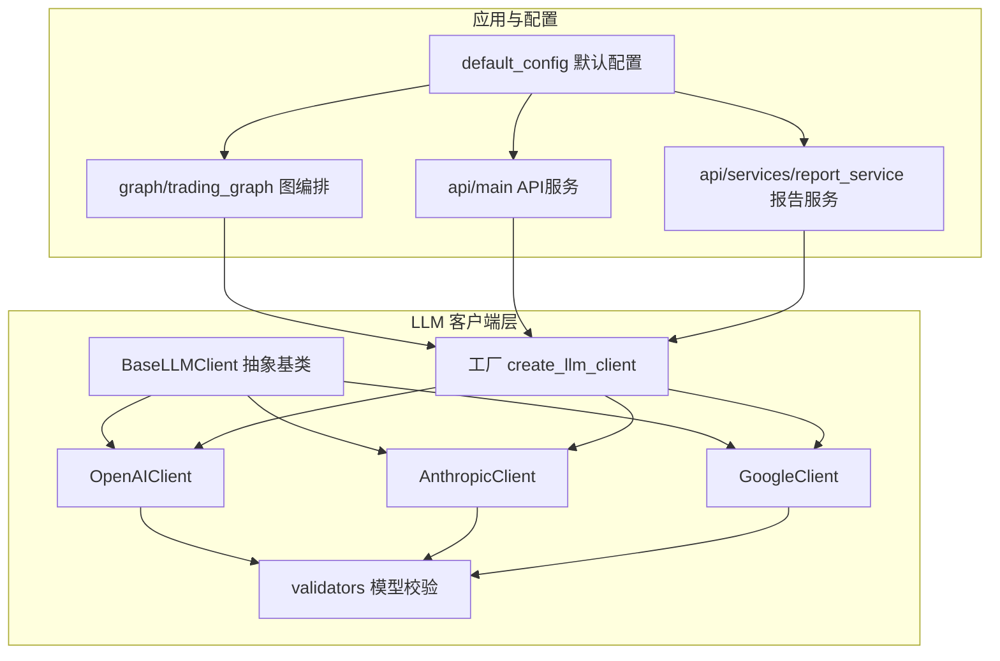
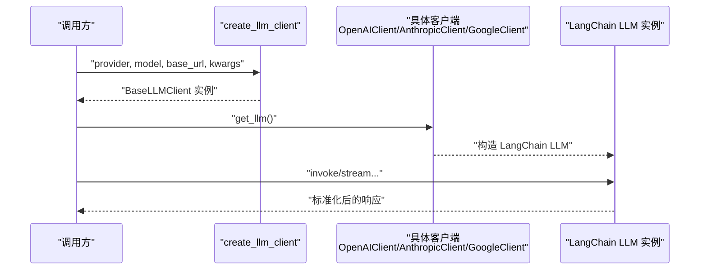
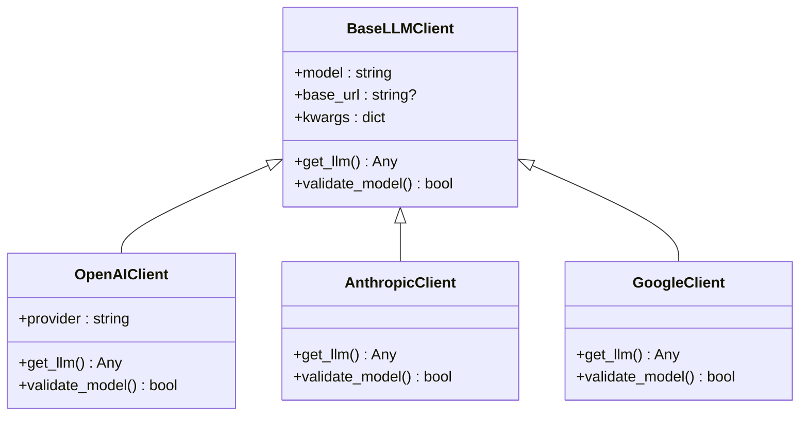
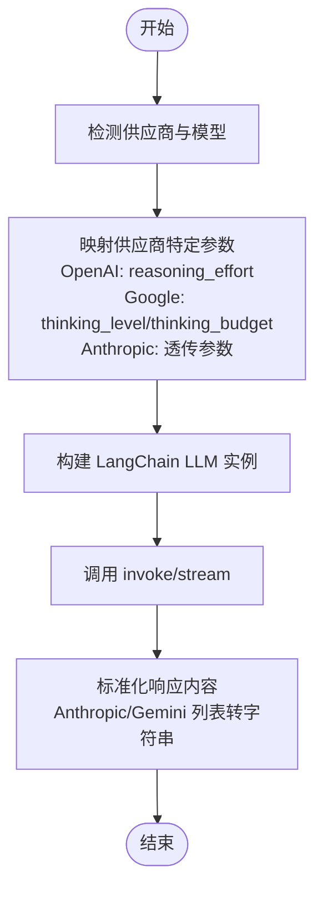

# 多供应商支持

<cite>
**本文引用的文件**
- [tradingagents/llm_clients/base_client.py](file://tradingagents/llm_clients/base_client.py)
- [tradingagents/llm_clients/factory.py](file://tradingagents/llm_clients/factory.py)
- [tradingagents/llm_clients/openai_client.py](file://tradingagents/llm_clients/openai_client.py)
- [tradingagents/llm_clients/anthropic_client.py](file://tradingagents/llm_clients/anthropic_client.py)
- [tradingagents/llm_clients/google_client.py](file://tradingagents/llm_clients/google_client.py)
- [tradingagents/llm_clients/validators.py](file://tradingagents/llm_clients/validators.py)
- [tradingagents/llm_clients/__init__.py](file://tradingagents/llm_clients/__init__.py)
- [tradingagents/default_config.py](file://tradingagents/default_config.py)
- [tradingagents/graph/trading_graph.py](file://tradingagents/graph/trading_graph.py)
- [api/main.py](file://api/main.py)
- [api/services/report_service.py](file://api/services/report_service.py)
- [tests/test_config_fallback.py](file://tests/test_config_fallback.py)
- [pyproject.toml](file://pyproject.toml)
</cite>

## 目录
1. [简介](#简介)
2. [项目结构](#项目结构)
3. [核心组件](#核心组件)
4. [架构总览](#架构总览)
5. [详细组件分析](#详细组件分析)
6. [依赖分析](#依赖分析)
7. [性能考虑](#性能考虑)
8. [故障排查指南](#故障排查指南)
9. [结论](#结论)
10. [附录](#附录)

## 简介
本文件面向“多供应商LLM支持系统”，系统通过统一工厂与抽象基类，实现对多家大模型供应商（OpenAI、Anthropic、Google Gemini 等）的统一接入与适配。重点涵盖：
- 认证机制与API端点映射
- 参数映射与响应格式标准化
- 错误码识别与提示
- 供应商切换与运行时配置探测
- 成本控制与性能权衡建议
- 新供应商接入流程与兼容性测试方法

## 项目结构
围绕LLM多供应商能力的核心代码位于 tradingagents/llm_clients 目录，配合默认配置与图编排模块共同工作。

图表来源
- [tradingagents/llm_clients/base_client.py:5-22](file://tradingagents/llm_clients/base_client.py#L5-L22)
- [tradingagents/llm_clients/factory.py:9-44](file://tradingagents/llm_clients/factory.py#L9-L44)
- [tradingagents/llm_clients/openai_client.py:69-126](file://tradingagents/llm_clients/openai_client.py#L69-L126)
- [tradingagents/llm_clients/anthropic_client.py:65-91](file://tradingagents/llm_clients/anthropic_client.py#L65-L91)
- [tradingagents/llm_clients/google_client.py:31-68](file://tradingagents/llm_clients/google_client.py#L31-L68)
- [tradingagents/llm_clients/validators.py:69-83](file://tradingagents/llm_clients/validators.py#L69-L83)
- [tradingagents/default_config.py:3-42](file://tradingagents/default_config.py#L3-L42)
- [tradingagents/graph/trading_graph.py:85-184](file://tradingagents/graph/trading_graph.py#L85-L184)
- [api/main.py:2990-3000](file://api/main.py#L2990-L3000)
- [api/services/report_service.py:110-131](file://api/services/report_service.py#L110-L131)

章节来源
- [tradingagents/llm_clients/__init__.py:1-5](file://tradingagents/llm_clients/__init__.py#L1-L5)
- [tradingagents/default_config.py:3-42](file://tradingagents/default_config.py#L3-L42)

## 核心组件
- 抽象基类 BaseLLMClient：定义统一接口，约束子类必须实现 get_llm 与 validate_model。
- 工厂 create_llm_client：按供应商字符串创建对应客户端实例，支持 openai、xai、openrouter、ollama、anthropic、google。
- 各供应商客户端：
  - OpenAIClient：封装 ChatOpenAI，统一参数、禁用重试、设置长超时；针对推理模型与 Moonshot/Kimi 做特殊处理；支持 xAI、OpenRouter、Ollama 端点。
  - AnthropicClient：封装 ChatAnthropic，标准化内容输出（将扩展思维模式的列表内容归一为字符串）。
  - GoogleClient：封装 ChatGoogleGenerativeAI，标准化内容输出；根据模型系列映射思考级别/预算参数。
- 模型校验器 validate_model：维护各供应商白名单，支持 ollama/openrouter 任意模型放行。
- 默认配置 default_config：集中管理供应商、模型、后端URL、API Key、思考参数等。

章节来源
- [tradingagents/llm_clients/base_client.py:5-22](file://tradingagents/llm_clients/base_client.py#L5-L22)
- [tradingagents/llm_clients/factory.py:9-44](file://tradingagents/llm_clients/factory.py#L9-L44)
- [tradingagents/llm_clients/openai_client.py:69-126](file://tradingagents/llm_clients/openai_client.py#L69-L126)
- [tradingagents/llm_clients/anthropic_client.py:65-91](file://tradingagents/llm_clients/anthropic_client.py#L65-L91)
- [tradingagents/llm_clients/google_client.py:31-68](file://tradingagents/llm_clients/google_client.py#L31-L68)
- [tradingagents/llm_clients/validators.py:69-83](file://tradingagents/llm_clients/validators.py#L69-L83)
- [tradingagents/default_config.py:3-42](file://tradingagents/default_config.py#L3-L42)

## 架构总览
系统通过工厂与抽象基类解耦具体供应商实现，统一对外暴露 get_llm 与 validate_model。运行时配置来自默认配置与API服务，图编排模块在初始化阶段创建深思与快思两个LLM实例，分别用于不同粒度的推理任务。

图表来源
- [tradingagents/llm_clients/factory.py:9-44](file://tradingagents/llm_clients/factory.py#L9-L44)
- [tradingagents/llm_clients/openai_client.py:82-122](file://tradingagents/llm_clients/openai_client.py#L82-L122)
- [tradingagents/llm_clients/anthropic_client.py:71-86](file://tradingagents/llm_clients/anthropic_client.py#L71-L86)
- [tradingagents/llm_clients/google_client.py:37-63](file://tradingagents/llm_clients/google_client.py#L37-L63)

## 详细组件分析

### 抽象基类与工厂
- BaseLLMClient：统一模型名、基础URL与额外参数；强制子类实现 get_llm 与 validate_model。
- 工厂 create_llm_client：根据 provider 字符串映射到具体客户端；支持 openai/xai/openrouter/ollama/anthropic/google；不支持的供应商抛出异常。

图表来源
- [tradingagents/llm_clients/base_client.py:5-22](file://tradingagents/llm_clients/base_client.py#L5-L22)
- [tradingagents/llm_clients/openai_client.py:69-126](file://tradingagents/llm_clients/openai_client.py#L69-L126)
- [tradingagents/llm_clients/anthropic_client.py:65-91](file://tradingagents/llm_clients/anthropic_client.py#L65-L91)
- [tradingagents/llm_clients/google_client.py:31-68](file://tradingagents/llm_clients/google_client.py#L31-L68)

章节来源
- [tradingagents/llm_clients/base_client.py:5-22](file://tradingagents/llm_clients/base_client.py#L5-L22)
- [tradingagents/llm_clients/factory.py:9-44](file://tradingagents/llm_clients/factory.py#L9-L44)

### OpenAI/第三方兼容客户端（OpenAI、xAI、OpenRouter、Ollama）
- 统一参数策略
  - 温度仅在非推理模型时设置；推理模型自动移除温度与top_p。
  - 禁用重试（max_retries=0）以避免重复扣费与状态丢失。
  - 超时默认300秒，满足推理模型思考时间需求。
  - 支持通过 base_url 自定义端点；内置 xAI、OpenRouter、Ollama 的默认端点。
- 认证机制
  - 优先使用环境变量注入的API Key；若未显式传入，则从环境读取。
- 特殊模型适配
  - Moonshot/Kimi：强制温度=1。
  - 推理模型：移除温度与top_p。
- 日志与调试
  - LOG_LEVEL=DEBUG 时启用 LangChain verbose，打印请求与响应摘要。

章节来源
- [tradingagents/llm_clients/openai_client.py:15-47](file://tradingagents/llm_clients/openai_client.py#L15-L47)
- [tradingagents/llm_clients/openai_client.py:72-122](file://tradingagents/llm_clients/openai_client.py#L72-L122)

### Anthropic 客户端
- 内容标准化
  - 扩展思维模式下返回内容为列表，客户端将其归一为字符串，便于下游一致处理。
- 端点与参数
  - 支持 base_url；自动去除末尾的 /v1。
  - 支持 timeout、max_retries、api_key、max_tokens、callbacks 等参数透传。
- 校验
  - 使用 validate_model("anthropic", model) 进行模型白名单校验。

章节来源
- [tradingagents/llm_clients/anthropic_client.py:34-63](file://tradingagents/llm_clients/anthropic_client.py#L34-L63)
- [tradingagents/llm_clients/anthropic_client.py:65-91](file://tradingagents/llm_clients/anthropic_client.py#L65-L91)

### Google Gemini 客户端
- 内容标准化
  - 将 Gemini 3 系列返回的列表内容合并为字符串，保持下游一致性。
- 思考参数映射
  - Gemini 3 系列：映射 thinking_level（Pro 不支持 minimal，自动降级为 low）。
  - Gemini 2.5 系列：映射 thinking_budget（high 映射为动态，其他为关闭）。
- 认证与参数
  - 支持 google_api_key 或 api_key（自动映射）；透传 timeout、max_retries、callbacks。
- 校验
  - 使用 validate_model("google", model) 进行模型白名单校验。

章节来源
- [tradingagents/llm_clients/google_client.py:9-26](file://tradingagents/llm_clients/google_client.py#L9-L26)
- [tradingagents/llm_clients/google_client.py:31-68](file://tradingagents/llm_clients/google_client.py#L31-L68)

### 模型校验与白名单
- 白名单维护在 validators.validate_model 中，覆盖 openai、anthropic、google、xai。
- 对于 ollama 与 openrouter，默认放行任意模型，提升灵活性。
- 客户端在初始化时调用 validate_model，确保模型名合法。

章节来源
- [tradingagents/llm_clients/validators.py:69-83](file://tradingagents/llm_clients/validators.py#L69-L83)

### 运行时配置与供应商切换
- 默认配置 default_config 提供：
  - llm_provider、quick_think_llm、deep_think_llm、backend_url、api_key
  - 供应商特定思考参数：google_thinking_level、openai_reasoning_effort
- 图编排 trading_graph 在初始化时：
  - 从配置读取供应商与模型；
  - 通过 _get_provider_kwargs 注入供应商特定参数（如 thinking_level、reasoning_effort、api_key）；
  - 创建深思与快思两个 LLM 实例。
- API 服务与报告服务通过 create_llm_client 动态创建客户端，实现运行时切换。

章节来源
- [tradingagents/default_config.py:3-42](file://tradingagents/default_config.py#L3-L42)
- [tradingagents/graph/trading_graph.py:85-107](file://tradingagents/graph/trading_graph.py#L85-L107)
- [tradingagents/graph/trading_graph.py:158-184](file://tradingagents/graph/trading_graph.py#L158-L184)
- [api/main.py:2990-3000](file://api/main.py#L2990-L3000)
- [api/services/report_service.py:110-131](file://api/services/report_service.py#L110-L131)

### 错误码识别与提示
- 配置探测与预热阶段：
  - 若上游返回 401 或包含无效认证相关关键字，API 会返回明确的 400 错误与提示，指导用户检查 API Key。
  - 其他异常统一包装为 400，附带简短错误摘要。
- 客户端层面：
  - OpenAI 客户端禁用重试，避免重复扣费与状态丢失；日志可辅助定位问题。

章节来源
- [api/main.py:3729-3757](file://api/main.py#L3729-L3757)
- [api/main.py:3781-3819](file://api/main.py#L3781-L3819)
- [tradingagents/llm_clients/openai_client.py:89-95](file://tradingagents/llm_clients/openai_client.py#L89-L95)

### 参数映射与响应格式标准化流程

图表来源
- [tradingagents/graph/trading_graph.py:158-184](file://tradingagents/graph/trading_graph.py#L158-L184)
- [tradingagents/llm_clients/google_client.py:47-62](file://tradingagents/llm_clients/google_client.py#L47-L62)
- [tradingagents/llm_clients/anthropic_client.py:34-63](file://tradingagents/llm_clients/anthropic_client.py#L34-L63)

## 依赖分析
- LangChain 生态依赖：langchain-openai、langchain-anthropic、langchain-google-genai。
- 项目通过 pyproject.toml 声明依赖，确保 LLM 客户端正常工作。
- 客户端之间无直接耦合，通过工厂与抽象基类解耦，具备良好扩展性。

章节来源
- [pyproject.toml:11-37](file://pyproject.toml#L11-L37)

## 性能考虑
- 超时与重试
  - OpenAI 客户端默认超时较长（300秒），推理模型禁用重试，避免重复扣费与状态丢失。
- 思考参数
  - Google 2.5 系列通过 thinking_budget 控制思考强度；Gemini 3 系列通过 thinking_level 控制。
  - OpenAI 通过 reasoning_effort 控制推理强度。
- 日志与可观测性
  - DEBUG 级别下启用 LangChain verbose，便于追踪请求与响应大小与内容摘要。

章节来源
- [tradingagents/llm_clients/openai_client.py:82-101](file://tradingagents/llm_clients/openai_client.py#L82-L101)
- [tradingagents/llm_clients/google_client.py:47-62](file://tradingagents/llm_clients/google_client.py#L47-L62)
- [tradingagents/graph/trading_graph.py:158-184](file://tradingagents/graph/trading_graph.py#L158-L184)

## 故障排查指南
- 认证失败（401）
  - 现象：API 返回 401 或包含无效认证关键字。
  - 处理：检查 TA_API_KEY 或供应商特定环境变量是否正确设置；确认 base_url 与模型名。
- 运行时配置探测失败
  - 现象：配置探测或预热阶段报错。
  - 处理：查看返回的错误摘要，确认网络可达性、API Key 有效性与模型可用性。
- 内容格式异常
  - 现象：下游解析失败或内容为空。
  - 处理：确认供应商是否启用扩展思维模式；客户端已做内容标准化，若仍异常需检查上游响应结构变化。
- 模型不可用
  - 现象：validate_model 返回 false。
  - 处理：更换为白名单内的模型，或在 ollama/openrouter 下可使用任意模型。

章节来源
- [api/main.py:3729-3757](file://api/main.py#L3729-L3757)
- [api/main.py:3781-3819](file://api/main.py#L3781-L3819)
- [tradingagents/llm_clients/validators.py:69-83](file://tradingagents/llm_clients/validators.py#L69-L83)

## 结论
该多供应商LLM支持系统通过抽象基类与工厂模式，实现了对 OpenAI、Anthropic、Google Gemini 等供应商的统一接入与适配。系统在参数映射、响应标准化、错误识别与运行时配置探测方面具备清晰策略，同时通过禁用重试与长超时保障稳定性。对于成本控制与性能优化，建议结合供应商的思考参数与超时策略进行精细化调优。

## 附录

### 新供应商接入指南
- 步骤
  - 在 tradingagents/llm_clients 下新增供应商客户端类，继承 BaseLLMClient，实现 get_llm 与 validate_model。
  - 在 factory.py 中增加供应商映射分支，返回新客户端实例。
  - 在 validators.py 中补充该供应商的模型白名单（如需）。
  - 在 default_config.py 中添加必要的配置项（如供应商特定思考参数）。
  - 在图编排与API服务中通过 create_llm_client 使用新客户端。
- 兼容性测试方法
  - 单元测试：验证 get_llm 构造成功、validate_model 行为、参数映射正确。
  - 集成测试：通过 API 服务的配置探测与预热流程，验证实际连通性与错误提示。
  - 回归测试：参考现有测试用例，确保不破坏既有功能。

章节来源
- [tradingagents/llm_clients/factory.py:9-44](file://tradingagents/llm_clients/factory.py#L9-L44)
- [tradingagents/llm_clients/validators.py:69-83](file://tradingagents/llm_clients/validators.py#L69-L83)
- [tradingagents/default_config.py:3-42](file://tradingagents/default_config.py#L3-L42)
- [tests/test_config_fallback.py:39-47](file://tests/test_config_fallback.py#L39-L47)