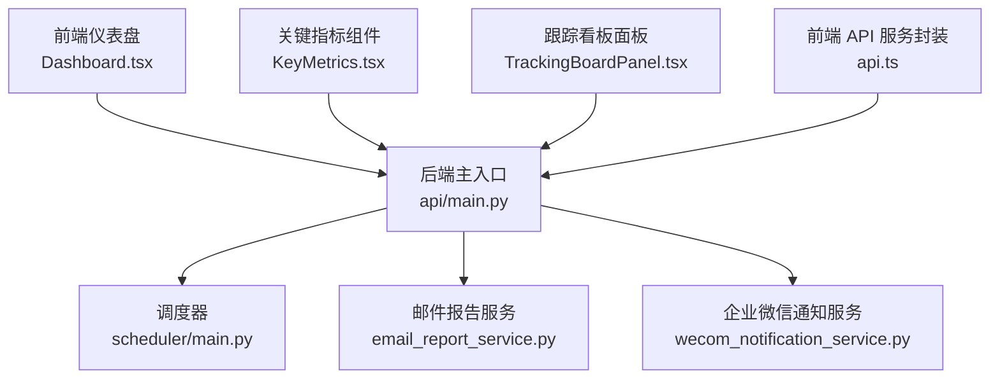
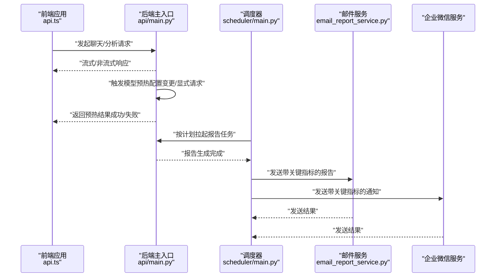
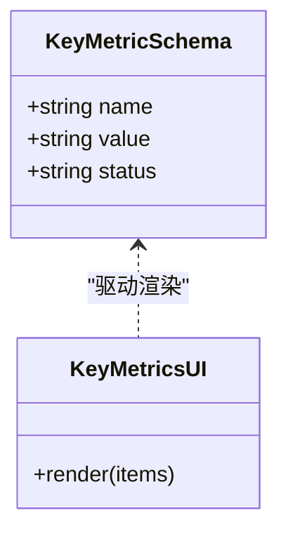
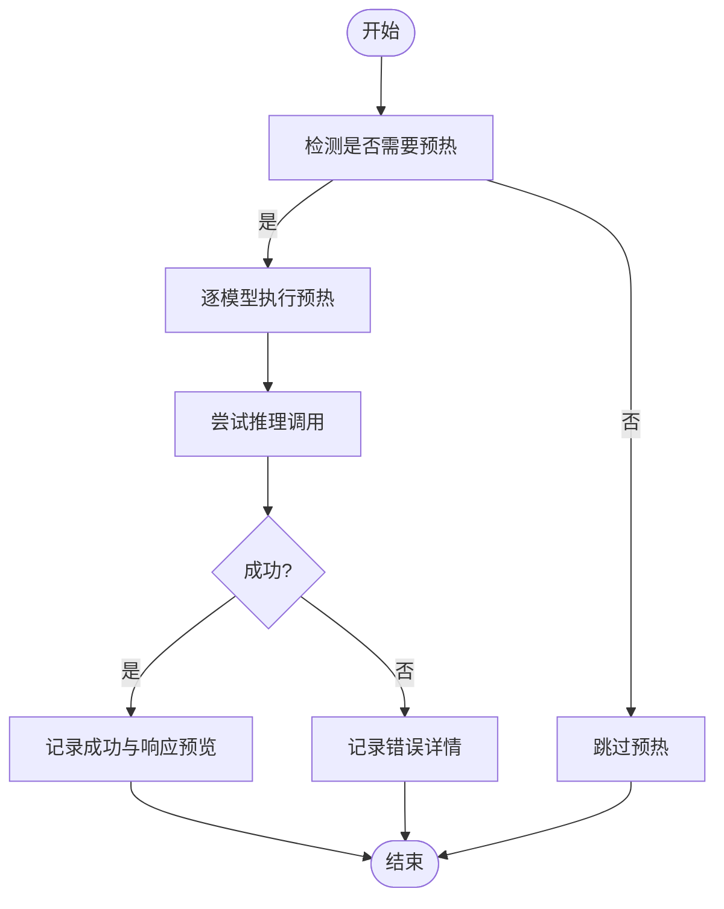
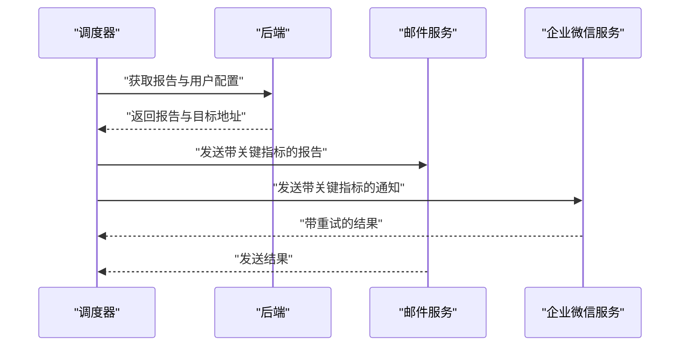
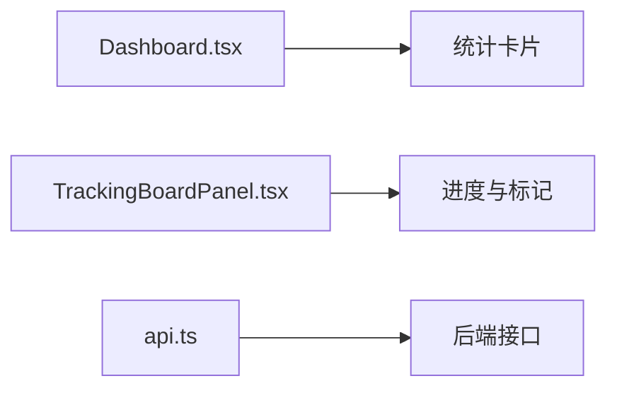
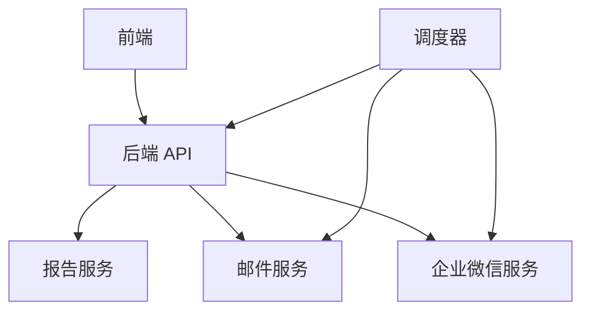

# 性能监控

<cite>
**本文引用的文件**
- [api/main.py](file://api/main.py)
- [api/services/report_service.py](file://api/services/report_service.py)
- [frontend/src/components/KeyMetrics.tsx](file://frontend/src/components/KeyMetrics.tsx)
- [frontend/src/components/TrackingBoardPanel.tsx](file://frontend/src/components/TrackingBoardPanel.tsx)
- [frontend/src/pages/Dashboard.tsx](file://frontend/src/pages/Dashboard.tsx)
- [frontend/src/services/api.ts](file://frontend/src/services/api.ts)
- [scheduler/main.py](file://scheduler/main.py)
- [tests/test_api_smoke.py](file://tests/test_api_smoke.py)
- [tests/test_wecom_notification_service.py](file://tests/test_wecom_notification_service.py)
- [api/services/email_report_service.py](file://api/services/email_report_service.py)
</cite>

## 目录
1. [引言](#引言)
2. [项目结构](#项目结构)
3. [核心组件](#核心组件)
4. [架构总览](#架构总览)
5. [详细组件分析](#详细组件分析)
6. [依赖关系分析](#依赖关系分析)
7. [性能考量](#性能考量)
8. [故障排查指南](#故障排查指南)
9. [结论](#结论)
10. [附录](#附录)

## 引言
本技术文档聚焦于本项目的 LLM 性能监控体系，围绕以下主题展开：调用延迟测量、吞吐量统计、资源使用监控；错误率跟踪、成功率计算与 SLA 监控；成本分析、API 费用统计与预算控制；缓存命中率、预热策略与性能优化建议；监控指标采集、告警配置与日志记录；以及性能调优指南与瓶颈分析方法。本文在不直接粘贴代码的前提下，通过源码路径定位与图示化说明，帮助读者快速理解系统如何在前端、后端与调度层协同实现端到端的性能可观测性。

## 项目结构
本项目采用前后端分离架构，LLM 性能监控涉及如下关键模块：
- 后端 API 层：负责 LLM 预热、配置变更触发、报告生成与通知分发等。
- 前端展示层：以关键指标卡片、仪表盘与跟踪看板等形式呈现性能与业务指标。
- 调度层：按计划周期发送报告与通知，支撑 SLA 与可用性监控。
- 测试层：覆盖预热、通知重试与配置变更等场景，保障监控链路的稳定性。

图表来源
- [frontend/src/pages/Dashboard.tsx:72-106](file://frontend/src/pages/Dashboard.tsx#L72-L106)
- [frontend/src/components/KeyMetrics.tsx:10-44](file://frontend/src/components/KeyMetrics.tsx#L10-L44)
- [frontend/src/components/TrackingBoardPanel.tsx:968-985](file://frontend/src/components/TrackingBoardPanel.tsx#L968-L985)
- [frontend/src/services/api.ts:128-167](file://frontend/src/services/api.ts#L128-L167)
- [api/main.py:3937-3970](file://api/main.py#L3937-L3970)
- [scheduler/main.py:127-155](file://scheduler/main.py#L127-L155)
- [api/services/email_report_service.py:303-325](file://api/services/email_report_service.py#L303-L325)

章节来源
- [frontend/src/pages/Dashboard.tsx:72-106](file://frontend/src/pages/Dashboard.tsx#L72-L106)
- [frontend/src/components/KeyMetrics.tsx:10-44](file://frontend/src/components/KeyMetrics.tsx#L10-L44)
- [frontend/src/components/TrackingBoardPanel.tsx:968-985](file://frontend/src/components/TrackingBoardPanel.tsx#L968-L985)
- [frontend/src/services/api.ts:128-167](file://frontend/src/services/api.ts#L128-L167)
- [api/main.py:3937-3970](file://api/main.py#L3937-L3970)
- [scheduler/main.py:127-155](file://scheduler/main.py#L127-L155)
- [api/services/email_report_service.py:303-325](file://api/services/email_report_service.py#L303-L325)

## 核心组件
- 关键指标模型与渲染
  - 后端定义了关键指标的数据模型，确保指标名称、数值与状态的规范化与校验。
  - 前端以卡片形式渲染关键指标，并根据状态选择颜色，便于快速识别健康状况。
- LLM 预热与配置变更
  - 当用户配置发生变更或显式请求时，后端会触发模型预热流程，记录成功/失败结果与简要响应预览，用于验证推理链路可用性。
- 报告与通知
  - 报告生成完成后，系统支持邮件与企业微信通知，邮件模板中包含关键指标表格，便于跨渠道统一展示。
- 调度与 SLA
  - 调度器按计划周期拉起报告任务并发送通知，形成可追踪的执行轨迹，支撑 SLA 达成度评估。

章节来源
- [api/services/report_service.py:61-77](file://api/services/report_service.py#L61-L77)
- [frontend/src/components/KeyMetrics.tsx:10-44](file://frontend/src/components/KeyMetrics.tsx#L10-L44)
- [api/main.py:3781-3819](file://api/main.py#L3781-L3819)
- [api/services/email_report_service.py:303-325](file://api/services/email_report_service.py#L303-L325)
- [scheduler/main.py:127-155](file://scheduler/main.py#L127-L155)

## 架构总览
下图展示了从前端交互到后端处理、再到调度与通知的整体流程，以及关键性能观测点的落位。

图表来源
- [frontend/src/services/api.ts:128-167](file://frontend/src/services/api.ts#L128-L167)
- [api/main.py:3781-3819](file://api/main.py#L3781-L3819)
- [scheduler/main.py:127-155](file://scheduler/main.py#L127-L155)
- [api/services/email_report_service.py:303-325](file://api/services/email_report_service.py#L303-L325)

## 详细组件分析

### 组件一：关键指标模型与前端渲染
- 模型设计要点
  - 指标名称、数值与状态字段均进行类型与取值范围校验，保证数据一致性。
  - 数值强制转为字符串，避免 LLM 输出差异导致的序列化问题。
- 前端展示要点
  - 使用状态色区分“良好/中性/不佳”，提升可读性。
  - 在无指标时提供占位提示，改善用户体验。

图表来源
- [api/services/report_service.py:61-77](file://api/services/report_service.py#L61-L77)
- [frontend/src/components/KeyMetrics.tsx:10-44](file://frontend/src/components/KeyMetrics.tsx#L10-L44)

章节来源
- [api/services/report_service.py:61-77](file://api/services/report_service.py#L61-L77)
- [frontend/src/components/KeyMetrics.tsx:10-44](file://frontend/src/components/KeyMetrics.tsx#L10-L44)

### 组件二：LLM 预热与性能验证
- 触发条件
  - 配置变更且需要预热时，后端在保存配置后异步触发预热任务。
  - 用户显式请求预热时，后端记录请求与触发状态，并返回简要反馈。
- 执行流程
  - 逐模型构造 LLM 客户端并执行一次推理，记录响应内容预览与异常信息。
  - 成功/失败分别体现在返回列表与错误列表中，便于后续统计与告警。
- 性能观测点
  - 预热耗时可用于评估模型加载与推理链路健康度。
  - 失败项可作为错误率与可用性监控的基础数据源。

图表来源
- [api/main.py:3937-3970](file://api/main.py#L3937-L3970)
- [api/main.py:3781-3819](file://api/main.py#L3781-L3819)

章节来源
- [api/main.py:3937-3970](file://api/main.py#L3937-L3970)
- [api/main.py:3781-3819](file://api/main.py#L3781-L3819)

### 组件三：报告生成与通知（含关键指标）
- 报告关键指标渲染
  - 邮件模板中包含关键指标表格，状态以标签与图标表示，便于阅读。
- 通知链路
  - 调度器按计划拉起报告任务，随后分别向邮件与企业微信发送带关键指标的消息。
  - 企业微信通知支持重试逻辑，提升 SLA 达成度。

图表来源
- [api/services/email_report_service.py:303-325](file://api/services/email_report_service.py#L303-L325)
- [scheduler/main.py:127-155](file://scheduler/main.py#L127-L155)
- [tests/test_wecom_notification_service.py:115-132](file://tests/test_wecom_notification_service.py#L115-L132)

章节来源
- [api/services/email_report_service.py:303-325](file://api/services/email_report_service.py#L303-L325)
- [scheduler/main.py:127-155](file://scheduler/main.py#L127-L155)
- [tests/test_wecom_notification_service.py:115-132](file://tests/test_wecom_notification_service.py#L115-L132)

### 组件四：前端交互与进度可视化
- 仪表盘与跟踪看板
  - 仪表盘展示系统状态、分析任务与报告总量等宏观指标。
  - 跟踪看板以进度条与标记点展示关键指标与范围警示，辅助实时监控。
- API 封装
  - 前端通过统一的 API 封装发起聊天/分析请求，便于在上层增加超时、重试与埋点。

图表来源
- [frontend/src/pages/Dashboard.tsx:72-106](file://frontend/src/pages/Dashboard.tsx#L72-L106)
- [frontend/src/components/TrackingBoardPanel.tsx:968-985](file://frontend/src/components/TrackingBoardPanel.tsx#L968-L985)
- [frontend/src/services/api.ts:128-167](file://frontend/src/services/api.ts#L128-L167)

章节来源
- [frontend/src/pages/Dashboard.tsx:72-106](file://frontend/src/pages/Dashboard.tsx#L72-L106)
- [frontend/src/components/TrackingBoardPanel.tsx:968-985](file://frontend/src/components/TrackingBoardPanel.tsx#L968-L985)
- [frontend/src/services/api.ts:128-167](file://frontend/src/services/api.ts#L128-L167)

## 依赖关系分析
- 组件耦合
  - 前端通过 API 封装与后端解耦，便于独立演进。
  - 报告服务与通知服务由调度器统一编排，形成清晰的职责边界。
- 外部依赖
  - 企业微信通知具备重试机制，降低网络抖动对 SLA 的影响。
  - 预热流程对 LLM 提供商的 SDK 与网络环境敏感，需纳入可用性监控。

图表来源
- [frontend/src/services/api.ts:128-167](file://frontend/src/services/api.ts#L128-L167)
- [api/main.py:3937-3970](file://api/main.py#L3937-L3970)
- [scheduler/main.py:127-155](file://scheduler/main.py#L127-L155)
- [api/services/email_report_service.py:303-325](file://api/services/email_report_service.py#L303-L325)

章节来源
- [frontend/src/services/api.ts:128-167](file://frontend/src/services/api.ts#L128-L167)
- [api/main.py:3937-3970](file://api/main.py#L3937-L3970)
- [scheduler/main.py:127-155](file://scheduler/main.py#L127-L155)
- [api/services/email_report_service.py:303-325](file://api/services/email_report_service.py#L303-L325)

## 性能考量
- 调用延迟测量
  - 建议在前端 API 封装与后端路由中埋点，记录请求进入与响应返回时间戳，计算端到端延迟分布。
  - 对长文本/多轮对话场景，区分首字节延迟与整体响应时间，便于定位瓶颈。
- 吞吐量统计
  - 以每分钟请求数（QPM）、每小时请求量（RPH）与并发连接数为指标，结合预热与限流策略动态调整。
- 资源使用监控
  - 结合容器/进程级 CPU、内存与网络 I/O 指标，配合预热后的稳定期数据，建立基线与阈值。
- 错误率与成功率
  - 将预热失败、推理异常与通知失败纳入错误统计；计算成功率 = 1 - 错误率，设定 SLA 目标。
- 成本分析与预算控制
  - 以模型单价、上下文长度与输出长度估算单次调用成本；汇总日/周/月成本，设置预算告警阈值。
- 缓存与预热
  - 利用预热减少冷启动延迟；对热点模型与常用提示词建立本地缓存，结合命中率与延迟指标持续优化。
- 监控与告警
  - 关键指标包括：延迟 P95/P99、错误率、成功率、吞吐量、成本占比、缓存命中率、预热成功率。
  - 告警策略建议采用分层阈值与滑动窗口，避免瞬时波动引发误报。

## 故障排查指南
- 预热失败排查
  - 查看预热返回列表中的错误详情，确认提供商密钥、URL 与超时配置是否正确。
  - 对比成功与失败模型的响应预览，定位特定模型或供应商的问题。
- 通知失败排查
  - 企业微信通知具备重试逻辑，若仍失败，检查 Webhook 地址有效性与网络连通性。
  - 对无效 URL 的输入进行拦截与提示，避免无效请求消耗资源。
- 配置变更验证
  - 配置更新后应触发预热并观察返回状态；若未触发，检查变更判定逻辑与后台任务队列。

章节来源
- [api/main.py:3781-3819](file://api/main.py#L3781-L3819)
- [tests/test_api_smoke.py:441-496](file://tests/test_api_smoke.py#L441-L496)
- [tests/test_wecom_notification_service.py:115-132](file://tests/test_wecom_notification_service.py#L115-L132)

## 结论
本项目在前端展示、后端处理与调度通知三个层面构建了完整的性能监控闭环：通过关键指标模型与可视化组件直观呈现健康状态；借助预热与通知重试保障 SLA；结合测试用例验证链路稳定性。建议在此基础上进一步完善端到端延迟与成本埋点、建立缓存命中率与资源使用基线，并通过分层告警与趋势分析实现主动运维。

## 附录
- 术语说明
  - 预热：在配置变更或启动阶段提前初始化模型，降低首次调用延迟。
  - SLA：服务等级协议，通常以成功率、延迟与可用性为目标。
  - 成本估算：基于模型单价、上下文与输出长度的近似计算。
- 参考实现位置
  - 关键指标模型与渲染：[api/services/report_service.py:61-77](file://api/services/report_service.py#L61-L77)、[frontend/src/components/KeyMetrics.tsx:10-44](file://frontend/src/components/KeyMetrics.tsx#L10-L44)
  - 预热流程与触发逻辑：[api/main.py:3781-3819](file://api/main.py#L3781-L3819)、[api/main.py:3937-3970](file://api/main.py#L3937-L3970)
  - 报告与通知（含关键指标）：[api/services/email_report_service.py:303-325](file://api/services/email_report_service.py#L303-L325)、[scheduler/main.py:127-155](file://scheduler/main.py#L127-L155)
  - 前端交互与进度可视化：[frontend/src/pages/Dashboard.tsx:72-106](file://frontend/src/pages/Dashboard.tsx#L72-L106)、[frontend/src/components/TrackingBoardPanel.tsx:968-985](file://frontend/src/components/TrackingBoardPanel.tsx#L968-L985)、[frontend/src/services/api.ts:128-167](file://frontend/src/services/api.ts#L128-L167)
  - 通知重试与配置变更测试：[tests/test_wecom_notification_service.py:115-132](file://tests/test_wecom_notification_service.py#L115-L132)、[tests/test_api_smoke.py:441-496](file://tests/test_api_smoke.py#L441-L496)