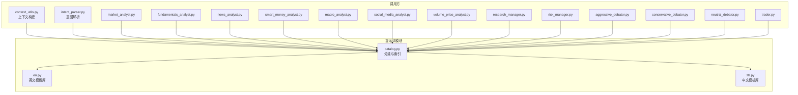
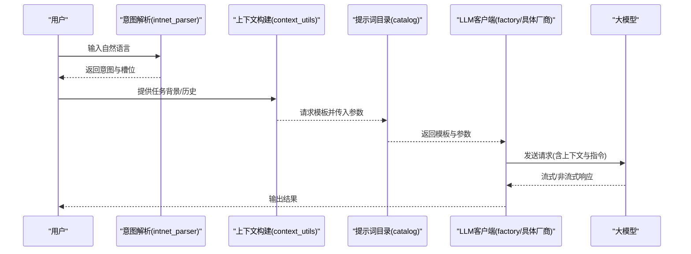
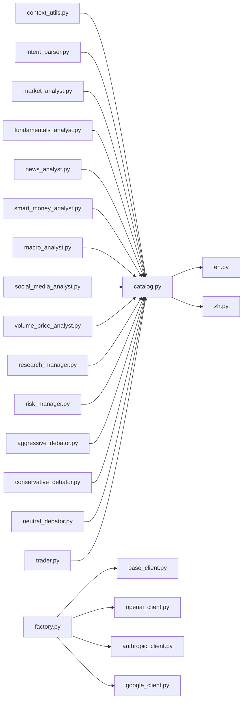

# 提示词工程

<cite>
**本文引用的文件**
- [catalog.py](file://tradingagents/prompts/catalog.py)
- [en.py](file://tradingagents/prompts/en.py)
- [zh.py](file://tradingagents/prompts/zh.py)
- [context_utils.py](file://tradingagents/agents/utils/context_utils.py)
- [intent_parser.py](file://tradingagents/graph/intent_parser.py)
- [base_client.py](file://tradingagents/llm_clients/base_client.py)
- [openai_client.py](file://tradingagents/llm_clients/openai_client.py)
- [anthropic_client.py](file://tradingagents/llm_clients/anthropic_client.py)
- [google_client.py](file://tradingagents/llm_clients/google_client.py)
- [factory.py](file://tradingagents/llm_clients/factory.py)
- [market_analyst.py](file://tradingagents/agents/analysts/market_analyst.py)
- [fundamentals_analyst.py](file://tradingagents/agents/analysts/fundamentals_analyst.py)
- [news_analyst.py](file://tradingagents/agents/analysts/news_analyst.py)
- [smart_money_analyst.py](file://tradingagents/agents/analysts/smart_money_analyst.py)
- [macro_analyst.py](file://tradingagents/agents/analysts/macro_analyst.py)
- [social_media_analyst.py](file://tradingagents/agents/analysts/social_media_analyst.py)
- [volume_price_analyst.py](file://tradingagents/agents/analysts/volume_price_analyst.py)
- [research_manager.py](file://tradingagents/agents/managers/research_manager.py)
- [risk_manager.py](file://tradingagents/agents/managers/risk_manager.py)
- [aggressive_debator.py](file://tradingagents/agents/risk_mgmt/aggressive_debator.py)
- [conservative_debator.py](file://tradingagents/agents/risk_mgmt/conservative_debator.py)
- [neutral_debator.py](file://tradingagents/agents/risk_mgmt/neutral_debator.py)
- [trader.py](file://tradingagents/agents/trader/trader.py)
- [default_config.py](file://tradingagents/default_config.py)
</cite>

## 目录
1. [引言](#引言)
2. [项目结构](#项目结构)
3. [核心组件](#核心组件)
4. [架构总览](#架构总览)
5. [详细组件分析](#详细组件分析)
6. [依赖关系分析](#依赖关系分析)
7. [性能考量](#性能考量)
8. [故障排查指南](#故障排查指南)
9. [结论](#结论)
10. [附录](#附录)

## 引言
本技术文档面向“提示词工程”子系统，聚焦于提示词模板设计、参数化与本地化策略，以及在多语言（英文与中文）场景下的文化适配与表达优化。文档还涵盖提示词分类体系、版本管理与迭代机制、上下文构建与角色设定、指令优化技巧，并给出效果评估、A/B测试与性能监控的方法论与实操建议。最后提供最佳实践与调试技巧，帮助读者在该系统中高效地设计、部署与演进提示词。

## 项目结构
提示词工程相关代码主要集中在 tradingagents/prompts 目录及其下游调用点。整体组织采用“按语言分包 + 模板目录 + 调用入口”的模式，便于实现多语言本地化与统一管理。

图表来源
- [catalog.py](file://tradingagents/prompts/catalog.py)
- [en.py](file://tradingagents/prompts/en.py)
- [zh.py](file://tradingagents/prompts/zh.py)
- [context_utils.py](file://tradingagents/agents/utils/context_utils.py)
- [intent_parser.py](file://tradingagents/graph/intent_parser.py)
- [market_analyst.py](file://tradingagents/agents/analysts/market_analyst.py)
- [fundamentals_analyst.py](file://tradingagents/agents/analysts/fundamentals_analyst.py)
- [news_analyst.py](file://tradingagents/agents/analysts/news_analyst.py)
- [smart_money_analyst.py](file://tradingagents/agents/analysts/smart_money_analyst.py)
- [macro_analyst.py](file://tradingagents/agents/analysts/macro_analyst.py)
- [social_media_analyst.py](file://tradingagents/agents/analysts/social_media_analyst.py)
- [volume_price_analyst.py](file://tradingagents/agents/analysts/volume_price_analyst.py)
- [research_manager.py](file://tradingagents/agents/managers/research_manager.py)
- [risk_manager.py](file://tradingagents/agents/managers/risk_manager.py)
- [aggressive_debator.py](file://tradingagents/agents/risk_mgmt/aggressive_debator.py)
- [conservative_debator.py](file://tradingagents/agents/risk_mgmt/conservative_debator.py)
- [neutral_debator.py](file://tradingagents/agents/risk_mgmt/neutral_debator.py)
- [trader.py](file://tradingagents/agents/trader/trader.py)

章节来源
- [catalog.py](file://tradingagents/prompts/catalog.py)
- [en.py](file://tradingagents/prompts/en.py)
- [zh.py](file://tradingagents/prompts/zh.py)

## 核心组件
- 提示词目录与分类：通过 catalog.py 统一注册与索引各类提示词模板，支持按类别检索与版本选择。
- 多语言模板库：en.py 与 zh.py 分别维护英文与中文模板，体现语言风格、术语与文化适配差异。
- 上下文构建：context_utils.py 将市场数据、历史对话、任务目标等整合为可注入模板的变量集合。
- 意图解析：intent_parser.py 将用户输入映射到预定义意图，驱动后续模板选择与参数化。
- LLM 客户端：base_client 与具体厂商客户端（OpenAI、Anthropic、Google）负责执行与流式输出控制。
- 业务代理：各类分析师、管理者、风险辩手与交易员均以模板为输入，结合上下文生成响应。

章节来源
- [catalog.py](file://tradingagents/prompts/catalog.py)
- [en.py](file://tradingagents/prompts/en.py)
- [zh.py](file://tradingagents/prompts/zh.py)
- [context_utils.py](file://tradingagents/agents/utils/context_utils.py)
- [intent_parser.py](file://tradingagents/graph/intent_parser.py)
- [base_client.py](file://tradingagents/llm_clients/base_client.py)
- [openai_client.py](file://tradingagents/llm_clients/openai_client.py)
- [anthropic_client.py](file://tradingagents/llm_clients/anthropic_client.py)
- [google_client.py](file://tradingagents/llm_clients/google_client.py)
- [factory.py](file://tradingagents/llm_clients/factory.py)

## 架构总览
提示词工程贯穿“意图识别 → 上下文构建 → 模板选择与参数化 → LLM 推理 → 结果后处理”的闭环流程。系统通过工厂模式选择 LLM 客户端，确保不同供应商的统一接入；通过 catalog 管理模板，实现版本化与可追溯性。

图表来源
- [intent_parser.py](file://tradingagents/graph/intent_parser.py)
- [context_utils.py](file://tradingagents/agents/utils/context_utils.py)
- [catalog.py](file://tradingagents/prompts/catalog.py)
- [factory.py](file://tradingagents/llm_clients/factory.py)
- [openai_client.py](file://tradingagents/llm_clients/openai_client.py)
- [anthropic_client.py](file://tradingagents/llm_clients/anthropic_client.py)
- [google_client.py](file://tradingagents/llm_clients/google_client.py)

## 详细组件分析

### 提示词模板设计与参数化
- 设计原则
  - 明确角色与边界：每个模板限定角色职责与输出格式，避免歧义。
  - 参数化优先：将可变信息（如时间范围、指标名称、市场状态）以占位符形式注入，减少硬编码。
  - 可验证性：输出结构化或可解析片段，便于后续处理与评估。
- 参数化策略
  - 使用上下文构建模块将动态数据注入模板，保证每次推理的时效性与准确性。
  - 对关键参数进行类型校验与默认值兜底，降低异常传播风险。
- 本地化策略
  - 英文模板强调简洁、直接、技术术语标准化；中文模板注重语境连贯与表达自然度，兼顾金融术语的本土化。
  - 针对文化差异，调整语气、举例与表达节奏，使提示更贴合目标用户的理解习惯。

章节来源
- [context_utils.py](file://tradingagents/agents/utils/context_utils.py)
- [en.py](file://tradingagents/prompts/en.py)
- [zh.py](file://tradingagents/prompts/zh.py)

### 提示词分类体系、版本管理与迭代机制
- 分类体系
  - 基于用途与复杂度划分：如“市场分析”“基本面分析”“新闻解读”“资金流向”“宏观展望”“社交媒体情绪”“交易决策”等。
  - 按角色划分：分析师、研究经理、风险经理、辩手、交易员等角色模板独立维护。
- 版本管理
  - catalog 中记录模板版本号、变更日志与兼容性说明，确保回滚与追踪能力。
  - 迭代机制
    - A/B 测试：对同一任务的不同模板进行对照实验，收集指标（如准确性、一致性、可解释性）。
    - 渐进发布：先小流量灰度，再逐步扩大，结合性能监控与用户反馈进行调整。
    - 回归测试：对关键路径模板建立自动化回归用例，防止回归问题。

章节来源
- [catalog.py](file://tradingagents/prompts/catalog.py)

### 上下文构建、角色设定与指令优化
- 上下文构建
  - 整合历史对话、实时行情、财务数据、新闻事件、技术指标等，形成多模态上下文。
  - 对长上下文进行截断与摘要，保留关键信息，平衡质量与成本。
- 角色设定
  - 明确角色权限与输出约束，避免越权或过度泛化。
  - 在模板中固化角色口吻与专业术语，提升一致性与可信度。
- 指令优化
  - 使用分步骤指令与思维链（Chain-of-Thought），引导模型逐步推理。
  - 控制指令长度与层级，避免冗余与冲突。

章节来源
- [context_utils.py](file://tradingagents/agents/utils/context_utils.py)
- [market_analyst.py](file://tradingagents/agents/analysts/market_analyst.py)
- [fundamentals_analyst.py](file://tradingagents/agents/analysts/fundamentals_analyst.py)
- [news_analyst.py](file://tradingagents/agents/analysts/news_analyst.py)
- [smart_money_analyst.py](file://tradingagents/agents/analysts/smart_money_analyst.py)
- [macro_analyst.py](file://tradingagents/agents/analysts/macro_analyst.py)
- [social_media_analyst.py](file://tradingagents/agents/analysts/social_media_analyst.py)
- [volume_price_analyst.py](file://tradingagents/agents/analysts/volume_price_analyst.py)
- [research_manager.py](file://tradingagents/agents/managers/research_manager.py)
- [risk_manager.py](file://tradingagents/agents/managers/risk_manager.py)
- [aggressive_debator.py](file://tradingagents/agents/risk_mgmt/aggressive_debator.py)
- [conservative_debator.py](file://tradingagents/agents/risk_mgmt/conservative_debator.py)
- [neutral_debator.py](file://tradingagents/agents/risk_mgmt/neutral_debator.py)
- [trader.py](file://tradingagents/agents/trader/trader.py)

### 英文与中文提示词的差异、文化适配与表达优化
- 差异维度
  - 语言结构：英文偏线性、直接；中文偏意合、含蓄。模板需在结构上做对应调整。
  - 术语差异：金融术语在中英文间存在翻译与理解偏差，需在模板中明确术语定义与边界。
  - 语气与礼貌：中文更强调关系与层级，英文更强调效率与客观性。
- 文化适配
  - 在中文模板中增加适度的引导与过渡语句，提升可读性与亲和力。
  - 在英文模板中强化逻辑连接与因果表述，增强可解释性。
- 表达优化
  - 使用短句与清晰的标点，减少歧义。
  - 在关键结论处加粗或分段，提升阅读效率。

章节来源
- [en.py](file://tradingagents/prompts/en.py)
- [zh.py](file://tradingagents/prompts/zh.py)

### 提示词效果评估、A/B测试与性能监控
- 评估指标
  - 准确性：与参考答案或专家标注的一致性。
  - 可解释性：输出是否具备清晰的推理链条与依据。
  - 一致性：相同输入在不同时间与环境下的一致性。
  - 成本与延迟：Token 消耗与响应时间。
- A/B 测试
  - 对比组：同一任务的两个模板版本，随机分配样本。
  - 指标采集：自动记录上述指标，进行统计显著性检验。
- 性能监控
  - 实时监控：跟踪错误率、超时率、Token 使用量与 P95 延迟。
  - 回放与复现：保存关键请求与响应，便于问题定位与回归验证。

章节来源
- [catalog.py](file://tradingagents/prompts/catalog.py)

### 最佳实践与调试技巧
- 最佳实践
  - 先写草稿模板，再逐步细化参数与边界条件。
  - 为每个模板编写单元测试与回归用例。
  - 保持模板最小可用原则，避免一次性引入过多复杂性。
  - 在上线前进行小规模 A/B 验证。
- 调试技巧
  - 使用最小上下文复现实验，逐步增加复杂度。
  - 利用流式输出观察中间阶段，定位问题环节。
  - 记录失败样例，形成问题库，指导后续优化。

章节来源
- [context_utils.py](file://tradingagents/agents/utils/context_utils.py)
- [base_client.py](file://tradingagents/llm_clients/base_client.py)

## 依赖关系分析
提示词工程与下游代理、意图解析与 LLM 客户端之间存在清晰的依赖关系。catalog 作为中心枢纽，向上游提供模板选择与参数化能力，向下游代理提供统一接口。

图表来源
- [catalog.py](file://tradingagents/prompts/catalog.py)
- [en.py](file://tradingagents/prompts/en.py)
- [zh.py](file://tradingagents/prompts/zh.py)
- [context_utils.py](file://tradingagents/agents/utils/context_utils.py)
- [intent_parser.py](file://tradingagents/graph/intent_parser.py)
- [market_analyst.py](file://tradingagents/agents/analysts/market_analyst.py)
- [fundamentals_analyst.py](file://tradingagents/agents/analysts/fundamentals_analyst.py)
- [news_analyst.py](file://tradingagents/agents/analysts/news_analyst.py)
- [smart_money_analyst.py](file://tradingagents/agents/analysts/smart_money_analyst.py)
- [macro_analyst.py](file://tradingagents/agents/analysts/macro_analyst.py)
- [social_media_analyst.py](file://tradingagents/agents/analysts/social_media_analyst.py)
- [volume_price_analyst.py](file://tradingagents/agents/analysts/volume_price_analyst.py)
- [research_manager.py](file://tradingagents/agents/managers/research_manager.py)
- [risk_manager.py](file://tradingagents/agents/managers/risk_manager.py)
- [aggressive_debator.py](file://tradingagents/agents/risk_mgmt/aggressive_debator.py)
- [conservative_debator.py](file://tradingagents/agents/risk_mgmt/conservative_debator.py)
- [neutral_debator.py](file://tradingagents/agents/risk_mgmt/neutral_debator.py)
- [trader.py](file://tradingagents/agents/trader/trader.py)
- [factory.py](file://tradingagents/llm_clients/factory.py)
- [base_client.py](file://tradingagents/llm_clients/base_client.py)
- [openai_client.py](file://tradingagents/llm_clients/openai_client.py)
- [anthropic_client.py](file://tradingagents/llm_clients/anthropic_client.py)
- [google_client.py](file://tradingagents/llm_clients/google_client.py)

章节来源
- [factory.py](file://tradingagents/llm_clients/factory.py)
- [base_client.py](file://tradingagents/llm_clients/base_client.py)
- [openai_client.py](file://tradingagents/llm_clients/openai_client.py)
- [anthropic_client.py](file://tradingagents/llm_clients/anthropic_client.py)
- [google_client.py](file://tradingagents/llm_clients/google_client.py)

## 性能考量
- Token 与成本控制
  - 合理裁剪上下文，避免冗余信息导致 Token 激增。
  - 对重复信息进行去重与压缩，提升性价比。
- 响应延迟优化
  - 使用流式输出与分段渲染，改善用户体验。
  - 对热点模板与高频任务进行缓存与预热。
- 可靠性保障
  - 设置合理的超时与重试策略，避免单点故障影响整体。
  - 对异常输出进行兜底处理，保证系统稳定。

## 故障排查指南
- 常见问题
  - 模板未命中：检查 catalog 中的分类与版本匹配，确认意图解析是否正确。
  - 上下文缺失：核对 context_utils 的参数注入逻辑，确保关键字段齐全。
  - LLM 返回异常：检查客户端配置与流式处理逻辑，定位网络或协议问题。
- 排查步骤
  - 从意图解析开始，逐层回溯到模板与上下文。
  - 使用最小样例快速复现，缩小问题范围。
  - 记录关键请求与响应，便于后续分析与回归验证。

章节来源
- [intent_parser.py](file://tradingagents/graph/intent_parser.py)
- [context_utils.py](file://tradingagents/agents/utils/context_utils.py)
- [base_client.py](file://tradingagents/llm_clients/base_client.py)

## 结论
提示词工程是该系统的核心“软硬件接口”。通过规范化的模板设计、参数化与本地化策略，结合完善的分类、版本管理与迭代机制，能够持续提升提示词的质量与稳定性。配合严格的评估、A/B 测试与性能监控，可实现从设计到上线的全生命周期闭环管理。建议在实际落地中坚持“小步快跑、快速迭代”的原则，持续优化提示词以适应不断变化的业务需求与用户期望。

## 附录
- 配置参考：default_config.py 中包含系统默认配置项，可用于模板与客户端行为的全局控制。
- 模板开发清单
  - 明确角色与边界
  - 设计参数化方案
  - 编写测试用例
  - 建立版本与变更记录
  - 进行 A/B 验证与监控

章节来源
- [default_config.py](file://tradingagents/default_config.py)