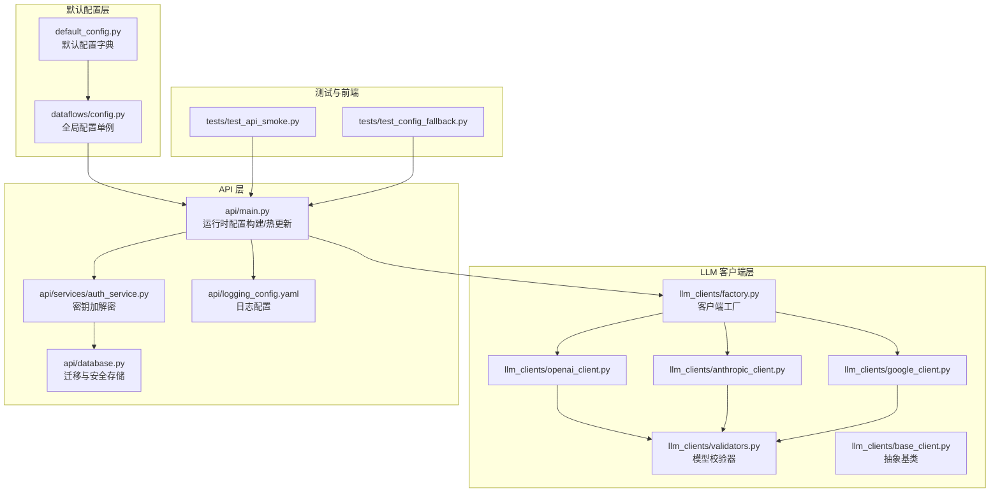
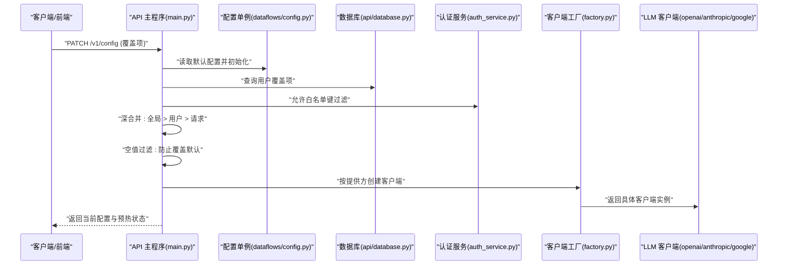
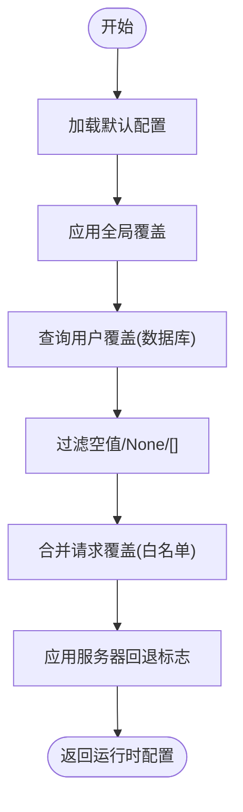
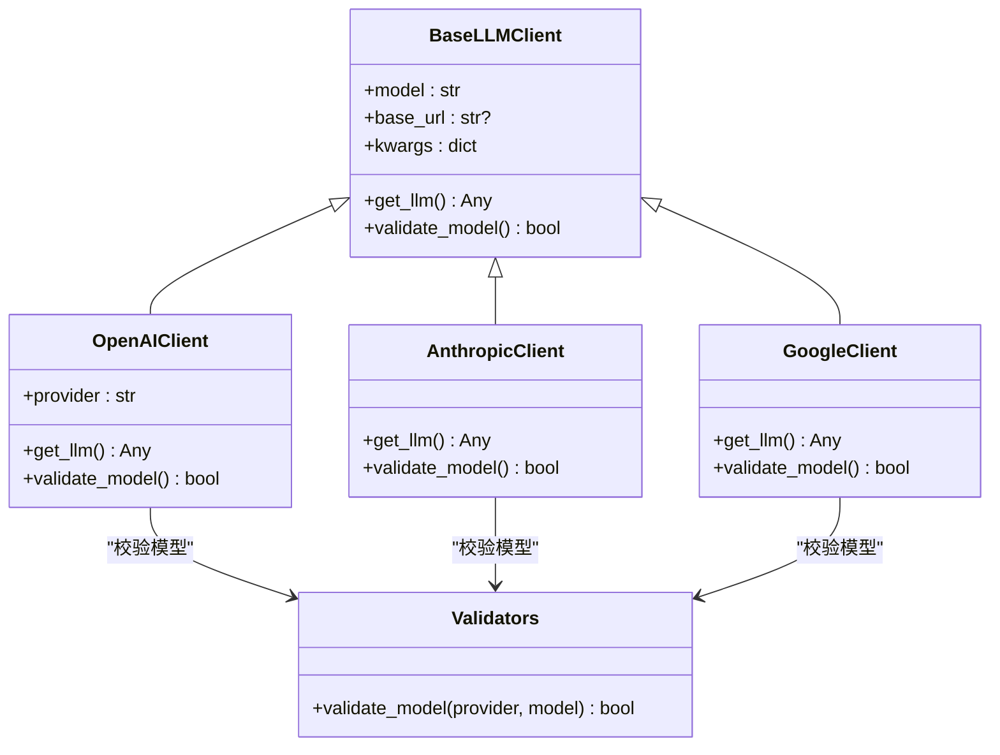
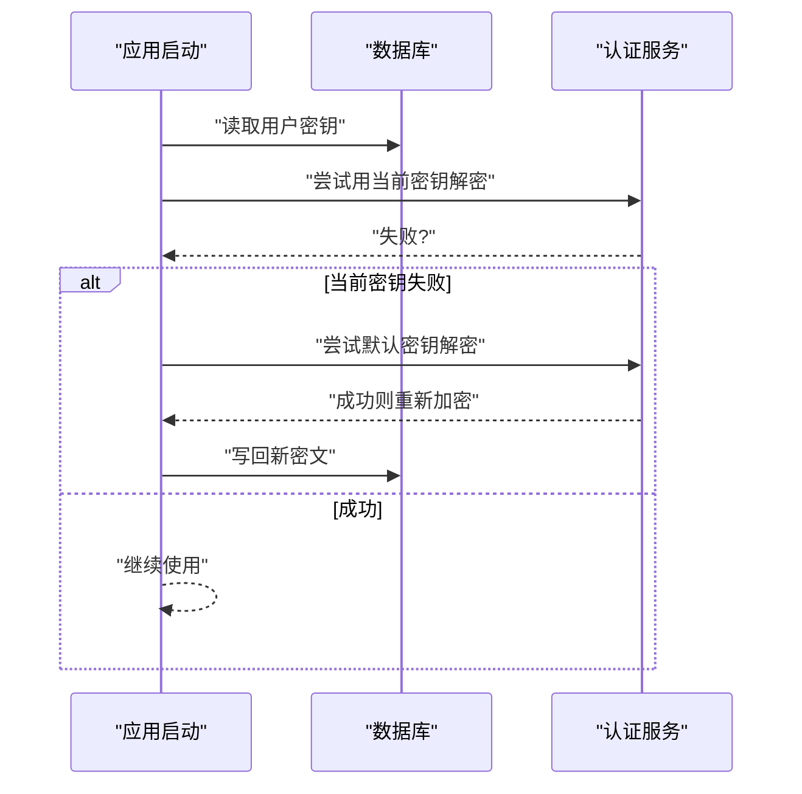
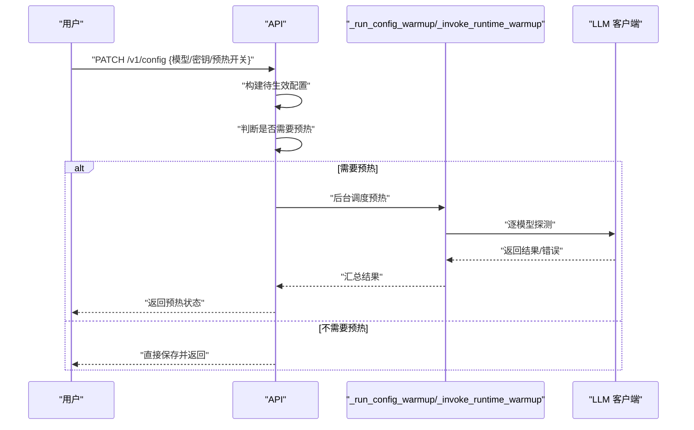
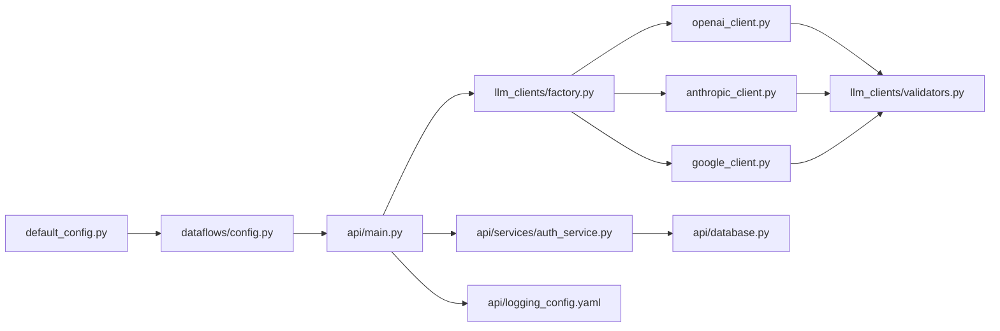

# 配置与验证

<cite>
**本文引用的文件**
- [default_config.py](file://tradingagents/default_config.py)
- [config.py](file://tradingagents/dataflows/config.py)
- [validators.py](file://tradingagents/llm_clients/validators.py)
- [factory.py](file://tradingagents/llm_clients/factory.py)
- [base_client.py](file://tradingagents/llm_clients/base_client.py)
- [openai_client.py](file://tradingagents/llm_clients/openai_client.py)
- [anthropic_client.py](file://tradingagents/llm_clients/anthropic_client.py)
- [google_client.py](file://tradingagents/llm_clients/google_client.py)
- [logging_config.yaml](file://api/logging_config.yaml)
- [auth_service.py](file://api/services/auth_service.py)
- [database.py](file://api/database.py)
- [main.py](file://api/main.py)
- [test_api_smoke.py](file://tests/test_api_smoke.py)
- [test_config_fallback.py](file://tests/test_config_fallback.py)
</cite>

## 目录
1. [引言](#引言)
2. [项目结构](#项目结构)
3. [核心组件](#核心组件)
4. [架构总览](#架构总览)
5. [详细组件分析](#详细组件分析)
6. [依赖分析](#依赖分析)
7. [性能考虑](#性能考虑)
8. [故障排查指南](#故障排查指南)
9. [结论](#结论)
10. [附录](#附录)

## 引言
本技术文档围绕 LLM 配置与验证系统，系统性阐述以下主题：
- 配置参数的默认值、环境变量处理与优先级
- 参数范围检查、类型验证与约束条件
- API 密钥管理、敏感信息加密与安全存储策略
- 配置热更新、动态调整与回滚机制
- 配置文件格式、YAML 解析与错误处理
- 最佳实践与常见问题排查

## 项目结构
本项目在后端通过“默认配置 + 运行时合并”的方式实现配置管理，并在 API 层提供运行时热更新能力；在前端提供可视化配置界面；在数据库中持久化用户偏好与敏感配置；在日志系统中提供结构化日志输出。

**图示来源**
- [default_config.py:1-43](file://tradingagents/default_config.py#L1-L43)
- [config.py:1-32](file://tradingagents/dataflows/config.py#L1-L32)
- [factory.py:1-44](file://tradingagents/llm_clients/factory.py#L1-L44)
- [validators.py:1-83](file://tradingagents/llm_clients/validators.py#L1-L83)
- [base_client.py:1-22](file://tradingagents/llm_clients/base_client.py#L1-L22)
- [openai_client.py:1-126](file://tradingagents/llm_clients/openai_client.py#L1-L126)
- [anthropic_client.py:1-91](file://tradingagents/llm_clients/anthropic_client.py#L1-L91)
- [google_client.py:1-68](file://tradingagents/llm_clients/google_client.py#L1-L68)
- [main.py:988-1017](file://api/main.py#L988-L1017)
- [auth_service.py:1-96](file://api/services/auth_service.py#L1-L96)
- [database.py:142-239](file://api/database.py#L142-L239)
- [logging_config.yaml:1-35](file://api/logging_config.yaml#L1-L35)
- [test_api_smoke.py:327-409](file://tests/test_api_smoke.py#L327-L409)
- [test_config_fallback.py:1-26](file://tests/test_config_fallback.py#L1-L26)

**章节来源**
- [default_config.py:1-43](file://tradingagents/default_config.py#L1-L43)
- [config.py:1-32](file://tradingagents/dataflows/config.py#L1-L32)
- [main.py:988-1017](file://api/main.py#L988-L1017)

## 核心组件
- 默认配置与环境变量
  - 默认配置集中于默认配置模块，使用环境变量进行覆盖，确保在不同部署环境下可灵活调整。
  - 关键键包括：提供方、模型名、后端地址、API 密钥、推理与思考参数、讨论轮次限制、语言控制、数据供应商等。
- 运行时配置构建
  - 通过全局配置单例与运行时合并，支持服务端全局覆盖、用户级覆盖与请求级覆盖，且对空值进行过滤以避免覆盖默认值。
- LLM 客户端与模型校验
  - 工厂根据提供方创建对应客户端；各客户端负责参数适配与模型校验；模型校验器维护各提供方有效模型清单。
- 安全与密钥管理
  - 使用对称加密（基于密钥派生）对敏感字段进行加密存储；支持密钥变更后的重新加密迁移；提供解密回退逻辑以兼容历史数据。
- 日志与可观测性
  - 提供 YAML 格式的日志配置，支持默认与访问日志格式化输出。

**章节来源**
- [default_config.py:1-43](file://tradingagents/default_config.py#L1-L43)
- [config.py:1-32](file://tradingagents/dataflows/config.py#L1-L32)
- [factory.py:1-44](file://tradingagents/llm_clients/factory.py#L1-L44)
- [validators.py:1-83](file://tradingagents/llm_clients/validators.py#L1-L83)
- [openai_client.py:1-126](file://tradingagents/llm_clients/openai_client.py#L1-L126)
- [anthropic_client.py:1-91](file://tradingagents/llm_clients/anthropic_client.py#L1-L91)
- [google_client.py:1-68](file://tradingagents/llm_clients/google_client.py#L1-L68)
- [auth_service.py:1-96](file://api/services/auth_service.py#L1-L96)
- [database.py:142-239](file://api/database.py#L142-L239)
- [logging_config.yaml:1-35](file://api/logging_config.yaml#L1-L35)

## 架构总览
下图展示从“默认配置”到“运行时配置构建”再到“LLM 客户端调用”的整体流程，以及“热更新与预热”的关键节点。

**图示来源**
- [main.py:988-1017](file://api/main.py#L988-L1017)
- [config.py:1-32](file://tradingagents/dataflows/config.py#L1-L32)
- [database.py:142-239](file://api/database.py#L142-L239)
- [auth_service.py:1-96](file://api/services/auth_service.py#L1-L96)
- [factory.py:1-44](file://tradingagents/llm_clients/factory.py#L1-L44)
- [openai_client.py:1-126](file://tradingagents/llm_clients/openai_client.py#L1-L126)
- [anthropic_client.py:1-91](file://tradingagents/llm_clients/anthropic_client.py#L1-L91)
- [google_client.py:1-68](file://tradingagents/llm_clients/google_client.py#L1-L68)

## 详细组件分析

### 默认配置与环境变量处理
- 默认值来源
  - 默认配置集中定义在默认配置模块，包含 LLM 提供方、模型名、后端地址、推理/思考参数、讨论轮次、语言控制、数据供应商等。
- 环境变量覆盖
  - 通过环境变量覆盖默认值，如提供方、模型名、后端地址、API 密钥、最大讨论轮次、语言、追踪开关等。
- 关键键说明
  - LLM 设置：提供方、深度思考模型、快速思考模型、后端地址、API 密钥
  - 推理与思考：推理努力级别、思考层级
  - 讨论与递归：最大讨论轮次、最大风险讨论轮次、递归上限
  - 语言控制：提示词语言、按提供方的语言映射
  - 追踪日志：提供方路由追踪
  - 数据供应商：核心股票、技术指标、基本面、新闻、实时数据供应商集合
  - 工具供应商：预留扩展

**章节来源**
- [default_config.py:1-43](file://tradingagents/default_config.py#L1-L43)

### 运行时配置构建与合并策略
- 初始化与单例
  - 配置单例在首次访问时复制默认配置，后续通过更新接口进行增量覆盖。
- 合并顺序
  - 全局覆盖（服务端）→ 用户覆盖（数据库）→ 请求覆盖（PATCH）
- 键过滤与空值处理
  - 对请求覆盖进行白名单过滤，防止注入不受控键。
  - 在合并前过滤空字符串、None、空列表等，避免覆盖默认值。
- 服务器回退开关
  - 通过环境变量启用/禁用服务端回退，影响最终配置。

**图示来源**
- [config.py:1-32](file://tradingagents/dataflows/config.py#L1-L32)
- [main.py:988-1017](file://api/main.py#L988-L1017)

**章节来源**
- [config.py:1-32](file://tradingagents/dataflows/config.py#L1-L32)
- [main.py:988-1017](file://api/main.py#L988-L1017)
- [test_config_fallback.py:1-26](file://tests/test_config_fallback.py#L1-L26)

### LLM 客户端与模型校验
- 客户端工厂
  - 根据提供方创建对应客户端，支持 openai、anthropic、google、xai、ollama、openrouter。
- 抽象基类
  - 统一模型名、基础 URL 与关键字参数；要求实现“获取 LLM 实例”和“模型校验”两个方法。
- 模型校验器
  - 维护各提供方有效模型清单；对 ollama、openrouter 放行任意模型；对未知提供方放行以兼容未来扩展。
- 各客户端特性
  - OpenAI/Ollama/OpenRouter：统一参数适配、温度/采样参数处理、超时与重试策略、不同提供方的 base_url 与 API Key 注入。
  - Anthropic：内容标准化，将思维块与文本块统一为字符串。
  - Google：内容标准化，将多段文本拼接；根据模型映射思考层级到 API 参数。

**图示来源**
- [base_client.py:1-22](file://tradingagents/llm_clients/base_client.py#L1-L22)
- [openai_client.py:1-126](file://tradingagents/llm_clients/openai_client.py#L1-L126)
- [anthropic_client.py:1-91](file://tradingagents/llm_clients/anthropic_client.py#L1-L91)
- [google_client.py:1-68](file://tradingagents/llm_clients/google_client.py#L1-L68)
- [validators.py:1-83](file://tradingagents/llm_clients/validators.py#L1-L83)

**章节来源**
- [factory.py:1-44](file://tradingagents/llm_clients/factory.py#L1-L44)
- [base_client.py:1-22](file://tradingagents/llm_clients/base_client.py#L1-L22)
- [validators.py:1-83](file://tradingagents/llm_clients/validators.py#L1-L83)
- [openai_client.py:1-126](file://tradingagents/llm_clients/openai_client.py#L1-L126)
- [anthropic_client.py:1-91](file://tradingagents/llm_clients/anthropic_client.py#L1-L91)
- [google_client.py:1-68](file://tradingagents/llm_clients/google_client.py#L1-L68)

### API 密钥管理、敏感信息加密与安全存储
- 加密与解密
  - 使用对称加密算法，密钥通过 SHA-256 哈希与 URL 安全 Base64 编码派生，确保跨环境一致性。
  - 提供解密回退逻辑：若当前密钥无法解密，则尝试默认密钥，兼容历史数据。
- 存储迁移
  - 启动时自动迁移明文令牌与用户密钥至哈希/加密存储；当检测到自定义密钥变更时，对旧数据进行重新加密。
- 数据库表结构增强
  - 自动为用户与报告表添加必要列，确保新功能平滑上线。
- 敏感字段保护
  - API 返回中过滤敏感字段（如 API Key），仅在必要场景显示提示或指示位。

**图示来源**
- [auth_service.py:1-96](file://api/services/auth_service.py#L1-L96)
- [database.py:142-239](file://api/database.py#L142-L239)

**章节来源**
- [auth_service.py:1-96](file://api/services/auth_service.py#L1-L96)
- [database.py:142-239](file://api/database.py#L142-L239)

### 配置热更新、动态调整与回滚机制
- 触发条件
  - 明确的模型键变更、强制预热、API Key 更新时触发预热；非模型键变更默认跳过预热。
- 预热执行
  - 构建目标模型集合，调用 LLM 客户端进行轻量请求以验证可用性与延迟；记录结果并上报。
- 回滚策略
  - 若预热失败，保持原配置不变；错误信息通过 HTTP 异常返回，前端可据此提示用户修正配置。
- 预热调度
  - 预热任务在后台异步执行，避免阻塞主流程；支持手动触发与自动触发两种模式。

**图示来源**
- [main.py:3937-3999](file://api/main.py#L3937-L3999)
- [main.py:3656-3838](file://api/main.py#L3656-L3838)
- [test_api_smoke.py:327-409](file://tests/test_api_smoke.py#L327-L409)

**章节来源**
- [main.py:3656-3838](file://api/main.py#L3656-L3838)
- [main.py:3937-3999](file://api/main.py#L3937-L3999)
- [test_api_smoke.py:327-409](file://tests/test_api_smoke.py#L327-L409)

### 参数范围检查、类型验证与约束条件
- 模型名称验证
  - 仅对已知提供方进行模型名白名单校验；对 ollama、openrouter 放行任意模型；未知提供方亦放行以兼容扩展。
- 温度与采样参数
  - 针对推理型模型自动剔除温度/Top-P；针对特定模型（如某类模型）强制温度为固定值。
- 思考层级映射
  - Google 客户端根据模型系列将“思考层级”映射为 API 参数或预算参数，确保参数语义一致。
- 键过滤与空值处理
  - 请求覆盖严格白名单过滤；空字符串、None、空列表在合并前被过滤，避免覆盖默认值。

**章节来源**
- [validators.py:1-83](file://tradingagents/llm_clients/validators.py#L1-L83)
- [openai_client.py:1-126](file://tradingagents/llm_clients/openai_client.py#L1-L126)
- [google_client.py:1-68](file://tradingagents/llm_clients/google_client.py#L1-L68)
- [main.py:988-1017](file://api/main.py#L988-L1017)

### 配置文件格式、YAML 解析与错误处理
- 日志配置
  - 使用 YAML 描述日志格式、处理器与日志器，便于统一输出风格与级别。
- 错误处理
  - 预热失败、无效 API Key、非法 Webhook 等场景均通过 HTTP 异常返回明确错误信息，前端据此提示修复。

**章节来源**
- [logging_config.yaml:1-35](file://api/logging_config.yaml#L1-L35)
- [test_api_smoke.py:352-496](file://tests/test_api_smoke.py#L352-L496)

## 依赖分析
- 组件耦合
  - 配置单例与运行时构建紧密耦合；客户端工厂与各具体客户端松耦合，便于扩展新提供方。
  - 安全模块与数据库迁移相互独立但协同工作，保障数据安全。
- 外部依赖
  - LLM 客户端依赖 LangChain 提供的官方适配器；日志系统依赖 uvicorn 格式化器。
- 循环依赖
  - 未发现循环导入；模块职责清晰，导入方向单向。

**图示来源**
- [default_config.py:1-43](file://tradingagents/default_config.py#L1-L43)
- [config.py:1-32](file://tradingagents/dataflows/config.py#L1-L32)
- [main.py:988-1017](file://api/main.py#L988-L1017)
- [factory.py:1-44](file://tradingagents/llm_clients/factory.py#L1-L44)
- [openai_client.py:1-126](file://tradingagents/llm_clients/openai_client.py#L1-L126)
- [anthropic_client.py:1-91](file://tradingagents/llm_clients/anthropic_client.py#L1-L91)
- [google_client.py:1-68](file://tradingagents/llm_clients/google_client.py#L1-L68)
- [validators.py:1-83](file://tradingagents/llm_clients/validators.py#L1-L83)
- [auth_service.py:1-96](file://api/services/auth_service.py#L1-L96)
- [database.py:142-239](file://api/database.py#L142-L239)
- [logging_config.yaml:1-35](file://api/logging_config.yaml#L1-L35)

**章节来源**
- [default_config.py:1-43](file://tradingagents/default_config.py#L1-L43)
- [config.py:1-32](file://tradingagents/dataflows/config.py#L1-L32)
- [main.py:988-1017](file://api/main.py#L988-L1017)
- [factory.py:1-44](file://tradingagents/llm_clients/factory.py#L1-L44)
- [openai_client.py:1-126](file://tradingagents/llm_clients/openai_client.py#L1-L126)
- [anthropic_client.py:1-91](file://tradingagents/llm_clients/anthropic_client.py#L1-L91)
- [google_client.py:1-68](file://tradingagents/llm_clients/google_client.py#L1-L68)
- [validators.py:1-83](file://tradingagents/llm_clients/validators.py#L1-L83)
- [auth_service.py:1-96](file://api/services/auth_service.py#L1-L96)
- [database.py:142-239](file://api/database.py#L142-L239)
- [logging_config.yaml:1-35](file://api/logging_config.yaml#L1-L35)

## 性能考虑
- 客户端初始化
  - OpenAI 客户端禁用重试、延长超时，减少推理模型的不稳定因素；对特定模型剔除温度参数以避免无效参数带来的开销。
- 预热策略
  - 仅对变更的模型进行预热，避免不必要的请求；后台异步执行，降低对主流程的影响。
- 数据库连接池
  - SQLite/PostgreSQL/MySQL 分别采用不同的连接池参数，平衡并发与资源占用。

[本节为通用建议，无需列出具体文件来源]

## 故障排查指南
- API Key 无效
  - 症状：PATCH 配置返回错误，提示 Key 验证失败。
  - 排查：确认提供方、后端地址与 API Key 是否匹配；检查密钥是否被加密存储且可正常解密。
  - 参考测试用例路径：[test_api_smoke.py:365-377](file://tests/test_api_smoke.py#L365-L377)
- 预热失败
  - 症状：返回模型预热失败，包含错误摘要。
  - 排查：检查模型名称是否在提供方白名单内；确认网络可达与超时设置合理；查看日志定位具体错误。
  - 参考实现路径：[main.py:3830-3838](file://api/main.py#L3830-L3838)
- 配置未生效或被覆盖
  - 症状：配置未按预期生效。
  - 排查：确认请求覆盖键是否在白名单内；避免传入空字符串/None/空列表；检查用户覆盖与全局覆盖的优先级。
  - 参考测试用例路径：[test_config_fallback.py:13-26](file://tests/test_config_fallback.py#L13-L26)
- Webhook 配置非法
  - 症状：PATCH 返回企业微信 Webhook 非法。
  - 排查：确认 URL 格式正确且符合企业微信规范；避免使用内网探测地址等非法地址。
  - 参考测试用例路径：[test_api_smoke.py:489-496](file://tests/test_api_smoke.py#L489-L496)

**章节来源**
- [test_api_smoke.py:352-496](file://tests/test_api_smoke.py#L352-L496)
- [test_config_fallback.py:1-26](file://tests/test_config_fallback.py#L1-L26)
- [main.py:3830-3838](file://api/main.py#L3830-L3838)

## 结论
本系统通过“默认配置 + 环境变量 + 运行时合并”的方式实现了灵活可控的配置体系；借助模型校验器与客户端适配层，确保模型选择与参数配置的安全与一致性；通过密钥加解密与迁移机制，保障敏感信息在生命周期内的安全；配合预热与回滚策略，实现配置变更的平滑过渡与可观测性。建议在生产环境中：
- 明确配置键白名单，严格过滤请求覆盖；
- 对关键模型与 API Key 进行预热验证；
- 定期检查密钥派生与迁移逻辑，确保兼容性；
- 使用日志配置统一输出风格，便于问题定位。

[本节为总结性内容，无需列出具体文件来源]

## 附录
- 配置键参考
  - LLM 提供方、深度思考模型、快速思考模型、后端地址、API 密钥、推理努力级别、思考层级、讨论轮次、语言控制、追踪日志、数据供应商、工具供应商等。
- 测试用例参考
  - 预热调度、强制预热、模型变更预热、无效 Key 拒绝、Webhook 非法等场景。

[本节为补充说明，无需列出具体文件来源]