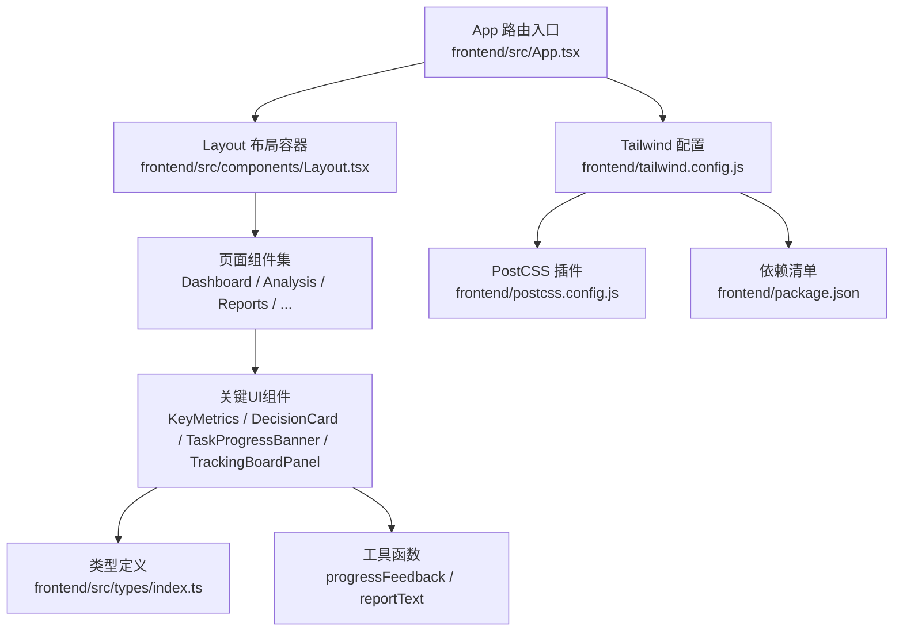
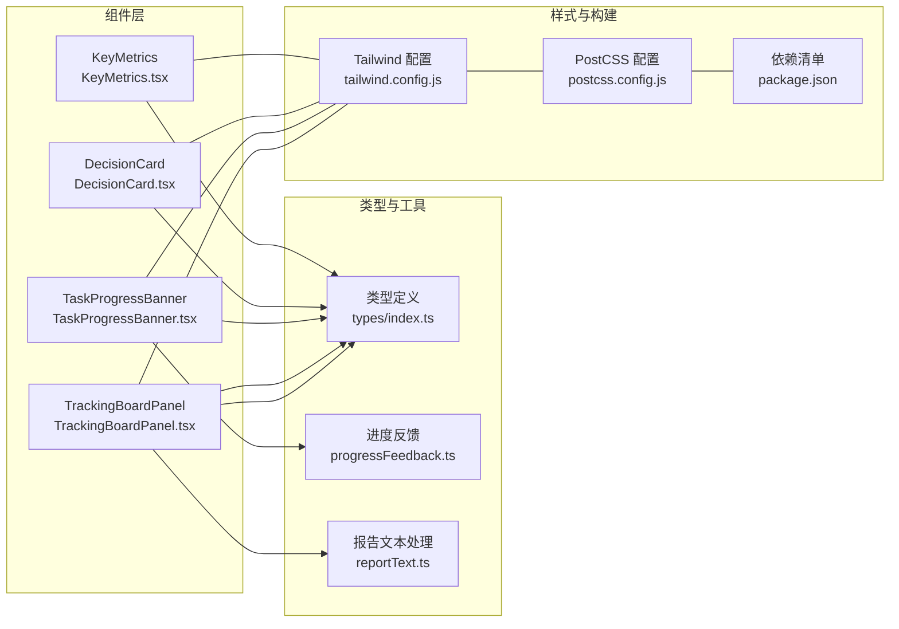
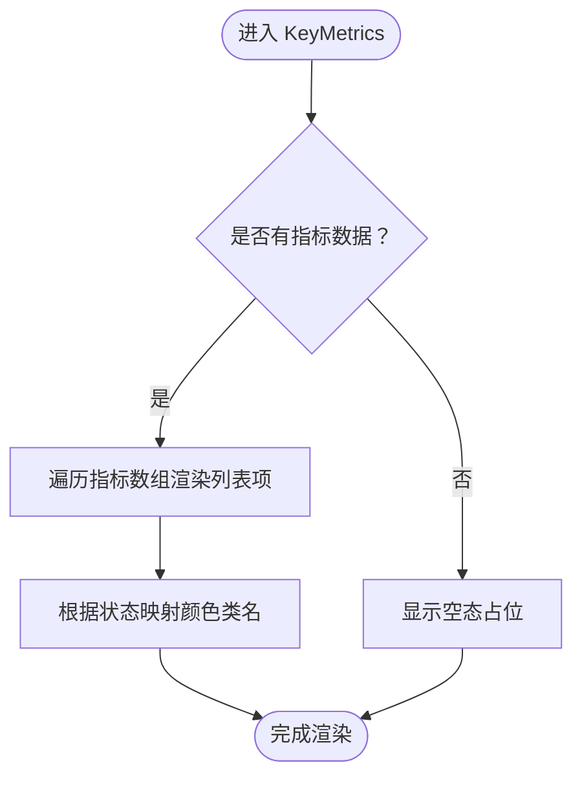
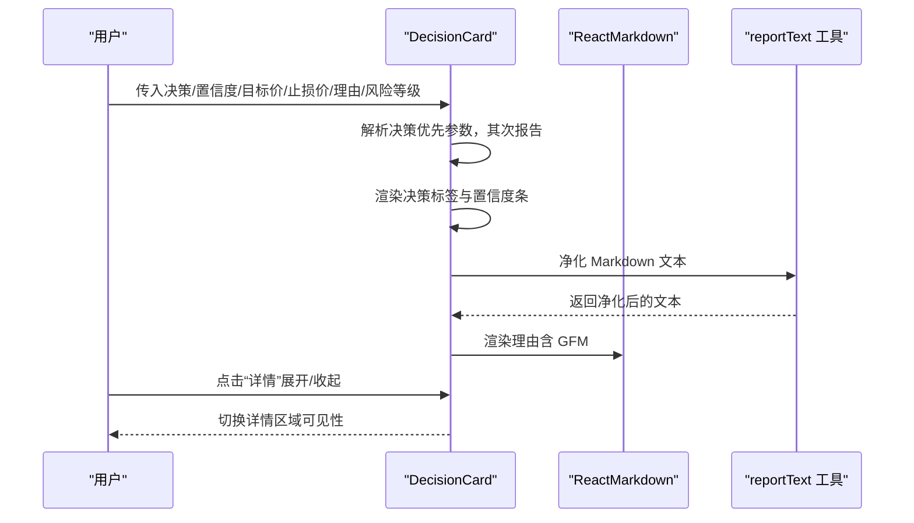
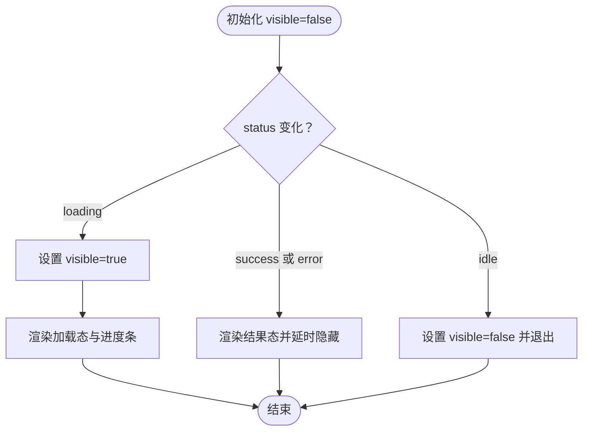
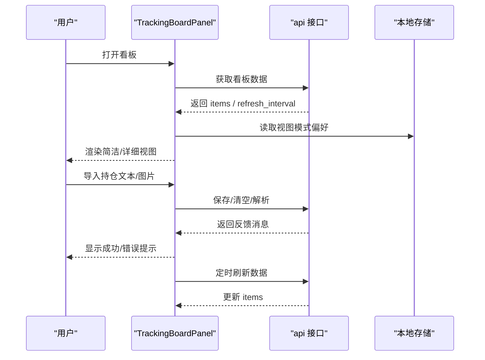
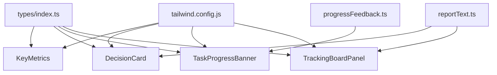

# UI/UX设计

<cite>
**本文引用的文件**
- [frontend/src/components/KeyMetrics.tsx](file://frontend/src/components/KeyMetrics.tsx)
- [frontend/src/components/DecisionCard.tsx](file://frontend/src/components/DecisionCard.tsx)
- [frontend/src/components/TaskProgressBanner.tsx](file://frontend/src/components/TaskProgressBanner.tsx)
- [frontend/src/components/TrackingBoardPanel.tsx](file://frontend/src/components/TrackingBoardPanel.tsx)
- [frontend/tailwind.config.js](file://frontend/tailwind.config.js)
- [frontend/postcss.config.js](file://frontend/postcss.config.js)
- [frontend/src/types/index.ts](file://frontend/src/types/index.ts)
- [frontend/src/utils/progressFeedback.ts](file://frontend/src/utils/progressFeedback.ts)
- [frontend/src/utils/reportText.ts](file://frontend/src/utils/reportText.ts)
- [frontend/src/components/Layout.tsx](file://frontend/src/components/Layout.tsx)
- [frontend/src/App.tsx](file://frontend/src/App.tsx)
- [frontend/package.json](file://frontend/package.json)
</cite>

## 目录
1. [引言](#引言)
2. [项目结构](#项目结构)
3. [核心组件](#核心组件)
4. [架构总览](#架构总览)
5. [详细组件分析](#详细组件分析)
6. [依赖关系分析](#依赖关系分析)
7. [性能考量](#性能考量)
8. [故障排查指南](#故障排查指南)
9. [结论](#结论)
10. [附录](#附录)

## 引言
本文件面向 TradingAgents-AShare 的前端 UI/UX 设计系统，聚焦于关键界面组件（KeyMetrics、DecisionCard、TaskProgressBanner、TrackingBoardPanel）的设计理念与实现细节，系统化梳理 Tailwind CSS 主题与样式体系、响应式与无障碍设计原则，并提供移动端适配、性能优化与浏览器兼容性建议。文档旨在帮助开发者与设计师在保持视觉一致性的前提下，高效扩展与维护界面。

## 项目结构
前端采用 Vite + React + TypeScript 构建，Tailwind CSS 作为原子化样式框架，PostCSS 驱动插件管线。页面路由由 React Router 管理，全局布局通过 Layout 组件统一承载侧边栏与主内容区。

图示来源
- [frontend/src/App.tsx:1-78](file://frontend/src/App.tsx#L1-L78)
- [frontend/src/components/Layout.tsx:1-25](file://frontend/src/components/Layout.tsx#L1-L25)
- [frontend/tailwind.config.js:1-37](file://frontend/tailwind.config.js#L1-L37)
- [frontend/postcss.config.js:1-5](file://frontend/postcss.config.js#L1-L5)
- [frontend/package.json:1-47](file://frontend/package.json#L1-L47)

章节来源
- [frontend/src/App.tsx:1-78](file://frontend/src/App.tsx#L1-L78)
- [frontend/src/components/Layout.tsx:1-25](file://frontend/src/components/Layout.tsx#L1-L25)
- [frontend/tailwind.config.js:1-37](file://frontend/tailwind.config.js#L1-L37)
- [frontend/postcss.config.js:1-5](file://frontend/postcss.config.js#L1-L5)
- [frontend/package.json:1-47](file://frontend/package.json#L1-L47)

## 核心组件
本节概述四大关键 UI 组件的设计目标、状态管理与交互反馈机制，以及它们如何与类型系统和工具函数协作。

- KeyMetrics 关键指标速览：以卡片形式展示一组“名称-数值-状态”的指标，支持空态占位与深色模式适配。
- DecisionCard 决策卡片：围绕单一标的展示决策、置信度、目标价/止损价、展开详情等，支持 Markdown 渲染与风险等级可视化。
- TaskProgressBanner 任务进度横幅：根据任务状态（加载/成功/错误/空闲）呈现不同提示与进度条，具备自动隐藏策略。
- TrackingBoardPanel 跟踪看板：提供导入/管理持仓、实时跟踪、简洁/详细视图切换，内置 K 线简图与区间标注，支持自动刷新与错误状态提示。

章节来源
- [frontend/src/components/KeyMetrics.tsx:1-45](file://frontend/src/components/KeyMetrics.tsx#L1-L45)
- [frontend/src/components/DecisionCard.tsx:1-184](file://frontend/src/components/DecisionCard.tsx#L1-L184)
- [frontend/src/components/TaskProgressBanner.tsx:1-88](file://frontend/src/components/TaskProgressBanner.tsx#L1-L88)
- [frontend/src/components/TrackingBoardPanel.tsx:1-1198](file://frontend/src/components/TrackingBoardPanel.tsx#L1-L1198)

## 架构总览
下图展示了 UI 组件与类型、工具函数及样式配置之间的关系，体现“数据驱动 UI + 原子化样式 + 进度反馈”的设计思路。

图示来源
- [frontend/src/components/KeyMetrics.tsx:1-45](file://frontend/src/components/KeyMetrics.tsx#L1-L45)
- [frontend/src/components/DecisionCard.tsx:1-184](file://frontend/src/components/DecisionCard.tsx#L1-L184)
- [frontend/src/components/TaskProgressBanner.tsx:1-88](file://frontend/src/components/TaskProgressBanner.tsx#L1-L88)
- [frontend/src/components/TrackingBoardPanel.tsx:1-1198](file://frontend/src/components/TrackingBoardPanel.tsx#L1-L1198)
- [frontend/src/types/index.ts:1-839](file://frontend/src/types/index.ts#L1-L839)
- [frontend/src/utils/progressFeedback.ts:1-88](file://frontend/src/utils/progressFeedback.ts#L1-L88)
- [frontend/src/utils/reportText.ts:1-75](file://frontend/src/utils/reportText.ts#L1-L75)
- [frontend/tailwind.config.js:1-37](file://frontend/tailwind.config.js#L1-L37)
- [frontend/postcss.config.js:1-5](file://frontend/postcss.config.js#L1-L5)
- [frontend/package.json:1-47](file://frontend/package.json#L1-L47)

## 详细组件分析

### KeyMetrics 关键指标
- 设计理念
  - 卡片化布局，强调信息密度与可读性；图标+标题增强语义；状态色区分“好/中性/差”。
  - 支持空态占位，避免空白区域破坏节奏；深色模式下使用半透明白色系背景提升对比度。
- 实现要点
  - 使用状态映射表将指标状态映射到颜色类名，确保一致性。
  - 列表渲染时按项拆分，末尾项移除底边线，减少视觉噪音。
- 可访问性
  - 文字大小与对比度满足基础可读性要求；深色模式下颜色对比度经验证更佳。
- 性能
  - 列表项较少，渲染开销极低；建议在父级容器做虚拟滚动以应对大规模指标列表场景。

图示来源
- [frontend/src/components/KeyMetrics.tsx:10-44](file://frontend/src/components/KeyMetrics.tsx#L10-L44)

章节来源
- [frontend/src/components/KeyMetrics.tsx:1-45](file://frontend/src/components/KeyMetrics.tsx#L1-L45)

### DecisionCard 决策卡片
- 设计理念
  - 将“决策标签”、“置信度条”、“目标价/止损价”、“展开详情”整合在同一卡片，形成“快速决策通道”。
  - 决策标签采用图标+颜色+边框的组合，强化正负向信号；置信度条提供渐变动画，增强反馈。
- 实现要点
  - 决策解析：优先使用显式传参，其次从报告对象中解析英文/中文关键词，兼容多语言。
  - Markdown 渲染：对报告正文进行安全净化，仅允许表格与基本排版；使用 GFM 扩展增强可读性。
  - 风险等级：以颜色与文案映射，配合展开按钮控制详情区域。
- 可访问性
  - 图标具备语义化替代（标签文字），颜色不单独承担信息载体。
  - 展开按钮使用语义化按钮元素，键盘可达。
- 性能
  - Markdown 渲染为轻量操作；建议在父级容器做懒加载或虚拟滚动以优化长列表。

图示来源
- [frontend/src/components/DecisionCard.tsx:32-182](file://frontend/src/components/DecisionCard.tsx#L32-L182)
- [frontend/src/utils/reportText.ts:13-24](file://frontend/src/utils/reportText.ts#L13-L24)

章节来源
- [frontend/src/components/DecisionCard.tsx:1-184](file://frontend/src/components/DecisionCard.tsx#L1-L184)
- [frontend/src/utils/reportText.ts:1-75](file://frontend/src/utils/reportText.ts#L1-L75)

### TaskProgressBanner 任务进度横幅
- 设计理念
  - 将任务生命周期（空闲/加载/成功/错误）与进度百分比结合，提供即时反馈。
  - 成功/错误态具备短暂驻留时间，随后自动隐藏，避免干扰主流程。
- 实现要点
  - 状态机：idle/loading/success/error 四态切换；成功/错误态在一定时间后自动隐藏。
  - 进度条：最小宽度限制与平滑过渡，确保弱网环境下的可感知变化。
  - 标签与详情：根据任务种类返回本地化文案，详情用于补充上下文。
- 可访问性
  - 动画可被 Reduced Motion 用户代理抑制；文本信息不依赖动画传达。
- 性能
  - 仅在状态变化时重渲染；定时器在卸载时清理，避免内存泄漏。

图示来源
- [frontend/src/components/TaskProgressBanner.tsx:16-87](file://frontend/src/components/TaskProgressBanner.tsx#L16-L87)
- [frontend/src/utils/progressFeedback.ts:17-38](file://frontend/src/utils/progressFeedback.ts#L17-L38)

章节来源
- [frontend/src/components/TaskProgressBanner.tsx:1-88](file://frontend/src/components/TaskProgressBanner.tsx#L1-L88)
- [frontend/src/utils/progressFeedback.ts:1-88](file://frontend/src/utils/progressFeedback.ts#L1-L88)

### TrackingBoardPanel 跟踪看板
- 设计理念
  - 提供“导入/管理持仓 + 实时跟踪 + 视图切换”的完整工作流，兼顾新手与专业用户。
  - 简洁视图强调数据密度，详细视图突出分析洞察与决策依据。
- 实现要点
  - 数据流：拉取看板数据、自动刷新、错误状态记录；支持手动刷新。
  - 导入能力：文本解析、图片 OCR（通过接口）、保存/清空反馈。
  - 视图切换：本地存储持久化用户偏好；两种视图共享数据结构。
  - 可视化：SVG 绘制当日 K 线简图；区间标注与涨跌停标识辅助判断。
- 可访问性
  - 表格列头具备清晰语义；交互元素具备焦点可见性。
  - 深色模式下对比度与阴影层级经过优化。
- 性能
  - 大列表场景建议引入虚拟滚动；图片解析与保存过程使用禁用态防止重复提交。

图示来源
- [frontend/src/components/TrackingBoardPanel.tsx:34-124](file://frontend/src/components/TrackingBoardPanel.tsx#L34-L124)
- [frontend/src/components/TrackingBoardPanel.tsx:148-183](file://frontend/src/components/TrackingBoardPanel.tsx#L148-L183)
- [frontend/src/components/TrackingBoardPanel.tsx:216-221](file://frontend/src/components/TrackingBoardPanel.tsx#L216-L221)

章节来源
- [frontend/src/components/TrackingBoardPanel.tsx:1-1198](file://frontend/src/components/TrackingBoardPanel.tsx#L1-L1198)

## 依赖关系分析
- 类型系统
  - 统一的类型定义贯穿组件与服务层，确保数据结构稳定与可预测。
- 工具函数
  - progressFeedback 提供任务进度计算与标签映射；reportText 提供报告文本净化与结构化解析。
- 样式系统
  - Tailwind 配置启用 class 深色模式，扩展 trading 品牌色与字体族；PostCSS 通过插件管线编译原子化样式。

图示来源
- [frontend/src/types/index.ts:1-839](file://frontend/src/types/index.ts#L1-L839)
- [frontend/src/utils/progressFeedback.ts:1-88](file://frontend/src/utils/progressFeedback.ts#L1-L88)
- [frontend/src/utils/reportText.ts:1-75](file://frontend/src/utils/reportText.ts#L1-L75)
- [frontend/tailwind.config.js:1-37](file://frontend/tailwind.config.js#L1-L37)

章节来源
- [frontend/src/types/index.ts:1-839](file://frontend/src/types/index.ts#L1-L839)
- [frontend/src/utils/progressFeedback.ts:1-88](file://frontend/src/utils/progressFeedback.ts#L1-L88)
- [frontend/src/utils/reportText.ts:1-75](file://frontend/src/utils/reportText.ts#L1-L75)
- [frontend/tailwind.config.js:1-37](file://frontend/tailwind.config.js#L1-L37)

## 性能考量
- 渲染优化
  - 对长列表（如跟踪看板详细视图）建议引入虚拟滚动以降低 DOM 节点数量。
  - 决策卡片详情区域按需渲染，避免不必要的 Markdown 解析。
- 网络与刷新
  - 跟踪看板的自动刷新周期来自后端返回，避免过短刷新导致抖动与资源浪费。
  - 成功/错误态横幅短暂驻留后自动隐藏，减少 UI 抖动。
- 样式体积
  - Tailwind 原子类按需生成，建议在生产环境开启摇树与压缩；避免在组件中硬编码大段样式。
- 无障碍与兼容
  - 深色模式与动画可选策略已在组件中体现；建议在 CI 中加入可访问性扫描。

[本节为通用指导，无需列出具体文件来源]

## 故障排查指南
- 决策卡片无法解析决策
  - 检查传入参数与报告对象是否包含英文/中文关键词；必要时在上层预处理后再传入。
  - 参考路径：[frontend/src/components/DecisionCard.tsx:48-60](file://frontend/src/components/DecisionCard.tsx#L48-L60)
- Markdown 渲染异常
  - 确认文本已通过净化函数处理；若仍异常，检查上游数据是否包含非法标签。
  - 参考路径：[frontend/src/utils/reportText.ts:13-24](file://frontend/src/utils/reportText.ts#L13-L24)
- 任务进度横幅不消失
  - 确认状态从 success/error 切换后是否触发定时器；卸载时是否清理定时器。
  - 参考路径：[frontend/src/components/TaskProgressBanner.tsx:25-39](file://frontend/src/components/TaskProgressBanner.tsx#L25-L39)
- 跟踪看板数据不刷新
  - 检查刷新间隔与网络请求是否成功；查看错误状态字段；确认本地存储偏好未被覆盖。
  - 参考路径：[frontend/src/components/TrackingBoardPanel.tsx:84-116](file://frontend/src/components/TrackingBoardPanel.tsx#L84-L116)

章节来源
- [frontend/src/components/DecisionCard.tsx:48-60](file://frontend/src/components/DecisionCard.tsx#L48-L60)
- [frontend/src/utils/reportText.ts:13-24](file://frontend/src/utils/reportText.ts#L13-L24)
- [frontend/src/components/TaskProgressBanner.tsx:25-39](file://frontend/src/components/TaskProgressBanner.tsx#L25-L39)
- [frontend/src/components/TrackingBoardPanel.tsx:84-116](file://frontend/src/components/TrackingBoardPanel.tsx#L84-L116)

## 结论
该设计系统以“数据驱动 + 原子化样式 + 任务反馈”为核心，通过明确的状态机与类型约束，确保关键组件在复杂金融场景中的稳定性与一致性。Tailwind CSS 的主题扩展与 PostCSS 管线提供了良好的可维护性与可扩展性。建议在后续迭代中进一步完善虚拟滚动、可访问性测试与自动化质量保障。

[本节为总结性内容，无需列出具体文件来源]

## 附录

### Tailwind CSS 主题与样式系统
- 深色模式
  - 通过 class 切换实现，组件中广泛使用暗色系背景与边框类名，确保在深色模式下具备良好对比度。
- 主题定制
  - 扩展 trading.accent 色彩空间，便于在组件中直接引用品牌色。
  - 字体族包含 Sans 与等宽字体，满足数据与代码场景需求。
  - 自定义动画（如慢速脉冲/旋转）用于弱反馈与加载态。
- 响应式设计
  - 组件普遍采用 flex/grid 布局与断点友好的类名，保证在桌面与移动设备上的可读性。
- 组件样式系统
  - 通过统一的 card、prose、badge 等类名约定，形成一致的视觉层级与间距。

章节来源
- [frontend/tailwind.config.js:1-37](file://frontend/tailwind.config.js#L1-L37)
- [frontend/postcss.config.js:1-5](file://frontend/postcss.config.js#L1-L5)
- [frontend/src/components/KeyMetrics.tsx:14-42](file://frontend/src/components/KeyMetrics.tsx#L14-L42)
- [frontend/src/components/DecisionCard.tsx:72-181](file://frontend/src/components/DecisionCard.tsx#L72-L181)
- [frontend/src/components/TaskProgressBanner.tsx:61-86](file://frontend/src/components/TaskProgressBanner.tsx#L61-L86)
- [frontend/src/components/TrackingBoardPanel.tsx:390-421](file://frontend/src/components/TrackingBoardPanel.tsx#L390-L421)

### 移动端适配与无障碍支持
- 移动端适配
  - 使用响应式断点类名与弹性布局，确保在小屏设备上信息层级清晰、交互元素可触达。
- 无障碍支持
  - 图标具备语义化替代；交互元素具备焦点可见性；深色模式与动画可选策略已在组件中体现。
- 浏览器兼容性
  - 依赖现代浏览器特性（如 CSS Grid、Flexbox、自定义属性）；建议在 CI 中进行跨浏览器测试。

章节来源
- [frontend/src/components/TrackingBoardPanel.tsx:326-343](file://frontend/src/components/TrackingBoardPanel.tsx#L326-L343)
- [frontend/src/components/DecisionCard.tsx:170-180](file://frontend/src/components/DecisionCard.tsx#L170-L180)
- [frontend/package.json:12-29](file://frontend/package.json#L12-L29)