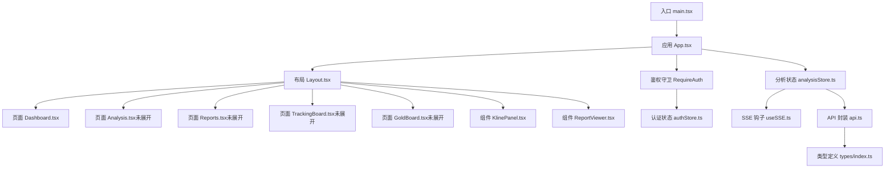
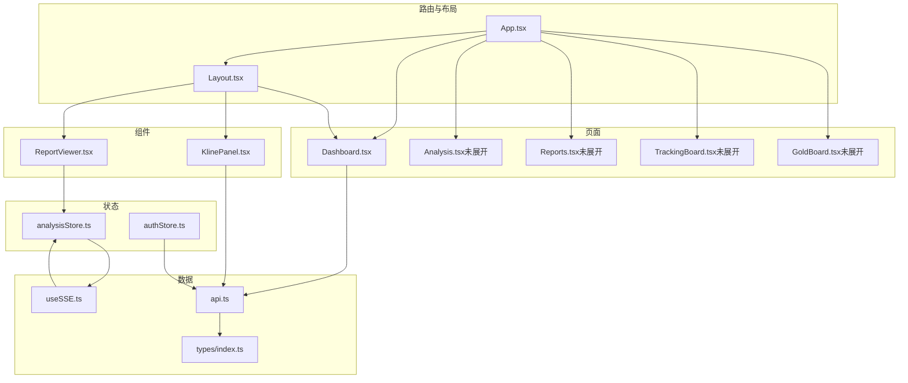
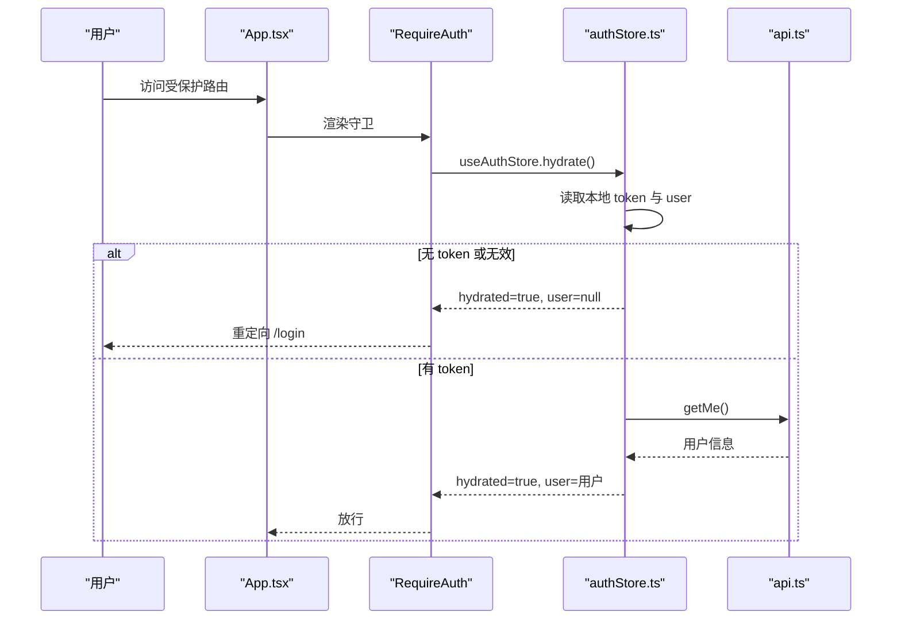
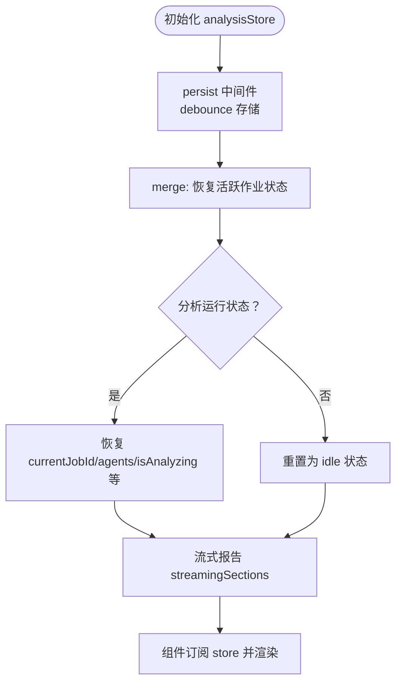
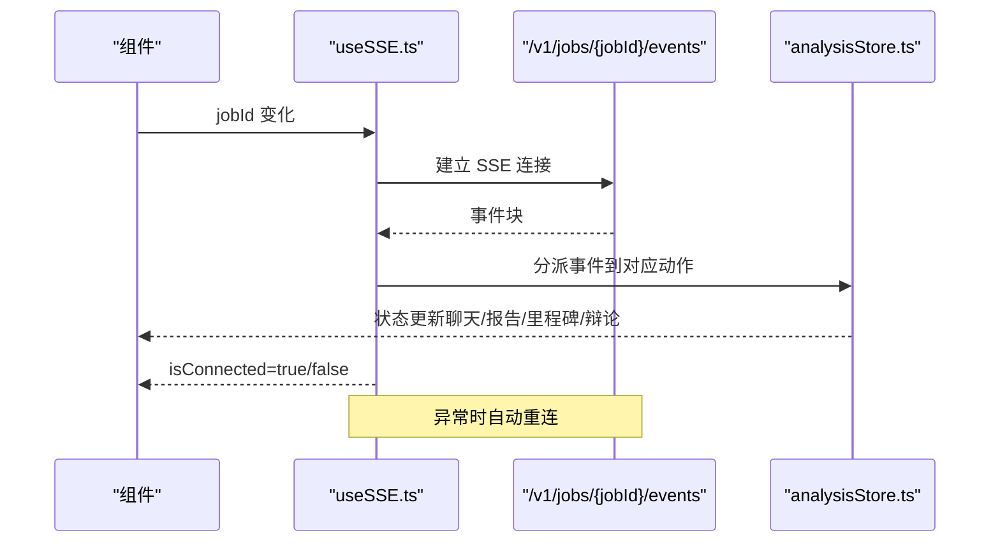
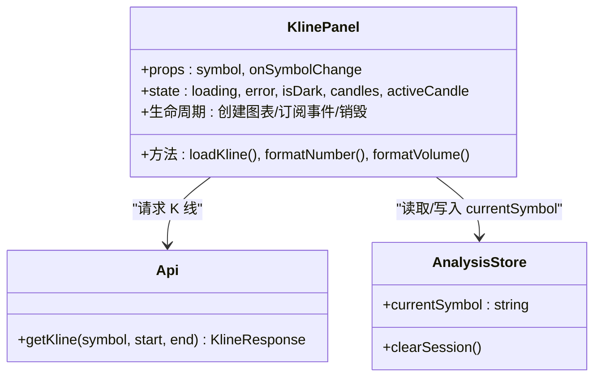
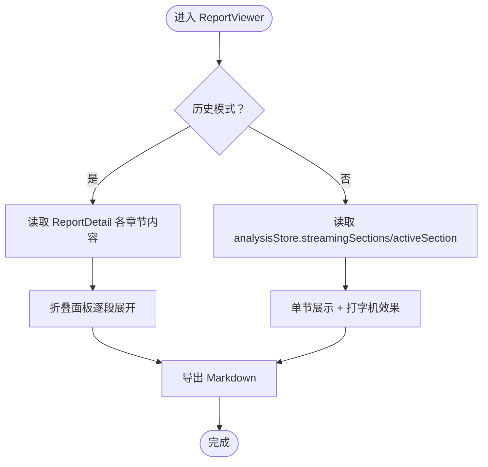
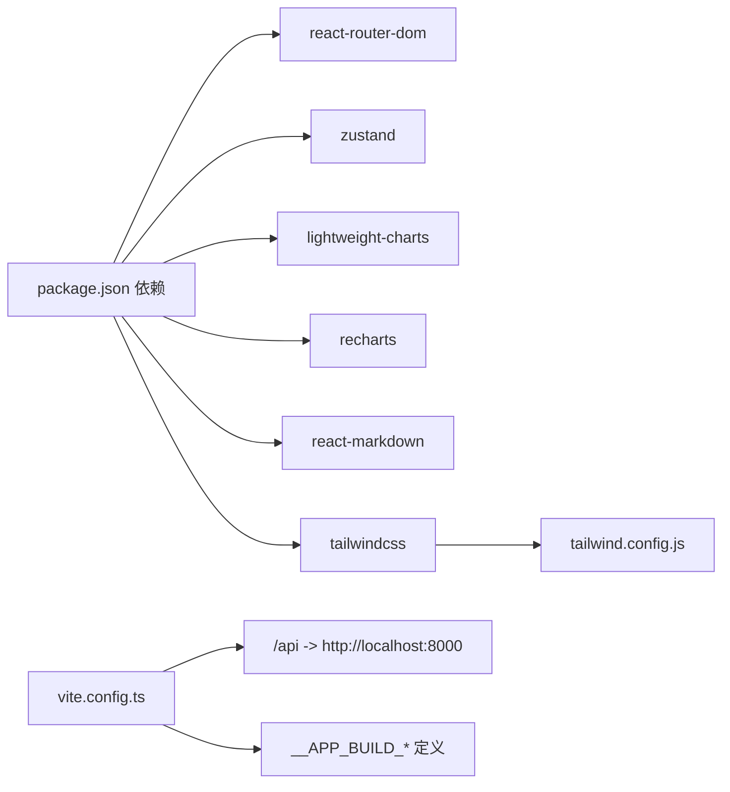

# 前端应用

<cite>
**本文引用的文件**
- [frontend/src/main.tsx](file://frontend/src/main.tsx)
- [frontend/src/App.tsx](file://frontend/src/App.tsx)
- [frontend/src/components/Layout.tsx](file://frontend/src/components/Layout.tsx)
- [frontend/src/components/KlinePanel.tsx](file://frontend/src/components/KlinePanel.tsx)
- [frontend/src/components/ReportViewer.tsx](file://frontend/src/components/ReportViewer.tsx)
- [frontend/src/pages/Dashboard.tsx](file://frontend/src/pages/Dashboard.tsx)
- [frontend/src/stores/authStore.ts](file://frontend/src/stores/authStore.ts)
- [frontend/src/stores/analysisStore.ts](file://frontend/src/stores/analysisStore.ts)
- [frontend/src/services/api.ts](file://frontend/src/services/api.ts)
- [frontend/src/hooks/useSSE.ts](file://frontend/src/hooks/useSSE.ts)
- [frontend/src/utils/reportText.ts](file://frontend/src/utils/reportText.ts)
- [frontend/src/types/index.ts](file://frontend/src/types/index.ts)
- [frontend/package.json](file://frontend/package.json)
- [frontend/vite.config.ts](file://frontend/vite.config.ts)
- [frontend/tailwind.config.js](file://frontend/tailwind.config.js)
</cite>

## 目录
1. [简介](#简介)
2. [项目结构](#项目结构)
3. [核心组件](#核心组件)
4. [架构总览](#架构总览)
5. [组件详解](#组件详解)
6. [依赖关系分析](#依赖关系分析)
7. [性能考量](#性能考量)
8. [故障排查指南](#故障排查指南)
9. [结论](#结论)
10. [附录](#附录)

## 简介
本文件面向 TradingAgents-AShare 的 React 前端应用，提供从架构设计、组件体系、状态管理到图表与交互的全栈技术文档。重点覆盖：
- 应用路由与鉴权守卫
- Zustand 状态管理（认证与分析会话）
- SSE 实时事件驱动的数据流
- K 线图组件与数据绑定
- 报告查看器与 Markdown 渲染
- 图表库集成、响应式设计与用户体验优化
- 组件 API 文档、属性配置与事件处理
- 开发环境搭建、构建部署与性能优化建议

## 项目结构
前端位于 frontend 目录，采用 Vite + React 18 + TypeScript 构建，TailwindCSS 提供样式基础，使用 lightweight-charts 与 recharts 进行可视化，Zustand 管理全局状态，React Router v7 实现路由。

**图表来源**
- [frontend/src/main.tsx:1-11](file://frontend/src/main.tsx#L1-L11)
- [frontend/src/App.tsx:1-78](file://frontend/src/App.tsx#L1-L78)
- [frontend/src/components/Layout.tsx:1-25](file://frontend/src/components/Layout.tsx#L1-L25)
- [frontend/src/pages/Dashboard.tsx:1-337](file://frontend/src/pages/Dashboard.tsx#L1-L337)
- [frontend/src/components/KlinePanel.tsx:1-333](file://frontend/src/components/KlinePanel.tsx#L1-L333)
- [frontend/src/components/ReportViewer.tsx:1-254](file://frontend/src/components/ReportViewer.tsx#L1-L254)
- [frontend/src/stores/authStore.ts:1-56](file://frontend/src/stores/authStore.ts#L1-L56)
- [frontend/src/stores/analysisStore.ts:1-524](file://frontend/src/stores/analysisStore.ts#L1-L524)
- [frontend/src/hooks/useSSE.ts:1-416](file://frontend/src/hooks/useSSE.ts#L1-L416)
- [frontend/src/services/api.ts:1-452](file://frontend/src/services/api.ts#L1-L452)
- [frontend/src/types/index.ts:1-839](file://frontend/src/types/index.ts#L1-L839)

**章节来源**
- [frontend/src/main.tsx:1-11](file://frontend/src/main.tsx#L1-L11)
- [frontend/src/App.tsx:1-78](file://frontend/src/App.tsx#L1-L78)
- [frontend/package.json:1-47](file://frontend/package.json#L1-L47)
- [frontend/vite.config.ts:1-75](file://frontend/vite.config.ts#L1-L75)
- [frontend/tailwind.config.js:1-37](file://frontend/tailwind.config.js#L1-L37)

## 核心组件
- 应用入口与路由
  - main.tsx：创建根节点并渲染 App
  - App.tsx：BrowserRouter + 路由表 + 鉴权守卫 + 顶层布局
- 布局与导航
  - Layout.tsx：侧边栏 + 头部 + 主内容区域
- 页面
  - Dashboard.tsx：控制台概览、统计卡片、快速操作、最近报告、跟踪看板摘要
- 可视化组件
  - KlinePanel.tsx：基于 lightweight-charts 的 K 线图，支持主题切换、缩放、交叉线提示
  - ReportViewer.tsx：报告查看器，支持历史报告与实时流式报告，Markdown 渲染与导出
- 状态管理
  - authStore.ts：登录态、本地存储、Hydrate
  - analysisStore.ts：分析作业、代理状态、报告、里程碑、流式节、辩论消息、聊天记录、结构化指标
- 事件与数据
  - useSSE.ts：订阅 /v1/jobs/{jobId}/events，映射到 analysisStore
  - api.ts：统一 API 请求封装，含鉴权头、错误处理、SSE 调用
- 类型定义
  - types/index.ts：Agent、Job、SSE 事件、K 线、报告、追踪看板、Board-Gold 等类型

**章节来源**
- [frontend/src/App.tsx:1-78](file://frontend/src/App.tsx#L1-L78)
- [frontend/src/components/Layout.tsx:1-25](file://frontend/src/components/Layout.tsx#L1-L25)
- [frontend/src/pages/Dashboard.tsx:1-337](file://frontend/src/pages/Dashboard.tsx#L1-L337)
- [frontend/src/components/KlinePanel.tsx:1-333](file://frontend/src/components/KlinePanel.tsx#L1-L333)
- [frontend/src/components/ReportViewer.tsx:1-254](file://frontend/src/components/ReportViewer.tsx#L1-L254)
- [frontend/src/stores/authStore.ts:1-56](file://frontend/src/stores/authStore.ts#L1-L56)
- [frontend/src/stores/analysisStore.ts:1-524](file://frontend/src/stores/analysisStore.ts#L1-L524)
- [frontend/src/hooks/useSSE.ts:1-416](file://frontend/src/hooks/useSSE.ts#L1-L416)
- [frontend/src/services/api.ts:1-452](file://frontend/src/services/api.ts#L1-L452)
- [frontend/src/types/index.ts:1-839](file://frontend/src/types/index.ts#L1-L839)

## 架构总览
前端采用“路由 + 布局 + 页面 + 组件 + 状态 + 服务”的分层架构。路由负责页面级导航，Layout 负责整体布局，页面承载业务视图，组件负责可复用 UI 与可视化，Zustand 管理跨页面状态，API 与 SSE 提供数据与事件驱动。

**图表来源**
- [frontend/src/App.tsx:1-78](file://frontend/src/App.tsx#L1-L78)
- [frontend/src/components/Layout.tsx:1-25](file://frontend/src/components/Layout.tsx#L1-L25)
- [frontend/src/pages/Dashboard.tsx:1-337](file://frontend/src/pages/Dashboard.tsx#L1-L337)
- [frontend/src/components/KlinePanel.tsx:1-333](file://frontend/src/components/KlinePanel.tsx#L1-L333)
- [frontend/src/components/ReportViewer.tsx:1-254](file://frontend/src/components/ReportViewer.tsx#L1-L254)
- [frontend/src/stores/analysisStore.ts:1-524](file://frontend/src/stores/analysisStore.ts#L1-L524)
- [frontend/src/stores/authStore.ts:1-56](file://frontend/src/stores/authStore.ts#L1-L56)
- [frontend/src/hooks/useSSE.ts:1-416](file://frontend/src/hooks/useSSE.ts#L1-L416)
- [frontend/src/services/api.ts:1-452](file://frontend/src/services/api.ts#L1-L452)
- [frontend/src/types/index.ts:1-839](file://frontend/src/types/index.ts#L1-L839)

## 组件详解

### 鉴权与路由守卫
- App.tsx
  - 使用 React Router v7 的路由表，/login 与外部跳转策略
  - RequireAuth 守卫：通过 useAuthStore.hydrate 初始化本地存储中的 token 与用户信息，并在未登录时重定向到 /login
  - SpeedInsights 注入用于性能观测
- authStore.ts
  - setAuth/logout：写入/清除 ta-access-token 与 ta-user
  - hydrate：从本地恢复 token 与用户，调用 api.getMe 校验并更新本地存储
- api.ts
  - getAuthToken：从 localStorage 读取 Bearer Token
  - request：统一 fetch 封装，自动附加 Authorization 头，处理非 JSON 响应与空响应

**图表来源**
- [frontend/src/App.tsx:27-43](file://frontend/src/App.tsx#L27-L43)
- [frontend/src/stores/authStore.ts:36-54](file://frontend/src/stores/authStore.ts#L36-L54)
- [frontend/src/services/api.ts:404-406](file://frontend/src/services/api.ts#L404-L406)

**章节来源**
- [frontend/src/App.tsx:1-78](file://frontend/src/App.tsx#L1-L78)
- [frontend/src/stores/authStore.ts:1-56](file://frontend/src/stores/authStore.ts#L1-L56)
- [frontend/src/services/api.ts:56-104](file://frontend/src/services/api.ts#L56-L104)

### 分析状态管理（Zustand）
- analysisStore.ts
  - 状态域：当前作业、代理集合、报告、结构化指标、里程碑、辩论消息、聊天记录、日志、连接状态、分析运行状态、当前分析区间
  - 动作：setCurrentJobId、setCurrentSymbol、setJobStatus、updateAgentStatus、updateAgentSnapshot、addAgentMessage、addAgentToolCall、addAgentReport、addReportChunk、addAgentToken、addMilestone、addLog、setReport、setStructuredData、setIsAnalyzing、setIsConnected、setAnalysisRunState、setCurrentHorizon、addChatMessage、appendToChatMessage、setMessageContent、markAgentMessagesComplete、addDebateMessage、appendDebateToken、clearChatMessages、clearSession、reset
  - 持久化：persist + debounce 存储，仅在存在活跃作业时持久化关键字段，避免刷新丢失进度
  - 合并策略：合并持久化状态与当前状态，恢复活跃作业场景

**图表来源**
- [frontend/src/stores/analysisStore.ts:477-523](file://frontend/src/stores/analysisStore.ts#L477-L523)

**章节来源**
- [frontend/src/stores/analysisStore.ts:1-524](file://frontend/src/stores/analysisStore.ts#L1-L524)

### SSE 事件驱动
- useSSE.ts
  - 连接 /v1/jobs/{jobId}/events，解析事件块，映射到 analysisStore 的动作
  - 事件类型：job.created、job.running、job.completed、job.failed、agent.status、agent.snapshot、agent.token、agent.report、agent.report.chunk、agent.milestone、agent.debate、agent.debate.token 等
  - 自动重连：断开后 3 秒重试，维护 retryTick
  - 断开：disconnect 主动终止连接

**图表来源**
- [frontend/src/hooks/useSSE.ts:38-385](file://frontend/src/hooks/useSSE.ts#L38-L385)
- [frontend/src/stores/analysisStore.ts:187-476](file://frontend/src/stores/analysisStore.ts#L187-L476)

**章节来源**
- [frontend/src/hooks/useSSE.ts:1-416](file://frontend/src/hooks/useSSE.ts#L1-L416)
- [frontend/src/stores/analysisStore.ts:1-524](file://frontend/src/stores/analysisStore.ts#L1-L524)

### K 线图组件（KlinePanel）
- 能力
  - 调用 api.getKline 获取 K 线数据，转换为 lightweight-charts CandlestickData
  - 主题监听：监听 html 根元素 class 变更，动态切换配色
  - 交互：十字光标移动显示当日 K 线详情，双击适配内容
  - 预设指数：内置上证、深证、创业板、科创50、北证50 等指数快捷切换
  - 当前分析标的联动：若与当前分析符号不同，提供“跳转到当前标的”按钮
- 数据绑定
  - 通过 useAnalysisStore.currentSymbol 与 onSymbolChange 回调联动
  - 通过 useAnalysisStore.clearSession 在登出时清理会话

**图表来源**
- [frontend/src/components/KlinePanel.tsx:79-333](file://frontend/src/components/KlinePanel.tsx#L79-L333)
- [frontend/src/services/api.ts:121-126](file://frontend/src/services/api.ts#L121-L126)
- [frontend/src/stores/analysisStore.ts:188-212](file://frontend/src/stores/analysisStore.ts#L188-L212)

**章节来源**
- [frontend/src/components/KlinePanel.tsx:1-333](file://frontend/src/components/KlinePanel.tsx#L1-L333)
- [frontend/src/services/api.ts:121-126](file://frontend/src/services/api.ts#L121-L126)
- [frontend/src/stores/analysisStore.ts:188-212](file://frontend/src/stores/analysisStore.ts#L188-L212)

### 报告查看器（ReportViewer）
- 模式
  - 历史模式：传入 ReportDetail，展开多个报告章节，支持一键导出 Markdown
  - 实时模式：根据 activeSection 显示单个智能体报告，支持打字机效果与导出全部
- Markdown 渲染
  - 使用 react-markdown + remark-gfm，自定义表格组件以适配暗色主题
  - 内容清洗：reportText.sanitizeReportMarkdown 去除机器标签、规范化英文术语
- 结构化提取
  - extractVerdict 从 HTML 注释中提取方向与理由
  - buildAgentSummary 生成摘要文本

**图表来源**
- [frontend/src/components/ReportViewer.tsx:50-254](file://frontend/src/components/ReportViewer.tsx#L50-L254)
- [frontend/src/utils/reportText.ts:13-75](file://frontend/src/utils/reportText.ts#L13-L75)
- [frontend/src/stores/analysisStore.ts:252-292](file://frontend/src/stores/analysisStore.ts#L252-L292)

**章节来源**
- [frontend/src/components/ReportViewer.tsx:1-254](file://frontend/src/components/ReportViewer.tsx#L1-L254)
- [frontend/src/utils/reportText.ts:1-75](file://frontend/src/utils/reportText.ts#L1-L75)
- [frontend/src/stores/analysisStore.ts:234-318](file://frontend/src/stores/analysisStore.ts#L234-L318)

### 控制台页面（Dashboard）
- 展示
  - 统计卡片：Agent 状态、分析任务、累计报告、系统状态
  - 快速开始：新分析、查看报告、系统设置
  - 最近分析：列表项点击跳转报告详情
  - 跟踪看板摘要：标的数量、报价覆盖、最近更新时间、刷新间隔
- 数据来源
  - api.getReports、api.getDashboardTrackingBoard
  - useAuthStore.user 用于判断是否加载数据

**章节来源**
- [frontend/src/pages/Dashboard.tsx:1-337](file://frontend/src/pages/Dashboard.tsx#L1-L337)
- [frontend/src/services/api.ts:154-176](file://frontend/src/services/api.ts#L154-L176)
- [frontend/src/services/api.ts:298-300](file://frontend/src/services/api.ts#L298-L300)

## 依赖关系分析
- 包管理与构建
  - package.json：React 18、React Router 7、Zustand、lightweight-charts、recharts、TailwindCSS、Vite、ESLint、TypeScript
  - vite.config.ts：define 构建元信息、本地代理到后端 8000、路径别名 @ -> src
  - tailwind.config.js：深色模式、业务色板 trading.accent、字体族、动画
- 组件耦合
  - KlinePanel 与 ReportViewer 通过 analysisStore 解耦，均依赖 api.ts
  - useSSE 与 analysisStore 强耦合，负责事件分派
  - Layout 作为容器，被各页面依赖
- 外部依赖
  - lightweight-charts：K 线渲染
  - react-markdown + remark-gfm：报告渲染
  - zustand：轻量状态管理
  - react-router：页面路由

**图表来源**
- [frontend/package.json:12-29](file://frontend/package.json#L12-L29)
- [frontend/vite.config.ts:36-74](file://frontend/vite.config.ts#L36-L74)
- [frontend/tailwind.config.js:1-37](file://frontend/tailwind.config.js#L1-L37)

**章节来源**
- [frontend/package.json:1-47](file://frontend/package.json#L1-L47)
- [frontend/vite.config.ts:1-75](file://frontend/vite.config.ts#L1-L75)
- [frontend/tailwind.config.js:1-37](file://frontend/tailwind.config.js#L1-L37)

## 性能考量
- 构建与打包
  - 使用 Vite，开发热更新快，生产构建按需分割
  - define 定义构建元信息，便于版本追踪
- 状态持久化
  - analysisStore 使用 persist + debounce 存储，减少频繁写入
  - 仅在活跃作业时持久化关键字段，避免刷新丢失进度
- 图表渲染
  - KlinePanel 使用 lightweight-charts，按需 resize 与 fitContent，避免重复计算
  - 交叉线事件仅在需要时订阅
- 网络与 SSE
  - useSSE 断线重连，异常日志记录，避免阻塞主线程
  - api.request 对非 JSON 响应进行降级处理
- 样式与主题
  - TailwindCSS 按需类名，深色模式通过 class 切换，避免闪烁

[本节为通用指导，无需具体文件分析]

## 故障排查指南
- 登录态问题
  - 症状：访问受保护路由被重定向到 /login
  - 排查：检查 localStorage 是否存在 ta-access-token 与 ta-user；确认 authStore.hydrate 是否成功；核对 api.getMe 返回
- SSE 连接失败
  - 症状：分析任务无事件更新、isConnected=false
  - 排查：useSSE.connect 是否被调用；网络代理是否正确指向后端；SSE 地址 /v1/jobs/{jobId}/events 是否可达；查看控制台错误日志
- K 线数据为空
  - 症状：K 线图空白或提示“暂无可用 K 线数据”
  - 排查：api.getKline 返回是否为空；symbol 是否正确；时间范围是否合理；lightweight-charts 数据格式是否符合要求
- 报告渲染异常
  - 症状：Markdown 表格错位或样式异常
  - 排查：自定义表格组件是否生效；暗色主题下样式是否正确；reportText.sanitizeReportMarkdown 是否正确清洗内容
- 构建与代理
  - 症状：/api 请求 404 或跨域
  - 排查：vite.server.proxy 配置是否正确；VITE_API_URL 环境变量是否设置；后端 CORS 配置

**章节来源**
- [frontend/src/stores/authStore.ts:36-54](file://frontend/src/stores/authStore.ts#L36-L54)
- [frontend/src/hooks/useSSE.ts:388-412](file://frontend/src/hooks/useSSE.ts#L388-L412)
- [frontend/src/components/KlinePanel.tsx:218-263](file://frontend/src/components/KlinePanel.tsx#L218-L263)
- [frontend/src/components/ReportViewer.tsx:25-41](file://frontend/src/components/ReportViewer.tsx#L25-L41)
- [frontend/vite.config.ts:50-72](file://frontend/vite.config.ts#L50-L72)

## 结论
该前端应用以清晰的分层架构与轻量状态管理实现了多智能体分析系统的可视化与交互体验。通过 SSE 实现实时事件驱动，结合 K 线图与报告查看器，为用户提供从控制台到深度报告的完整工作流。TailwindCSS 与响应式设计保证了良好的跨设备体验，Zustand 的持久化策略提升了会话连续性。后续可在性能监控、错误边界、国际化与可访问性方面进一步完善。

[本节为总结，无需具体文件分析]

## 附录

### 组件 API 文档

- KlinePanel
  - 属性
    - symbol: string（当前标的）
    - onSymbolChange?: (symbol: string) => void（切换标的回调）
  - 事件
    - 无显式事件，通过 props 回调与 analysisStore.currentSymbol 协同
  - 依赖
    - api.getKline、analysisStore.currentSymbol、analysisStore.clearSession

- ReportViewer
  - 属性
    - reportData?: ReportDetail（历史模式传入）
    - activeSection?: string（实时模式下指定章节）
  - 事件
    - 导出：handleExport 触发 Markdown 导出
  - 依赖
    - analysisStore.streamingSections、analysisStore.report、reportText 工具

- Layout
  - 属性
    - children: ReactNode
  - 事件
    - 无
  - 依赖
    - Sidebar、Header、useAnalysisJobRecovery

- Dashboard
  - 属性
    - 无
  - 事件
    - 导航：navigate('/reports' | '/tracking-board' | '/settings' | '/analysis')
  - 依赖
    - api.getReports、api.getDashboardTrackingBoard、useAuthStore.user

**章节来源**
- [frontend/src/components/KlinePanel.tsx:17-20](file://frontend/src/components/KlinePanel.tsx#L17-L20)
- [frontend/src/components/ReportViewer.tsx:43-48](file://frontend/src/components/ReportViewer.tsx#L43-L48)
- [frontend/src/components/Layout.tsx:6-8](file://frontend/src/components/Layout.tsx#L6-L8)
- [frontend/src/pages/Dashboard.tsx:10-17](file://frontend/src/pages/Dashboard.tsx#L10-L17)

### 开发环境搭建与构建部署
- 环境变量
  - VITE_API_URL：后端 API 基础地址（默认从 window.location.origin 推断）
- 本地开发
  - npm run dev：Vite 开发服务器，默认端口 5173
  - 代理：/api、/v1、/healthz、/openapi.json、/docs 指向 http://localhost:8000
- 生产构建
  - npm run build：先 tsc，再 vite build
  - 预览：npm run preview
- 样式与主题
  - TailwindCSS 已配置，深色模式通过 html 根元素 class 切换
- 性能观测
  - 已注入 @vercel/speed-insights

**章节来源**
- [frontend/vite.config.ts:14-34](file://frontend/vite.config.ts#L14-L34)
- [frontend/vite.config.ts:48-72](file://frontend/vite.config.ts#L48-L72)
- [frontend/src/App.tsx:3](file://frontend/src/App.tsx#L3)
- [frontend/package.json:6-11](file://frontend/package.json#L6-L11)
- [frontend/tailwind.config.js:1-37](file://frontend/tailwind.config.js#L1-L37)