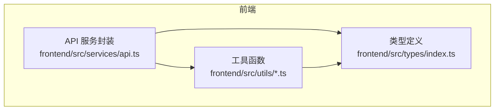
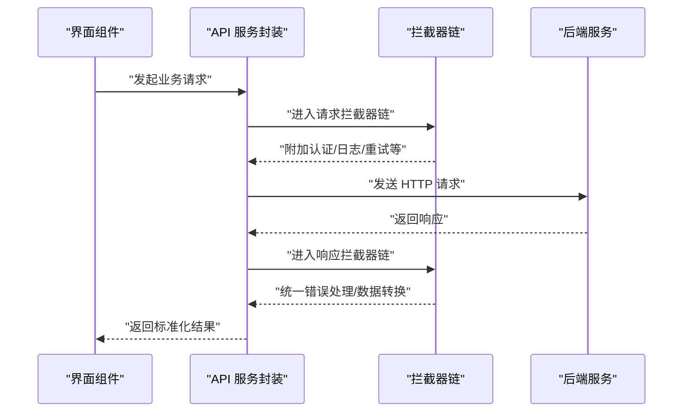
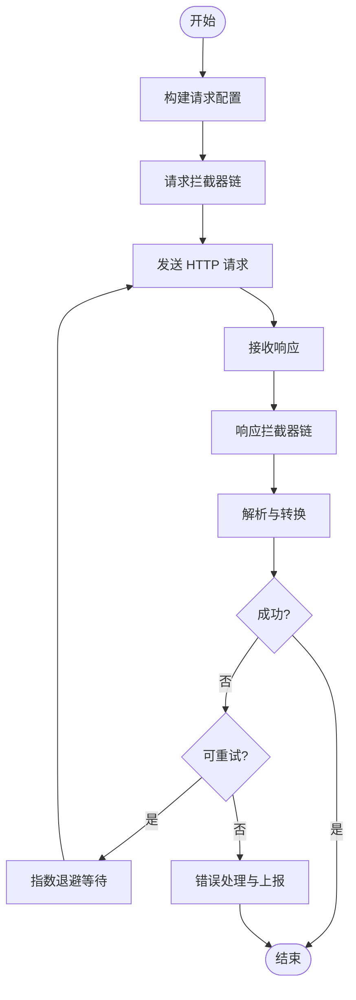
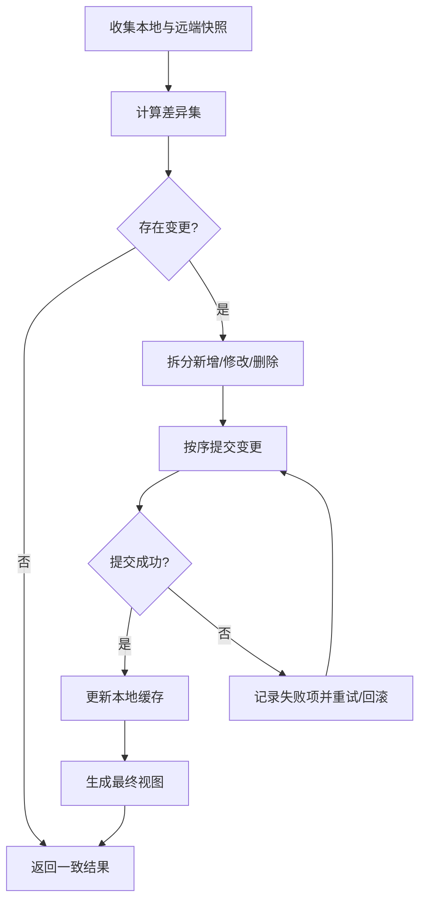
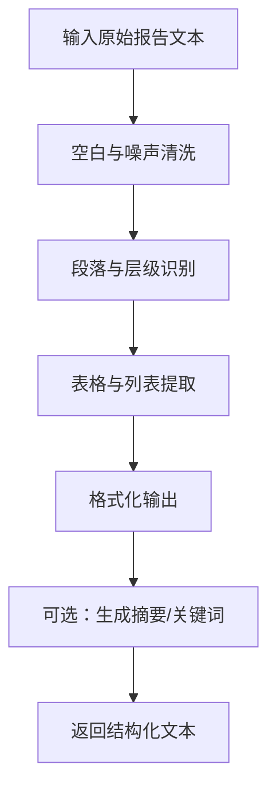
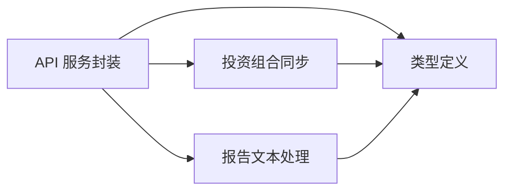

# 数据服务

<cite>
**本文引用的文件**
- [frontend/src/services/api.ts](file://frontend/src/services/api.ts)
- [frontend/src/utils/portfolioSync.ts](file://frontend/src/utils/portfolioSync.ts)
- [frontend/src/utils/reportText.ts](file://frontend/src/utils/reportText.ts)
- [frontend/src/types/index.ts](file://frontend/src/types/index.ts)
</cite>

## 目录
1. [引言](#引言)
2. [项目结构](#项目结构)
3. [核心组件](#核心组件)
4. [架构总览](#架构总览)
5. [详细组件分析](#详细组件分析)
6. [依赖关系分析](#依赖关系分析)
7. [性能考虑](#性能考虑)
8. [故障排查指南](#故障排查指南)
9. [结论](#结论)
10. [附录](#附录)

## 引言
本文件聚焦于 TradingAgents-AShare 前端数据服务层，系统性梳理 API 服务封装、TypeScript 类型设计与数据工具函数（如投资组合同步与报告文本处理）的实现思路与使用方式，并给出调用示例、数据格式说明、错误处理策略、缓存与离线处理建议以及性能优化方案。目标是帮助开发者在不深入源码的情况下快速理解并正确使用数据服务。

## 项目结构
数据服务层主要由三部分组成：
- API 封装：统一的 HTTP 客户端与拦截器配置，负责请求构建、认证、重试与错误处理。
- 类型系统：集中定义数据模型与接口，确保前后端契约一致与开发期安全。
- 工具函数：围绕业务数据进行转换与同步，如投资组合同步与报告文本处理。

**图表来源**
- [frontend/src/services/api.ts](file://frontend/src/services/api.ts)
- [frontend/src/types/index.ts](file://frontend/src/types/index.ts)
- [frontend/src/utils/portfolioSync.ts](file://frontend/src/utils/portfolioSync.ts)
- [frontend/src/utils/reportText.ts](file://frontend/src/utils/reportText.ts)

**章节来源**
- [frontend/src/services/api.ts](file://frontend/src/services/api.ts)
- [frontend/src/types/index.ts](file://frontend/src/types/index.ts)
- [frontend/src/utils/portfolioSync.ts](file://frontend/src/utils/portfolioSync.ts)
- [frontend/src/utils/reportText.ts](file://frontend/src/utils/reportText.ts)

## 核心组件
- API 服务封装：提供统一的 HTTP 请求能力，内置拦截器链路（鉴权、日志、重试、错误处理），支持请求/响应转换与并发控制。
- TypeScript 类型体系：集中声明数据模型、分页、查询参数、返回体等，保证类型安全与 IDE 智能提示。
- 数据工具函数：封装业务级数据处理逻辑，如投资组合同步、报告文本解析与格式化。

**章节来源**
- [frontend/src/services/api.ts](file://frontend/src/services/api.ts)
- [frontend/src/types/index.ts](file://frontend/src/types/index.ts)
- [frontend/src/utils/portfolioSync.ts](file://frontend/src/utils/portfolioSync.ts)
- [frontend/src/utils/reportText.ts](file://frontend/src/utils/reportText.ts)

## 架构总览
下图展示了从前端到后端的典型调用路径与数据流：

**图表来源**
- [frontend/src/services/api.ts](file://frontend/src/services/api.ts)

## 详细组件分析

### API 服务封装
- 设计理念
  - 单一职责：仅负责网络层与拦截器，业务逻辑下沉至页面或工具模块。
  - 可扩展性：通过拦截器链实现横切关注点（认证、日志、重试、缓存、离线兜底）。
  - 可测试性：对外暴露清晰的请求/响应签名，便于单元测试与模拟。
- 关键能力
  - HTTP 配置：基础 URL、超时、凭据传递、默认头等。
  - 请求拦截器：注入认证令牌、序列化请求体、统一日志记录。
  - 响应拦截器：解包响应、状态码映射、错误归一化、数据转换。
  - 错误管理：区分网络错误、业务错误与超时，提供可恢复策略（指数退避重试）。
  - 拦截器设置：支持顺序执行与条件拦截，避免重复请求与竞态。
- 使用建议
  - 所有业务请求通过统一入口，避免分散的 fetch/new Headers 等写法。
  - 对幂等请求启用自动重试，对非幂等请求禁用或谨慎重试。
  - 在拦截器中完成通用逻辑，减少页面代码重复。

**图表来源**
- [frontend/src/services/api.ts](file://frontend/src/services/api.ts)

**章节来源**
- [frontend/src/services/api.ts](file://frontend/src/services/api.ts)

### TypeScript 类型定义
- 设计原则
  - 明确边界：区分输入参数、输出模型与中间态类型，避免“any”泛滥。
  - 可选字段与必填字段清晰标注，减少运行时错误。
  - 分页与列表类型统一命名与结构，便于复用。
  - 联合类型与字面量类型用于约束枚举值与状态机。
- 典型场景
  - 查询参数：分页、排序、过滤字段的类型化封装。
  - 返回体：标准响应包装（含错误码、消息、数据体），支持泛型包裹。
  - 业务实体：如投资组合、报告、用户信息等，字段与校验规则内聚。
- 使用方法
  - 页面与服务层均以类型约束入参与出参，IDE 可提供智能补全与编译期检查。
  - 对外接口统一导出，避免跨模块重复定义。

**章节来源**
- [frontend/src/types/index.ts](file://frontend/src/types/index.ts)

### 投资组合同步（portfolioSync）
- 功能概述
  - 将本地投资组合数据与远端系统进行比对与合并，保持一致性。
  - 支持增量更新、冲突解决与回滚策略。
- 处理流程
  - 输入：本地快照、远端快照、变更集。
  - 比对：基于标识字段识别新增、修改、删除。
  - 同步：按顺序提交，失败时记录失败项并支持重试。
  - 输出：最终一致的投资组合视图与错误汇总。
- 性能与可靠性
  - 并发控制：限制同时请求数，避免后端压力峰值。
  - 断点续传：记录已处理索引，异常中断后可继续。
  - 冲突策略：时间戳优先、版本号优先或人工介入。

**图表来源**
- [frontend/src/utils/portfolioSync.ts](file://frontend/src/utils/portfolioSync.ts)

**章节来源**
- [frontend/src/utils/portfolioSync.ts](file://frontend/src/utils/portfolioSync.ts)

### 报告文本处理（reportText）
- 功能概述
  - 对原始报告文本进行清洗、结构化与格式化，便于展示与检索。
- 处理流程
  - 清洗：去除多余空白、特殊字符与无意义片段。
  - 结构化：识别标题、段落、列表、表格等结构元素。
  - 格式化：统一换行、缩进与字体样式，适配不同渲染环境。
  - 检索增强：提取关键词、摘要与标签，提升搜索效率。
- 性能与可用性
  - 流式处理：大文本分块处理，避免阻塞主线程。
  - 缓存策略：对常用模板与规则进行缓存，减少重复计算。
  - 可配置性：允许通过配置切换清洗/结构化规则集。

**图表来源**
- [frontend/src/utils/reportText.ts](file://frontend/src/utils/reportText.ts)

**章节来源**
- [frontend/src/utils/reportText.ts](file://frontend/src/utils/reportText.ts)

## 依赖关系分析
- 组件耦合
  - API 服务封装与类型系统强耦合：所有请求/响应均以类型约束，降低契约漂移风险。
  - 工具函数依赖类型系统：通过类型推断提升健壮性与可维护性。
  - 工具函数与 API 服务相对独立：可通过本地缓存与离线模式工作，减少对网络的依赖。
- 外部依赖
  - 浏览器 Fetch/Headers/AbortController 等原生能力。
  - 第三方库（如日期处理、序列化库）需纳入统一依赖清单与版本管理。

**图表来源**
- [frontend/src/services/api.ts](file://frontend/src/services/api.ts)
- [frontend/src/types/index.ts](file://frontend/src/types/index.ts)
- [frontend/src/utils/portfolioSync.ts](file://frontend/src/utils/portfolioSync.ts)
- [frontend/src/utils/reportText.ts](file://frontend/src/utils/reportText.ts)

**章节来源**
- [frontend/src/services/api.ts](file://frontend/src/services/api.ts)
- [frontend/src/types/index.ts](file://frontend/src/types/index.ts)
- [frontend/src/utils/portfolioSync.ts](file://frontend/src/utils/portfolioSync.ts)
- [frontend/src/utils/reportText.ts](file://frontend/src/utils/reportText.ts)

## 性能考虑
- 网络层
  - 合理设置超时与重试：对弱网环境采用指数退避与抖动，避免雪崩效应。
  - 请求去重：对相同查询参数的请求进行去重，减少重复传输。
  - 分页与懒加载：后端分页配合前端虚拟滚动，降低一次性渲染压力。
- 数据层
  - 本地缓存：对静态或低频变化数据进行缓存，命中则直接返回，未命中再走网络。
  - 离线兜底：在网络不可用时返回缓存或占位数据，提升可用性。
- 工具层
  - 投资组合同步：批量提交、并发限流与断点续传，保障稳定性。
  - 报告文本处理：分块处理与规则缓存，避免长文本导致的卡顿。
- 监控与可观测性
  - 记录请求耗时、成功率与错误类型，辅助定位性能瓶颈与异常根因。

## 故障排查指南
- 常见问题
  - 认证失败：检查令牌是否过期、刷新策略是否生效、拦截器是否正确附加。
  - 跨域/代理：确认 CORS 配置与代理转发规则，避免浏览器拦截。
  - 超时与重试：根据网络状况调整超时阈值与最大重试次数，避免无效重试。
  - 数据不一致：核对投资组合同步的冲突策略与回滚逻辑，必要时手动干预。
- 排查步骤
  - 开启响应拦截器的日志输出，定位错误发生阶段（请求/响应/转换）。
  - 使用浏览器开发者工具 Network 面板观察请求与响应详情。
  - 对报错接口进行最小化复现，隔离问题范围。
- 错误处理策略
  - 网络错误：提示用户检查网络或稍后重试。
  - 业务错误：解析后端错误码与消息，引导用户修正输入或联系支持。
  - 超时错误：触发自动重试或降级为离线缓存数据。

**章节来源**
- [frontend/src/services/api.ts](file://frontend/src/services/api.ts)
- [frontend/src/utils/portfolioSync.ts](file://frontend/src/utils/portfolioSync.ts)
- [frontend/src/utils/reportText.ts](file://frontend/src/utils/reportText.ts)

## 结论
数据服务层通过统一的 API 封装、严谨的类型系统与实用的工具函数，实现了从网络请求到业务数据处理的完整闭环。遵循本文的调用规范、错误处理策略与性能优化建议，可在保证开发效率的同时提升系统的稳定性与用户体验。

## 附录
- API 调用示例（路径指引）
  - 发起带认证的 GET 请求：[frontend/src/services/api.ts](file://frontend/src/services/api.ts)
  - 发送 JSON 请求体并处理响应：[frontend/src/services/api.ts](file://frontend/src/services/api.ts)
  - 获取投资组合数据并进行同步：[frontend/src/utils/portfolioSync.ts](file://frontend/src/utils/portfolioSync.ts)
  - 解析并格式化报告文本：[frontend/src/utils/reportText.ts](file://frontend/src/utils/reportText.ts)
- 数据格式说明（路径指引）
  - 标准响应模型与分页类型：[frontend/src/types/index.ts](file://frontend/src/types/index.ts)
  - 投资组合与报告实体类型：[frontend/src/types/index.ts](file://frontend/src/types/index.ts)
- 缓存与离线处理建议
  - 使用浏览器存储（localStorage/sessionStorage）缓存静态数据与最近一次有效结果。
  - 对关键操作（如同步）采用乐观更新与失败回滚，结合本地队列实现离线重放。
- 性能优化清单
  - 启用请求去重与分页懒加载；对长文本处理采用分块与节流；对频繁变更的数据设置合理的缓存 TTL。