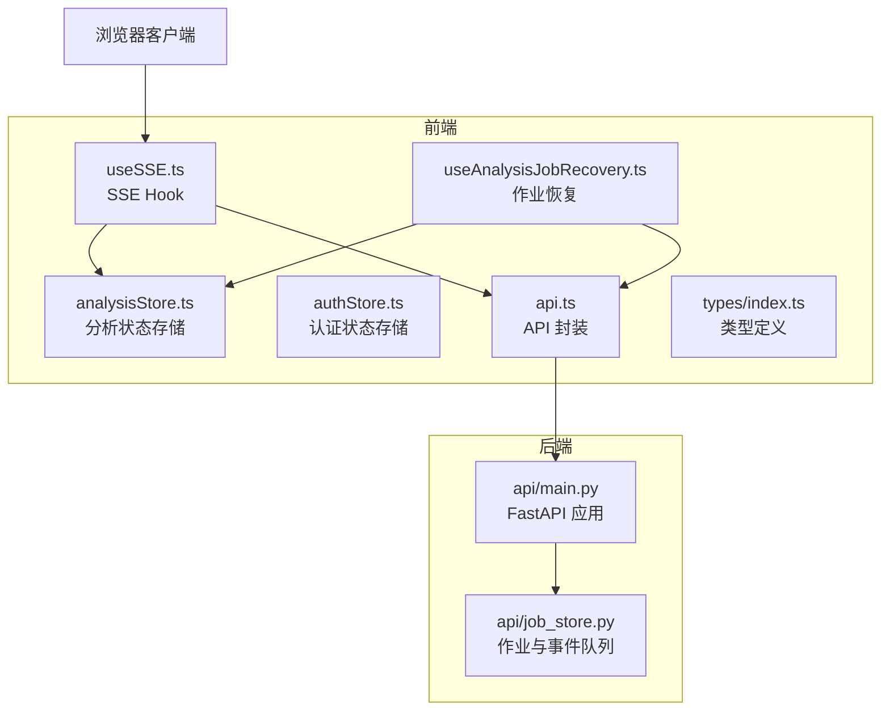
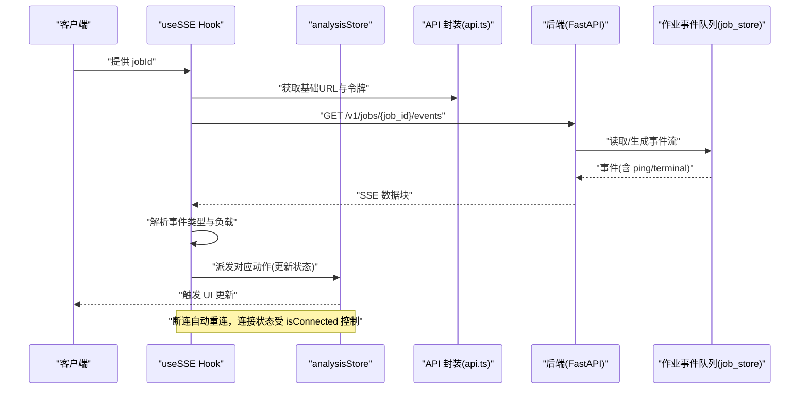
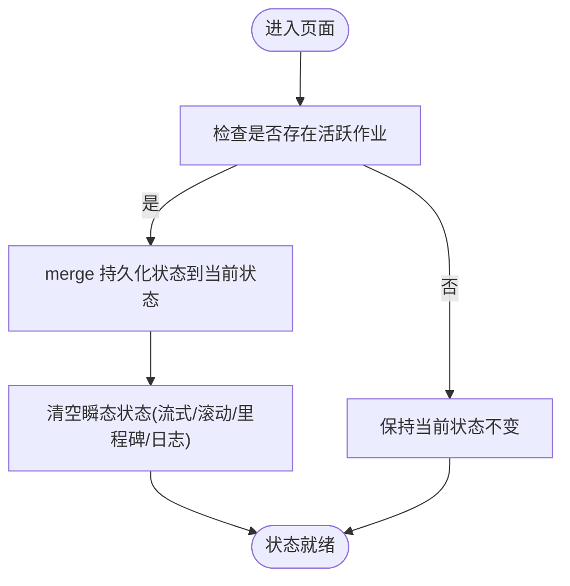
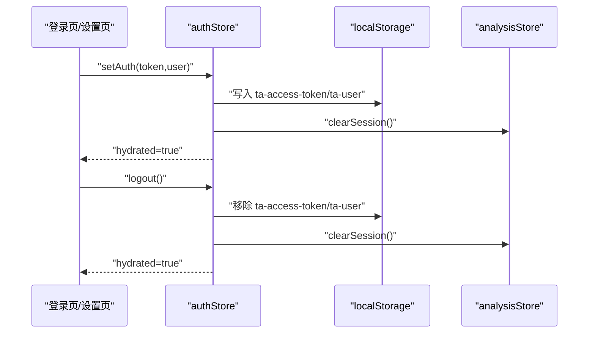
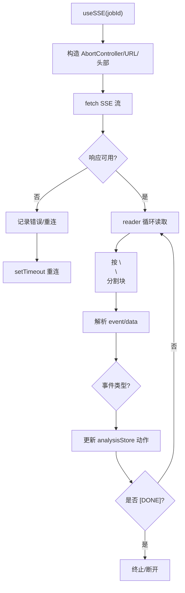
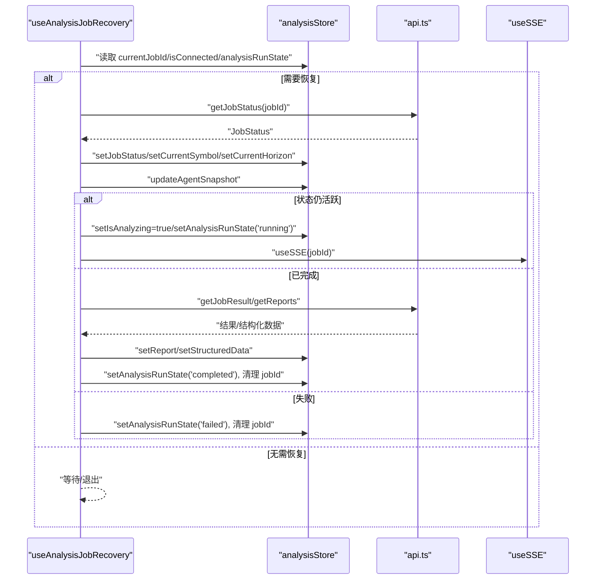
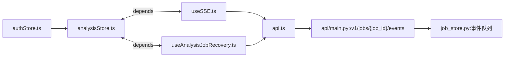

# 状态管理

<cite>
**本文引用的文件**
- [analysisStore.ts](file://frontend/src/stores/analysisStore.ts)
- [authStore.ts](file://frontend/src/stores/authStore.ts)
- [useSSE.ts](file://frontend/src/hooks/useSSE.ts)
- [useAnalysisJobRecovery.ts](file://frontend/src/hooks/useAnalysisJobRecovery.ts)
- [api.ts](file://frontend/src/services/api.ts)
- [index.ts](file://frontend/src/types/index.ts)
- [main.py](file://api/main.py)
- [job_store.py](file://api/job_store.py)
</cite>

## 目录
1. [引言](#引言)
2. [项目结构](#项目结构)
3. [核心组件](#核心组件)
4. [架构总览](#架构总览)
5. [组件详解](#组件详解)
6. [依赖关系分析](#依赖关系分析)
7. [性能考量](#性能考量)
8. [故障排查指南](#故障排查指南)
9. [结论](#结论)
10. [附录](#附录)

## 引言
本文件面向 TradingAgents-AShare 前端的状态管理子系统，聚焦于 Pinia/Zustand 驱动的状态存储与实时事件流。文档围绕以下目标展开：
- 深入解析 analysisStore 分析状态存储的架构与实现原理
- 解释 authStore 认证状态存储的设计模式与使用方法
- 阐述实时数据同步机制与服务器推送事件（SSE）的集成与处理流程
- 深入分析 useSSE 自定义 Hook 的实现细节与 useAnalysisJobRecovery 恢复机制的工作原理
- 提供状态管理最佳实践、性能优化策略与调试技巧
- 给出状态持久化、跨组件数据共享与异步状态处理的解决方案

## 项目结构
前端状态管理位于 frontend/src，核心文件如下：
- stores：状态存储层（analysisStore.ts、authStore.ts）
- hooks：自定义 Hook（useSSE.ts、useAnalysisJobRecovery.ts）
- services：API 封装（api.ts）
- types：类型定义（index.ts）
- 后端 API（FastAPI）提供 SSE 事件流与作业状态查询（api/main.py、api/job_store.py）

图表来源
- [analysisStore.ts:1-524](file://frontend/src/stores/analysisStore.ts#L1-L524)
- [authStore.ts:1-56](file://frontend/src/stores/authStore.ts#L1-L56)
- [useSSE.ts:1-416](file://frontend/src/hooks/useSSE.ts#L1-L416)
- [useAnalysisJobRecovery.ts:1-127](file://frontend/src/hooks/useAnalysisJobRecovery.ts#L1-L127)
- [api.ts:1-452](file://frontend/src/services/api.ts#L1-L452)
- [main.py:2960-2970](file://api/main.py#L2960-L2970)
- [job_store.py:240-306](file://api/job_store.py#L240-L306)

章节来源
- [analysisStore.ts:1-524](file://frontend/src/stores/analysisStore.ts#L1-L524)
- [authStore.ts:1-56](file://frontend/src/stores/authStore.ts#L1-L56)
- [useSSE.ts:1-416](file://frontend/src/hooks/useSSE.ts#L1-L416)
- [useAnalysisJobRecovery.ts:1-127](file://frontend/src/hooks/useAnalysisJobRecovery.ts#L1-L127)
- [api.ts:1-452](file://frontend/src/services/api.ts#L1-L452)
- [main.py:2960-2970](file://api/main.py#L2960-L2970)
- [job_store.py:240-306](file://api/job_store.py#L240-L306)

## 核心组件
- analysisStore：基于 Zustand 的分析状态中心，负责作业状态、代理状态、报告、聊天消息、里程碑、对战消息、日志、运行状态等的集中管理，并通过持久化中间件实现关键状态的本地持久化与合并策略。
- authStore：基于 Zustand 的认证状态中心，负责用户信息、令牌、Hydration（从本地存储恢复）、登录/登出与会话清理。
- useSSE：封装 SSE 连接与事件解析，将后端事件映射到 analysisStore 的动作，驱动 UI 实时更新。
- useAnalysisJobRecovery：在页面刷新或断连后，通过轮询后端作业状态进行恢复，必要时回补已完成结果与结构化数据。

章节来源
- [analysisStore.ts:187-524](file://frontend/src/stores/analysisStore.ts#L187-L524)
- [authStore.ts:16-56](file://frontend/src/stores/authStore.ts#L16-L56)
- [useSSE.ts:6-416](file://frontend/src/hooks/useSSE.ts#L6-L416)
- [useAnalysisJobRecovery.ts:11-127](file://frontend/src/hooks/useAnalysisJobRecovery.ts#L11-L127)

## 架构总览
整体架构采用“前端状态 + SSE 实时事件 + 后端作业与事件队列”的模式：
- 前端通过 analysisStore 统一管理分析生命周期内的所有状态
- 通过 useSSE 建立与后端的 SSE 连接，接收作业状态、代理状态、报告片段、里程碑、对战消息等事件
- useAnalysisJobRecovery 在连接断开或页面刷新后，主动轮询后端作业状态，恢复 UI 与数据
- authStore 负责认证上下文，影响 SSE 访问权限与会话清理

图表来源
- [useSSE.ts:388-385](file://frontend/src/hooks/useSSE.ts#L388-L385)
- [api.ts:46-62](file://frontend/src/services/api.ts#L46-L62)
- [main.py:2962-2969](file://api/main.py#L2962-L2969)
- [job_store.py:240-276](file://api/job_store.py#L240-L276)

## 组件详解

### analysisStore：分析状态存储
- 设计要点
  - 使用 Zustand 的 create 与 persist 中间件，将关键分析状态持久化到 localStorage
  - 通过 partialize/merge 策略，仅持久化“活跃作业”相关状态，避免刷新后残留过期数据
  - 提供丰富的动作函数，覆盖作业状态、代理状态、报告片段、聊天消息、里程碑、对战消息、日志、运行状态等
  - 对聊天消息与对战消息采用 upsert/追加策略，保证流式渲染与滚动一致性
- 关键状态域
  - 当前作业：currentJobId、currentSymbol、jobStatus、currentHorizon
  - 代理团队：agents（初始预设 15 个代理）
  - 报告与结构化数据：report、riskItems、keyMetrics、jobConfidence、jobTargetPrice、jobStopLoss
  - 流式报告：streamingSections（打字机效果缓冲与显示）
  - 交互与展示：milestones、debateMessages、debateScrollTick、chatMessages、logs
  - 运行状态：isAnalyzing、isConnected、analysisRunState、analysisRunError
- 持久化与恢复
  - hasActivePersistedJob 判断是否处于“活跃作业”状态
  - partialize 过滤掉瞬态消息，merge 将持久化状态与当前内存状态合并，恢复运行态与会话

图表来源
- [analysisStore.ts:499-522](file://frontend/src/stores/analysisStore.ts#L499-L522)
- [analysisStore.ts:153-162](file://frontend/src/stores/analysisStore.ts#L153-L162)

章节来源
- [analysisStore.ts:42-120](file://frontend/src/stores/analysisStore.ts#L42-L120)
- [analysisStore.ts:187-524](file://frontend/src/stores/analysisStore.ts#L187-L524)

### authStore：认证状态存储
- 设计要点
  - 存储用户信息与访问令牌，支持 Hydration（从本地存储恢复）
  - 登录成功写入本地存储并清理分析会话，登出删除本地存储并清理分析会话
  - 通过 api.getMe 验证令牌有效性，异常时清理本地存储并标记未水合
- 与 analysisStore 的协作
  - setAuth/logout 会调用 analysisStore.getState().clearSession()，确保认证切换时会话一致

图表来源
- [authStore.ts:22-34](file://frontend/src/stores/authStore.ts#L22-L34)
- [authStore.ts:36-54](file://frontend/src/stores/authStore.ts#L36-L54)

章节来源
- [authStore.ts:6-14](file://frontend/src/stores/authStore.ts#L6-L14)
- [authStore.ts:16-56](file://frontend/src/stores/authStore.ts#L16-L56)

### useSSE：SSE 自定义 Hook
- 功能概述
  - 建立与后端的 SSE 连接，解析事件块，将事件映射到 analysisStore 的动作
  - 支持断连自动重连，维护连接状态 isConnected 与重试 tick
  - 处理多种事件类型：作业生命周期、代理状态、报告片段、里程碑、对战消息等
- 关键实现细节
  - 连接建立：构造 URL /v1/jobs/{job_id}/events，携带 Bearer 令牌
  - 事件解析：按块解析 event/data，过滤 ping/done，解析 JSON 负载
  - 代理消息去重：按 agent+horizon 维度维护消息映射，首 token 写入标题，后续追加
  - 对战消息：支持 upsert 与流式 token 追加，维护 debateScrollTick
  - 断连与重连：finally 设置 isConnected=false，定时器延迟重连
- 与 analysisStore 的绑定
  - 通过解构 useAnalysisStore 获取所有动作，统一派发状态变更

图表来源
- [useSSE.ts:388-385](file://frontend/src/hooks/useSSE.ts#L388-L385)
- [useSSE.ts:288-357](file://frontend/src/hooks/useSSE.ts#L288-L357)
- [useSSE.ts:46-54](file://frontend/src/hooks/useSSE.ts#L46-L54)

章节来源
- [useSSE.ts:6-416](file://frontend/src/hooks/useSSE.ts#L6-L416)

### useAnalysisJobRecovery：作业恢复机制
- 功能概述
  - 在页面刷新或断连后，根据 currentJobId 轮询后端作业状态，恢复 UI 与数据
  - 若作业已完成，尝试回补报告与结构化数据
- 关键逻辑
  - isActiveJob 判断作业是否仍处于 pending/running
  - reconcile：轮询 getJobStatus，更新 jobStatus、symbol、currentHorizon、agents 快照
  - 若作业完成：setAnalysisRunState('completed')，调用 getJobResult 与 getReports 回补数据
  - 若作业失败：setAnalysisRunState('failed')，清理作业 ID
  - useSSE(streamJobId)：当存在活跃作业且未连接时，自动发起 SSE 流

图表来源
- [useAnalysisJobRecovery.ts:11-127](file://frontend/src/hooks/useAnalysisJobRecovery.ts#L11-L127)
- [api.ts:113-119](file://frontend/src/services/api.ts#L113-L119)

章节来源
- [useAnalysisJobRecovery.ts:11-127](file://frontend/src/hooks/useAnalysisJobRecovery.ts#L11-L127)

### 类型系统与事件契约
- 类型定义
  - JobStatus、Agent、AnalysisReport、RiskItem、KeyMetric、LogEntry 等核心类型
  - SSEEventType 与各类事件接口（AgentStatusEvent、AgentTokenEvent、AgentReportEvent、AgentMilestoneEvent、AgentDebateEvent 等）
- 事件契约
  - 前端 useSSE 按事件类型分支处理，将负载映射到 analysisStore 的动作
  - 后端通过 job_store.py 维护每作业事件队列，支持 ping 保活与终端事件终止

章节来源
- [index.ts:107-121](file://frontend/src/types/index.ts#L107-L121)
- [index.ts:123-151](file://frontend/src/types/index.ts#L123-L151)
- [index.ts:153-231](file://frontend/src/types/index.ts#L153-L231)
- [job_store.py:240-276](file://api/job_store.py#L240-L276)

## 依赖关系分析
- 前端依赖链
  - analysisStore 作为状态中枢，被 useSSE 与 useAnalysisJobRecovery 依赖
  - useSSE 依赖 api.ts 获取基础 URL 与令牌，依赖 analysisStore 动作更新状态
  - useAnalysisJobRecovery 依赖 api.ts 查询作业状态与结果，依赖 analysisStore 更新状态
  - authStore 依赖 analysisStore.clearSession 进行会话清理
- 后端依赖链
  - FastAPI 路由 /v1/jobs/{job_id}/events 返回 SSE 流
  - job_store.py 提供作业事件队列与 ping/terminal 语义，保障长连接稳定性

图表来源
- [analysisStore.ts:187-524](file://frontend/src/stores/analysisStore.ts#L187-L524)
- [useSSE.ts:13-37](file://frontend/src/hooks/useSSE.ts#L13-L37)
- [useAnalysisJobRecovery.ts:15-25](file://frontend/src/hooks/useAnalysisJobRecovery.ts#L15-L25)
- [authStore.ts:25-32](file://frontend/src/stores/authStore.ts#L25-L32)
- [api.ts:46-62](file://frontend/src/services/api.ts#L46-L62)
- [main.py:2962-2969](file://api/main.py#L2962-L2969)
- [job_store.py:240-276](file://api/job_store.py#L240-L276)

章节来源
- [analysisStore.ts:187-524](file://frontend/src/stores/analysisStore.ts#L187-L524)
- [useSSE.ts:13-37](file://frontend/src/hooks/useSSE.ts#L13-L37)
- [useAnalysisJobRecovery.ts:15-25](file://frontend/src/hooks/useAnalysisJobRecovery.ts#L15-L25)
- [authStore.ts:25-32](file://frontend/src/stores/authStore.ts#L25-L32)
- [api.ts:46-62](file://frontend/src/services/api.ts#L46-L62)
- [main.py:2962-2969](file://api/main.py#L2962-L2969)
- [job_store.py:240-276](file://api/job_store.py#L240-L276)

## 性能考量
- 状态持久化与内存占用
  - 通过 partialize/merge 仅持久化活跃作业相关状态，避免刷新后残留过期数据
  - 使用 debounce 包装 localStorage 写入，降低主线程阻塞风险
- SSE 连接与重连
  - 断连自动重连，指数退避友好策略（当前为固定 3 秒重连间隔），可根据需要扩展为指数退避
  - 读取器循环按块解析，避免一次性解析大块文本导致卡顿
- UI 渲染优化
  - 流式报告采用 buffer/displayed 双缓冲，结合组件内部节流/动画，减少频繁重绘
  - 对战消息 upsert 与滚动 tick 增量更新，避免全量重排
- 后端事件队列
  - 作业事件队列带上限，溢出丢弃旧事件，防止内存膨胀
  - ping 保活与终端事件终止，确保连接生命周期可控

章节来源
- [analysisStore.ts:164-185](file://frontend/src/stores/analysisStore.ts#L164-L185)
- [useSSE.ts:388-400](file://frontend/src/hooks/useSSE.ts#L388-L400)
- [job_store.py:193-214](file://api/job_store.py#L193-L214)

## 故障排查指南
- SSE 连接失败
  - 检查 getAuthToken 是否正确返回令牌，确认 Authorization 头是否携带
  - 查看控制台错误与日志，确认断连回调是否触发重连
  - 确认后端 /v1/jobs/{job_id}/events 路由可访问且返回 200 文本事件流
- 作业状态不同步
  - 使用 useAnalysisJobRecovery 的轮询逻辑，确认 getJobStatus 返回值与 agents 快照
  - 若已完成，检查 getJobResult 与 getReports 是否能成功回补数据
- 本地持久化异常
  - 检查 hasActivePersistedJob 判断逻辑，确认活跃作业判定
  - 确认 merge 合并策略是否正确覆盖 transient 状态
- 认证相关问题
  - 登录/登出后是否调用 clearSession 清理分析会话
  - Hydration 时 api.getMe 是否抛错，导致本地存储被清理

章节来源
- [useSSE.ts:335-351](file://frontend/src/hooks/useSSE.ts#L335-L351)
- [useAnalysisJobRecovery.ts:66-103](file://frontend/src/hooks/useAnalysisJobRecovery.ts#L66-L103)
- [authStore.ts:22-34](file://frontend/src/stores/authStore.ts#L22-L34)

## 结论
本状态管理方案以 analysisStore 为核心，结合 useSSE 与 useAnalysisJobRecovery，实现了从“作业创建/运行/完成/失败”的全生命周期状态管理与实时同步。通过持久化策略与断连恢复机制，确保用户体验在刷新与网络波动下的连续性。配合清晰的类型定义与后端事件队列，系统具备良好的可维护性与扩展性。

## 附录
- 最佳实践
  - 优先使用 analysisStore 的动作函数更新状态，避免直接修改状态
  - 在组件卸载时调用 useSSE 的 disconnect，释放资源
  - 对于高频事件（如 token 流），结合前端节流与组件内部渲染优化
- 跨组件数据共享
  - 将分析状态集中在 analysisStore，通过 selector 选择性订阅，减少无关重渲染
- 异步状态处理
  - 使用 analysisRunState 与 isConnected 明确区分“准备中/运行中/已完成/失败/断开”等状态
- 状态持久化
  - 仅持久化活跃作业相关状态，避免过期数据污染
- 调试技巧
  - 在 useSSE 中增加事件日志，便于定位事件类型与负载
  - 在 analysisStore 中为关键动作添加日志，追踪状态变化轨迹