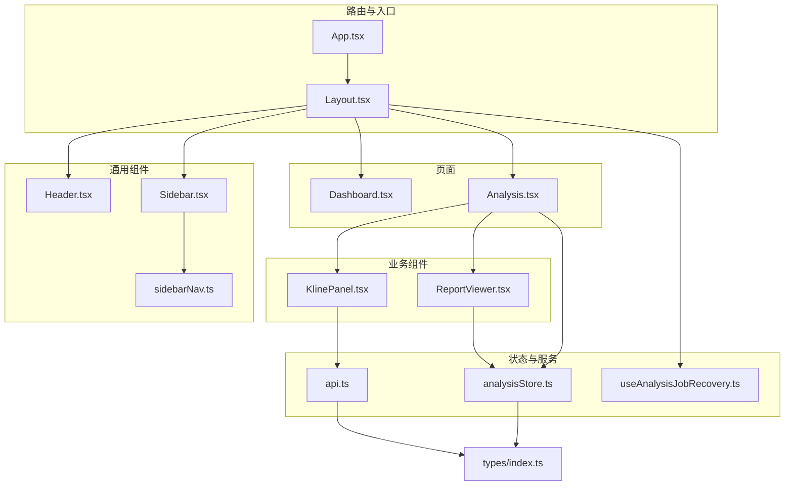
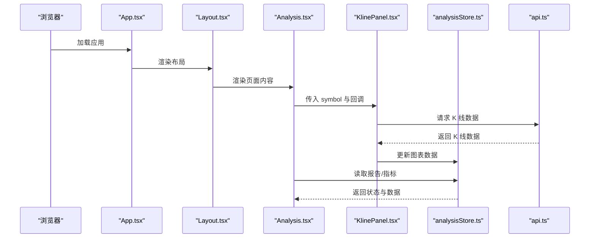
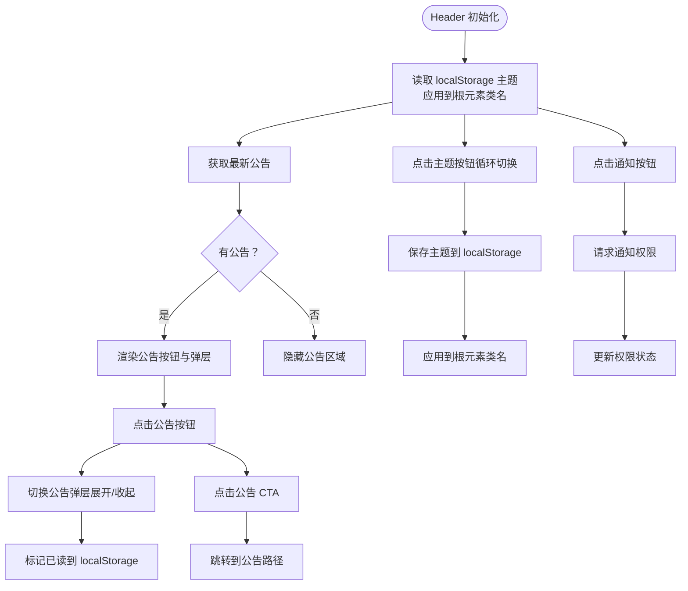
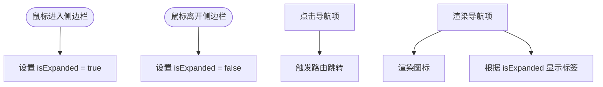
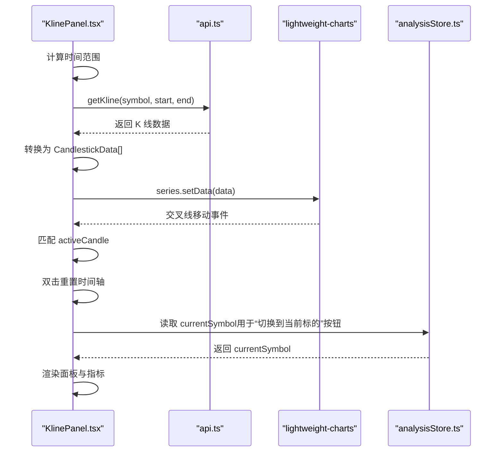
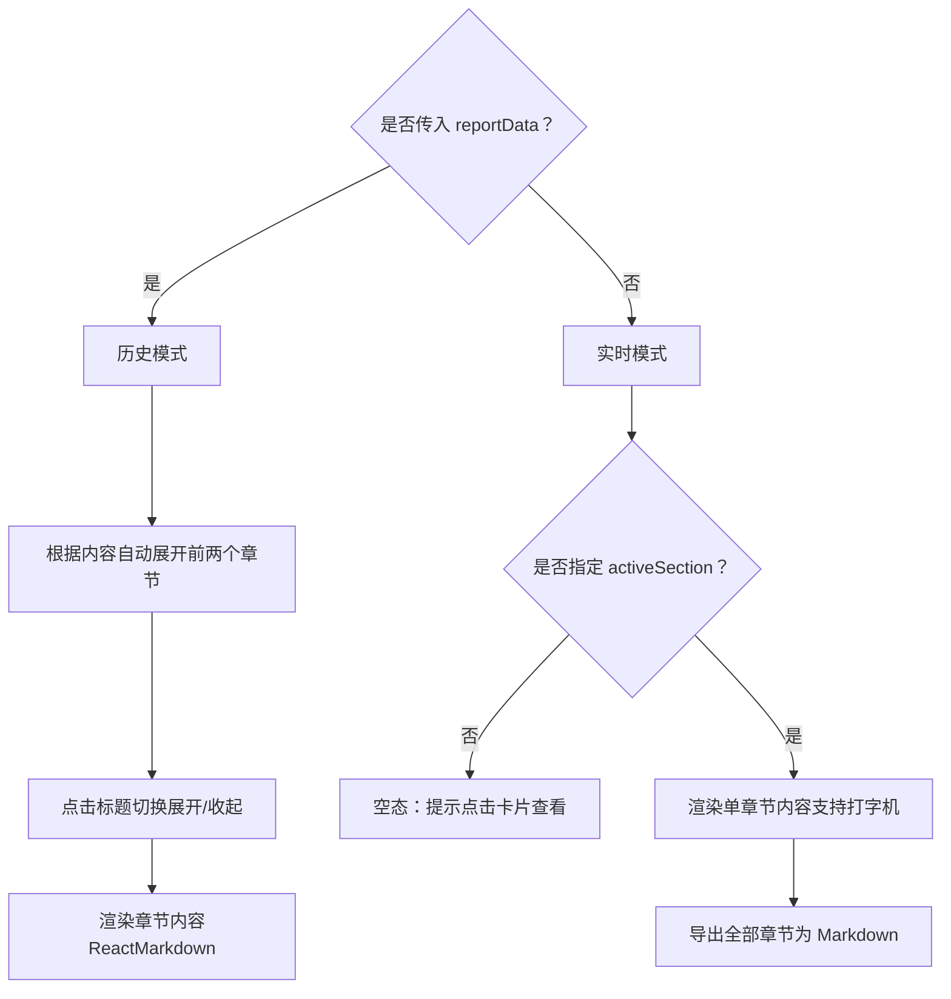
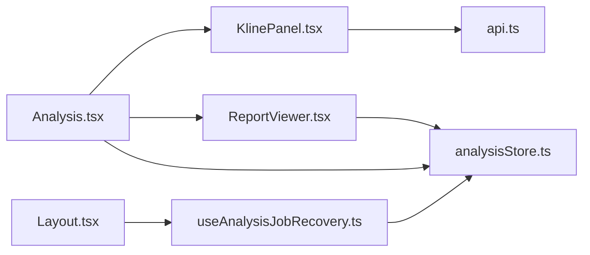
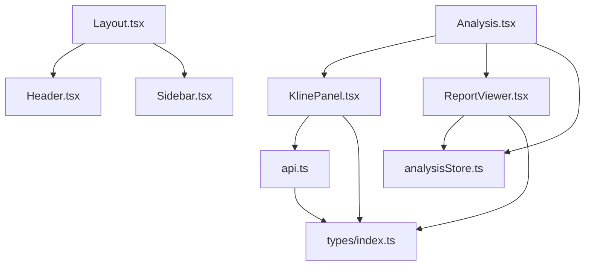

# 组件系统

<cite>
**本文引用的文件列表**
- [App.tsx](file://frontend/src/App.tsx)
- [Layout.tsx](file://frontend/src/components/Layout.tsx)
- [Header.tsx](file://frontend/src/components/Header.tsx)
- [Sidebar.tsx](file://frontend/src/components/Sidebar.tsx)
- [sidebarNav.ts](file://frontend/src/components/sidebarNav.ts)
- [KlinePanel.tsx](file://frontend/src/components/KlinePanel.tsx)
- [ReportViewer.tsx](file://frontend/src/components/ReportViewer.tsx)
- [analysisStore.ts](file://frontend/src/stores/analysisStore.ts)
- [api.ts](file://frontend/src/services/api.ts)
- [useAnalysisJobRecovery.ts](file://frontend/src/hooks/useAnalysisJobRecovery.ts)
- [Dashboard.tsx](file://frontend/src/pages/Dashboard.tsx)
- [Analysis.tsx](file://frontend/src/pages/Analysis.tsx)
- [index.ts](file://frontend/src/types/index.ts)
</cite>

## 目录
1. [简介](#简介)
2. [项目结构](#项目结构)
3. [核心组件](#核心组件)
4. [架构总览](#架构总览)
5. [组件详解](#组件详解)
6. [依赖关系分析](#依赖关系分析)
7. [性能考量](#性能考量)
8. [故障排查指南](#故障排查指南)
9. [结论](#结论)
10. [附录](#附录)

## 简介
本文件面向 TradingAgents-AShare 的前端组件系统，聚焦于核心 UI 组件的设计理念与实现细节，包括 Layout 布局、Header 头部、Sidebar 侧边栏、KlinePanel 图表面板、ReportViewer 报告查看器等。文档从 props 接口、状态管理、事件处理、样式设计、组件间通信、数据流与生命周期等方面进行深入剖析，并提供使用示例、最佳实践、性能优化建议以及测试与调试策略，帮助开发者高效理解与扩展该组件体系。

## 项目结构
前端采用按功能域组织的目录结构，核心组件位于 frontend/src/components，页面位于 frontend/src/pages，全局状态通过 Zustand 的 analysisStore 管理，类型定义集中在 frontend/src/types/index.ts，API 封装在 frontend/src/services/api.ts 中。

**图表来源**
- [App.tsx:45-75](file://frontend/src/App.tsx#L45-L75)
- [Layout.tsx:10-24](file://frontend/src/components/Layout.tsx#L10-L24)
- [Header.tsx:25-319](file://frontend/src/components/Header.tsx#L25-L319)
- [Sidebar.tsx:11-71](file://frontend/src/components/Sidebar.tsx#L11-L71)
- [sidebarNav.ts:19-28](file://frontend/src/components/sidebarNav.ts#L19-L28)
- [Analysis.tsx:47-139](file://frontend/src/pages/Analysis.tsx#L47-L139)
- [KlinePanel.tsx:79-332](file://frontend/src/components/KlinePanel.tsx#L79-L332)
- [ReportViewer.tsx:50-253](file://frontend/src/components/ReportViewer.tsx#L50-L253)
- [analysisStore.ts:187-523](file://frontend/src/stores/analysisStore.ts#L187-L523)
- [api.ts:64-451](file://frontend/src/services/api.ts#L64-L451)
- [useAnalysisJobRecovery.ts:11-126](file://frontend/src/hooks/useAnalysisJobRecovery.ts#L11-L126)
- [Dashboard.tsx:10-194](file://frontend/src/pages/Dashboard.tsx#L10-L194)

**Section sources**
- [App.tsx:45-75](file://frontend/src/App.tsx#L45-L75)
- [Layout.tsx:10-24](file://frontend/src/components/Layout.tsx#L10-L24)
- [Analysis.tsx:47-139](file://frontend/src/pages/Analysis.tsx#L47-L139)

## 核心组件
- Layout：应用主布局容器，负责挂载 Sidebar、Header 与页面内容，统一背景与栅格布局。
- Header：顶部导航栏，集成主题切换、通知权限、用户菜单、公告弹层、外部链接等。
- Sidebar：左侧导航，动态展开/收起，绑定路由导航项与构建信息展示。
- KlinePanel：K线图表面板，集成 lightweight-charts，支持主题切换、跨线移动、双击缩放、窗口尺寸变化响应、数据加载与错误提示。
- ReportViewer：报告查看器，支持历史报告与实时流式报告两种模式，提供导出 Markdown、章节折叠、免责声明渲染等。

**Section sources**
- [Layout.tsx:10-24](file://frontend/src/components/Layout.tsx#L10-L24)
- [Header.tsx:25-319](file://frontend/src/components/Header.tsx#L25-L319)
- [Sidebar.tsx:11-71](file://frontend/src/components/Sidebar.tsx#L11-L71)
- [KlinePanel.tsx:79-332](file://frontend/src/components/KlinePanel.tsx#L79-L332)
- [ReportViewer.tsx:50-253](file://frontend/src/components/ReportViewer.tsx#L50-L253)

## 架构总览
组件系统围绕“页面 + 业务组件 + 通用组件 + 状态与服务”的分层设计：
- 页面层负责编排业务组件与交互逻辑，如 Analysis 页面整合 KlinePanel、ReportViewer、Agent 协作等。
- 业务组件独立封装复杂 UI 与数据处理，如 KlinePanel 独立管理图表实例与数据流。
- 通用组件提供一致的视觉与交互体验，如 Header、Sidebar。
- 状态与服务层通过 Zustand store 与 API 服务抽象，屏蔽异步与持久化细节。

**图表来源**
- [App.tsx:45-75](file://frontend/src/App.tsx#L45-L75)
- [Layout.tsx:10-24](file://frontend/src/components/Layout.tsx#L10-L24)
- [Analysis.tsx:47-139](file://frontend/src/pages/Analysis.tsx#L47-L139)
- [KlinePanel.tsx:218-263](file://frontend/src/components/KlinePanel.tsx#L218-L263)
- [analysisStore.ts:187-523](file://frontend/src/stores/analysisStore.ts#L187-L523)
- [api.ts:121-126](file://frontend/src/services/api.ts#L121-L126)

## 组件详解

### Layout 布局组件
- 设计理念：最小化布局骨架，统一背景与栅格，将 Sidebar、Header 与页面内容组合为一致的主框架。
- Props 接口：children（ReactNode），无额外属性。
- 状态与生命周期：内部无本地状态，依赖 useAnalysisJobRecovery 在挂载时恢复分析作业状态。
- 事件处理：无显式事件处理，通过子组件触发状态变更。
- 样式设计：使用 Tailwind 类控制最小高度、背景色、flex 布局与主区域留白。
- 数据流：接收页面内容作为插槽，不直接消费 store 或 API。

**Section sources**
- [Layout.tsx:6-24](file://frontend/src/components/Layout.tsx#L6-L24)
- [useAnalysisJobRecovery.ts:11-31](file://frontend/src/hooks/useAnalysisJobRecovery.ts#L11-L31)

### Header 头部组件
- 设计理念：顶部信息中枢，提供主题切换、通知权限、用户菜单、公告弹层、外部链接等。
- Props 接口：无。
- 状态与生命周期：
  - 主题模式：本地状态 themeMode，持久化到 localStorage；监听系统主题变化。
  - 通知权限：本地状态 notifPermission，请求浏览器通知权限。
  - 用户菜单：本地状态 menuOpen，点击外部区域自动关闭。
  - 公告弹层：本地状态 announcementOpen，点击外部区域自动关闭；基于 localStorage 标记已读。
- 事件处理：
  - 主题循环切换：更新 themeMode 并应用到根元素类名。
  - 通知开关：请求权限并更新权限状态。
  - 用户菜单：点击头像按钮切换展开/收起；点击“我的报告”、“模型设置”、“退出登录”触发导航或登出。
  - 公告弹层：点击公告按钮切换展开/收起；支持跳转到公告详情页。
- 样式设计：使用 backdrop-blur、sticky、z-index 等实现粘性定位与毛玻璃效果；根据主题切换类名。
- 数据流：从 authStore 获取用户信息；通过 api.getLatestAnnouncement 获取最新公告；本地存储主题与公告已读状态。

**图表来源**
- [Header.tsx:36-70](file://frontend/src/components/Header.tsx#L36-L70)
- [Header.tsx:79-95](file://frontend/src/components/Header.tsx#L79-L95)
- [Header.tsx:107-113](file://frontend/src/components/Header.tsx#L107-L113)
- [Header.tsx:198-314](file://frontend/src/components/Header.tsx#L198-L314)

**Section sources**
- [Header.tsx:25-319](file://frontend/src/components/Header.tsx#L25-L319)
- [api.ts:173-176](file://frontend/src/services/api.ts#L173-L176)

### Sidebar 侧边栏组件
- 设计理念：紧凑的左侧导航，支持悬停展开/收起，统一图标与标签，底部展示构建信息。
- Props 接口：无。
- 状态与生命周期：本地状态 isExpanded，鼠标进入/离开时切换。
- 事件处理：NavLink 自动高亮当前路由；点击导航项触发路由跳转。
- 样式设计：固定定位、backdrop-blur、过渡动画；根据 isExpanded 控制宽度与文本显示。
- 数据流：从 sidebarNav.ts 导入导航项数组，动态渲染。

**图表来源**
- [Sidebar.tsx:11-71](file://frontend/src/components/Sidebar.tsx#L11-L71)
- [sidebarNav.ts:19-28](file://frontend/src/components/sidebarNav.ts#L19-L28)

**Section sources**
- [Sidebar.tsx:11-71](file://frontend/src/components/Sidebar.tsx#L11-L71)
- [sidebarNav.ts:13-28](file://frontend/src/components/sidebarNav.ts#L13-L28)

### KlinePanel 图表组件
- 设计理念：以轻量级 K 线图为载体，提供多指标展示、主题适配、跨线移动、双击缩放、窗口自适应与错误提示。
- Props 接口：
  - symbol: string（必填）
  - onSymbolChange?: (symbol: string) => void（可选）
- 状态与生命周期：
  - 本地状态：loading、error、isDark、candles、activeCandle、expandedIndex。
  - 监听主题变化：MutationObserver 观察根元素类名变化，动态更新 isDark。
  - 首次挂载：创建图表实例、添加蜡烛图序列、订阅交叉线移动与双击事件、注册窗口 resize 回调。
  - 卸载清理：移除事件监听、销毁图表实例。
- 事件处理：
  - 交叉线移动：根据时间轴匹配最近 K 线，更新 activeCandle。
  - 双击：重置时间轴范围为内容适配。
  - 窗口 resize：调整图表宽高。
  - 符号切换：调用 onSymbolChange 回调。
- 样式设计：相对定位容器，绝对定位图表画布；加载与错误状态以浮层提示。
- 数据流：
  - 计算时间范围（近 180 天）。
  - 通过 api.getKline 获取 K 线数据，转换为 Lightweight Charts 的 CandlestickData 格式。
  - 更新 series.setData 并 fitContent。
  - 错误时清空数据并设置错误文案。

**图表来源**
- [KlinePanel.tsx:91-108](file://frontend/src/components/KlinePanel.tsx#L91-L108)
- [KlinePanel.tsx:117-216](file://frontend/src/components/KlinePanel.tsx#L117-L216)
- [KlinePanel.tsx:218-263](file://frontend/src/components/KlinePanel.tsx#L218-L263)
- [KlinePanel.tsx:79-332](file://frontend/src/components/KlinePanel.tsx#L79-L332)
- [api.ts:121-126](file://frontend/src/services/api.ts#L121-L126)
- [analysisStore.ts:80-80](file://frontend/src/stores/analysisStore.ts#L80-L80)

**Section sources**
- [KlinePanel.tsx:79-332](file://frontend/src/components/KlinePanel.tsx#L79-L332)
- [api.ts:121-126](file://frontend/src/services/api.ts#L121-L126)
- [analysisStore.ts:80-80](file://frontend/src/stores/analysisStore.ts#L80-L80)

### ReportViewer 报告查看器
- 设计理念：支持历史报告与实时流式报告两种模式，提供章节折叠、导出 Markdown、免责声明渲染与空态提示。
- Props 接口：
  - reportData?: ReportDetail（历史模式传入）
  - activeSection?: string（实时模式下指定当前激活章节）
- 状态与生命周期：
  - 本地状态：expandedSections（历史模式下的展开章节）。
  - 历史模式：首次渲染时自动展开前两个含内容的章节。
  - 实时模式：根据 activeSection 渲染对应章节内容。
- 事件处理：
  - 历史模式：点击章节标题切换展开/收起。
  - 导出：将各章节内容拼接为 Markdown 并触发下载。
- 样式设计：卡片容器、折叠面板、免责声明气泡样式。
- 数据流：
  - 历史模式：直接从 reportData 读取各章节字符串。
  - 实时模式：从 analysisStore 的 report 与 streamingSections 读取；支持打字机效果（组件内控制显示进度）。

**图表来源**
- [ReportViewer.tsx:50-84](file://frontend/src/components/ReportViewer.tsx#L50-L84)
- [ReportViewer.tsx:85-105](file://frontend/src/components/ReportViewer.tsx#L85-L105)
- [ReportViewer.tsx:167-252](file://frontend/src/components/ReportViewer.tsx#L167-L252)

**Section sources**
- [ReportViewer.tsx:43-253](file://frontend/src/components/ReportViewer.tsx#L43-L253)
- [analysisStore.ts:51-51](file://frontend/src/stores/analysisStore.ts#L51-L51)

### 组件间通信与数据流
- Analysis 页面作为编排者，向 KlinePanel 传递 symbol 与 onSymbolChange 回调；向 ReportViewer 传递 activeSection；同时读取 analysisStore 的 report、指标与状态。
- KlinePanel 通过 api.ts 发起请求，返回 K 线数据并更新图表；同时读取 analysisStore 的 currentSymbol 以支持“切换到当前标的”。
- ReportViewer 在历史模式下直接消费 reportData；在实时模式下消费 analysisStore 的 report 与 streamingSections。
- Layout 通过 useAnalysisJobRecovery 在挂载时恢复分析作业状态，避免页面刷新导致的状态丢失。

**图表来源**
- [Analysis.tsx:47-139](file://frontend/src/pages/Analysis.tsx#L47-L139)
- [KlinePanel.tsx:79-332](file://frontend/src/components/KlinePanel.tsx#L79-L332)
- [ReportViewer.tsx:50-253](file://frontend/src/components/ReportViewer.tsx#L50-L253)
- [analysisStore.ts:187-523](file://frontend/src/stores/analysisStore.ts#L187-L523)
- [useAnalysisJobRecovery.ts:11-126](file://frontend/src/hooks/useAnalysisJobRecovery.ts#L11-L126)

**Section sources**
- [Analysis.tsx:47-139](file://frontend/src/pages/Analysis.tsx#L47-L139)
- [KlinePanel.tsx:79-332](file://frontend/src/components/KlinePanel.tsx#L79-L332)
- [ReportViewer.tsx:50-253](file://frontend/src/components/ReportViewer.tsx#L50-L253)
- [analysisStore.ts:187-523](file://frontend/src/stores/analysisStore.ts#L187-L523)
- [useAnalysisJobRecovery.ts:11-126](file://frontend/src/hooks/useAnalysisJobRecovery.ts#L11-L126)

## 依赖关系分析
- 组件依赖：
  - Layout 依赖 Header、Sidebar 与页面内容。
  - Analysis 依赖 KlinePanel、ReportViewer、Agent 协作组件与 store。
  - KlinePanel 依赖 api 与 analysisStore。
  - ReportViewer 依赖 analysisStore 与工具函数。
- 外部依赖：
  - lightweight-charts：K 线图表库。
  - react-router-dom：路由与导航。
  - lucide-react：图标库。
  - react-markdown + remark-gfm：Markdown 渲染。
  - Zustand：状态管理。
  - Tailwind CSS：样式工具。

**图表来源**
- [Layout.tsx:10-24](file://frontend/src/components/Layout.tsx#L10-L24)
- [Analysis.tsx:47-139](file://frontend/src/pages/Analysis.tsx#L47-L139)
- [KlinePanel.tsx:79-332](file://frontend/src/components/KlinePanel.tsx#L79-L332)
- [ReportViewer.tsx:50-253](file://frontend/src/components/ReportViewer.tsx#L50-L253)
- [api.ts:64-451](file://frontend/src/services/api.ts#L64-L451)
- [analysisStore.ts:187-523](file://frontend/src/stores/analysisStore.ts#L187-L523)
- [index.ts:1-800](file://frontend/src/types/index.ts#L1-L800)

**Section sources**
- [index.ts:1-800](file://frontend/src/types/index.ts#L1-L800)
- [api.ts:64-451](file://frontend/src/services/api.ts#L64-L451)

## 性能考量
- 图表性能：
  - 使用 MutationObserver 监听主题变化，避免频繁重绘；仅在主题切换时重建图表配置。
  - series.setData 与 fitContent 在数据更新后调用，减少不必要的计算。
  - 双击缩放与窗口 resize 事件绑定/解绑在组件卸载时清理，防止内存泄漏。
- 状态与存储：
  - analysisStore 使用持久化中间件与去抖存储，降低 localStorage 写入频率，避免阻塞主线程。
  - 仅持久化活跃作业相关状态，避免长期占用存储空间。
- 渲染优化：
  - ReportViewer 在历史模式下按需展开章节，减少一次性渲染压力。
  - KlinePanel 使用 useMemo 计算时间范围，避免重复计算。
- 网络与缓存：
  - API 层统一处理错误与非 JSON 响应，避免异常中断。
  - Header 对公告已读状态使用 localStorage 缓存，减少重复请求。

[本节为通用指导，无需特定文件引用]

## 故障排查指南
- 图表不显示或空白：
  - 检查容器尺寸是否正确（resize 事件会调整宽高）。
  - 确认 K 线数据格式转换是否成功（CandlestickData 字段校验）。
  - 查看错误状态是否被设置（error 文案）。
- 主题切换无效：
  - 确认根元素类名是否包含 dark；检查 applyTheme 是否被调用。
- 报告为空：
  - 实时模式下确认 activeSection 是否传入；检查 streamingSections 与 report 是否存在。
  - 历史模式下确认 reportData 是否传入且包含对应章节内容。
- 登录与鉴权：
  - 确认 localStorage 中是否存在 ta-access-token；检查 api.getBaseUrl 与环境变量配置。
- 分析作业恢复：
  - useAnalysisJobRecovery 会在 5 秒周期轮询作业状态；若长时间无响应，检查网络与后端 SSE 连接。

**Section sources**
- [KlinePanel.tsx:218-263](file://frontend/src/components/KlinePanel.tsx#L218-L263)
- [Header.tsx:72-85](file://frontend/src/components/Header.tsx#L72-L85)
- [ReportViewer.tsx:50-84](file://frontend/src/components/ReportViewer.tsx#L50-L84)
- [api.ts:46-53](file://frontend/src/services/api.ts#L46-L53)
- [useAnalysisJobRecovery.ts:66-103](file://frontend/src/hooks/useAnalysisJobRecovery.ts#L66-L103)

## 结论
TradingAgents-AShare 的组件系统以清晰的分层与职责划分实现了高内聚、低耦合的 UI 架构。Layout 提供统一骨架，Header/Sidebar 提供一致的导航与用户交互，KlinePanel 与 ReportViewer 分别承担可视化与内容呈现的核心职责。配合 analysisStore 的状态管理与 API 服务抽象，系统在复杂业务场景下仍保持良好的可维护性与扩展性。建议在后续迭代中进一步完善单元测试与 E2E 测试，持续优化性能与用户体验。

[本节为总结，无需特定文件引用]

## 附录

### 组件使用示例（路径指引）
- 在页面中引入并使用 KlinePanel：
  - [Analysis.tsx:104-111](file://frontend/src/pages/Analysis.tsx#L104-L111)
- 在页面中引入并使用 ReportViewer：
  - [Analysis.tsx:130-132](file://frontend/src/pages/Analysis.tsx#L130-L132)
- 在页面中引入并使用 Header/Sidebar：
  - [App.tsx:56-68](file://frontend/src/App.tsx#L56-L68)
  - [Layout.tsx:10-24](file://frontend/src/components/Layout.tsx#L10-L24)

### 最佳实践
- 组件职责单一：KlinePanel 专注图表渲染与数据转换，ReportViewer 专注报告渲染与导出。
- 状态下沉：将与 UI 无关的状态放入 analysisStore，避免在组件内重复管理。
- 事件解耦：通过回调（onSymbolChange）与 store 通信，降低组件间紧耦合。
- 性能优先：对高频操作（如 resize、主题切换）使用去抖或节流策略。

### 测试策略与调试技巧
- 单元测试：
  - KlinePanel：模拟 api.getKline 返回值，断言 series.setData 调用与错误状态。
  - ReportViewer：传入不同 reportData 与 activeSection，断言渲染结果与导出行为。
  - Header：模拟 localStorage 与 Notification 权限，断言主题切换与公告已读标记。
- 集成测试：
  - 在 Analysis 页面中，验证 KlinePanel 与 ReportViewer 的联动，以及 store 状态变化。
- 调试技巧：
  - 使用浏览器开发者工具观察图表实例与事件绑定情况。
  - 在 analysisStore 中开启持久化调试，观察状态变化与去抖写入时机。
  - 在 Header 中检查 localStorage 中的主题与公告已读键值。

[本节为通用指导，无需特定文件引用]