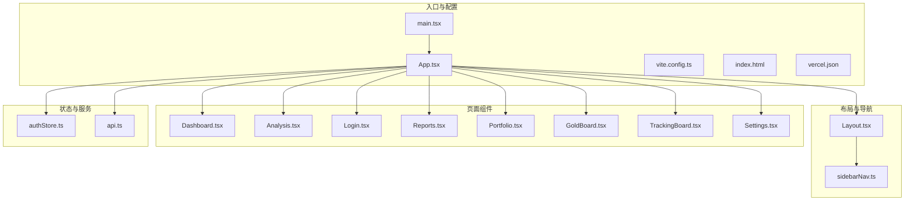
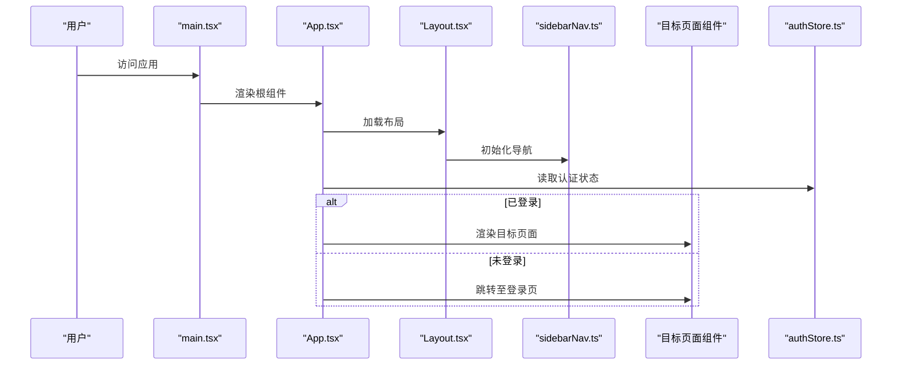
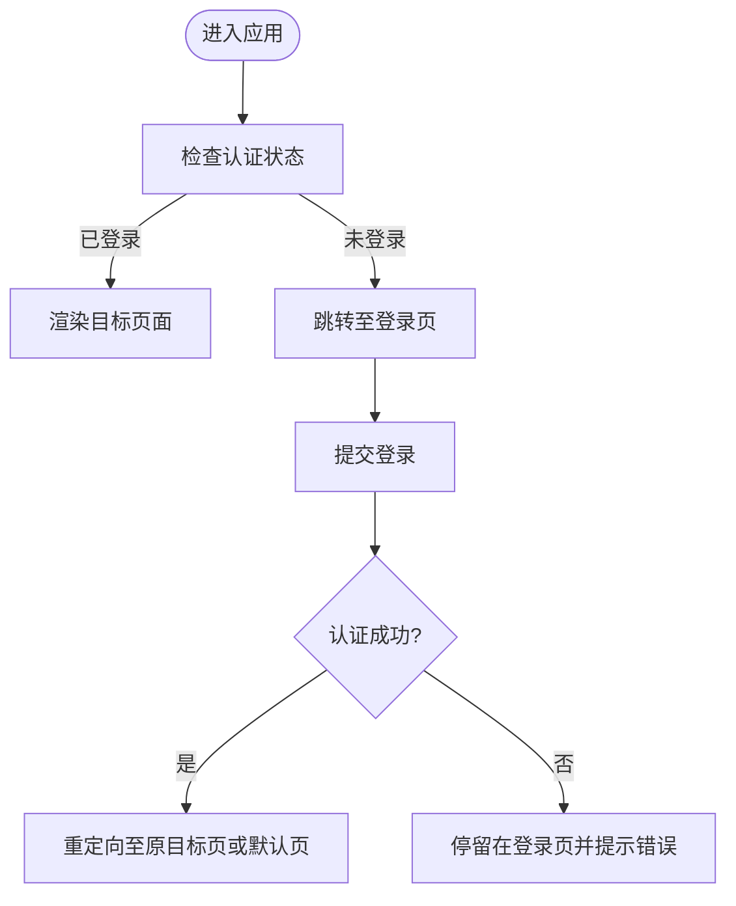
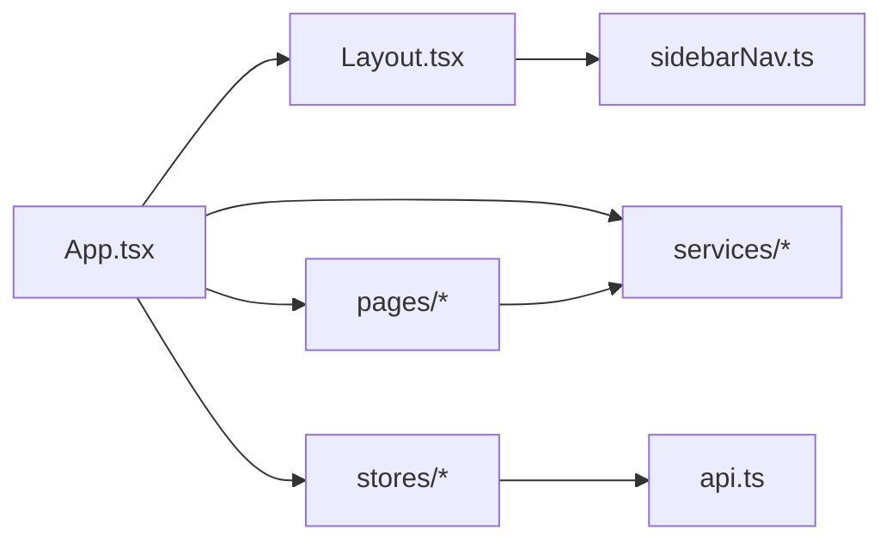

# 页面路由

<cite>
**本文引用的文件**
- [App.tsx](file://frontend/src/App.tsx)
- [main.tsx](file://frontend/src/main.tsx)
- [Layout.tsx](file://frontend/src/components/Layout.tsx)
- [sidebarNav.ts](file://frontend/src/components/sidebarNav.ts)
- [Dashboard.tsx](file://frontend/src/pages/Dashboard.tsx)
- [Analysis.tsx](file://frontend/src/pages/Analysis.tsx)
- [Login.tsx](file://frontend/src/pages/Login.tsx)
- [Reports.tsx](file://frontend/src/pages/Reports.tsx)
- [Portfolio.tsx](file://frontend/src/pages/Portfolio.tsx)
- [GoldBoard.tsx](file://frontend/src/pages/GoldBoard.tsx)
- [TrackingBoard.tsx](file://frontend/src/pages/TrackingBoard.tsx)
- [Settings.tsx](file://frontend/src/pages/Settings.tsx)
- [authStore.ts](file://frontend/src/stores/authStore.ts)
- [api.ts](file://frontend/src/services/api.ts)
- [index.html](file://frontend/index.html)
- [vite.config.ts](file://frontend/vite.config.ts)
- [vercel.json](file://frontend/vercel.json)
</cite>

## 目录
1. [简介](#简介)
2. [项目结构](#项目结构)
3. [核心组件](#核心组件)
4. [架构总览](#架构总览)
5. [详细组件分析](#详细组件分析)
6. [依赖分析](#依赖分析)
7. [性能考虑](#性能考虑)
8. [故障排查指南](#故障排查指南)
9. [结论](#结论)
10. [附录](#附录)

## 简介
本文件面向 TradingAgents-AShare 的前端页面路由系统，系统性梳理各页面组件的功能定位与实现逻辑，解释页面间导航、路由守卫与权限控制机制，阐述页面加载策略（含懒加载）、SEO 优化与最佳实践，并提供页面开发指南与路由配置建议。目标是帮助开发者快速理解并高效扩展前端路由体系。

## 项目结构
前端采用 Vite + React 构建，页面位于 frontend/src/pages，通用布局与侧边栏导航位于 frontend/src/components，全局状态管理位于 frontend/src/stores，HTTP 客户端封装在 frontend/src/services，入口与路由配置集中在 frontend/src。

**图表来源**
- [main.tsx:1-50](file://frontend/src/main.tsx#L1-L50)
- [App.tsx:1-120](file://frontend/src/App.tsx#L1-L120)
- [Layout.tsx:1-200](file://frontend/src/components/Layout.tsx#L1-L200)
- [sidebarNav.ts:1-200](file://frontend/src/components/sidebarNav.ts#L1-L200)
- [Dashboard.tsx:1-200](file://frontend/src/pages/Dashboard.tsx#L1-L200)
- [Analysis.tsx:1-200](file://frontend/src/pages/Analysis.tsx#L1-L200)
- [Login.tsx:1-200](file://frontend/src/pages/Login.tsx#L1-L200)
- [Reports.tsx:1-200](file://frontend/src/pages/Reports.tsx#L1-L200)
- [Portfolio.tsx:1-200](file://frontend/src/pages/Portfolio.tsx#L1-L200)
- [GoldBoard.tsx:1-200](file://frontend/src/pages/GoldBoard.tsx#L1-L200)
- [TrackingBoard.tsx:1-200](file://frontend/src/pages/TrackingBoard.tsx#L1-L200)
- [Settings.tsx:1-200](file://frontend/src/pages/Settings.tsx#L1-L200)
- [authStore.ts:1-200](file://frontend/src/stores/authStore.ts#L1-L200)
- [api.ts:1-200](file://frontend/src/services/api.ts#L1-L200)
- [index.html:1-100](file://frontend/index.html#L1-L100)
- [vite.config.ts:1-100](file://frontend/vite.config.ts#L1-L100)
- [vercel.json:1-100](file://frontend/vercel.json#L1-L100)

**章节来源**
- [main.tsx:1-50](file://frontend/src/main.tsx#L1-L50)
- [App.tsx:1-120](file://frontend/src/App.tsx#L1-L120)
- [Layout.tsx:1-200](file://frontend/src/components/Layout.tsx#L1-L200)
- [sidebarNav.ts:1-200](file://frontend/src/components/sidebarNav.ts#L1-L200)

## 核心组件
- 入口与路由装配：应用通过入口文件挂载根组件，根组件负责组织布局、导航与页面渲染。
- 布局与导航：统一布局组件承载头部、侧边栏与主内容区；侧边导航定义页面清单与跳转路径。
- 页面组件：每个页面作为独立模块，承担特定业务功能（如仪表板、分析、登录、报告、投资组合、黄金看板、跟踪看板、设置）。
- 权限与状态：认证状态由全局状态管理维护，页面根据状态决定是否允许访问或重定向。
- 服务层：HTTP 客户端封装请求与响应处理，供页面与服务层调用。

**章节来源**
- [App.tsx:1-120](file://frontend/src/App.tsx#L1-L120)
- [Layout.tsx:1-200](file://frontend/src/components/Layout.tsx#L1-L200)
- [sidebarNav.ts:1-200](file://frontend/src/components/sidebarNav.ts#L1-L200)
- [authStore.ts:1-200](file://frontend/src/stores/authStore.ts#L1-L200)
- [api.ts:1-200](file://frontend/src/services/api.ts#L1-L200)

## 架构总览
下图展示从入口到页面渲染、权限校验与导航的整体流程：

**图表来源**
- [main.tsx:1-50](file://frontend/src/main.tsx#L1-L50)
- [App.tsx:1-120](file://frontend/src/App.tsx#L1-L120)
- [Layout.tsx:1-200](file://frontend/src/components/Layout.tsx#L1-L200)
- [sidebarNav.ts:1-200](file://frontend/src/components/sidebarNav.ts#L1-L200)
- [authStore.ts:1-200](file://frontend/src/stores/authStore.ts#L1-L200)

## 详细组件分析

### Dashboard 仪表板
- 功能定位：聚合关键指标、市场概览与快捷操作入口，作为用户进入后的首屏。
- 实现要点：页面组件负责数据拉取与可视化展示；与全局状态交互以获取用户信息与配置；通过布局与导航保持一致的视觉与交互体验。
- 导航关系：通常作为默认首页，从侧边栏或顶部导航可直达。

**章节来源**
- [Dashboard.tsx:1-200](file://frontend/src/pages/Dashboard.tsx#L1-L200)
- [Layout.tsx:1-200](file://frontend/src/components/Layout.tsx#L1-L200)
- [sidebarNav.ts:1-200](file://frontend/src/components/sidebarNav.ts#L1-L200)

### Analysis 分析页面
- 功能定位：提供深度分析能力，支持任务恢复与实时反馈。
- 实现要点：集成分析相关 Hook（如任务恢复）与 SSE 通信；页面内可能包含图表、进度条与交互式面板。
- 性能与体验：长耗时分析需配合进度反馈与中断机制，确保用户体验。

**章节来源**
- [Analysis.tsx:1-200](file://frontend/src/pages/Analysis.tsx#L1-L200)
- [useAnalysisJobRecovery.ts:1-200](file://frontend/src/hooks/useAnalysisJobRecovery.ts#L1-L200)
- [useSSE.ts:1-200](file://frontend/src/hooks/useSSE.ts#L1-L200)

### Login 登录页面
- 功能定位：用户身份认证入口，完成登录后应触发状态更新与页面跳转。
- 实现要点：表单校验、提交与错误处理；登录成功后根据路由守卫逻辑进行页面重定向。
- 安全建议：避免明文存储敏感信息，使用安全的令牌管理策略。

**章节来源**
- [Login.tsx:1-200](file://frontend/src/pages/Login.tsx#L1-L200)
- [authStore.ts:1-200](file://frontend/src/stores/authStore.ts#L1-L200)
- [api.ts:1-200](file://frontend/src/services/api.ts#L1-L200)

### Reports 报告页面
- 功能定位：展示生成的报告列表与详情，支持下载与分享。
- 实现要点：列表加载、分页与筛选；报告详情视图与 Viewer 组件协作；与后端服务对接生成与查询报告。
- 交互设计：提供预览、导出与通知等操作按钮。

**章节来源**
- [Reports.tsx:1-200](file://frontend/src/pages/Reports.tsx#L1-L200)
- [ReportViewer.tsx:1-200](file://frontend/src/components/ReportViewer.tsx#L1-L200)
- [reportText.ts:1-200](file://frontend/src/utils/reportText.ts#L1-L200)

### Portfolio 投资组合页面
- 功能定位：管理与展示用户的投资组合，支持导入与同步。
- 实现要点：与服务层协作导入与同步逻辑；页面内展示组合概览与明细；与全局状态联动。
- 数据一致性：导入与同步过程需保证幂等与回滚策略。

**章节来源**
- [Portfolio.tsx:1-200](file://frontend/src/pages/Portfolio.tsx#L1-L200)
- [portfolioSync.ts:1-200](file://frontend/src/utils/portfolioSync.ts#L1-L200)

### GoldBoard 黄金看板
- 功能定位：黄金策略或信号的集中展示面板，提供决策参考。
- 实现要点：数据驱动的卡片式布局；与后端服务交互获取最新信号；支持刷新与订阅。

**章节来源**
- [GoldBoard.tsx:1-200](file://frontend/src/pages/GoldBoard.tsx#L1-L200)

### TrackingBoard 跟踪看板
- 功能定位：跟踪任务执行状态与进展，提供可视化进度与日志。
- 实现要点：面板组件承载实时数据流；与 SSE 或轮询结合；支持暂停、继续与重试。
- 用户体验：提供清晰的状态指示与操作入口。

**章节来源**
- [TrackingBoard.tsx:1-200](file://frontend/src/pages/TrackingBoard.tsx#L1-L200)
- [TrackingBoardPanel.tsx:1-200](file://frontend/src/components/TrackingBoardPanel.tsx#L1-L200)

### Settings 设置页面
- 功能定位：用户偏好与系统配置项的集中管理。
- 实现要点：表单化配置项；变更持久化与即时生效策略；与后端接口协同保存设置。

**章节来源**
- [Settings.tsx:1-200](file://frontend/src/pages/Settings.tsx#L1-L200)

### 导航与路由守卫
- 侧边导航：侧边栏导航定义页面清单与跳转路径，支持图标与文案；点击后触发页面切换。
- 路由守卫：基于认证状态进行访问控制；未登录用户自动跳转至登录页；登录后根据历史记录或默认规则返回。
- 默认路由：通常将仪表板设为默认首页；登录页作为受保护路由的前置页。

**图表来源**
- [sidebarNav.ts:1-200](file://frontend/src/components/sidebarNav.ts#L1-L200)
- [authStore.ts:1-200](file://frontend/src/stores/authStore.ts#L1-L200)
- [Login.tsx:1-200](file://frontend/src/pages/Login.tsx#L1-L200)

## 依赖分析
- 组件耦合：页面组件依赖布局与导航；导航依赖页面清单；认证状态贯穿所有页面。
- 外部依赖：Vite 提供构建与开发服务器；React 生态组件与 Hooks；浏览器原生 API（如本地存储、SSE）。
- 潜在风险：若认证状态更新不及时，可能导致路由跳转异常；导航与页面清单需保持一致。

**图表来源**
- [App.tsx:1-120](file://frontend/src/App.tsx#L1-L120)
- [Layout.tsx:1-200](file://frontend/src/components/Layout.tsx#L1-L200)
- [sidebarNav.ts:1-200](file://frontend/src/components/sidebarNav.ts#L1-L200)
- [authStore.ts:1-200](file://frontend/src/stores/authStore.ts#L1-L200)
- [api.ts:1-200](file://frontend/src/services/api.ts#L1-L200)

**章节来源**
- [App.tsx:1-120](file://frontend/src/App.tsx#L1-L120)
- [Layout.tsx:1-200](file://frontend/src/components/Layout.tsx#L1-L200)
- [sidebarNav.ts:1-200](file://frontend/src/components/sidebarNav.ts#L1-L200)
- [authStore.ts:1-200](file://frontend/src/stores/authStore.ts#L1-L200)
- [api.ts:1-200](file://frontend/src/services/api.ts#L1-L200)

## 性能考虑
- 懒加载策略：对非首屏页面（如 Analysis、Reports、Portfolio、GoldBoard、TrackingBoard、Settings）采用动态导入，减少初始包体积与首屏时间。
- 资源优化：利用 Vite 的代码分割与按需加载；对静态资源启用压缩与缓存。
- 交互性能：长任务采用异步处理与进度反馈；避免阻塞主线程。
- 缓存与复用：合理使用浏览器缓存与内存缓存；对重复请求进行去重。

**章节来源**
- [vite.config.ts:1-100](file://frontend/vite.config.ts#L1-L100)
- [Analysis.tsx:1-200](file://frontend/src/pages/Analysis.tsx#L1-L200)
- [Reports.tsx:1-200](file://frontend/src/pages/Reports.tsx#L1-L200)
- [Portfolio.tsx:1-200](file://frontend/src/pages/Portfolio.tsx#L1-L200)
- [GoldBoard.tsx:1-200](file://frontend/src/pages/GoldBoard.tsx#L1-L200)
- [TrackingBoard.tsx:1-200](file://frontend/src/pages/TrackingBoard.tsx#L1-L200)
- [Settings.tsx:1-200](file://frontend/src/pages/Settings.tsx#L1-L200)

## 故障排查指南
- 登录失败：检查认证状态更新逻辑与错误提示；确认服务端返回与客户端解析一致。
- 页面无法访问：核对路由守卫与认证状态；确认默认路由与重定向逻辑。
- 数据加载异常：检查服务层请求封装与错误处理；关注网络状态与超时策略。
- 性能问题：分析打包体积与加载时间；识别大依赖与未使用的模块；优化懒加载边界。

**章节来源**
- [authStore.ts:1-200](file://frontend/src/stores/authStore.ts#L1-L200)
- [api.ts:1-200](file://frontend/src/services/api.ts#L1-L200)
- [Login.tsx:1-200](file://frontend/src/pages/Login.tsx#L1-L200)

## 结论
该路由系统以布局与导航为核心，围绕认证状态实现访问控制与页面跳转，页面组件职责清晰、耦合度适中。通过懒加载与性能优化策略，可在保证体验的同时降低初始负载。建议持续完善路由守卫与错误处理，确保在复杂场景下的稳定性与可维护性。

## 附录

### 页面开发指南与最佳实践
- 页面命名与组织：页面组件统一放置于 pages 目录，命名采用 PascalCase；与之配套的样式与工具函数就近存放。
- 路由配置：在根组件中集中声明路由映射；将受保护路由与公开路由分离；为每个页面提供明确的路径与标题。
- 懒加载：对非首屏页面采用动态导入；在 Suspense 边界内处理加载状态；避免在首屏引入重型依赖。
- 权限控制：在路由层与页面层双重校验；登录后根据历史记录或默认规则进行重定向；提供清晰的错误提示。
- SEO 优化：为每个页面提供语义化的标题与描述；在入口 HTML 中配置基础 SEO 元信息；必要时使用静态站点生成策略。
- 状态管理：将认证与用户偏好放入全局状态；页面仅负责展示与交互；避免在页面内直接管理跨页面共享的状态。
- 服务层封装：统一请求与响应处理；提供错误码与重试策略；对敏感操作增加二次确认。

**章节来源**
- [App.tsx:1-120](file://frontend/src/App.tsx#L1-L120)
- [Layout.tsx:1-200](file://frontend/src/components/Layout.tsx#L1-L200)
- [sidebarNav.ts:1-200](file://frontend/src/components/sidebarNav.ts#L1-L200)
- [authStore.ts:1-200](file://frontend/src/stores/authStore.ts#L1-L200)
- [api.ts:1-200](file://frontend/src/services/api.ts#L1-L200)
- [index.html:1-100](file://frontend/index.html#L1-L100)
- [vite.config.ts:1-100](file://frontend/vite.config.ts#L1-L100)
- [vercel.json:1-100](file://frontend/vercel.json#L1-L100)