# FastAPI应用结构

<cite>
**本文档引用的文件**
- [api/main.py](file://api/main.py)
- [api/database.py](file://api/database.py)
- [api/job_store.py](file://api/job_store.py)
- [api/logging_config.yaml](file://api/logging_config.yaml)
- [api/services/auth_service.py](file://api/services/auth_service.py)
- [pyproject.toml](file://pyproject.toml)
- [requirements.txt](file://requirements.txt)
</cite>

## 目录
1. [简介](#简介)
2. [项目结构](#项目结构)
3. [核心组件](#核心组件)
4. [架构概览](#架构概览)
5. [详细组件分析](#详细组件分析)
6. [依赖分析](#依赖分析)
7. [性能考虑](#性能考虑)
8. [故障排除指南](#故障排除指南)
9. [结论](#结论)
10. [附录](#附录)

## 简介

TradingAgents-AShare是一个基于FastAPI构建的多智能体AI交易分析平台。该应用提供了完整的股票分析工作流，包括实时数据获取、多智能体分析、报告生成和流式事件传输等功能。应用采用模块化设计，支持生产级部署，并具备完善的错误处理和监控机制。

## 项目结构

该项目采用清晰的分层架构，主要包含以下核心目录：

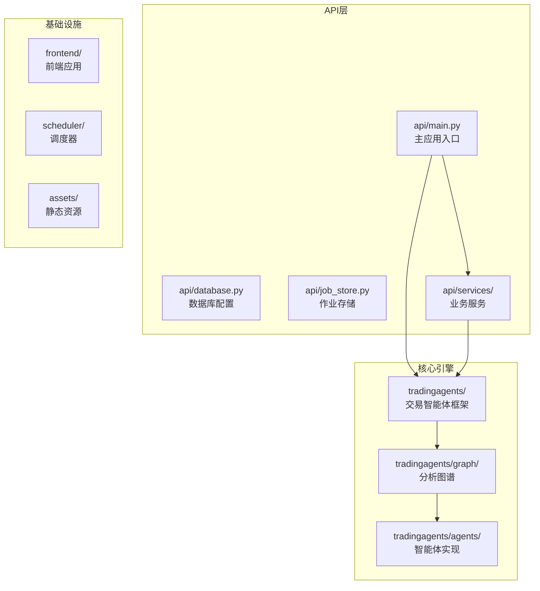

**图表来源**
- [api/main.py:1-50](file://api/main.py#L1-L50)
- [api/database.py:1-50](file://api/database.py#L1-L50)

**章节来源**
- [api/main.py:1-100](file://api/main.py#L1-L100)
- [pyproject.toml:1-52](file://pyproject.toml#L1-L52)

## 核心组件

### 应用初始化与生命周期管理

应用使用FastAPI的lifespan钩子进行优雅的生命周期管理：

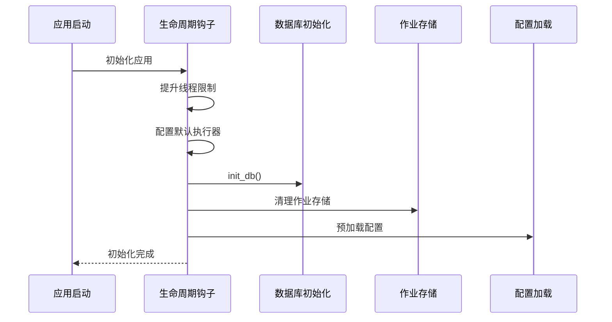

**图表来源**
- [api/main.py:216-279](file://api/main.py#L216-L279)

应用的核心特性包括：
- **动态线程池配置**：根据环境变量调整AnyIO线程限制和默认asyncio执行器
- **数据库预热**：启动时预加载交易日历和股票映射
- **安全检查**：检测并警告未设置应用密钥的安全风险

**章节来源**
- [api/main.py:216-296](file://api/main.py#L216-L296)

### CORS配置与安全中间件

应用实现了灵活的CORS配置和安全中间件：

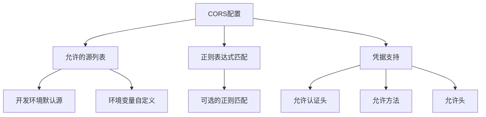

**图表来源**
- [api/main.py:76-94](file://api/main.py#L76-L94)

**章节来源**
- [api/main.py:306-313](file://api/main.py#L306-L313)

### 数据库与ORM配置

应用使用SQLAlchemy进行数据库抽象：

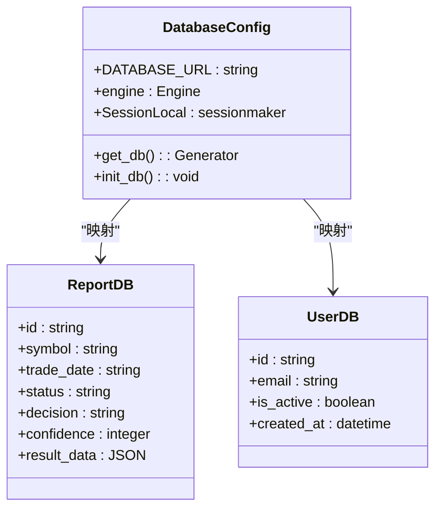

**图表来源**
- [api/database.py:11-56](file://api/database.py#L11-L56)
- [api/database.py:242-318](file://api/database.py#L242-L318)

**章节来源**
- [api/database.py:1-143](file://api/database.py#L1-L143)

## 架构概览

应用采用事件驱动的异步架构，支持高并发的分析任务处理：

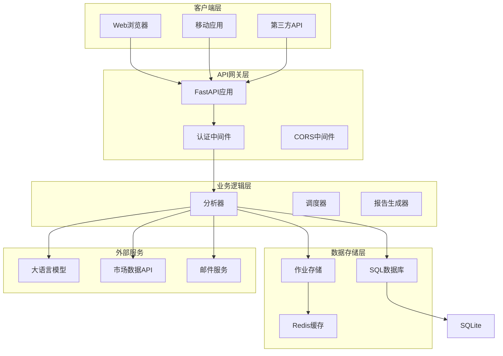

**图表来源**
- [api/main.py:298-305](file://api/main.py#L298-L305)
- [api/job_store.py:289-306](file://api/job_store.py#L289-L306)

## 详细组件分析

### 作业管理系统

作业管理系统是应用的核心组件，负责协调长时间运行的分析任务：

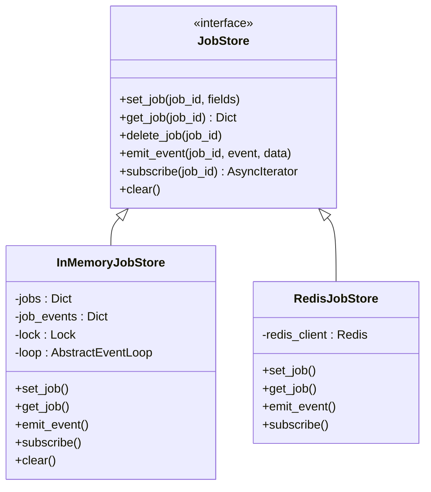

**图表来源**
- [api/job_store.py:35-67](file://api/job_store.py#L35-L67)
- [api/job_store.py:69-287](file://api/job_store.py#L69-L287)

**章节来源**
- [api/job_store.py:1-306](file://api/job_store.py#L1-L306)

### 认证与授权系统

应用支持多种认证方式，确保系统的安全性：

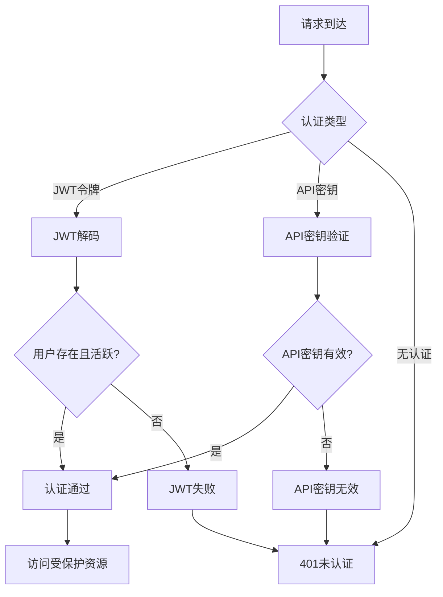

**图表来源**
- [api/main.py:1032-1068](file://api/main.py#L1032-L1068)

**章节来源**
- [api/main.py:1032-1092](file://api/main.py#L1032-L1092)

### 实时事件流系统

应用使用Server-Sent Events (SSE)提供实时事件流：

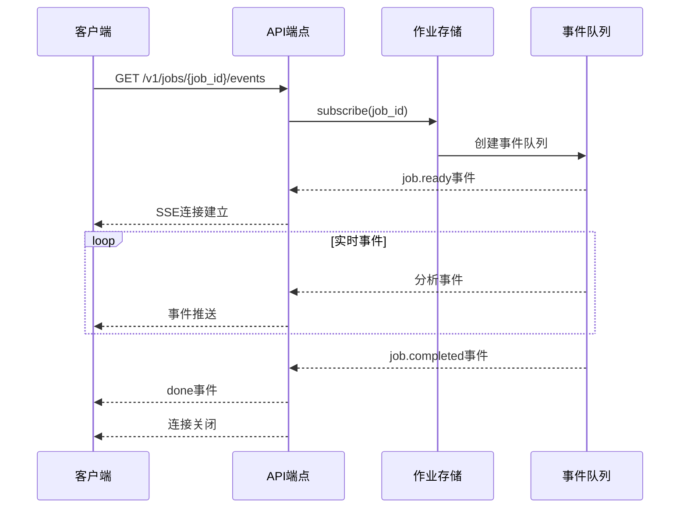

**图表来源**
- [api/main.py:2551-2560](file://api/main.py#L2551-L2560)
- [api/job_store.py:239-276](file://api/job_store.py#L239-L276)

**章节来源**
- [api/main.py:2962-2970](file://api/main.py#L2962-L2970)

### 数据分析引擎

应用的核心分析功能基于多智能体系统：

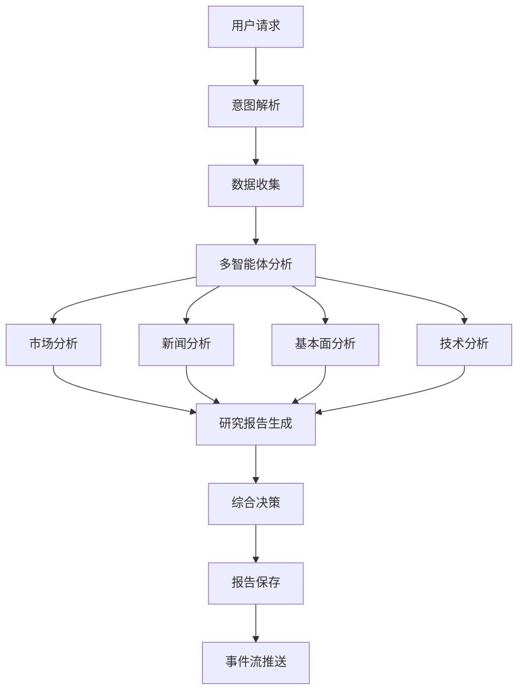

**图表来源**
- [api/main.py:1636-2320](file://api/main.py#L1636-L2320)

**章节来源**
- [api/main.py:1636-2047](file://api/main.py#L1636-L2047)

## 依赖分析

### 外部依赖关系

应用的依赖关系呈现清晰的层次结构：

```mermaid
graph TB
subgraph "核心框架"
FastAPI[fastapi >= 0.116.1]
Uvicorn[uvicorn >= 0.35.0]
SQLA[sqlalchemy >= 2.0.48]
end
subgraph "AI/ML组件"
LangChain[langchain-core >= 0.3.81]
LangGraph[langgraph >= 0.4.8]
OpenAI[langchain-openai >= 0.3.23]
Anthropic[langchain-anthropic >= 0.3.15]
end
subgraph "数据处理"
Pandas[pandas >= 2.3.0]
Requests[requests >= 2.32.4]
AkShare[akshare >= 1.16.80]
end
subgraph "工具库"
Cryptography[cryptography >= 45.0.3]
Redis[redis[hiredis] >= 5.0.0]
JWT[PyJWT >= 2.11.0]
end
FastAPI --> SQLA
FastAPI --> Cryptography
FastAPI --> JWT
LangChain --> OpenAI
LangChain --> Anthropic
LangGraph --> LangChain
Pandas --> Requests
Requests --> AkShare
```

**图表来源**
- [pyproject.toml:11-38](file://pyproject.toml#L11-L38)

**章节来源**
- [pyproject.toml:1-52](file://pyproject.toml#L1-L52)
- [requirements.txt:1-24](file://requirements.txt#L1-L24)

### 内部模块依赖

应用内部模块之间的依赖关系：

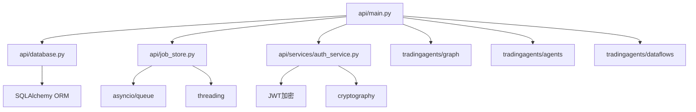

**图表来源**
- [api/main.py:42-46](file://api/main.py#L42-L46)
- [api/services/auth_service.py:13-18](file://api/services/auth_service.py#L13-L18)

## 性能考虑

### 线程池与并发控制

应用采用了多层次的并发控制策略：

| 组件 | 配置项 | 默认值 | 用途 |
|------|--------|--------|------|
| AnyIO线程限制 | ANYIO_THREAD_LIMIT | 120 | 控制事件循环线程池大小 |
| 默认asyncio执行器 | ASYNCIO_DEFAULT_EXECUTOR_WORKERS | 64 | 处理数据库和API调用 |
| 作业事件队列 | JOB_EVENT_QUEUE_MAXSIZE | 2000 | 防止内存泄漏 |
| 作业TTL | INMEMORY_JOB_TTL | 600秒 | 清理完成的作业状态 |

### 缓存策略

应用实现了多级缓存机制：

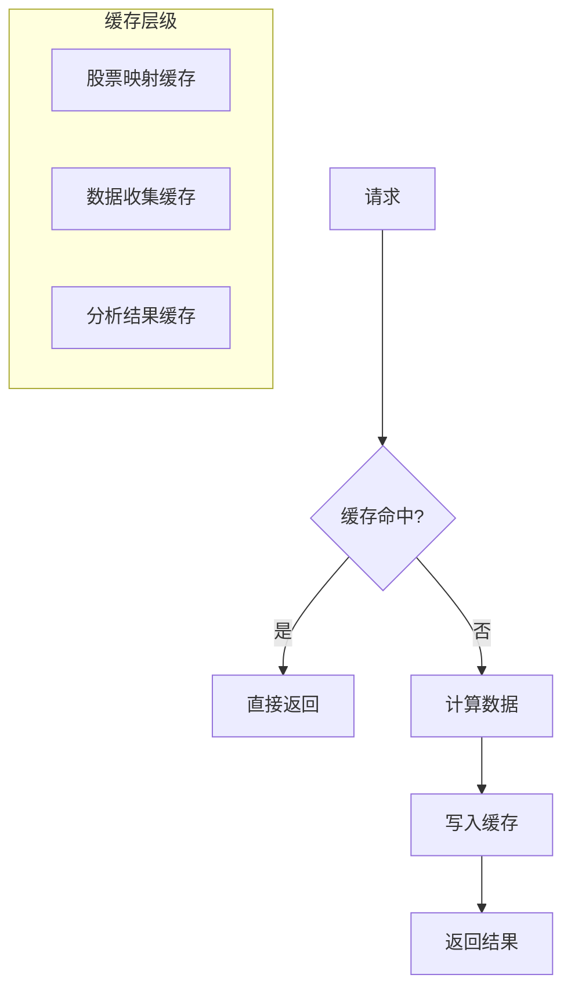

**图表来源**
- [api/main.py:383-440](file://api/main.py#L383-L440)

### 性能优化建议

1. **数据库连接池优化**：根据并发需求调整连接池大小
2. **Redis集群部署**：在高并发场景下使用Redis集群
3. **CDN加速**：静态资源使用CDN分发
4. **负载均衡**：多实例部署时使用负载均衡器

## 故障排除指南

### 常见问题诊断

| 问题类型 | 症状 | 可能原因 | 解决方案 |
|----------|------|----------|----------|
| 认证失败 | 401未认证 | JWT过期或无效 | 检查令牌有效期和签名 |
| CORS错误 | 跨域请求失败 | 源地址不在允许列表 | 配置CORS_ALLOW_ORIGINS |
| 数据库连接 | 连接超时 | 连接池耗尽 | 增加连接池大小 |
| 作业超时 | 分析任务中断 | 超时设置过短 | 调整TA_JOB_TIMEOUT |
| 内存泄漏 | 内存持续增长 | 事件队列未清理 | 检查作业TTL配置 |

### 日志配置

应用使用结构化日志记录：

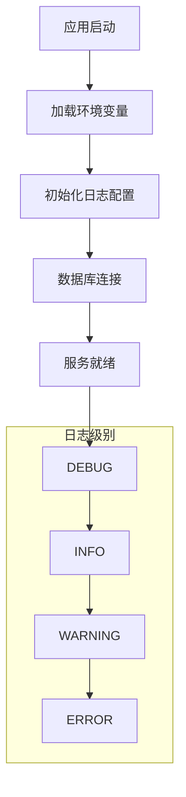

**图表来源**
- [api/logging_config.yaml:1-35](file://api/logging_config.yaml#L1-L35)

**章节来源**
- [api/logging_config.yaml:1-35](file://api/logging_config.yaml#L1-L35)

## 结论

TradingAgents-AShare的FastAPI应用展现了现代Python Web应用的最佳实践。通过模块化的架构设计、完善的错误处理机制和高性能的并发处理能力，该应用能够稳定地支持复杂的AI交易分析任务。

关键优势包括：
- **可扩展性**：模块化设计支持功能扩展
- **可靠性**：完善的错误处理和恢复机制
- **性能**：多层缓存和并发控制优化
- **安全性**：多重认证和数据保护机制

## 附录

### 环境变量配置

| 变量名 | 类型 | 默认值 | 描述 |
|--------|------|--------|------|
| ENV | string | development | 环境模式 |
| APP_VERSION | string | package版本 | 应用版本号 |
| DATABASE_URL | string | sqlite:///./tradingagents.db | 数据库连接URL |
| TA_APP_SECRET_KEY | string | 无 | 应用密钥 |
| ANYIO_THREAD_LIMIT | int | 120 | AnyIO线程限制 |
| ASYNCIO_DEFAULT_EXECUTOR_WORKERS | int | 64 | 默认执行器工作线程数 |
| TA_JOB_TIMEOUT | int | 1800 | 作业超时时间(秒) |

### API版本控制

应用采用语义化版本控制，通过APP_VERSION环境变量和包元数据确定版本号。API端点前缀使用/v1格式，确保向后兼容性。

### WebSocket支持

虽然应用主要使用SSE进行实时通信，但FastAPI框架天然支持WebSocket。如需添加WebSocket功能，可在现有架构基础上扩展相应的路由和处理逻辑。