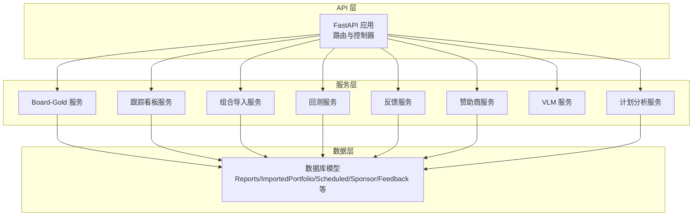
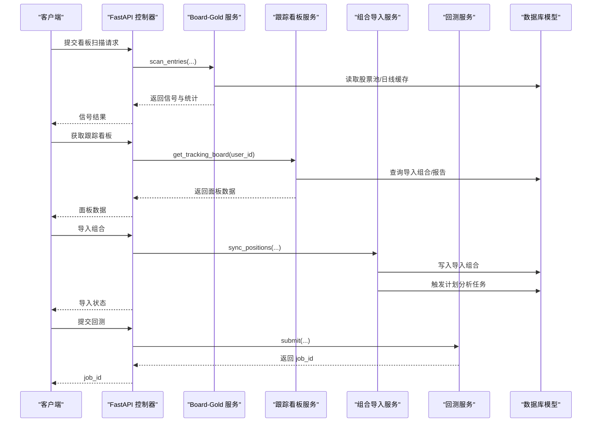
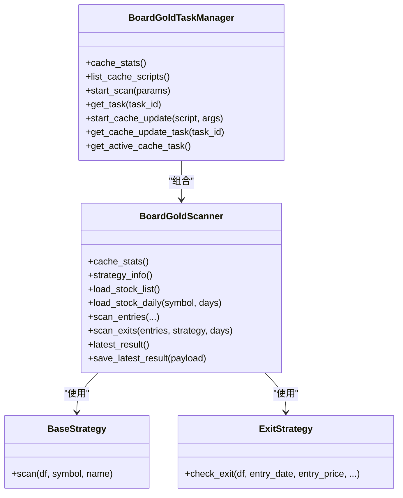
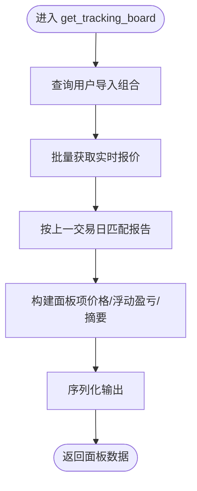
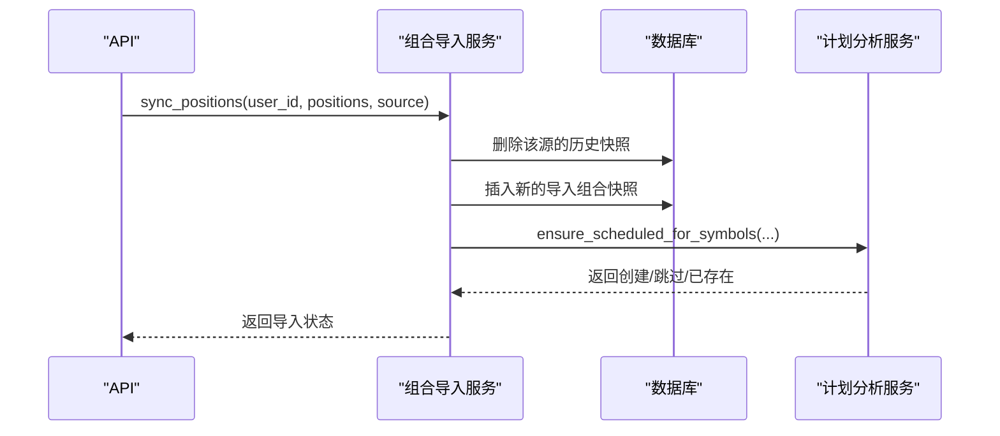
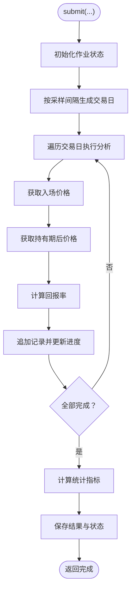
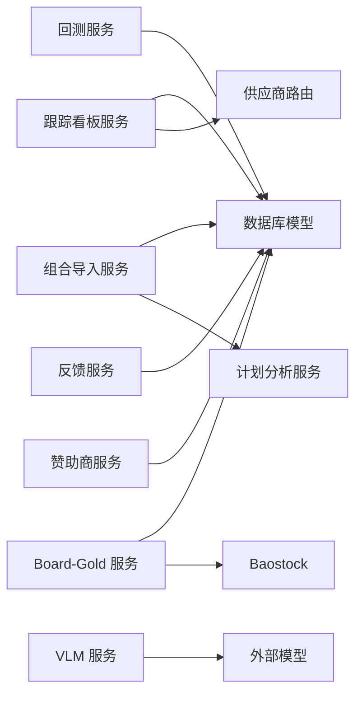

# 专用服务模块

<cite>
**本文引用的文件**
- [board_gold_service.py](file://api/services/board_gold_service.py)
- [tracking_board_service.py](file://api/services/tracking_board_service.py)
- [portfolio_import_service.py](file://api/services/portfolio_import_service.py)
- [backtest_service.py](file://api/services/backtest_service.py)
- [feedback_service.py](file://api/services/feedback_service.py)
- [sponsor_service.py](file://api/services/sponsor_service.py)
- [vlm_service.py](file://api/services/vlm_service.py)
- [database.py](file://api/database.py)
- [scheduled_service.py](file://api/services/scheduled_service.py)
</cite>

## 目录
1. [简介](#简介)
2. [项目结构](#项目结构)
3. [核心组件](#核心组件)
4. [架构总览](#架构总览)
5. [详细组件分析](#详细组件分析)
6. [依赖分析](#依赖分析)
7. [性能考虑](#性能考虑)
8. [故障排查指南](#故障排查指南)
9. [结论](#结论)
10. [附录](#附录)

## 简介
本文件面向 TradingAgents-AShare 的专用服务模块，系统化梳理以下服务的能力与实现：
- 看板服务：黄金看板（Board-Gold）信号扫描与离场策略评估
- 跟踪看板（Tracking Board）：基于导入组合的实时行情与报告摘要聚合
- 组合导入服务：通用持仓导入、去重与调度分析任务的自动绑定
- 回测服务：历史回测作业提交、执行与统计汇总
- 反馈收集服务：用户反馈的增删查改与未读计数
- 赞助商管理服务：公开赞助列表查询（金额字段对公众隐藏）
- VLM 服务：通用视觉语言模型调用封装（OpenAI 兼容与 Anthropic）

文档同时阐述服务间协作关系、数据流与状态同步机制，并给出配置要点、参数调优与扩展接口建议，以及监控、日志与性能分析方法。

## 项目结构
专用服务模块位于 api/services 下，围绕“数据模型”（api/database.py）与“业务服务”（各服务模块）分层组织。服务之间通过数据库模型进行状态持久化与共享，通过统一的依赖注入（FastAPI）在 API 层编排。

图表来源
- [board_gold_service.py](file://api/services/board_gold_service.py)
- [tracking_board_service.py](file://api/services/tracking_board_service.py)
- [portfolio_import_service.py](file://api/services/portfolio_import_service.py)
- [backtest_service.py](file://api/services/backtest_service.py)
- [feedback_service.py](file://api/services/feedback_service.py)
- [sponsor_service.py](file://api/services/sponsor_service.py)
- [vlm_service.py](file://api/services/vlm_service.py)
- [database.py](file://api/database.py)
- [scheduled_service.py](file://api/services/scheduled_service.py)

章节来源
- [database.py:242-483](file://api/database.py#L242-L483)

## 核心组件
- Board-Gold 服务：本地缓存 Parquet 日线数据扫描，内置多种入场/离场策略，支持任务进度与日志追踪，支持缓存更新脚本的异步执行与状态管理。
- 跟踪看板服务：聚合用户导入组合的实时行情、浮动盈亏、报告摘要等，提供刷新间隔与数据序列化。
- 组合导入服务：通用持仓导入、规范化与去重、百分比市值计算、自动绑定计划分析任务。
- 回测服务：后台线程执行历史回测，按采样周期生成交易决策与回报统计，结果以内存字典保存并可查询。
- 反馈服务：用户反馈的创建、分页查询、标记已读与未读计数。
- 赞助商服务：公开赞助列表查询，金额字段对公众隐藏。
- VLM 服务：通过环境变量配置 Provider、BaseURL、Model、API Key，支持 OpenAI 兼容与 Anthropic，发送图像+文本提示并返回原始文本响应。

章节来源
- [board_gold_service.py:1104-1167](file://api/services/board_gold_service.py#L1104-L1167)
- [tracking_board_service.py:19-80](file://api/services/tracking_board_service.py#L19-L80)
- [portfolio_import_service.py:31-117](file://api/services/portfolio_import_service.py#L31-L117)
- [backtest_service.py:226-260](file://api/services/backtest_service.py#L226-L260)
- [feedback_service.py:18-58](file://api/services/feedback_service.py#L18-L58)
- [sponsor_service.py:19-25](file://api/services/sponsor_service.py#L19-L25)
- [vlm_service.py:20-89](file://api/services/vlm_service.py#L20-L89)

## 架构总览
专用服务模块采用“服务即功能单元”的设计，围绕数据库模型进行状态持久化与跨服务共享。Board-Gold 服务负责本地缓存与策略扫描；跟踪看板服务消费导入组合与报告数据；组合导入服务在写入后触发计划分析任务；回测服务独立运行后台线程；反馈与赞助商服务提供只读查询；VLM 服务提供外部模型调用能力。

图表来源
- [board_gold_service.py:1223-1283](file://api/services/board_gold_service.py#L1223-L1283)
- [tracking_board_service.py:19-80](file://api/services/tracking_board_service.py#L19-L80)
- [portfolio_import_service.py:31-117](file://api/services/portfolio_import_service.py#L31-L117)
- [backtest_service.py:226-260](file://api/services/backtest_service.py#L226-L260)

## 详细组件分析

### 看板服务（Board-Gold）
- 功能概述
  - 本地缓存 Parquet 日线数据扫描，支持多策略入场与离场评估
  - 支持任务进度回调、日志记录与结果持久化
  - 支持缓存更新脚本的异步执行与状态管理
- 关键实现
  - 策略注册表：入场策略与离场策略分别注册，支持参数化启用
  - 扫描器：加载股票池、读取日线、执行策略扫描、生成信号并汇总
  - 离场评估：根据入场信号与参数评估止盈止损、移动止盈、时间限制等
  - 任务管理：扫描任务与缓存更新任务的生命周期管理、并发控制
- 数据结构与复杂度
  - 策略扫描复杂度近似 O(N×M×K)，N 为股票数，M 为策略数，K 为窗口长度
  - 离场评估复杂度近似 O(M×K)，M 为策略数，K 为持有期窗口
- 错误处理与边界
  - 参数校验、空缓存处理、异常捕获与日志记录
  - 缓存更新脚本的安全参数过滤与超时保护
- 性能优化建议
  - 合理设置扫描并发（workers），避免磁盘与网络 IO 抖动
  - 优先选择命中率高的策略组合，减少无效扫描
  - 使用本地缓存与增量更新，降低网络依赖

图表来源
- [board_gold_service.py:1104-1167](file://api/services/board_gold_service.py#L1104-L1167)
- [board_gold_service.py:1418-1427](file://api/services/board_gold_service.py#L1418-L1427)
- [board_gold_service.py:267-285](file://api/services/board_gold_service.py#L267-L285)
- [board_gold_service.py:817-816](file://api/services/board_gold_service.py#L817-L816)

章节来源
- [board_gold_service.py:1104-1167](file://api/services/board_gold_service.py#L1104-L1167)
- [board_gold_service.py:1418-1427](file://api/services/board_gold_service.py#L1418-L1427)
- [board_gold_service.py:267-285](file://api/services/board_gold_service.py#L267-L285)
- [board_gold_service.py:817-816](file://api/services/board_gold_service.py#L817-L816)

### 跟踪看板服务
- 功能概述
  - 聚合用户导入组合的实时行情、浮动盈亏、报告摘要
  - 提供刷新间隔与数据序列化，便于前端轮询展示
- 关键实现
  - 组合读取：按用户查询导入组合，排序与去重
  - 实时行情：通过供应商路由获取实时报价
  - 报告摘要：按上一交易日匹配最新报告，提取关键字段
  - 数据清洗：数值转换、空值处理、摘要截断
- 数据流
  - 输入：用户 ID、符号集合
  - 输出：面板项数组（含价格、浮动盈亏、报告摘要等）
- 错误处理
  - 供应商路由异常降级为日志警告，保证面板基本可用

图表来源
- [tracking_board_service.py:19-80](file://api/services/tracking_board_service.py#L19-L80)
- [tracking_board_service.py:97-134](file://api/services/tracking_board_service.py#L97-L134)
- [tracking_board_service.py:203-221](file://api/services/tracking_board_service.py#L203-L221)

章节来源
- [tracking_board_service.py:19-80](file://api/services/tracking_board_service.py#L19-L80)
- [tracking_board_service.py:97-134](file://api/services/tracking_board_service.py#L97-L134)
- [tracking_board_service.py:203-221](file://api/services/tracking_board_service.py#L203-L221)

### 组合导入服务
- 功能概述
  - 通用持仓导入、规范化与去重、百分比市值计算
  - 自动绑定计划分析任务，限制最大数量
- 关键实现
  - 规范化：标准化代码格式、补充名称、计算占比
  - 写入：删除旧快照、插入新快照、记录导入时间
  - 自动调度：对有仓位的标的确保计划分析任务存在
  - 查询：列出导入组合、构建用户上下文用于后续分析
- 数据一致性
  - 单源快照替换，避免重复与冲突
  - 上下文构建时归一化用户输入

图表来源
- [portfolio_import_service.py:31-117](file://api/services/portfolio_import_service.py#L31-L117)
- [scheduled_service.py:148-210](file://api/services/scheduled_service.py#L148-L210)

章节来源
- [portfolio_import_service.py:31-117](file://api/services/portfolio_import_service.py#L31-L117)
- [scheduled_service.py:148-210](file://api/services/scheduled_service.py#L148-L210)

### 回测服务
- 功能概述
  - 历史回测作业提交、后台执行、结果统计
  - 按采样周期生成交易决策与回报，计算胜率与平均回报
- 关键实现
  - 作业存储：内存字典 + 线程锁，支持查询与删除
  - 日期采样：工作日采样，避免周末干扰
  - 价格获取：通过供应商路由获取历史数据，计算持有期后价格
  - 决策分类：将分析结果映射为 BUY/SELL/HOLD
  - 统计计算：胜率、平均回报、最佳/最差回报
- 并发与状态
  - 后台线程执行，进度与日志实时更新
  - 支持查询作业状态与结果

图表来源
- [backtest_service.py:226-260](file://api/services/backtest_service.py#L226-L260)
- [backtest_service.py:184-224](file://api/services/backtest_service.py#L184-L224)
- [backtest_service.py:158-182](file://api/services/backtest_service.py#L158-L182)

章节来源
- [backtest_service.py:226-260](file://api/services/backtest_service.py#L226-L260)
- [backtest_service.py:184-224](file://api/services/backtest_service.py#L184-L224)
- [backtest_service.py:158-182](file://api/services/backtest_service.py#L158-L182)

### 反馈收集服务
- 功能概述
  - 用户反馈的创建、分页查询、标记已读与未读计数
- 关键实现
  - 创建：填充用户信息与主题内容
  - 查询：按用户分页返回，总数统计
  - 标记：仅限本人操作，防止越权
  - 未读计数：基于管理员回复与未读状态统计

章节来源
- [feedback_service.py:18-58](file://api/services/feedback_service.py#L18-L58)

### 赞助商管理服务
- 功能概述
  - 公开展示赞助商列表，金额字段对公众隐藏
- 关键实现
  - 查询：可见赞助商，按类型过滤，排序规则稳定
  - 安全：金额字段不对外暴露

章节来源
- [sponsor_service.py:19-25](file://api/services/sponsor_service.py#L19-L25)

### VLM 服务
- 功能概述
  - 通过环境变量配置 Provider、BaseURL、Model、API Key
  - 发送图像+文本提示，返回原始文本响应
- 关键实现
  - 配置加载：校验 API Key，读取 Provider/BaseURL/Model
  - 调用封装：OpenAI 兼容与 Anthropic 两种路径
  - 图像编码：支持原生 base64 或 data URI 前缀
  - 日志记录：记录响应片段，便于调试

章节来源
- [vlm_service.py:20-89](file://api/services/vlm_service.py#L20-L89)

## 依赖分析
- 服务耦合
  - 跟踪看板服务依赖导入组合与报告模型，耦合度中等
  - 组合导入服务与计划分析服务存在调用关系，但通过接口解耦
  - 回测服务与 TradingAgentsGraph 解耦，仅通过供应商路由与数据接口交互
  - Board-Gold 服务与外部缓存脚本存在间接耦合，通过任务管理器隔离
- 外部依赖
  - 供应商路由（route_to_vendor）用于实时/历史数据获取
  - Baostock 用于增量日线数据拉取（Board-Gold）
  - OpenAI/Anthropic 客户端用于 VLM 调用
- 数据库依赖
  - 所有服务均通过 SQLAlchemy 模型进行读写，模型定义集中在 database.py

图表来源
- [tracking_board_service.py:203-212](file://api/services/tracking_board_service.py#L203-L212)
- [portfolio_import_service.py:108-113](file://api/services/portfolio_import_service.py#L108-L113)
- [board_gold_service.py:1601-1631](file://api/services/board_gold_service.py#L1601-L1631)
- [vlm_service.py:49-89](file://api/services/vlm_service.py#L49-L89)

章节来源
- [database.py:242-483](file://api/database.py#L242-L483)

## 性能考虑
- I/O 与并发
  - Board-Gold 扫描与缓存更新应限制并发，避免磁盘与网络抖动
  - 回测服务建议按采样周期与样本数量动态调整，避免长时间阻塞
- 数据访问
  - 跟踪看板服务批量获取报价，减少多次往返
  - 组合导入服务写入前清理旧快照，避免冗余数据膨胀
- 缓存与索引
  - 本地缓存 Parquet 文件需定期校验与交叉检查，确保一致性
  - 数据库查询尽量使用索引列（如 user_id、symbol、status 等）
- 资源管理
  - VLM 调用应设置合理超时与重试策略，避免阻塞请求线程

## 故障排查指南
- Board-Gold 服务
  - 缓存脚本异常：检查脚本路径、参数合法性与环境变量
  - 策略扫描无信号：确认本地缓存是否完整、策略参数是否启用
  - 任务卡住：查看任务日志与进度，定位具体股票或策略
- 跟踪看板服务
  - 实时报价失败：检查供应商路由可用性与网络连接
  - 报告摘要缺失：确认报告状态与日期匹配逻辑
- 组合导入服务
  - 导入失败：检查输入格式、代码规范化与重复项
  - 自动调度未生效：确认最大任务数量限制与符号列表
- 回测服务
  - 作业无结果：检查采样日期、历史数据可用性与分析图执行
  - 统计异常：核对回报计算与决策分类逻辑
- 反馈与赞助商服务
  - 权限问题：确认用户身份与资源归属
  - 查询异常：检查数据库连接与模型字段

章节来源
- [board_gold_service.py:1519-1558](file://api/services/board_gold_service.py#L1519-L1558)
- [tracking_board_service.py:203-212](file://api/services/tracking_board_service.py#L203-L212)
- [portfolio_import_service.py:31-117](file://api/services/portfolio_import_service.py#L31-L117)
- [backtest_service.py:184-224](file://api/services/backtest_service.py#L184-L224)
- [feedback_service.py:18-58](file://api/services/feedback_service.py#L18-L58)
- [sponsor_service.py:19-25](file://api/services/sponsor_service.py#L19-L25)

## 结论
专用服务模块围绕“数据模型”与“服务功能”清晰分层，具备良好的可维护性与扩展性。Board-Gold 提供强大的本地缓存扫描与策略评估能力；跟踪看板与组合导入服务形成闭环，支撑用户组合可视化与自动化分析；回测服务提供离线验证工具；反馈与赞助商服务满足社区互动与展示需求；VLM 服务为多模态能力提供统一入口。建议在生产环境中加强监控与日志、完善参数校验与安全防护，并持续优化 I/O 与并发策略。

## 附录

### 服务配置与参数调优
- Board-Gold
  - 环境变量：数据目录、结果目录、扫描并发、缓存脚本目录、连续失败阈值
  - 参数：策略启用开关、参数化阈值、扫描天数、目标日期、最大股票数
- 跟踪看板
  - 刷新间隔：固定 20 秒，避免频繁请求
  - 数据序列化：数值四舍五入、摘要截断、空值处理
- 组合导入
  - 最大计划任务数：限制用户可创建的定时分析数量
  - 自动调度：对有仓位的标的自动绑定分析任务
- 回测
  - 采样间隔：工作日采样，避免周末干扰
  - 持有期：按天数计算回报，支持正负回报映射
- VLM
  - 环境变量：Provider、BaseURL、Model、API Key、是否使用原生 base64
  - 调用：OpenAI 兼容与 Anthropic 两条路径

章节来源
- [board_gold_service.py:1418-1427](file://api/services/board_gold_service.py#L1418-L1427)
- [tracking_board_service.py:15-16](file://api/services/tracking_board_service.py#L15-L16)
- [portfolio_import_service.py:108-113](file://api/services/portfolio_import_service.py#L108-L113)
- [backtest_service.py:55-65](file://api/services/backtest_service.py#L55-L65)
- [vlm_service.py:20-31](file://api/services/vlm_service.py#L20-L31)

### 扩展接口建议
- Board-Gold
  - 新增策略注册接口，支持动态启用/禁用策略
  - 增加缓存更新脚本白名单与参数校验
- 跟踪看板
  - 支持自定义排序与筛选条件
  - 增加更多报告维度（如风险指标、关键指标）
- 组合导入
  - 支持多源导入与合并策略
  - 增加导入模板与校验规则
- 回测
  - 支持多标的批量回测与对比
  - 增加回测可视化与导出
- 反馈与赞助商
  - 管理端接口：审核、回复、可见性控制
  - 公共接口：分页、搜索、排序

### 监控、日志与性能分析
- 监控指标
  - 服务 QPS、错误率、响应时间、任务队列长度
  - Board-Gold 扫描耗时、缓存更新成功率
  - 回测作业完成率、平均耗时
- 日志
  - 服务层：请求/响应、错误堆栈、关键流程节点
  - 任务层：扫描进度、缓存更新日志、VLM 调用摘要
- 性能分析
  - 热点函数：策略扫描、缓存读写、供应商路由
  - I/O 分析：Parquet 读取、数据库查询、外部 API 调用
  - 并发瓶颈：线程池大小、数据库连接池、供应商限流