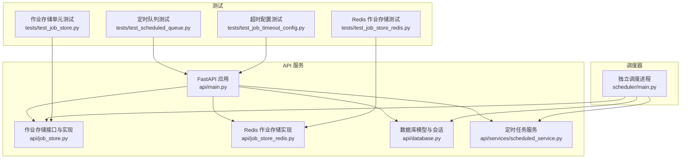
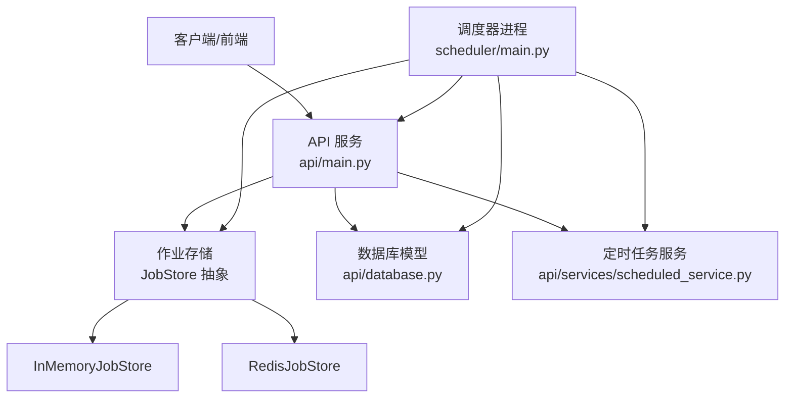
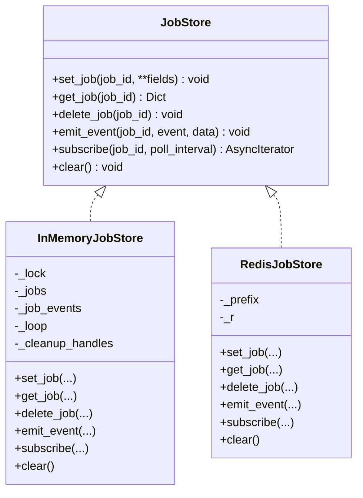
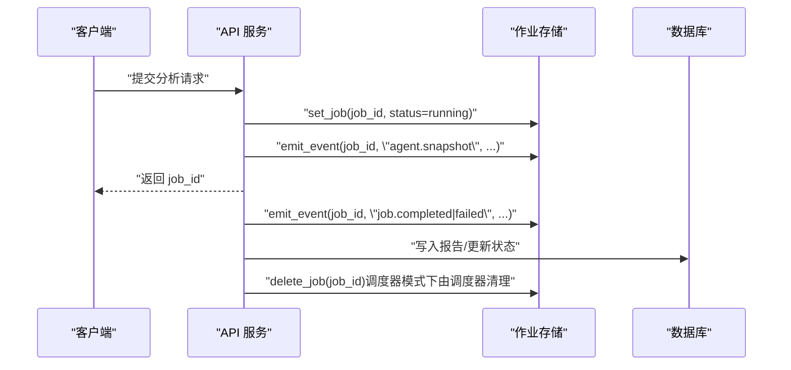
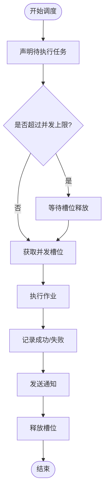
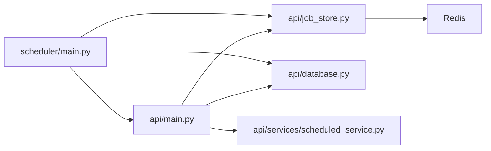

# 作业管理系统

<cite>
**本文引用的文件**
- [api/job_store.py](file://api/job_store.py)
- [api/job_store_redis.py](file://api/job_store_redis.py)
- [api/main.py](file://api/main.py)
- [scheduler/main.py](file://scheduler/main.py)
- [api/database.py](file://api/database.py)
- [api/services/scheduled_service.py](file://api/services/scheduled_service.py)
- [tests/test_job_store.py](file://tests/test_job_store.py)
- [tests/test_job_store_redis.py](file://tests/test_job_store_redis.py)
- [tests/test_scheduled_queue.py](file://tests/test_scheduled_queue.py)
- [tests/test_job_timeout_config.py](file://tests/test_job_timeout_config.py)
</cite>

## 目录
1. [简介](#简介)
2. [项目结构](#项目结构)
3. [核心组件](#核心组件)
4. [架构总览](#架构总览)
5. [详细组件分析](#详细组件分析)
6. [依赖分析](#依赖分析)
7. [性能考虑](#性能考虑)
8. [故障排查指南](#故障排查指南)
9. [结论](#结论)
10. [附录](#附录)

## 简介
本文件面向 TradingAgents-AShare 的作业管理系统，系统通过统一的作业存储抽象（JobStore）实现作业状态与事件的持久化与实时推送，支持内存与 Redis 两种后端，满足单实例与多实例部署场景。系统包含以下关键能力：
- 作业存储架构：抽象接口与内存/Redis 实现，保障状态一致性与事件流可靠传递
- 缓存与持久化：内存缓存用于高并发事件分发，Redis 用于跨进程/多实例共享；数据库用于任务元数据与报告持久化
- 作业状态管理：统一的状态机（pending/running/completed/failed），终端状态触发清理与通知
- 超时与重试：全局作业超时配置与失败自动降级；定时任务失败自动停用策略
- 异步调度与并发控制：基于信号量的并发槽位控制，队列等待与排队信息反馈
- 资源管理：线程池与事件循环资源的合理配置，避免饥饿与阻塞
- 作业监控与恢复：定时任务启动时的“陈旧任务”恢复逻辑，作业事件的 Ping 保活与超时终止
- 扩展与最佳实践：如何在现有架构上扩展新的作业类型与监控指标

## 项目结构
作业管理相关模块主要分布在以下位置：
- API 层：作业运行入口、作业状态与事件存储工厂、数据库模型与服务
- 调度器：独立的定时任务执行进程，负责并发控制与通知
- 测试：覆盖作业存储、Redis 后端、定时队列与超时配置

图表来源
- [api/main.py:1-800](file://api/main.py#L1-L800)
- [api/job_store.py:1-306](file://api/job_store.py#L1-L306)
- [api/job_store_redis.py:1-193](file://api/job_store_redis.py#L1-L193)
- [api/database.py:1-483](file://api/database.py#L1-L483)
- [api/services/scheduled_service.py:1-383](file://api/services/scheduled_service.py#L1-L383)
- [scheduler/main.py:1-447](file://scheduler/main.py#L1-L447)
- [tests/test_job_store.py:1-183](file://tests/test_job_store.py#L1-L183)
- [tests/test_job_store_redis.py:1-175](file://tests/test_job_store_redis.py#L1-L175)
- [tests/test_scheduled_queue.py:1-82](file://tests/test_scheduled_queue.py#L1-L82)
- [tests/test_job_timeout_config.py:1-43](file://tests/test_job_timeout_config.py#L1-L43)

章节来源
- [api/main.py:1-800](file://api/main.py#L1-L800)
- [scheduler/main.py:1-447](file://scheduler/main.py#L1-L447)

## 核心组件
- 作业存储抽象与实现
  - JobStore 协议定义了作业状态写入、读取、删除、事件发布与订阅等接口
  - InMemoryJobStore 基于线程锁与 asyncio 队列实现内存态作业存储，支持事件队列容量限制与终端状态清理
  - RedisJobStore 基于 Redis Hash 存储作业状态，Pub/Sub 实现实时事件推送，支持前缀隔离与批量清理
- 作业运行与生命周期
  - API 服务中的作业运行函数负责构建请求、调用分析图、更新状态、发布事件、记录数据库结果与异常处理
  - 调度器独立进程负责定时任务的并发控制、通知发送与“陈旧任务”恢复
- 数据库与服务
  - 数据库模型涵盖报告、用户、定时任务等，提供初始化与增量迁移
  - 定时任务服务封装任务的增删改查、触发时间校验、成功/失败标记与连续失败自动停用

章节来源
- [api/job_store.py:35-306](file://api/job_store.py#L35-L306)
- [api/job_store_redis.py:50-193](file://api/job_store_redis.py#L50-L193)
- [api/main.py:1635-1720](file://api/main.py#L1635-L1720)
- [scheduler/main.py:95-273](file://scheduler/main.py#L95-L273)
- [api/database.py:91-483](file://api/database.py#L91-L483)
- [api/services/scheduled_service.py:315-383](file://api/services/scheduled_service.py#L315-L383)

## 架构总览
作业管理采用“API 服务 + 独立调度器 + 作业存储 + 数据库”的分层架构。API 服务负责即时分析与手动触发；调度器负责定时任务的并发控制与通知；作业存储负责状态与事件的持久化与共享；数据库负责任务元数据与报告的持久化。

图表来源
- [api/main.py:1635-1720](file://api/main.py#L1635-L1720)
- [api/job_store.py:288-306](file://api/job_store.py#L288-L306)
- [api/job_store_redis.py:50-193](file://api/job_store_redis.py#L50-L193)
- [api/database.py:91-483](file://api/database.py#L91-L483)
- [api/services/scheduled_service.py:315-383](file://api/services/scheduled_service.py#L315-L383)
- [scheduler/main.py:95-273](file://scheduler/main.py#L95-L273)

## 详细组件分析

### 作业存储抽象与实现
- 接口职责
  - set_job/get_job/delete_job：作业状态的创建/合并/读取/删除
  - emit_event/subscribe：事件发布与订阅，支持 ping 保活与终端事件终止
  - clear：清空状态（用于启动清理）
- 内存实现
  - 使用线程锁保护共享状态，队列容量受环境变量控制，防止内存膨胀
  - 终端状态自动调度清理任务，避免泄漏
- Redis 实现
  - 作业状态以 Hash 存储，字段值序列化/反序列化支持复杂类型
  - 事件通过 Pub/Sub 发布，订阅侧在后台线程监听并通过队列桥接至事件循环
  - 支持前缀隔离与 SCAN 清理，避免生产污染

图表来源
- [api/job_store.py:35-306](file://api/job_store.py#L35-L306)
- [api/job_store_redis.py:50-193](file://api/job_store_redis.py#L50-L193)

章节来源
- [api/job_store.py:35-306](file://api/job_store.py#L35-L306)
- [api/job_store_redis.py:50-193](file://api/job_store_redis.py#L50-L193)
- [tests/test_job_store.py:12-183](file://tests/test_job_store.py#L12-L183)
- [tests/test_job_store_redis.py:57-175](file://tests/test_job_store_redis.py#L57-L175)

### 作业运行与事件流
- 运行流程
  - 构建分析请求，进入作业运行主流程
  - 更新状态为 running，发布事件
  - 执行分析图与各代理，期间持续发布中间事件
  - 结束时根据结果设置 completed 或 failed，并发布终端事件
  - 记录数据库结果，清理作业存储
- 事件流与订阅
  - 订阅者在超时情况下收到 ping 事件，作业完成后收到终端事件并终止
  - 内存实现支持队列溢出丢弃最旧事件，避免内存暴涨

图表来源
- [api/main.py:1635-1720](file://api/main.py#L1635-L1720)
- [api/job_store.py:108-287](file://api/job_store.py#L108-L287)
- [scheduler/main.py:251-273](file://scheduler/main.py#L251-L273)

章节来源
- [api/main.py:1635-1720](file://api/main.py#L1635-L1720)
- [api/job_store.py:108-287](file://api/job_store.py#L108-L287)
- [scheduler/main.py:251-273](file://scheduler/main.py#L251-L273)

### 定时任务调度与并发控制
- 并发控制
  - 调度器使用 asyncio.Semaphore 控制并发槽位，支持 0 表示不限制
  - 每个任务在获取到槽位后才真正执行，避免资源争抢
- 队列与等待
  - 通过测试可见，当并发达到上限时，后续任务进入等待队列，等待释放槽位
  - 作业状态中包含排队计数与并发限制信息，便于前端展示
- 陈旧任务恢复
  - 启动时扫描“running”状态但无对应完成报告的任务，进行恢复或置为 stale，确保系统一致性

图表来源
- [scheduler/main.py:95-273](file://scheduler/main.py#L95-L273)
- [tests/test_scheduled_queue.py:14-82](file://tests/test_scheduled_queue.py#L14-L82)

章节来源
- [scheduler/main.py:95-273](file://scheduler/main.py#L95-L273)
- [tests/test_scheduled_queue.py:14-82](file://tests/test_scheduled_queue.py#L14-L82)

### 数据库持久化与模型
- 初始化与迁移
  - 初始化表结构，针对现有部署进行轻量迁移（新增列、索引等）
  - 安全相关迁移：令牌哈希化存储、密钥变更后的重新加密
- 关键模型
  - 报告模型：保存分析结果、决策、指标与 JSON 字段
  - 用户与配置模型：用户信息、LLM 配置、通知开关等
  - 定时任务模型：任务状态、触发时间、连续失败次数等

章节来源
- [api/database.py:91-483](file://api/database.py#L91-L483)

### 作业状态管理、超时与重试
- 状态机
  - 统一状态：pending/running/completed/failed
  - 终端事件：job.completed、job.failed
- 超时
  - 全局默认超时约 30 分钟，可通过环境变量覆盖
  - 订阅侧在超时无事件时发送 ping，作业完成后终止
- 重试与降级
  - 定时任务连续失败达到阈值自动停用，避免无效重试
  - 失败时记录错误并回滚数据库事务，保证一致性

章节来源
- [api/main.py:348-351](file://api/main.py#L348-L351)
- [tests/test_job_timeout_config.py:19-43](file://tests/test_job_timeout_config.py#L19-L43)
- [api/job_store.py:17-28](file://api/job_store.py#L17-L28)
- [api/services/scheduled_service.py:340-350](file://api/services/scheduled_service.py#L340-L350)

### 异步任务调度、并发控制与资源管理
- 事件循环与线程池
  - API 与调度器均配置默认线程池大小，避免大量同步操作阻塞事件循环
  - 调度器在启动时根据并发需求调整线程池规模
- 任务跟踪
  - 使用集合跟踪后台任务，避免被垃圾回收，同时捕获未处理异常

章节来源
- [api/main.py:216-280](file://api/main.py#L216-L280)
- [scheduler/main.py:382-430](file://scheduler/main.py#L382-L430)

### 作业队列管理、优先级与负载均衡
- 队列与等待
  - 当并发达到上限时，新任务进入等待队列，等待已有任务释放槽位
  - 作业状态中包含排队计数与并发限制，便于前端展示与用户感知
- 负载均衡
  - 调度器按分钟轮询检查任务，结合非交易时段窗口避免业务高峰期冲突
  - 通过并发槽位控制整体吞吐，避免过载

章节来源
- [tests/test_scheduled_queue.py:14-82](file://tests/test_scheduled_queue.py#L14-L82)
- [scheduler/main.py:277-334](file://scheduler/main.py#L277-L334)

### 监控、性能统计与故障恢复
- 监控与事件
  - 事件流包含 ping 保活与终端事件，便于前端实时展示进度
  - 作业状态包含等待计数、并发限制等信息，辅助前端展示队列情况
- 性能统计
  - 可通过订阅事件流与数据库报告统计分析耗时与成功率
- 故障恢复
  - 启动时扫描“running”状态但无报告的任务，尝试恢复或置为 stale
  - 报告层面也进行“陈旧活动报告”的恢复处理

章节来源
- [api/job_store.py:239-276](file://api/job_store.py#L239-L276)
- [scheduler/main.py:337-378](file://scheduler/main.py#L337-L378)

## 依赖分析
- 模块耦合
  - API 服务依赖作业存储工厂与数据库服务，调度器独立运行但仍复用 API 中的作业运行函数
  - 作业存储抽象解耦内存与 Redis 实现，便于横向扩展
- 外部依赖
  - Redis 用于跨实例共享状态与事件
  - SQLAlchemy 用于数据库访问与迁移

图表来源
- [api/main.py:1635-1720](file://api/main.py#L1635-L1720)
- [api/job_store.py:288-306](file://api/job_store.py#L288-L306)
- [api/job_store_redis.py:50-193](file://api/job_store_redis.py#L50-L193)
- [api/database.py:91-483](file://api/database.py#L91-L483)
- [api/services/scheduled_service.py:315-383](file://api/services/scheduled_service.py#L315-L383)
- [scheduler/main.py:95-273](file://scheduler/main.py#L95-L273)

章节来源
- [api/main.py:1635-1720](file://api/main.py#L1635-L1720)
- [scheduler/main.py:95-273](file://scheduler/main.py#L95-L273)

## 性能考虑
- 事件队列容量限制：防止消费者断开导致内存无限增长
- 终端状态清理：避免已完成/失败作业长期占用内存
- 线程池与事件循环：合理配置默认线程池大小，避免阻塞与饥饿
- Redis Pub/Sub：后台线程监听，避免阻塞事件循环
- 并发槽位：通过信号量控制整体吞吐，避免资源争抢

## 故障排查指南
- 作业长时间无响应
  - 检查订阅侧是否正确处理 ping 事件与超时逻辑
  - 查看作业状态是否停留在 running，必要时检查超时配置
- Redis 不可用
  - 确认 REDIS_URL 环境变量与网络连通性
  - 降级为内存存储时，确认作业存储工厂行为
- 定时任务频繁失败
  - 查看连续失败计数与自动停用逻辑
  - 检查数据库记录与通知发送链路
- 内存泄漏或队列堆积
  - 确认订阅结束后队列是否被清理
  - 检查队列容量与溢出策略

章节来源
- [api/job_store.py:17-28](file://api/job_store.py#L17-L28)
- [api/job_store.py:120-179](file://api/job_store.py#L120-L179)
- [api/job_store.py:180-238](file://api/job_store.py#L180-L238)
- [api/job_store_redis.py:104-177](file://api/job_store_redis.py#L104-L177)
- [api/services/scheduled_service.py:340-350](file://api/services/scheduled_service.py#L340-L350)

## 结论
该作业管理系统通过清晰的抽象与分层设计，在单实例与多实例场景下均能稳定运行。内存与 Redis 两种作业存储实现满足不同部署形态的需求；数据库模型与服务为任务与报告提供了可靠的持久化基础；调度器通过并发槽位与队列机制实现了稳定的定时任务执行；事件流与超时/重试策略保障了可观测性与可靠性。建议在生产环境中启用 Redis 作业存储与合理的线程池配置，并结合监控与告警体系持续优化。

## 附录
- 最佳实践
  - 生产环境启用 Redis 作业存储与事件通道
  - 合理设置并发槽位与线程池大小，避免过载
  - 使用终端事件与 ping 保活机制提升用户体验
  - 对定时任务失败进行自动停用与告警
  - 定期清理陈旧任务与报告，保持系统健康
- 扩展指南
  - 新增作业类型：实现 JobStore 接口或复用现有实现，遵循状态机与事件规范
  - 新增监控指标：在事件流中注入关键节点数据，结合数据库统计
  - 新增通知渠道：在调度器中扩展通知服务，支持多种消息通道