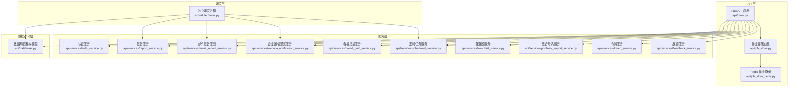
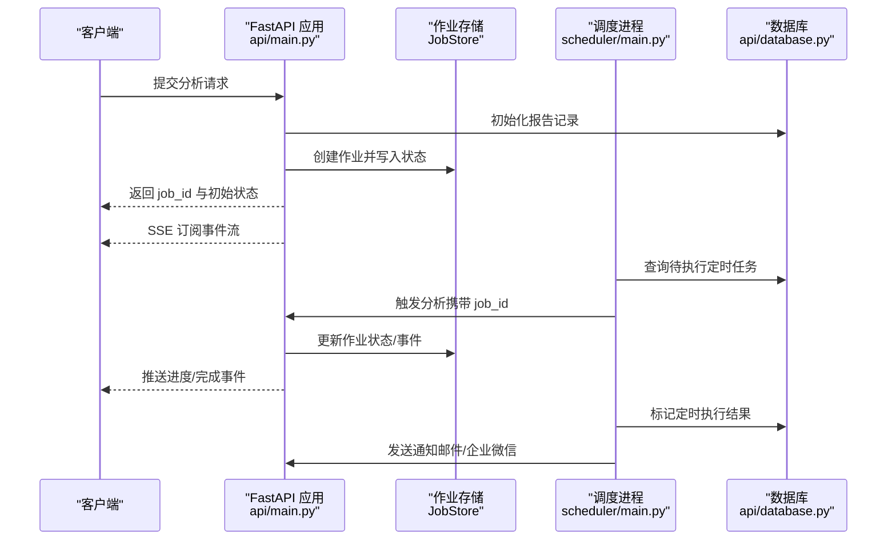
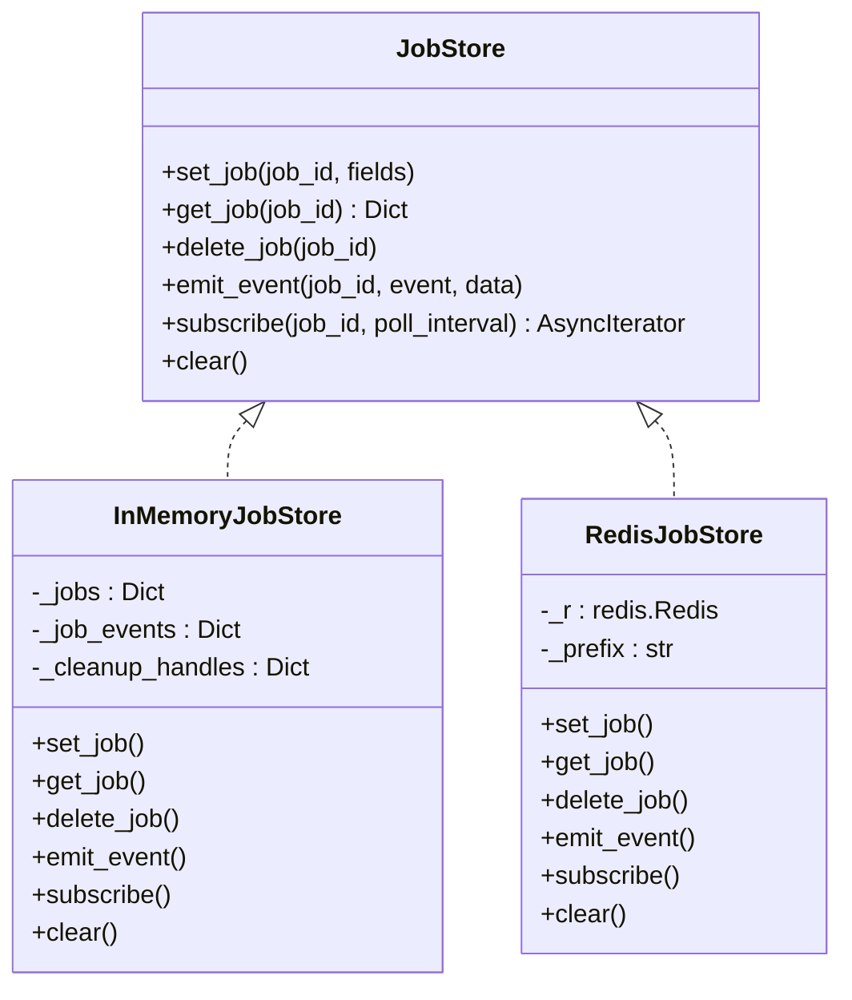
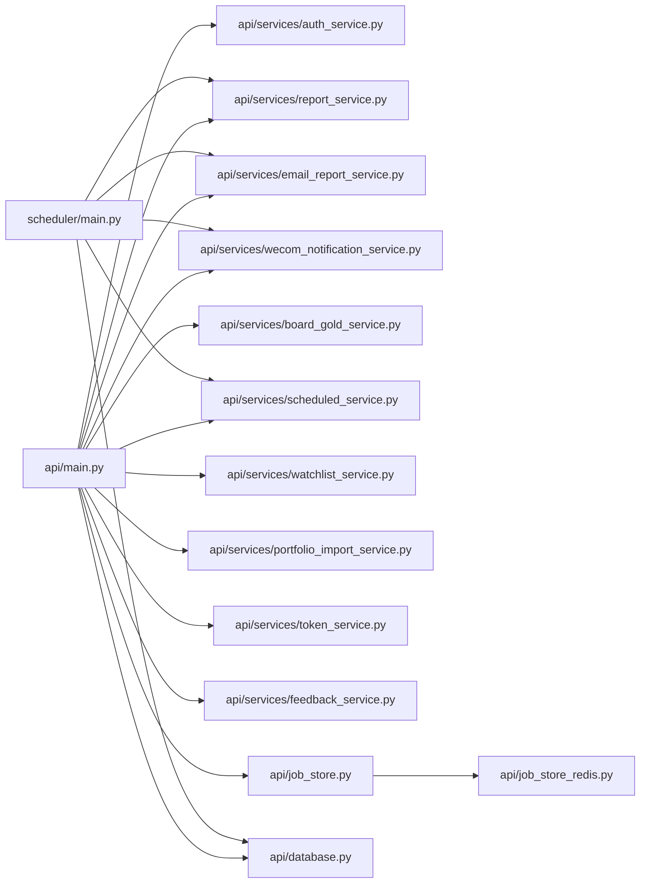

# 后端服务

<cite>
**本文引用的文件**
- [api/main.py](file://api/main.py)
- [api/database.py](file://api/database.py)
- [api/job_store.py](file://api/job_store.py)
- [api/job_store_redis.py](file://api/job_store_redis.py)
- [scheduler/main.py](file://scheduler/main.py)
- [api/services/auth_service.py](file://api/services/auth_service.py)
- [api/services/report_service.py](file://api/services/report_service.py)
- [api/services/email_report_service.py](file://api/services/email_report_service.py)
- [api/services/wecom_notification_service.py](file://api/services/wecom_notification_service.py)
- [api/services/board_gold_service.py](file://api/services/board_gold_service.py)
- [api/services/scheduled_service.py](file://api/services/scheduled_service.py)
- [api/services/watchlist_service.py](file://api/services/watchlist_service.py)
- [api/services/portfolio_import_service.py](file://api/services/portfolio_import_service.py)
- [api/services/token_service.py](file://api/services/token_service.py)
- [api/services/feedback_service.py](file://api/services/feedback_service.py)
</cite>

## 目录
1. [简介](#简介)
2. [项目结构](#项目结构)
3. [核心组件](#核心组件)
4. [架构总览](#架构总览)
5. [详细组件分析](#详细组件分析)
6. [依赖关系分析](#依赖关系分析)
7. [性能考虑](#性能考虑)
8. [故障排查指南](#故障排查指南)
9. [结论](#结论)
10. [附录](#附录)

## 简介
本文件面向 TradingAgents-AShare 后端服务，系统性梳理 FastAPI 应用结构、作业管理系统与任务调度机制，详解认证服务、报告服务、邮件通知服务、看板服务与企业微信通知服务，阐述作业状态管理、Redis 缓存策略与异步任务处理，解释文件上传下载、数据持久化与事务管理，以及服务监控、日志记录与错误处理机制，并提供服务扩展指南与性能调优建议。

## 项目结构
后端服务采用模块化分层设计：
- API 层：FastAPI 应用入口与路由定义，负责请求接入、参数校验、响应封装与 SSE 事件流。
- 服务层：围绕业务域划分的服务模块，包括认证、报告、邮件、通知、看板、定时任务、自选股、组合导入、令牌与反馈等。
- 数据访问层：基于 SQLAlchemy 的数据库模型与会话管理，统一事务控制与迁移兼容。
- 作业与调度：作业状态存储抽象（内存/Redis），独立调度进程与并发控制，SSE 实时事件推送。
- 代理与工具：TradingAgents 图谱与数据采集、LLM 客户端工厂、数据流提供者等。

图示来源
- [api/main.py:1-4772](file://api/main.py#L1-L4772)
- [api/job_store.py:1-306](file://api/job_store.py#L1-L306)
- [api/job_store_redis.py:1-193](file://api/job_store_redis.py#L1-L193)
- [scheduler/main.py:1-447](file://scheduler/main.py#L1-L447)
- [api/database.py:1-483](file://api/database.py#L1-L483)

章节来源
- [api/main.py:1-4772](file://api/main.py#L1-L4772)
- [api/database.py:1-483](file://api/database.py#L1-L483)
- [api/job_store.py:1-306](file://api/job_store.py#L1-L306)
- [api/job_store_redis.py:1-193](file://api/job_store_redis.py#L1-L193)
- [scheduler/main.py:1-447](file://scheduler/main.py#L1-L447)

## 核心组件
- FastAPI 应用与生命周期：初始化数据库、加载全局缓存、设置 AnyIO 线程池与默认 asyncio 执行器、安全告警、版本上报与 CORS 配置。
- 作业状态与事件：统一 JobStore 接口，内存实现 InMemoryJobStore，Redis 实现 RedisJobStore，支持 SSE 事件队列与 TTL 清理。
- 独立调度器：独立进程按分钟轮询定时任务，带并发信号量与失败重试，触发分析并发送通知。
- 服务编排：认证、报告、邮件、通知、看板、定时、自选股、组合导入、令牌与反馈等服务模块化组织。

章节来源
- [api/main.py:216-279](file://api/main.py#L216-L279)
- [api/job_store.py:35-67](file://api/job_store.py#L35-L67)
- [api/job_store.py:69-287](file://api/job_store.py#L69-L287)
- [api/job_store_redis.py:51-193](file://api/job_store_redis.py#L51-L193)
- [scheduler/main.py:277-333](file://scheduler/main.py#L277-L333)

## 架构总览
系统采用“API + 服务 + 数据库 + 作业存储 + 独立调度”的分层架构。API 层通过 SSE 提供实时进度，作业状态与事件由 JobStore 统一管理；调度器独立运行，负责定时任务触发与通知；服务层解耦业务逻辑，数据库模型统一数据持久化。

图示来源
- [api/main.py:160-214](file://api/main.py#L160-L214)
- [scheduler/main.py:178-249](file://scheduler/main.py#L178-L249)
- [api/job_store.py:108-179](file://api/job_store.py#L108-L179)
- [api/job_store_redis.py:78-114](file://api/job_store_redis.py#L78-L114)

## 详细组件分析

### FastAPI 应用与生命周期
- 生命周期钩子：启动时提升 AnyIO 线程令牌、设置默认 asyncio 执行器、初始化数据库、清理作业存储、安全告警（默认密钥）、预热交易日历与股票映射。
- CORS 与版本：动态允许源、生产环境隐藏文档路径、版本号来自环境变量或包元数据。
- 全局缓存：股票名称→代码映射（7 天 TTL），线程安全锁保护；交易日历预加载。
- 作业运行：统一分析入口，支持手动触发与定时触发，兼容不同用户上下文构建。

章节来源
- [api/main.py:216-279](file://api/main.py#L216-L279)
- [api/main.py:298-305](file://api/main.py#L298-L305)
- [api/main.py:387-440](file://api/main.py#L387-L440)
- [api/main.py:160-214](file://api/main.py#L160-L214)

### 作业管理系统与任务调度
- JobStore 抽象：定义 set/get/delete/emit/subscribe/clear 接口，内存实现 InMemoryJobStore 使用线程锁与 asyncio 队列，支持 TTL 自动清理与 ping 保活。
- Redis 实现：RedisJobStore 使用 Hash 存储作业状态，Pub/Sub 推送事件，支持前缀隔离与批量清理。
- 调度器：独立进程每分钟轮询，按交易日与非交易时段过滤，使用信号量限制并发，成功/失败记录与通知发送。

图示来源
- [api/job_store.py:35-67](file://api/job_store.py#L35-L67)
- [api/job_store.py:69-287](file://api/job_store.py#L69-L287)
- [api/job_store_redis.py:51-193](file://api/job_store_redis.py#L51-L193)

章节来源
- [api/job_store.py:35-67](file://api/job_store.py#L35-L67)
- [api/job_store.py:69-287](file://api/job_store.py#L69-L287)
- [api/job_store_redis.py:51-193](file://api/job_store_redis.py#L51-L193)
- [scheduler/main.py:95-123](file://scheduler/main.py#L95-L123)
- [scheduler/main.py:277-333](file://scheduler/main.py#L277-L333)

### 认证服务
- 密钥与加密：基于 TA_APP_SECRET_KEY 的 Fernet 加密，支持明文迁移与回退解密；JWT 生成与校验。
- 登录验证码：邮箱发送与校验，过期时间与消费标记；首次登录创建用户并记录 IP。
- 用户配置：LLM 提供商、模型、最大辩论轮次、默认分析师等配置的增删改查与加密存储。

章节来源
- [api/services/auth_service.py:39-84](file://api/services/auth_service.py#L39-L84)
- [api/services/auth_service.py:99-112](file://api/services/auth_service.py#L99-L112)
- [api/services/auth_service.py:146-184](file://api/services/auth_service.py#L146-L184)
- [api/services/auth_service.py:239-295](file://api/services/auth_service.py#L239-L295)

### 报告服务
- 结构化抽取：优先使用 LLM 结构化输出，失败时回退正则抽取置信度、目标价、止损价与风险项、关键指标。
- 报告持久化：创建/更新/完成报告，支持部分字段更新与批量删除；恢复异常活跃报告为失败。
- 字段解析：从 result_data 中解析各分析师报告与最终决策，生成方向、置信度、价格等结构化字段。

章节来源
- [api/services/report_service.py:97-145](file://api/services/report_service.py#L97-L145)
- [api/services/report_service.py:201-256](file://api/services/report_service.py#L201-L256)
- [api/services/report_service.py:260-462](file://api/services/report_service.py#L260-L462)
- [api/services/report_service.py:326-361](file://api/services/report_service.py#L326-L361)

### 邮件通知服务
- HTML 渲染：Markdown 转换为内联样式的 HTML，包含决策卡片、方向徽章、风险提示、关键指标与最终决策摘要。
- SMTP 发送：兼容 STARTTLS/SSL，支持失败重试；异步包装器在失败后延时重试。
- 前端链接：根据 CORS 或显式 FRONTEND_URL 生成报告链接。

章节来源
- [api/services/email_report_service.py:168-402](file://api/services/email_report_service.py#L168-L402)
- [api/services/email_report_service.py:408-463](file://api/services/email_report_service.py#L408-L463)
- [api/services/email_report_service.py:469-484](file://api/services/email_report_service.py#L469-L484)

### 企业微信通知服务
- 消息构建：摘要截断与格式化，支持测试消息。
- URL 规范化：仅允许官方域名与 key 参数，校验 HTTPS。
- 发送与重试：POST 请求发送文本消息，失败后短延时重试。

章节来源
- [api/services/wecom_notification_service.py:26-54](file://api/services/wecom_notification_service.py#L26-L54)
- [api/services/wecom_notification_service.py:57-86](file://api/services/wecom_notification_service.py#L57-L86)
- [api/services/wecom_notification_service.py:88-133](file://api/services/wecom_notification_service.py#L88-L133)

### 看板服务（Board-Gold）
- 策略注册：多种入场策略（三阴不破阳、 overnight_hold、shrink_yang、Phoenix、triple_volume、shrink_yin）与出场策略（固定止盈止损、追踪止盈、Phoenix 出场）。
- 信号生成：基于历史日线 DataFrame 扫描，输出入场/出场信号，包含额外信息（如支撑价、整理天数等）。
- 缓存脚本：提供一键更新本地缓存脚本集合，支持增量与全量刷新。

章节来源
- [api/services/board_gold_service.py:29-91](file://api/services/board_gold_service.py#L29-L91)
- [api/services/board_gold_service.py:267-790](file://api/services/board_gold_service.py#L267-L790)
- [api/services/board_gold_service.py:148-176](file://api/services/board_gold_service.py#L148-L176)

### 定时任务服务
- 任务管理：创建、更新、删除、批量更新与查询；触发时间验证（仅允许夜间时段）；并发失败自动停用。
- 待执行查询：按交易日与触发时间筛选；手动测试结果记录不占用当日配额。
- 运行记录：成功/失败标记与连续失败计数，超过阈值自动停用。

章节来源
- [api/services/scheduled_service.py:16-32](file://api/services/scheduled_service.py#L16-L32)
- [api/services/scheduled_service.py:109-146](file://api/services/scheduled_service.py#L109-L146)
- [api/services/scheduled_service.py:315-327](file://api/services/scheduled_service.py#L315-L327)
- [api/services/scheduled_service.py:329-368](file://api/services/scheduled_service.py#L329-L368)

### 自选股与组合导入服务
- 自选股：去重、排序、与定时任务关联查询。
- 组合导入：标准化代码、去重、计算总市值与持仓占比；导入后自动为有持仓的标的创建定时任务。

章节来源
- [api/services/watchlist_service.py:13-36](file://api/services/watchlist_service.py#L13-L36)
- [api/services/portfolio_import_service.py:31-117](file://api/services/portfolio_import_service.py#L31-L117)
- [api/services/portfolio_import_service.py:164-184](file://api/services/portfolio_import_service.py#L164-L184)

### 令牌与反馈服务
- 令牌：HMAC-SHA256 哈希存储，一次性返回明文令牌，限制每个用户最多创建数量。
- 反馈：用户提交反馈、分页查询、标记已读、未读计数。

章节来源
- [api/services/token_service.py:34-63](file://api/services/token_service.py#L34-L63)
- [api/services/token_service.py:86-106](file://api/services/token_service.py#L86-L106)
- [api/services/feedback_service.py:18-29](file://api/services/feedback_service.py#L18-L29)
- [api/services/feedback_service.py:32-58](file://api/services/feedback_service.py#L32-L58)

## 依赖关系分析
- API 与服务：api/main.py 依赖各服务模块进行业务编排；服务间通过数据库模型与会话管理协作。
- 作业存储：InMemoryJobStore 与 RedisJobStore 实现同一接口，便于在单机与分布式部署间切换。
- 调度器：scheduler/main.py 直接复用 api/main.py 中的分析入口与作业状态操作，保证一致性。
- 数据库：api/database.py 统一定义模型与迁移兼容逻辑，服务层通过 Session 进行事务控制。

图示来源
- [api/main.py:42-44](file://api/main.py#L42-L44)
- [api/job_store.py:289-306](file://api/job_store.py#L289-L306)
- [scheduler/main.py:74-90](file://scheduler/main.py#L74-L90)

章节来源
- [api/main.py:42-44](file://api/main.py#L42-L44)
- [api/job_store.py:289-306](file://api/job_store.py#L289-L306)
- [scheduler/main.py:74-90](file://scheduler/main.py#L74-L90)

## 性能考虑
- 线程池与并发：启动时提升 AnyIO 线程令牌与默认 asyncio 执行器，避免同步端点与长时间任务互相阻塞。
- 作业存储：InMemoryJobStore 事件队列有容量上限并丢弃最旧事件，防止内存膨胀；RedisJobStore 使用 Hash 与 Pub/Sub，适合多工作进程共享。
- 数据库连接池：SQLite/PostgreSQL/MySQL 采用不同连接池参数，生产环境建议使用 PostgreSQL/MySQL 并合理设置池大小。
- 缓存策略：股票映射（名称→代码）7 天 TTL，交易日历预加载，减少重复 IO。
- 调度并发：调度器使用信号量限制并发，避免瞬时大量任务冲击下游。

章节来源
- [api/main.py:216-279](file://api/main.py#L216-L279)
- [api/job_store.py:20-28](file://api/job_store.py#L20-L28)
- [api/database.py:14-51](file://api/database.py#L14-L51)
- [scheduler/main.py:95-123](file://scheduler/main.py#L95-L123)

## 故障排查指南
- 安全告警：未设置 TA_APP_SECRET_KEY 时会打印严重警告，生产环境务必配置。
- 数据库迁移：SQLite 新增列采用运行时探测与轻量 ALTER，失败不影响启动但需关注日志。
- 令牌与密钥：令牌哈希存储，迁移与回退解密失败时需检查密钥配置。
- 报告异常：活跃报告在重启或中断后会被标记为失败，可通过恢复函数批量处理。
- 邮件与企业微信：SMTP/SSL/STARTTLS 配置错误会导致发送失败，服务提供重试；Webhook URL 校验失败会抛出异常。
- 调度器：启动时恢复“运行中”状态的任务，必要时重置为 stale 并清理；并发不足时调整 SCHEDULER_CONCURRENCY。

章节来源
- [api/main.py:257-264](file://api/main.py#L257-L264)
- [api/database.py:98-141](file://api/database.py#L98-L141)
- [api/services/auth_service.py:69-84](file://api/services/auth_service.py#L69-L84)
- [api/services/report_service.py:326-361](file://api/services/report_service.py#L326-L361)
- [api/services/email_report_service.py:408-463](file://api/services/email_report_service.py#L408-L463)
- [api/services/wecom_notification_service.py:57-86](file://api/services/wecom_notification_service.py#L57-L86)
- [scheduler/main.py:335-378](file://scheduler/main.py#L335-L378)

## 结论
该后端服务以 FastAPI 为核心，结合统一的作业状态管理与独立调度器，实现了高并发、可观测与可扩展的 A 股智能投研分析平台。通过模块化的服务层与完善的数据库模型，系统在安全性、稳定性与性能之间取得平衡。建议在生产环境中启用 Redis 作业存储、合理配置数据库连接池与并发参数，并持续优化 LLM 结构化抽取与数据缓存策略。

## 附录
- 扩展指南：新增服务遵循现有服务模式（Session 注入、异常捕获、日志记录），通过 api/main.py 的依赖注入注册；如需跨进程共享状态，优先采用 RedisJobStore。
- 性能调优：增大 AnyIO 线程令牌与 asyncio 默认执行器；调整 JOB_EVENT_QUEUE_MAXSIZE 与 INMEMORY_JOB_TTL；为调度器设置合适的 SCHEDULER_CONCURRENCY；针对数据库热点表建立索引（如 reports.status、scheduled_analyses.user_id/symbol）。
- 监控与日志：利用标准日志模块输出时间戳日志；SSE 事件可用于前端进度监控；对关键服务（邮件/企业微信）增加失败计数与告警。