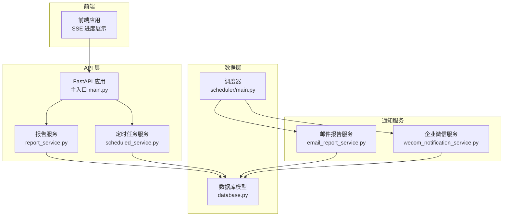
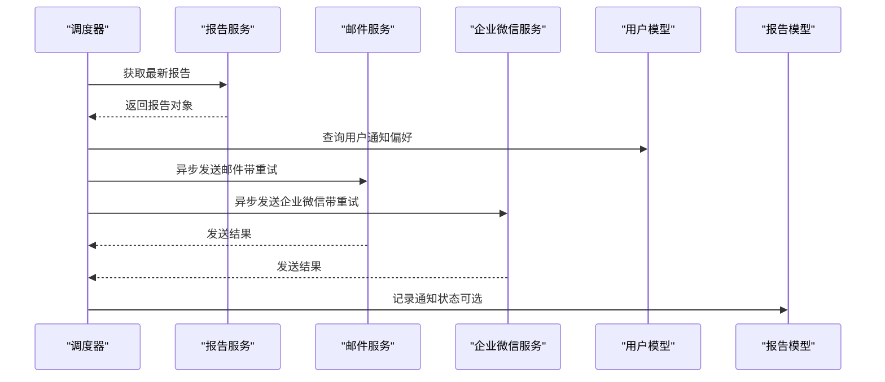
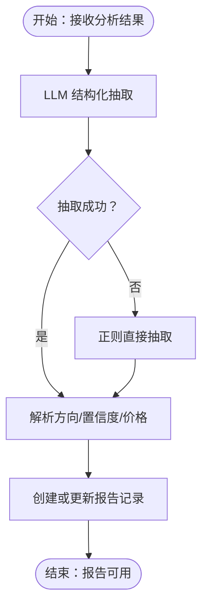
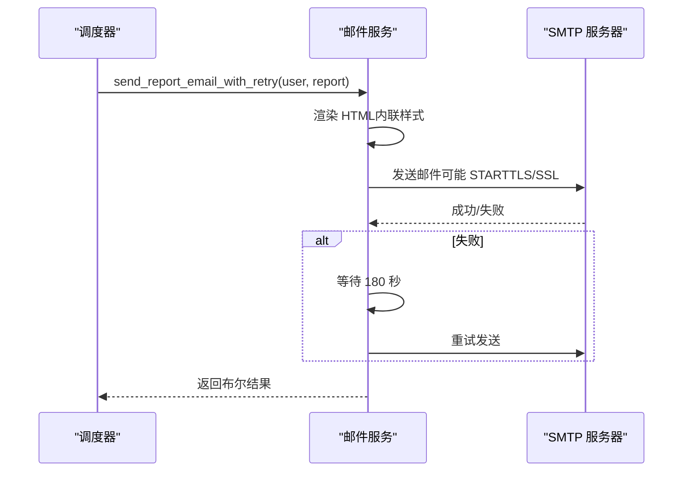
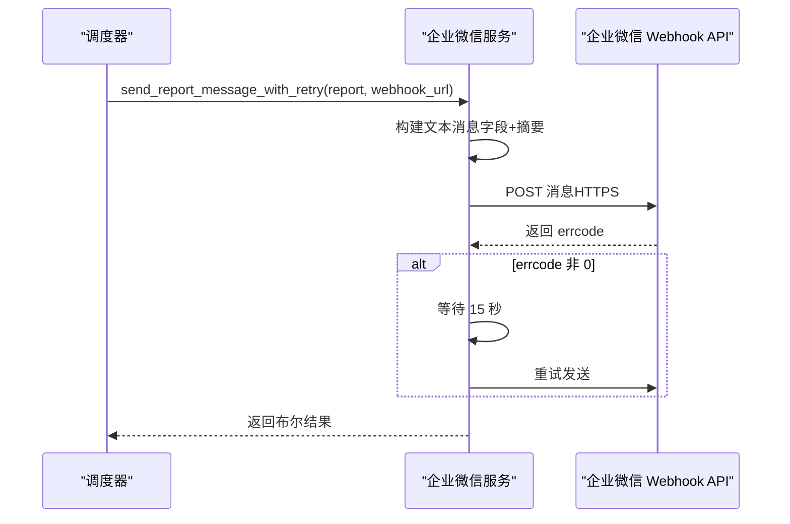
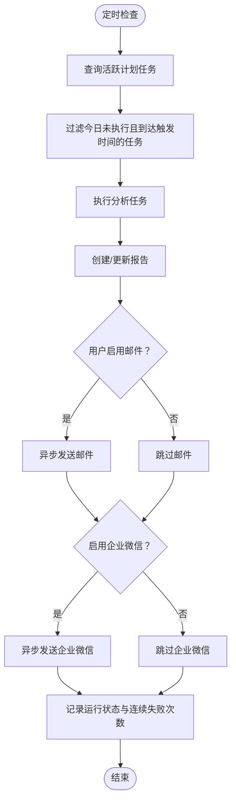
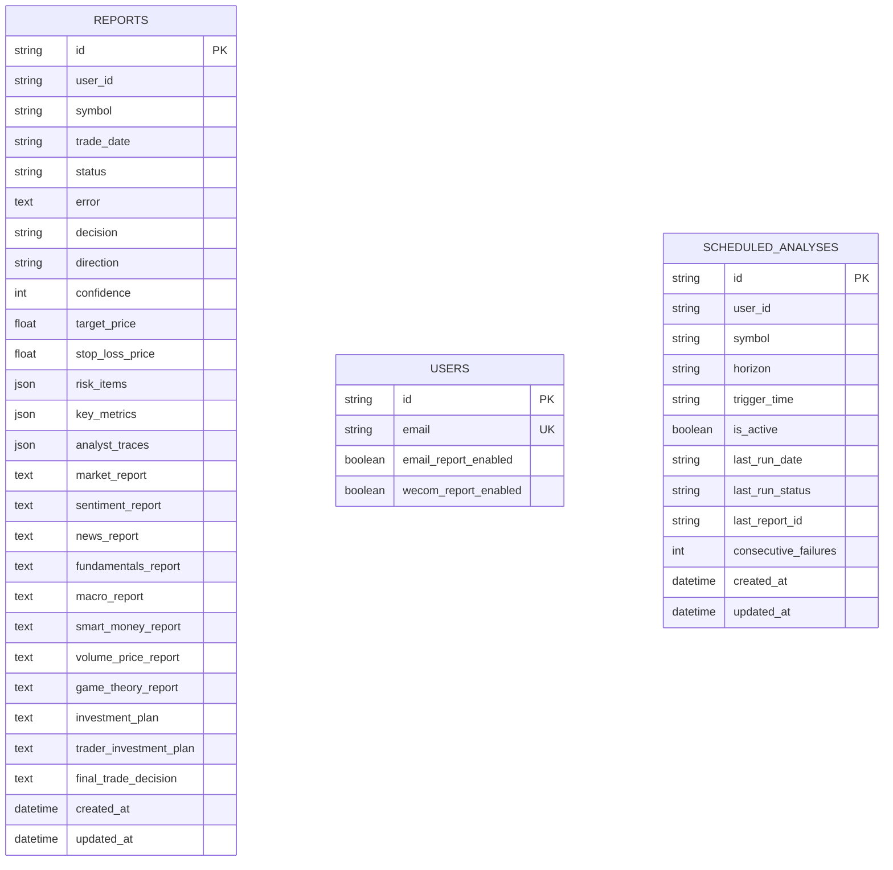
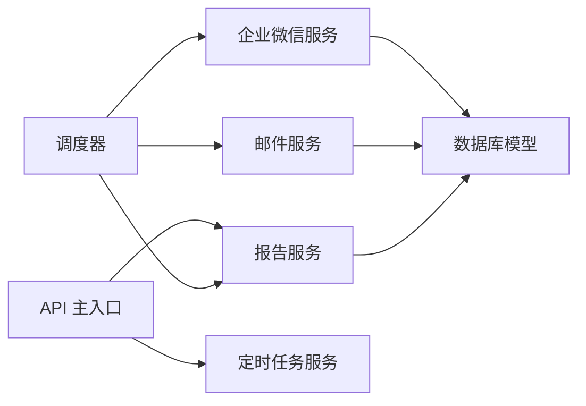

# 报告通知服务

<cite>
**本文档引用的文件**
- [email_report_service.py](file://api/services/email_report_service.py)
- [wecom_notification_service.py](file://api/services/wecom_notification_service.py)
- [report_service.py](file://api/services/report_service.py)
- [scheduled_service.py](file://api/services/scheduled_service.py)
- [database.py](file://api/database.py)
- [main.py](file://api/main.py)
- [scheduler_main.py](file://scheduler/main.py)
- [test_email_report_service.py](file://tests/test_email_report_service.py)
- [test_wecom_notification_service.py](file://tests/test_wecom_notification_service.py)
</cite>

## 目录
1. [简介](#简介)
2. [项目结构](#项目结构)
3. [核心组件](#核心组件)
4. [架构概览](#架构概览)
5. [详细组件分析](#详细组件分析)
6. [依赖关系分析](#依赖关系分析)
7. [性能考量](#性能考量)
8. [故障排查指南](#故障排查指南)
9. [结论](#结论)
10. [附录](#附录)

## 简介
本文件面向 TradingAgents-AShare 的报告通知服务，系统性阐述报告生成与分发的完整流程，包括：
- 报告生成：结构化解析、模板渲染与数据格式化
- 通知渠道：邮件报告、企业微信推送与消息推送机制
- 异步处理：并发执行、重试策略与失败恢复
- 存储管理：数据库模型、版本迁移与归档策略
- 扩展与优化：配置项、个性化定制与性能提升建议

## 项目结构
通知服务涉及前后端与调度器协同工作：
- API 层：负责分析任务触发、报告创建与通知配置
- 服务层：报告服务、邮件服务、企业微信服务
- 数据层：报告与用户模型、计划任务模型
- 调度器：定时任务执行与通知发送
- 前端：SSE 实时进度展示与交互

**图表来源**
- [main.py](file://api/main.py)
- [report_service.py](file://api/services/report_service.py)
- [scheduled_service.py](file://api/services/scheduled_service.py)
- [email_report_service.py](file://api/services/email_report_service.py)
- [wecom_notification_service.py](file://api/services/wecom_notification_service.py)
- [database.py](file://api/database.py)
- [scheduler_main.py](file://scheduler/main.py)

**章节来源**
- [main.py](file://api/main.py)
- [database.py](file://api/database.py)

## 核心组件
- 报告服务：负责结构化解析、字段提取、报告创建与查询
- 邮件报告服务：HTML 渲染、SMTP 发送、异步重试
- 企业微信服务：文本消息构建、Webhook 校验与发送、异步重试
- 定时任务服务：计划任务管理、运行状态记录与失败自动停用
- 数据库模型：报告、用户、计划任务等模型定义与迁移
- 调度器：定时触发分析、加载通知目标并异步发送通知

**章节来源**
- [report_service.py](file://api/services/report_service.py)
- [email_report_service.py](file://api/services/email_report_service.py)
- [wecom_notification_service.py](file://api/services/wecom_notification_service.py)
- [scheduled_service.py](file://api/services/scheduled_service.py)
- [database.py](file://api/database.py)
- [scheduler_main.py](file://scheduler/main.py)

## 架构概览
通知服务采用“分析完成后异步通知”的模式，通过调度器统一协调邮件与企业微信两种渠道。

**图表来源**
- [scheduler_main.py](file://scheduler/main.py)
- [email_report_service.py](file://api/services/email_report_service.py)
- [wecom_notification_service.py](file://api/services/wecom_notification_service.py)
- [report_service.py](file://api/services/report_service.py)
- [database.py](file://api/database.py)

## 详细组件分析

### 报告生成与结构化解析
- 结构化解析：基于 LLM 的结构化输出抽取关键字段（决策、置信度、目标价、止损价、风险与关键指标），并提供正则回退方案
- 字段提取：从最终交易决策与基本面报告中提取方向与理由，用于邮件 HTML 摘要展示
- 报告创建：支持初始化 pending 状态、部分更新与最终落库，同时维护状态机与错误信息

**图表来源**
- [report_service.py](file://api/services/report_service.py)

**章节来源**
- [report_service.py](file://api/services/report_service.py)

### 邮件报告服务
- HTML 渲染：将报告内容转换为兼容邮件客户端的 HTML，内联样式与表格美化，支持 Markdown 片段渲染
- 前端链接：根据环境变量推断前端地址，生成“查看完整报告”按钮
- SMTP 发送：支持 STARTTLS/SSL/TLS 切换，凭据与发件人自动推断，异常捕获不抛出
- 异步重试：首次失败后延迟重试，避免阻塞主线程

**图表来源**
- [email_report_service.py](file://api/services/email_report_service.py)
- [scheduler_main.py](file://scheduler/main.py)

**章节来源**
- [email_report_service.py](file://api/services/email_report_service.py)
- [scheduler_main.py](file://scheduler/main.py)

### 企业微信通知服务
- 文本消息构建：从报告中提取核心字段与摘要，限制长度并进行紧凑化处理
- Webhook 校验：支持 key 形式与标准 URL 两种输入，严格校验域名、路径与参数
- 发送与重试：POST 请求超时控制，JSON 响应校验 errcode，失败后短暂重试

**图表来源**
- [wecom_notification_service.py](file://api/services/wecom_notification_service.py)
- [scheduler_main.py](file://scheduler/main.py)

**章节来源**
- [wecom_notification_service.py](file://api/services/wecom_notification_service.py)
- [scheduler_main.py](file://scheduler/main.py)

### 定时任务与通知调度
- 计划任务管理：支持创建、批量更新、删除与查询，限制最大数量，校验触发时间与周期
- 运行状态：每日记录最后一次运行日期、状态与连续失败次数，超过阈值自动停用
- 通知触发：在分析完成后异步发送邮件与企业微信通知，记录发送结果

**图表来源**
- [scheduled_service.py](file://api/services/scheduled_service.py)
- [scheduler_main.py](file://scheduler/main.py)

**章节来源**
- [scheduled_service.py](file://api/services/scheduled_service.py)
- [scheduler_main.py](file://scheduler/main.py)

### 数据模型与存储管理
- 报告模型：包含决策、方向、置信度、价格、风险与关键指标等字段，以及各分析师报告片段
- 用户模型：包含邮件与企业微信通知开关字段
- 计划任务模型：记录周期、触发时间、运行状态与连续失败次数
- 数据库迁移：按需添加缺失列，保证向后兼容

**图表来源**
- [database.py](file://api/database.py)

**章节来源**
- [database.py](file://api/database.py)

## 依赖关系分析
- 组件耦合：调度器依赖报告服务与通知服务；通知服务依赖数据库模型；API 层依赖服务层
- 外部依赖：SMTP、企业微信 Webhook、请求库、Markdown 渲染
- 并发与线程：使用 asyncio.to_thread 将阻塞操作移至线程池，避免阻塞事件循环

**图表来源**
- [scheduler_main.py](file://scheduler/main.py)
- [report_service.py](file://api/services/report_service.py)
- [email_report_service.py](file://api/services/email_report_service.py)
- [wecom_notification_service.py](file://api/services/wecom_notification_service.py)
- [database.py](file://api/database.py)
- [main.py](file://api/main.py)

**章节来源**
- [scheduler_main.py](file://scheduler/main.py)
- [main.py](file://api/main.py)

## 性能考量
- 异步与线程池：使用 asyncio.to_thread 与默认线程池，合理设置线程数以平衡 I/O 密集场景
- 缓存与复用：全局共享数据采集器，避免重复拉取相同标的的数据
- 日志与监控：关键路径记录 INFO/WARNING/ERROR，便于定位性能瓶颈
- 数据库连接池：SQLite 使用 WAL 模式与连接池参数，PostgreSQL/MySQL 使用更大连接池

[本节为通用指导，无需特定文件引用]

## 故障排查指南
- 邮件发送失败
  - 症状：返回 False 或记录错误日志
  - 排查：检查 SMTP 环境变量、STARTTLS/SSL 配置、网络连通性
  - 重试：服务内置一次性重试，间隔固定
- 企业微信发送失败
  - 症状：errcode 非 0 或非 JSON 响应
  - 排查：校验 Webhook URL、域名与参数、HTTPS 要求
  - 重试：服务内置短间隔重试
- 报告未生成或状态异常
  - 症状：报告状态为 pending/running 或失败
  - 排查：检查分析任务是否完成、数据库状态字段、错误信息
- 定时任务未执行
  - 症状：计划任务未触发
  - 排查：检查触发时间范围、当日是否已执行、连续失败次数导致的自动停用

**章节来源**
- [email_report_service.py](file://api/services/email_report_service.py)
- [wecom_notification_service.py](file://api/services/wecom_notification_service.py)
- [report_service.py](file://api/services/report_service.py)
- [scheduled_service.py](file://api/services/scheduled_service.py)

## 结论
报告通知服务通过结构化解析、模板渲染与多渠道异步通知，实现了从分析到交付的闭环。其设计强调：
- 可靠性：双通道通知与重试策略
- 可扩展：模块化服务与配置项
- 可维护：清晰的状态机与日志体系

## 附录

### 通知渠道配置与个性化
- 邮件配置：通过环境变量设置 SMTP 主机、端口、用户名、密码、发件人与 TLS 选项
- 企业微信配置：支持 key 或标准 URL，严格校验域名与参数
- 用户偏好：用户表包含邮件与企业微信通知开关字段，API 支持更新

**章节来源**
- [email_report_service.py](file://api/services/email_report_service.py)
- [wecom_notification_service.py](file://api/services/wecom_notification_service.py)
- [database.py](file://api/database.py)
- [main.py](file://api/main.py)

### 批量处理与并发
- 批量定时任务：支持批量创建、更新与删除，事务内执行
- 并发执行：调度器使用异步任务与线程池，避免阻塞
- 限流与保护：API 层设置线程限制与默认线程池大小

**章节来源**
- [scheduled_service.py](file://api/services/scheduled_service.py)
- [main.py](file://api/main.py)

### 测试覆盖
- 邮件服务：HTML 渲染、SMTP 发送、重试逻辑
- 企业微信：消息构建、URL 校验、发送与重试
- 报告服务：结构化解析、字段提取、报告创建与查询

**章节来源**
- [test_email_report_service.py](file://tests/test_email_report_service.py)
- [test_wecom_notification_service.py](file://tests/test_wecom_notification_service.py)