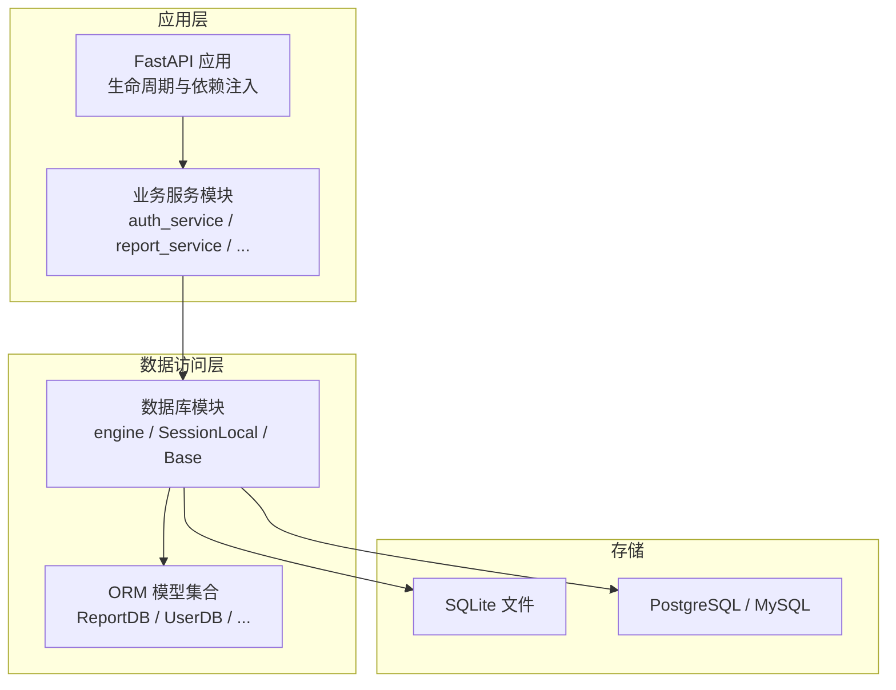
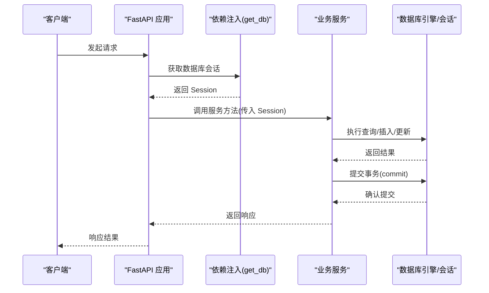
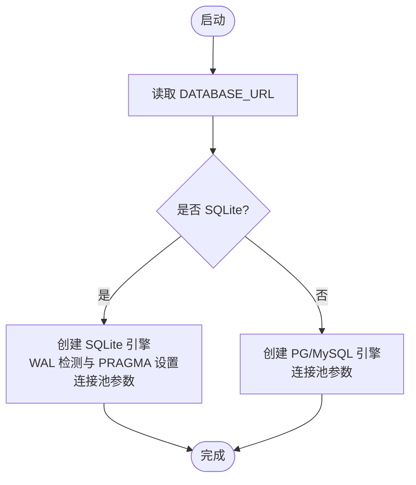
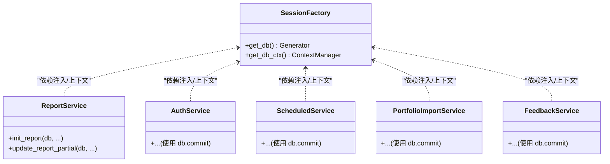
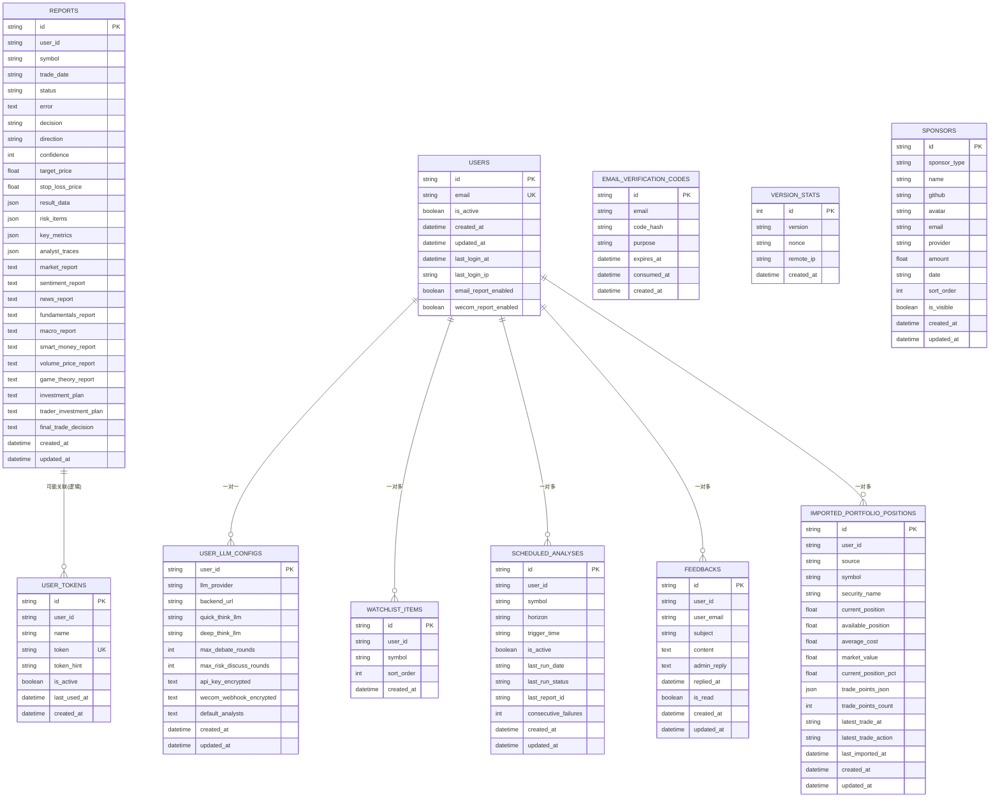
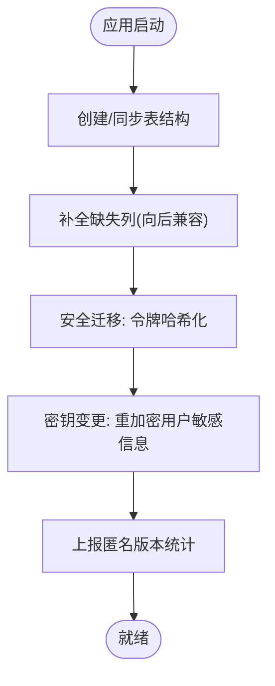
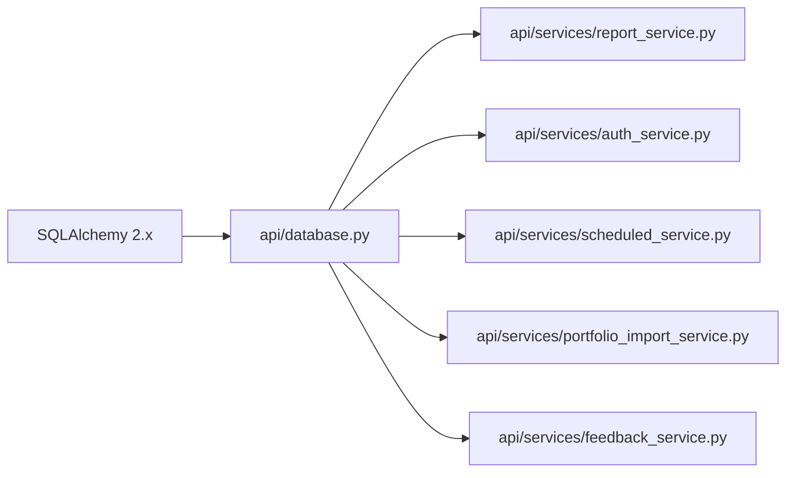

# 数据库集成

<cite>
**本文引用的文件**
- [api/database.py](file://api/database.py)
- [api/main.py](file://api/main.py)
- [api/logging_config.yaml](file://api/logging_config.yaml)
- [api/services/report_service.py](file://api/services/report_service.py)
- [api/services/auth_service.py](file://api/services/auth_service.py)
- [api/services/scheduled_service.py](file://api/services/scheduled_service.py)
- [api/services/portfolio_import_service.py](file://api/services/portfolio_import_service.py)
- [api/services/feedback_service.py](file://api/services/feedback_service.py)
- [uv.lock](file://uv.lock)
</cite>

## 目录
1. [简介](#简介)
2. [项目结构](#项目结构)
3. [核心组件](#核心组件)
4. [架构总览](#架构总览)
5. [详细组件分析](#详细组件分析)
6. [依赖分析](#依赖分析)
7. [性能考量](#性能考量)
8. [故障排查指南](#故障排查指南)
9. [结论](#结论)
10. [附录](#附录)

## 简介
本文件面向 TradingAgents-AShare 的数据库集成，系统化阐述数据库连接池配置、ORM 映射与事务管理、数据模型设计与关系约束、查询优化与索引策略、数据迁移与版本管理、备份与恢复、数据库监控与连接管理、以及扩展与最佳实践建议。内容以仓库现有实现为依据，结合代码路径进行说明，帮助开发者在不直接阅读源码的情况下理解整体设计。

## 项目结构
数据库相关能力主要集中在后端 API 层：
- 连接与会话管理：位于数据库模块，负责引擎创建、连接池参数、SQLite WAL 模式、会话工厂与上下文管理器。
- ORM 模型：定义了报告、用户、令牌、计划任务、自选股、赞助商、反馈、导入组合等实体及字段。
- 业务服务：各服务模块通过 SQLAlchemy 会话执行 CRUD 与事务提交。
- 应用入口：FastAPI 启动时初始化数据库表，并在请求处理中注入会话。
- 日志配置：统一输出格式，便于定位数据库相关问题。

图表来源
- [api/database.py:11-56](file://api/database.py#L11-L56)
- [api/main.py:216-279](file://api/main.py#L216-L279)

章节来源
- [api/database.py:11-56](file://api/database.py#L11-L56)
- [api/main.py:216-279](file://api/main.py#L216-L279)

## 核心组件
- 引擎与连接池
  - 支持 SQLite 与 PostgreSQL/MySQL 两种模式，按数据库类型设置不同的连接池参数。
  - SQLite：默认启用 WAL 模式（若父目录可写），连接池大小、溢出、超时、回收时间均针对单机场景优化。
  - PostgreSQL/MySQL：使用更大连接池以提升并发能力。
- 会话工厂与上下文管理
  - 提供基于依赖注入的会话生成器，以及手动使用的上下文管理器，自动回滚与关闭。
- 初始化与模式演进
  - 启动时创建所有表，并对既有部署进行轻量级列补全与安全迁移（如令牌哈希、密钥重加密）。
- ORM 模型
  - 定义了报告、用户、令牌、计划任务、自选股、赞助商、反馈、导入组合等模型，包含主键、索引、唯一约束与 JSON 字段。

章节来源
- [api/database.py:11-56](file://api/database.py#L11-L56)
- [api/database.py:60-95](file://api/database.py#L60-L95)
- [api/database.py:91-143](file://api/database.py#L91-L143)

## 架构总览
数据库集成采用“引擎-会话-模型”的分层设计：
- 引擎层：根据环境变量选择数据库类型并配置连接池。
- 会话层：提供依赖注入与手动上下文两种方式获取会话。
- 模型层：声明式 ORM 映射，支持 JSON 字段与复合唯一约束。
- 业务层：在服务函数中使用会话执行增删改查与事务提交。

图表来源
- [api/main.py:34-44](file://api/main.py#L34-L44)
- [api/database.py:60-66](file://api/database.py#L60-L66)
- [api/services/report_service.py:260-305](file://api/services/report_service.py#L260-L305)

## 详细组件分析

### 连接池与引擎配置
- 数据库类型判定与连接池参数
  - SQLite：pool_size=10，max_overflow=20，pool_timeout=60，pool_recycle=3600。
  - PostgreSQL/MySQL：pool_size=20，max_overflow=10，pool_timeout=30，pool_recycle=3600。
- SQLite 特性
  - 自动检测父目录可写性以启用 WAL 模式，提升并发读写能力。
  - 关闭线程安全限制，适配多线程/异步工作负载。
- 日志与可观测性
  - 使用标准日志模块记录数据库相关错误与迁移信息，便于排障。

图表来源
- [api/database.py:11-50](file://api/database.py#L11-L50)

章节来源
- [api/database.py:11-50](file://api/database.py#L11-L50)

### 会话管理与事务
- 依赖注入会话
  - 通过生成器提供会话，确保异常时自动关闭。
- 上下文管理器
  - 手动使用时，异常发生自动回滚，避免资源泄漏。
- 事务提交点
  - 业务服务在关键写入后显式提交，保证一致性。

图表来源
- [api/database.py:60-95](file://api/database.py#L60-L95)
- [api/services/report_service.py:260-305](file://api/services/report_service.py#L260-L305)
- [api/services/auth_service.py:141](file://api/services/auth_service.py#L141)
- [api/services/scheduled_service.py:142](file://api/services/scheduled_service.py#L142)
- [api/services/portfolio_import_service.py:114](file://api/services/portfolio_import_service.py#L114)
- [api/services/feedback_service.py:26](file://api/services/feedback_service.py#L26)

章节来源
- [api/database.py:60-95](file://api/database.py#L60-L95)
- [api/services/report_service.py:260-305](file://api/services/report_service.py#L260-L305)
- [api/services/auth_service.py:141](file://api/services/auth_service.py#L141)
- [api/services/scheduled_service.py:142](file://api/services/scheduled_service.py#L142)
- [api/services/portfolio_import_service.py:114](file://api/services/portfolio_import_service.py#L114)
- [api/services/feedback_service.py:26](file://api/services/feedback_service.py#L26)

### 数据模型设计与关系映射
- 主要模型概览
  - 报告：包含任务状态、错误、决策、方向、置信度、目标价/止损价、JSON 结果与分报告字段。
  - 用户：邮箱唯一、登录信息与通知开关。
  - 验证码：邮箱验证码表。
  - 用户 LLM 配置：加密存储 API Key 与企业微信 Webhook。
  - 用户令牌：令牌哈希与提示位，支持安全存储。
  - 版本统计：匿名版本统计。
  - 自选股：用户-股票唯一约束。
  - 计划任务：每日分析任务，带唯一约束与运行状态。
  - 赞助商：赞助记录。
  - 反馈：用户反馈与回复。
  - 导入组合：导入的持仓快照与交易点。
- 约束与索引
  - 多处使用唯一约束保证数据完整性。
  - 大量字段建立索引以支持查询过滤（如 symbol、user_id、status 等）。
- JSON 字段
  - 报告与用户配置中广泛使用 JSON 字段，便于灵活扩展结构化数据。

图表来源
- [api/database.py:242-481](file://api/database.py#L242-L481)

章节来源
- [api/database.py:242-481](file://api/database.py#L242-L481)

### 查询优化、索引策略与性能调优
- 索引策略
  - 在高频过滤字段上建立索引（如 reports.symbol、reports.user_id、reports.status、users.email、watchlist_items.user_id、scheduled_analyses.user_id 等）。
- 查询模式
  - 业务服务中常见按主键/唯一键查询与条件过滤，配合索引可显著降低扫描成本。
- 性能调优建议
  - 对于高并发场景优先使用 PostgreSQL/MySQL 并增大连接池。
  - SQLite 场景启用 WAL 并合理设置池参数。
  - 将大 JSON 字段拆分为独立表或使用外部存储，减少主表膨胀。
  - 对频繁聚合查询建立复合索引或物化视图（需结合实际查询模式评估）。

章节来源
- [api/database.py:242-481](file://api/database.py#L242-L481)

### 数据迁移、版本管理与安全
- 启动时初始化
  - 创建所有表并进行轻量级列补全，确保旧版本部署平滑升级。
- 安全迁移
  - 令牌从明文迁移到 HMAC-SHA256 哈希存储，并保留提示位。
  - 当应用密钥变更时，对用户敏感信息进行重加密并回写。
- 版本统计
  - 匿名上报版本与随机 nonce，便于生态统计。

图表来源
- [api/database.py:91-143](file://api/database.py#L91-L143)
- [api/database.py:146-239](file://api/database.py#L146-L239)

章节来源
- [api/database.py:91-143](file://api/database.py#L91-L143)
- [api/database.py:146-239](file://api/database.py#L146-L239)

### 数据库监控、连接管理与错误处理
- 监控与日志
  - 使用标准日志模块记录数据库错误与迁移失败信息，便于快速定位。
  - 日志配置文件提供统一格式，便于集中采集与分析。
- 连接管理
  - 通过上下文管理器与依赖注入确保会话正确关闭，避免连接泄露。
- 错误处理
  - 业务异常时自动回滚，保证数据一致性；持久化失败记录也通过短生命周期会话尝试写入，避免阻塞主流程。

章节来源
- [api/database.py:69-95](file://api/database.py#L69-L95)
- [api/main.py:2295-2311](file://api/main.py#L2295-L2311)
- [api/logging_config.yaml:1-35](file://api/logging_config.yaml#L1-L35)

### 备份与恢复
- SQLite
  - 直接复制数据库文件即可完成备份；生产环境建议定期归档并在变更窗口内执行。
- PostgreSQL/MySQL
  - 使用官方工具进行逻辑/物理备份；恢复时注意版本兼容与索引重建。
- 建议
  - 制定备份策略与演练计划，验证恢复流程；对 JSON 字段与大对象做好版本化管理。

（本节为通用实践建议，不直接分析具体文件）

## 依赖分析
- ORM 依赖
  - 项目使用 SQLAlchemy 作为 ORM/SQL 构造库，版本在锁定文件中明确。
- 业务服务对数据库的依赖
  - 多个服务模块在关键路径上显式调用 commit，体现对事务的一致性要求。

图表来源
- [uv.lock:2531-2542](file://uv.lock#L2531-L2542)
- [api/database.py:42](file://api/database.py#L42)
- [api/services/report_service.py:260-305](file://api/services/report_service.py#L260-L305)
- [api/services/auth_service.py:141](file://api/services/auth_service.py#L141)
- [api/services/scheduled_service.py:142](file://api/services/scheduled_service.py#L142)
- [api/services/portfolio_import_service.py:114](file://api/services/portfolio_import_service.py#L114)
- [api/services/feedback_service.py:26](file://api/services/feedback_service.py#L26)

章节来源
- [uv.lock:2531-2542](file://uv.lock#L2531-L2542)
- [api/database.py:42](file://api/database.py#L42)
- [api/services/report_service.py:260-305](file://api/services/report_service.py#L260-L305)
- [api/services/auth_service.py:141](file://api/services/auth_service.py#L141)
- [api/services/scheduled_service.py:142](file://api/services/scheduled_service.py#L142)
- [api/services/portfolio_import_service.py:114](file://api/services/portfolio_import_service.py#L114)
- [api/services/feedback_service.py:26](file://api/services/feedback_service.py#L26)

## 性能考量
- 连接池参数
  - SQLite：较小池适合单机与文件锁场景；若并发较高可考虑切换到 PG/MySQL。
  - PG/MySQL：较大池提升并发吞吐，但需结合数据库实例规格与网络稳定性调整。
- WAL 与锁竞争
  - SQLite 启用 WAL 可显著降低写入阻塞；仍需关注磁盘 IO 与文件权限。
- 查询与索引
  - 为高频过滤字段建立索引；避免 SELECT *，仅取必要列。
- JSON 字段
  - 大 JSON 字段增加序列化开销，建议拆分或压缩存储。
- 事务批量
  - 将多个写入合并为单次事务提交，减少往返与锁持有时间。

（本节提供通用指导，不直接分析具体文件）

## 故障排查指南
- 启动阶段
  - 若数据库初始化失败，检查 DATABASE_URL 与权限；查看日志中的错误堆栈。
- 运行阶段
  - 会话泄漏：确认使用依赖注入或上下文管理器；避免跨协程/线程传递会话。
  - 事务未提交：核对业务服务中 commit 调用点；确保异常路径不会遗漏提交。
  - 安全迁移失败：关注令牌哈希与密钥重加密的日志输出，确认密钥配置正确。
- 日志定位
  - 使用日志配置文件统一输出格式，结合时间戳与错误码快速定位问题。

章节来源
- [api/database.py:91-143](file://api/database.py#L91-L143)
- [api/main.py:2295-2311](file://api/main.py#L2295-L2311)
- [api/logging_config.yaml:1-35](file://api/logging_config.yaml#L1-L35)

## 结论
该数据库集成方案以 SQLAlchemy 为核心，结合依赖注入与上下文管理器实现了清晰的会话生命周期控制；通过启动时的模式演进与安全迁移保障了部署的连续性；模型设计兼顾灵活性与约束性，满足多类业务需求。建议在高并发场景优先采用 PG/MySQL，并持续优化索引与事务批量化，同时完善备份与监控体系。

## 附录
- 最佳实践清单
  - 明确区分长事务与短事务，尽量缩短持有锁的时间。
  - 对热点查询建立复合索引，避免全表扫描。
  - 使用连接池参数与数据库规格匹配，避免过度连接导致资源争用。
  - 对 JSON 字段进行版本化管理，避免结构漂移。
  - 定期备份并演练恢复流程，确保数据安全。
  - 统一日志格式与级别，便于问题追踪与容量规划。

（本节为通用建议，不直接分析具体文件）