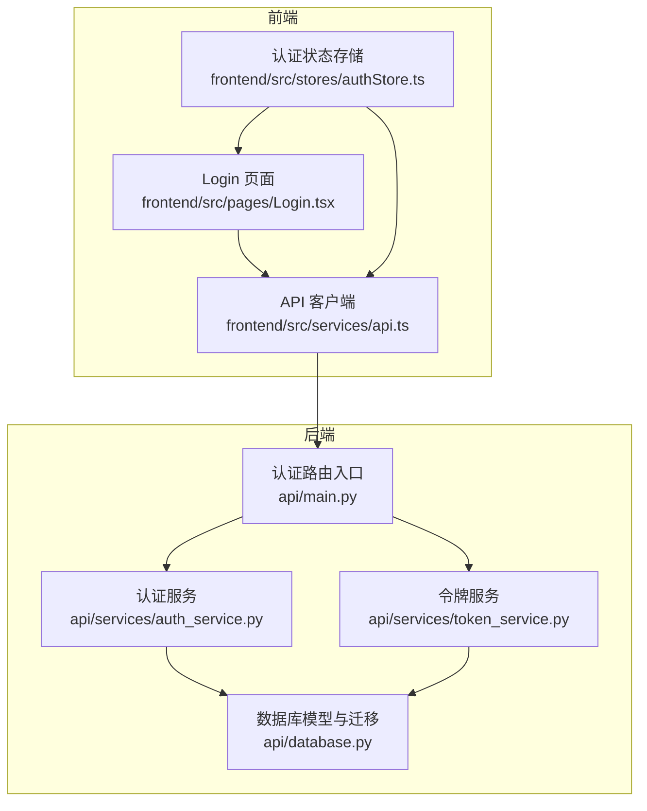
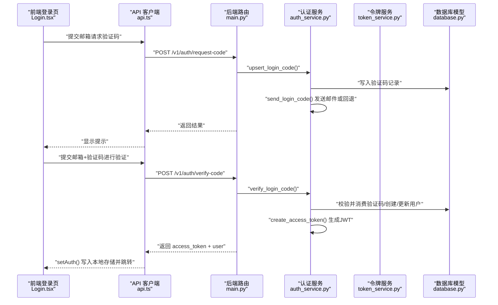
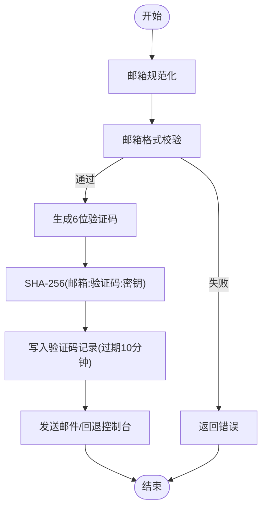
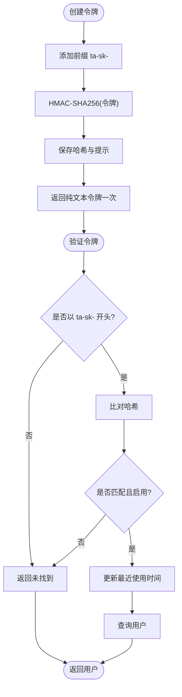
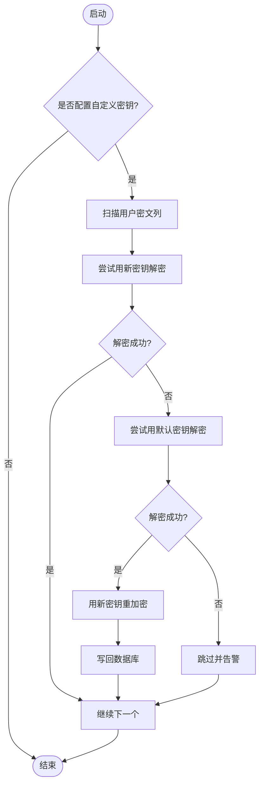
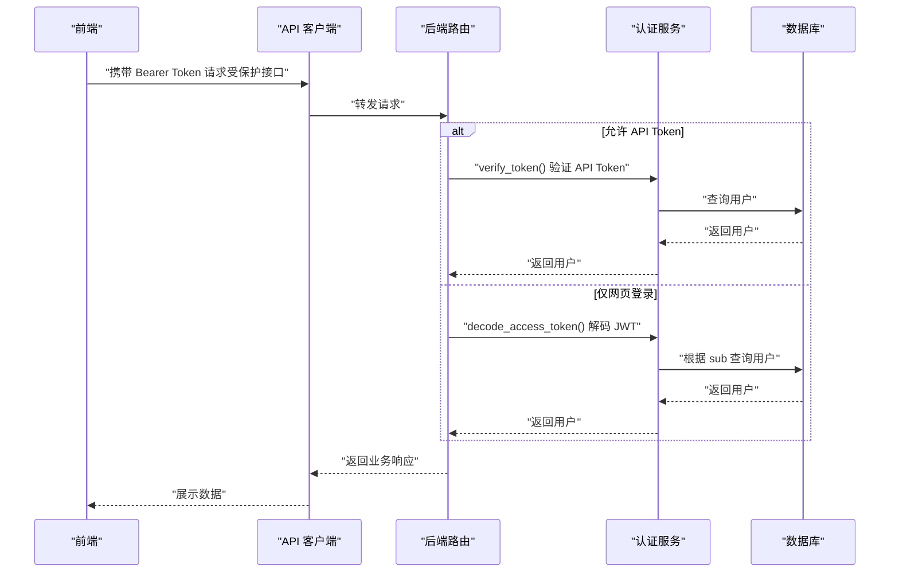
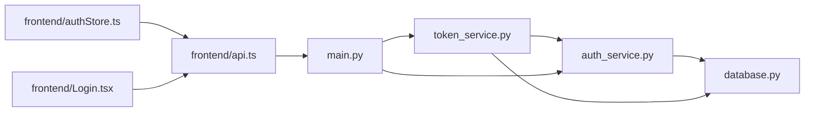
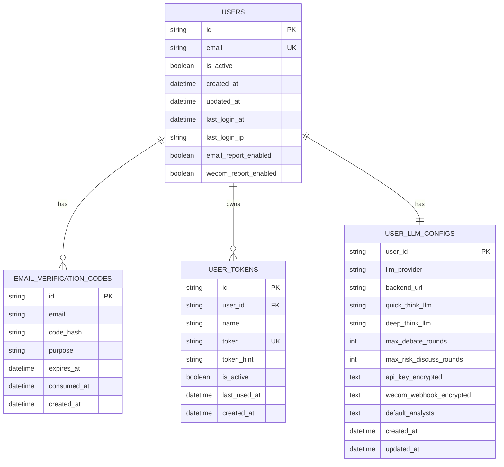

# 认证服务

<cite>
**本文引用的文件**
- [api/services/auth_service.py](file://api/services/auth_service.py)
- [api/services/token_service.py](file://api/services/token_service.py)
- [api/database.py](file://api/database.py)
- [api/main.py](file://api/main.py)
- [frontend/src/pages/Login.tsx](file://frontend/src/pages/Login.tsx)
- [frontend/src/stores/authStore.ts](file://frontend/src/stores/authStore.ts)
- [frontend/src/services/api.ts](file://frontend/src/services/api.ts)
</cite>

## 目录
1. [简介](#简介)
2. [项目结构](#项目结构)
3. [核心组件](#核心组件)
4. [架构总览](#架构总览)
5. [详细组件分析](#详细组件分析)
6. [依赖分析](#依赖分析)
7. [性能考虑](#性能考虑)
8. [故障排查指南](#故障排查指南)
9. [结论](#结论)
10. [附录](#附录)

## 简介
本文件面向 TradingAgents-AShare 的认证服务，系统性说明用户认证流程、JWT 令牌管理、会话控制、密码加密与盐值处理、安全验证、OAuth 集成现状、权限管理、令牌刷新与撤销、安全策略、用户注册与邮箱验证、账户激活、以及安全最佳实践与常见攻击防护。文档同时提供前端登录页、状态存储与 API 客户端的交互路径，帮助读者快速理解端到端认证链路。

## 项目结构
认证相关代码主要分布在后端服务层与数据库模型层，前端通过页面组件与状态存储完成登录交互，并通过 API 客户端调用后端认证接口。

图表来源
- [frontend/src/pages/Login.tsx:40-81](file://frontend/src/pages/Login.tsx#L40-L81)
- [frontend/src/stores/authStore.ts:16-55](file://frontend/src/stores/authStore.ts#L16-L55)
- [frontend/src/services/api.ts:390-406](file://frontend/src/services/api.ts#L390-L406)
- [api/main.py:3862-3888](file://api/main.py#L3862-L3888)
- [api/services/auth_service.py:114-184](file://api/services/auth_service.py#L114-L184)
- [api/services/token_service.py:34-105](file://api/services/token_service.py#L34-L105)
- [api/database.py:321-375](file://api/database.py#L321-L375)

章节来源
- [frontend/src/pages/Login.tsx:40-81](file://frontend/src/pages/Login.tsx#L40-L81)
- [frontend/src/stores/authStore.ts:16-55](file://frontend/src/stores/authStore.ts#L16-L55)
- [frontend/src/services/api.ts:390-406](file://frontend/src/services/api.ts#L390-L406)
- [api/main.py:3862-3888](file://api/main.py#L3862-L3888)
- [api/services/auth_service.py:114-184](file://api/services/auth_service.py#L114-L184)
- [api/services/token_service.py:34-105](file://api/services/token_service.py#L34-L105)
- [api/database.py:321-375](file://api/database.py#L321-L375)

## 核心组件
- 认证服务（邮箱验证码登录）
  - 邮箱规范化、验证码生成与哈希、登录码持久化与消费、用户创建与登录记录、邮件发送（SMTP/回退控制台）、JWT 令牌签发与解码、用户与 LLM 配置管理。
- 令牌服务（API Token）
  - 前缀校验、HMAC-SHA256 哈希存储、令牌生成与提示、列表查询、删除（撤销）、验证并更新最近使用时间。
- 数据库模型与迁移
  - 用户表、验证码表、用户 LLM 配置表、用户 API Token 表；支持 SQLite/PostgreSQL/MySQL；包含安全迁移（令牌哈希化、密钥重加密）。
- 前端登录页与状态存储
  - 登录页两步流程（请求验证码/验证验证码），本地存储访问令牌与用户信息，发起受保护接口调用。

章节来源
- [api/services/auth_service.py:87-184](file://api/services/auth_service.py#L87-L184)
- [api/services/token_service.py:18-105](file://api/services/token_service.py#L18-L105)
- [api/database.py:321-375](file://api/database.py#L321-L375)
- [frontend/src/pages/Login.tsx:52-81](file://frontend/src/pages/Login.tsx#L52-L81)
- [frontend/src/stores/authStore.ts:22-34](file://frontend/src/stores/authStore.ts#L22-L34)

## 架构总览
认证采用“邮箱+验证码”的无密码登录模式，结合 JWT 实现网页端会话，同时提供 HMAC 哈希存储的 API Token 供程序化访问。后端路由负责接收前端请求，调用认证与令牌服务，数据库模型承载用户、验证码与令牌数据。

图表来源
- [frontend/src/pages/Login.tsx:52-81](file://frontend/src/pages/Login.tsx#L52-L81)
- [frontend/src/services/api.ts:390-406](file://frontend/src/services/api.ts#L390-L406)
- [api/main.py:3862-3883](file://api/main.py#L3862-L3883)
- [api/services/auth_service.py:122-184](file://api/services/auth_service.py#L122-L184)

## 详细组件分析

### 组件A：邮箱验证码登录与 JWT 会话
- 邮箱规范化与格式校验
  - 邮箱统一小写与去空白，后端路由对邮箱格式进行正则校验。
- 验证码生成与哈希
  - 6 位随机数验证码；哈希算法使用 SHA-256，输入为“标准化邮箱:验证码:密钥”，密钥来自环境变量或默认密钥。
- 验证码持久化与消费
  - 同一邮箱同目的（默认 login）的未消费验证码在新验证码生成时被标记为已消费；记录过期时间（默认 10 分钟）。
- 用户创建与登录记录
  - 首次登录创建用户记录，记录最近登录时间与客户端 IP；后续登录更新相应字段。
- 邮件发送与回退
  - 支持 SMTP 主机、端口、用户名、密码、发件人、STARTTLS/SSL 选项；若未配置 SMTP，则在非生产环境打印验证码到控制台。
- JWT 令牌签发与解码
  - HS256 签名算法；payload 包含 sub、email、iat、exp（默认 30 天）；解码时使用相同密钥。
- 前端会话控制
  - 登录成功后将 access_token 与 user 写入本地存储，后续请求自动携带 Bearer Token。

图表来源
- [api/services/auth_service.py:87-96](file://api/services/auth_service.py#L87-L96)
- [api/services/auth_service.py:122-143](file://api/services/auth_service.py#L122-L143)
- [api/services/auth_service.py:195-236](file://api/services/auth_service.py#L195-L236)
- [api/main.py:3862-3874](file://api/main.py#L3862-L3874)

章节来源
- [api/services/auth_service.py:87-184](file://api/services/auth_service.py#L87-L184)
- [api/main.py:3862-3883](file://api/main.py#L3862-L3883)
- [frontend/src/pages/Login.tsx:52-81](file://frontend/src/pages/Login.tsx#L52-L81)
- [frontend/src/stores/authStore.ts:22-34](file://frontend/src/stores/authStore.ts#L22-L34)

### 组件B：API Token 管理（HMAC 存储与撤销）
- 令牌生成与存储
  - 前缀 ta-sk-；纯文本仅在创建时返回一次；数据库存储为 HMAC-SHA256 哈希与最后四位提示；限制每个用户最多创建 10 个。
- 令牌验证
  - 校验前缀与哈希匹配；仅启用的令牌可被验证；验证成功后更新最近使用时间。
- 令牌撤销
  - 删除对应记录即完成撤销；支持按用户列出与按 ID 删除。

图表来源
- [api/services/token_service.py:28-63](file://api/services/token_service.py#L28-L63)
- [api/services/token_service.py:86-105](file://api/services/token_service.py#L86-L105)
- [api/database.py:364-375](file://api/database.py#L364-L375)

章节来源
- [api/services/token_service.py:18-105](file://api/services/token_service.py#L18-L105)
- [api/database.py:364-375](file://api/database.py#L364-L375)

### 组件C：安全迁移与密钥管理
- 令牌哈希化迁移
  - 将旧的明文令牌转换为 HMAC-SHA256 哈希存储，并补充 token_hint 字段；日志记录迁移数量。
- 密钥变更后的密文重加密
  - 当配置自定义密钥时，尝试用新密钥解密用户密文；若失败但可用旧默认密钥解密，则用新密钥重加密并写回；日志记录重加密数量。
- 对称加密与解密
  - 使用 Fernet（基于密钥派生的对称加密）对用户敏感配置（如 LLM API Key、企业微信 Webhook）进行加解密；提供降级解密能力。

图表来源
- [api/database.py:146-171](file://api/database.py#L146-L171)
- [api/database.py:174-239](file://api/database.py#L174-L239)
- [api/services/auth_service.py:56-84](file://api/services/auth_service.py#L56-L84)

章节来源
- [api/database.py:146-239](file://api/database.py#L146-L239)
- [api/services/auth_service.py:56-84](file://api/services/auth_service.py#L56-L84)

### 组件D：权限与会话控制
- 接口权限
  - 提供两种依赖：RequireUser(allow_api_token=True) 允许 API Token 或网页登录；RequireUser(allow_api_token=False) 仅网页登录。
- 会话保持
  - 前端通过本地存储保存 access_token 与 user；每次请求自动附加 Authorization: Bearer Token。
- 用户信息获取
  - GET /v1/auth/me 返回当前用户信息，依赖网页端登录用户。

图表来源
- [api/main.py:1059-1073](file://api/main.py#L1059-L1073)
- [api/main.py:3886-3888](file://api/main.py#L3886-L3888)
- [api/services/auth_service.py:110-111](file://api/services/auth_service.py#L110-L111)
- [api/services/token_service.py:86-105](file://api/services/token_service.py#L86-L105)
- [frontend/src/stores/authStore.ts:22-34](file://frontend/src/stores/authStore.ts#L22-L34)

章节来源
- [api/main.py:1059-1073](file://api/main.py#L1059-L1073)
- [api/main.py:3886-3888](file://api/main.py#L3886-L3888)
- [api/services/auth_service.py:110-111](file://api/services/auth_service.py#L110-L111)
- [api/services/token_service.py:86-105](file://api/services/token_service.py#L86-L105)
- [frontend/src/stores/authStore.ts:22-34](file://frontend/src/stores/authStore.ts#L22-L34)

### 组件E：OAuth 集成与第三方登录
- 现状
  - 仓库中未发现 OAuth 集成实现或第三方登录入口。
- 建议
  - 若需引入 OAuth，建议新增独立路由与回调处理，使用 state/nonce 防重放，回调后生成 JWT 或 API Token 并写入会话。

[本节为概念性说明，不直接分析具体文件，故无章节来源]

### 组件F：用户注册、邮箱验证与账户激活
- 注册与激活
  - 系统采用“邮箱+验证码”登录模式，无需显式注册；首次登录即创建用户记录并激活。
- 邮箱验证
  - 通过发送验证码邮件完成验证；验证码 10 分钟内有效；同一邮箱同目的的未消费验证码会被覆盖。
- 前端流程
  - 登录页两步走：请求验证码（显示提示/开发环境回退验证码），输入验证码后换取 access_token 并跳转。

章节来源
- [api/services/auth_service.py:122-184](file://api/services/auth_service.py#L122-L184)
- [api/main.py:3862-3883](file://api/main.py#L3862-L3883)
- [frontend/src/pages/Login.tsx:52-81](file://frontend/src/pages/Login.tsx#L52-L81)

### 组件G：令牌刷新、撤销与安全策略
- 刷新策略
  - 当前未实现 refresh token；JWT 默认有效期 30 天，到期后需重新登录获取新 JWT。
- 撤销机制
  - API Token 支持删除（撤销）；JWT 无法在服务端撤销，可通过缩短有效期或引入黑名单策略（需扩展实现）。
- 安全策略
  - 密钥管理：支持自定义 TA_APP_SECRET_KEY；默认密钥用于兼容迁移；Fernet 对称加密保护用户敏感配置。
  - 令牌安全：API Token 明文仅在创建时返回一次，数据库存储哈希；验证码哈希存储并限时。
  - 传输安全：建议在生产环境启用 HTTPS；SMTP 可配置 STARTTLS/SSL。

章节来源
- [api/services/auth_service.py:39-40](file://api/services/auth_service.py#L39-L40)
- [api/services/auth_service.py:56-84](file://api/services/auth_service.py#L56-L84)
- [api/services/token_service.py:18-63](file://api/services/token_service.py#L18-L63)
- [api/database.py:146-171](file://api/database.py#L146-L171)

## 依赖分析
- 组件耦合
  - 认证服务依赖数据库模型与环境变量；令牌服务依赖认证服务提供的密钥函数；后端路由依赖认证与令牌服务；前端依赖 API 客户端与状态存储。
- 外部依赖
  - Python 标准库（datetime、hashlib、os、secrets、smtplib、jwt、cryptography.Fernet）；SQLAlchemy ORM；FastAPI 路由与依赖注入。
- 循环依赖
  - 未发现循环导入；模块间单向依赖清晰。

图表来源
- [api/services/auth_service.py:18-18](file://api/services/auth_service.py#L18-L18)
- [api/services/token_service.py:18-20](file://api/services/token_service.py#L18-L20)
- [api/main.py:3862-3888](file://api/main.py#L3862-L3888)
- [frontend/src/services/api.ts:390-406](file://frontend/src/services/api.ts#L390-L406)
- [frontend/src/stores/authStore.ts:16-55](file://frontend/src/stores/authStore.ts#L16-L55)
- [frontend/src/pages/Login.tsx:40-81](file://frontend/src/pages/Login.tsx#L40-L81)

章节来源
- [api/services/auth_service.py:18-18](file://api/services/auth_service.py#L18-L18)
- [api/services/token_service.py:18-20](file://api/services/token_service.py#L18-L20)
- [api/main.py:3862-3888](file://api/main.py#L3862-L3888)
- [frontend/src/services/api.ts:390-406](file://frontend/src/services/api.ts#L390-L406)
- [frontend/src/stores/authStore.ts:16-55](file://frontend/src/stores/authStore.ts#L16-L55)
- [frontend/src/pages/Login.tsx:40-81](file://frontend/src/pages/Login.tsx#L40-L81)

## 性能考虑
- 数据库连接池
  - SQLite 在开发环境使用 WAL 模式与连接池参数优化；其他数据库类型设置更大连接池以提升并发。
- 验证码与令牌操作
  - 验证码与令牌均采用哈希存储，避免明文泄露；令牌哈希计算成本低，验证快速。
- 邮件发送
  - 邮件发送在 DB 会话释放后执行，避免阻塞数据库连接池。

[本节为通用性能讨论，不直接分析具体文件，故无章节来源]

## 故障排查指南
- 验证码未收到或过期
  - 检查 SMTP 配置（主机、端口、用户名、密码、STARTTLS/SSL）；确认邮箱格式正确；验证码有效期为 10 分钟。
- 登录失败
  - 确认验证码正确且未过期；检查后端日志中的异常信息；确认用户存在且 is_active。
- API Token 无效
  - 确认令牌以 ta-sk- 开头；检查是否已被撤销；确认哈希匹配且令牌启用。
- 密钥变更导致解密失败
  - 查看数据库迁移日志；确认是否已完成密文重加密；必要时回滚至旧密钥或重新保存用户敏感配置。
- 前端无法访问受保护接口
  - 检查本地存储是否存在 access_token；确认请求头 Authorization 是否正确；确认后端路由依赖是否允许 API Token。

章节来源
- [api/services/auth_service.py:195-236](file://api/services/auth_service.py#L195-L236)
- [api/main.py:3862-3883](file://api/main.py#L3862-L3883)
- [api/services/token_service.py:86-105](file://api/services/token_service.py#L86-L105)
- [api/database.py:146-171](file://api/database.py#L146-L171)
- [frontend/src/stores/authStore.ts:22-34](file://frontend/src/stores/authStore.ts#L22-L34)

## 结论
本认证体系以“邮箱+验证码”为核心，结合 JWT 实现网页端会话，以 HMAC 哈希存储 API Token 实现安全可控的程序化访问。系统内置密钥迁移与重加密机制，保障在密钥变更场景下的数据安全。当前未实现 OAuth 与 refresh token，建议在后续版本中引入以增强用户体验与安全性。

[本节为总结性内容，不直接分析具体文件，故无章节来源]

## 附录

### 数据模型图（认证相关）

图表来源
- [api/database.py:321-375](file://api/database.py#L321-L375)