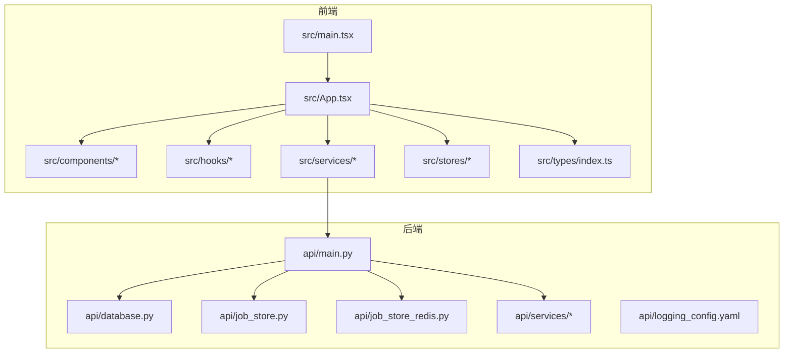
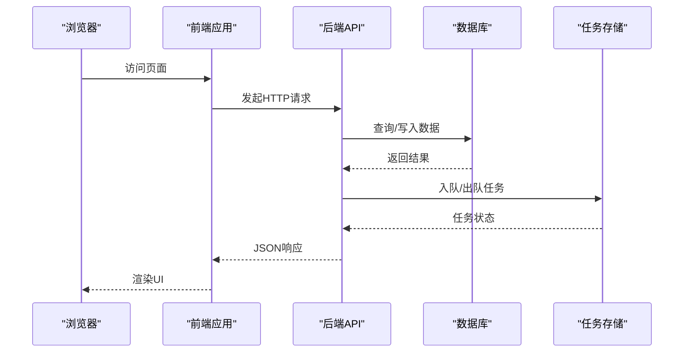
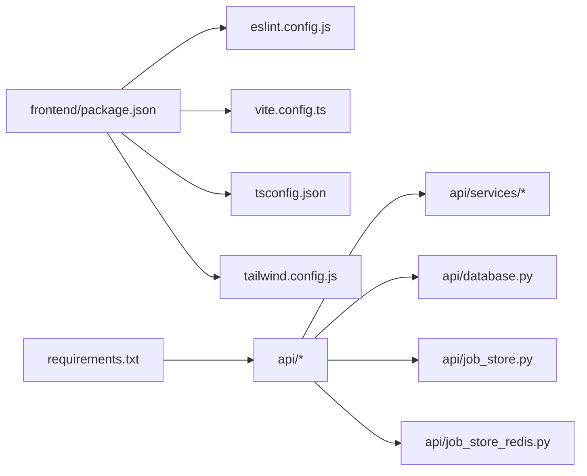

# 代码规范

<cite>
**本文引用的文件**
- [.gitignore](file://.gitignore)
- [pyproject.toml](file://pyproject.toml)
- [requirements.txt](file://requirements.txt)
- [frontend/package.json](file://frontend/package.json)
- [frontend/eslint.config.js](file://frontend/eslint.config.js)
- [frontend/tsconfig.json](file://frontend/tsconfig.json)
- [frontend/tailwind.config.js](file://frontend/tailwind.config.js)
- [frontend/vite.config.ts](file://frontend/vite.config.ts)
- [frontend/src/main.tsx](file://frontend/src/main.tsx)
- [frontend/src/App.tsx](file://frontend/src/App.tsx)
- [frontend/src/hooks/useSSE.ts](file://frontend/src/hooks/useSSE.ts)
- [frontend/src/hooks/useAnalysisJobRecovery.ts](file://frontend/src/hooks/useAnalysisJobRecovery.ts)
- [frontend/src/hooks/useTypeWriter.ts](file://frontend/src/hooks/useTypeWriter.ts)
- [frontend/src/components/Header.tsx](file://frontend/src/components/Header.tsx)
- [frontend/src/components/Layout.tsx](file://frontend/src/components/Layout.tsx)
- [frontend/src/services/api.ts](file://frontend/src/services/api.ts)
- [frontend/src/stores/analysisStore.ts](file://frontend/src/stores/analysisStore.ts)
- [frontend/src/stores/authStore.ts](file://frontend/src/stores/authStore.ts)
- [frontend/src/types/index.ts](file://frontend/src/types/index.ts)
- [api/main.py](file://api/main.py)
- [api/database.py](file://api/database.py)
- [api/job_store.py](file://api/job_store.py)
- [api/job_store_redis.py](file://api/job_store_redis.py)
- [api/services/auth_service.py](file://api/services/auth_service.py)
- [api/services/backtest_service.py](file://api/services/backtest_service.py)
- [api/services/report_service.py](file://api/services/report_service.py)
- [api/logging_config.yaml](file://api/logging_config.yaml)
- [tradingagents/graph/trading_graph.py](file://tradingagents/graph/trading_graph.py)
- [tradingagents/llm_clients/openai_client.py](file://tradingagents/llm_clients/openai_client.py)
- [tradingagents/llm_clients/google_client.py](file://tradingagents/llm_clients/google_client.py)
- [tradingagents/dataflows/providers/china_equity_provider.py](file://tradingagents/dataflows/providers/china_equity_provider.py)
- [tradingagents/dataflows/providers/cn_akshare_provider.py](file://tradingagents/dataflows/providers/cn_akshare_provider.py)
- [tradingagents/dataflows/providers/yfinance_provider.py](file://tradingagents/dataflows/providers/yfinance_provider.py)
- [tests/test_api_smoke.py](file://tests/test_api_smoke.py)
- [tests/test_board_gold_api.py](file://tests/test_board_gold_api.py)
- [tests/test_email_report_service.py](file://tests/test_email_report_service.py)
- [tests/test_job_store.py](file://tests/test_job_store.py)
- [tests/test_portfolio_import.py](file://tests/test_portfolio_import.py)
</cite>

## 目录
1. [引言](#引言)
2. [项目结构](#项目结构)
3. [核心组件](#核心组件)
4. [架构总览](#架构总览)
5. [详细组件分析](#详细组件分析)
6. [依赖分析](#依赖分析)
7. [性能考虑](#性能考虑)
8. [故障排查指南](#故障排查指南)
9. [结论](#结论)
10. [附录](#附录)

## 引言
本文件为 TradingAgents-AShare 提供统一的代码规范与最佳实践指南，覆盖后端 Python（FastAPI）与前端 TypeScript/React 的风格、命名、导入组织、类型系统、ESLint/Prettier 配置、注释与文档字符串标准、Git 规范、分支与代码审查流程、IDE 配置建议以及性能与安全实践。目标是提升团队协作效率、可维护性与一致性。

## 项目结构
该项目采用前后端分离架构：
- 后端：基于 FastAPI 的 API 服务，模块化组织业务服务与数据层。
- 前端：Vite + React + TypeScript，采用自定义 ESLint 配置与 Tailwind CSS 样式框架。
- 测试：后端与前端分别有测试用例，覆盖核心功能与集成场景。

**图表来源**
- [frontend/src/main.tsx](file://frontend/src/main.tsx)
- [frontend/src/App.tsx](file://frontend/src/App.tsx)
- [frontend/src/components/Header.tsx](file://frontend/src/components/Header.tsx)
- [frontend/src/hooks/useSSE.ts](file://frontend/src/hooks/useSSE.ts)
- [frontend/src/services/api.ts](file://frontend/src/services/api.ts)
- [frontend/src/stores/analysisStore.ts](file://frontend/src/stores/analysisStore.ts)
- [frontend/src/stores/authStore.ts](file://frontend/src/stores/authStore.ts)
- [frontend/src/types/index.ts](file://frontend/src/types/index.ts)
- [api/main.py](file://api/main.py)
- [api/database.py](file://api/database.py)
- [api/job_store.py](file://api/job_store.py)
- [api/job_store_redis.py](file://api/job_store_redis.py)
- [api/services/auth_service.py](file://api/services/auth_service.py)

**章节来源**
- [frontend/src/main.tsx](file://frontend/src/main.tsx)
- [frontend/src/App.tsx](file://frontend/src/App.tsx)
- [api/main.py](file://api/main.py)

## 核心组件
- 前端入口与应用根组件负责路由与全局状态注入；组件按功能拆分，遵循单一职责；Hooks 封装副作用与复用逻辑；服务层封装 API 调用；状态管理通过轻量 store 实现。
- 后端以 FastAPI 作为入口，模块化服务（认证、回测、报告等），数据库与任务队列（本地/Redis）解耦，日志配置集中管理。

**章节来源**
- [frontend/src/main.tsx](file://frontend/src/main.tsx)
- [frontend/src/App.tsx](file://frontend/src/App.tsx)
- [api/main.py](file://api/main.py)
- [api/database.py](file://api/database.py)
- [api/job_store.py](file://api/job_store.py)
- [api/job_store_redis.py](file://api/job_store_redis.py)

## 架构总览
下图展示从前端到后端的关键交互路径与职责边界。

**图表来源**
- [frontend/src/services/api.ts](file://frontend/src/services/api.ts)
- [api/main.py](file://api/main.py)
- [api/database.py](file://api/database.py)
- [api/job_store.py](file://api/job_store.py)
- [api/job_store_redis.py](file://api/job_store_redis.py)

## 详细组件分析

### Python 后端代码规范
- 语言与版本：使用 Python 3.x，推荐 3.10+。
- 包管理与依赖：
  - 使用 pip/requirements.txt 管理依赖，pyproject.toml 提供额外构建与发布元数据。
  - 建议在 CI 中使用锁定文件或虚拟环境隔离依赖安装。
- 项目布局：
  - API 入口位于 api/main.py，业务服务位于 api/services/，数据访问与任务队列分别在 api/database.py、api/job_store.py、api/job_store_redis.py。
  - 日志配置通过 api/logging_config.yaml 统一管理。
- 命名约定：
  - 模块与包：使用小写下划线 snake_case。
  - 类：使用 PascalCase；方法与属性：snake_case；常量：UPPER_CASE。
  - 私有成员：以下划线前缀 _name。
- 导入组织：
  - 标准库优先，第三方库次之，项目内相对导入最后。
  - 每组导入之间空一行，避免 wildcard imports。
- 注释与文档字符串：
  - 函数/类/模块：使用三重双引号 docstring，首行简述用途，后续段落详述参数、返回值、异常。
  - 行内注释简洁明确，避免显而易见的注释。
- 错误处理：
  - 显式捕获预期异常，记录上下文信息，必要时抛出自定义异常。
  - 避免裸 except，确保日志级别与错误码一致。
- 并发与异步：
  - 使用 asyncio 与异步 I/O；避免阻塞操作；合理使用线程池/进程池。
- 安全与配置：
  - 敏感信息通过环境变量或密钥管理服务注入；禁用调试模式于生产。
  - 输入校验与输出净化，防止注入与 XSS。
- 性能：
  - 缓存热点数据；批量查询；避免 N+1 查询；使用索引与合适的数据库连接池大小。
- 测试：
  - 单元测试与集成测试并重；覆盖关键路径与边界条件；持续集成中运行测试套件。

**章节来源**
- [requirements.txt](file://requirements.txt)
- [pyproject.toml](file://pyproject.toml)
- [api/main.py](file://api/main.py)
- [api/database.py](file://api/database.py)
- [api/job_store.py](file://api/job_store.py)
- [api/job_store_redis.py](file://api/job_store_redis.py)
- [api/logging_config.yaml](file://api/logging_config.yaml)

### TypeScript/React 前端代码规范
- 语言与版本：TypeScript 4.x+，React 18+。
- 工程配置：
  - Vite 作为构建工具，tsconfig.json 控制编译选项；Tailwind CSS 用于样式；ESLint 自定义配置。
- 命名约定：
  - 文件：组件使用 PascalCase.tsx；工具函数与 Hook 使用 camelCase.ts；类型定义使用 PascalCase.ts。
  - 变量与函数：camelCase；常量：UPPER_CASE；类型与接口：PascalCase。
  - 私有成员：以下划线前缀 _private。
- 导入组织：
  - 标准库与第三方库优先，再项目内绝对路径，最后相对路径。
  - 每组导入之间空一行，避免 wildcard imports。
- 组件设计：
  - 单一职责；Props 明确；无状态组件优先；必要时使用 memo 与 useMemo/useCallback。
  - 样式通过 Tailwind 类组合，避免内联样式。
- Hooks 使用规范：
  - 自定义 Hook 以 use 开头；返回值语义清晰；副作用在 useEffect 内处理；依赖数组正确。
  - SSE、分析恢复、打字机效果等场景通过独立 Hook 抽象。
- 类型系统：
  - 所有公共 API 与状态结构提供明确类型；避免 any；使用联合类型表达可选状态。
- 服务与状态：
  - API 调用集中在 services/api.ts；全局状态通过 stores/* 管理；避免跨组件直接共享可变状态。
- ESLint 与 Prettier：
  - 使用自定义 eslint.config.js；统一缩进、分号、引号、尾逗号等规则；与 Prettier 集成。
- 文档与注释：
  - 组件与 Hook 提供简要说明；复杂逻辑添加注释；README 或组件注释说明使用方式。
- 性能：
  - 懒加载与分割；避免不必要的重渲染；合理缓存计算结果；控制并发请求数量。
- 安全：
  - 防止 XSS：不直接拼接 HTML；对用户输入进行校验与转义；避免内联事件。
  - 防止泄露：不在前端存储敏感令牌；使用 HTTPS；限制 Cookie 属性。

**章节来源**
- [frontend/tsconfig.json](file://frontend/tsconfig.json)
- [frontend/tailwind.config.js](file://frontend/tailwind.config.js)
- [frontend/eslint.config.js](file://frontend/eslint.config.js)
- [frontend/vite.config.ts](file://frontend/vite.config.ts)
- [frontend/src/hooks/useSSE.ts](file://frontend/src/hooks/useSSE.ts)
- [frontend/src/hooks/useAnalysisJobRecovery.ts](file://frontend/src/hooks/useAnalysisJobRecovery.ts)
- [frontend/src/hooks/useTypeWriter.ts](file://frontend/src/hooks/useTypeWriter.ts)
- [frontend/src/components/Header.tsx](file://frontend/src/components/Header.tsx)
- [frontend/src/components/Layout.tsx](file://frontend/src/components/Layout.tsx)
- [frontend/src/services/api.ts](file://frontend/src/services/api.ts)
- [frontend/src/stores/analysisStore.ts](file://frontend/src/stores/analysisStore.ts)
- [frontend/src/stores/authStore.ts](file://frontend/src/stores/authStore.ts)
- [frontend/src/types/index.ts](file://frontend/src/types/index.ts)

### ESX/JS 前端代码规范
- ESLint 配置：通过 eslint.config.js 统一规则，建议启用与 TypeScript/React 相关的推荐规则集，并结合项目实际调整。
- Prettier：与 ESLint 协同，统一代码风格；建议在保存时自动格式化。
- 代码质量检查：在 CI 中执行 lint 与 type-check；必要时加入测试覆盖率与安全扫描。

**章节来源**
- [frontend/eslint.config.js](file://frontend/eslint.config.js)
- [frontend/package.json](file://frontend/package.json)

### Git 提交消息规范、分支命名与代码审查
- 提交消息规范（参考 Conventional Commits）：
  - 类型：feat、fix、docs、style、refactor、perf、test、build、ci、chore、revert
  - 结构：type(scope): subject；正文说明动机与影响；底部引用 Issue 编号
- 分支命名：
  - feat/xxx、fix/xxx、docs/xxx、chore/xxx；避免长分支名，使用连字符
- 代码审查：
  - 至少一名 reviewer；关注可读性、安全性、性能与测试覆盖；评论需明确且可追踪

**章节来源**
- [.gitignore](file://.gitignore)

### IDE 配置与快捷键建议
- VS Code（推荐）：
  - 插件：ESLint、Prettier、Tailwind CSS IntelliSense、EditorConfig、Python、Pyright
  - 设置：editor.formatOnSave、editor.codeActionsOnSave、typescript.preferences.importModuleSpecifier
  - 快捷键：格式化、快速修复、折叠/展开、跳转定义/实现
- WebStorm/IntelliJ IDEA：
  - 启用 ESLint、Prettier、TypeScript/Python 支持；配置代码风格与自动导入
- 剪贴板与代码片段：
  - 前端常用 Hook 片段（useEffect/useMemo/useCallback）、API 调用模板
  - 后端常用服务模板（认证、回测、报告）

**章节来源**
- [frontend/eslint.config.js](file://frontend/eslint.config.js)
- [frontend/tsconfig.json](file://frontend/tsconfig.json)

### 注释规范与文档字符串标准
- Python：
  - 使用三重双引号 docstring；首行简述用途；参数、返回值、异常、注意事项分段说明
- TypeScript/React：
  - 组件与 Hook 添加 JSDoc 风格注释；复杂逻辑补充说明；导出 API 提供使用示例

**章节来源**
- [api/services/auth_service.py](file://api/services/auth_service.py)
- [api/services/backtest_service.py](file://api/services/backtest_service.py)
- [api/services/report_service.py](file://api/services/report_service.py)
- [frontend/src/hooks/useSSE.ts](file://frontend/src/hooks/useSSE.ts)
- [frontend/src/hooks/useAnalysisJobRecovery.ts](file://frontend/src/hooks/useAnalysisJobRecovery.ts)
- [frontend/src/hooks/useTypeWriter.ts](file://frontend/src/hooks/useTypeWriter.ts)

### 性能优化编码规范
- 前端：
  - 组件懒加载；减少重渲染；缓存计算；限制并发；使用虚拟滚动处理长列表
- 后端：
  - 数据库索引与查询优化；连接池大小；缓存热点；异步 I/O；批处理

**章节来源**
- [frontend/src/stores/analysisStore.ts](file://frontend/src/stores/analysisStore.ts)
- [api/job_store.py](file://api/job_store.py)
- [api/job_store_redis.py](file://api/job_store_redis.py)

### 安全编码实践
- 输入验证与输出净化；最小权限原则；HTTPS 与安全头；敏感信息加密存储与传输；定期更新依赖；日志脱敏

**章节来源**
- [api/main.py](file://api/main.py)
- [api/database.py](file://api/database.py)

## 依赖分析
- 前端依赖管理：package.json 管理脚本与依赖；ESLint、Prettier、Vite、React、Tailwind 等。
- 后端依赖管理：requirements.txt 管理运行时依赖；pyproject.toml 提供构建与发布信息。
- 外部集成：LLM 客户端（OpenAI、Google）、数据提供商（Alpha Vantage、YFinance、AkShare、BaoStock）、任务队列（本地/Redis）。

**图表来源**
- [frontend/package.json](file://frontend/package.json)
- [frontend/eslint.config.js](file://frontend/eslint.config.js)
- [frontend/vite.config.ts](file://frontend/vite.config.ts)
- [frontend/tsconfig.json](file://frontend/tsconfig.json)
- [frontend/tailwind.config.js](file://frontend/tailwind.config.js)
- [requirements.txt](file://requirements.txt)
- [api/main.py](file://api/main.py)
- [api/services/auth_service.py](file://api/services/auth_service.py)
- [api/database.py](file://api/database.py)
- [api/job_store.py](file://api/job_store.py)
- [api/job_store_redis.py](file://api/job_store_redis.py)

**章节来源**
- [frontend/package.json](file://frontend/package.json)
- [requirements.txt](file://requirements.txt)
- [api/main.py](file://api/main.py)

## 性能考虑
- 前端性能：
  - 使用 React.memo、useMemo、useCallback 降低重渲染；合理拆分包与懒加载；Tailwind 类按需引入；避免阻塞主线程
- 后端性能：
  - 数据库查询优化与索引；连接池与超时；异步任务与队列；缓存策略；限流与熔断

**章节来源**
- [frontend/src/components/Header.tsx](file://frontend/src/components/Header.tsx)
- [frontend/src/components/Layout.tsx](file://frontend/src/components/Layout.tsx)
- [api/job_store.py](file://api/job_store.py)
- [api/job_store_redis.py](file://api/job_store_redis.py)

## 故障排查指南
- 前端：
  - 检查 ESLint/Prettier 是否报错；确认网络请求是否被拦截；查看浏览器开发者工具 Console 与 Network
- 后端：
  - 查看日志配置与日志级别；确认数据库连接与任务队列状态；检查服务健康检查端点
- 测试：
  - 运行单测与集成测试，定位失败用例；关注边界条件与异常路径

**章节来源**
- [frontend/eslint.config.js](file://frontend/eslint.config.js)
- [api/logging_config.yaml](file://api/logging_config.yaml)
- [tests/test_api_smoke.py](file://tests/test_api_smoke.py)
- [tests/test_board_gold_api.py](file://tests/test_board_gold_api.py)
- [tests/test_email_report_service.py](file://tests/test_email_report_service.py)
- [tests/test_job_store.py](file://tests/test_job_store.py)
- [tests/test_portfolio_import.py](file://tests/test_portfolio_import.py)

## 结论
本规范旨在统一前后端开发风格、提升代码质量与协作效率。请在日常开发中严格遵循命名、导入、注释、测试与安全实践；在 CI 中强制执行 Lint 与类型检查；在提交与评审中保持规范与可追溯性。

## 附录
- 示例与参考路径：
  - 前端入口与应用根组件：[frontend/src/main.tsx](file://frontend/src/main.tsx)，[frontend/src/App.tsx](file://frontend/src/App.tsx)
  - 自定义 Hook 示例：[frontend/src/hooks/useSSE.ts](file://frontend/src/hooks/useSSE.ts)，[frontend/src/hooks/useAnalysisJobRecovery.ts](file://frontend/src/hooks/useAnalysisJobRecovery.ts)，[frontend/src/hooks/useTypeWriter.ts](file://frontend/src/hooks/useTypeWriter.ts)
  - 组件示例：[frontend/src/components/Header.tsx](file://frontend/src/components/Header.tsx)，[frontend/src/components/Layout.tsx](file://frontend/src/components/Layout.tsx)
  - 服务与状态：[frontend/src/services/api.ts](file://frontend/src/services/api.ts)，[frontend/src/stores/analysisStore.ts](file://frontend/src/stores/analysisStore.ts)，[frontend/src/stores/authStore.ts](file://frontend/src/stores/authStore.ts)，[frontend/src/types/index.ts](file://frontend/src/types/index.ts)
  - 后端入口与服务：[api/main.py](file://api/main.py)，[api/services/auth_service.py](file://api/services/auth_service.py)，[api/services/backtest_service.py](file://api/services/backtest_service.py)，[api/services/report_service.py](file://api/services/report_service.py)
  - 数据与任务：[api/database.py](file://api/database.py)，[api/job_store.py](file://api/job_store.py)，[api/job_store_redis.py](file://api/job_store_redis.py)
  - 日志配置：[api/logging_config.yaml](file://api/logging_config.yaml)
  - LLM 客户端：[tradingagents/llm_clients/openai_client.py](file://tradingagents/llm_clients/openai_client.py)，[tradingagents/llm_clients/google_client.py](file://tradingagents/llm_clients/google_client.py)
  - 数据提供方：[tradingagents/dataflows/providers/china_equity_provider.py](file://tradingagents/dataflows/providers/china_equity_provider.py)，[tradingagents/dataflows/providers/cn_akshare_provider.py](file://tradingagents/dataflows/providers/cn_akshare_provider.py)，[tradingagents/dataflows/providers/yfinance_provider.py](file://tradingagents/dataflows/providers/yfinance_provider.py)
  - 图与图算法：[tradingagents/graph/trading_graph.py](file://tradingagents/graph/trading_graph.py)
  - 测试用例：[tests/test_api_smoke.py](file://tests/test_api_smoke.py)，[tests/test_board_gold_api.py](file://tests/test_board_gold_api.py)，[tests/test_email_report_service.py](file://tests/test_email_report_service.py)，[tests/test_job_store.py](file://tests/test_job_store.py)，[tests/test_portfolio_import.py](file://tests/test_portfolio_import.py)