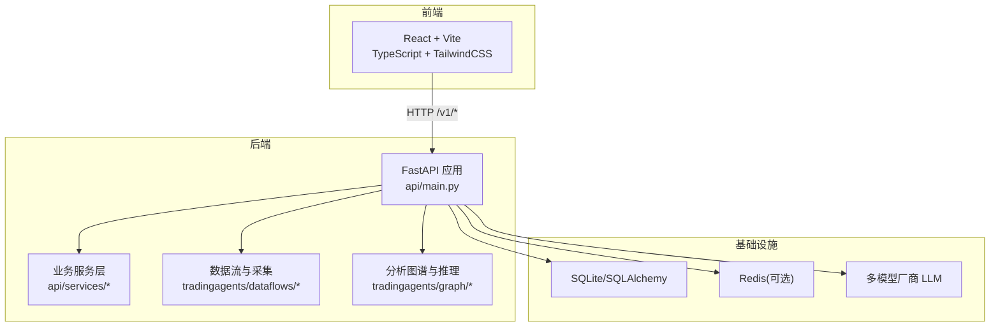
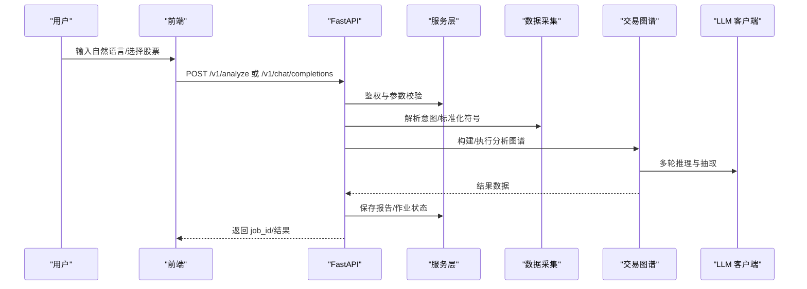
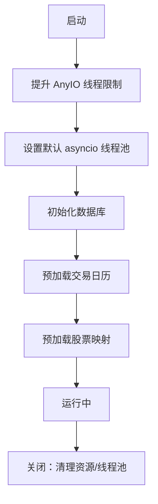
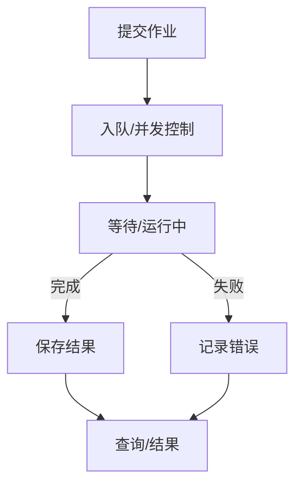
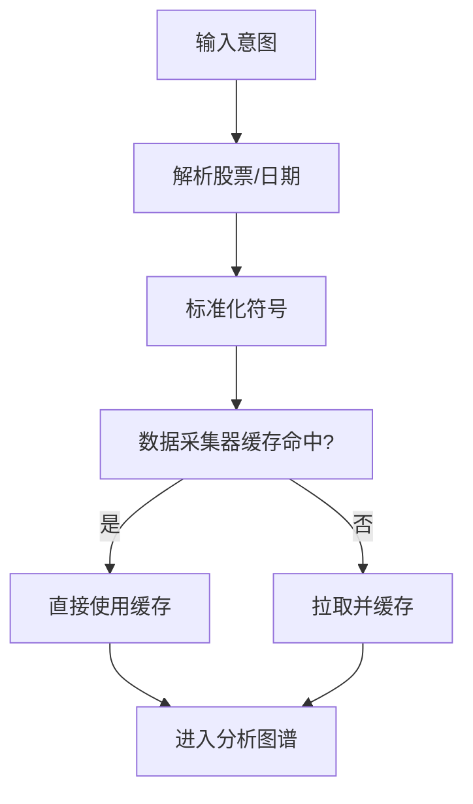
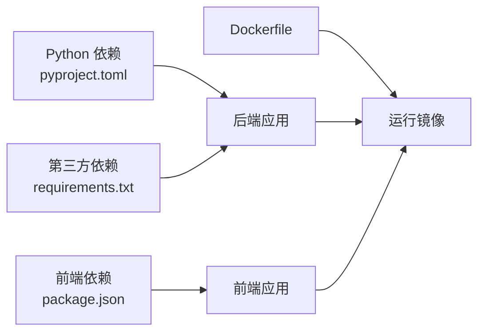

# 开发指南

<cite>
**本文引用的文件**
- [README.md](file://README.md)
- [Dockerfile](file://Dockerfile)
- [pyproject.toml](file://pyproject.toml)
- [requirements.txt](file://requirements.txt)
- [api/main.py](file://api/main.py)
- [frontend/vite.config.ts](file://frontend/vite.config.ts)
- [frontend/tsconfig.json](file://frontend/tsconfig.json)
- [frontend/package.json](file://frontend/package.json)
- [tests/test_api_smoke.py](file://tests/test_api_smoke.py)
</cite>

## 目录
1. [简介](#简介)
2. [项目结构](#项目结构)
3. [核心组件](#核心组件)
4. [架构总览](#架构总览)
5. [详细组件分析](#详细组件分析)
6. [依赖分析](#依赖分析)
7. [性能考虑](#性能考虑)
8. [故障排查指南](#故障排查指南)
9. [结论](#结论)
10. [附录](#附录)

## 简介
本指南面向参与 TradingAgents-AShare 项目的开发者，提供从环境搭建、代码规范、测试策略、代码审查与质量保证、持续集成实践，到贡献流程、分支管理与发布流程的完整开发手册。同时覆盖调试技巧、性能分析与问题排查方法，以及项目结构、模块依赖与扩展开发指南，并给出 IDE 配置与开发效率提升建议。

## 项目结构
项目采用前后端分离架构：
- 后端：FastAPI 应用，提供 REST API、任务队列与调度、LLM 集成、数据采集与分析图谱执行。
- 前端：React + TypeScript 应用，Vite 构建，TailwindCSS 样式，提供仪表盘、聊天交互、定时任务、跟踪看板等功能。
- 测试：Python pytest 与 FastAPI TestClient 组合，覆盖 API 烤面包测试、鉴权、配置热更新、通知服务等。
- 运行与打包：Docker 多阶段构建，uv 同步依赖，前端产物静态嵌入。

图表来源
- [api/main.py:298-313](file://api/main.py#L298-L313)
- [frontend/vite.config.ts:50-72](file://frontend/vite.config.ts#L50-L72)
- [Dockerfile:11-32](file://Dockerfile#L11-L32)

章节来源
- [README.md:96-151](file://README.md#L96-L151)
- [Dockerfile:1-51](file://Dockerfile#L1-L51)
- [frontend/package.json:1-47](file://frontend/package.json#L1-L47)

## 核心组件
- API 主机与生命周期：初始化数据库、清理资源、CORS、线程池与并发限制、版本统计上报、预加载交易日历与股票映射。
- 任务与作业：统一作业存储（内存/Redis）、作业超时、后台任务跟踪、事件推送。
- 数据与图谱：全局共享数据采集器、意图解析、交易图谱执行、LLM 客户端工厂与校验。
- 服务层：认证、定时任务、报告、自选股、跟踪看板、通知（企业微信）、邮件报告等。
- 前端代理与构建：本地开发代理到后端、构建注入版本元数据、路径别名与严格类型检查。

章节来源
- [api/main.py:216-279](file://api/main.py#L216-L279)
- [api/main.py:317-366](file://api/main.py#L317-L366)
- [api/main.py:62-73](file://api/main.py#L62-L73)
- [frontend/vite.config.ts:36-74](file://frontend/vite.config.ts#L36-L74)
- [frontend/tsconfig.json:1-42](file://frontend/tsconfig.json#L1-L42)

## 架构总览
系统通过 FastAPI 提供统一 API，前端通过代理访问后端接口；后端根据请求进入意图解析与分析图谱执行路径，期间调用多数据源与多 LLM 提供商，最终产出结构化报告并持久化。

图表来源
- [api/main.py:599-612](file://api/main.py#L599-L612)
- [api/main.py:660-669](file://api/main.py#L660-L669)
- [api/main.py:614-653](file://api/main.py#L614-L653)

## 详细组件分析

### 后端 API 主机与生命周期
- 生命周期钩子：启动时提升 AnyIO 线程限制、调整默认 asyncio 线程池大小、初始化数据库、清空作业存储、预加载交易日历与股票映射。
- CORS 与安全：支持动态允许来源与正则匹配；生产模式下隐藏文档端点；应用密钥缺失时发出警告。
- 作业与并发：统一作业存储、后台任务集合防止 GC、作业超时与线程池配置。
- 版本与统计：读取环境版本或包元数据，匿名上报版本统计。

图表来源
- [api/main.py:216-279](file://api/main.py#L216-L279)
- [api/main.py:281-296](file://api/main.py#L281-L296)

章节来源
- [api/main.py:216-279](file://api/main.py#L216-L279)
- [api/main.py:281-296](file://api/main.py#L281-L296)

### 任务与作业系统
- 作业存储：内存或 Redis（通过环境变量切换），支持清理与并发控制。
- 作业超时：默认 30 分钟，可通过环境变量覆盖。
- 后台任务：跟踪未完成任务，异常回调记录错误，避免被 GC 回收。
- 作业状态：支持查询、结果获取、等待队列长度与并发限制反馈。

图表来源
- [api/main.py:317-366](file://api/main.py#L317-L366)
- [api/main.py:639-653](file://api/main.py#L639-L653)

章节来源
- [api/main.py:317-366](file://api/main.py#L317-L366)
- [api/main.py:639-653](file://api/main.py#L639-L653)

### 数据采集与意图解析
- 全局共享数据采集器：同一标的+日期的数据仅拉取一次，跨作业复用缓存。
- 股票映射：A 股与 ETF/场内基金名称与代码映射，带 TTL 缓存与反向映射。
- 意图解析：从聊天消息中抽取股票与交易日，避免重复 LLM 调用。

图表来源
- [api/main.py:66-73](file://api/main.py#L66-L73)
- [api/main.py:387-440](file://api/main.py#L387-L440)
- [api/main.py:461-479](file://api/main.py#L461-L479)

章节来源
- [api/main.py:66-73](file://api/main.py#L66-L73)
- [api/main.py:387-440](file://api/main.py#L387-L440)
- [api/main.py:461-479](file://api/main.py#L461-L479)

### 服务层与通知
- 企业微信通知：保存 webhook 密钥（掩码显示）、热身验证、发送测试消息。
- 邮件报告：SMTP 配置（开发环境验证码直显），生产环境通过环境变量注入。
- 定时任务：批量创建、更新、删除、手动触发、失败自动停用。

章节来源
- [api/main.py:425-497](file://api/main.py#L425-L497)
- [api/main.py:669-726](file://api/main.py#L669-L726)
- [api/main.py:160-214](file://api/main.py#L160-L214)

### 前端开发与代理
- 本地代理：将 /v1/*、/api、/healthz、/openapi.json 等转发至后端 8000 端口。
- 构建元数据：注入 Git 提交 SHA、日期与版本号，便于溯源。
- 路径别名：@ 指向 src，提升导入一致性。
- 类型严格：开启严格模式与未使用检测，排除测试文件。

章节来源
- [frontend/vite.config.ts:36-74](file://frontend/vite.config.ts#L36-L74)
- [frontend/tsconfig.json:1-42](file://frontend/tsconfig.json#L1-L42)
- [frontend/package.json:1-47](file://frontend/package.json#L1-L47)

## 依赖分析
- Python 依赖：LangChain/LangGraph、FastAPI/Uvicorn、SQLAlchemy、Redis、LLM 客户端等。
- 前端依赖：React、TailwindCSS、轻量图表、虚拟列表、路由、状态库等。
- 构建与运行：Docker 多阶段构建，uv 同步依赖，前端产物静态嵌入。

图表来源
- [pyproject.toml:11-38](file://pyproject.toml#L11-L38)
- [requirements.txt:1-24](file://requirements.txt#L1-L24)
- [frontend/package.json:12-30](file://frontend/package.json#L12-L30)
- [Dockerfile:11-35](file://Dockerfile#L11-L35)

章节来源
- [pyproject.toml:11-38](file://pyproject.toml#L11-L38)
- [requirements.txt:1-24](file://requirements.txt#L1-L24)
- [frontend/package.json:12-30](file://frontend/package.json#L12-L30)
- [Dockerfile:11-35](file://Dockerfile#L11-L35)

## 性能考虑
- 线程与并发
  - 提升 AnyIO 线程限制与默认 asyncio 线程池大小，避免高频同步端点相互阻塞。
  - 作业超时默认 30 分钟，长流程分析与多 Agent 推理场景下建议结合环境变量调优。
- 缓存与复用
  - 全局数据采集器缓存同一标的+日期数据，减少重复拉取。
  - 股票名称/代码映射带 TTL 缓存，冷启动时可回退到代码显示。
- I/O 与网络
  - 企业微信/邮件等外部调用建议异步或后台任务处理，避免阻塞主流程。
- 前端性能
  - 使用虚拟列表与图表懒加载，减少首屏渲染压力；构建注入版本元数据便于灰度与回滚。

章节来源
- [api/main.py:216-279](file://api/main.py#L216-L279)
- [api/main.py:317-366](file://api/main.py#L317-L366)
- [api/main.py:387-440](file://api/main.py#L387-L440)
- [frontend/vite.config.ts:36-74](file://frontend/vite.config.ts#L36-L74)

## 故障排查指南
- 启动与安全
  - 未设置应用密钥：启动日志会警告密钥缺失，生产环境必须设置。
  - 文档端点：生产模式下隐藏 /docs /redoc /openapi.json。
- 作业与并发
  - 作业长时间未完成：检查线程池与 AnyIO 限流配置；确认作业超时设置。
  - 作业失败：查看作业状态中的错误字段，结合后端日志定位。
- 数据与意图
  - 股票映射冷启动：若名称搜索失败，可显式调用加载或使用代码。
  - 意图解析失败：确保聊天消息包含明确股票与日期信息，或使用 /v1/analyze 显式传参。
- 前端代理
  - 404 或跨域：确认本地代理配置正确，端口与路径重写规则生效。
- 配置热更新
  - LLM Key 校验失败：先探测再保存，无效 Key 将被拒绝；手动 warmup 可验证上游可用性。

章节来源
- [api/main.py:257-264](file://api/main.py#L257-L264)
- [api/main.py:281-305](file://api/main.py#L281-L305)
- [api/main.py:317-366](file://api/main.py#L317-L366)
- [api/main.py:461-479](file://api/main.py#L461-L479)
- [frontend/vite.config.ts:48-73](file://frontend/vite.config.ts#L48-L73)

## 测试策略与实践
- 测试框架
  - 后端：pytest + FastAPI TestClient，无外部服务器即可运行。
  - 前端：Vitest（package.json 中定义），可配合 React 组件测试。
- 测试覆盖
  - API 烤面包测试：校验请求模型字段、鉴权、作业状态与结果。
  - 配置热更新：模型变更、Key 校验、强制 warmup、手动 warmup。
  - 通知服务：企业微信 webhook 保存、掩码显示、热身验证、无效 URL 拒绝。
  - 自选股与定时任务：批量添加、去重、删除、手动触发与批量触发。
  - 报告管理：最新报告按标的聚合、批量删除。
- 最佳实践
  - 使用 TestClient 创建应用实例，避免真实数据库与外部服务。
  - 对外部调用（LLM、企业微信、邮件）进行 mock，确保测试稳定。
  - 对并发与异步路径（后台任务、作业状态）进行最小化验证，避免过度耦合。

章节来源
- [tests/test_api_smoke.py:1-823](file://tests/test_api_smoke.py#L1-L823)
- [frontend/package.json:44-44](file://frontend/package.json#L44-L44)

## 代码规范与开发工具
- Python
  - 版本要求：Python >= 3.10；依赖通过 pyproject.toml 与 requirements.txt 管理。
  - 代码风格：遵循项目既有风格（本仓库未提供 .flake8/.ruff 配置，建议统一风格）。
  - 日志：使用标准 logging，带时间戳格式；错误路径打印堆栈。
- 前端
  - 类型：TypeScript 严格模式，未使用变量/参数检测。
  - 构建：Vite + React + TailwindCSS；ESNext 模块解析。
  - ESLint：配置位于前端根目录，建议在 IDE 中启用实时检查。
- IDE 配置建议
  - VSCode：启用 ESLint、Prettier、Python 扩展；设置 Python 解释器为项目环境。
  - 前端：配置路径别名与类型检查；启用保存时格式化。
- 开发效率
  - 本地代理：前端 dev server 指向后端 8000 端口，减少跨域与部署成本。
  - 构建元数据：版本号与提交信息注入，便于问题定位与回滚。

章节来源
- [pyproject.toml:10-10](file://pyproject.toml#L10-L10)
- [requirements.txt:1-24](file://requirements.txt#L1-L24)
- [frontend/tsconfig.json:19-28](file://frontend/tsconfig.json#L19-L28)
- [frontend/package.json:34-44](file://frontend/package.json#L34-L44)
- [frontend/vite.config.ts:36-74](file://frontend/vite.config.ts#L36-L74)

## 代码审查与质量保证
- 审查清单
  - 功能正确性：覆盖边界条件与错误路径（如无效股票、鉴权失败、Key 校验失败）。
  - 并发与资源：线程池、后台任务、作业超时、数据库连接与事务。
  - 外部集成：LLM、企业微信、邮件、Redis（可选）。
  - 前端交互：代理配置、错误提示、加载状态、版本元数据。
- 质量门禁
  - 必须通过 pytest 与前端 lint/构建检查。
  - 关键路径（作业状态、意图解析、LLM 调用）建议增加集成测试。
- 持续集成
  - 建议在 CI 中执行：Python 依赖安装、pytest、前端安装与构建、Lint。
  - Docker 构建作为发布前置步骤，确保镜像可复现。

章节来源
- [tests/test_api_smoke.py:1-823](file://tests/test_api_smoke.py#L1-L823)
- [frontend/package.json:6-11](file://frontend/package.json#L6-L11)
- [Dockerfile:1-51](file://Dockerfile#L1-L51)

## 贡献指南、分支管理与发布流程
- 贡献流程
  - Fork 仓库，创建功能分支，提交 PR 并关联测试。
  - 保持提交信息清晰，必要时附带变更说明与截图。
- 分支管理
  - 主分支：稳定版本；功能分支：feature/*；修复分支：fix/*；热修复：hotfix/*。
  - 合并前确保 CI 通过、审查通过、测试覆盖。
- 发布流程
  - Docker 多阶段构建：前端构建产物复制到运行镜像，uv 同步依赖，暴露 8000 端口。
  - 版本号：通过构建参数注入，或使用 Git 标签。
  - 环境变量：生产环境必须设置应用密钥与作业超时；可选 Redis 与 CORS 来源。
- 部署建议
  - 使用 Docker 镜像部署；生产环境配置 SMTP、LLM Key、Redis（可选）。
  - 前端静态资源已内嵌，无需额外静态服务器。

章节来源
- [README.md:96-151](file://README.md#L96-L151)
- [Dockerfile:1-51](file://Dockerfile#L1-L51)
- [api/main.py:257-264](file://api/main.py#L257-L264)

## 调试技巧与性能分析
- 后端调试
  - 启用详细日志：设置 LOG_LEVEL；查看作业状态与错误字段。
  - 并发问题：检查线程池与 AnyIO 限流配置；观察后台任务集合。
  - LLM 问题：使用手动 warmup 接口验证上游可用性与 Key 校验。
- 前端调试
  - 代理：确认 /v1/* 代理到后端；检查路径重写。
  - 构建问题：清理 node_modules 与缓存，重新安装与构建。
- 性能分析
  - 作业耗时：对比提交与完成时间，定位慢环节。
  - 数据采集：监控缓存命中率与外部 API 延迟。
  - 前端：使用浏览器性能面板分析首屏与交互延迟。

章节来源
- [api/main.py:23-28](file://api/main.py#L23-L28)
- [api/main.py:216-279](file://api/main.py#L216-L279)
- [frontend/vite.config.ts:50-72](file://frontend/vite.config.ts#L50-L72)

## 结论
本指南提供了从环境搭建到测试、审查、CI/CD、贡献与发布的全链路开发实践。建议在开发过程中遵循统一的代码规范与测试策略，结合并发与缓存优化，确保系统在多智能体推理与高频请求场景下的稳定性与性能。

## 附录
- 快速启动（Docker）
  - 拉取镜像、设置密钥、挂载数据目录、指定数据库 URL 与作业超时，启动容器。
- 源码安装
  - 后端：uv 同步依赖；前端：npm 安装与构建；后端运行 uvicorn。
- API 集成
  - 提供标准 REST API，支持触发分析、状态追踪、结果获取、报告管理、定时任务、配置热更新等。

章节来源
- [README.md:96-151](file://README.md#L96-L151)
- [README.md:152-179](file://README.md#L152-L179)