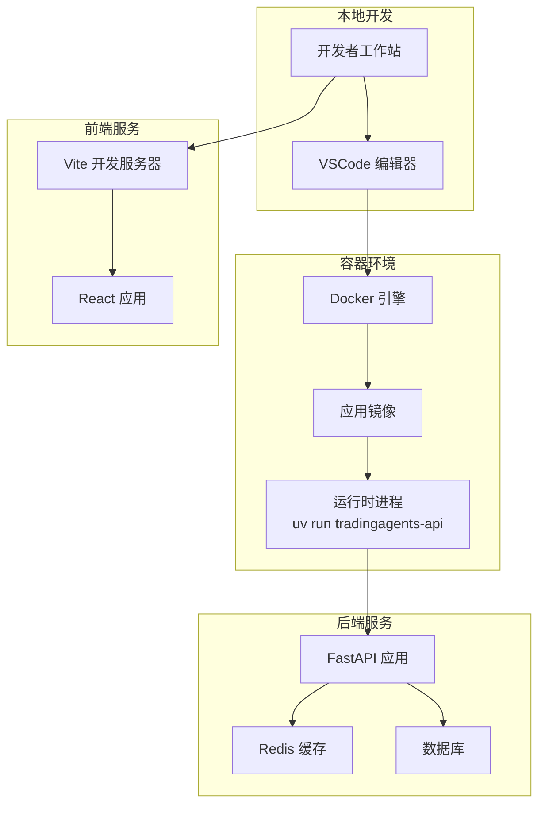
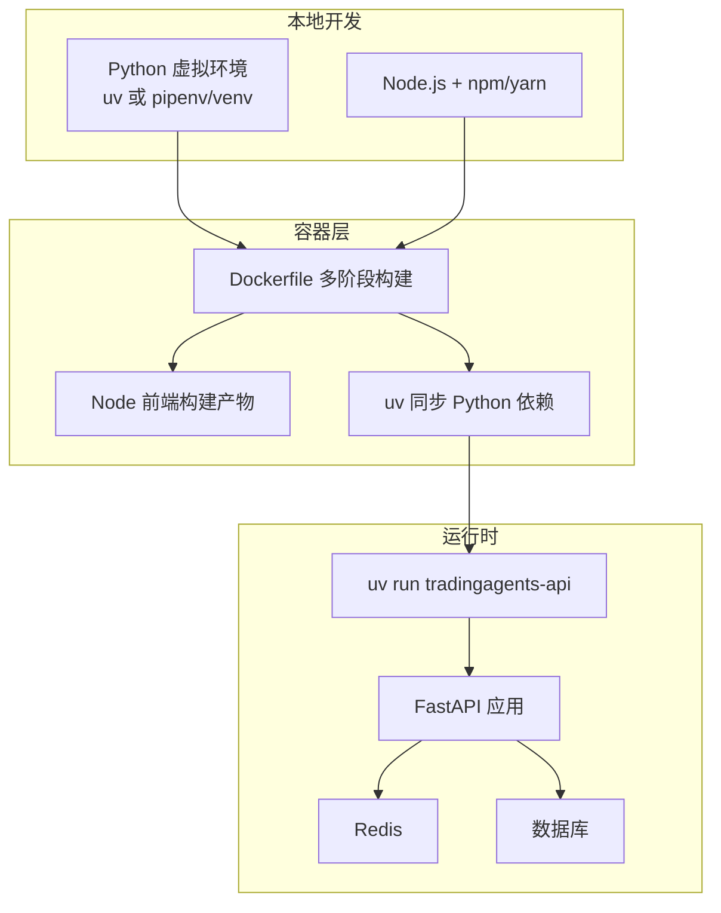
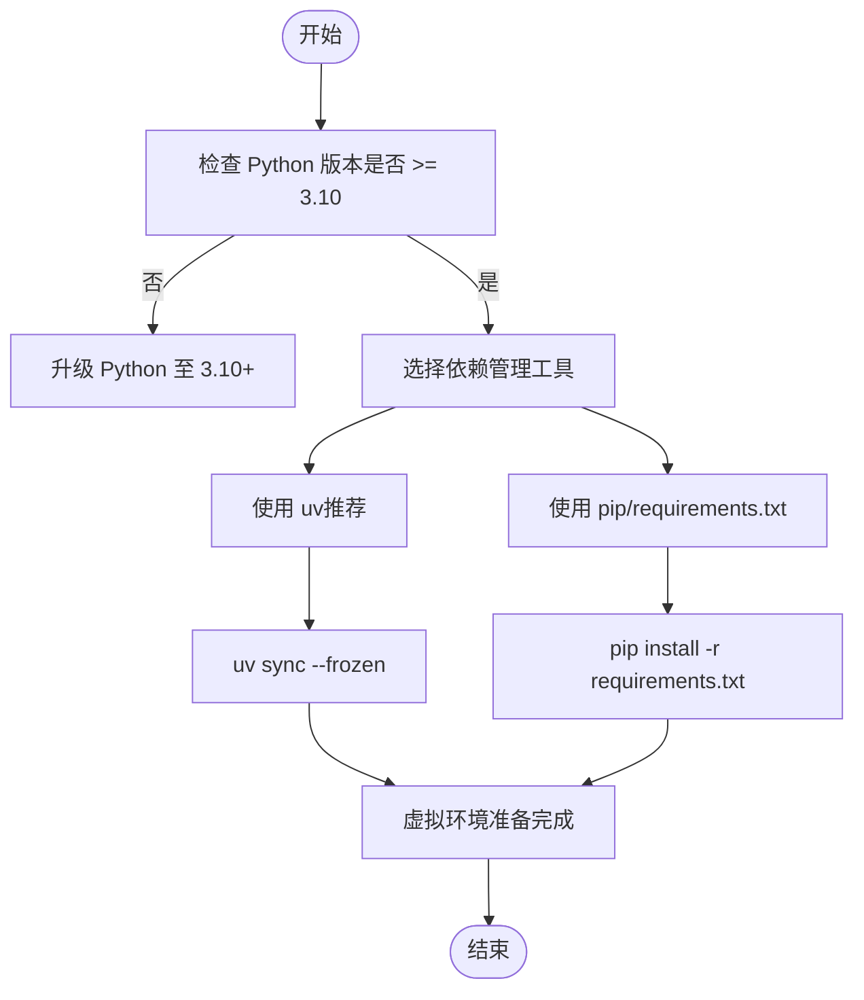
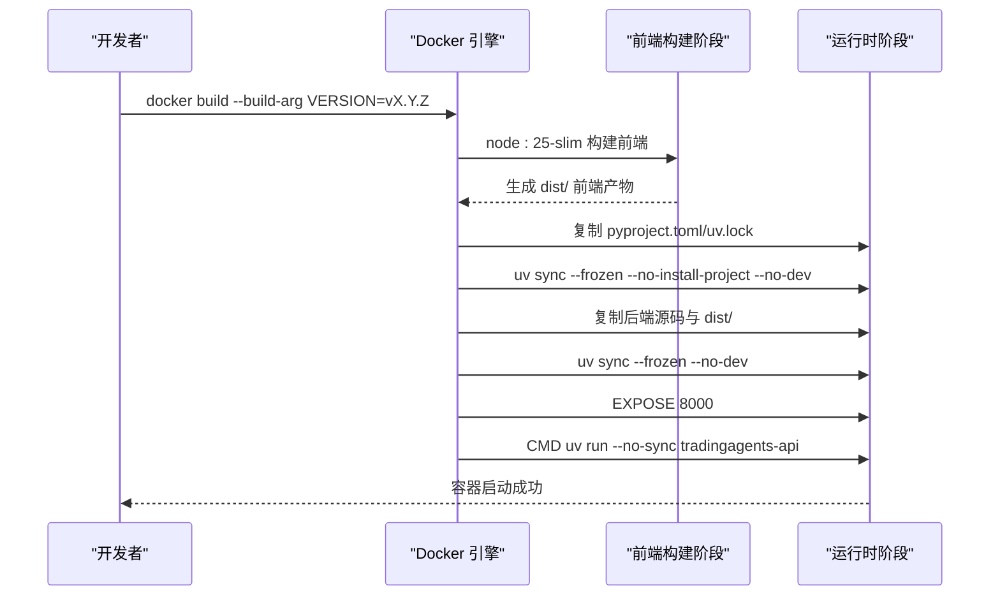
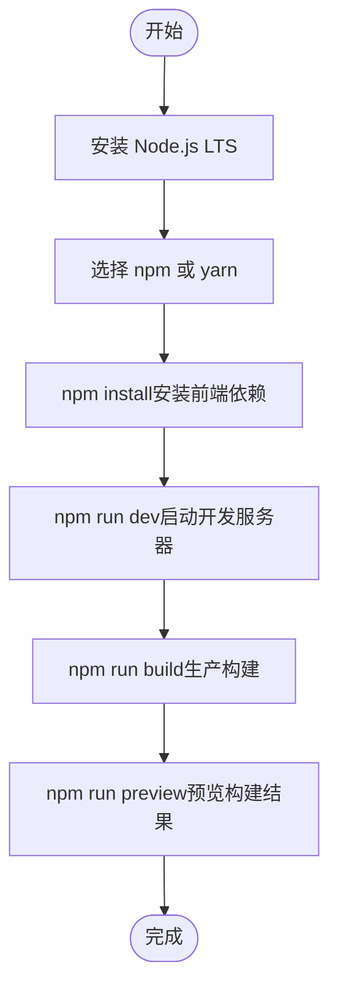
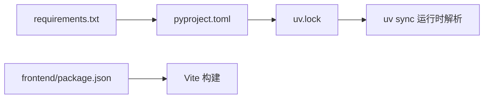

# 开发环境搭建

<cite>
**本文档引用的文件**
- [pyproject.toml](file://pyproject.toml)
- [requirements.txt](file://requirements.txt)
- [Dockerfile](file://Dockerfile)
- [uv.lock](file://uv.lock)
- [frontend/package.json](file://frontend/package.json)
- [.github/workflows/ci-checks.yml](file://.github/workflows/ci-checks.yml)
- [.github/workflows/docker-publish.yml](file://.github/workflows/docker-publish.yml)
</cite>

## 目录
1. [简介](#简介)
2. [项目结构](#项目结构)
3. [核心组件](#核心组件)
4. [架构总览](#架构总览)
5. [详细组件分析](#详细组件分析)
6. [依赖分析](#依赖分析)
7. [性能考虑](#性能考虑)
8. [故障排除指南](#故障排除指南)
9. [结论](#结论)
10. [附录](#附录)

## 简介
本指南面向希望在本地或容器环境中搭建 TradingAgents-AShare 开发与测试环境的开发者。内容覆盖：
- Python 3.10+ 环境配置与虚拟环境创建
- 依赖安装与版本兼容性管理
- Docker 容器化开发环境搭建
- 前端开发环境配置（Node.js、npm/yarn）
- IDE 配置建议与调试设置
- GitHub Actions CI/CD 流程与本地开发流程
- 常见环境问题排查与解决方案

## 项目结构
项目采用前后端分离架构：
- 后端：Python 3.10+，FastAPI 应用，LangGraph、Redis、SQLAlchemy 等依赖
- 前端：React + TypeScript，Vite 构建工具链
- 容器化：Docker 多阶段构建，Node 前端构建 + uv 同步 Python 依赖
- CI/CD：GitHub Actions 自动化检查与镜像发布

**图表来源**
- [Dockerfile:1-51](file://Dockerfile#L1-L51)
- [frontend/package.json:1-47](file://frontend/package.json#L1-L47)

**章节来源**
- [Dockerfile:1-51](file://Dockerfile#L1-L51)
- [frontend/package.json:1-47](file://frontend/package.json#L1-L47)

## 核心组件
- Python 后端
  - 运行时：Python 3.10+
  - Web 框架：FastAPI
  - 并发与任务队列：Redis
  - 数据库：SQLAlchemy
  - 图编排：LangGraph
  - 数据采集：yfinance、akshare、baostock
- 前端
  - 框架：React 18
  - 构建：Vite
  - 类型：TypeScript
  - UI 组件：TailwindCSS + Recharts + Lightweight Charts
- 容器化
  - 多阶段构建：Node 前端构建 + uv 同步 Python 依赖
  - 运行命令：uv run tradingagents-api

**章节来源**
- [pyproject.toml:1-52](file://pyproject.toml#L1-L52)
- [requirements.txt:1-24](file://requirements.txt#L1-L24)
- [Dockerfile:1-51](file://Dockerfile#L1-L51)
- [frontend/package.json:1-47](file://frontend/package.json#L1-L47)

## 架构总览
下图展示从本地到容器再到后端服务的整体架构关系。

**图表来源**
- [Dockerfile:1-51](file://Dockerfile#L1-L51)
- [pyproject.toml:1-52](file://pyproject.toml#L1-L52)
- [frontend/package.json:1-47](file://frontend/package.json#L1-L47)

## 详细组件分析

### Python 环境与依赖管理
- Python 版本要求
  - 项目要求 Python >= 3.10
- 依赖管理工具
  - 推荐使用 uv（高性能包管理器），支持 lock 文件与增量同步
  - 支持传统 pip/requirements.txt
- 关键依赖类别
  - Web 框架与并发：FastAPI、Uvicorn、Redis
  - AI/LLM：LangChain（OpenAI、Anthropic、Google GenAI）、LangGraph
  - 数据处理：Pandas、PyArrow、yfinance、akshare、baostock
  - 数据库：SQLAlchemy、JSON Repair、Markdown
  - 工具：Typing-Extensions、Requests、Setuptools、PyJWT、Cryptography

**图表来源**
- [pyproject.toml:10-38](file://pyproject.toml#L10-L38)
- [requirements.txt:1-24](file://requirements.txt#L1-L24)
- [uv.lock:1-10](file://uv.lock#L1-L10)

**章节来源**
- [pyproject.toml:10-38](file://pyproject.toml#L10-L38)
- [requirements.txt:1-24](file://requirements.txt#L1-L24)
- [uv.lock:1-10](file://uv.lock#L1-L10)

### Docker 容器化开发环境
- 多阶段构建
  - 阶段 1：Node 基础镜像构建前端产物
  - 阶段 2：基于 uv 官方 Python 3.10 slim 镜像，安装系统依赖，使用 uv 同步 Python 依赖，复制后端源码与前端构建产物，暴露 8000 端口，CMD 使用 uv run 启动 API
- 关键参数
  - 环境变量：PYTHONUNBUFFERED、PYTHONPATH、TA_JOB_TIMEOUT
  - 版本注入：通过 --build-arg VERSION 注入版本号
- 启动方式
  - CMD uv run --no-sync tradingagents-api

**图表来源**
- [Dockerfile:1-51](file://Dockerfile#L1-L51)

**章节来源**
- [Dockerfile:1-51](file://Dockerfile#L1-L51)

### 前端开发环境配置
- Node.js 与包管理器
  - 推荐使用 Node.js LTS（与项目脚本兼容）
  - 包管理器：npm 或 yarn（项目脚本优先使用 npm）
- 依赖安装与脚本
  - 安装：npm install
  - 开发：npm run dev
  - 构建：npm run build
  - 预览：npm run preview
  - 代码检查：npm run lint
- 关键依赖
  - React 18、TypeScript、Vite、TailwindCSS、Recharts、Lightweight Charts、Zustand 状态管理等

**图表来源**
- [frontend/package.json:1-47](file://frontend/package.json#L1-L47)

**章节来源**
- [frontend/package.json:1-47](file://frontend/package.json#L1-L47)

### IDE 配置建议与调试设置
- 推荐编辑器：VSCode
- Python 调试
  - 使用 Python 扩展，配置 launch.json 启动 FastAPI 应用（uv run tradingagents-api）
  - 设置断点于 api/main.py 或具体服务模块
- 前端调试
  - 在前端目录执行 npm run dev，浏览器访问 Vite 默认地址
  - 可结合 React Developer Tools、Redux DevTools（如使用）

[本节为通用建议，不直接分析具体文件，故无“章节来源”]

### GitHub Actions CI/CD 配置
- 工作流文件
  - ci-checks.yml：代码检查、测试等流水线
  - docker-publish.yml：Docker 镜像构建与发布
- 建议实践
  - 在 PR 中触发 CI 检查
  - 主分支推送触发镜像构建与发布
  - 使用缓存策略提升构建速度（Node 与 uv 缓存）

**章节来源**
- [.github/workflows/ci-checks.yml](file://.github/workflows/ci-checks.yml)
- [.github/workflows/docker-publish.yml](file://.github/workflows/docker-publish.yml)

## 依赖分析
- Python 依赖来源
  - pyproject.toml：项目元数据与依赖声明
  - requirements.txt：简化版依赖清单
  - uv.lock：锁定文件，确保跨平台一致性
- 前端依赖来源
  - frontend/package.json：前端依赖与脚本定义
- 依赖版本兼容性
  - Python：>= 3.10；uv.lock 显示对 3.10–3.14 的分辨率标记
  - Node.js：项目脚本基于 npm，建议使用 LTS 版本

**图表来源**
- [pyproject.toml:1-52](file://pyproject.toml#L1-L52)
- [requirements.txt:1-24](file://requirements.txt#L1-L24)
- [uv.lock:1-10](file://uv.lock#L1-L10)
- [frontend/package.json:1-47](file://frontend/package.json#L1-L47)

**章节来源**
- [pyproject.toml:1-52](file://pyproject.toml#L1-L52)
- [requirements.txt:1-24](file://requirements.txt#L1-L24)
- [uv.lock:1-10](file://uv.lock#L1-L10)
- [frontend/package.json:1-47](file://frontend/package.json#L1-L47)

## 性能考虑
- 使用 uv 进行依赖同步，显著提升安装速度与缓存命中率
- Docker 多阶段构建减少最终镜像体积，提升部署效率
- 前端构建启用缓存挂载（Node 阶段）与 uv 缓存（Python 阶段）
- 生产运行时使用 uv run --no-sync，避免重复安装

[本节为通用指导，不直接分析具体文件，故无“章节来源”]

## 故障排除指南
- Python 版本过低
  - 症状：uv sync 报错或运行时报错
  - 解决：升级至 Python 3.10+
- 依赖冲突或版本不匹配
  - 症状：uv sync 失败或运行时导入错误
  - 解决：使用 uv.lock 保证一致版本；清理缓存后重试
- 前端依赖安装失败
  - 症状：npm install 失败
  - 解决：检查网络与缓存；尝试更换 npm/yarn 源；清理 node_modules 与缓存
- Docker 构建失败
  - 症状：uv sync 或前端构建阶段报错
  - 解决：确认 Dockerfile 中缓存挂载与 COPY 顺序；检查网络代理；使用 --no-cache 构建定位问题
- 端口占用
  - 症状：容器或本地服务无法绑定 8000 端口
  - 解决：修改映射端口或释放占用端口

**章节来源**
- [Dockerfile:1-51](file://Dockerfile#L1-L51)
- [pyproject.toml:10-38](file://pyproject.toml#L10-L38)
- [uv.lock:1-10](file://uv.lock#L1-L10)
- [frontend/package.json:1-47](file://frontend/package.json#L1-L47)

## 结论
通过本指南，您可以在本地或容器环境中快速搭建 TradingAgents-AShare 的开发与测试环境。建议优先使用 uv 管理 Python 依赖，并配合 Docker 多阶段构建实现一致的开发与生产环境。前端使用 npm/yarn 即可满足开发需求。CI/CD 可通过 GitHub Actions 实现自动化检查与镜像发布。

[本节为总结性内容，不直接分析具体文件，故无“章节来源”]

## 附录
- 快速参考
  - Python：确保 Python >= 3.10，推荐使用 uv
  - 前端：Node.js LTS，npm/yarn
  - 容器：docker build --build-arg VERSION=...，运行 uv run tradingagents-api
  - CI/CD：在 .github/workflows 下配置流水线

[本节为补充信息，不直接分析具体文件，故无“章节来源”]