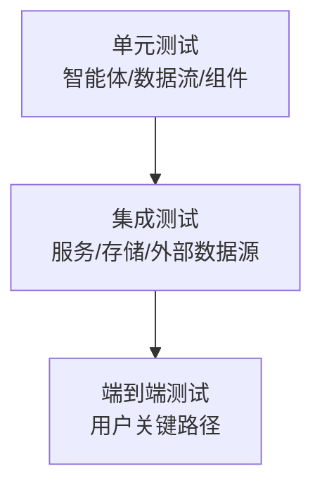
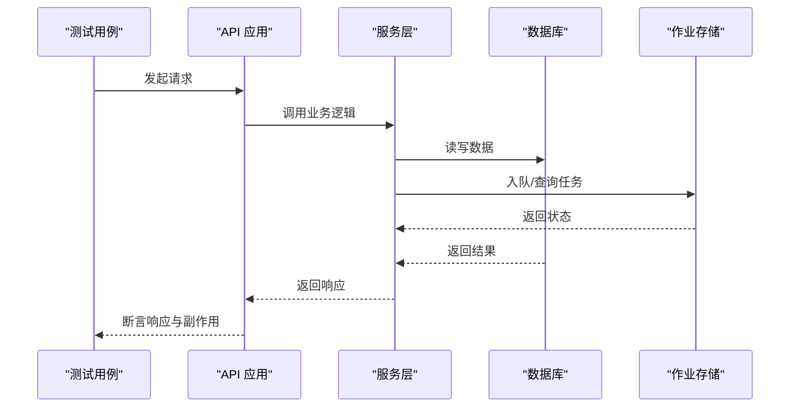
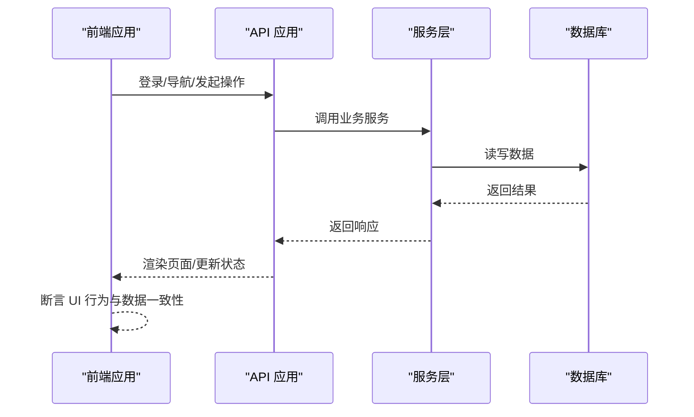
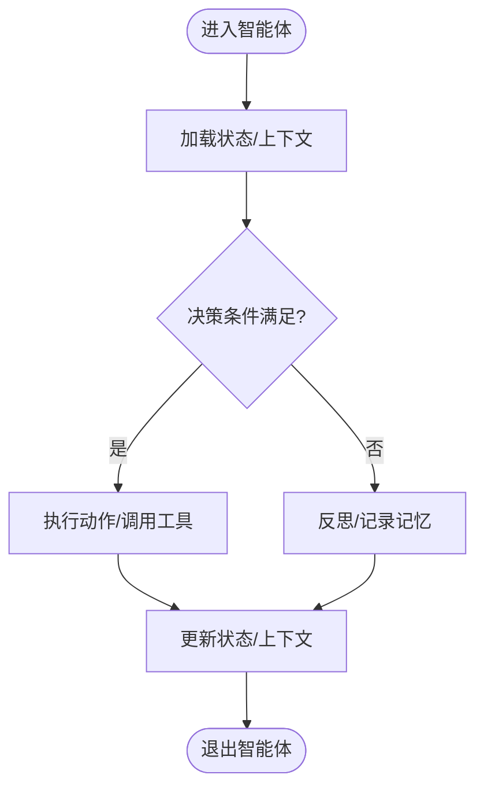
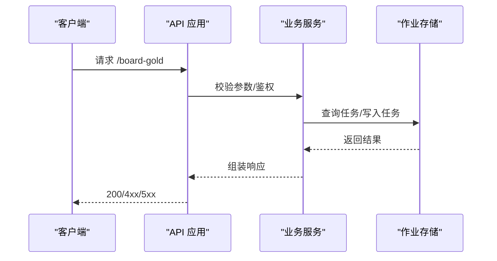
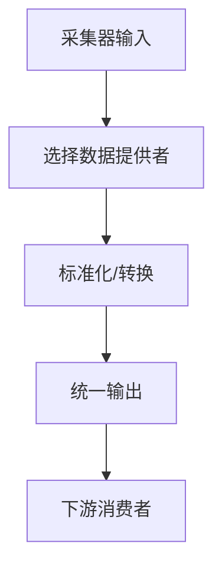
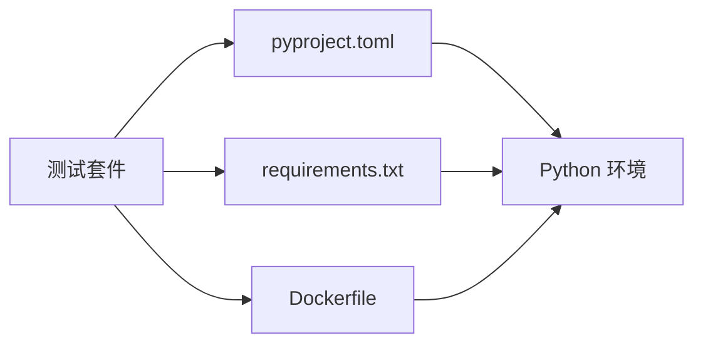

# 测试策略

<cite>
**本文引用的文件**
- [tests/test_api_smoke.py](file://tests/test_api_smoke.py)
- [tests/test_board_gold_api.py](file://tests/test_board_gold_api.py)
- [tests/test_board_gold_service.py](file://tests/test_board_gold_service.py)
- [tests/test_data_collector.py](file://tests/test_data_collector.py)
- [tests/test_job_store.py](file://tests/test_job_store.py)
- [tests/test_job_store_redis.py](file://tests/test_job_store_redis.py)
- [tests/test_realtime_quote_provider.py](file://tests/test_realtime_quote_provider.py)
- [tests/test_agent_states.py](file://tests/test_agent_states.py)
- [tests/test_intent_parser.py](file://tests/test_intent_parser.py)
- [tests/test_market_analyst.py](file://tests/test_market_analyst.py)
- [tests/test_smart_money_analyst.py](file://tests/test_smart_money_analyst.py)
- [tests/test_email_report_service.py](file://tests/test_email_report_service.py)
- [tests/test_wecom_notification_service.py](file://tests/test_wecom_notification_service.py)
- [tests/test_portfolio_import.py](file://tests/test_portfolio_import.py)
- [tests/test_dashboard_tracking.py](file://tests/test_dashboard_tracking.py)
- [tests/test_scheduled_queue.py](file://tests/test_scheduled_queue.py)
- [tests/test_watchlist_scheduled.py](file://tests/test_watchlist_scheduled.py)
- [tests/test_config_fallback.py](file://tests/test_config_fallback.py)
- [tests/test_job_timeout_config.py](file://tests/test_job_timeout_config.py)
- [tests/test_stock_map_fast_path.py](file://tests/test_stock_map_fast_path.py)
- [tests/test_trading_graph_multi_horizon.py](file://tests/test_trading_graph_multi_horizon.py)
- [tests/test_vlm_position_parser.py](file://tests/test_vlm_position_parser.py)
- [tests/test_report_recovery.py](file://tests/test_report_recovery.py)
- [api/main.py](file://api/main.py)
- [api/services/board_gold_service.py](file://api/services/board_gold_service.py)
- [api/services/report_service.py](file://api/services/report_service.py)
- [api/services/portfolio_import_service.py](file://api/services/portfolio_import_service.py)
- [api/services/scheduled_service.py](file://api/services/scheduled_service.py)
- [api/job_store.py](file://api/job_store.py)
- [api/job_store_redis.py](file://api/job_store_redis.py)
- [api/database.py](file://api/database.py)
- [tradingagents/graph/intent_parser.py](file://tradingagents/graph/intent_parser.py)
- [tradingagents/graph/data_collector.py](file://tradingagents/graph/data_collector.py)
- [tradingagents/agents/utils/agent_states.py](file://tradingagents/agents/utils/agent_states.py)
- [tradingagents/agents/analysts/market_analyst.py](file://tradingagents/agents/analysts/market_anilyst.py)
- [tradingagents/agents/analysts/smart_money_analyst.py](file://tradingagents/agents/analysts/smart_money_analyst.py)
- [tradingagents/dataflows/providers/cn_akshare_provider.py](file://tradingagents/dataflows/providers/cn_akshare_provider.py)
- [tradingagents/dataflows/providers/cn_baostock_provider.py](file://tradingagents/dataflows/providers/cn_baostock_provider.py)
- [tradingagents/dataflows/providers/yfinance_provider.py](file://tradingagents/dataflows/providers/yfinance_provider.py)
- [tradingagents/dataflows/providers/alpha_vantage_provider.py](file://tradingagents/dataflows/providers/alpha_vantage_provider.py)
- [tradingagents/dataflows/providers/base.py](file://tradingagents/dataflows/providers/base.py)
- [tradingagents/dataflows/config.py](file://tradingagents/dataflows/config.py)
- [tradingagents/graph/trading_graph.py](file://tradingagents/graph/trading_graph.py)
- [frontend/src/components/sidebarNav.test.ts](file://frontend/src/components/sidebarNav.test.ts)
- [frontend/src/utils/progressFeedback.test.ts](file://frontend/src/utils/progressFeedback.test.ts)
- [frontend/src/services/api.ts](file://frontend/src/services/api.ts)
- [pyproject.toml](file://pyproject.toml)
- [requirements.txt](file://requirements.txt)
- [Dockerfile](file://Dockerfile)
- [.github/workflows](file://.github/workflows)
</cite>

## 目录
1. 引言
2. 项目结构
3. 核心组件
4. 架构总览
5. 详细组件分析
6. 依赖分析
7. 性能考虑
8. 故障排查指南
9. 结论
10. 附录

## 引言
本测试策略文档面向 TradingAgents-AShare 项目，系统化阐述单元测试、集成测试与端到端测试的组织方式与实施要点。文档覆盖测试文件命名规范、用例编写最佳实践、断言策略、Mock 使用、测试数据准备与环境隔离；并针对智能体、API、数据流等核心模块给出具体测试方法。同时包含覆盖率目标、性能与压力测试建议、调试技巧、CI 中的测试执行与结果分析，以及测试自动化与回归策略。

## 项目结构
项目采用前后端分离架构：后端 Python（FastAPI）提供服务与调度，前端 TypeScript/Vue 提供交互界面；测试覆盖后端服务、数据流、智能体逻辑与前端组件。测试目录 tests 下包含多类测试，涵盖 API 烟雾测试、黄金看板服务与接口测试、数据采集器、作业存储（内存与 Redis）、实时行情提供者、配置回退、意图解析、市场与聪明钱分析师、邮件报告、企业微信通知、组合导入、仪表盘跟踪、定时队列与观察清单等。

```mermaid
graph TB
subgraph "后端"
API["API 应用<br/>api/main.py"]
Services["服务层<br/>api/services/*"]
Dataflows["数据流与提供者<br/>tradingagents/dataflows/*"]
Agents["智能体与图谱<br/>tradingagents/agents/*<br/>tradingagents/graph/*"]
Store["作业存储<br/>api/job_store.py / job_store_redis.py"]
DB["数据库<br/>api/database.py"]
end
subgraph "前端"
FE_Components["组件测试<br/>frontend/src/components/*_test.ts"]
FE_Utils["工具函数测试<br/>frontend/src/utils/*_test.ts"]
FE_API["API 客户端<br/>frontend/src/services/api.ts"]
end
subgraph "测试"
T_API_Smoke["API 烟雾测试<br/>tests/test_api_smoke.py"]
T_BoardGold["黄金看板测试<br/>tests/test_board_gold_api.py<br/>tests/test_board_gold_service.py"]
T_Data["数据采集测试<br/>tests/test_data_collector.py"]
T_JobStore["作业存储测试<br/>tests/test_job_store.py<br/>tests/test_job_store_redis.py"]
T_RT["实时行情测试<br/>tests/test_realtime_quote_provider.py"]
T_AgentStates["智能体状态测试<br/>tests/test_agent_states.py"]
T_Parser["意图解析测试<br/>tests/test_intent_parser.py"]
T_MarketAnalyst["市场分析师测试<br/>tests/test_market_analyst.py"]
T_SmartMoney["聪明钱分析师测试<br/>tests/test_smart_money_analyst.py"]
T_Email["邮件报告服务测试<br/>tests/test_email_report_service.py"]
T_Wecom["企业微信通知测试<br/>tests/test_wecom_notification_service.py"]
T_Portfolio["组合导入测试<br/>tests/test_portfolio_import.py"]
T_Dashboard["仪表盘跟踪测试<br/>tests/test_dashboard_tracking.py"]
T_Schedule["定时队列测试<br/>tests/test_scheduled_queue.py<br/>tests/test_watchlist_scheduled.py"]
T_Config["配置测试<br/>tests/test_config_fallback.py<br/>tests/test_job_timeout_config.py"]
T_FastPath["股票映射快速路径测试<br/>tests/test_stock_map_fast_path.py"]
T_GraphMH["多时域图谱测试<br/>tests/test_trading_graph_multi_horizon.py"]
T_VLM["VLM 位置解析测试<br/>tests/test_vlm_position_parser.py"]
T_Report["报告恢复测试<br/>tests/test_report_recovery.py"]
end
FE_Components --> FE_API
FE_Utils --> FE_API
T_API_Smoke --> API
T_BoardGold --> Services
T_Data --> Dataflows
T_JobStore --> Store
T_RT --> Dataflows
T_AgentStates --> Agents
T_Parser --> Agents
T_MarketAnalyst --> Agents
T_SmartMoney --> Agents
T_Email --> Services
T_Wecom --> Services
T_Portfolio --> Services
T_Dashboard --> Services
T_Schedule --> Services
T_Config --> API
T_FastPath --> Dataflows
T_GraphMH --> Agents
T_VLM --> Agents
T_Report --> Services
```

**图表来源**
- [api/main.py](file://api/main.py)
- [api/services/board_gold_service.py](file://api/services/board_gold_service.py)
- [api/services/report_service.py](file://api/services/report_service.py)
- [api/services/portfolio_import_service.py](file://api/services/portfolio_import_service.py)
- [api/services/scheduled_service.py](file://api/services/scheduled_service.py)
- [api/job_store.py](file://api/job_store.py)
- [api/job_store_redis.py](file://api/job_store_redis.py)
- [api/database.py](file://api/database.py)
- [tradingagents/graph/intent_parser.py](file://tradingagents/graph/intent_parser.py)
- [tradingagents/graph/data_collector.py](file://tradingagents/graph/data_collector.py)
- [tradingagents/agents/utils/agent_states.py](file://tradingagents/agents/utils/agent_states.py)
- [tradingagents/agents/analysts/market_analyst.py](file://tradingagents/agents/analysts/market_analyst.py)
- [tradingagents/agents/analysts/smart_money_analyst.py](file://tradingagents/agents/analysts/smart_money_analyst.py)
- [tradingagents/dataflows/providers/cn_akshare_provider.py](file://tradingagents/dataflows/providers/cn_akshare_provider.py)
- [tradingagents/dataflows/providers/cn_baostock_provider.py](file://tradingagents/dataflows/providers/cn_baostock_provider.py)
- [tradingagents/dataflows/providers/yfinance_provider.py](file://tradingagents/dataflows/providers/yfinance_provider.py)
- [tradingagents/dataflows/providers/alpha_vantage_provider.py](file://tradingagents/dataflows/providers/alpha_vantage_provider.py)
- [tradingagents/dataflows/config.py](file://tradingagents/dataflows/config.py)
- [tradingagents/graph/trading_graph.py](file://tradingagents/graph/trading_graph.py)
- [frontend/src/components/sidebarNav.test.ts](file://frontend/src/components/sidebarNav.test.ts)
- [frontend/src/utils/progressFeedback.test.ts](file://frontend/src/utils/progressFeedback.test.ts)
- [frontend/src/services/api.ts](file://frontend/src/services/api.ts)
- [tests/test_api_smoke.py](file://tests/test_api_smoke.py)
- [tests/test_board_gold_api.py](file://tests/test_board_gold_api.py)
- [tests/test_board_gold_service.py](file://tests/test_board_gold_service.py)
- [tests/test_data_collector.py](file://tests/test_data_collector.py)
- [tests/test_job_store.py](file://tests/test_job_store.py)
- [tests/test_job_store_redis.py](file://tests/test_job_store_redis.py)
- [tests/test_realtime_quote_provider.py](file://tests/test_realtime_quote_provider.py)
- [tests/test_agent_states.py](file://tests/test_agent_states.py)
- [tests/test_intent_parser.py](file://tests/test_intent_parser.py)
- [tests/test_market_analyst.py](file://tests/test_market_analyst.py)
- [tests/test_smart_money_analyst.py](file://tests/test_smart_money_analyst.py)
- [tests/test_email_report_service.py](file://tests/test_email_report_service.py)
- [tests/test_wecom_notification_service.py](file://tests/test_wecom_notification_service.py)
- [tests/test_portfolio_import.py](file://tests/test_portfolio_import.py)
- [tests/test_dashboard_tracking.py](file://tests/test_dashboard_tracking.py)
- [tests/test_scheduled_queue.py](file://tests/test_scheduled_queue.py)
- [tests/test_watchlist_scheduled.py](file://tests/test_watchlist_scheduled.py)
- [tests/test_config_fallback.py](file://tests/test_config_fallback.py)
- [tests/test_job_timeout_config.py](file://tests/test_job_timeout_config.py)
- [tests/test_stock_map_fast_path.py](file://tests/test_stock_map_fast_path.py)
- [tests/test_trading_graph_multi_horizon.py](file://tests/test_trading_graph_multi_horizon.py)
- [tests/test_vlm_position_parser.py](file://tests/test_vlm_position_parser.py)
- [tests/test_report_recovery.py](file://tests/test_report_recovery.py)

**章节来源**
- [tests/test_api_smoke.py](file://tests/test_api_smoke.py)
- [tests/test_board_gold_api.py](file://tests/test_board_gold_api.py)
- [tests/test_board_gold_service.py](file://tests/test_board_gold_service.py)
- [tests/test_data_collector.py](file://tests/test_data_collector.py)
- [tests/test_job_store.py](file://tests/test_job_store.py)
- [tests/test_job_store_redis.py](file://tests/test_job_store_redis.py)
- [tests/test_realtime_quote_provider.py](file://tests/test_realtime_quote_provider.py)
- [tests/test_agent_states.py](file://tests/test_agent_states.py)
- [tests/test_intent_parser.py](file://tests/test_intent_parser.py)
- [tests/test_market_analyst.py](file://tests/test_market_analyst.py)
- [tests/test_smart_money_analyst.py](file://tests/test_smart_money_analyst.py)
- [tests/test_email_report_service.py](file://tests/test_email_report_service.py)
- [tests/test_wecom_notification_service.py](file://tests/test_wecom_notification_service.py)
- [tests/test_portfolio_import.py](file://tests/test_portfolio_import.py)
- [tests/test_dashboard_tracking.py](file://tests/test_dashboard_tracking.py)
- [tests/test_scheduled_queue.py](file://tests/test_scheduled_queue.py)
- [tests/test_watchlist_scheduled.py](file://tests/test_watchlist_scheduled.py)
- [tests/test_config_fallback.py](file://tests/test_config_fallback.py)
- [tests/test_job_timeout_config.py](file://tests/test_job_timeout_config.py)
- [tests/test_stock_map_fast_path.py](file://tests/test_stock_map_fast_path.py)
- [tests/test_trading_graph_multi_horizon.py](file://tests/test_trading_graph_multi_horizon.py)
- [tests/test_vlm_position_parser.py](file://tests/test_vlm_position_parser.py)
- [tests/test_report_recovery.py](file://tests/test_report_recovery.py)
- [api/main.py](file://api/main.py)
- [api/services/board_gold_service.py](file://api/services/board_gold_service.py)
- [api/services/report_service.py](file://api/services/report_service.py)
- [api/services/portfolio_import_service.py](file://api/services/portfolio_import_service.py)
- [api/services/scheduled_service.py](file://api/services/scheduled_service.py)
- [api/job_store.py](file://api/job_store.py)
- [api/job_store_redis.py](file://api/job_store_redis.py)
- [api/database.py](file://api/database.py)
- [tradingagents/graph/intent_parser.py](file://tradingagents/graph/intent_parser.py)
- [tradingagents/graph/data_collector.py](file://tradingagents/graph/data_collector.py)
- [tradingagents/agents/utils/agent_states.py](file://tradingagents/agents/utils/agent_states.py)
- [tradingagents/agents/analysts/market_analyst.py](file://tradingagents/agents/analysts/market_analyst.py)
- [tradingagents/agents/analysts/smart_money_analyst.py](file://tradingagents/agents/analysts/smart_money_analyst.py)
- [tradingagents/dataflows/providers/cn_akshare_provider.py](file://tradingagents/dataflows/providers/cn_akshare_provider.py)
- [tradingagents/dataflows/providers/cn_baostock_provider.py](file://tradingagents/dataflows/providers/cn_baostock_provider.py)
- [tradingagents/dataflows/providers/yfinance_provider.py](file://tradingagents/dataflows/providers/yfinance_provider.py)
- [tradingagents/dataflows/providers/alpha_vantage_provider.py](file://tradingagents/dataflows/providers/alpha_vantage_provider.py)
- [tradingagents/dataflows/config.py](file://tradingagents/dataflows/config.py)
- [tradingagents/graph/trading_graph.py](file://tradingagents/graph/trading_graph.py)
- [frontend/src/components/sidebarNav.test.ts](file://frontend/src/components/sidebarNav.test.ts)
- [frontend/src/utils/progressFeedback.test.ts](file://frontend/src/utils/progressFeedback.test.ts)
- [frontend/src/services/api.ts](file://frontend/src/services/api.ts)

## 核心组件
- 后端 API 与服务：提供认证、回测、金板、报告、定时任务、通知、组合导入等服务，是测试重点。
- 数据流与提供者：支持多家数据源（AkShare、Baostock、Alpha Vantage、Yahoo Finance），需验证数据采集与转换。
- 智能体与图谱：包括市场/聪明钱分析师、意图解析、数据采集、交易图谱等，需验证推理与决策流程。
- 作业存储：内存与 Redis 存储，需验证任务入队、出队、超时与持久化。
- 前端组件与工具：组件测试与工具函数测试，确保 UI 与交互逻辑稳定。

**章节来源**
- [api/main.py](file://api/main.py)
- [api/services/board_gold_service.py](file://api/services/board_gold_service.py)
- [api/services/report_service.py](file://api/services/report_service.py)
- [api/services/portfolio_import_service.py](file://api/services/portfolio_import_service.py)
- [api/services/scheduled_service.py](file://api/services/scheduled_service.py)
- [api/job_store.py](file://api/job_store.py)
- [api/job_store_redis.py](file://api/job_store_redis.py)
- [api/database.py](file://api/database.py)
- [tradingagents/graph/intent_parser.py](file://tradingagents/graph/intent_parser.py)
- [tradingagents/graph/data_collector.py](file://tradingagents/graph/data_collector.py)
- [tradingagents/agents/utils/agent_states.py](file://tradingagents/agents/utils/agent_states.py)
- [tradingagents/agents/analysts/market_analyst.py](file://tradingagents/agents/analysts/market_analyst.py)
- [tradingagents/agents/analysts/smart_money_analyst.py](file://tradingagents/agents/analysts/smart_money_analyst.py)
- [tradingagents/dataflows/providers/cn_akshare_provider.py](file://tradingagents/dataflows/providers/cn_akshare_provider.py)
- [tradingagents/dataflows/providers/cn_baostock_provider.py](file://tradingagents/dataflows/providers/cn_baostock_provider.py)
- [tradingagents/dataflows/providers/yfinance_provider.py](file://tradingagents/dataflows/providers/yfinance_provider.py)
- [tradingagents/dataflows/providers/alpha_vantage_provider.py](file://tradingagents/dataflows/providers/alpha_vantage_provider.py)
- [tradingagents/dataflows/config.py](file://tradingagents/dataflows/config.py)
- [tradingagents/graph/trading_graph.py](file://tradingagents/graph/trading_graph.py)
- [frontend/src/components/sidebarNav.test.ts](file://frontend/src/components/sidebarNav.test.ts)
- [frontend/src/utils/progressFeedback.test.ts](file://frontend/src/utils/progressFeedback.test.ts)
- [frontend/src/services/api.ts](file://frontend/src/services/api.ts)

## 架构总览
下图展示测试金字塔在本项目的落地：以单元测试为基础，覆盖智能体、数据流、服务与组件；以集成测试验证服务间协作与外部依赖；以端到端测试覆盖用户关键路径。

[此图为概念性总览，不直接映射具体源码文件，故无“图表来源”]

## 详细组件分析

### 单元测试策略
- 覆盖范围：优先保证核心业务逻辑与边界条件，如智能体状态机、意图解析、数据采集器、快速路径映射、VLM 位置解析、图谱多时域传播等。
- Mock 策略：对外部依赖（HTTP、数据库、Redis、第三方数据源）进行 Mock，确保测试可重复且不受外部波动影响。
- 断言策略：使用布尔判断、异常捕获、返回值范围与类型校验、序列化一致性等。
- 测试数据：构造最小可验证输入，必要时使用固定种子或预置数据集；避免真实网络请求。
- 并发与超时：对异步与定时任务进行时间推进模拟，验证超时与重试逻辑。

**章节来源**
- [tests/test_agent_states.py](file://tests/test_agent_states.py)
- [tests/test_intent_parser.py](file://tests/test_intent_parser.py)
- [tests/test_data_collector.py](file://tests/test_data_collector.py)
- [tests/test_stock_map_fast_path.py](file://tests/test_stock_map_fast_path.py)
- [tests/test_vlm_position_parser.py](file://tests/test_vlm_position_parser.py)
- [tests/test_trading_graph_multi_horizon.py](file://tests/test_trading_graph_multi_horizon.py)

### 集成测试策略
- 服务集成：验证服务层与数据库、Redis 的连接与事务一致性；覆盖错误分支与回滚。
- 数据流集成：验证从数据提供者到数据采集器再到下游处理的完整链路。
- 作业存储：验证内存与 Redis 存储的入队、出队、超时与持久化行为。
- 配置与回退：验证配置加载失败时的回退逻辑与默认值生效。

**图表来源**
- [api/main.py](file://api/main.py)
- [api/services/board_gold_service.py](file://api/services/board_gold_service.py)
- [api/services/report_service.py](file://api/services/report_service.py)
- [api/services/portfolio_import_service.py](file://api/services/portfolio_import_service.py)
- [api/services/scheduled_service.py](file://api/services/scheduled_service.py)
- [api/job_store.py](file://api/job_store.py)
- [api/job_store_redis.py](file://api/job_store_redis.py)
- [api/database.py](file://api/database.py)

**章节来源**
- [tests/test_board_gold_service.py](file://tests/test_board_gold_service.py)
- [tests/test_board_gold_api.py](file://tests/test_board_gold_api.py)
- [tests/test_email_report_service.py](file://tests/test_email_report_service.py)
- [tests/test_wecom_notification_service.py](file://tests/test_wecom_notification_service.py)
- [tests/test_portfolio_import.py](file://tests/test_portfolio_import.py)
- [tests/test_scheduled_queue.py](file://tests/test_scheduled_queue.py)
- [tests/test_watchlist_scheduled.py](file://tests/test_watchlist_scheduled.py)
- [tests/test_job_store.py](file://tests/test_job_store.py)
- [tests/test_job_store_redis.py](file://tests/test_job_store_redis.py)
- [tests/test_config_fallback.py](file://tests/test_config_fallback.py)
- [tests/test_job_timeout_config.py](file://tests/test_job_timeout_config.py)

### 端到端测试策略
- 用户关键路径：登录、查看金板、生成报告、跟踪看板、组合导入、定时任务触发等。
- 前端组件与工具：组件渲染、事件触发、状态更新、API 调用与错误处理。
- 端到端验证：通过 API 与前端交互，验证真实用户场景下的数据流与业务闭环。

**图表来源**
- [frontend/src/services/api.ts](file://frontend/src/services/api.ts)
- [frontend/src/components/sidebarNav.test.ts](file://frontend/src/components/sidebarNav.test.ts)
- [frontend/src/utils/progressFeedback.test.ts](file://frontend/src/utils/progressFeedback.test.ts)
- [api/main.py](file://api/main.py)
- [api/services/report_service.py](file://api/services/report_service.py)
- [api/services/dashboard_tracking_service.py](file://api/services/dashboard_tracking_service.py)

**章节来源**
- [frontend/src/components/sidebarNav.test.ts](file://frontend/src/components/sidebarNav.test.ts)
- [frontend/src/utils/progressFeedback.test.ts](file://frontend/src/utils/progressFeedback.test.ts)
- [tests/test_dashboard_tracking.py](file://tests/test_dashboard_tracking.py)
- [tests/test_report_recovery.py](file://tests/test_report_recovery.py)

### 智能体测试方法
- 状态机与上下文：验证智能体状态转换、上下文注入与清理。
- 推理与决策：通过 Mock 外部输入与工具，验证不同输入下的输出与分支。
- 对话与反思：验证多轮对话、反思与记忆管理。

**图表来源**
- [tradingagents/agents/utils/agent_states.py](file://tradingagents/agents/utils/agent_states.py)
- [tradingagents/graph/intent_parser.py](file://tradingagents/graph/intent_parser.py)
- [tests/test_agent_states.py](file://tests/test_agent_states.py)
- [tests/test_intent_parser.py](file://tests/test_intent_parser.py)

**章节来源**
- [tests/test_agent_states.py](file://tests/test_agent_states.py)
- [tests/test_intent_parser.py](file://tests/test_intent_parser.py)
- [tests/test_market_analyst.py](file://tests/test_market_analyst.py)
- [tests/test_smart_money_analyst.py](file://tests/test_smart_money_analyst.py)

### API 测试方法
- 烟雾测试：验证服务启动、路由可达、健康检查。
- 功能测试：验证各业务接口的请求参数、响应格式、鉴权与权限控制。
- 错误与边界：验证异常路径、空输入、非法参数、限流与超时。

**图表来源**
- [api/main.py](file://api/main.py)
- [api/services/board_gold_service.py](file://api/services/board_gold_service.py)
- [tests/test_api_smoke.py](file://tests/test_api_smoke.py)
- [tests/test_board_gold_api.py](file://tests/test_board_gold_api.py)

**章节来源**
- [tests/test_api_smoke.py](file://tests/test_api_smoke.py)
- [tests/test_board_gold_api.py](file://tests/test_board_gold_api.py)

### 数据流测试方法
- 提供者抽象与适配：验证基类接口与各提供者的实现差异。
- 数据采集与转换：验证采集器对多源数据的统一输出。
- 快速路径与回退：验证映射与回退逻辑。

**图表来源**
- [tradingagents/dataflows/providers/base.py](file://tradingagents/dataflows/providers/base.py)
- [tradingagents/dataflows/providers/cn_akshare_provider.py](file://tradingagents/dataflows/providers/cn_akshare_provider.py)
- [tradingagents/dataflows/providers/cn_baostock_provider.py](file://tradingagents/dataflows/providers/cn_baostock_provider.py)
- [tradingagents/dataflows/providers/yfinance_provider.py](file://tradingagents/dataflows/providers/yfinance_provider.py)
- [tradingagents/dataflows/providers/alpha_vantage_provider.py](file://tradingagents/dataflows/providers/alpha_vantage_provider.py)
- [tradingagents/graph/data_collector.py](file://tradingagents/graph/data_collector.py)
- [tests/test_stock_map_fast_path.py](file://tests/test_stock_map_fast_path.py)
- [tests/test_data_collector.py](file://tests/test_data_collector.py)

**章节来源**
- [tests/test_data_collector.py](file://tests/test_data_collector.py)
- [tests/test_stock_map_fast_path.py](file://tests/test_stock_map_fast_path.py)

### 通知与报告测试方法
- 邮件报告：验证模板渲染、附件生成、发送流程与失败回退。
- 企业微信通知：验证消息格式、发送与错误处理。
- 报告恢复：验证中断后的恢复与一致性。

**章节来源**
- [tests/test_email_report_service.py](file://tests/test_email_report_service.py)
- [tests/test_wecom_notification_service.py](file://tests/test_wecom_notification_service.py)
- [tests/test_report_recovery.py](file://tests/test_report_recovery.py)

### 定时与调度测试方法
- 定时队列：验证任务入队、调度、执行与清理。
- 观察清单：验证订阅与推送逻辑。
- 超时配置：验证超时阈值与清理策略。

**章节来源**
- [tests/test_scheduled_queue.py](file://tests/test_scheduled_queue.py)
- [tests/test_watchlist_scheduled.py](file://tests/test_watchlist_scheduled.py)
- [tests/test_job_timeout_config.py](file://tests/test_job_timeout_config.py)

## 依赖分析
- 测试耦合：单元测试应尽量低耦合，通过 Mock 与工厂替换外部依赖；集成测试关注模块间契约。
- 外部依赖：数据库、Redis、第三方 API；应通过容器化或本地替代服务隔离。
- 版本与环境：通过 requirements.txt 与 pyproject.toml 管理依赖版本，确保 CI 与本地一致。

**图表来源**
- [pyproject.toml](file://pyproject.toml)
- [requirements.txt](file://requirements.txt)
- [Dockerfile](file://Dockerfile)

**章节来源**
- [pyproject.toml](file://pyproject.toml)
- [requirements.txt](file://requirements.txt)
- [Dockerfile](file://Dockerfile)

## 性能考虑
- 单元测试：保持轻量，避免真实网络与磁盘 IO；对热点路径进行微基准评估。
- 集成测试：使用内存数据库与本地 Redis；限制并发与批量大小。
- 压力测试：对 API 与数据流进行并发与吞吐压测，识别瓶颈（CPU/IO/网络/锁竞争）。
- 监控指标：关注响应时间、错误率、队列长度、数据库连接池使用率。

[本节为通用指导，无需“章节来源”]

## 故障排查指南
- 日志与追踪：启用详细日志，定位失败步骤与异常堆栈。
- 回归验证：对修复的缺陷补充回归用例，防止再次出现。
- Mock 验证：确认 Mock 是否覆盖了所有分支，尤其是异常路径。
- 环境一致性：确保测试环境与生产环境依赖版本一致，避免“本地通过、线上失败”。

[本节为通用指导，无需“章节来源”]

## 结论
通过分层测试策略与严格的 Mock、数据与环境隔离，TradingAgents-AShare 可以在快速迭代中保持质量稳定。建议逐步完善覆盖率，强化性能与压力测试，并在 CI 中引入自动化与可视化报告，形成可持续的测试体系。

[本节为总结性内容，无需“章节来源”]

## 附录

### 测试文件命名规范
- 后端测试：tests/test_<模块或功能>.py，如 test_board_gold_api.py、test_data_collector.py。
- 前端测试：frontend/src/components/<组件名>.test.ts、frontend/src/utils/<工具名>.test.ts。

**章节来源**
- [tests/test_board_gold_api.py](file://tests/test_board_gold_api.py)
- [tests/test_data_collector.py](file://tests/test_data_collector.py)
- [frontend/src/components/sidebarNav.test.ts](file://frontend/src/components/sidebarNav.test.ts)
- [frontend/src/utils/progressFeedback.test.ts](file://frontend/src/utils/progressFeedback.test.ts)

### 测试用例编写最佳实践
- 明确前置条件与期望结果，使用小而精的输入。
- 分离正常与异常场景，覆盖边界与空值。
- 使用参数化测试扩展输入空间。
- 保持测试独立，避免共享状态。

[本节为通用指导，无需“章节来源”]

### 断言策略
- 类型与范围：验证返回值类型与数值范围。
- 结构一致性：验证 JSON/序列化结构与字段完整性。
- 副作用：验证数据库/缓存/文件等外部状态变化。
- 异常：验证抛出的异常类型与错误码。

[本节为通用指导，无需“章节来源”]

### Mock 对象使用
- 替换外部依赖：HTTP 客户端、数据库连接、Redis 客户端。
- 控制时序：使用时间推进或延迟注入，验证超时与重试。
- 验证交互：确认调用次数、顺序与参数。

[本节为通用指导，无需“章节来源”]

### 测试数据准备与环境隔离
- 使用临时数据库与 Redis 实例，或内存替代。
- 通过环境变量与配置文件隔离测试与生产。
- 使用 fixtures 或工厂模式生成测试数据。

[本节为通用指导，无需“章节来源”]

### 智能体测试、API 测试、数据流测试的具体方法
- 智能体：状态机与上下文驱动，结合工具 Mock。
- API：烟雾测试 + 功能测试 + 错误测试。
- 数据流：提供者适配 + 采集器转换 + 消费者验证。

**章节来源**
- [tests/test_agent_states.py](file://tests/test_agent_states.py)
- [tests/test_intent_parser.py](file://tests/test_intent_parser.py)
- [tests/test_api_smoke.py](file://tests/test_api_smoke.py)
- [tests/test_board_gold_api.py](file://tests/test_board_gold_api.py)
- [tests/test_data_collector.py](file://tests/test_data_collector.py)

### 测试覆盖率要求、性能测试与压力测试实施
- 覆盖率：建议语句/分支/函数/行覆盖率不低于 80%，关键路径不低于 90%。
- 性能：对高频接口与数据流进行 P95/P99 延迟与吞吐评估。
- 压力：模拟峰值流量与异常场景，验证降级与熔断。

[本节为通用指导，无需“章节来源”]

### 测试调试技巧、持续集成中的测试执行与结果分析
- 调试：使用断点、日志与最小复现；隔离外部依赖。
- CI：在流水线中并行执行单元与集成测试，收集覆盖率与报告。
- 结果分析：对比历史趋势，识别回归与性能退化。

[本节为通用指导，无需“章节来源”]

### 测试自动化与回归测试策略
- 自动化：将测试纳入 CI，按变更触发全量或增量测试。
- 回归：对核心模块建立回归套件，随主干合并自动运行。

[本节为通用指导，无需“章节来源”]