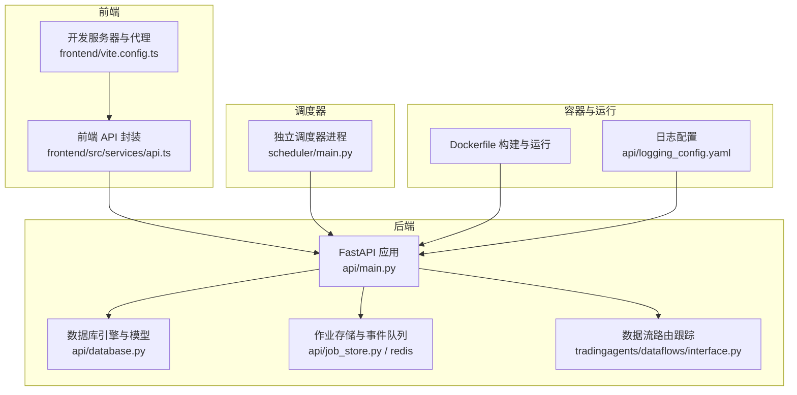
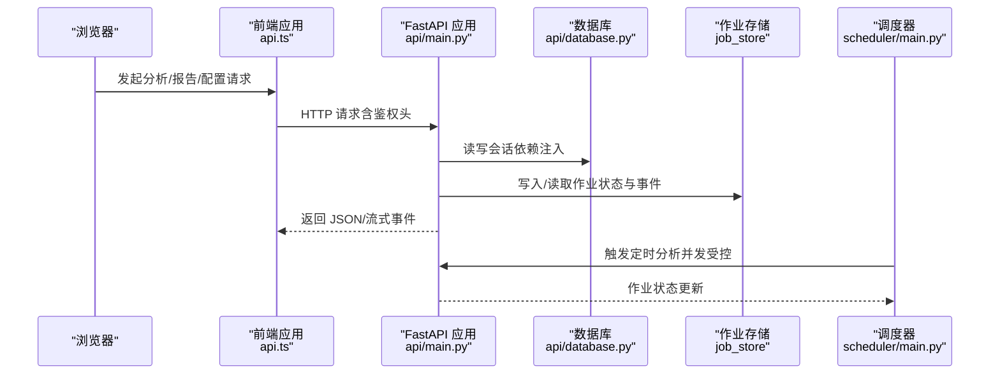
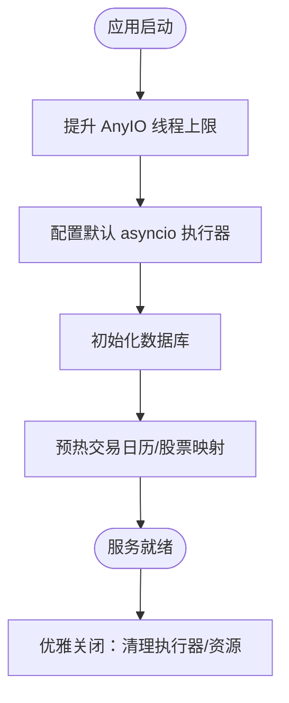
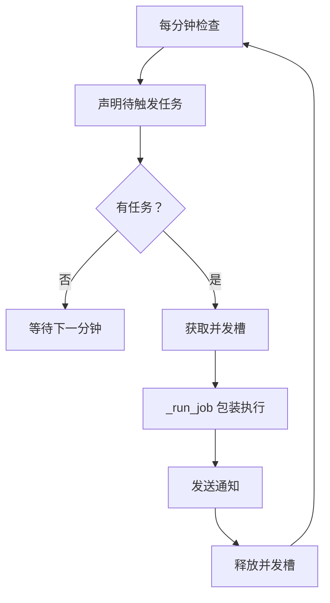
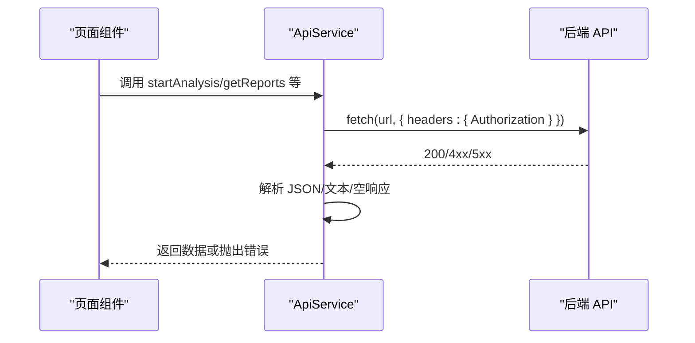
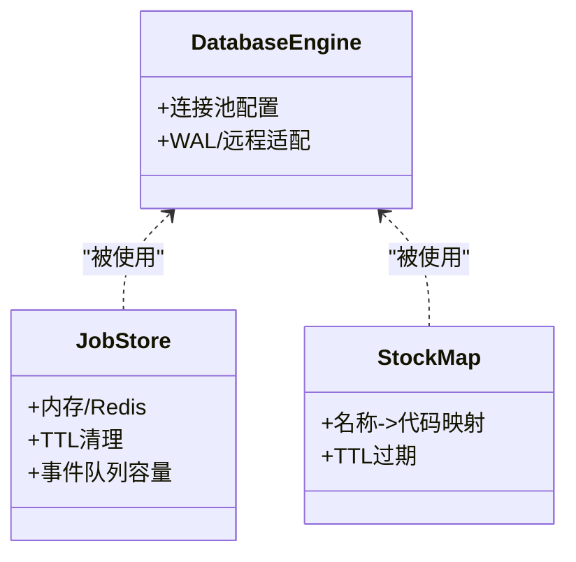
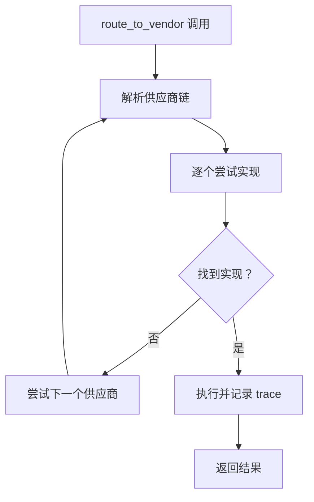
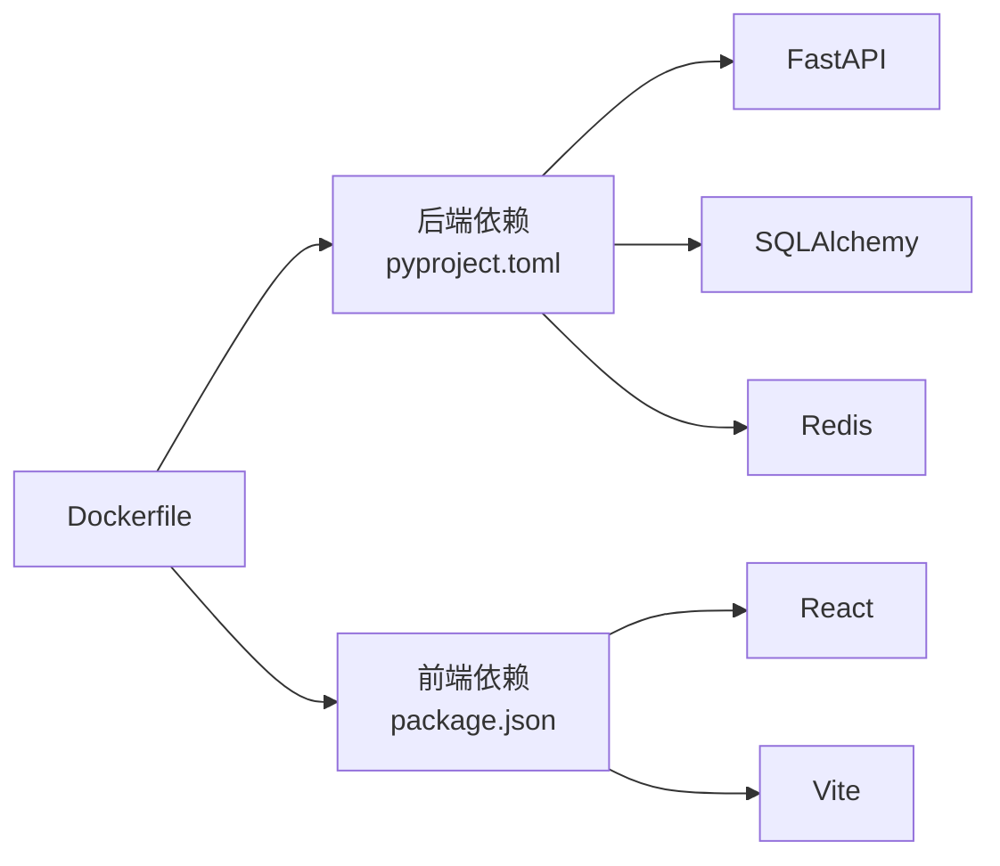

# 调试与性能优化

<cite>
**本文引用的文件**
- [api/main.py](file://api/main.py)
- [api/logging_config.yaml](file://api/logging_config.yaml)
- [api/database.py](file://api/database.py)
- [api/job_store.py](file://api/job_store.py)
- [api/job_store_redis.py](file://api/job_store_redis.py)
- [api/services/board_gold_service.py](file://api/services/board_gold_service.py)
- [scheduler/main.py](file://scheduler/main.py)
- [frontend/src/services/api.ts](file://frontend/src/services/api.ts)
- [frontend/vite.config.ts](file://frontend/vite.config.ts)
- [Dockerfile](file://Dockerfile)
- [pyproject.toml](file://pyproject.toml)
- [tradingagents/dataflows/interface.py](file://tradingagents/dataflows/interface.py)
</cite>

## 目录
1. [简介](#简介)
2. [项目结构](#项目结构)
3. [核心组件](#核心组件)
4. [架构总览](#架构总览)
5. [详细组件分析](#详细组件分析)
6. [依赖关系分析](#依赖关系分析)
7. [性能考量](#性能考量)
8. [故障排查指南](#故障排查指南)
9. [结论](#结论)
10. [附录](#附录)

## 简介
本指南面向 TradingAgents-AShare 的开发者与运维人员，提供从本地开发到生产部署的调试与性能优化实践。内容覆盖：
- 开发调试技巧、日志配置与错误追踪
- 智能体调试、数据流调试与 API 调试方法
- 性能分析工具使用、内存泄漏检测与 CPU 优化
- 前端性能优化、React DevTools 使用与网络请求监控
- 生产环境问题排查、日志分析与监控告警配置
- 数据库查询优化、缓存策略调整与并发性能调优
- 容器化环境调试、Docker 日志查看与资源监控方法

## 项目结构
项目采用前后端分离与多模块协作的组织方式：
- 后端 API 服务：FastAPI 应用，负责分析任务编排、作业状态管理、数据提供与通知
- 调度器：独立进程，按计划触发分析任务，控制并发与重试
- 前端：Vite + React 应用，通过统一 API 封装访问后端能力
- 数据层：SQLAlchemy 模型与连接池配置，支持 SQLite/WAL 与远程数据库
- 工具链：提供数据流路由跟踪、作业存储与事件队列、Redis 支持等

**图表来源**
- [frontend/src/services/api.ts:64-104](file://frontend/src/services/api.ts#L64-L104)
- [frontend/vite.config.ts:48-73](file://frontend/vite.config.ts#L48-L73)
- [api/main.py:298-313](file://api/main.py#L298-L313)
- [api/database.py:11-50](file://api/database.py#L11-L50)
- [api/job_store.py:68-193](file://api/job_store.py#L68-L193)
- [scheduler/main.py:277-333](file://scheduler/main.py#L277-L333)
- [Dockerfile:1-51](file://Dockerfile#L1-L51)
- [api/logging_config.yaml:1-35](file://api/logging_config.yaml#L1-L35)

**章节来源**
- [api/main.py:298-313](file://api/main.py#L298-L313)
- [frontend/vite.config.ts:48-73](file://frontend/vite.config.ts#L48-L73)
- [Dockerfile:1-51](file://Dockerfile#L1-L51)

## 核心组件
- FastAPI 应用与生命周期：初始化数据库、加载缓存、设置线程池与并发限制、暴露分析与报告接口
- 调度器：基于信号量的并发控制、定时触发、失败恢复与通知
- 前端 API 封装：统一请求、鉴权头注入、错误处理与响应解析
- 数据库与连接池：SQLite/WAL 与远程数据库适配、会话管理与迁移
- 作业存储：内存或 Redis 存储，带 TTL 清理与事件队列容量控制
- 数据流路由跟踪：可开启的数据提供者调用跟踪，便于定位数据源与参数

**章节来源**
- [api/main.py:216-279](file://api/main.py#L216-L279)
- [scheduler/main.py:95-123](file://scheduler/main.py#L95-L123)
- [frontend/src/services/api.ts:64-104](file://frontend/src/services/api.ts#L64-L104)
- [api/database.py:11-50](file://api/database.py#L11-L50)
- [api/job_store.py:68-193](file://api/job_store.py#L68-L193)
- [tradingagents/dataflows/interface.py:55-86](file://tradingagents/dataflows/interface.py#L55-L86)

## 架构总览
下图展示从浏览器到后端 API、调度器与数据提供者的典型交互路径。

**图表来源**
- [frontend/src/services/api.ts:64-104](file://frontend/src/services/api.ts#L64-L104)
- [api/main.py:34-44](file://api/main.py#L34-L44)
- [api/database.py:60-66](file://api/database.py#L60-L66)
- [api/job_store.py:68-193](file://api/job_store.py#L68-L193)
- [scheduler/main.py:277-333](file://scheduler/main.py#L277-L333)

## 详细组件分析

### 后端 API 调试与性能
- 生命周期与资源管理
  - 启动时提升 AnyIO 线程限制与默认 asyncio 执行器大小，避免高并发长任务饿死
  - 预热交易日历与股票映射缓存，减少冷启动抖动
  - 关闭时优雅清理执行器与资源
- 并发与超时
  - 默认作业超时与可配置的线程池大小，避免阻塞事件循环
  - 作业状态持久化与异常回写，确保失败可追踪
- CORS 与安全
  - 动态允许来源与正则匹配，生产环境关闭文档端点
  - 强提醒默认密钥风险
- 日志
  - 标准日志格式含时间戳，uvicorn 日志配置可按需调整

**图表来源**
- [api/main.py:216-279](file://api/main.py#L216-L279)

**章节来源**
- [api/main.py:216-279](file://api/main.py#L216-L279)
- [api/logging_config.yaml:1-35](file://api/logging_config.yaml#L1-L35)

### 调度器调试与并发控制
- 并发槽：基于 asyncio.Semaphore 控制每分钟触发的并发数
- 任务回收：启动时扫描“运行中”但无报告的任务，进行恢复或置为 stale
- 通知：分析完成后异步发送邮件与企业微信通知
- 执行器：根据并发需求动态设置默认执行器大小

**图表来源**
- [scheduler/main.py:277-333](file://scheduler/main.py#L277-L333)
- [scheduler/main.py:95-123](file://scheduler/main.py#L95-L123)

**章节来源**
- [scheduler/main.py:95-123](file://scheduler/main.py#L95-L123)
- [scheduler/main.py:277-333](file://scheduler/main.py#L277-L333)

### 前端 API 调试与网络监控
- 统一请求封装：自动拼接 baseUrl、注入 Bearer Token、错误响应解析
- 流式响应：聊天接口返回可读的流式响应，便于实时反馈
- 代理配置：开发环境通过 Vite 代理转发 /v1 与健康检查端点，便于联调
- 错误处理：非 2xx 自动抛出错误，JSON 优先，否则文本兜底

**图表来源**
- [frontend/src/services/api.ts:64-104](file://frontend/src/services/api.ts#L64-L104)
- [frontend/vite.config.ts:48-73](file://frontend/vite.config.ts#L48-L73)

**章节来源**
- [frontend/src/services/api.ts:64-104](file://frontend/src/services/api.ts#L64-L104)
- [frontend/vite.config.ts:48-73](file://frontend/vite.config.ts#L48-L73)

### 数据库与作业存储调试
- 数据库连接池
  - SQLite：启用 WAL（若目录可写），设置池大小与超时，降低锁竞争
  - 远程数据库：更大池与更短超时，适配高并发
- 作业存储
  - 内存或 Redis 后端，内存模式带 TTL 清理与事件队列容量限制
  - 事件队列容量防止 SSE 订阅导致的内存膨胀
- 缓存与映射
  - 股票名称/代码映射带 TTL，避免频繁外部请求
  - 交易日历预加载，规避 V8 不可线程安全问题

**图表来源**
- [api/database.py:11-50](file://api/database.py#L11-L50)
- [api/job_store.py:68-193](file://api/job_store.py#L68-L193)
- [api/main.py:387-440](file://api/main.py#L387-L440)

**章节来源**
- [api/database.py:11-50](file://api/database.py#L11-L50)
- [api/job_store.py:68-193](file://api/job_store.py#L68-L193)
- [api/main.py:387-440](file://api/main.py#L387-L440)

### 数据流路由与跟踪调试
- 可选的 provider 调用跟踪：通过环境变量或配置开关，打印方法名、参数摘要与回退链
- 便于定位数据源选择、参数传递与失败原因

**图表来源**
- [tradingagents/dataflows/interface.py:125-146](file://tradingagents/dataflows/interface.py#L125-L146)

**章节来源**
- [tradingagents/dataflows/interface.py:55-86](file://tradingagents/dataflows/interface.py#L55-L86)
- [tradingagents/dataflows/interface.py:125-146](file://tradingagents/dataflows/interface.py#L125-L146)

### 板块金矿（Board-Gold）子系统调试
- 子进程日志：缓存更新/扫描任务追加时间戳日志，保留最近若干条
- 环境隔离：子进程继承并增强 PYTHONPATH，确保脚本可发现包

**章节来源**
- [api/services/board_gold_service.py:1592-1608](file://api/services/board_gold_service.py#L1592-L1608)

## 依赖关系分析
- 后端依赖：FastAPI、SQLAlchemy、Redis、uvicorn、langchain 系列等
- 前端依赖：React、Vite、Tailwind 等
- 构建与运行：Docker 多阶段构建，uv 运行后端，前端产物静态托管

**图表来源**
- [pyproject.toml:11-38](file://pyproject.toml#L11-L38)
- [Dockerfile:1-51](file://Dockerfile#L1-L51)

**章节来源**
- [pyproject.toml:11-38](file://pyproject.toml#L11-L38)
- [Dockerfile:1-51](file://Dockerfile#L1-L51)

## 性能考量
- 线程池与并发
  - 提升 AnyIO 线程上限与默认 asyncio 执行器大小，避免高并发长任务饥饿
  - 调度器并发通过信号量控制，避免瞬时洪峰
- 数据库
  - SQLite 启用 WAL，合理设置池大小与超时；远程数据库加大池与缩短超时
  - 作业存储事件队列容量限制，防止内存膨胀
- 缓存
  - 股票映射与交易日历预热，减少冷启动开销
- I/O 与流式
  - API 层对 SSE/流式响应的事件队列容量限制，避免订阅端落后导致内存增长
- 前端
  - 使用 React DevTools 检查渲染次数与重渲染热点；Vite 代理减少跨域与中间层延迟
- 容器
  - Dockerfile 中设置版本号与缓冲输出，便于日志采集与版本追踪

**章节来源**
- [api/main.py:216-279](file://api/main.py#L216-L279)
- [scheduler/main.py:382-429](file://scheduler/main.py#L382-L429)
- [api/database.py:11-50](file://api/database.py#L11-L50)
- [api/job_store.py:19-29](file://api/job_store.py#L19-L29)
- [frontend/vite.config.ts:48-73](file://frontend/vite.config.ts#L48-L73)
- [Dockerfile:40-49](file://Dockerfile#L40-L49)

## 故障排查指南
- 日志与错误追踪
  - 后端标准日志含时间戳，uvicorn 日志配置可按需调整
  - API 层捕获异常并写入作业状态与数据库失败记录，附带堆栈
  - 调度器记录失败与恢复过程，便于定位任务卡住或重复执行
- 前端网络
  - 统一错误处理：非 2xx 抛错，JSON 优先，文本兜底；结合浏览器网络面板定位
  - 开发代理：确认 /v1 与健康检查端点已正确转发
- 数据库
  - SQLite：确认 WAL 是否启用；检查池大小与超时；关注锁等待
  - 远程数据库：核对连接串、池大小与超时
- 作业存储
  - 内存模式：检查 TTL 与事件队列容量是否过小导致消息丢失
  - Redis 模式：确认连接与发布订阅通道
- 数据流
  - 开启 provider 路由跟踪，查看方法、参数与回退链
- 板块金矿
  - 查看任务日志尾部，确认子进程环境变量与 PYTHONPATH 设置

**章节来源**
- [api/logging_config.yaml:1-35](file://api/logging_config.yaml#L1-L35)
- [api/main.py:2295-2311](file://api/main.py#L2295-L2311)
- [scheduler/main.py:243-248](file://scheduler/main.py#L243-L248)
- [frontend/src/services/api.ts:77-104](file://frontend/src/services/api.ts#L77-L104)
- [frontend/vite.config.ts:48-73](file://frontend/vite.config.ts#L48-L73)
- [api/database.py:11-50](file://api/database.py#L11-L50)
- [api/job_store.py:19-29](file://api/job_store.py#L19-L29)
- [tradingagents/dataflows/interface.py:55-86](file://tradingagents/dataflows/interface.py#L55-L86)
- [api/services/board_gold_service.py:1592-1608](file://api/services/board_gold_service.py#L1592-L1608)

## 结论
通过规范的日志与错误追踪、合理的并发与缓存策略、完善的前端网络与代理配置，以及容器化的可观测性，TradingAgents-AShare 可在开发与生产环境中保持稳定与高性能。建议在上线前完成全链路压测与回归测试，并建立持续监控与告警机制。

## 附录
- 常用调试环境变量
  - LOG_LEVEL：日志级别
  - TA_APP_SECRET_KEY：生产密钥（务必设置）
  - ANYIO_THREAD_LIMIT / ASYNCIO_DEFAULT_EXECUTOR_WORKERS：线程与执行器规模
  - TA_JOB_TIMEOUT：作业超时秒数
  - INMEMORY_JOB_TTL：内存作业 TTL
  - TA_TRACE：开启数据流路由跟踪
- 前端开发提示
  - 使用 React DevTools 检查组件树与渲染次数
  - 利用 Vite 代理快速联调后端接口
- 容器与日志
  - Python 输出缓冲关闭，便于实时日志采集
  - Docker 构建注入版本号，便于追踪

**章节来源**
- [api/main.py:223-249](file://api/main.py#L223-L249)
- [scheduler/main.py:390-403](file://scheduler/main.py#L390-L403)
- [api/job_store.py:27-29](file://api/job_store.py#L27-L29)
- [tradingagents/dataflows/interface.py:55-61](file://tradingagents/dataflows/interface.py#L55-L61)
- [frontend/vite.config.ts:48-73](file://frontend/vite.config.ts#L48-L73)
- [Dockerfile:44-49](file://Dockerfile#L44-L49)