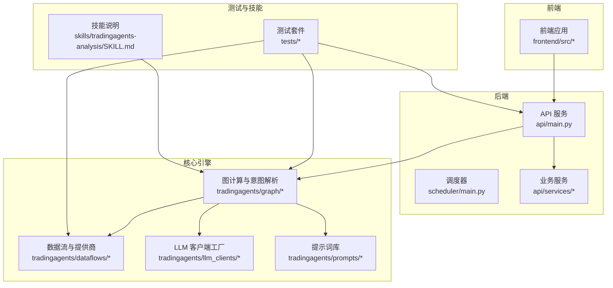
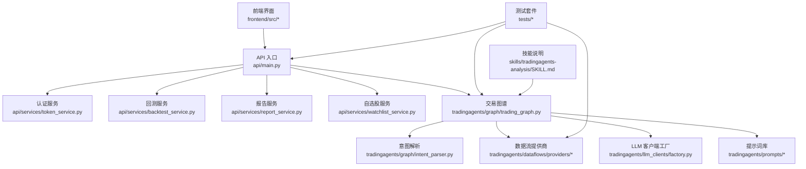
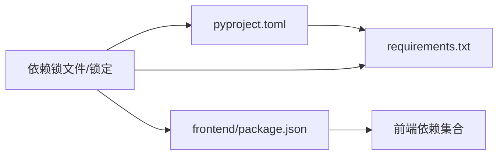

# 贡献指南

<cite>
**本文档引用的文件**
- [README.md](file://README.md)
- [pyproject.toml](file://pyproject.toml)
- [requirements.txt](file://requirements.txt)
- [.github/FUNDING.yml](file://.github/FUNDING.yml)
- [.github/dependabot.yml](file://.github/dependabot.yml)
- [frontend/README.md](file://frontend/README.md)
- [frontend/package.json](file://frontend/package.json)
- [frontend/eslint.config.js](file://frontend/eslint.config.js)
- [frontend/tailwind.config.js](file://frontend/tailwind.config.js)
- [frontend/vite.config.ts](file://frontend/vite.config.ts)
- [tests/test_api_smoke.py](file://tests/test_api_smoke.py)
- [tests/test_board_gold_api.py](file://tests/test_board_gold_api.py)
- [tests/test_board_gold_service.py](file://tests/test_board_gold_service.py)
- [tests/test_email_report_service.py](file://tests/test_email_report_service.py)
- [tests/test_job_store.py](file://tests/test_job_store.py)
- [tests/test_job_store_redis.py](file://tests/test_job_store_redis.py)
- [tests/test_portfolio_import.py](file://tests/test_portfolio_import.py)
- [tests/test_scheduled_queue.py](file://tests/test_scheduled_queue.py)
- [tests/test_smart_money_analyst.py](file://tests/test_smart_money_analyst.py)
- [tests/test_stock_map_fast_path.py](file://tests/test_stock_map_fast_path.py)
- [tests/test_trading_graph_multi_horizon.py](file://tests/test_trading_graph_multi_horizon.py)
- [tests/test_vlm_position_parser.py](file://tests/test_vlm_position_parser.py)
- [tests/test_watchlist_scheduled.py](file://tests/test_watchlist_scheduled.py)
- [tests/test_wecom_notification_service.py](file://tests/test_wecom_notification_service.py)
- [tradingagents/graph/intent_parser.py](file://tradingagents/graph/intent_parser.py)
- [tradingagents/graph/trading_graph.py](file://tradingagents/graph/trading_graph.py)
- [tradingagents/dataflows/providers/base.py](file://tradingagents/dataflows/providers/base.py)
- [tradingagents/dataflows/providers/registry.py](file://tradingagents/dataflows/providers/registry.py)
- [tradingagents/llm_clients/factory.py](file://tradingagents/llm_clients/factory.py)
- [tradingagents/prompts/catalog.py](file://tradingagents/prompts/catalog.py)
- [tradingagents/prompts/en.py](file://tradingagents/prompts/en.py)
- [tradingagents/prompts/zh.py](file://tradingagents/prompts/zh.py)
- [api/main.py](file://api/main.py)
- [api/services/backtest_service.py](file://api/services/backtest_service.py)
- [api/services/report_service.py](file://api/services/report_service.py)
- [api/services/watchlist_service.py](file://api/services/watchlist_service.py)
- [scheduler/main.py](file://scheduler/main.py)
- [skills/tradingagents-analysis/SKILL.md](file://skills/tradingagents-analysis/SKILL.md)
</cite>

## 目录
1. [简介](#简介)
2. [项目结构](#项目结构)
3. [核心组件](#核心组件)
4. [架构总览](#架构总览)
5. [详细组件分析](#详细组件分析)
6. [依赖分析](#依赖分析)
7. [性能考虑](#性能考虑)
8. [故障排除指南](#故障排除指南)
9. [结论](#结论)
10. [附录](#附录)

## 简介
本贡献指南面向希望参与 TradingAgents-AShare 项目开发的贡献者，涵盖从 Issue 报告到 Pull Request 提交的完整流程，以及代码与文档贡献、分支策略、合并要求、测试与质量保障、发布与版本管理等实践规范。同时提供新贡献者入门路径、导师机制建议、沟通渠道与社区资源指引。

## 项目结构
项目采用多模块组织方式：后端服务（Python）位于根目录及 api/scheduler 目录；前端（React + TypeScript）位于 frontend 目录；核心交易智能体与数据流在 tradingagents 子包中；测试用例集中于 tests 目录；技能与提示词位于 skills 与 prompts 目录；GitHub 工作流与依赖管理配置位于 .github 目录。

**图表来源**
- [api/main.py:1-200](file://api/main.py#L1-L200)
- [scheduler/main.py:1-200](file://scheduler/main.py#L1-L200)
- [tradingagents/graph/trading_graph.py:1-200](file://tradingagents/graph/trading_graph.py#L1-L200)
- [tradingagents/dataflows/providers/base.py:1-200](file://tradingagents/dataflows/providers/base.py#L1-L200)
- [tradingagents/llm_clients/factory.py:1-200](file://tradingagents/llm_clients/factory.py#L1-L200)
- [tradingagents/prompts/catalog.py:1-200](file://tradingagents/prompts/catalog.py#L1-L200)
- [frontend/src/App.tsx:1-200](file://frontend/src/App.tsx#L1-L200)
- [tests/test_api_smoke.py:1-200](file://tests/test_api_smoke.py#L1-L200)
- [skills/tradingagents-analysis/SKILL.md:1-200](file://skills/tradingagents-analysis/SKILL.md#L1-L200)

**章节来源**
- [README.md:1-200](file://README.md#L1-L200)
- [frontend/README.md:1-200](file://frontend/README.md#L1-L200)

## 核心组件
- 后端 API 服务：提供认证、回测、看板、报告、定时任务等接口，统一由入口文件启动并路由至各业务服务。
- 调度器：负责周期性任务与队列处理，确保后台作业稳定运行。
- 图计算与意图解析：将用户输入转化为可执行的交易图谱与决策逻辑。
- 数据流与提供商：抽象统一的数据源接入层，支持多提供商注册与切换。
- LLM 客户端工厂：按需创建不同供应商的 LLM 客户端，便于扩展与替换。
- 前端应用：基于 React + TypeScript 的交互界面，连接后端 API 并展示分析结果。
- 测试套件：覆盖 API、数据流、服务与通知等关键路径，保证质量与回归稳定性。
- 技能与提示词：定义智能体能力边界与语言模板，支撑多语言支持与本地化。

**章节来源**
- [api/main.py:1-200](file://api/main.py#L1-L200)
- [scheduler/main.py:1-200](file://scheduler/main.py#L1-L200)
- [tradingagents/graph/intent_parser.py:1-200](file://tradingagents/graph/intent_parser.py#L1-L200)
- [tradingagents/graph/trading_graph.py:1-200](file://tradingagents/graph/trading_graph.py#L1-L200)
- [tradingagents/dataflows/providers/base.py:1-200](file://tradingagents/dataflows/providers/base.py#L1-L200)
- [tradingagents/dataflows/providers/registry.py:1-200](file://tradingagents/dataflows/providers/registry.py#L1-L200)
- [tradingagents/llm_clients/factory.py:1-200](file://tradingagents/llm_clients/factory.py#L1-L200)
- [tradingagents/prompts/catalog.py:1-200](file://tradingagents/prompts/catalog.py#L1-L200)
- [tradingagents/prompts/en.py:1-200](file://tradingagents/prompts/en.py#L1-L200)
- [tradingagents/prompts/zh.py:1-200](file://tradingagents/prompts/zh.py#L1-L200)
- [frontend/src/App.tsx:1-200](file://frontend/src/App.tsx#L1-L200)
- [tests/test_api_smoke.py:1-200](file://tests/test_api_smoke.py#L1-L200)

## 架构总览
下图展示了从前端到后端、再到图计算与数据流的整体交互关系，以及测试与技能对整体质量与能力的支撑。

**图表来源**
- [api/main.py:1-200](file://api/main.py#L1-L200)
- [api/services/backtest_service.py:1-200](file://api/services/backtest_service.py#L1-L200)
- [api/services/report_service.py:1-200](file://api/services/report_service.py#L1-L200)
- [api/services/watchlist_service.py:1-200](file://api/services/watchlist_service.py#L1-L200)
- [tradingagents/graph/trading_graph.py:1-200](file://tradingagents/graph/trading_graph.py#L1-L200)
- [tradingagents/graph/intent_parser.py:1-200](file://tradingagents/graph/intent_parser.py#L1-L200)
- [tradingagents/dataflows/providers/base.py:1-200](file://tradingagents/dataflows/providers/base.py#L1-L200)
- [tradingagents/llm_clients/factory.py:1-200](file://tradingagents/llm_clients/factory.py#L1-L200)
- [tradingagents/prompts/catalog.py:1-200](file://tradingagents/prompts/catalog.py#L1-L200)
- [skills/tradingagents-analysis/SKILL.md:1-200](file://skills/tradingagents-analysis/SKILL.md#L1-L200)
- [tests/test_api_smoke.py:1-200](file://tests/test_api_smoke.py#L1-L200)

## 详细组件分析

### Issue 报告规范
- 选择合适的标签：缺陷（bug）、功能请求（enhancement）、文档（documentation）、性能（performance）、安全（security）等。
- 提供最小复现步骤：清晰描述操作步骤、期望结果与实际结果。
- 环境信息：操作系统、Python 版本、前端 Node 版本、浏览器版本、依赖版本（可通过 pip freeze 或 npm list 获取）。
- 截图或日志：必要时附带错误截图或后端/前端日志片段。
- 关联讨论：如已有相关讨论或 PR，请在 Issue 中引用。

### 功能请求流程
- 在提交前搜索现有 Issue/PR，避免重复。
- 新建 Issue 描述需求背景、目标、验收标准与优先级。
- 维护者评估后会分配标签与里程碑，进入计划阶段。
- 开发者可在 Issue 下方认领或讨论实现方案。

### Bug 报告模板
- 标题：简洁描述问题
- 复现步骤：按序列出
- 预期行为：明确说明
- 实际行为：真实记录
- 环境信息：系统、Python/Node 版本、依赖版本
- 日志与截图：附上关键日志与截图
- 附加信息：是否可复现、影响范围、临时规避方法

### 代码贡献流程
- 分支策略
  - 主分支：保持稳定，仅接受通过 CI 的 PR 合并。
  - 开发分支：develop，用于集成特性与修复。
  - 功能分支：feature/xxx，修复分支：fix/xxx，文档分支：docs/xxx。
- 提交规范
  - 提交信息格式：type(scope): subject
  - 类型包括：feat、fix、docs、style、refactor、perf、test、build、ci、chore、revert
  - scope 可选，subject 清晰描述改动内容
- 代码风格
  - Python：遵循项目中已有的风格约定（例如导入顺序、缩进、命名），尽量减少不必要的重构。
  - 前端：ESLint 与 Prettier 规则已在配置文件中定义，提交前请运行 lint 与格式化检查。
  - 提示词：新增提示词请同步更新 catalog 与对应语言文件，并在技能说明中补充说明。
- 单元测试与集成测试
  - 新增或修改功能必须配套测试用例，覆盖率应逐步提升。
  - 运行测试命令：pytest tests/ 或 npm test（前端）。
  - CI 将自动运行测试与静态检查，确保合并质量。
- 文档更新
  - 修改公共 API、配置项或行为变更需同步更新 README、技能说明与提示词文档。
  - 前端新增页面或组件需更新前端 README 与相关文档。

### Pull Request 要求
- 必须关联一个 Issue 或功能请求。
- 提供清晰的 PR 描述：改动动机、具体实现、测试策略、风险与回滚预案。
- 通过所有 CI 检查（测试、lint、类型检查等）。
- 至少一名维护者审查并批准。
- 合并前确保分支无冲突，必要时进行 rebase 或 squash。

### 分支策略与合并要求
- 保护分支：main 与 develop 需要保护，禁止直接推送。
- 合并方式：优先使用 squash merge 以保持提交历史整洁；复杂变更可使用 rebase merge。
- 合并前置条件：CI 通过、审查通过、无未解决评论、满足测试与文档要求。

### 文档贡献方式
- README 更新：项目概览、安装、快速开始、贡献流程等。
- 技能说明：skills/tradingagents-analysis/SKILL.md，描述智能体能力边界与使用方法。
- 提示词文档：tradingagents/prompts/*，按语言分文件维护，catalog 统一索引。
- 前端文档：frontend/README.md，说明前端构建、运行与贡献流程。
- 变更日志：建议在 PR 中同步更新 CHANGELOG 或在 release 分支汇总。

### 翻译贡献
- 提示词翻译：在 prompts/zh.py 与 prompts/en.py 中同步新增条目，确保键一致。
- 技能说明翻译：在技能说明文件中添加对应语言版本，保持术语一致。
- 文档翻译：README 与前端 README 的翻译需保持语义一致与上下文连贯。

### 社区参与规则
- 遵循行为准则：尊重、包容、专业、协作。
- 沟通渠道：Issue/PR 讨论、邮件/即时通讯群组（如有）。
- 导师制度：建议资深贡献者为新贡献者提供指导，帮助其理解架构与流程。

**章节来源**
- [frontend/eslint.config.js:1-200](file://frontend/eslint.config.js#L1-L200)
- [frontend/tailwind.config.js:1-200](file://frontend/tailwind.config.js#L1-L200)
- [frontend/vite.config.ts:1-200](file://frontend/vite.config.ts#L1-L200)
- [tests/test_api_smoke.py:1-200](file://tests/test_api_smoke.py#L1-L200)
- [tests/test_board_gold_api.py:1-200](file://tests/test_board_gold_api.py#L1-L200)
- [tests/test_board_gold_service.py:1-200](file://tests/test_board_gold_service.py#L1-L200)
- [tests/test_email_report_service.py:1-200](file://tests/test_email_report_service.py#L1-L200)
- [tests/test_job_store.py:1-200](file://tests/test_job_store.py#L1-L200)
- [tests/test_job_store_redis.py:1-200](file://tests/test_job_store_redis.py#L1-L200)
- [tests/test_portfolio_import.py:1-200](file://tests/test_portfolio_import.py#L1-L200)
- [tests/test_scheduled_queue.py:1-200](file://tests/test_scheduled_queue.py#L1-L200)
- [tests/test_smart_money_analyst.py:1-200](file://tests/test_smart_money_analyst.py#L1-L200)
- [tests/test_stock_map_fast_path.py:1-200](file://tests/test_stock_map_fast_path.py#L1-L200)
- [tests/test_trading_graph_multi_horizon.py:1-200](file://tests/test_trading_graph_multi_horizon.py#L1-L200)
- [tests/test_vlm_position_parser.py:1-200](file://tests/test_vlm_position_parser.py#L1-L200)
- [tests/test_watchlist_scheduled.py:1-200](file://tests/test_watchlist_scheduled.py#L1-L200)
- [tests/test_wecom_notification_service.py:1-200](file://tests/test_wecom_notification_service.py#L1-L200)
- [skills/tradingagents-analysis/SKILL.md:1-200](file://skills/tradingagents-analysis/SKILL.md#L1-L200)
- [tradingagents/prompts/catalog.py:1-200](file://tradingagents/prompts/catalog.py#L1-L200)
- [tradingagents/prompts/en.py:1-200](file://tradingagents/prompts/en.py#L1-L200)
- [tradingagents/prompts/zh.py:1-200](file://tradingagents/prompts/zh.py#L1-L200)

## 依赖分析
- 后端依赖：通过 pyproject.toml 与 requirements.txt 管理，建议使用 pip-tools 或 Poetry 维护锁定文件。
- 前端依赖：package.json 管理，Tailwind CSS、Vite、React 生态为主，ESLint 与 Tailwind 配置约束样式与规范。
- 自动化依赖：GitHub Dependabot 用于依赖版本升级提醒与安全补丁。

**图表来源**
- [pyproject.toml:1-200](file://pyproject.toml#L1-L200)
- [requirements.txt:1-200](file://requirements.txt#L1-L200)
- [frontend/package.json:1-200](file://frontend/package.json#L1-L200)

**章节来源**
- [pyproject.toml:1-200](file://pyproject.toml#L1-L200)
- [requirements.txt:1-200](file://requirements.txt#L1-L200)
- [frontend/package.json:1-200](file://frontend/package.json#L1-L200)
- [.github/dependabot.yml:1-200](file://.github/dependabot.yml#L1-L200)

## 性能考虑
- 后端 API：合理设置超时与重试策略，避免阻塞请求；对耗时操作使用异步或队列。
- 前端：按需加载与懒加载组件，减少首屏体积；Tailwind 配置避免生成冗余样式类。
- 数据流：提供商注册与切换应避免频繁初始化；缓存热点数据与中间结果。
- 测试：缩短测试时间，优先使用单元测试与小范围集成测试。

## 故障排除指南
- 本地环境问题
  - 后端：确认 Python 版本与虚拟环境，安装依赖后运行 API 与调度器。
  - 前端：确认 Node 版本，安装依赖后运行开发服务器。
- 测试失败
  - 查看测试输出与日志，定位失败用例；补充或修正测试。
  - 对比本地与 CI 环境差异（Python/Node 版本、依赖版本）。
- API 异常
  - 检查认证与权限配置；查看后端日志与数据库连接状态。
  - 使用最小复现步骤验证问题是否可复现。
- 依赖冲突
  - 使用锁定文件与依赖管理工具（pip-tools/ Poetry/npm）统一版本。
  - 通过 Dependabot 提示及时升级安全补丁。

**章节来源**
- [api/main.py:1-200](file://api/main.py#L1-L200)
- [scheduler/main.py:1-200](file://scheduler/main.py#L1-L200)
- [frontend/vite.config.ts:1-200](file://frontend/vite.config.ts#L1-L200)
- [tests/test_api_smoke.py:1-200](file://tests/test_api_smoke.py#L1-L200)

## 结论
本贡献指南提供了从 Issue 到 PR、从代码到文档、从测试到发布的全流程规范。建议新贡献者先从文档与测试入手，逐步深入核心模块与前后端交互，积极参与社区讨论与审查流程，共同推动项目高质量演进。

## 附录

### 新贡献者入门指南
- 环境准备：安装 Python 与 Node，克隆仓库，安装后端与前端依赖。
- 快速运行：启动后端 API 与调度器，启动前端开发服务器，访问本地界面。
- 从文档与测试开始：阅读 README、frontend/README 与测试用例，理解项目结构与质量要求。
- 选择合适 Issue：从 good first issue 或 help wanted 标签开始，认领并提交 PR。

### 导师制度与学习资源
- 导师职责：帮助新贡献者理解架构、分支策略、测试与审查流程。
- 学习资源：README、技能说明、提示词文档、测试用例、API 设计文档。

### 沟通渠道与社区资源
- GitHub Issues/PR：主要沟通与协作渠道。
- 赞助与支持：FUNDING.yml 提供赞助与资助信息。

**章节来源**
- [README.md:1-200](file://README.md#L1-L200)
- [frontend/README.md:1-200](file://frontend/README.md#L1-L200)
- [.github/FUNDING.yml:1-200](file://.github/FUNDING.yml#L1-L200)

### 发布流程与版本管理
- 版本号：建议遵循语义化版本（主.次.修订），在发布前更新版本号与变更日志。
- 发布分支：release/* 用于发布前的最终验证与文档整理。
- 变更日志：在 PR 中同步记录变更摘要，发布时汇总为正式变更日志。
- 依赖更新：通过 Dependabot 自动化安全补丁与版本升级，必要时手动审查。

**章节来源**
- [.github/dependabot.yml:1-200](file://.github/dependabot.yml#L1-L200)