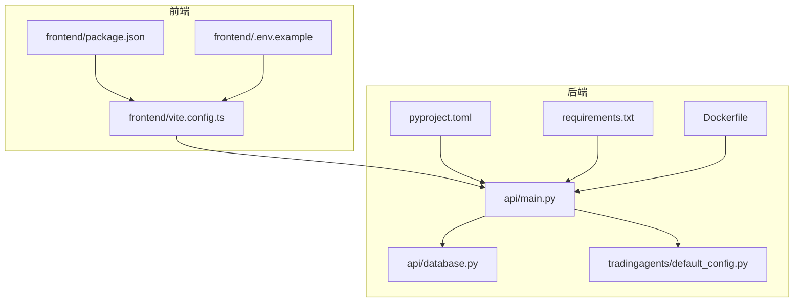
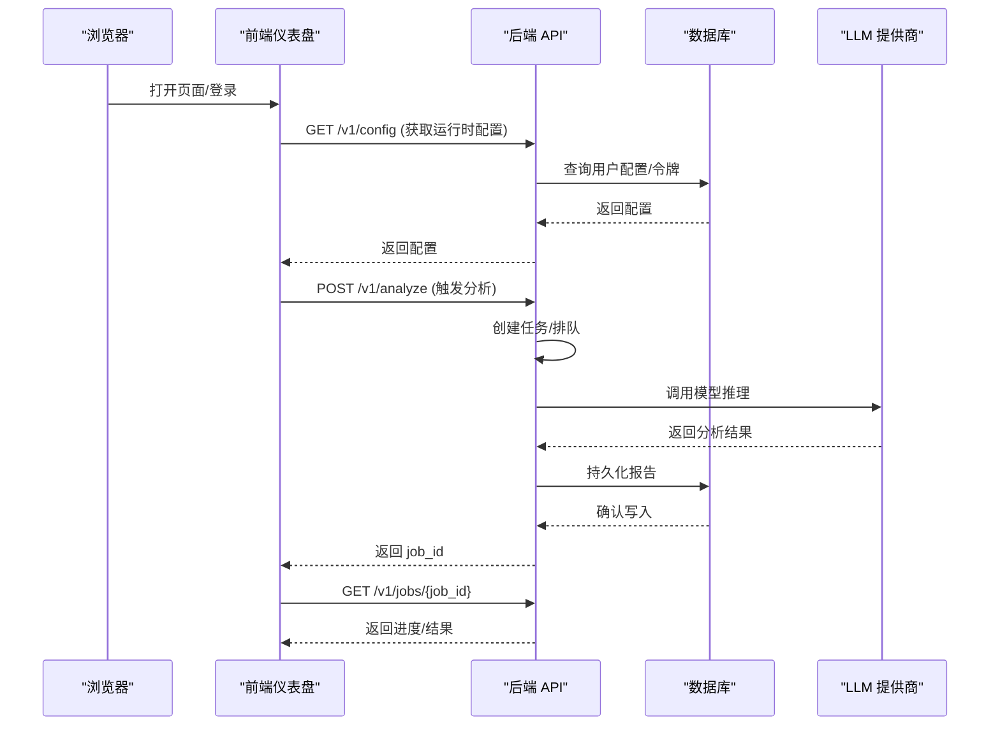
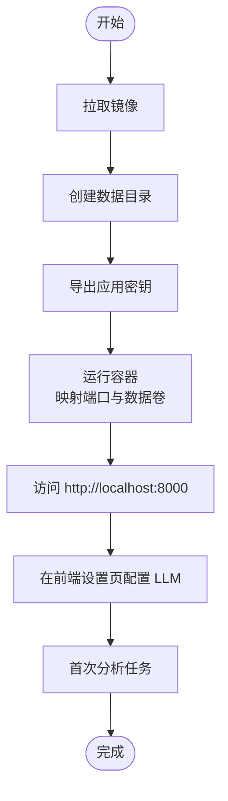
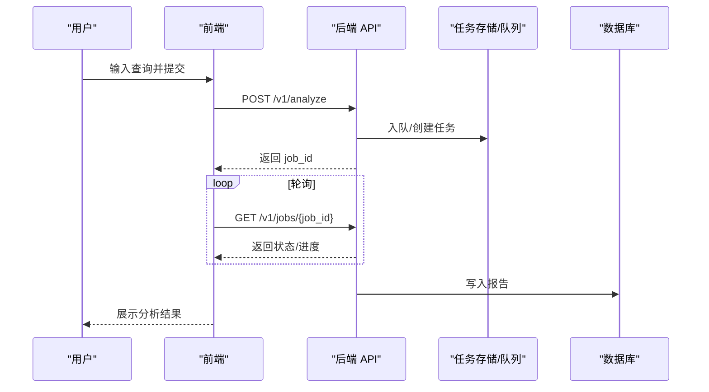
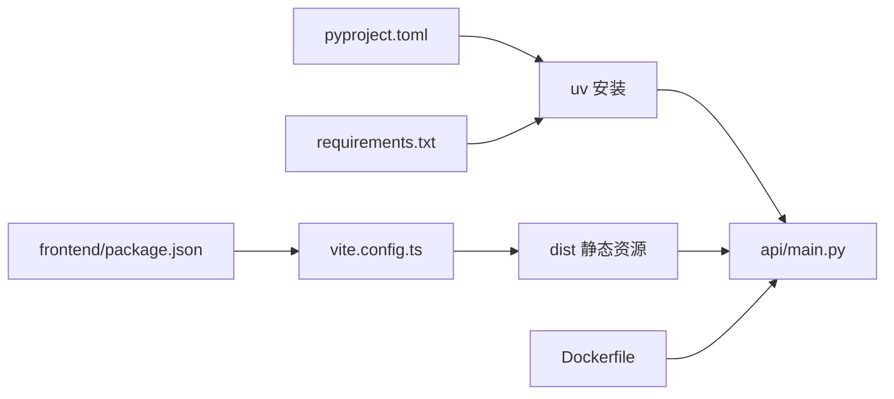

# 快速开始

<cite>
**本文引用的文件**
- [README.md](file://README.md)
- [Dockerfile](file://Dockerfile)
- [pyproject.toml](file://pyproject.toml)
- [requirements.txt](file://requirements.txt)
- [api/main.py](file://api/main.py)
- [api/database.py](file://api/database.py)
- [tradingagents/default_config.py](file://tradingagents/default_config.py)
- [frontend/package.json](file://frontend/package.json)
- [frontend/.env.example](file://frontend/.env.example)
- [frontend/vite.config.ts](file://frontend/vite.config.ts)
- [frontend/src/pages/Settings.tsx](file://frontend/src/pages/Settings.tsx)
- [tests/test_job_timeout_config.py](file://tests/test_job_timeout_config.py)
- [tests/test_email_report_service.py](file://tests/test_email_report_service.py)
</cite>

## 目录
1. [简介](#简介)
2. [项目结构](#项目结构)
3. [核心组件](#核心组件)
4. [架构总览](#架构总览)
5. [详细组件分析](#详细组件分析)
6. [依赖关系分析](#依赖关系分析)
7. [性能注意事项](#性能注意事项)
8. [故障排除指南](#故障排除指南)
9. [结论](#结论)
10. [附录](#附录)

## 简介
本指南面向首次接触 TradingAgents-AShare 的用户，帮助你在约 30 分钟内完成环境搭建、容器化部署或本地开发环境准备、数据库初始化、LLM API 密钥配置，并运行第一个股票分析任务，从启动到查看分析结果。

系统提供两种快速上手路径：
- Docker 一键部署（推荐）
- 源码安装（本地开发）

同时提供完整的环境变量说明、配置文件模板与安装验证步骤，以及常见问题解决方案。

## 项目结构
项目采用前后端分离架构：
- 后端：FastAPI 应用，提供 REST API、任务调度、数据库与安全机制
- 前端：React + Vite 构建的仪表盘，提供聊天式交互、可视化与配置界面
- 数据与模型：通过 Trading Graph 与多智能体协同完成分析，数据来源可配置
- 部署：Docker 多阶段构建，后端使用 uv 运行，前端静态资源内嵌

图表来源
- [frontend/package.json:1-47](file://frontend/package.json#L1-L47)
- [frontend/.env.example:1-9](file://frontend/.env.example#L1-L9)
- [frontend/vite.config.ts:27-74](file://frontend/vite.config.ts#L27-L74)
- [api/main.py:1-120](file://api/main.py#L1-L120)
- [api/database.py:1-67](file://api/database.py#L1-L67)
- [tradingagents/default_config.py:1-43](file://tradingagents/default_config.py#L1-L43)
- [pyproject.toml:1-52](file://pyproject.toml#L1-L52)
- [requirements.txt:1-24](file://requirements.txt#L1-L24)
- [Dockerfile:1-51](file://Dockerfile#L1-L51)

章节来源
- [README.md:96-151](file://README.md#L96-L151)
- [Dockerfile:1-51](file://Dockerfile#L1-L51)
- [frontend/package.json:1-47](file://frontend/package.json#L1-L47)
- [frontend/.env.example:1-9](file://frontend/.env.example#L1-L9)
- [frontend/vite.config.ts:27-74](file://frontend/vite.config.ts#L27-L74)
- [api/main.py:1-120](file://api/main.py#L1-L120)
- [api/database.py:1-67](file://api/database.py#L1-L67)
- [tradingagents/default_config.py:1-43](file://tradingagents/default_config.py#L1-L43)
- [pyproject.toml:1-52](file://pyproject.toml#L1-L52)
- [requirements.txt:1-24](file://requirements.txt#L1-L24)

## 核心组件
- 后端 API 服务：提供分析触发、状态查询、报告检索、定时任务、配置热更等接口
- 数据库：默认 SQLite，支持 WAL 模式优化；可扩展至 PostgreSQL/MySQL
- 配置系统：默认配置 + 环境变量 + 用户配置 + 请求级覆盖的分层合并
- LLM 客户端：OpenAI、Anthropic、Google Gemini 等多厂商支持
- 前端仪表盘：聊天式交互、可视化面板、设置与配置管理

章节来源
- [api/main.py:298-351](file://api/main.py#L298-L351)
- [api/database.py:11-57](file://api/database.py#L11-L57)
- [tradingagents/default_config.py:3-42](file://tradingagents/default_config.py#L3-L42)
- [frontend/src/pages/Settings.tsx:421-439](file://frontend/src/pages/Settings.tsx#L421-L439)

## 架构总览
下图展示了从浏览器到后端 API、数据库与 LLM 的典型调用链路。

图表来源
- [api/main.py:599-670](file://api/main.py#L599-L670)
- [api/main.py:3729-3757](file://api/main.py#L3729-L3757)
- [api/database.py:242-318](file://api/database.py#L242-L318)

## 详细组件分析

### Docker 一键部署（推荐）
- 拉取镜像并创建数据卷目录
- 设置应用密钥（生产必须）
- 使用 SQLite 存储数据库文件
- 暴露 8000 端口，访问 http://localhost:8000
- 支持通过环境变量配置任务超时、CORS、并发等

图表来源
- [README.md:98-126](file://README.md#L98-L126)
- [Dockerfile:44-51](file://Dockerfile#L44-L51)

章节来源
- [README.md:98-126](file://README.md#L98-L126)
- [Dockerfile:44-51](file://Dockerfile#L44-L51)

### 源码安装（本地开发）
- 后端：使用 uv 同步依赖，启动 Uvicorn 服务
- 前端：安装依赖并构建静态资源
- 复制 .env.example 到 .env 并按需修改
- 启动后端服务，访问 http://localhost:8000

章节来源
- [README.md:127-151](file://README.md#L127-L151)
- [frontend/package.json:6-11](file://frontend/package.json#L6-L11)

### 数据库设置
- 默认使用 SQLite（文件名可配置）
- 支持 WAL 模式（SQLite）提升并发
- 初始化时自动创建表并补全字段（向后兼容）
- 支持 PostgreSQL/MySQL（调整连接池参数）

章节来源
- [api/database.py:11-57](file://api/database.py#L11-L57)
- [api/database.py:91-143](file://api/database.py#L91-L143)

### LLM API 密钥配置
- 建议在前端“设置”页面配置模型厂商、API Key 与模型名称
- 后端允许运行时覆盖部分配置（如模型、轮次等），但敏感字段（如密钥）不在允许列表
- 可通过“模型 warmup”接口验证连通性与鉴权

章节来源
- [README.md:121-121](file://README.md#L121-L121)
- [api/main.py:994-1017](file://api/main.py#L994-L1017)
- [api/main.py:3729-3757](file://api/main.py#L3729-L3757)
- [frontend/src/pages/Settings.tsx:421-439](file://frontend/src/pages/Settings.tsx#L421-L439)

### 配置文件模板与环境变量
- 前端环境变量模板：VITE_API_URL（跨端口开发时指向后端）
- 后端环境变量（常用）：
  - DATABASE_URL：数据库连接串（默认 SQLite）
  - TA_APP_SECRET_KEY：应用密钥（生产必须设置）
  - TA_JOB_TIMEOUT：任务超时秒数（默认 1800）
  - CORS_ALLOW_ORIGINS / CORS_ALLOW_ORIGIN_REGEX：CORS 白名单
  - ANYIO_THREAD_LIMIT / ASYNCIO_DEFAULT_EXECUTOR_WORKERS：并发线程上限
  - LOG_LEVEL：日志级别
  - ALLOW_SERVER_LLM_FALLBACK：是否允许服务端回退
  - TA_BOARD_GOLD_DATA_DIR：黄金信号缓存目录（可选）

章节来源
- [frontend/.env.example:1-9](file://frontend/.env.example#L1-L9)
- [api/main.py:281-289](file://api/main.py#L281-L289)
- [api/main.py:315-336](file://api/main.py#L315-L336)
- [api/main.py:349-351](file://api/main.py#L349-L351)
- [api/main.py:257-264](file://api/main.py#L257-L264)
- [README.md:125-125](file://README.md#L125-L125)

### 安装验证步骤
- 启动后端服务（Docker 或 uv run）
- 访问 http://localhost:8000
- 登录后在“设置”页配置 LLM（厂商、API Key、模型）
- 发送一条分析请求（例如“分析 600519.SH 短期趋势”）
- 通过“任务状态”查看进度，完成后在“报告”页面查看结果

章节来源
- [README.md:143-151](file://README.md#L143-L151)
- [api/main.py:599-670](file://api/main.py#L599-L670)

### 第一个股票分析示例
- 在前端输入自然语言查询（如“分析 600519.SH 短期趋势”）
- 点击“分析”
- 查看任务状态（/v1/jobs/{job_id}）
- 查看报告详情（/v1/reports/{report_id} 或前端报告页）

图表来源
- [api/main.py:599-670](file://api/main.py#L599-L670)
- [api/main.py:639-653](file://api/main.py#L639-L653)

## 依赖关系分析
- Python 依赖通过 pyproject.toml 管理，使用 uv 进行安装与锁定
- 前端依赖通过 package.json 管理，Vite 提供开发代理与构建
- Docker 多阶段构建：前端在原生架构快速构建，后端使用 uv 基础镜像，减少安装时间

图表来源
- [pyproject.toml:1-52](file://pyproject.toml#L1-L52)
- [requirements.txt:1-24](file://requirements.txt#L1-L24)
- [frontend/package.json:1-47](file://frontend/package.json#L1-L47)
- [frontend/vite.config.ts:27-74](file://frontend/vite.config.ts#L27-L74)
- [Dockerfile:1-51](file://Dockerfile#L1-L51)

章节来源
- [pyproject.toml:1-52](file://pyproject.toml#L1-L52)
- [requirements.txt:1-24](file://requirements.txt#L1-L24)
- [frontend/package.json:1-47](file://frontend/package.json#L1-L47)
- [frontend/vite.config.ts:27-74](file://frontend/vite.config.ts#L27-L74)
- [Dockerfile:1-51](file://Dockerfile#L1-L51)

## 性能注意事项
- 任务超时默认 1800 秒（30 分钟），适用于多智能体长流程分析
- 可通过环境变量 TA_JOB_TIMEOUT 调整
- 生产环境建议使用 PostgreSQL/MySQL 并合理设置连接池
- 前端开发代理默认将 /v1 代理到后端 8000 端口

章节来源
- [tests/test_job_timeout_config.py:19-42](file://tests/test_job_timeout_config.py#L19-L42)
- [api/main.py:349-351](file://api/main.py#L349-L351)
- [frontend/vite.config.ts:48-74](file://frontend/vite.config.ts#L48-L74)

## 故障排除指南
- “未设置 TA_APP_SECRET_KEY”警告：生产环境必须设置，否则使用内置默认密钥存在安全风险
- “模型 Key 验证失败”：检查 API Key 是否正确，确认上游返回 401
- “无 SMTP 配置”：未配置 MAIL_HOST 等环境变量时，验证码会直接显示在前端登录页
- “任务超时”：若日志提示超过 600 秒，检查部署环境是否显式设置了 TA_JOB_TIMEOUT=600

章节来源
- [api/main.py:257-264](file://api/main.py#L257-L264)
- [api/main.py:3749-3757](file://api/main.py#L3749-L3757)
- [tests/test_email_report_service.py:147-169](file://tests/test_email_report_service.py#L147-L169)
- [tests/test_job_timeout_config.py:27-42](file://tests/test_job_timeout_config.py#L27-L42)

## 结论
通过本指南，你可以快速完成 TradingAgents-AShare 的环境搭建与部署，并在 30 分钟内运行第一个分析任务。建议优先使用 Docker 一键部署，遇到问题时结合“故障排除指南”逐步定位。生产环境务必设置应用密钥与合适的数据库方案。

## 附录

### 环境变量清单（后端）
- DATABASE_URL：数据库连接串（默认 sqlite）
- TA_APP_SECRET_KEY：应用密钥（生产必须）
- TA_JOB_TIMEOUT：任务超时秒数（默认 1800）
- CORS_ALLOW_ORIGINS / CORS_ALLOW_ORIGIN_REGEX：CORS 白名单
- ANYIO_THREAD_LIMIT / ASYNCIO_DEFAULT_EXECUTOR_WORKERS：并发线程上限
- LOG_LEVEL：日志级别
- ALLOW_SERVER_LLM_FALLBACK：是否允许服务端回退
- TA_BOARD_GOLD_DATA_DIR：黄金信号缓存目录（可选）

章节来源
- [api/main.py:281-289](file://api/main.py#L281-L289)
- [api/main.py:315-336](file://api/main.py#L315-L336)
- [api/main.py:349-351](file://api/main.py#L349-L351)
- [README.md:125-125](file://README.md#L125-L125)