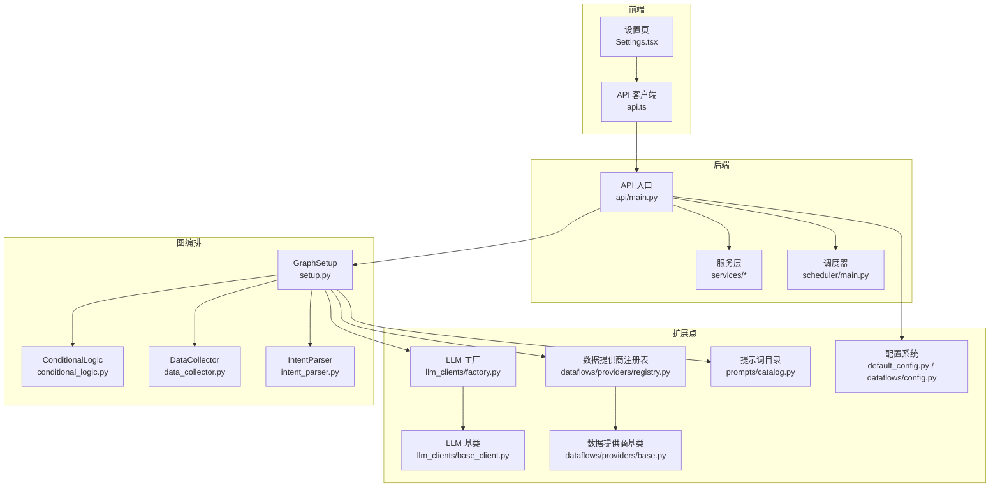
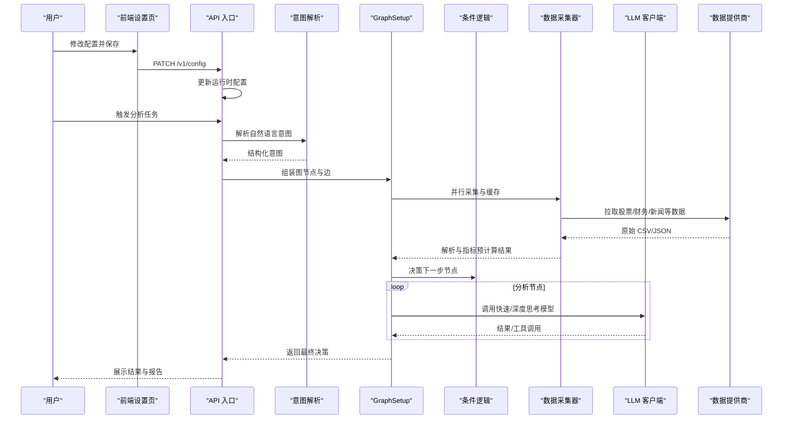
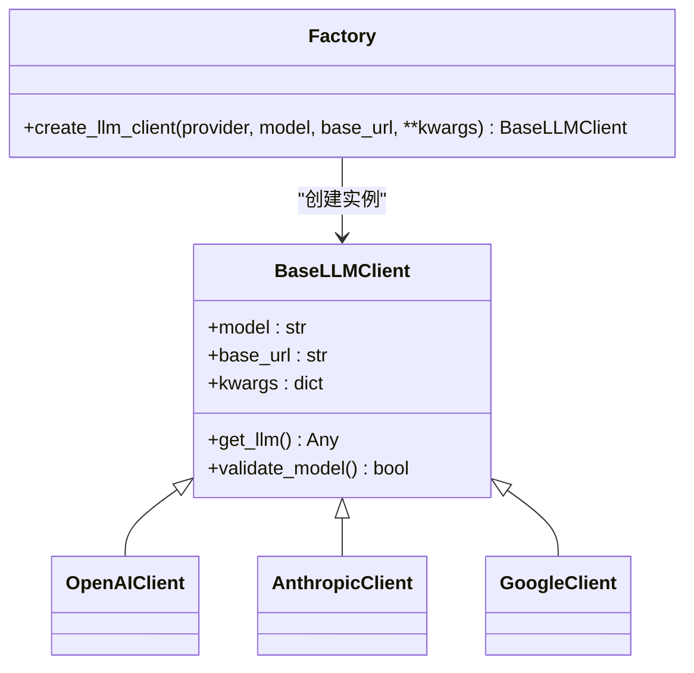
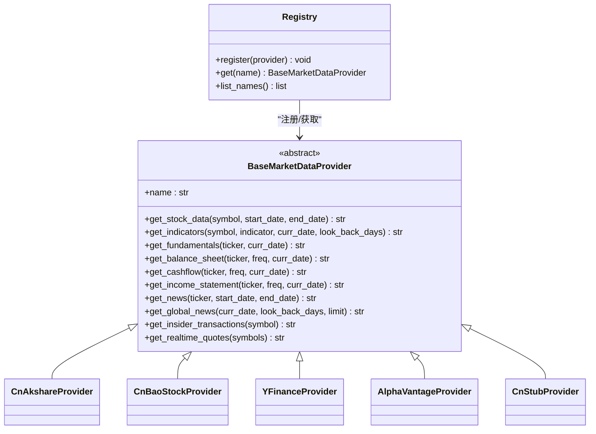
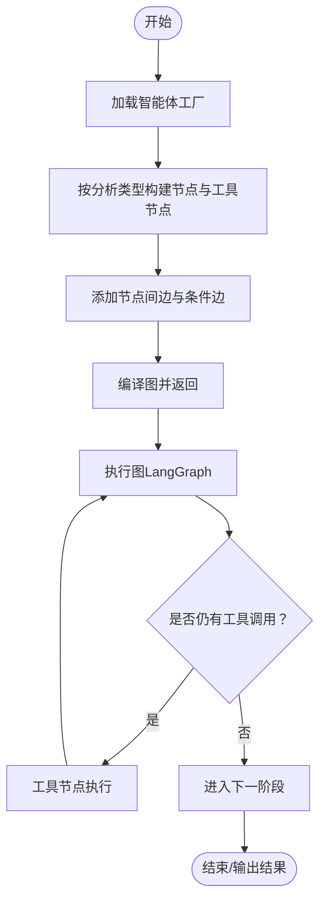
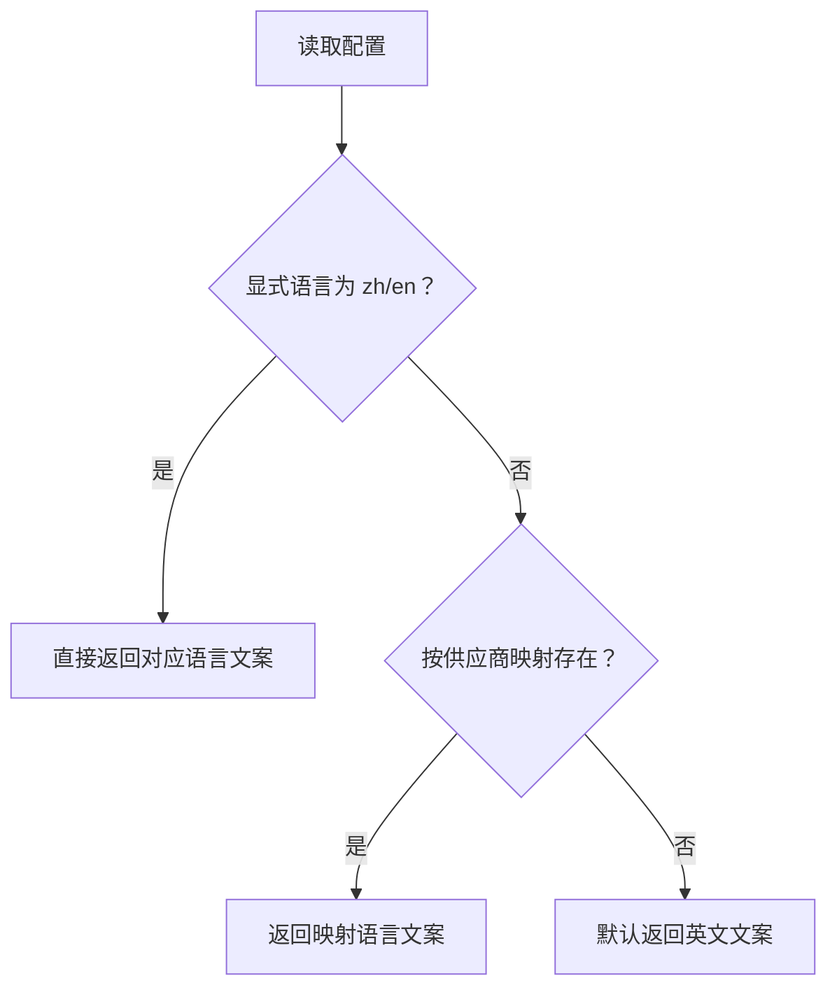
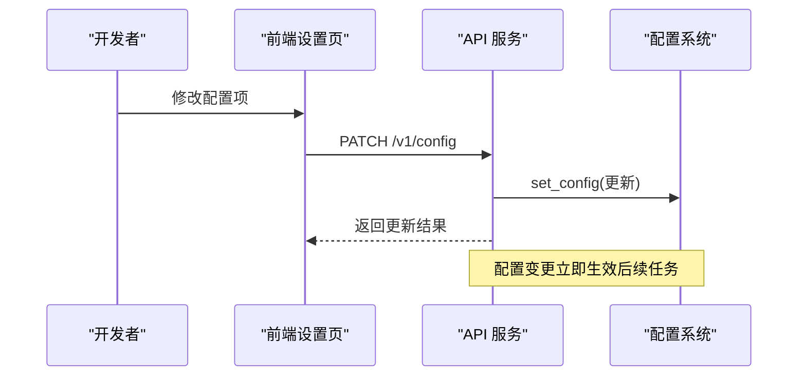
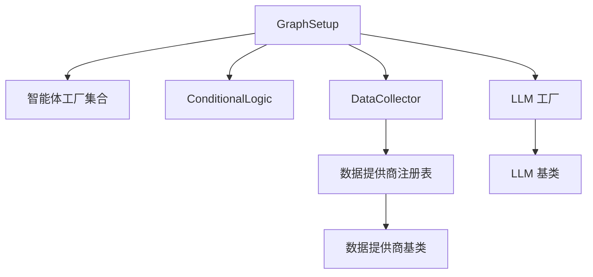

# 扩展定制

<cite>
**本文引用的文件**
- [tradingagents/default_config.py](file://tradingagents/default_config.py)
- [tradingagents/dataflows/config.py](file://tradingagents/dataflows/config.py)
- [tradingagents/llm_clients/factory.py](file://tradingagents/llm_clients/factory.py)
- [tradingagents/llm_clients/base_client.py](file://tradingagents/llm_clients/base_client.py)
- [tradingagents/dataflows/providers/registry.py](file://tradingagents/dataflows/providers/registry.py)
- [tradingagents/dataflows/providers/base.py](file://tradingagents/dataflows/providers/base.py)
- [tradingagents/graph/setup.py](file://tradingagents/graph/setup.py)
- [tradingagents/graph/conditional_logic.py](file://tradingagents/graph/conditional_logic.py)
- [tradingagents/graph/intent_parser.py](file://tradingagents/graph/intent_parser.py)
- [tradingagents/graph/data_collector.py](file://tradingagents/graph/data_collector.py)
- [tradingagents/prompts/catalog.py](file://tradingagents/prompts/catalog.py)
- [tradingagents/agents/__init__.py](file://tradingagents/agents/__init__.py)
- [tradingagents/agents/utils/agent_states.py](file://tradingagents/agents/utils/agent_states.py)
- [api/main.py](file://api/main.py)
- [frontend/src/services/api.ts](file://frontend/src/services/api.ts)
- [frontend/src/pages/Settings.tsx](file://frontend/src/pages/Settings.tsx)
</cite>

## 目录
1. [简介](#简介)
2. [项目结构](#项目结构)
3. [核心组件](#核心组件)
4. [架构总览](#架构总览)
5. [详细组件分析](#详细组件分析)
6. [依赖分析](#依赖分析)
7. [性能考量](#性能考量)
8. [故障排查指南](#故障排查指南)
9. [结论](#结论)
10. [附录](#附录)

## 简介
本文件面向希望对 TradingAgents-AShare 进行扩展与定制的开发者，系统性阐述插件系统架构、扩展点识别与自定义开发方法。内容覆盖以下主题：
- 插件系统与扩展点：LLM 客户端工厂、数据提供商注册表、图编排与条件逻辑、提示词目录与语言解析。
- 自定义开发：如何开发自定义智能体、数据提供商、LLM 客户端；提示词工程、技能定义与行为定制。
- 系统配置扩展：环境变量与运行时配置注入、前端配置接口与热更新。
- 功能模块与界面定制：新增分析节点、调整图流程、扩展前端设置页与通知集成。
- 最佳实践：兼容性、可维护性、性能优化与调试技巧。

## 项目结构
项目采用“后端服务 + 图编排引擎 + 前端界面”的分层组织方式：
- 后端服务层：API 入口负责路由与鉴权，调度器负责定时任务，服务层封装业务能力（回测、报告、通知等）。
- 图编排层：以 LangGraph 为核心，通过 GraphSetup 组装节点与边，ConditionalLogic 控制流程分支，DataCollector 负责统一数据采集与缓存。
- 数据与模型层：LLM 客户端工厂按供应商抽象，数据提供商注册表按接口抽象，提示词目录按语言与键值管理。
- 前端层：React/Vite 构建，提供设置页、看板、聊天协作等界面，并通过 API 服务进行配置读写与热更新。

图表来源
- [api/main.py](file://api/main.py)
- [tradingagents/graph/setup.py](file://tradingagents/graph/setup.py)
- [tradingagents/graph/conditional_logic.py](file://tradingagents/graph/conditional_logic.py)
- [tradingagents/graph/data_collector.py](file://tradingagents/graph/data_collector.py)
- [tradingagents/graph/intent_parser.py](file://tradingagents/graph/intent_parser.py)
- [tradingagents/llm_clients/factory.py](file://tradingagents/llm_clients/factory.py)
- [tradingagents/llm_clients/base_client.py](file://tradingagents/llm_clients/base_client.py)
- [tradingagents/dataflows/providers/registry.py](file://tradingagents/dataflows/providers/registry.py)
- [tradingagents/dataflows/providers/base.py](file://tradingagents/dataflows/providers/base.py)
- [tradingagents/prompts/catalog.py](file://tradingagents/prompts/catalog.py)
- [tradingagents/default_config.py](file://tradingagents/default_config.py)
- [tradingagents/dataflows/config.py](file://tradingagents/dataflows/config.py)

章节来源
- [api/main.py](file://api/main.py)
- [tradingagents/graph/setup.py](file://tradingagents/graph/setup.py)
- [tradingagents/llm_clients/factory.py](file://tradingagents/llm_clients/factory.py)
- [tradingagents/dataflows/providers/registry.py](file://tradingagents/dataflows/providers/registry.py)
- [tradingagents/prompts/catalog.py](file://tradingagents/prompts/catalog.py)
- [tradingagents/default_config.py](file://tradingagents/default_config.py)
- [tradingagents/dataflows/config.py](file://tradingagents/dataflows/config.py)

## 核心组件
- 配置系统：默认配置与运行时覆盖，支持环境变量注入与动态更新。
- LLM 客户端工厂：按供应商创建客户端实例，统一接口与校验。
- 数据提供商注册表：按接口抽象注册与获取数据源实现。
- 图编排与条件逻辑：构建并编译工作流，控制分析与风险讨论的分支。
- 数据采集器：统一采集、解析、缓存与预计算指标，支持多窗口视图。
- 提示词目录：按语言与键值解析提示词，支持按供应商映射语言。
- 智能体导出：统一暴露创建函数，便于图编排按需装配。

章节来源
- [tradingagents/default_config.py](file://tradingagents/default_config.py)
- [tradingagents/dataflows/config.py](file://tradingagents/dataflows/config.py)
- [tradingagents/llm_clients/factory.py](file://tradingagents/llm_clients/factory.py)
- [tradingagents/llm_clients/base_client.py](file://tradingagents/llm_clients/base_client.py)
- [tradingagents/dataflows/providers/registry.py](file://tradingagents/dataflows/providers/registry.py)
- [tradingagents/dataflows/providers/base.py](file://tradingagents/dataflows/providers/base.py)
- [tradingagents/graph/setup.py](file://tradingagents/graph/setup.py)
- [tradingagents/graph/conditional_logic.py](file://tradingagents/graph/conditional_logic.py)
- [tradingagents/graph/data_collector.py](file://tradingagents/graph/data_collector.py)
- [tradingagents/prompts/catalog.py](file://tradingagents/prompts/catalog.py)
- [tradingagents/agents/__init__.py](file://tradingagents/agents/__init__.py)

## 架构总览
系统以“意图解析 → 分析节点并行 → 研讨与决策 → 风险评估 → 执行”为主线，通过条件逻辑与状态机驱动流程切换。数据采集器在图编排前完成全量数据与指标预计算，降低分析阶段的 IO 压力。

图表来源
- [frontend/src/pages/Settings.tsx](file://frontend/src/pages/Settings.tsx)
- [frontend/src/services/api.ts](file://frontend/src/services/api.ts)
- [api/main.py](file://api/main.py)
- [tradingagents/graph/intent_parser.py](file://tradingagents/graph/intent_parser.py)
- [tradingagents/graph/setup.py](file://tradingagents/graph/setup.py)
- [tradingagents/graph/conditional_logic.py](file://tradingagents/graph/conditional_logic.py)
- [tradingagents/graph/data_collector.py](file://tradingagents/graph/data_collector.py)
- [tradingagents/llm_clients/factory.py](file://tradingagents/llm_clients/factory.py)
- [tradingagents/dataflows/providers/registry.py](file://tradingagents/dataflows/providers/registry.py)

## 详细组件分析

### LLM 客户端扩展点
- 扩展目标：新增第三方 LLM 供应商或适配特定参数（如推理努力度、思维层级）。
- 关键接口与流程：
  - 抽象基类定义统一接口与模型校验。
  - 工厂根据供应商字符串选择具体实现。
  - 图编排层按供应商注入参数（如 OpenAI 推理努力度、Google 思维层级）。
- 开发步骤：
  1) 新建客户端类，继承抽象基类并实现接口。
  2) 在工厂中增加供应商分支并返回新客户端。
  3) 在图编排层按供应商补充参数映射。
  4) 在配置中设置供应商与模型名，必要时设置 API Key。

图表来源
- [tradingagents/llm_clients/base_client.py](file://tradingagents/llm_clients/base_client.py)
- [tradingagents/llm_clients/factory.py](file://tradingagents/llm_clients/factory.py)

章节来源
- [tradingagents/llm_clients/base_client.py](file://tradingagents/llm_clients/base_client.py)
- [tradingagents/llm_clients/factory.py](file://tradingagents/llm_clients/factory.py)
- [tradingagents/graph/trading_graph.py](file://tradingagents/graph/trading_graph.py)

### 数据提供商扩展点
- 扩展目标：接入新的数据源（如国内/海外行情、财务、新闻）。
- 关键接口与流程：
  - 抽象基类定义统一的数据接口（股票、指标、财务、新闻、实时报价等）。
  - 注册表负责注册与按名称获取实现。
  - 图编排中的数据采集器统一调用这些实现。
- 开发步骤：
  1) 新建类，继承抽象基类并实现所需接口。
  2) 在注册表中注册该实现。
  3) 在配置中将该提供商加入对应类别（如 core_stock_apis、technical_indicators 等）。
  4) 如需实时报价，实现 get_realtime_quotes 并确保返回规范 JSON 字符串。

图表来源
- [tradingagents/dataflows/providers/base.py](file://tradingagents/dataflows/providers/base.py)
- [tradingagents/dataflows/providers/registry.py](file://tradingagents/dataflows/providers/registry.py)

章节来源
- [tradingagents/dataflows/providers/base.py](file://tradingagents/dataflows/providers/base.py)
- [tradingagents/dataflows/providers/registry.py](file://tradingagents/dataflows/providers/registry.py)
- [tradingagents/graph/data_collector.py](file://tradingagents/graph/data_collector.py)

### 图编排与条件逻辑扩展点
- 扩展目标：新增分析节点、调整并行/串行流程、改变风险讨论轮次与终止条件。
- 关键机制：
  - GraphSetup 按分析类型动态装配节点与工具节点，构建并编译图。
  - ConditionalLogic 根据消息与状态决定是否继续工具调用或进入下一阶段。
  - DataCollector 在图启动前完成全量数据采集与指标预计算。
- 开发步骤：
  1) 在 agents 子包中实现新智能体的创建工厂函数。
  2) 在 GraphSetup 中注册该节点与工具节点。
  3) 在 ConditionalLogic 中新增对应的 should_continue_* 判断。
  4) 在前端设置页中开放选择该分析类型的开关。

图表来源
- [tradingagents/graph/setup.py](file://tradingagents/graph/setup.py)
- [tradingagents/graph/conditional_logic.py](file://tradingagents/graph/conditional_logic.py)
- [tradingagents/graph/data_collector.py](file://tradingagents/graph/data_collector.py)
- [tradingagents/agents/__init__.py](file://tradingagents/agents/__init__.py)

章节来源
- [tradingagents/graph/setup.py](file://tradingagents/graph/setup.py)
- [tradingagents/graph/conditional_logic.py](file://tradingagents/graph/conditional_logic.py)
- [tradingagents/graph/data_collector.py](file://tradingagents/graph/data_collector.py)
- [tradingagents/agents/__init__.py](file://tradingagents/agents/__init__.py)

### 提示词工程与语言控制
- 扩展目标：新增提示词键、切换语言策略、按供应商映射语言。
- 关键机制：
  - 提示词目录按语言与键值解析，自动回退到英文。
  - 语言解析优先使用显式配置，其次按供应商映射，最后回退到英文。
- 开发步骤：
  1) 在提示词文件中新增键值与文案。
  2) 在配置中设置 prompt_language 或按供应商映射。
  3) 在需要的语言场景中调用 get_prompt 获取对应文案。

图表来源
- [tradingagents/prompts/catalog.py](file://tradingagents/prompts/catalog.py)
- [tradingagents/default_config.py](file://tradingagents/default_config.py)

章节来源
- [tradingagents/prompts/catalog.py](file://tradingagents/prompts/catalog.py)
- [tradingagents/default_config.py](file://tradingagents/default_config.py)

### 配置扩展与运行时热更新
- 扩展目标：在运行时修改 LLM 供应商、模型、提示词语言、数据提供商路由与追踪开关。
- 关键机制：
  - 默认配置集中于 default_config.py，运行时通过 dataflows/config.py 的 set_config/get_config 动态覆盖。
  - 前端 Settings 页面提供读取/更新配置的接口，支持热更新。
- 开发步骤：
  1) 在 default_config.py 中添加新配置项的默认值。
  2) 在前端 Settings.tsx 中新增输入控件与保存逻辑。
  3) 在 api 服务中提供 GET/UPDATE/WARMUP 接口，调用 dataflows/config.py 更新配置。
  4) 在图编排层按新配置注入参数（如 LLM 工厂参数）。

图表来源
- [frontend/src/pages/Settings.tsx](file://frontend/src/pages/Settings.tsx)
- [frontend/src/services/api.ts](file://frontend/src/services/api.ts)
- [api/main.py](file://api/main.py)
- [tradingagents/dataflows/config.py](file://tradingagents/dataflows/config.py)
- [tradingagents/default_config.py](file://tradingagents/default_config.py)

章节来源
- [tradingagents/default_config.py](file://tradingagents/default_config.py)
- [tradingagents/dataflows/config.py](file://tradingagents/dataflows/config.py)
- [frontend/src/pages/Settings.tsx](file://frontend/src/pages/Settings.tsx)
- [frontend/src/services/api.ts](file://frontend/src/services/api.ts)
- [api/main.py](file://api/main.py)

### 自定义智能体开发指南
- 步骤概览：
  1) 设计智能体职责与输入输出，参考现有分析类与研究员类。
  2) 实现 create_* 工厂函数，返回可调用的节点对象。
  3) 在 GraphSetup 中注册该节点与工具节点。
  4) 在 ConditionalLogic 中新增条件判断。
  5) 在前端设置页中开放选择开关。
- 参考路径：
  - [tradingagents/agents/analyzer 示例](file://tradingagents/agents/analysts/market_analyst.py)
  - [tradingagents/agents/researcher 示例](file://tradingagents/agents/researchers/bull_researcher.py)
  - [tradingagents/agents/risk_mgmt 示例](file://tradingagents/agents/risk_mgmt/aggressive_debator.py)

章节来源
- [tradingagents/agents/__init__.py](file://tradingagents/agents/__init__.py)
- [tradingagents/graph/setup.py](file://tradingagents/graph/setup.py)
- [tradingagents/graph/conditional_logic.py](file://tradingagents/graph/conditional_logic.py)

### 自定义数据提供商开发指南
- 步骤概览：
  1) 新建类，继承 BaseMarketDataProvider 并实现所需接口。
  2) 在注册表中注册该实现。
  3) 在配置中将该提供商加入对应类别（如 core_stock_apis、technical_indicators 等）。
  4) 如需实时报价，实现 get_realtime_quotes 并确保返回规范 JSON 字符串。
- 参考路径：
  - [tradingagents/dataflows/providers/base.py](file://tradingagents/dataflows/providers/base.py)
  - [tradingagents/dataflows/providers/registry.py](file://tradingagents/dataflows/providers/registry.py)

章节来源
- [tradingagents/dataflows/providers/base.py](file://tradingagents/dataflows/providers/base.py)
- [tradingagents/dataflows/providers/registry.py](file://tradingagents/dataflows/providers/registry.py)

### 自定义 LLM 客户端开发指南
- 步骤概览：
  1) 新建类，继承 BaseLLMClient 并实现接口。
  2) 在工厂中增加供应商分支并返回新客户端。
  3) 在图编排层按供应商补充参数映射（如推理努力度、思维层级）。
  4) 在配置中设置供应商与模型名，必要时设置 API Key。
- 参考路径：
  - [tradingagents/llm_clients/base_client.py](file://tradingagents/llm_clients/base_client.py)
  - [tradingagents/llm_clients/factory.py](file://tradingagents/llm_clients/factory.py)

章节来源
- [tradingagents/llm_clients/base_client.py](file://tradingagents/llm_clients/base_client.py)
- [tradingagents/llm_clients/factory.py](file://tradingagents/llm_clients/factory.py)

### 提示词工程与行为定制
- 提示词键管理：在提示词目录中新增键值，按语言与键值解析。
- 行为定制：通过 ConditionalLogic 的 should_continue_* 方法控制分析节点的工具调用循环；通过 max_debate_rounds/max_risk_discuss_rounds 控制研讨轮次上限。
- 参考路径：
  - [tradingagents/prompts/catalog.py](file://tradingagents/prompts/catalog.py)
  - [tradingagents/graph/conditional_logic.py](file://tradingagents/graph/conditional_logic.py)
  - [tradingagents/default_config.py](file://tradingagents/default_config.py)

章节来源
- [tradingagents/prompts/catalog.py](file://tradingagents/prompts/catalog.py)
- [tradingagents/graph/conditional_logic.py](file://tradingagents/graph/conditional_logic.py)
- [tradingagents/default_config.py](file://tradingagents/default_config.py)

### 界面定制与功能模块添加
- 设置页扩展：在 Settings.tsx 中新增配置项与保存逻辑，调用 api.ts 的 /v1/config 接口。
- 通知与集成：可参考通知服务的实现思路，在前端页面中增加相关按钮与交互。
- 参考路径：
  - [frontend/src/pages/Settings.tsx](file://frontend/src/pages/Settings.tsx)
  - [frontend/src/services/api.ts](file://frontend/src/services/api.ts)

章节来源
- [frontend/src/pages/Settings.tsx](file://frontend/src/pages/Settings.tsx)
- [frontend/src/services/api.ts](file://frontend/src/services/api.ts)

## 依赖分析
- 组件耦合与内聚：
  - GraphSetup 对智能体工厂、工具节点、条件逻辑高度依赖，体现强内聚弱耦合的设计。
  - DataCollector 与数据提供商注册表解耦，通过统一接口调用。
  - LLM 工厂与供应商实现解耦，通过抽象基类统一接口。
- 外部依赖与集成点：
  - LLM 供应商差异通过工厂与图编排层参数映射处理。
  - 数据提供商差异通过注册表与统一接口处理。
  - 前端通过 API 服务与后端配置系统对接。

图表来源
- [tradingagents/graph/setup.py](file://tradingagents/graph/setup.py)
- [tradingagents/graph/conditional_logic.py](file://tradingagents/graph/conditional_logic.py)
- [tradingagents/graph/data_collector.py](file://tradingagents/graph/data_collector.py)
- [tradingagents/llm_clients/factory.py](file://tradingagents/llm_clients/factory.py)
- [tradingagents/llm_clients/base_client.py](file://tradingagents/llm_clients/base_client.py)
- [tradingagents/dataflows/providers/registry.py](file://tradingagents/dataflows/providers/registry.py)
- [tradingagents/dataflows/providers/base.py](file://tradingagents/dataflows/providers/base.py)

章节来源
- [tradingagents/graph/setup.py](file://tradingagents/graph/setup.py)
- [tradingagents/graph/conditional_logic.py](file://tradingagents/graph/conditional_logic.py)
- [tradingagents/graph/data_collector.py](file://tradingagents/graph/data_collector.py)
- [tradingagents/llm_clients/factory.py](file://tradingagents/llm_clients/factory.py)
- [tradingagents/llm_clients/base_client.py](file://tradingagents/llm_clients/base_client.py)
- [tradingagents/dataflows/providers/registry.py](file://tradingagents/dataflows/providers/registry.py)
- [tradingagents/dataflows/providers/base.py](file://tradingagents/dataflows/providers/base.py)

## 性能考量
- 数据采集与缓存：
  - 使用 DataCollector 的线程安全缓存与引用计数，避免重复拉取。
  - 并发池大小限制，减少被反爬风险。
  - 指标本地计算与预聚合，降低分析阶段 IO 压力。
- LLM 调用优化：
  - 快速思考与深度思考模型分离，缩短响应时间。
  - 供应商参数按需注入，避免不必要的开销。
- 前端交互：
  - 设置页保存后立即触发热更新，减少等待时间。
  - SSE 流式输出与进度反馈提升用户体验。

## 故障排查指南
- 配置问题：
  - 检查环境变量与运行时配置是否正确覆盖。
  - 通过前端设置页查看当前配置并尝试热更新。
- LLM 客户端问题：
  - 确认供应商名称大小写与工厂分支匹配。
  - 校验模型是否受支持，必要时在客户端中实现校验逻辑。
- 数据提供商问题：
  - 确认提供商已注册并在配置中启用。
  - 检查 get_realtime_quotes 返回格式是否符合预期。
- 图编排问题：
  - 确认新增智能体的工厂函数已导出并在 GraphSetup 中注册。
  - 检查 ConditionalLogic 的条件判断是否与状态字段一致。
- 前端问题：
  - 确认 /v1/config 接口返回成功后再刷新页面。
  - 检查网络请求与错误提示，定位具体失败环节。

章节来源
- [frontend/src/services/api.ts](file://frontend/src/services/api.ts)
- [tradingagents/dataflows/config.py](file://tradingagents/dataflows/config.py)
- [tradingagents/llm_clients/factory.py](file://tradingagents/llm_clients/factory.py)
- [tradingagents/dataflows/providers/registry.py](file://tradingagents/dataflows/providers/registry.py)
- [tradingagents/graph/setup.py](file://tradingagents/graph/setup.py)
- [tradingagents/graph/conditional_logic.py](file://tradingagents/graph/conditional_logic.py)

## 结论
TradingAgents-AShare 通过清晰的抽象层与可插拔设计，为扩展定制提供了良好的基础。开发者可在 LLM 客户端、数据提供商、智能体节点、提示词与配置等多个维度进行扩展，同时保持系统的稳定性与可维护性。建议遵循本文的最佳实践，结合性能优化与故障排查指南，确保扩展功能高效、可靠地集成到现有体系中。

## 附录
- 扩展开发清单
  - 新增 LLM 客户端：实现基类 → 注册工厂 → 注入参数映射 → 配置供应商与模型。
  - 新增数据提供商：实现接口 → 注册到注册表 → 配置启用 → 可选实现实时报价。
  - 新增智能体：实现工厂函数 → 注册到图编排 → 新增条件逻辑 → 前端开关。
  - 新增提示词键：在提示词目录新增键值 → 配置语言策略 → 调用 get_prompt。
  - 配置扩展：在默认配置新增键值 → 前端设置页新增控件 → API 服务提供更新接口。
- 调试建议
  - 使用最小化配置验证核心链路。
  - 逐步引入新组件，观察日志与状态字段变化。
  - 利用前端设置页的热更新能力快速迭代。