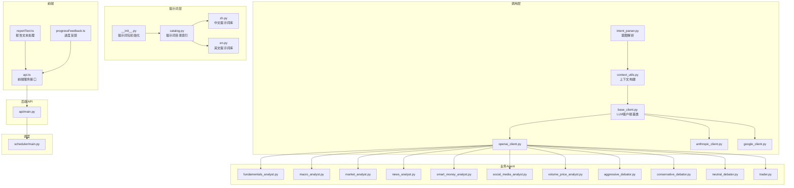
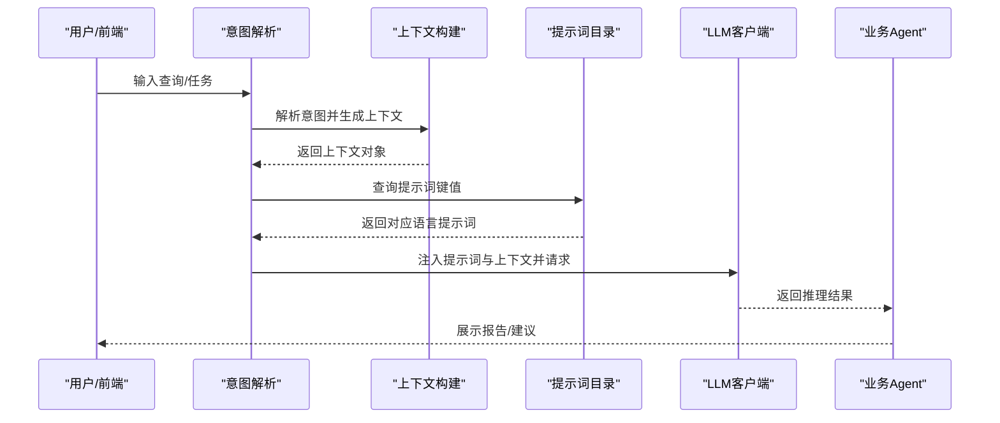
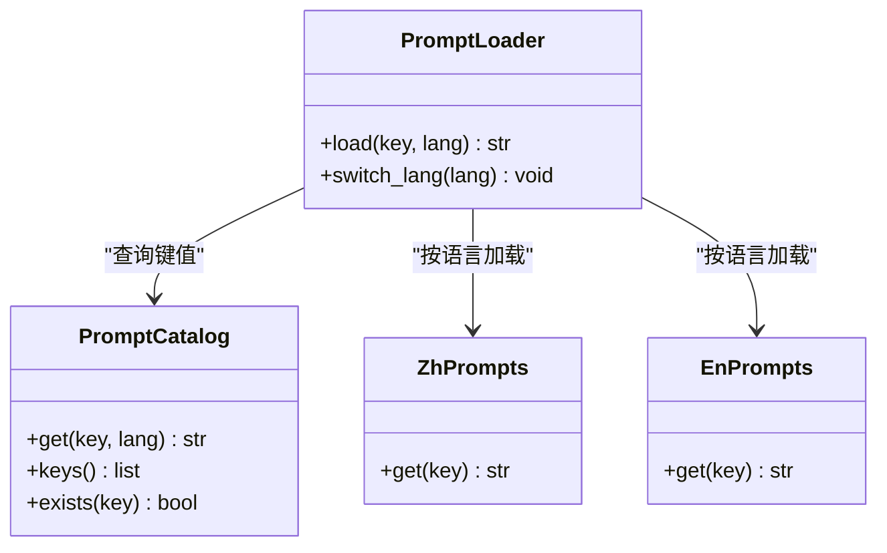
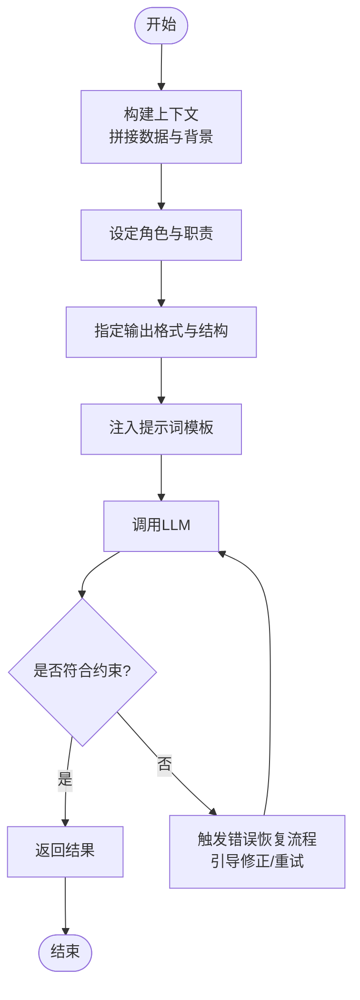
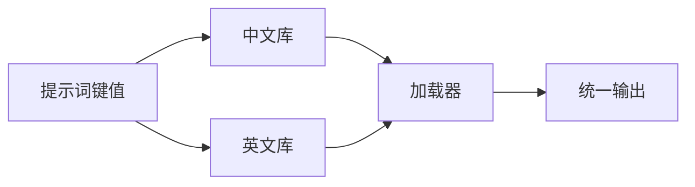
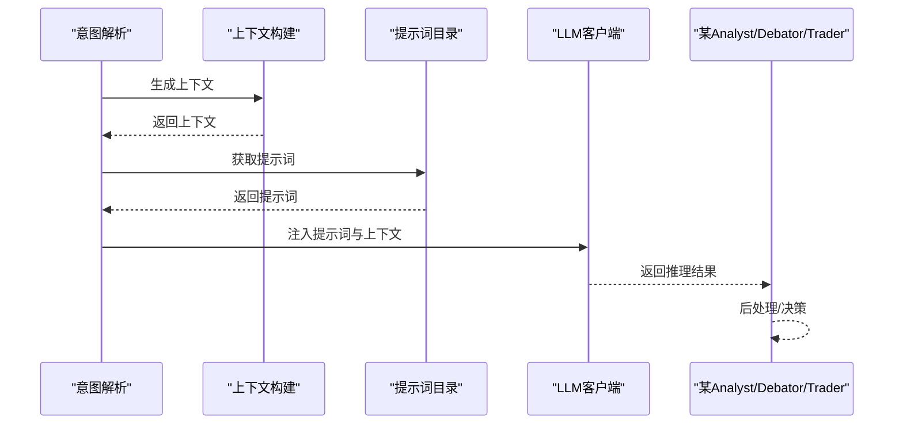
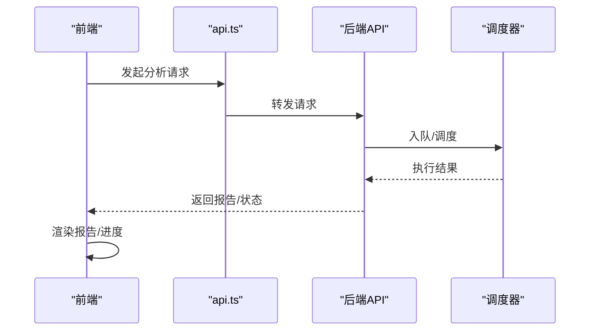
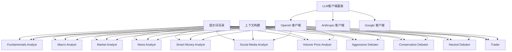

# 提示词工程

<cite>
**本文引用的文件**
- [catalog.py](file://tradingagents/prompts/catalog.py)
- [en.py](file://tradingagents/prompts/en.py)
- [zh.py](file://tradingagents/prompts/zh.py)
- [__init__.py](file://tradingagents/prompts/__init__.py)
- [intent_parser.py](file://tradingagents/graph/intent_parser.py)
- [context_utils.py](file://tradingagents/agents/utils/context_utils.py)
- [base_client.py](file://tradingagents/llm_clients/base_client.py)
- [openai_client.py](file://tradingagents/llm_clients/openai_client.py)
- [anthropic_client.py](file://tradingagents/llm_clients/anthropic_client.py)
- [google_client.py](file://tradingagents/llm_clients/google_client.py)
- [fundamentals_analyst.py](file://tradingagents/agents/analysts/fundamentals_analyst.py)
- [macro_analyst.py](file://tradingagents/agents/analysts/macro_analyst.py)
- [market_analyst.py](file://tradingagents/agents/analysts/market_analyst.py)
- [news_analyst.py](file://tradingagents/agents/analysts/news_analyst.py)
- [smart_money_analyst.py](file://tradingagents/agents/analysts/smart_money_analyst.py)
- [social_media_analyst.py](file://tradingagents/agents/analysts/social_media_analyst.py)
- [volume_price_analyst.py](file://tradingagents/agents/analysts/volume_price_analyst.py)
- [aggressive_debator.py](file://tradingagents/agents/risk_mgmt/aggressive_debator.py)
- [conservative_debator.py](file://tradingagents/agents/risk_mgmt/conservative_debator.py)
- [neutral_debator.py](file://tradingagents/agents/risk_mgmt/neutral_debator.py)
- [trader.py](file://tradingagents/agents/trader/trader.py)
- [report_text.py](file://frontend/src/utils/reportText.ts)
- [progressFeedback.ts](file://frontend/src/utils/progressFeedback.ts)
- [api.ts](file://frontend/src/services/api.ts)
- [main.py](file://api/main.py)
- [main.py](file://scheduler/main.py)
</cite>

## 目录
1. [引言](#引言)
2. [项目结构](#项目结构)
3. [核心组件](#核心组件)
4. [架构总览](#架构总览)
5. [详细组件分析](#详细组件分析)
6. [依赖关系分析](#依赖关系分析)
7. [性能考量](#性能考量)
8. [故障排查指南](#故障排查指南)
9. [结论](#结论)
10. [附录](#附录)

## 引言
本文件面向TradingAgents-AShare项目的提示词工程，系统性梳理提示词架构设计与多语言支持机制，明确提示词分类体系（分析型、指令型、约束型、评估型），总结提示词模板设计原则（上下文构建、角色设定、输出格式化、错误恢复），并给出本地化策略（中英文双语、文化适应性、表达优化）。同时，提供提示词测试方法、效果评估指标与迭代优化流程，并覆盖开发工具与调试技巧，帮助团队高效构建与维护高质量提示词体系。

## 项目结构
提示词工程主要集中在tradingagents/prompts目录，包含提示词目录索引与中英文实现；在各Agent模块中通过统一入口加载与调用；前端侧提供报告文本与进度反馈工具以支撑提示词执行结果的呈现与反馈。

**图表来源**
- [catalog.py](file://tradingagents/prompts/catalog.py)
- [zh.py](file://tradingagents/prompts/zh.py)
- [en.py](file://tradingagents/prompts/en.py)
- [__init__.py](file://tradingagents/prompts/__init__.py)
- [intent_parser.py](file://tradingagents/graph/intent_parser.py)
- [context_utils.py](file://tradingagents/agents/utils/context_utils.py)
- [base_client.py](file://tradingagents/llm_clients/base_client.py)
- [openai_client.py](file://tradingagents/llm_clients/openai_client.py)
- [anthropic_client.py](file://tradingagents/llm_clients/anthropic_client.py)
- [google_client.py](file://tradingagents/llm_clients/google_client.py)
- [fundamentals_analyst.py](file://tradingagents/agents/analysts/fundamentals_analyst.py)
- [macro_analyst.py](file://tradingagents/agents/analysts/macro_analyst.py)
- [market_analyst.py](file://tradingagents/agents/analysts/market_analyst.py)
- [news_analyst.py](file://tradingagents/agents/analysts/news_analyst.py)
- [smart_money_analyst.py](file://tradingagents/agents/analysts/smart_money_analyst.py)
- [social_media_analyst.py](file://tradingagents/agents/analysts/social_media_analyst.py)
- [volume_price_analyst.py](file://tradingagents/agents/analysts/volume_price_analyst.py)
- [aggressive_debator.py](file://tradingagents/agents/risk_mgmt/aggressive_debator.py)
- [conservative_debator.py](file://tradingagents/agents/risk_mgmt/conservative_debator.py)
- [neutral_debator.py](file://tradingagents/agents/risk_mgmt/neutral_debator.py)
- [trader.py](file://tradingagents/agents/trader/trader.py)
- [report_text.py](file://frontend/src/utils/reportText.ts)
- [progressFeedback.ts](file://frontend/src/utils/progressFeedback.ts)
- [api.ts](file://frontend/src/services/api.ts)
- [main.py](file://api/main.py)
- [main.py](file://scheduler/main.py)

**章节来源**
- [catalog.py](file://tradingagents/prompts/catalog.py)
- [zh.py](file://tradingagents/prompts/zh.py)
- [en.py](file://tradingagents/prompts/en.py)
- [__init__.py](file://tradingagents/prompts/__init__.py)

## 核心组件
- 提示词目录索引：集中管理提示词键名与默认语言映射，便于按需检索与切换语言。
- 中文提示词库：提供中文场景下的完整提示词集合，覆盖分析、指令、约束与评估等类型。
- 英文提示词库：提供英文场景下的完整提示词集合，确保国际化能力。
- 提示词包初始化：对外暴露统一的提示词访问接口，隐藏语言选择与加载细节。
- LLM客户端：抽象不同模型厂商的调用方式，保证提示词在不同后端的一致性。
- 各类Agent：在具体业务场景中加载并应用提示词，形成“提示词+上下文+推理”的闭环。

**章节来源**
- [catalog.py](file://tradingagents/prompts/catalog.py)
- [zh.py](file://tradingagents/prompts/zh.py)
- [en.py](file://tradingagents/prompts/en.py)
- [__init__.py](file://tradingagents/prompts/__init__.py)
- [base_client.py](file://tradingagents/llm_clients/base_client.py)

## 架构总览
提示词工程采用“目录索引 + 多语言实现 + 统一加载器”的分层架构。调用方通过目录索引获取提示词键值，由加载器根据当前语言返回对应文案；上下文构建模块负责拼接业务数据；LLM客户端封装模型调用；Agent在推理过程中注入提示词与上下文，最终产出结构化结果并通过前端展示。

**图表来源**
- [intent_parser.py](file://tradingagents/graph/intent_parser.py)
- [context_utils.py](file://tradingagents/agents/utils/context_utils.py)
- [catalog.py](file://tradingagents/prompts/catalog.py)
- [base_client.py](file://tradingagents/llm_clients/base_client.py)

## 详细组件分析

### 提示词目录与加载器
- 目录索引：集中定义所有可用提示词键名，提供默认语言映射与键值校验。
- 加载器：根据当前语言环境从中文或英文库中取词，支持回退策略与动态切换。
- 设计要点：键名语义化、命名一致性、可扩展性；避免硬编码语言标识，统一通过加载器屏蔽差异。

**图表来源**
- [catalog.py](file://tradingagents/prompts/catalog.py)
- [zh.py](file://tradingagents/prompts/zh.py)
- [en.py](file://tradingagents/prompts/en.py)
- [__init__.py](file://tradingagents/prompts/__init__.py)

**章节来源**
- [catalog.py](file://tradingagents/prompts/catalog.py)
- [zh.py](file://tradingagents/prompts/zh.py)
- [en.py](file://tradingagents/prompts/en.py)
- [__init__.py](file://tradingagents/prompts/__init__.py)

### 提示词分类体系
- 分析型提示词：用于引导模型对市场、公司或新闻数据进行深度分析，强调逻辑链与证据权重。
- 指令型提示词：明确任务步骤与边界条件，确保模型按序完成复杂推理或计算。
- 约束型提示词：限定输出范围、格式与风险偏好，保障安全与合规。
- 评估型提示词：用于对模型输出进行自检与评分，提升可靠性与一致性。

上述分类在各Agent中以键值形式存在，通过目录索引统一管理，便于复用与迭代。

**章节来源**
- [catalog.py](file://tradingagents/prompts/catalog.py)

### 提示词模板设计原则
- 上下文构建：将时间窗口、股票代码、财务指标、新闻事件等关键信息结构化注入提示词，确保模型具备充分背景。
- 角色设定：为模型分配清晰的角色（如“资深分析师”、“风险控制专家”）以稳定输出风格与专业度。
- 输出格式化：要求模型遵循固定结构（如JSON、Markdown列表、三段式结论）以便后续解析与展示。
- 错误恢复：在提示词中内置重试与修正提示，当模型出现幻觉或越界时引导其自我纠错。

**图表来源**
- [context_utils.py](file://tradingagents/agents/utils/context_utils.py)
- [base_client.py](file://tradingagents/llm_clients/base_client.py)

**章节来源**
- [context_utils.py](file://tradingagents/agents/utils/context_utils.py)
- [base_client.py](file://tradingagents/llm_clients/base_client.py)

### 多语言支持与本地化策略
- 双语实现：中文与英文提示词库并行维护，键值一一对应，确保功能等价。
- 文化适应性：在表达方式上考虑中西方金融语境差异（如术语、语气、结构化程度）。
- 表达优化：针对不同语言调整句式长度、逻辑连接词与专业术语密度，提升可读性与准确性。
- 动态切换：通过加载器按会话或用户偏好切换语言，保持一致的键值体验。

**图表来源**
- [catalog.py](file://tradingagents/prompts/catalog.py)
- [zh.py](file://tradingagents/prompts/zh.py)
- [en.py](file://tradingagents/prompts/en.py)

**章节来源**
- [catalog.py](file://tradingagents/prompts/catalog.py)
- [zh.py](file://tradingagents/prompts/zh.py)
- [en.py](file://tradingagents/prompts/en.py)

### 提示词在Agent中的应用
各类Agent在执行任务前会：
- 调用意图解析与上下文构建模块准备数据；
- 通过提示词目录获取对应提示词；
- 将提示词与上下文注入LLM客户端；
- 解析模型输出并驱动后续动作（如下单、生成报告、风险提示）。

**图表来源**
- [intent_parser.py](file://tradingagents/graph/intent_parser.py)
- [context_utils.py](file://tradingagents/agents/utils/context_utils.py)
- [catalog.py](file://tradingagents/prompts/catalog.py)
- [base_client.py](file://tradingagents/llm_clients/base_client.py)

**章节来源**
- [intent_parser.py](file://tradingagents/graph/intent_parser.py)
- [context_utils.py](file://tradingagents/agents/utils/context_utils.py)
- [catalog.py](file://tradingagents/prompts/catalog.py)
- [base_client.py](file://tradingagents/llm_clients/base_client.py)

### 前端集成与展示
- 报告文本处理：将模型输出转换为适合阅读的报告格式，支持分段、加粗、列表等。
- 进度反馈：在长流程中提供逐步反馈，改善用户体验。
- API对接：前端通过服务接口与后端交互，后端再驱动Agent与提示词执行。

**图表来源**
- [report_text.py](file://frontend/src/utils/reportText.ts)
- [progressFeedback.ts](file://frontend/src/utils/progressFeedback.ts)
- [api.ts](file://frontend/src/services/api.ts)
- [main.py](file://api/main.py)
- [main.py](file://scheduler/main.py)

**章节来源**
- [report_text.py](file://frontend/src/utils/reportText.ts)
- [progressFeedback.ts](file://frontend/src/utils/progressFeedback.ts)
- [api.ts](file://frontend/src/services/api.ts)
- [main.py](file://api/main.py)
- [main.py](file://scheduler/main.py)

## 依赖关系分析
提示词工程与Agent、LLM客户端、前端展示之间存在紧密耦合：
- Agent依赖提示词目录与上下文构建模块；
- LLM客户端抽象不同厂商的调用差异；
- 前端依赖后端API与展示工具完成结果呈现。

**图表来源**
- [catalog.py](file://tradingagents/prompts/catalog.py)
- [context_utils.py](file://tradingagents/agents/utils/context_utils.py)
- [base_client.py](file://tradingagents/llm_clients/base_client.py)
- [openai_client.py](file://tradingagents/llm_clients/openai_client.py)
- [anthropic_client.py](file://tradingagents/llm_clients/anthropic_client.py)
- [google_client.py](file://tradingagents/llm_clients/google_client.py)
- [fundamentals_analyst.py](file://tradingagents/agents/analysts/fundamentals_analyst.py)
- [macro_analyst.py](file://tradingagents/agents/analysts/macro_analyst.py)
- [market_analyst.py](file://tradingagents/agents/analysts/market_analyst.py)
- [news_analyst.py](file://tradingagents/agents/analysts/news_analyst.py)
- [smart_money_analyst.py](file://tradingagents/agents/analysts/smart_money_analyst.py)
- [social_media_analyst.py](file://tradingagents/agents/analysts/social_media_analyst.py)
- [volume_price_analyst.py](file://tradingagents/agents/analysts/volume_price_analyst.py)
- [aggressive_debator.py](file://tradingagents/agents/risk_mgmt/aggressive_debator.py)
- [conservative_debator.py](file://tradingagents/agents/risk_mgmt/conservative_debator.py)
- [neutral_debator.py](file://tradingagents/agents/risk_mgmt/neutral_debator.py)
- [trader.py](file://tradingagents/agents/trader/trader.py)

**章节来源**
- [catalog.py](file://tradingagents/prompts/catalog.py)
- [context_utils.py](file://tradingagents/agents/utils/context_utils.py)
- [base_client.py](file://tradingagents/llm_clients/base_client.py)

## 性能考量
- 提示词长度与上下文窗口：合理控制提示词与上下文长度，避免超出模型上下文限制导致截断或性能下降。
- 并发与批处理：在Agent层面合并相似任务，减少重复提示词加载与LLM调用次数。
- 缓存与回放：对稳定场景的结果进行缓存，结合增量更新策略降低重复计算成本。
- 日志与监控：记录提示词键值、输入输出与耗时，便于定位瓶颈与优化。

## 故障排查指南
- 提示词缺失：检查目录索引中键值是否存在，确认对应语言库已实现该键值。
- 上下文异常：核对上下文构建逻辑，确保关键字段非空且格式正确。
- LLM调用失败：检查客户端配置与鉴权参数，关注超时与重试策略。
- 前端渲染问题：验证后端返回结构与前端解析逻辑，确保格式一致。

**章节来源**
- [catalog.py](file://tradingagents/prompts/catalog.py)
- [context_utils.py](file://tradingagents/agents/utils/context_utils.py)
- [base_client.py](file://tradingagents/llm_clients/base_client.py)

## 结论
提示词工程是TradingAgents-AShare实现高质量智能投研的关键。通过目录索引与多语言库的解耦设计、严格的模板设计原则、完善的Agent应用流程以及前后端协同的展示机制，项目形成了可维护、可扩展、可本地化的提示词体系。建议持续完善测试与评估流程，推动提示词的迭代优化与知识沉淀。

## 附录
- 开发工具与调试技巧
  - 使用目录索引快速定位提示词键值，避免硬编码。
  - 在Agent中打印注入后的完整提示词与上下文，便于排错。
  - 对关键提示词建立回归用例，防止语言切换或上下文变更引发的偏差。
  - 利用前端进度反馈与报告工具验证输出质量与一致性。
- 测试方法与评估指标
  - 功能测试：覆盖典型场景与边界条件，验证Agent输出的正确性与稳定性。
  - A/B测试：对比不同提示词版本在相同数据上的表现，选择最优方案。
  - 用户反馈：收集真实用户对报告可读性与决策价值的评价，指导优化方向。
  - 迭代流程：小步快跑，持续收集数据、评估指标、用户反馈，形成闭环。