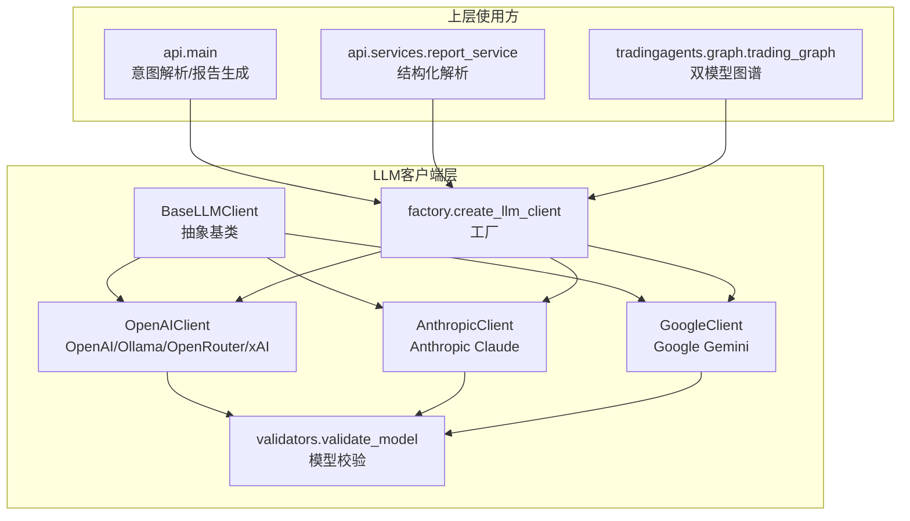
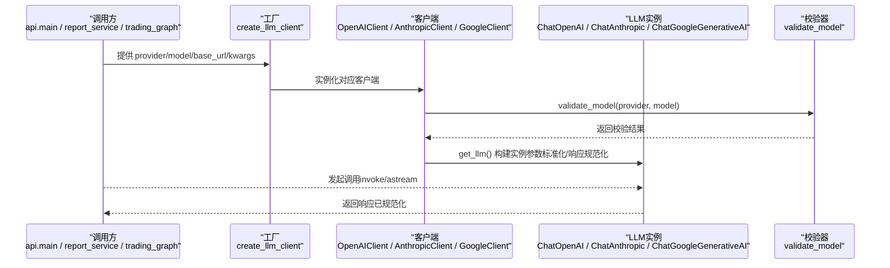
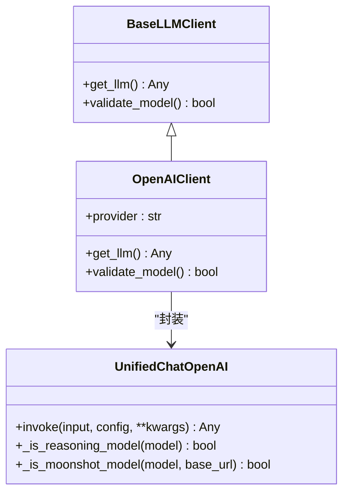
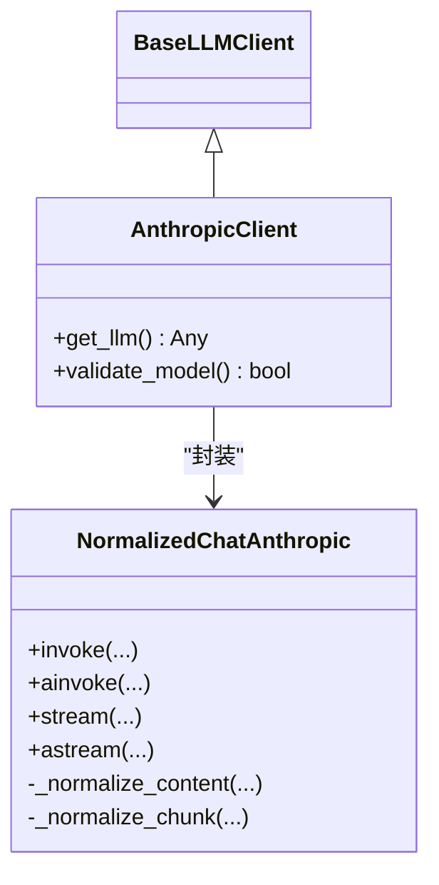
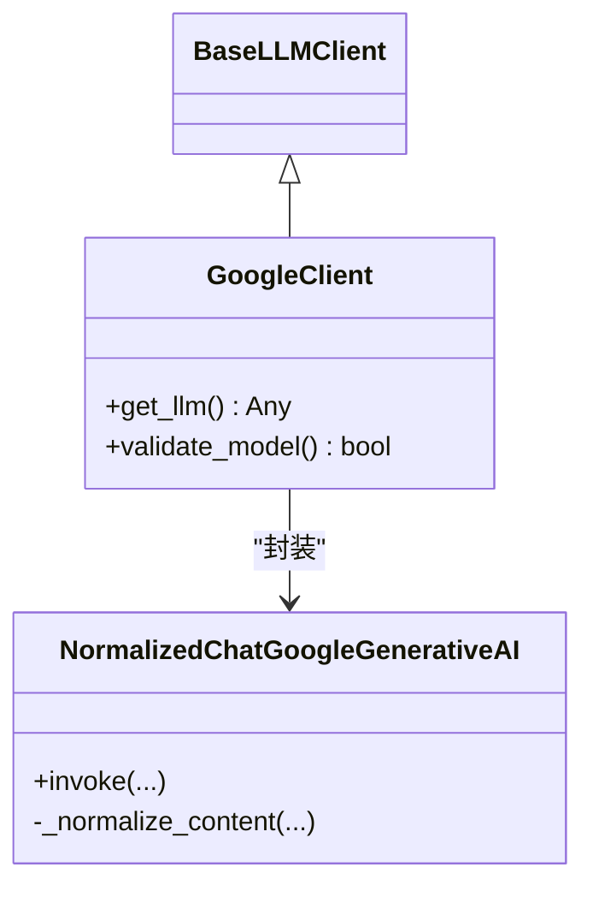
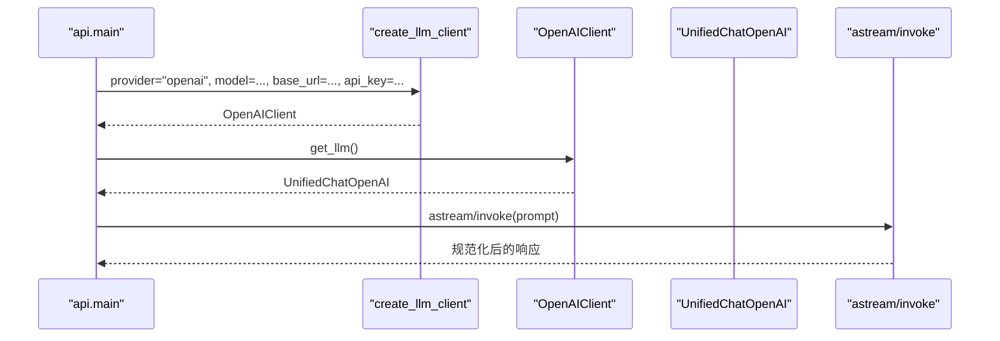
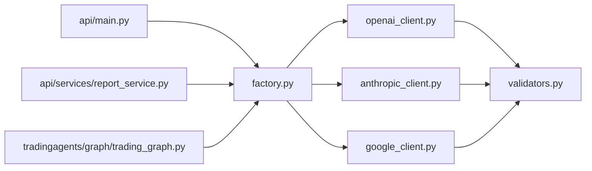
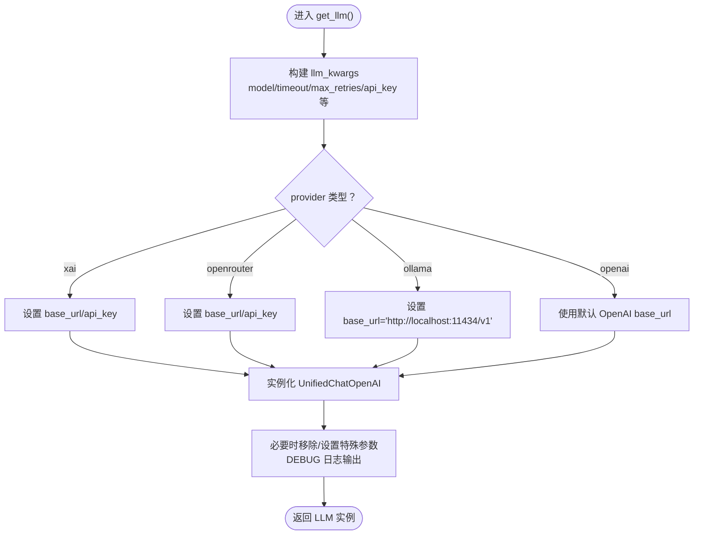

# LLM客户端插件

<cite>
**本文引用的文件**
- [tradingagents/llm_clients/base_client.py](file://tradingagents/llm_clients/base_client.py)
- [tradingagents/llm_clients/factory.py](file://tradingagents/llm_clients/factory.py)
- [tradingagents/llm_clients/openai_client.py](file://tradingagents/llm_clients/openai_client.py)
- [tradingagents/llm_clients/anthropic_client.py](file://tradingagents/llm_clients/anthropic_client.py)
- [tradingagents/llm_clients/google_client.py](file://tradingagents/llm_clients/google_client.py)
- [tradingagents/llm_clients/validators.py](file://tradingagents/llm_clients/validators.py)
- [tradingagents/llm_clients/__init__.py](file://tradingagents/llm_clients/__init__.py)
- [tradingagents/llm_clients/TODO.md](file://tradingagents/llm_clients/TODO.md)
- [api/main.py](file://api/main.py)
- [api/services/report_service.py](file://api/services/report_service.py)
- [tradingagents/graph/trading_graph.py](file://tradingagents/graph/trading_graph.py)
- [tests/test_config_fallback.py](file://tests/test_config_fallback.py)
</cite>

## 目录
1. [引言](#引言)
2. [项目结构](#项目结构)
3. [核心组件](#核心组件)
4. [架构总览](#架构总览)
5. [详细组件分析](#详细组件分析)
6. [依赖分析](#依赖分析)
7. [性能考虑](#性能考虑)
8. [故障排查指南](#故障排查指南)
9. [结论](#结论)
10. [附录](#附录)

## 引言
本文件面向开发者，系统性阐述 TradingAgents-AShare 中 LLM 客户端插件的设计与实现，重点包括：
- BaseLLMClient 抽象基类的接口规范与职责边界
- 多供应商适配策略（OpenAI/Ollama/OpenRouter/xAI、Anthropic、Google）
- 参数标准化与响应规范化处理
- 工厂模式的动态实例化与配置管理
- 错误重试策略、速率限制与成本控制建议
- 自定义 LLM 客户端开发流程与最佳实践

## 项目结构
LLM 客户端位于 tradingagents/llm_clients 目录，采用“抽象基类 + 供应商子类 + 工厂 + 校验器”的分层设计，配合上层模块（API、图谱引擎、服务层）按需装配。

图表来源
- [tradingagents/llm_clients/base_client.py:1-22](file://tradingagents/llm_clients/base_client.py#L1-L22)
- [tradingagents/llm_clients/openai_client.py:1-126](file://tradingagents/llm_clients/openai_client.py#L1-L126)
- [tradingagents/llm_clients/anthropic_client.py:1-91](file://tradingagents/llm_clients/anthropic_client.py#L1-L91)
- [tradingagents/llm_clients/google_client.py:1-68](file://tradingagents/llm_clients/google_client.py#L1-L68)
- [tradingagents/llm_clients/validators.py:1-83](file://tradingagents/llm_clients/validators.py#L1-L83)
- [tradingagents/llm_clients/factory.py:1-44](file://tradingagents/llm_clients/factory.py#L1-L44)
- [api/main.py:2970-3169](file://api/main.py#L2970-L3169)
- [api/services/report_service.py:100-299](file://api/services/report_service.py#L100-L299)
- [tradingagents/graph/trading_graph.py:85-284](file://tradingagents/graph/trading_graph.py#L85-L284)

章节来源
- [tradingagents/llm_clients/__init__.py:1-5](file://tradingagents/llm_clients/__init__.py#L1-L5)
- [tradingagents/llm_clients/factory.py:1-44](file://tradingagents/llm_clients/factory.py#L1-L44)

## 核心组件
- 抽象基类 BaseLLMClient：定义统一接口 get_llm() 与 validate_model()，确保各供应商客户端具备一致的对外契约。
- 工厂 create_llm_client：依据 provider 字符串动态选择具体客户端，屏蔽供应商差异。
- 供应商客户端：
  - OpenAIClient：封装 ChatOpenAI，支持推理模型参数兼容、超长超时与禁用重试等稳健性配置。
  - AnthropicClient：封装 ChatAnthropic，对“扩展思维”返回内容进行规范化，统一下游处理。
  - GoogleClient：封装 ChatGoogleGenerativeAI，对 Gemini 3 的复合内容进行规范化，并映射思考级别参数。
- 校验器 validate_model：集中维护各供应商可用模型清单，统一模型合法性检查入口。

章节来源
- [tradingagents/llm_clients/base_client.py:1-22](file://tradingagents/llm_clients/base_client.py#L1-L22)
- [tradingagents/llm_clients/factory.py:1-44](file://tradingagents/llm_clients/factory.py#L1-L44)
- [tradingagents/llm_clients/openai_client.py:1-126](file://tradingagents/llm_clients/openai_client.py#L1-L126)
- [tradingagents/llm_clients/anthropic_client.py:1-91](file://tradingagents/llm_clients/anthropic_client.py#L1-L91)
- [tradingagents/llm_clients/google_client.py:1-68](file://tradingagents/llm_clients/google_client.py#L1-L68)
- [tradingagents/llm_clients/validators.py:1-83](file://tradingagents/llm_clients/validators.py#L1-L83)

## 架构总览
下图展示从上层调用到具体供应商客户端的完整链路，以及参数传递与响应规范化路径。

图表来源
- [tradingagents/llm_clients/factory.py:1-44](file://tradingagents/llm_clients/factory.py#L1-L44)
- [tradingagents/llm_clients/openai_client.py:1-126](file://tradingagents/llm_clients/openai_client.py#L1-L126)
- [tradingagents/llm_clients/anthropic_client.py:1-91](file://tradingagents/llm_clients/anthropic_client.py#L1-L91)
- [tradingagents/llm_clients/google_client.py:1-68](file://tradingagents/llm_clients/google_client.py#L1-L68)
- [tradingagents/llm_clients/validators.py:1-83](file://tradingagents/llm_clients/validators.py#L1-L83)

## 详细组件分析

### 抽象基类 BaseLLMClient
- 职责
  - 统一初始化：接收 model、base_url 与任意关键字参数。
  - 统一接口：get_llm() 返回已配置的 LLM 实例；validate_model() 校验模型有效性。
- 设计要点
  - 将“供应商差异”隔离在子类内部，上层仅依赖抽象接口。
  - kwargs 作为扩展点，便于后续新增参数而不破坏契约。

章节来源
- [tradingagents/llm_clients/base_client.py:1-22](file://tradingagents/llm_clients/base_client.py#L1-L22)

### 工厂 create_llm_client
- 功能
  - 将 provider 字符串映射到具体客户端类型。
  - 支持 openai/ollama/openrouter/xai/anthropic/google。
- 行为特征
  - 严格大小写无关的匹配。
  - 未知 provider 直接抛出异常，便于早期发现配置错误。
- 使用场景
  - API 层意图解析、报告结构化解析、图谱引擎双模型初始化。

章节来源
- [tradingagents/llm_clients/factory.py:1-44](file://tradingagents/llm_clients/factory.py#L1-L44)
- [api/main.py:2970-3169](file://api/main.py#L2970-L3169)
- [api/services/report_service.py:100-299](file://api/services/report_service.py#L100-L299)
- [tradingagents/graph/trading_graph.py:85-284](file://tradingagents/graph/trading_graph.py#L85-L284)

### OpenAI/Ollama/OpenRouter/xAI 客户端（OpenAIClient）
- 参数标准化
  - 推理模型（如 o1/o3 系列）自动移除 temperature/top_p。
  - Moonshot/Kimi 模型强制 temperature=1。
  - 超长超时与禁用重试，保障推理稳定性。
  - 支持多种 API Key 来源（X.AI、OpenRouter、环境变量）。
- 响应规范化
  - 统一输出长度与内容日志（DEBUG 级别）。
- 特殊处理
  - xAI/OpenRouter/Ollama 的 base_url 映射。
  - 支持回调与推理强度参数透传。

图表来源
- [tradingagents/llm_clients/base_client.py:1-22](file://tradingagents/llm_clients/base_client.py#L1-L22)
- [tradingagents/llm_clients/openai_client.py:1-126](file://tradingagents/llm_clients/openai_client.py#L1-L126)

章节来源
- [tradingagents/llm_clients/openai_client.py:1-126](file://tradingagents/llm_clients/openai_client.py#L1-L126)
- [tradingagents/llm_clients/validators.py:1-83](file://tradingagents/llm_clients/validators.py#L1-L83)

### Anthropic 客户端（AnthropicClient）
- 参数标准化
  - 透传 timeout、max_retries、api_key、max_tokens、callbacks。
  - base_url 自动去除尾部 “/v1”，避免 SDK 重复追加。
- 响应规范化
  - 扩展思维模式返回内容为列表块，统一抽取文本并拼接。
  - 同步/异步 invoke 与流式 stream/astream 均做内容规范化。

图表来源
- [tradingagents/llm_clients/base_client.py:1-22](file://tradingagents/llm_clients/base_client.py#L1-L22)
- [tradingagents/llm_clients/anthropic_client.py:1-91](file://tradingagents/llm_clients/anthropic_client.py#L1-L91)

章节来源
- [tradingagents/llm_clients/anthropic_client.py:1-91](file://tradingagents/llm_clients/anthropic_client.py#L1-L91)
- [tradingagents/llm_clients/validators.py:1-83](file://tradingagents/llm_clients/validators.py#L1-L83)

### Google 客户端（GoogleClient）
- 参数标准化
  - 透传 timeout、max_retries、google_api_key/callbacks。
  - 若仅提供 api_key，则映射为 google_api_key。
  - thinking_level 到不同 Gemini 版本的参数映射：
    - Gemini 3 系列：thinking_level（Pro 不支持 minimal，自动降级为 low）
    - Gemini 2.5：thinking_budget（-1 动态，0 关闭）
- 响应规范化
  - Gemini 3 返回复合内容块，统一抽取 text 并拼接为字符串。

图表来源
- [tradingagents/llm_clients/base_client.py:1-22](file://tradingagents/llm_clients/base_client.py#L1-L22)
- [tradingagents/llm_clients/google_client.py:1-68](file://tradingagents/llm_clients/google_client.py#L1-L68)

章节来源
- [tradingagents/llm_clients/google_client.py:1-68](file://tradingagents/llm_clients/google_client.py#L1-L68)
- [tradingagents/llm_clients/validators.py:1-83](file://tradingagents/llm_clients/validators.py#L1-L83)

### 校验器 validate_model
- 作用
  - 维护各供应商可用模型清单，统一模型合法性检查。
  - 对于 ollama/openrouter 放行任意模型，其余供应商严格校验。
- 使用位置
  - 各客户端在 get_llm() 前后均可调用，当前 TODO 指出应在 get_llm() 内部加入调用与告警。

章节来源
- [tradingagents/llm_clients/validators.py:1-83](file://tradingagents/llm_clients/validators.py#L1-L83)
- [tradingagents/llm_clients/TODO.md:1-25](file://tradingagents/llm_clients/TODO.md#L1-L25)

### 上层集成与使用示例
- API 主流程（意图解析/股票提取）
  - 通过 create_llm_client 创建客户端，调用 llm.invoke/astream 获取响应。
  - DEBUG 日志打印模型名与请求/响应摘要，便于排障。
- 报告服务（结构化解析）
  - 使用客户端执行结构化提示词，解析 JSON 并做边界校验。
- 图谱引擎（双模型）
  - 根据供应商动态注入 thinking_level/reasoning_effort 等参数，分别构建深思与快思模型。

图表来源
- [api/main.py:2970-3169](file://api/main.py#L2970-L3169)
- [tradingagents/llm_clients/openai_client.py:1-126](file://tradingagents/llm_clients/openai_client.py#L1-L126)

章节来源
- [api/main.py:2970-3169](file://api/main.py#L2970-L3169)
- [api/services/report_service.py:100-299](file://api/services/report_service.py#L100-L299)
- [tradingagents/graph/trading_graph.py:85-284](file://tradingagents/graph/trading_graph.py#L85-L284)

## 依赖分析
- 组件耦合
  - 工厂与客户端：弱耦合，通过 provider 字符串解耦。
  - 客户端与 SDK：强耦合（LangChain OpenAI/Anthropic/Google），但通过封装隔离差异。
  - 校验器：被客户端复用，形成“只读依赖”。
- 可能的循环依赖
  - 当前文件组织清晰，未见循环导入迹象。
- 外部依赖
  - LangChain 生态（ChatOpenAI、ChatAnthropic、ChatGoogleGenerativeAI）
  - 环境变量（API Key、LOG_LEVEL）

图表来源
- [tradingagents/llm_clients/factory.py:1-44](file://tradingagents/llm_clients/factory.py#L1-L44)
- [tradingagents/llm_clients/openai_client.py:1-126](file://tradingagents/llm_clients/openai_client.py#L1-L126)
- [tradingagents/llm_clients/anthropic_client.py:1-91](file://tradingagents/llm_clients/anthropic_client.py#L1-L91)
- [tradingagents/llm_clients/google_client.py:1-68](file://tradingagents/llm_clients/google_client.py#L1-L68)
- [tradingagents/llm_clients/validators.py:1-83](file://tradingagents/llm_clients/validators.py#L1-L83)
- [api/main.py:2970-3169](file://api/main.py#L2970-L3169)
- [api/services/report_service.py:100-299](file://api/services/report_service.py#L100-L299)
- [tradingagents/graph/trading_graph.py:85-284](file://tradingagents/graph/trading_graph.py#L85-L284)

## 性能考虑
- 超时与重试
  - OpenAI 客户端默认禁用重试并设置较长超时，适合推理类模型稳定运行。
  - Anthropic/Google 客户端允许通过 kwargs 传入 max_retries，按需启用。
- 流式输出
  - Anthropic/Google 均提供同步与异步流式接口，建议在前端/实时场景使用 astream/astream。
- 日志与可观测性
  - DEBUG 级别下打印响应长度与内容摘要，便于定位耗时与异常。
- 连接池与并发
  - 当前客户端未内置连接池；建议在上层业务侧按需复用客户端实例，避免频繁创建销毁。
- 成本控制
  - 通过模型校验与参数标准化减少无效调用；合理设置 max_tokens 与超时阈值。

## 故障排查指南
- 常见问题
  - 供应商不支持：工厂会抛出异常，检查 provider 是否在受支持列表中。
  - 模型不合法：validate_model 返回 False，确认模型名是否在清单中。
  - 响应格式异常：Anthropic/Google 客户端已做规范化，仍失败时检查提示词与上下文长度。
  - API Key 缺失：OpenAI 客户端支持多来源 Key，确认环境变量或显式传参。
- 调试技巧
  - 设置 LOG_LEVEL=DEBUG 查看完整请求/响应。
  - 在 API 层打印模型名与 base_url，核对实际调用目标。
- 单元测试参考
  - 配置回退与空值处理：验证优先级与空值不覆盖策略。
  - 客户端构造不应引入硬编码默认模型。

章节来源
- [tests/test_config_fallback.py:1-50](file://tests/test_config_fallback.py#L1-L50)
- [api/main.py:2970-3169](file://api/main.py#L2970-L3169)

## 结论
本插件通过抽象基类 + 工厂 + 供应商封装 + 校验器的组合，实现了多供应商 LLM 的统一接入与参数标准化。OpenAI/Ollama/OpenRouter/xAI、Anthropic、Google 的差异化行为被有效隔离，上层仅需关心 provider/model/base_url/kwargs 的装配。建议在后续迭代中完善 TODO 中的模型校验调用、参数统一与 base_url 处理，进一步提升一致性与可维护性。

## 附录

### 自定义 LLM 客户端开发步骤
- 继承 BaseLLMClient，实现 get_llm() 与 validate_model()。
- 在 get_llm() 内完成：
  - 参数标准化（如温度、最大令牌、思考级别等）
  - SDK 实例化（如 ChatXxx）
  - 响应规范化（统一 content 类型）
- 在 validate_model() 内调用 validate_model(provider, model) 或自定义清单校验。
- 在 factory.py 中注册新的 provider 映射。
- 在上层通过 create_llm_client(provider, model, ...) 装配使用。

章节来源
- [tradingagents/llm_clients/base_client.py:1-22](file://tradingagents/llm_clients/base_client.py#L1-L22)
- [tradingagents/llm_clients/factory.py:1-44](file://tradingagents/llm_clients/factory.py#L1-L44)
- [tradingagents/llm_clients/validators.py:1-83](file://tradingagents/llm_clients/validators.py#L1-L83)

### 参数与响应处理流程（OpenAI 客户端）

图表来源
- [tradingagents/llm_clients/openai_client.py:1-126](file://tradingagents/llm_clients/openai_client.py#L1-L126)