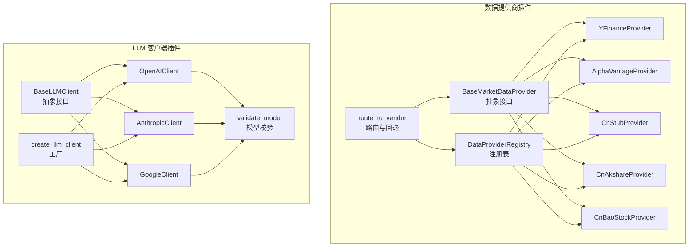
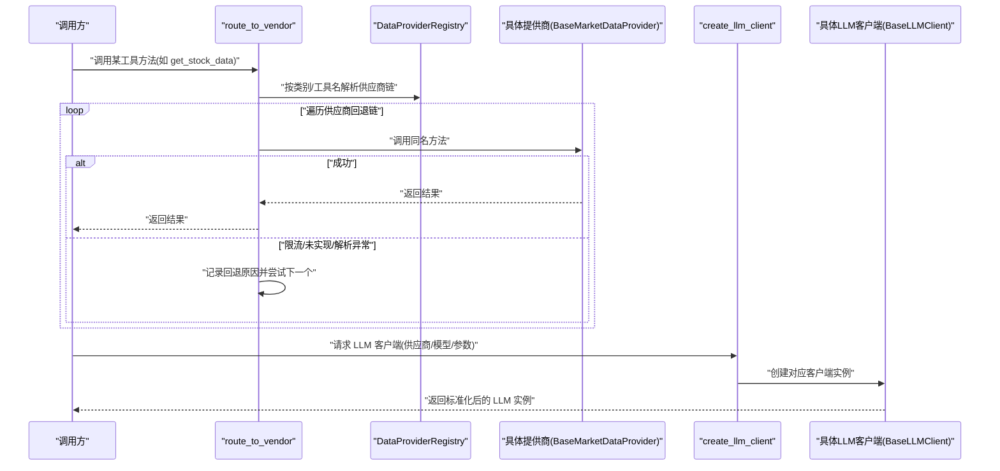
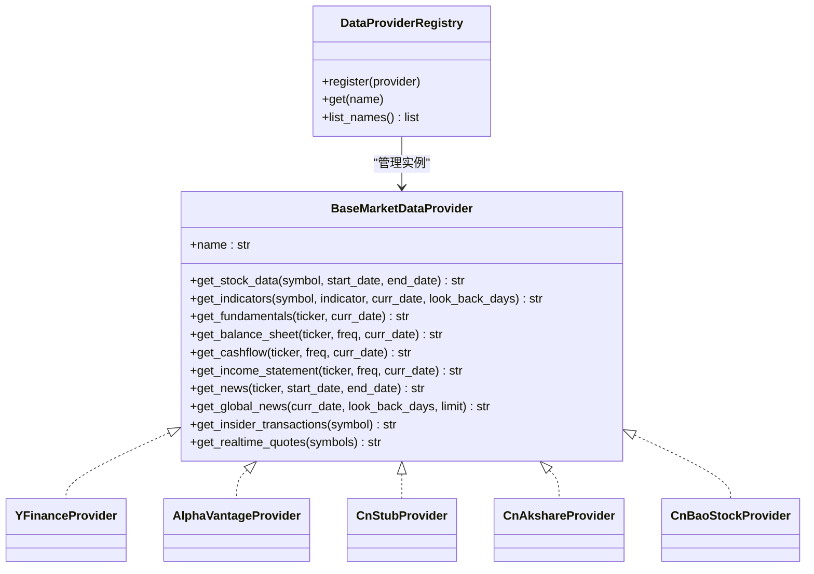
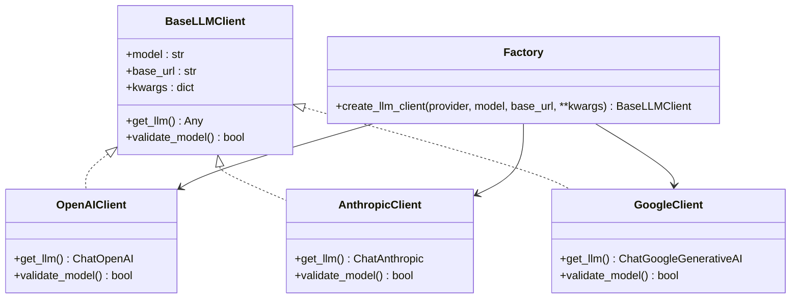
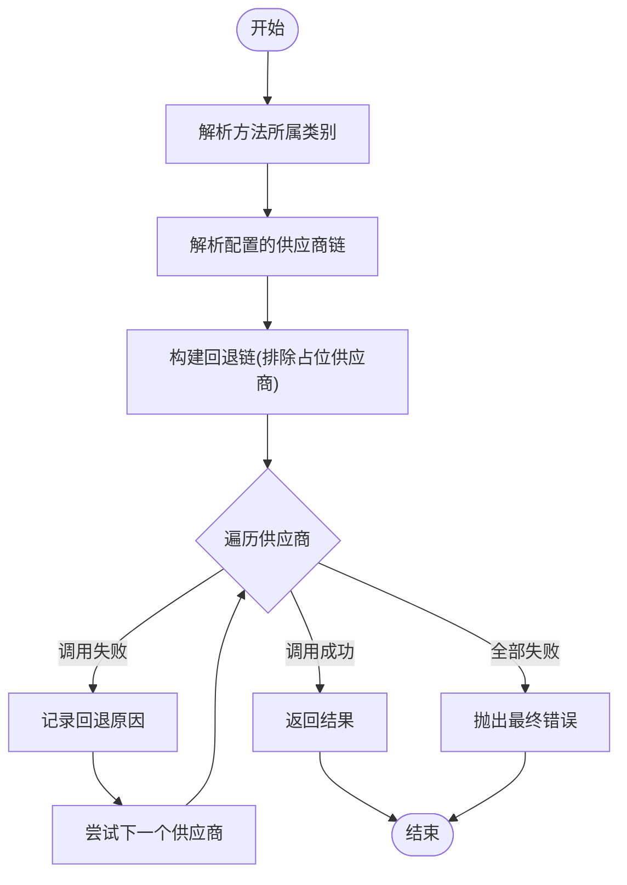
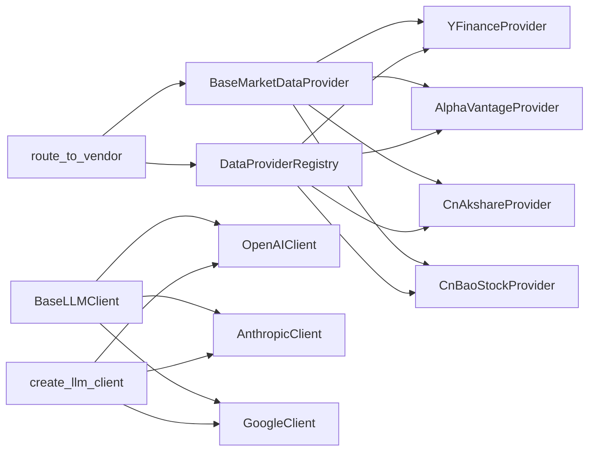

# 插件开发

<cite>
**本文引用的文件**
- [tradingagents/dataflows/providers/base.py](file://tradingagents/dataflows/providers/base.py)
- [tradingagents/dataflows/providers/registry.py](file://tradingagents/dataflows/providers/registry.py)
- [tradingagents/dataflows/interface.py](file://tradingagents/dataflows/interface.py)
- [tradingagents/dataflows/providers/yfinance_provider.py](file://tradingagents/dataflows/providers/yfinance_provider.py)
- [tradingagents/dataflows/providers/alpha_vantage_provider.py](file://tradingagents/dataflows/providers/alpha_vantage_provider.py)
- [tradingagents/dataflows/providers/china_equity_provider.py](file://tradingagents/dataflows/providers/china_equity_provider.py)
- [tradingagents/dataflows/providers/cn_akshare_provider.py](file://tradingagents/dataflows/providers/cn_akshare_provider.py)
- [tradingagents/dataflows/providers/cn_baostock_provider.py](file://tradingagents/dataflows/providers/cn_baostock_provider.py)
- [tradingagents/llm_clients/base_client.py](file://tradingagents/llm_clients/base_client.py)
- [tradingagents/llm_clients/factory.py](file://tradingagents/llm_clients/factory.py)
- [tradingagents/llm_clients/openai_client.py](file://tradingagents/llm_clients/openai_client.py)
- [tradingagents/llm_clients/anthropic_client.py](file://tradingagents/llm_clients/anthropic_client.py)
- [tradingagents/llm_clients/google_client.py](file://tradingagents/llm_clients/google_client.py)
- [tradingagents/llm_clients/validators.py](file://tradingagents/llm_clients/validators.py)
- [tradingagents/default_config.py](file://tradingagents/default_config.py)
</cite>

## 目录
1. [简介](#简介)
2. [项目结构](#项目结构)
3. [核心组件](#核心组件)
4. [架构总览](#架构总览)
5. [详细组件分析](#详细组件分析)
6. [依赖分析](#依赖分析)
7. [性能考虑](#性能考虑)
8. [故障排查指南](#故障排查指南)
9. [结论](#结论)
10. [附录](#附录)

## 简介
本文件面向开发者，系统性讲解 TradingAgents-AShare 的插件体系：数据提供商插件与 LLM 客户端插件的架构、扩展点、实现规范、生命周期与配置加载、动态路由与回退策略、错误处理与性能优化，并提供完整开发示例、测试与调试建议。

## 项目结构
围绕“插件”主题，核心目录与文件如下：
- 数据流与数据提供商插件
  - 抽象基类：[BaseMarketDataProvider:4-67](file://tradingagents/dataflows/providers/base.py#L4-L67)
  - 注册表与默认注册：[DataProviderRegistry:11-35](file://tradingagents/dataflows/providers/registry.py#L11-L35)、[build_default_registry:27-35](file://tradingagents/dataflows/providers/registry.py#L27-L35)
  - 统一路由与回退：[route_to_vendor:125-181](file://tradingagents/dataflows/interface.py#L125-L181)
  - 具体提供商实现：[YFinanceProvider:14-64](file://tradingagents/dataflows/providers/yfinance_provider.py#L14-L64)、[AlphaVantageProvider:15-57](file://tradingagents/dataflows/providers/alpha_vantage_provider.py#L15-L57)、[CnStubProvider:4-55](file://tradingagents/dataflows/providers/china_equity_provider.py#L4-L55)、[CnAkshareProvider:127-1122](file://tradingagents/dataflows/providers/cn_akshare_provider.py#L127-L1122)、[CnBaoStockProvider:14-209](file://tradingagents/dataflows/providers/cn_baostock_provider.py#L14-L209)
- LLM 客户端插件
  - 抽象基类：[BaseLLMClient:5-22](file://tradingagents/llm_clients/base_client.py#L5-L22)
  - 工厂与多供应商适配：[create_llm_client:9-44](file://tradingagents/llm_clients/factory.py#L9-L44)
  - 具体客户端：[OpenAIClient:69-126](file://tradingagents/llm_clients/openai_client.py#L69-L126)、[AnthropicClient:65-91](file://tradingagents/llm_clients/anthropic_client.py#L65-L91)、[GoogleClient:31-68](file://tradingagents/llm_clients/google_client.py#L31-L68)
  - 参数标准化与校验：[UnifiedChatOpenAI:15-67](file://tradingagents/llm_clients/openai_client.py#L15-L67)、[NormalizedChatAnthropic:34-63](file://tradingagents/llm_clients/anthropic_client.py#L34-L63)、[NormalizedChatGoogleGenerativeAI:9-29](file://tradingagents/llm_clients/google_client.py#L9-L29)、[validate_model:69-83](file://tradingagents/llm_clients/validators.py#L69-L83)
- 配置与工具分类
  - 默认配置：[DEFAULT_CONFIG:3-43](file://tradingagents/default_config.py#L3-L43)
  - 工具分类与路由配置：[TOOLS_CATEGORIES:8-48](file://tradingagents/dataflows/interface.py#L8-L48)、[get_vendor:96-106](file://tradingagents/dataflows/interface.py#L96-L106)

图表来源
- [tradingagents/dataflows/providers/base.py:4-67](file://tradingagents/dataflows/providers/base.py#L4-L67)
- [tradingagents/dataflows/providers/registry.py:11-35](file://tradingagents/dataflows/providers/registry.py#L11-L35)
- [tradingagents/dataflows/interface.py:125-181](file://tradingagents/dataflows/interface.py#L125-L181)
- [tradingagents/dataflows/providers/yfinance_provider.py:14-64](file://tradingagents/dataflows/providers/yfinance_provider.py#L14-L64)
- [tradingagents/dataflows/providers/alpha_vantage_provider.py:15-57](file://tradingagents/dataflows/providers/alpha_vantage_provider.py#L15-L57)
- [tradingagents/dataflows/providers/china_equity_provider.py:4-55](file://tradingagents/dataflows/providers/china_equity_provider.py#L4-L55)
- [tradingagents/dataflows/providers/cn_akshare_provider.py:127-1122](file://tradingagents/dataflows/providers/cn_akshare_provider.py#L127-L1122)
- [tradingagents/dataflows/providers/cn_baostock_provider.py:14-209](file://tradingagents/dataflows/providers/cn_baostock_provider.py#L14-L209)
- [tradingagents/llm_clients/base_client.py:5-22](file://tradingagents/llm_clients/base_client.py#L5-L22)
- [tradingagents/llm_clients/factory.py:9-44](file://tradingagents/llm_clients/factory.py#L9-L44)
- [tradingagents/llm_clients/openai_client.py:69-126](file://tradingagents/llm_clients/openai_client.py#L69-L126)
- [tradingagents/llm_clients/anthropic_client.py:65-91](file://tradingagents/llm_clients/anthropic_client.py#L65-L91)
- [tradingagents/llm_clients/google_client.py:31-68](file://tradingagents/llm_clients/google_client.py#L31-L68)
- [tradingagents/llm_clients/validators.py:69-83](file://tradingagents/llm_clients/validators.py#L69-L83)

章节来源
- [tradingagents/dataflows/providers/base.py:4-67](file://tradingagents/dataflows/providers/base.py#L4-L67)
- [tradingagents/dataflows/providers/registry.py:11-35](file://tradingagents/dataflows/providers/registry.py#L11-L35)
- [tradingagents/dataflows/interface.py:8-181](file://tradingagents/dataflows/interface.py#L8-L181)
- [tradingagents/llm_clients/base_client.py:5-22](file://tradingagents/llm_clients/base_client.py#L5-L22)
- [tradingagents/llm_clients/factory.py:9-44](file://tradingagents/llm_clients/factory.py#L9-L44)
- [tradingagents/default_config.py:3-43](file://tradingagents/default_config.py#L3-L43)

## 核心组件
- 数据提供商插件
  - 抽象接口：定义统一的数据获取方法族，覆盖日线、技术指标、财务报表、新闻与实时行情等。
  - 注册表：集中注册与检索具体提供商实例，支持默认注册与动态扩展。
  - 路由与回退：根据配置选择主供应商，自动构建回退链，遇到限流/未实现/解析异常时自动切换下一个供应商。
- LLM 客户端插件
  - 抽象接口：统一 LLM 获取与模型校验能力。
  - 工厂：按供应商名称创建对应客户端，支持 OpenAI、Anthropic、Google、xAI、Ollama、OpenRouter。
  - 参数标准化：针对不同供应商与模型特性，进行温度、超时、推理模式、思维预算等参数归一化处理。
  - 模型校验：对已知供应商的模型白名单进行校验，其余供应商放行以支持本地/自定义部署。

章节来源
- [tradingagents/dataflows/providers/base.py:4-67](file://tradingagents/dataflows/providers/base.py#L4-L67)
- [tradingagents/dataflows/providers/registry.py:11-35](file://tradingagents/dataflows/providers/registry.py#L11-L35)
- [tradingagents/dataflows/interface.py:125-181](file://tradingagents/dataflows/interface.py#L125-L181)
- [tradingagents/llm_clients/base_client.py:5-22](file://tradingagents/llm_clients/base_client.py#L5-L22)
- [tradingagents/llm_clients/factory.py:9-44](file://tradingagents/llm_clients/factory.py#L9-L44)
- [tradingagents/llm_clients/validators.py:69-83](file://tradingagents/llm_clients/validators.py#L69-L83)

## 架构总览
数据与 LLM 插件通过清晰的分层与接口解耦，实现高可扩展与高鲁棒性：

图表来源
- [tradingagents/dataflows/interface.py:125-181](file://tradingagents/dataflows/interface.py#L125-L181)
- [tradingagents/dataflows/providers/registry.py:11-35](file://tradingagents/dataflows/providers/registry.py#L11-L35)
- [tradingagents/llm_clients/factory.py:9-44](file://tradingagents/llm_clients/factory.py#L9-L44)

## 详细组件分析

### 数据提供商插件开发指南
- 实现步骤
  1) 实现抽象接口
     - 参考：[BaseMarketDataProvider:4-67](file://tradingagents/dataflows/providers/base.py#L4-L67)
     - 必须实现：name 属性、各类数据获取方法（日线、指标、财务、新闻、实时等）
  2) 注册到注册表
     - 在默认注册器中注册：参考 [build_default_registry:27-35](file://tradingagents/dataflows/providers/registry.py#L27-L35)
     - 或在运行时通过 [DataProviderRegistry.register:17-18](file://tradingagents/dataflows/providers/registry.py#L17-L18) 动态注册
  3) 处理数据格式转换
     - 统一输出字符串/CSV/Markdown 等人类可读格式，便于下游处理
     - 示例：[CnAkshareProvider._format_ak_hist:241-253](file://tradingagents/dataflows/providers/cn_akshare_provider.py#L241-L253)、[YFinanceProvider:26-63](file://tradingagents/dataflows/providers/yfinance_provider.py#L26-L63)
  4) 错误处理与回退
     - 对于临时性错误（如限流/网络抖动），抛出受控异常以便路由自动回退
     - 对于“未实现”的功能，抛出 NotImplementedError
     - 参考路由逻辑：[route_to_vendor:125-181](file://tradingagents/dataflows/interface.py#L125-L181)
  5) 并发与稳定性
     - 使用并发锁与僵尸线程回收机制，避免外部库反爬/全局状态问题
     - 参考：[CnAkshareProvider 并发控制与锁:42-125](file://tradingagents/dataflows/providers/cn_akshare_provider.py#L42-L125)
  6) 配置与路由
     - 通过配置决定工具类别对应的供应商链，参考：
       - 工具分类：[TOOLS_CATEGORIES:8-48](file://tradingagents/dataflows/interface.py#L8-L48)
       - 供应商解析：[get_vendor:96-106](file://tradingagents/dataflows/interface.py#L96-L106)
       - 回退链构建：[route_to_vendor:108-122](file://tradingagents/dataflows/interface.py#L108-L122)

图表来源
- [tradingagents/dataflows/providers/base.py:4-67](file://tradingagents/dataflows/providers/base.py#L4-L67)
- [tradingagents/dataflows/providers/yfinance_provider.py:14-64](file://tradingagents/dataflows/providers/yfinance_provider.py#L14-L64)
- [tradingagents/dataflows/providers/alpha_vantage_provider.py:15-57](file://tradingagents/dataflows/providers/alpha_vantage_provider.py#L15-L57)
- [tradingagents/dataflows/providers/china_equity_provider.py:4-55](file://tradingagents/dataflows/providers/china_equity_provider.py#L4-L55)
- [tradingagents/dataflows/providers/cn_akshare_provider.py:127-1122](file://tradingagents/dataflows/providers/cn_akshare_provider.py#L127-L1122)
- [tradingagents/dataflows/providers/cn_baostock_provider.py:14-209](file://tradingagents/dataflows/providers/cn_baostock_provider.py#L14-L209)
- [tradingagents/dataflows/providers/registry.py:11-35](file://tradingagents/dataflows/providers/registry.py#L11-L35)

章节来源
- [tradingagents/dataflows/providers/base.py:4-67](file://tradingagents/dataflows/providers/base.py#L4-L67)
- [tradingagents/dataflows/providers/registry.py:11-35](file://tradingagents/dataflows/providers/registry.py#L11-L35)
- [tradingagents/dataflows/interface.py:8-181](file://tradingagents/dataflows/interface.py#L8-L181)
- [tradingagents/dataflows/providers/yfinance_provider.py:14-64](file://tradingagents/dataflows/providers/yfinance_provider.py#L14-L64)
- [tradingagents/dataflows/providers/alpha_vantage_provider.py:15-57](file://tradingagents/dataflows/providers/alpha_vantage_provider.py#L15-L57)
- [tradingagents/dataflows/providers/china_equity_provider.py:4-55](file://tradingagents/dataflows/providers/china_equity_provider.py#L4-L55)
- [tradingagents/dataflows/providers/cn_akshare_provider.py:127-1122](file://tradingagents/dataflows/providers/cn_akshare_provider.py#L127-L1122)
- [tradingagents/dataflows/providers/cn_baostock_provider.py:14-209](file://tradingagents/dataflows/providers/cn_baostock_provider.py#L14-L209)

### LLM 客户端插件开发指南
- 实现步骤
  1) 实现抽象接口
     - 参考：[BaseLLMClient:5-22](file://tradingagents/llm_clients/base_client.py#L5-L22)
     - 必须实现：get_llm 返回标准化 LLM 实例；validate_model 进行模型校验
  2) 支持多供应商适配
     - 通过工厂按供应商名称创建客户端：参考 [create_llm_client:9-44](file://tradingagents/llm_clients/factory.py#L9-L44)
     - 已支持：OpenAI、xAI、OpenRouter、Ollama、Anthropic、Google
  3) 参数标准化
     - OpenAI：统一温度、禁用重试、设置超长超时、适配推理模型参数差异：参考 [UnifiedChatOpenAI:15-67](file://tradingagents/llm_clients/openai_client.py#L15-L67)
     - Anthropic：统一内容输出为字符串，处理思维块：参考 [NormalizedChatAnthropic:34-63](file://tradingagents/llm_clients/anthropic_client.py#L34-L63)
     - Google：统一内容输出为字符串，映射思维等级/预算：参考 [NormalizedChatGoogleGenerativeAI:9-29](file://tradingagents/llm_clients/google_client.py#L9-L29)
  4) 连接池与稳定性
     - 采用 LangChain 客户端，按需传入回调/超时/重试等参数；避免在应用侧重复管理连接池
  5) 模型校验
     - 使用白名单校验：参考 [validate_model:69-83](file://tradingagents/llm_clients/validators.py#L69-L83)
     - 对于 Ollama/OpenRouter 等放行策略，保持灵活性

图表来源
- [tradingagents/llm_clients/base_client.py:5-22](file://tradingagents/llm_clients/base_client.py#L5-L22)
- [tradingagents/llm_clients/factory.py:9-44](file://tradingagents/llm_clients/factory.py#L9-L44)
- [tradingagents/llm_clients/openai_client.py:69-126](file://tradingagents/llm_clients/openai_client.py#L69-L126)
- [tradingagents/llm_clients/anthropic_client.py:65-91](file://tradingagents/llm_clients/anthropic_client.py#L65-L91)
- [tradingagents/llm_clients/google_client.py:31-68](file://tradingagents/llm_clients/google_client.py#L31-L68)
- [tradingagents/llm_clients/validators.py:69-83](file://tradingagents/llm_clients/validators.py#L69-L83)

章节来源
- [tradingagents/llm_clients/base_client.py:5-22](file://tradingagents/llm_clients/base_client.py#L5-L22)
- [tradingagents/llm_clients/factory.py:9-44](file://tradingagents/llm_clients/factory.py#L9-L44)
- [tradingagents/llm_clients/openai_client.py:69-126](file://tradingagents/llm_clients/openai_client.py#L69-L126)
- [tradingagents/llm_clients/anthropic_client.py:65-91](file://tradingagents/llm_clients/anthropic_client.py#L65-L91)
- [tradingagents/llm_clients/google_client.py:31-68](file://tradingagents/llm_clients/google_client.py#L31-L68)
- [tradingagents/llm_clients/validators.py:69-83](file://tradingagents/llm_clients/validators.py#L69-L83)

### 路由与回退流程（算法）

图表来源
- [tradingagents/dataflows/interface.py:108-181](file://tradingagents/dataflows/interface.py#L108-L181)

章节来源
- [tradingagents/dataflows/interface.py:108-181](file://tradingagents/dataflows/interface.py#L108-L181)

## 依赖分析
- 组件耦合
  - 数据提供商插件与路由层松耦合：通过接口与注册表交互，新增提供商无需修改路由逻辑
  - LLM 客户端与工厂松耦合：通过抽象接口与工厂创建，新增供应商只需扩展工厂分支与客户端实现
- 外部依赖
  - 数据提供商：akshare、baostock、yfinance、Alpha Vantage 等第三方库
  - LLM 客户端：langchain-* 生态（OpenAI、Anthropic、Google GenAI）
- 潜在循环依赖
  - 当前文件间无循环导入；新增插件时应避免在接口文件中直接导入具体实现

图表来源
- [tradingagents/dataflows/providers/base.py:4-67](file://tradingagents/dataflows/providers/base.py#L4-L67)
- [tradingagents/dataflows/providers/registry.py:11-35](file://tradingagents/dataflows/providers/registry.py#L11-L35)
- [tradingagents/dataflows/interface.py:125-181](file://tradingagents/dataflows/interface.py#L125-L181)
- [tradingagents/llm_clients/base_client.py:5-22](file://tradingagents/llm_clients/base_client.py#L5-L22)
- [tradingagents/llm_clients/factory.py:9-44](file://tradingagents/llm_clients/factory.py#L9-L44)

章节来源
- [tradingagents/dataflows/providers/base.py:4-67](file://tradingagents/dataflows/providers/base.py#L4-L67)
- [tradingagents/dataflows/providers/registry.py:11-35](file://tradingagents/dataflows/providers/registry.py#L11-L35)
- [tradingagents/dataflows/interface.py:125-181](file://tradingagents/dataflows/interface.py#L125-L181)
- [tradingagents/llm_clients/base_client.py:5-22](file://tradingagents/llm_clients/base_client.py#L5-L22)
- [tradingagents/llm_clients/factory.py:9-44](file://tradingagents/llm_clients/factory.py#L9-L44)

## 性能考虑
- 数据提供商
  - 并发控制：使用信号量与僵尸线程回收，限制总并发与定时任务并发，避免外部库反爬与状态阻塞
    - 参考：[CnAkshareProvider 并发锁:42-125](file://tradingagents/dataflows/providers/cn_akshare_provider.py#L42-L125)
  - 缓存：对热点接口（如实时行情）增加短 TTL 缓存，降低外部依赖压力
    - 参考：[CnAkshareProvider 实时缓存字段:704-708](file://tradingagents/dataflows/providers/cn_akshare_provider.py#L704-L708)
  - 数据清洗与列映射：统一列名与类型，减少下游处理成本
    - 参考：[CnAkshareProvider 列映射与清洗:198-239](file://tradingagents/dataflows/providers/cn_akshare_provider.py#L198-L239)
- LLM 客户端
  - 统一禁用重试、设置长超时，避免推理模型重复扣费与状态丢失
    - 参考：[OpenAIClient 初始化:82-122](file://tradingagents/llm_clients/openai_client.py#L82-L122)
  - 参数归一化：屏蔽供应商差异，简化调用端逻辑
    - 参考：[UnifiedChatOpenAI:15-67](file://tradingagents/llm_clients/openai_client.py#L15-L67)、[NormalizedChatAnthropic:34-63](file://tradingagents/llm_clients/anthropic_client.py#L34-L63)、[NormalizedChatGoogleGenerativeAI:9-29](file://tradingagents/llm_clients/google_client.py#L9-L29)

## 故障排查指南
- 数据提供商
  - 现象：方法未实现或返回空数据
    - 排查：确认具体提供商是否实现了该方法；参考 [CnStubProvider:13-17](file://tradingagents/dataflows/providers/china_equity_provider.py#L13-L17)
  - 现象：路由失败，提示无可用供应商
    - 排查：检查配置中的供应商链与占位供应商过滤逻辑；参考 [route_to_vendor:108-122](file://tradingagents/dataflows/interface.py#L108-L122)
  - 现象：并发阻塞或超时
    - 排查：查看并发锁与僵尸回收日志；参考 [CnAkshareProvider 锁日志:79-80](file://tradingagents/dataflows/providers/cn_akshare_provider.py#L79-L80)
- LLM 客户端
  - 现象：参数不生效或报错
    - 排查：确认参数是否被归一化/映射；参考各客户端的参数处理逻辑
  - 现象：模型不可用
    - 排查：检查模型白名单；参考 [validate_model:69-83](file://tradingagents/llm_clients/validators.py#L69-L83)

章节来源
- [tradingagents/dataflows/providers/china_equity_provider.py:13-17](file://tradingagents/dataflows/providers/china_equity_provider.py#L13-L17)
- [tradingagents/dataflows/interface.py:108-122](file://tradingagents/dataflows/interface.py#L108-L122)
- [tradingagents/dataflows/providers/cn_akshare_provider.py:79-80](file://tradingagents/dataflows/providers/cn_akshare_provider.py#L79-L80)
- [tradingagents/llm_clients/validators.py:69-83](file://tradingagents/llm_clients/validators.py#L69-L83)

## 结论
TradingAgents-AShare 的插件体系通过抽象接口、注册表与工厂模式，实现了数据提供商与 LLM 客户端的高扩展性与强鲁棒性。开发者遵循本文档的实现规范与最佳实践，即可快速开发并集成新的插件，同时确保配置、路由、回退、错误处理与性能的统一治理。

## 附录

### 开发示例（步骤说明）
- 自定义数据提供商插件
  1) 创建类并继承 [BaseMarketDataProvider:4-67](file://tradingagents/dataflows/providers/base.py#L4-L67)
  2) 实现 name 与各数据方法
  3) 在 [build_default_registry:27-35](file://tradingagents/dataflows/providers/registry.py#L27-L35) 中注册，或运行时通过 [DataProviderRegistry.register:17-18](file://tradingagents/dataflows/providers/registry.py#L17-L18) 注册
  4) 在配置中为相应工具类别设置供应商链，参考 [DEFAULT_CONFIG.data_vendors:34-41](file://tradingagents/default_config.py#L34-L41)
  5) 如需实时行情，实现 [get_realtime_quotes:59-66](file://tradingagents/dataflows/providers/base.py#L59-L66)，并参考现有实现的并发与缓存策略
- 自定义 LLM 客户端插件
  1) 创建类并继承 [BaseLLMClient:5-22](file://tradingagents/llm_clients/base_client.py#L5-L22)
  2) 在 [factory.create_llm_client:9-44](file://tradingagents/llm_clients/factory.py#L9-L44) 中添加分支，支持新供应商标识
  3) 实现 [get_llm:13-16](file://tradingagents/llm_clients/base_client.py#L13-L16) 与 [validate_model:18-21](file://tradingagents/llm_clients/base_client.py#L18-L21)，并在客户端内部完成参数归一化
  4) 在配置中设置默认供应商与模型，参考 [DEFAULT_CONFIG.llm_provider:11-13](file://tradingagents/default_config.py#L11-L13)

章节来源
- [tradingagents/dataflows/providers/base.py:4-67](file://tradingagents/dataflows/providers/base.py#L4-L67)
- [tradingagents/dataflows/providers/registry.py:17-35](file://tradingagents/dataflows/providers/registry.py#L17-L35)
- [tradingagents/default_config.py:11-41](file://tradingagents/default_config.py#L11-L41)
- [tradingagents/llm_clients/base_client.py:5-22](file://tradingagents/llm_clients/base_client.py#L5-L22)
- [tradingagents/llm_clients/factory.py:9-44](file://tradingagents/llm_clients/factory.py#L9-L44)

### 测试与调试建议
- 单元测试
  - 数据提供商：模拟外部库返回，验证数据格式转换与异常路径
  - LLM 客户端：构造最小参数集，验证参数归一化与模型校验
- 调试技巧
  - 启用路由跟踪日志：参考 [route_to_vendor 跟踪:64-67](file://tradingagents/dataflows/interface.py#L64-L67) 与 [get_vendor:96-106](file://tradingagents/dataflows/interface.py#L96-L106)
  - 设置环境变量 LOG_LEVEL=DEBUG 观察 LLM 请求/响应详情：参考 [UnifiedChatOpenAI:26-28](file://tradingagents/llm_clients/openai_client.py#L26-L28)

章节来源
- [tradingagents/dataflows/interface.py:64-106](file://tradingagents/dataflows/interface.py#L64-L106)
- [tradingagents/llm_clients/openai_client.py:26-28](file://tradingagents/llm_clients/openai_client.py#L26-L28)

### 插件兼容性检查清单
- 数据提供商
  - 是否实现 name 属性与所有必需方法
  - 是否正确处理符号标准化与数据清洗
  - 是否遵守并发与超时限制
  - 是否在默认注册器中注册
- LLM 客户端
  - 是否实现 get_llm 与 validate_model
  - 是否对参数进行归一化处理
  - 是否支持主流模型命名与推理模式
  - 是否在工厂中注册供应商标识

章节来源
- [tradingagents/dataflows/providers/base.py:4-67](file://tradingagents/dataflows/providers/base.py#L4-L67)
- [tradingagents/dataflows/providers/registry.py:17-35](file://tradingagents/dataflows/providers/registry.py#L17-L35)
- [tradingagents/llm_clients/base_client.py:5-22](file://tradingagents/llm_clients/base_client.py#L5-L22)
- [tradingagents/llm_clients/factory.py:9-44](file://tradingagents/llm_clients/factory.py#L9-L44)