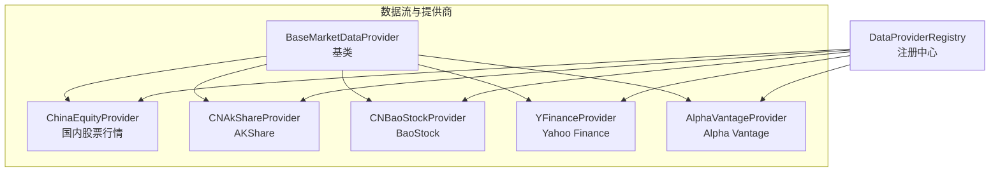
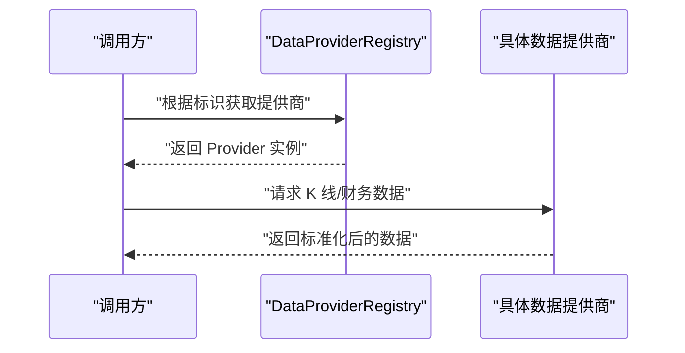
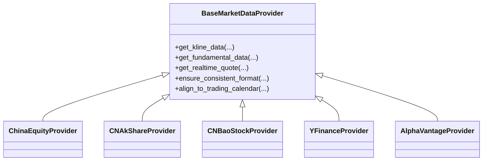
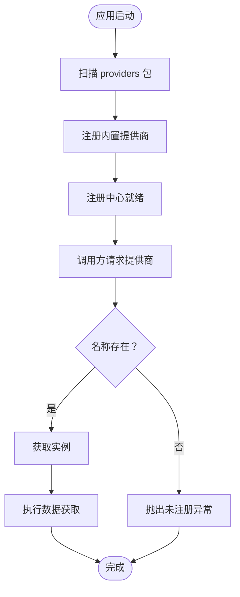
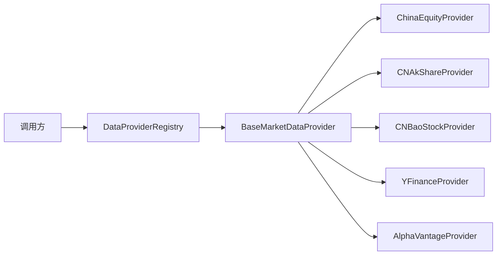

# 数据提供商插件

<cite>
**本文引用的文件**
- [base.py](file://tradingagents/dataflows/providers/base.py)
- [registry.py](file://tradingagents/dataflows/providers/registry.py)
- [china_equity_provider.py](file://tradingagents/dataflows/providers/china_equity_provider.py)
- [cn_akshare_provider.py](file://tradingagents/dataflows/providers/cn_akshare_provider.py)
- [cn_baostock_provider.py](file://tradingagents/dataflows/providers/cn_baostock_provider.py)
- [yfinance_provider.py](file://tradingagents/dataflows/providers/yfinance_provider.py)
- [alpha_vantage_provider.py](file://tradingagents/dataflows/providers/alpha_vantage_provider.py)
- [test_realtime_quote_provider.py](file://tests/test_realtime_quote_provider.py)
</cite>

## 目录
1. [引言](#引言)
2. [项目结构](#项目结构)
3. [核心组件](#核心组件)
4. [架构总览](#架构总览)
5. [详细组件分析](#详细组件分析)
6. [依赖关系分析](#依赖关系分析)
7. [性能考量](#性能考量)
8. [故障排查指南](#故障排查指南)
9. [结论](#结论)
10. [附录](#附录)

## 引言
本文件面向希望在 TradingAgents-AShare 中开发“数据提供商插件”的工程师与研究者，系统性阐述 BaseMarketDataProvider 基类的设计理念、接口规范与实现要求；详解如何继承该基类并实现具体的数据获取方法（如 K 线与财务数据），说明数据格式标准化流程（时间序列、字段映射、数据校验）；解释插件注册与动态加载机制（DataProviderRegistry 的使用）；并提供从零到一的完整开发示例、异常处理与性能优化建议，以及数据质量检查、缓存策略与并发安全注意事项。

## 项目结构
数据提供商插件位于 tradingagents/dataflows/providers 目录下，采用“按功能模块划分 + 统一基类 + 注册中心”的组织方式：
- 基类：统一抽象接口与通用能力
- 具体提供商：针对不同数据源（如 akshare、baostock、yfinance、alpha_vantage、国内股票行情等）
- 注册中心：集中管理与动态加载

图表来源
- [base.py](file://tradingagents/dataflows/providers/base.py)
- [registry.py](file://tradingagents/dataflows/providers/registry.py)
- [china_equity_provider.py](file://tradingagents/dataflows/providers/china_equity_provider.py)
- [cn_akshare_provider.py](file://tradingagents/dataflows/providers/cn_akshare_provider.py)
- [cn_baostock_provider.py](file://tradingagents/dataflows/providers/cn_baostock_provider.py)
- [yfinance_provider.py](file://tradingagents/dataflows/providers/yfinance_provider.py)
- [alpha_vantage_provider.py](file://tradingagents/dataflows/providers/alpha_vantage_provider.py)

章节来源
- [base.py](file://tradingagents/dataflows/providers/base.py)
- [registry.py](file://tradingagents/dataflows/providers/registry.py)

## 核心组件
- BaseMarketDataProvider（基类）
  - 职责：定义统一的数据接口契约（如获取 K 线、财务数据等）、提供通用工具（如时间序列对齐、字段映射、基础校验）与错误处理框架
  - 关键点：子类需实现约定方法；遵循统一的数据格式标准；具备可扩展的注册与加载机制
- DataProviderRegistry（注册中心）
  - 职责：集中注册与发现数据提供商；支持动态加载与按名称检索；为上层调用方屏蔽具体实现差异
- 具体提供商（示例）
  - 国内股票行情、AKShare、BaoStock、Yahoo Finance、Alpha Vantage 等，均继承基类并实现各自的数据拉取逻辑

章节来源
- [base.py](file://tradingagents/dataflows/providers/base.py)
- [registry.py](file://tradingagents/dataflows/providers/registry.py)

## 架构总览
下图展示“注册中心”与“具体提供商”的交互关系，以及调用方通过注册中心获取具体提供商实例的典型流程。

图表来源
- [registry.py](file://tradingagents/dataflows/providers/registry.py)
- [base.py](file://tradingagents/dataflows/providers/base.py)

## 详细组件分析

### BaseMarketDataProvider 基类设计与接口规范
- 设计原则
  - 明确职责边界：仅负责接口契约、通用工具与错误处理，不直接绑定具体数据源
  - 可扩展性：通过继承扩展新提供商；通过注册中心统一管理
  - 数据一致性：强制统一的数据格式与字段语义，便于后续分析与可视化
- 接口规范（示例方法族）
  - 获取 K 线数据：get_kline_data(symbol, timeframe, start_time, end_time, ...)
  - 获取财务数据：get_fundamental_data(symbol, fields, start_time, end_time, ...)
  - 获取实时行情：get_realtime_quote(symbol, ...)
  - 数据标准化：ensure_consistent_format(df, required_fields, time_field)
  - 时间序列对齐：align_to_trading_calendar(df, calendar)
- 错误处理机制
  - 参数校验失败：抛出明确的参数异常
  - 数据源不可用：抛出连接或超时异常，并记录重试策略
  - 数据为空或不完整：抛出数据缺失异常，并提供降级策略
  - 并发安全：在关键路径上加锁或使用线程安全的数据结构

图表来源
- [base.py](file://tradingagents/dataflows/providers/base.py)
- [china_equity_provider.py](file://tradingagents/dataflows/providers/china_equity_provider.py)
- [cn_akshare_provider.py](file://tradingagents/dataflows/providers/cn_akshare_provider.py)
- [cn_baostock_provider.py](file://tradingagents/dataflows/providers/cn_baostock_provider.py)
- [yfinance_provider.py](file://tradingagents/dataflows/providers/yfinance_provider.py)
- [alpha_vantage_provider.py](file://tradingagents/dataflows/providers/alpha_vantage_provider.py)

章节来源
- [base.py](file://tradingagents/dataflows/providers/base.py)

### 如何继承 BaseMarketDataProvider 并实现具体方法
- 继承步骤
  - 新建类并继承 BaseMarketDataProvider
  - 实现 get_kline_data：按统一格式返回时间序列数据（含时间戳、开盘/最高/最低/收盘/成交量等）
  - 实现 get_fundamental_data：按统一字段映射返回财务指标（如市盈率、每股收益、净资产等）
  - 实现 get_realtime_quote：返回最新报价与交易量等
  - 在实现中调用 ensure_consistent_format 与 align_to_trading_calendar，确保输出一致
- 数据格式标准化流程
  - 时间序列处理：统一以时间戳列为主键，按交易日对齐，填充缺失值或标记空值
  - 字段映射：将各数据源的字段映射到统一命名（如 close -> 收盘价）
  - 数据验证：检查必填字段、数值范围、重复时间戳、缺失比例等
- 错误处理
  - 对输入参数进行严格校验（时间范围、symbol 合法性）
  - 对网络/服务端异常进行分类捕获与重试
  - 对空结果进行降级（如回退到缓存或历史数据）

章节来源
- [base.py](file://tradingagents/dataflows/providers/base.py)
- [china_equity_provider.py](file://tradingagents/dataflows/providers/china_equity_provider.py)
- [cn_akshare_provider.py](file://tradingagents/dataflows/providers/cn_akshare_provider.py)
- [cn_baostock_provider.py](file://tradingagents/dataflows/providers/cn_baostock_provider.py)
- [yfinance_provider.py](file://tradingagents/dataflows/providers/yfinance_provider.py)
- [alpha_vantage_provider.py](file://tradingagents/dataflows/providers/alpha_vantage_provider.py)

### 插件注册机制与动态加载
- DataProviderRegistry 的职责
  - 提供注册接口：register(name, provider_class)
  - 提供查找接口：get_provider(name)
  - 支持延迟加载：按需实例化提供商
- 动态加载流程
  - 应用启动时扫描 providers 包，自动注册内置提供商
  - 运行时可通过配置启用/禁用特定提供商
  - 调用方通过名称从注册中心获取实例，避免硬编码依赖

图表来源
- [registry.py](file://tradingagents/dataflows/providers/registry.py)

章节来源
- [registry.py](file://tradingagents/dataflows/providers/registry.py)

### 完整开发示例（从零到一）
- 步骤概览
  - 创建新类继承 BaseMarketDataProvider
  - 实现 get_kline_data 与 get_fundamental_data
  - 在 __init__.py 或注册脚本中注册新提供商
  - 编写单元测试覆盖正常/异常场景
  - 配置文件启用新提供商（如需要）
- 配置文件编写
  - 在配置中新增提供商项，指定名称、启用状态、鉴权信息（如适用）
  - 指定默认时间范围、缓存策略、并发限制等
- 异常处理
  - 对网络超时、服务端限流、数据为空等场景分别处理
  - 记录详细日志，便于定位问题
- 性能优化
  - 批量请求与分页处理
  - 结果缓存与失效策略
  - 多线程/异步并发拉取多个 symbol
- 数据质量检查
  - 缺失值检测与填充策略
  - 重复与异常值清洗
  - 与交易日历对齐
- 缓存策略
  - LRU/基于 TTL 的内存缓存
  - 文件/Redis 缓存持久化
  - 缓存键设计：包含 symbol、时间粒度、时间范围
- 并发安全
  - 使用线程安全的数据结构
  - 对共享资源加锁
  - 避免竞态条件与死锁

章节来源
- [base.py](file://tradingagents/dataflows/providers/base.py)
- [registry.py](file://tradingagents/dataflows/providers/registry.py)
- [test_realtime_quote_provider.py](file://tests/test_realtime_quote_provider.py)

## 依赖关系分析
- 组件耦合
  - 调用方仅依赖注册中心与基类接口，不直接依赖具体提供商
  - 具体提供商仅依赖基类提供的工具与规范
- 外部依赖
  - 各提供商依赖对应第三方库（如 akshare、baostock、yfinance、alpha_vantage）
  - 日志、配置、缓存等基础设施由上层统一提供
- 循环依赖
  - 通过注册中心与接口隔离，避免循环导入

图表来源
- [registry.py](file://tradingagents/dataflows/providers/registry.py)
- [base.py](file://tradingagents/dataflows/providers/base.py)
- [china_equity_provider.py](file://tradingagents/dataflows/providers/china_equity_provider.py)
- [cn_akshare_provider.py](file://tradingagents/dataflows/providers/cn_akshare_provider.py)
- [cn_baostock_provider.py](file://tradingagents/dataflows/providers/cn_baostock_provider.py)
- [yfinance_provider.py](file://tradingagents/dataflows/providers/yfinance_provider.py)
- [alpha_vantage_provider.py](file://tradingagents/dataflows/providers/alpha_vantage_provider.py)

章节来源
- [registry.py](file://tradingagents/dataflows/providers/registry.py)
- [base.py](file://tradingagents/dataflows/providers/base.py)

## 性能考量
- 请求批量化：合并多个 symbol 的请求，减少往返次数
- 分页与增量：按交易日分页拉取，支持增量更新
- 缓存命中率：合理设置缓存键与过期时间，避免热点失效
- 并发控制：限制并发数，避免触发上游限流
- 内存与磁盘：对大时间窗口数据采用分块处理与落盘策略

## 故障排查指南
- 常见问题
  - 提供商未注册：确认已在注册中心注册并启用
  - 数据为空：检查 symbol 是否有效、时间范围是否跨非交易日、上游是否限流
  - 字段不一致：确认已调用 ensure_consistent_format 与字段映射
  - 并发异常：检查锁与线程安全实现
- 测试参考
  - 可参考实时行情测试用例，验证 get_realtime_quote 的行为与异常分支

章节来源
- [test_realtime_quote_provider.py](file://tests/test_realtime_quote_provider.py)

## 结论
通过统一的基类接口、标准化的数据格式与完善的注册中心，TradingAgents-AShare 的数据提供商插件体系实现了高内聚、低耦合与强扩展性。开发者只需关注具体数据源的适配与实现细节，即可快速接入新的数据提供商，并在保证数据质量与性能的前提下服务于上层分析与交易任务。

## 附录
- 快速清单
  - 继承 BaseMarketDataProvider，实现必要方法
  - 使用 ensure_consistent_format 与 align_to_trading_calendar
  - 在注册中心注册新提供商
  - 编写单元测试与集成测试
  - 配置缓存、并发与异常策略
  - 进行数据质量检查与回归验证